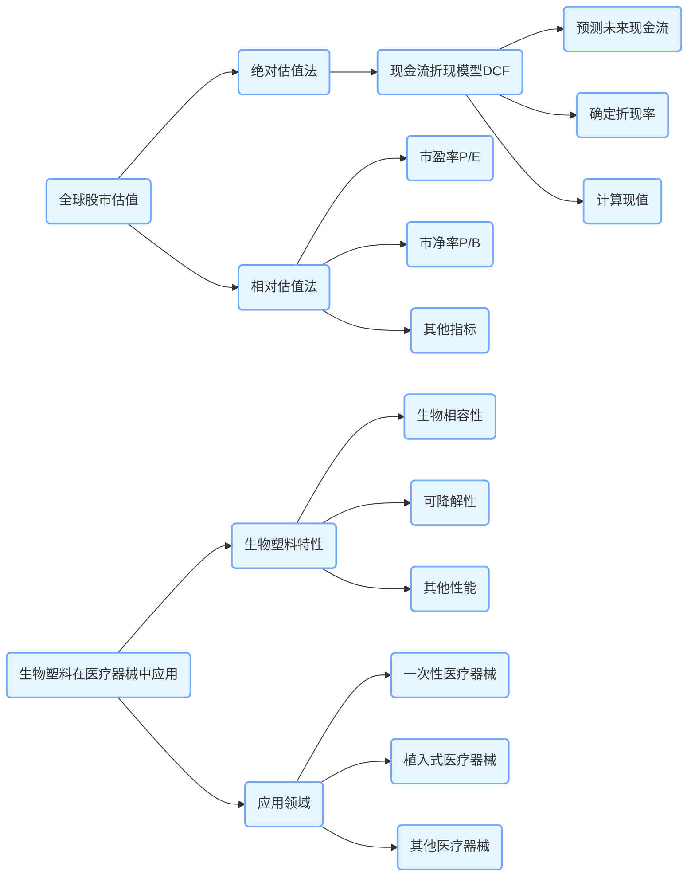

# 全球股市估值与生物塑料在医疗器械中的应用

> 关键词：全球股市估值、生物塑料、医疗器械、估值模型、应用前景

> 摘要：本文深入探讨了全球股市估值以及生物塑料在医疗器械中的应用这两个看似不相关却又存在潜在联系的领域。在全球股市估值部分，详细介绍了常见的估值方法、影响因素及相关数学模型，通过实际案例进行分析。在生物塑料在医疗器械应用方面，阐述了生物塑料的特性、核心概念，分析其应用原理、具体操作步骤，结合实际项目展示其在医疗器械中的具体应用，探讨了实际应用场景和未来发展趋势。旨在为投资者、医疗行业从业者以及相关研究人员提供全面且深入的参考。

## 1. 背景介绍 
### 1.1 目的和范围
全球股市作为经济的重要组成部分，其估值情况对于投资者、企业以及政策制定者都具有重要意义。准确的股市估值能够帮助投资者做出合理的投资决策，为企业的融资和发展提供参考，也有助于政策制定者把握经济形势。而生物塑料在医疗器械领域的应用则是近年来的一个新兴趋势，随着人们对环保和医疗安全的关注度不断提高，生物塑料凭借其独特的性能在医疗器械中展现出巨大的应用潜力。本文旨在全面分析全球股市估值的方法和影响因素，同时深入探讨生物塑料在医疗器械中的应用原理、实际案例和发展前景，涵盖了金融、材料科学和医学等多个领域。

### 1.2 预期读者
本文预期读者包括金融领域的投资者、分析师、基金经理，医疗行业的从业者如医疗器械研发人员、医生、医院管理人员，以及对材料科学和生物医学工程感兴趣的研究人员和学生。此外，政策制定者和关注经济与科技发展的普通读者也能从本文中获取有价值的信息。

### 1.3 文档结构概述
本文首先介绍全球股市估值和生物塑料在医疗器械应用的背景和相关基本概念。接着详细阐述全球股市估值的核心算法原理和生物塑料在医疗器械应用的具体操作步骤。然后通过数学模型和公式进一步解释相关原理，并结合实际案例进行说明。随后展示生物塑料在医疗器械应用的项目实战案例，包括开发环境搭建、源代码实现和代码解读。再探讨这两个领域的实际应用场景。之后推荐相关的学习资源、开发工具框架和论文著作。最后总结未来发展趋势与挑战，并提供常见问题与解答以及扩展阅读和参考资料。

### 1.4 术语表
#### 1.4.1 核心术语定义
- **全球股市估值**：对全球范围内股票市场中上市公司股票价值的评估过程，通过各种方法和模型确定股票的合理价格。
- **生物塑料**：以生物质为原料制成的塑料，具有可降解、生物相容性好等特点，区别于传统的石油基塑料。
- **医疗器械**：单独或者组合使用于人体的仪器、设备、器具、材料或者其他物品，包括所需要的软件。

#### 1.4.2 相关概念解释
- **市盈率（P/E）**：股票价格除以每股收益的比率，是衡量股票估值的常用指标，反映了投资者为获取公司每一元盈利所愿意支付的价格。
- **市净率（P/B）**：股票价格与每股净资产的比率，用于评估公司的账面价值和市场价值之间的关系。
- **生物相容性**：材料与生物体之间相互作用产生各种复杂的生物、物理、化学反应的一种概念，良好的生物相容性意味着材料在生物体内不会引起不良反应。

#### 1.4.3 缩略词列表
- **P/E**：Price-to-Earnings Ratio（市盈率）
- **P/B**：Price-to-Book Ratio（市净率）

## 2. 核心概念与联系 

### 全球股市估值核心概念
全球股市估值是一个复杂的过程，其核心目标是确定股票的内在价值。常见的估值方法包括绝对估值法和相对估值法。绝对估值法主要基于公司未来的现金流折现来计算股票的价值，例如现金流折现模型（DCF）。相对估值法是通过与同行业或类似公司的相关指标进行比较来评估股票的价值，常用的指标有市盈率（P/E）、市净率（P/B）等。

### 生物塑料在医疗器械中应用的核心概念
生物塑料是一种新型的高分子材料，其原料通常来源于可再生的生物质资源，如淀粉、纤维素等。在医疗器械中应用生物塑料，主要是利用其生物相容性、可降解性等特性，以减少对人体的潜在危害和对环境的污染。例如，在一些一次性医疗器械中使用可降解的生物塑料，在使用后可以自然分解，避免了传统塑料废弃物对环境的长期影响。

### 两者的联系
虽然全球股市估值和生物塑料在医疗器械中的应用看似属于不同的领域，但实际上存在一定的联系。随着生物塑料在医疗器械领域的应用不断扩大，相关企业的业绩可能会受到积极影响，从而影响其在股市中的估值。例如，一家专注于生物塑料医疗器械研发和生产的企业，如果其产品市场需求增加，销售额和利润上升，那么其股票价格可能会上涨，股市估值也会相应提高。

### 核心概念原理和架构的文本示意图
```plaintext
全球股市估值
|-- 绝对估值法
|   |-- 现金流折现模型（DCF）
|       |-- 预测未来现金流
|       |-- 确定折现率
|       |-- 计算现值
|-- 相对估值法
|   |-- 市盈率（P/E）
|   |-- 市净率（P/B）
|   |-- 其他指标

生物塑料在医疗器械中应用
|-- 生物塑料特性
|   |-- 生物相容性
|   |-- 可降解性
|   |-- 其他性能
|-- 应用领域
|   |-- 一次性医疗器械
|   |-- 植入式医疗器械
|   |-- 其他医疗器械
```

### Mermaid 流程图


## 3. 核心算法原理 & 具体操作步骤 

### 全球股市估值核心算法原理及Python代码实现
#### 现金流折现模型（DCF）原理
现金流折现模型的基本原理是将公司未来的现金流按照一定的折现率折现到当前时刻，从而得到公司的内在价值。其计算公式为：
$$V = \sum_{t=1}^{n} \frac{CF_t}{(1 + r)^t}$$
其中，$V$ 表示公司的内在价值，$CF_t$ 表示第 $t$ 期的现金流，$r$ 表示折现率，$n$ 表示预测的期数。

#### Python代码实现
```python
def dcf_valuation(cash_flows, discount_rate):
    """
    现金流折现模型计算公司内在价值
    :param cash_flows: 未来各期现金流列表
    :param discount_rate: 折现率
    :return: 公司内在价值
    """
    value = 0
    for t, cf in enumerate(cash_flows, start=1):
        value += cf / (1 + discount_rate) ** t
    return value

# 示例数据
cash_flows = [100, 120, 150, 180, 200]
discount_rate = 0.1

# 计算内在价值
intrinsic_value = dcf_valuation(cash_flows, discount_rate)
print(f"公司内在价值: {intrinsic_value}")
```

#### 具体操作步骤
1. **预测未来现金流**：分析公司的历史财务数据、行业发展趋势、市场竞争情况等因素，对公司未来各期的现金流进行预测。
2. **确定折现率**：折现率反映了投资者对投资风险的预期。通常可以使用资本资产定价模型（CAPM）来确定折现率，公式为：
$$r = R_f + \beta (R_m - R_f)$$
其中，$r$ 表示折现率，$R_f$ 表示无风险利率，$\beta$ 表示公司股票的贝塔系数，$R_m$ 表示市场收益率。
3. **计算现值**：将预测的未来现金流按照确定的折现率折现到当前时刻，求和得到公司的内在价值。

### 生物塑料在医疗器械中应用的具体操作步骤
#### 材料选择
根据医疗器械的具体应用需求，选择合适的生物塑料材料。例如，对于一次性注射器等短期使用的医疗器械，可以选择聚乳酸（PLA）等可降解生物塑料；对于植入式医疗器械，需要选择具有良好生物相容性的材料，如聚己内酯（PCL）。

#### 材料改性
为了满足医疗器械的性能要求，可能需要对生物塑料进行改性。例如，通过添加增塑剂、增强剂等添加剂来改善生物塑料的力学性能、加工性能等。

#### 成型加工
采用合适的成型加工方法将生物塑料制成所需的医疗器械形状。常见的成型加工方法包括注塑成型、挤出成型、吹塑成型等。

#### 性能测试
对制成的医疗器械进行性能测试，包括力学性能测试、生物相容性测试、可降解性能测试等，确保其符合相关标准和要求。

#### 灭菌处理
在医疗器械使用前，需要进行灭菌处理，以保证其安全性。常见的灭菌方法包括高温灭菌、辐射灭菌、化学灭菌等。

## 4. 数学模型和公式 & 详细讲解 & 举例说明 

### 全球股市估值数学模型和公式
#### 市盈率（P/E）模型
市盈率是股票价格与每股收益的比率，其计算公式为：
$$P/E = \frac{P}{EPS}$$
其中，$P$ 表示股票价格，$EPS$ 表示每股收益。

市盈率模型的基本思想是通过比较不同公司的市盈率来评估股票的相对估值。例如，假设同行业平均市盈率为 20，某公司的每股收益为 2 元，则根据市盈率模型，该公司的合理股票价格为：
$$P = P/E \times EPS = 20 \times 2 = 40 \text{ 元}$$

#### 市净率（P/B）模型
市净率是股票价格与每股净资产的比率，其计算公式为：
$$P/B = \frac{P}{BVPS}$$
其中，$P$ 表示股票价格，$BVPS$ 表示每股净资产。

市净率模型常用于评估资产价值较高的公司的估值。例如，某公司每股净资产为 10 元，同行业平均市净率为 1.5，则该公司的合理股票价格为：
$$P = P/B \times BVPS = 1.5 \times 10 = 15 \text{ 元}$$

### 生物塑料在医疗器械中应用的数学模型和公式
#### 生物降解动力学模型
生物塑料的降解过程可以用一级反应动力学模型来描述，其公式为：
$$\frac{dC}{dt} = -kC$$
其中，$C$ 表示生物塑料的浓度，$t$ 表示时间，$k$ 表示降解速率常数。

对上述公式进行积分，可以得到生物塑料浓度随时间变化的表达式：
$$C(t) = C_0 e^{-kt}$$
其中，$C_0$ 表示生物塑料的初始浓度。

例如，某生物塑料的初始浓度为 100 mg/L，降解速率常数 $k = 0.01 \text{ h}^{-1}$，则经过 100 小时后，生物塑料的浓度为：
$$C(100) = 100 e^{-0.01 \times 100} \approx 36.8 \text{ mg/L}$$

## 5. 项目实战：代码实际案例和详细解释说明 

### 5.1  开发环境搭建
#### 全球股市估值项目
- **编程语言**：Python
- **开发环境**：Anaconda + Jupyter Notebook
- **所需库**：pandas、numpy、matplotlib、yfinance 等

安装所需库的命令：
```sh
pip install pandas numpy matplotlib yfinance
```

#### 生物塑料在医疗器械中应用项目
- **材料实验设备**：注塑机、挤出机、拉力试验机、生物相容性测试设备等
- **模拟分析软件**：ABAQUS、ANSYS 等

### 5.2  源代码详细实现和代码解读
#### 全球股市估值项目
```python
import yfinance as yf
import pandas as pd
import matplotlib.pyplot as plt

# 获取股票数据
ticker = 'AAPL'  # 苹果公司股票代码
start_date = '2020-01-01'
end_date = '2023-01-01'
data = yf.download(ticker, start=start_date, end=end_date)

# 计算简单收益率
data['Simple_Return'] = (data['Close'] / data['Close'].shift(1)) - 1

# 绘制收益率曲线
plt.figure(figsize=(10, 6))
data['Simple_Return'].plot()
plt.title('Apple Stock Simple Return')
plt.xlabel('Date')
plt.ylabel('Simple Return')
plt.show()

# 计算市盈率
eps = 5.6  # 假设每股收益为 5.6 元
pe_ratio = data['Close'] / eps

# 绘制市盈率曲线
plt.figure(figsize=(10, 6))
pe_ratio.plot()
plt.title('Apple Stock P/E Ratio')
plt.xlabel('Date')
plt.ylabel('P/E Ratio')
plt.show()
```
**代码解读**：
1. **获取股票数据**：使用 `yfinance` 库从雅虎财经获取苹果公司股票的历史数据。
2. **计算简单收益率**：通过当前收盘价与前一天收盘价的比值减去 1 来计算简单收益率。
3. **绘制收益率曲线**：使用 `matplotlib` 库绘制简单收益率曲线，直观展示股票收益率的变化情况。
4. **计算市盈率**：假设每股收益为 5.6 元，用收盘价除以每股收益得到市盈率。
5. **绘制市盈率曲线**：绘制市盈率曲线，帮助分析股票的估值变化。

#### 生物塑料在医疗器械中应用项目
由于生物塑料在医疗器械中应用涉及大量的实验和模拟，以下仅给出一个简单的 Python 模拟生物塑料降解过程的代码示例。
```python
import numpy as np
import matplotlib.pyplot as plt

# 生物塑料降解参数
C0 = 100  # 初始浓度
k = 0.01  # 降解速率常数
t = np.linspace(0, 200, 100)  # 时间范围

# 计算生物塑料浓度随时间变化
C = C0 * np.exp(-k * t)

# 绘制降解曲线
plt.figure(figsize=(10, 6))
plt.plot(t, C)
plt.title('Biodegradation of Bioplastic')
plt.xlabel('Time (h)')
plt.ylabel('Concentration (mg/L)')
plt.show()
```
**代码解读**：
1. **定义参数**：定义生物塑料的初始浓度、降解速率常数和时间范围。
2. **计算浓度变化**：根据生物降解动力学模型计算生物塑料浓度随时间的变化。
3. **绘制降解曲线**：使用 `matplotlib` 库绘制生物塑料的降解曲线，直观展示降解过程。

### 5.3  代码解读与分析
#### 全球股市估值项目
通过计算股票的简单收益率和市盈率，我们可以对股票的收益情况和估值水平进行分析。收益率曲线可以帮助我们了解股票价格的波动情况，而市盈率曲线可以反映股票的相对估值变化。如果市盈率过高，可能意味着股票被高估；如果市盈率过低，可能意味着股票被低估。

#### 生物塑料在医疗器械中应用项目
生物塑料的降解曲线可以帮助我们了解其降解过程的快慢和趋势。通过调整降解速率常数等参数，可以模拟不同条件下生物塑料的降解情况，为医疗器械的设计和使用提供参考。例如，对于需要在体内快速降解的医疗器械，可以选择降解速率常数较大的生物塑料材料。

## 6. 实际应用场景 

### 全球股市估值的实际应用场景
#### 投资决策
投资者可以根据股票的估值情况来决定是否买入、持有或卖出股票。例如，如果某股票的估值明显低于其内在价值，投资者可能会认为该股票具有投资价值，从而选择买入；如果股票的估值过高，投资者可能会选择卖出或避免买入。

#### 企业融资
企业在进行股权融资时，需要确定合理的股票发行价格。通过股市估值方法，可以评估企业的价值，为股票发行价格的确定提供参考，确保企业能够获得合理的融资规模。

#### 宏观经济分析
全球股市估值情况可以反映宏观经济的运行状况。当股市整体估值较高时，可能意味着经济处于繁荣阶段；当股市估值较低时，可能意味着经济面临下行压力。政策制定者可以根据股市估值情况制定相应的宏观经济政策。

### 生物塑料在医疗器械中应用的实际应用场景
#### 一次性医疗器械
生物塑料可用于制造一次性注射器、输液器、手术手套等医疗器械。这些器械使用后可以自然降解，减少了医疗废弃物对环境的污染。例如，聚乳酸（PLA）制成的一次性注射器在使用后，经过一定时间可以在自然环境中分解为二氧化碳和水。

#### 植入式医疗器械
对于一些需要长期植入人体的医疗器械，如骨固定材料、血管支架等，生物塑料的生物相容性和可降解性使其成为理想的材料选择。例如，聚己内酯（PCL）制成的骨固定材料在骨折愈合后可以逐渐降解，避免了二次手术取出的麻烦。

#### 组织工程支架
生物塑料可以作为组织工程支架的材料，为细胞的生长和组织的修复提供支撑。例如，通过 3D 打印技术可以制备具有复杂结构的生物塑料组织工程支架，用于修复软骨、肝脏等组织器官。

## 7. 工具和资源推荐
### 7.1 学习资源推荐
#### 7.1.1 书籍推荐
- 《证券分析》（本杰明·格雷厄姆）：价值投资的经典著作，详细介绍了股票估值的基本方法和原则。
- 《金融市场与金融机构》（弗雷德里克·S·米什金）：全面介绍了金融市场和金融机构的相关知识，包括股票市场的运行机制和估值方法。
- 《生物材料科学：材料与活体系统的相互作用》（布赖恩·D·拉特纳）：系统阐述了生物材料的基本概念、性能和应用，对于了解生物塑料在医疗器械中的应用具有重要参考价值。

#### 7.1.2 在线课程
- Coursera 平台上的“金融市场”课程：由耶鲁大学教授罗伯特·席勒讲授，深入讲解金融市场的理论和实践，包括股票估值方法。
- edX 平台上的“生物医学工程基础”课程：介绍生物医学工程的基本概念和技术，包括生物材料在医疗器械中的应用。

#### 7.1.3 技术博客和网站
- 雪球网：提供股票市场的资讯、分析和讨论，投资者可以在上面了解股票估值的相关信息和观点。
- 生物谷：专注于生物医学领域的资讯和技术交流，包含生物塑料在医疗器械应用的最新研究成果和行业动态。

### 7.2 开发工具框架推荐
#### 7.2.1 IDE和编辑器
- PyCharm：功能强大的 Python 集成开发环境，适用于全球股市估值项目的开发。
- Visual Studio Code：轻量级的代码编辑器，支持多种编程语言，可用于生物塑料在医疗器械应用项目的代码编写。

#### 7.2.2 调试和性能分析工具
- IPython：交互式 Python 环境，方便对全球股市估值项目的代码进行调试和测试。
- MATLAB：具有强大的数值计算和数据分析功能，可用于生物塑料在医疗器械应用项目的模拟分析和性能测试。

#### 7.2.3 相关框架和库
- scikit-learn：Python 机器学习库，可用于全球股市估值项目中的数据分析和建模。
- OpenMM：开源分子模拟工具包，可用于生物塑料在医疗器械应用项目中的分子动力学模拟。

### 7.3 相关论文著作推荐
#### 7.3.1 经典论文
- Fama, E. F., & French, K. R. (1992). The cross-section of expected stock returns. Journal of Finance, 47(2), 427-465. 该论文提出了著名的 Fama-French 三因子模型，对股票估值和资产定价理论产生了深远影响。
- Langer, R., & Vacanti, J. P. (1993). Tissue engineering. Science, 260(5110), 920-926. 该论文首次提出了组织工程的概念，为生物材料在医疗器械中的应用奠定了理论基础。

#### 7.3.2 最新研究成果
- 关注《Nature》《Science》《Advanced Materials》等顶级学术期刊，获取生物塑料在医疗器械应用领域的最新研究成果。
- 通过 Web of Science、Scopus 等学术数据库，搜索全球股市估值和生物塑料在医疗器械应用方面的最新研究论文。

#### 7.3.3 应用案例分析
- 参考医疗器械企业的官方网站和年报，了解生物塑料在实际医疗器械产品中的应用案例和效果。
- 关注金融机构的研究报告，获取全球股市估值在投资决策和企业融资中的实际应用案例。

## 8. 总结：未来发展趋势与挑战
### 全球股市估值的未来发展趋势与挑战
#### 未来发展趋势
- **数字化和智能化**：随着大数据、人工智能等技术的发展，股市估值将更加依赖于数字化分析和智能化模型。例如，利用机器学习算法可以更准确地预测公司的未来现金流和股票价格。
- **国际化和全球化**：全球股市之间的联系日益紧密，跨国投资和并购活动不断增加。股市估值需要考虑更多的国际因素，如汇率波动、全球经济形势等。
- **绿色金融和可持续发展**：投资者对企业的环境、社会和治理（ESG）表现越来越关注，股市估值将更多地考虑企业的可持续发展能力。

#### 挑战
- **市场不确定性**：全球政治、经济形势的不确定性增加，如贸易摩擦、地缘政治冲突等，给股市估值带来了更大的挑战。
- **数据质量和隐私问题**：股市估值依赖于大量的数据，但数据的质量和隐私问题需要得到解决。例如，数据的准确性、完整性和安全性会影响估值模型的可靠性。
- **模型的局限性**：现有的股市估值模型存在一定的局限性，无法完全准确地反映股票的真实价值。例如，模型对未来不确定性的处理能力有限。

### 生物塑料在医疗器械中应用的未来发展趋势与挑战
#### 未来发展趋势
- **高性能生物塑料的研发**：不断研发具有更高性能的生物塑料，如更好的生物相容性、更强的力学性能和更快的降解速率，以满足医疗器械不断提高的性能要求。
- **3D 打印技术的应用**：3D 打印技术可以制造具有复杂结构的医疗器械，生物塑料与 3D 打印技术的结合将为医疗器械的个性化定制和精准制造提供更多可能。
- **跨学科合作**：生物塑料在医疗器械中的应用涉及材料科学、医学、生物学等多个学科，未来需要加强跨学科合作，推动该领域的发展。

#### 挑战
- **成本问题**：目前生物塑料的生产成本相对较高，限制了其在医疗器械中的大规模应用。需要进一步降低生物塑料的生产成本，提高其市场竞争力。
- **性能稳定性**：生物塑料的性能受到多种因素的影响，如原料来源、加工工艺等，其性能稳定性需要进一步提高，以确保医疗器械的质量和安全性。
- **监管和标准**：生物塑料在医疗器械中的应用需要符合相关的监管和标准要求。目前相关的监管和标准还不够完善，需要进一步加强和规范。

## 9. 附录：常见问题与解答
### 全球股市估值相关问题
#### 问：如何选择合适的股市估值方法？
答：选择合适的股市估值方法需要考虑公司的行业特点、财务状况、发展阶段等因素。例如，对于稳定盈利的成熟公司，可以使用市盈率法；对于具有较高成长性的公司，可以使用现金流折现模型。同时，也可以结合多种估值方法进行综合评估。

#### 问：股市估值中的折现率如何确定？
答：折现率可以使用资本资产定价模型（CAPM）来确定，公式为 $r = R_f + \beta (R_m - R_f)$，其中 $R_f$ 表示无风险利率，$\beta$ 表示公司股票的贝塔系数，$R_m$ 表示市场收益率。无风险利率可以参考国债收益率，贝塔系数可以通过历史数据计算或使用专业机构提供的数据，市场收益率可以参考股票市场的平均收益率。

### 生物塑料在医疗器械中应用相关问题
#### 问：生物塑料在医疗器械中的应用是否安全？
答：生物塑料在医疗器械中的应用通常是安全的。生物塑料具有良好的生物相容性，在生物体内不会引起明显的不良反应。同时，在医疗器械使用前会进行严格的性能测试和灭菌处理，确保其符合相关的安全标准。

#### 问：生物塑料的降解时间如何控制？
答：生物塑料的降解时间可以通过选择不同的材料、调整材料的组成和结构以及改变使用环境等方法来控制。例如，选择降解速率较快的生物塑料材料可以缩短降解时间；通过添加添加剂等方法可以改变生物塑料的降解性能。

## 10. 扩展阅读 & 参考资料
### 扩展阅读
- 《聪明的投资者》（本杰明·格雷厄姆）：进一步深入探讨价值投资的理念和方法，对于理解股市估值具有重要参考价值。
- 《生物医学材料》（王迎军）：全面介绍生物医学材料的种类、性能和应用，有助于深入了解生物塑料在医疗器械中的应用原理和技术。

### 参考资料
- 雅虎财经（https://finance.yahoo.com/）：提供全球股市的实时行情和历史数据。
- 美国食品药品监督管理局（FDA）官方网站（https://www.fda.gov/）：获取医疗器械相关的法规、标准和审批信息。
- 国际标准化组织（ISO）相关标准：了解生物塑料和医疗器械的国际标准和规范。