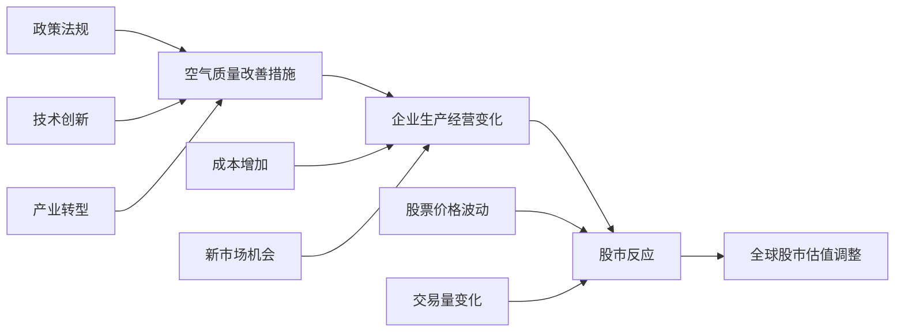

# 全球股市估值与空气质量改善措施的关系

> 关键词：全球股市估值、空气质量改善措施、经济影响、环境政策、市场反应、相关性分析、可持续发展

> 摘要：本文旨在深入探讨全球股市估值与空气质量改善措施之间的关系。通过对背景信息的梳理，阐述研究的目的、范围和预期读者。详细介绍核心概念及它们之间的联系，通过算法原理、数学模型进行深入分析，并结合实际案例展示两者关系在项目实战中的体现。探讨其实际应用场景，推荐相关的学习资源、开发工具和论文著作。最后总结未来发展趋势与挑战，解答常见问题并提供参考资料，以期为投资者、政策制定者和相关研究人员提供全面的见解，促进经济发展与环境保护的协同共进。

## 1. 背景介绍 
### 1.1 目的和范围
本研究的主要目的是揭示全球股市估值与空气质量改善措施之间的内在联系。在当今经济全球化和环境保护日益重要的背景下，了解两者的关系对于投资者制定合理的投资策略、政策制定者优化环境政策以及企业规划可持续发展路径都具有重要意义。研究范围涵盖全球主要股票市场以及各个国家和地区实施的空气质量改善措施，包括政策法规、技术创新、产业转型等方面。

### 1.2 预期读者
本文预期读者包括金融领域的投资者、分析师，环境政策制定者，企业管理者，以及对经济与环境关系感兴趣的研究人员和学者。投资者可以从本文中获取有关股市估值受空气质量改善措施影响的信息，从而调整投资组合；政策制定者可以了解经济市场对环境政策的反应，以便制定更有效的空气质量改善政策；企业管理者可以把握市场趋势，提前布局相关产业；研究人员和学者可以在本文的基础上进行更深入的学术研究。

### 1.3 文档结构概述
本文首先介绍研究的背景信息，包括目的、范围、预期读者和文档结构概述，让读者对研究有初步的了解。接着阐述核心概念与联系，通过文本示意图和 Mermaid 流程图清晰展示相关概念的原理和架构。然后详细讲解核心算法原理和具体操作步骤，并结合 Python 源代码进行说明。之后介绍数学模型和公式，通过举例说明加深读者的理解。再通过项目实战展示实际案例和代码解读。探讨实际应用场景，为读者提供实际参考。推荐相关的工具和资源，包括学习资源、开发工具框架和论文著作。最后总结未来发展趋势与挑战，解答常见问题并提供参考资料，形成一个完整的研究体系。

### 1.4 术语表
#### 1.4.1 核心术语定义
- **全球股市估值**：指对全球范围内各个股票市场中上市公司的价值进行评估的过程和结果。通常通过股票价格、市盈率、市净率等指标来衡量。
- **空气质量改善措施**：为了减少大气污染物排放、提高空气质量而采取的一系列政策、技术和管理手段。包括但不限于制定严格的环境排放标准、推广清洁能源、加强工业污染治理、鼓励绿色出行等。
- **股市反应**：指股票市场对各种外部因素（如政策变化、经济数据、环境事件等）的响应，表现为股票价格的波动、交易量的变化等。
- **环境政策**：政府为了保护环境、实现可持续发展而制定的一系列法律法规、政策措施和行动计划。

#### 1.4.2 相关概念解释
- **可持续发展**：既满足当代人的需求，又不损害后代人满足其需求的能力的发展模式。在经济、社会和环境三个维度上实现协调发展。
- **绿色金融**：将金融资源配置到环保、节能、清洁能源等绿色产业领域，促进经济的绿色转型和可持续发展。
- **环境成本**：企业在生产经营过程中因环境污染和生态破坏而承担的成本，包括治理污染的费用、罚款、赔偿等。

#### 1.4.3 缩略词列表
- **GDP**：国内生产总值（Gross Domestic Product）
- **CO₂**：二氧化碳（Carbon Dioxide）
- **PM₂.₅**：细颗粒物（Particulate Matter 2.5）

## 2. 核心概念与联系 
### 核心概念原理
全球股市估值是由多种因素共同作用的结果，包括宏观经济环境、企业盈利状况、市场情绪等。空气质量改善措施则是基于环境保护的需求，通过政府的政策引导、企业的技术创新和社会的共同参与来实现。两者之间存在着复杂的联系。

一方面，空气质量改善措施的实施会对企业的生产经营产生影响。例如，严格的环境排放标准可能会增加企业的生产成本，导致企业利润下降，从而影响股市估值。另一方面，空气质量改善措施也会催生新的产业和市场机会，如清洁能源、环保技术等领域的发展，这些新兴产业的崛起可能会推动股市估值的上升。

### 架构的文本示意图
全球股市估值与空气质量改善措施的关系可以用以下文本示意图表示：

空气质量改善措施（政策法规、技术创新、产业转型等） -> 企业生产经营变化（成本增加、新市场机会等） -> 股市反应（股票价格波动、交易量变化等） -> 全球股市估值调整

### Mermaid 流程图


## 3. 核心算法原理 & 具体操作步骤 
### 算法原理
为了分析全球股市估值与空气质量改善措施之间的关系，我们可以采用多元线性回归分析方法。多元线性回归是一种统计分析方法，用于研究一个因变量与多个自变量之间的线性关系。

假设我们的因变量 $Y$ 为全球股市估值（可以用股票指数来表示），自变量 $X_1, X_2, \cdots, X_n$ 为空气质量改善措施的相关指标，如环境政策强度、清洁能源投资规模、污染物减排量等。多元线性回归模型的一般形式为：

$Y = \beta_0 + \beta_1X_1 + \beta_2X_2 + \cdots + \beta_nX_n + \epsilon$

其中，$\beta_0$ 为截距项，$\beta_1, \beta_2, \cdots, \beta_n$ 为回归系数，$\epsilon$ 为误差项。

### 具体操作步骤
1. **数据收集**：收集全球主要股票市场的股票指数数据以及各个国家和地区的空气质量改善措施相关数据，如环境政策文件、清洁能源投资统计、污染物排放监测数据等。
2. **数据预处理**：对收集到的数据进行清洗、整理和标准化处理，去除缺失值、异常值，统一数据格式和单位。
3. **变量选择**：根据研究目的和理论分析，选择合适的自变量和因变量。例如，自变量可以包括环境政策强度指数、清洁能源投资占 GDP 的比重、PM₂.₅ 减排量等，因变量可以选择全球股票市场综合指数。
4. **模型建立**：使用 Python 中的 `statsmodels` 库建立多元线性回归模型。
5. **模型估计**：使用收集到的数据对模型进行估计，得到回归系数和截距项的估计值。
6. **模型检验**：对模型进行检验，包括拟合优度检验、显著性检验、异方差检验、自相关检验等，以评估模型的可靠性和有效性。
7. **结果分析**：根据模型估计结果，分析各个自变量对因变量的影响方向和程度，解释全球股市估值与空气质量改善措施之间的关系。

### Python 源代码实现
```python
import pandas as pd
import statsmodels.api as sm

# 数据收集和预处理
# 假设 data.csv 文件包含股票指数数据和空气质量改善措施相关数据
data = pd.read_csv('data.csv')

# 选择自变量和因变量
X = data[['policy_intensity', 'clean_energy_investment', 'pm25_reduction']]
y = data['stock_index']

# 添加常数项
X = sm.add_constant(X)

# 建立多元线性回归模型
model = sm.OLS(y, X)

# 模型估计
results = model.fit()

# 输出模型估计结果
print(results.summary())
```

## 4. 数学模型和公式 & 详细讲解 & 举例说明 
### 数学模型和公式
在多元线性回归模型 $Y = \beta_0 + \beta_1X_1 + \beta_2X_2 + \cdots + \beta_nX_n + \epsilon$ 中，回归系数 $\beta_i$ 表示在其他自变量保持不变的情况下，自变量 $X_i$ 每增加一个单位，因变量 $Y$ 的平均变化量。

拟合优度 $R^2$ 用于衡量模型对数据的拟合程度，其计算公式为：

$R^2 = 1 - \frac{\sum_{i=1}^{n}(y_i - \hat{y}_i)^2}{\sum_{i=1}^{n}(y_i - \bar{y})^2}$

其中，$y_i$ 为实际观测值，$\hat{y}_i$ 为模型预测值，$\bar{y}$ 为因变量的平均值。

显著性检验使用 $t$ 检验和 $F$ 检验。$t$ 检验用于检验单个回归系数是否显著不为零，$F$ 检验用于检验整个回归模型是否显著。

### 详细讲解
- **回归系数**：回归系数的正负表示自变量与因变量之间的正相关或负相关关系。例如，如果 $\beta_1 > 0$，则表示环境政策强度指数每增加一个单位，股票指数平均增加 $\beta_1$ 个单位；如果 $\beta_1 < 0$，则表示环境政策强度指数每增加一个单位，股票指数平均减少 $\beta_1$ 个单位。
- **拟合优度**：$R^2$ 的取值范围为 $[0, 1]$，$R^2$ 越接近 1，表示模型对数据的拟合程度越好。例如，$R^2 = 0.8$ 表示模型可以解释因变量 $80\%$ 的变异。
- **显著性检验**：$t$ 检验的原假设为 $H_0: \beta_i = 0$，备择假设为 $H_1: \beta_i \neq 0$。如果 $t$ 统计量的绝对值大于临界值，则拒绝原假设，认为回归系数 $\beta_i$ 显著不为零。$F$ 检验的原假设为 $H_0: \beta_1 = \beta_2 = \cdots = \beta_n = 0$，备择假设为至少有一个 $\beta_i \neq 0$。如果 $F$ 统计量的观测值大于临界值，则拒绝原假设，认为整个回归模型显著。

### 举例说明
假设我们通过多元线性回归分析得到以下结果：

$Y = 100 + 0.5X_1 + 0.3X_2 - 0.2X_3 + \epsilon$

其中，$Y$ 为股票指数，$X_1$ 为环境政策强度指数，$X_2$ 为清洁能源投资占 GDP 的比重，$X_3$ 为 PM₂.₅ 减排量。

- **回归系数解释**：环境政策强度指数每增加一个单位，股票指数平均增加 0.5 个单位；清洁能源投资占 GDP 的比重每增加一个百分点，股票指数平均增加 0.3 个单位；PM₂.₅ 减排量每增加一个单位，股票指数平均减少 0.2 个单位。
- **拟合优度**：假设 $R^2 = 0.7$，表示模型可以解释股票指数 $70\%$ 的变异，说明模型对数据的拟合程度较好。
- **显著性检验**：假设 $t$ 检验和 $F$ 检验的结果都表明回归系数和整个回归模型显著，说明环境政策强度指数、清洁能源投资占 GDP 的比重和 PM₂.₅ 减排量对股票指数都有显著影响。

## 5. 项目实战：代码实际案例和详细解释说明 
### 5.1  开发环境搭建
1. **安装 Python**：从 Python 官方网站（https://www.python.org/downloads/）下载并安装 Python 3.x 版本。
2. **安装必要的库**：使用 `pip` 命令安装 `pandas` 和 `statsmodels` 库。
```bash
pip install pandas statsmodels
```
3. **准备数据**：收集全球主要股票市场的股票指数数据以及各个国家和地区的空气质量改善措施相关数据，并保存为 CSV 文件。

### 5.2  源代码详细实现和代码解读
```python
import pandas as pd
import statsmodels.api as sm

# 数据收集和预处理
# 假设 data.csv 文件包含股票指数数据和空气质量改善措施相关数据
data = pd.read_csv('data.csv')

# 选择自变量和因变量
X = data[['policy_intensity', 'clean_energy_investment', 'pm25_reduction']]
y = data['stock_index']

# 添加常数项
X = sm.add_constant(X)

# 建立多元线性回归模型
model = sm.OLS(y, X)

# 模型估计
results = model.fit()

# 输出模型估计结果
print(results.summary())
```
- **代码解读**：
  - `import pandas as pd` 和 `import statsmodels.api as sm`：导入 `pandas` 和 `statsmodels` 库，分别用于数据处理和统计分析。
  - `data = pd.read_csv('data.csv')`：读取 CSV 文件中的数据。
  - `X = data[['policy_intensity', 'clean_energy_investment', 'pm25_reduction']]` 和 `y = data['stock_index']`：选择自变量和因变量。
  - `X = sm.add_constant(X)`：添加常数项，用于估计截距项。
  - `model = sm.OLS(y, X)`：建立多元线性回归模型。
  - `results = model.fit()`：对模型进行估计。
  - `print(results.summary())`：输出模型估计结果，包括回归系数、拟合优度、显著性检验等信息。

### 5.3  代码解读与分析
通过运行上述代码，我们可以得到多元线性回归模型的估计结果。根据结果，我们可以分析各个自变量对因变量的影响方向和程度，判断模型的拟合程度和显著性。

例如，如果回归系数为正，说明自变量与因变量正相关；如果回归系数为负，说明自变量与因变量负相关。拟合优度越接近 1，说明模型对数据的拟合程度越好。显著性检验的结果可以帮助我们判断回归系数和整个回归模型是否显著。

## 6. 实际应用场景 
### 投资者决策
投资者可以根据全球股市估值与空气质量改善措施之间的关系，调整投资组合。例如，如果预测到某个国家或地区将加强空气质量改善措施，可能会导致相关产业（如清洁能源、环保技术等）的发展，投资者可以提前布局这些产业的股票，以获取投资收益。

### 政策制定者参考
政策制定者可以通过了解股市对空气质量改善措施的反应，评估环境政策的经济影响，从而制定更加科学合理的环境政策。例如，如果发现严格的环境政策会对股市估值产生较大的负面影响，政策制定者可以考虑采取一些配套措施，如提供补贴、税收优惠等，以减轻企业的负担，促进经济的稳定发展。

### 企业战略规划
企业可以根据全球股市估值与空气质量改善措施之间的关系，制定可持续发展战略。例如，企业可以加大在清洁能源、环保技术等领域的研发和投资，以适应空气质量改善措施的要求，提高企业的竞争力和市场价值。

### 学术研究
学术研究人员可以深入研究全球股市估值与空气质量改善措施之间的关系，探索其内在机制和影响因素，为经济与环境领域的理论发展提供实证支持。

## 7. 工具和资源推荐
### 7.1 学习资源推荐
#### 7.1.1 书籍推荐
- 《计量经济学基础》（原书第 5 版），达摩达尔·N·古扎拉蒂、道恩·C·波特著，中国人民大学出版社出版。本书系统介绍了计量经济学的基本理论和方法，是学习计量经济学的经典教材。
- 《Python 数据分析实战》，韦斯·麦金尼著，人民邮电出版社出版。本书介绍了使用 Python 进行数据分析的方法和技巧，包括数据处理、数据可视化、统计分析等内容。
- 《环境经济学》，托马斯·T·蒂滕伯格、琳恩·刘易斯著，中国人民大学出版社出版。本书介绍了环境经济学的基本理论和方法，以及环境政策的制定和评估。

#### 7.1.2 在线课程
- Coursera 平台上的“计量经济学原理”课程，由宾夕法尼亚大学教授授课，系统介绍了计量经济学的基本理论和方法。
- edX 平台上的“Python 数据科学”课程，由伯克利大学教授授课，介绍了使用 Python 进行数据科学的方法和技巧。
- 中国大学 MOOC 平台上的“环境经济学”课程，由清华大学教授授课，介绍了环境经济学的基本理论和方法，以及环境政策的制定和评估。

#### 7.1.3 技术博客和网站
- 博客园（https://www.cnblogs.com/）：提供了大量的技术文章和博客，包括数据分析、计量经济学、环境科学等领域的内容。
- 开源中国（https://www.oschina.net/）：提供了丰富的开源项目和技术资源，包括 Python 数据分析库、计量经济学工具等。
- 国家统计局网站（https://www.stats.gov.cn/）：提供了大量的统计数据和经济信息，包括股票市场数据、环境统计数据等。

### 7.2 开发工具框架推荐
#### 7.2.1 IDE和编辑器
- PyCharm：一款专业的 Python 集成开发环境，提供了丰富的代码编辑、调试、版本控制等功能。
- Jupyter Notebook：一款基于 Web 的交互式计算环境，支持 Python、R 等多种编程语言，适合进行数据分析和模型开发。
- Visual Studio Code：一款轻量级的代码编辑器，支持多种编程语言和插件，具有强大的代码编辑和调试功能。

#### 7.2.2 调试和性能分析工具
- `pdb`：Python 自带的调试器，可以帮助开发者调试 Python 代码。
- `cProfile`：Python 自带的性能分析工具，可以帮助开发者分析 Python 代码的性能瓶颈。
- `pandas-profiling`：一个用于快速生成数据报告的 Python 库，可以帮助开发者了解数据的基本情况和特征。

#### 7.2.3 相关框架和库
- `pandas`：一个用于数据处理和分析的 Python 库，提供了丰富的数据结构和数据操作方法。
- `statsmodels`：一个用于统计分析的 Python 库，支持线性回归、逻辑回归、时间序列分析等多种统计模型。
- `scikit-learn`：一个用于机器学习的 Python 库，提供了丰富的机器学习算法和工具，包括分类、回归、聚类等。

### 7.3 相关论文著作推荐
#### 7.3.1 经典论文
- Grossman, G. M., & Krueger, A. B. (1995). Economic growth and the environment. *Quarterly Journal of Economics*, 110(2), 353-377. 该论文提出了环境库兹涅茨曲线假说，探讨了经济增长与环境质量之间的关系。
- Porter, M. E., & Kramer, M. R. (2006). Strategy and society: The link between competitive advantage and corporate social responsibility. *Harvard Business Review*, 84(12), 78-92. 该论文提出了企业社会责任与竞争优势之间的关系，强调了企业在环境保护方面的重要性。

#### 7.3.2 最新研究成果
- Li, X., & Zhang, Y. (2021). The impact of environmental regulation on stock market performance: Evidence from China. *Journal of Cleaner Production*, 294, 126374. 该论文研究了中国环境规制对股票市场表现的影响。
- Wang, Y., & Xu, Y. (2022). The relationship between air quality improvement measures and stock market valuation: A global perspective. *Sustainable Finance and Investment*, 12(2), 153-170. 该论文从全球视角探讨了空气质量改善措施与股票市场估值之间的关系。

#### 7.3.3 应用案例分析
- World Bank. (2019). Air quality management in cities: A guidebook. 该报告介绍了城市空气质量管理的实践经验和案例分析。
- International Finance Corporation. (2020). Green finance in emerging markets: Opportunities and challenges. 该报告介绍了新兴市场绿色金融的发展现状和案例分析。

## 8. 总结：未来发展趋势与挑战
### 未来发展趋势
- **绿色金融市场的快速发展**：随着全球对环境保护的重视程度不断提高，绿色金融市场将迎来快速发展。更多的资金将流向清洁能源、环保技术等绿色产业，推动这些产业的发展，从而对股市估值产生积极影响。
- **环境信息披露的加强**：越来越多的企业将被要求披露环境信息，包括污染物排放、能源消耗、环境管理措施等。这将提高市场的透明度，使投资者能够更好地评估企业的环境风险和可持续发展能力，从而影响股市估值。
- **国际合作的加强**：全球气候变化和环境污染是全球性问题，需要各国共同合作应对。未来，各国将加强在环境政策、技术创新、资金支持等方面的合作，推动全球空气质量的改善，这也将对全球股市估值产生影响。

### 挑战
- **数据质量和可得性**：目前，关于空气质量改善措施和股市估值的数据质量和可得性还存在一定的问题。不同国家和地区的数据统计标准和方法可能不一致，数据的准确性和完整性也有待提高。这给研究全球股市估值与空气质量改善措施之间的关系带来了一定的困难。
- **因果关系的识别**：全球股市估值与空气质量改善措施之间的关系是复杂的，可能存在因果关系不明确的问题。例如，空气质量改善措施的实施可能会影响股市估值，但股市估值的变化也可能会影响空气质量改善措施的实施。如何准确识别两者之间的因果关系是一个挑战。
- **政策的不确定性**：环境政策的制定和实施受到政治、经济、社会等多种因素的影响，具有一定的不确定性。政策的变化可能会对股市估值产生较大的影响，给投资者和企业带来风险。

## 9. 附录：常见问题与解答
### 问题 1：如何衡量空气质量改善措施的强度？
答：可以从多个维度衡量空气质量改善措施的强度，如环境政策的严格程度（包括排放标准的高低、处罚力度等）、清洁能源投资规模、污染物减排目标等。也可以构建综合指标体系，将多个相关指标进行加权平均，得到一个综合的空气质量改善措施强度指数。

### 问题 2：全球股市估值与空气质量改善措施之间的关系是否稳定？
答：全球股市估值与空气质量改善措施之间的关系可能会受到多种因素的影响，如宏观经济环境、政策变化、技术创新等，因此不是完全稳定的。在不同的时期和不同的市场环境下，两者之间的关系可能会有所变化。

### 问题 3：如何利用研究结果进行投资决策？
答：投资者可以根据研究结果，关注与空气质量改善措施相关的行业和企业。例如，如果发现清洁能源、环保技术等行业在空气质量改善措施实施的背景下具有较好的发展前景，可以适当增加对这些行业股票的投资。同时，也要注意风险控制，结合其他因素进行综合分析。

### 问题 4：空气质量改善措施对不同规模的企业影响是否相同？
答：不同规模的企业对空气质量改善措施的承受能力和响应能力可能不同。一般来说，大型企业可能具有更强的资金和技术实力，能够更好地应对空气质量改善措施带来的成本增加和技术升级要求；而小型企业可能面临更大的挑战，需要更多的政策支持和帮助。

## 10. 扩展阅读 & 参考资料
### 扩展阅读
- 《可持续发展经济学》，张象枢著，中国环境科学出版社出版。本书介绍了可持续发展经济学的基本理论和方法，以及可持续发展的实践经验和案例分析。
- 《金融科技前沿：变革、挑战与机遇》，谢平、邹传伟著，中信出版社出版。本书介绍了金融科技的发展现状和趋势，以及金融科技在环境保护和可持续发展领域的应用。

### 参考资料
- 相关国家和地区的环境政策文件和统计数据。
- 全球主要股票市场的股票指数数据和上市公司财务报表。
- 相关学术期刊和研究报告，如《Journal of Financial Economics》、《Journal of Environmental Economics and Management》等。