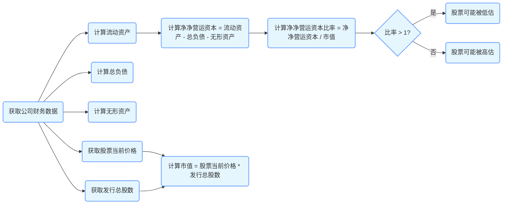

# 净净营运资本比率在股票筛选中的应用

> 关键词：净净营运资本比率、股票筛选、价值投资、财务分析、投资策略

> 摘要：本文深入探讨了净净营运资本比率在股票筛选中的应用。首先介绍了相关背景知识，包括目的、预期读者等。接着详细阐述了净净营运资本比率的核心概念、算法原理、数学模型。通过项目实战展示了如何在实际中运用该比率进行股票筛选，分析了代码实现和解读。还探讨了其实际应用场景，推荐了相关的学习资源、开发工具和论文著作。最后总结了未来发展趋势与挑战，并提供了常见问题解答和参考资料，旨在为投资者和相关从业者提供全面、深入的净净营运资本比率在股票筛选方面的知识和方法。

## 1. 背景介绍 
### 1.1 目的和范围
在股票投资领域，如何筛选出具有投资价值的股票一直是投资者关注的核心问题。净净营运资本比率作为一种重要的财务分析指标，为股票筛选提供了一种独特的视角。本文的目的在于详细介绍净净营运资本比率的概念、计算方法以及如何将其应用于股票筛选过程中，帮助投资者更好地评估股票的潜在价值和风险。

本文的范围涵盖了净净营运资本比率的理论基础、算法实现、实际应用案例以及相关资源推荐等方面。通过对这些内容的详细阐述，读者将能够全面了解净净营运资本比率在股票筛选中的作用和应用方法。

### 1.2 预期读者
本文的预期读者主要包括以下几类人群：
- **个人投资者**：希望通过学习专业的财务分析方法，提高股票投资的准确性和收益率。
- **金融从业者**：如证券分析师、基金经理等，需要深入了解各种财务指标，为投资决策提供支持。
- **金融专业学生**：通过阅读本文，加深对财务分析和股票投资的理解，将理论知识与实际应用相结合。

### 1.3 文档结构概述
本文将按照以下结构进行阐述：
- **核心概念与联系**：介绍净净营运资本比率的定义、相关概念以及它们之间的联系，并通过文本示意图和 Mermaid 流程图进行直观展示。
- **核心算法原理 & 具体操作步骤**：详细讲解净净营运资本比率的计算原理，并使用 Python 源代码进行实现。
- **数学模型和公式 & 详细讲解 & 举例说明**：给出净净营运资本比率的数学模型和公式，并通过具体例子进行详细讲解。
- **项目实战：代码实际案例和详细解释说明**：通过一个实际的项目案例，展示如何使用净净营运资本比率进行股票筛选，并对代码进行详细解读。
- **实际应用场景**：探讨净净营运资本比率在不同投资场景下的应用。
- **工具和资源推荐**：推荐相关的学习资源、开发工具和论文著作，帮助读者进一步深入学习。
- **总结：未来发展趋势与挑战**：总结净净营运资本比率在股票筛选中的应用现状，分析未来的发展趋势和面临的挑战。
- **附录：常见问题与解答**：解答读者在学习和应用过程中可能遇到的常见问题。
- **扩展阅读 & 参考资料**：提供相关的扩展阅读材料和参考资料，方便读者进一步研究。

### 1.4 术语表
#### 1.4.1 核心术语定义
- **净净营运资本（Net - Net Working Capital，NNWC）**：是指公司的流动资产减去总负债和无形资产后的余额。它反映了公司在短期内能够快速变现的资产净额。
- **净净营运资本比率（Net - Net Working Capital Ratio）**：是指公司的净净营运资本与公司市值的比率。该比率用于衡量公司股票的潜在价值。
- **市值（Market Capitalization）**：是指公司发行的所有股票的市场价值总和，计算公式为公司股票的当前价格乘以发行的总股数。

#### 1.4.2 相关概念解释
- **流动资产（Current Assets）**：是指企业可以在一年或者超过一年的一个营业周期内变现或者运用的资产，包括货币资金、短期投资、应收票据、应收账款和存货等。
- **总负债（Total Liabilities）**：是指企业承担并需要偿还的全部债务，包括流动负债和长期负债。
- **无形资产（Intangible Assets）**：是指企业拥有或者控制的没有实物形态的可辨认非货币性资产，如专利权、商标权、著作权等。

#### 1.4.3 缩略词列表
- NNWC：Net - Net Working Capital（净净营运资本）
- MC：Market Capitalization（市值）

## 2. 核心概念与联系 
### 核心概念原理
净净营运资本比率的核心思想源于价值投资理论。价值投资者认为，股票的内在价值是由公司的资产和盈利能力决定的。净净营运资本比率通过计算公司的净净营运资本与市值的比率，来评估公司股票的潜在价值。

当净净营运资本比率大于 1 时，意味着公司的净净营运资本超过了公司的市值。从理论上讲，此时公司的股票具有较高的投资价值，因为即使公司立即清算，其变现的资产也足以覆盖市值。相反，当净净营运资本比率小于 1 时，公司的股票可能被高估。

### 架构的文本示意图
```plaintext
净净营运资本比率
|
|-- 分子：净净营运资本
|   |-- 流动资产
|   |   |-- 货币资金
|   |   |-- 短期投资
|   |   |-- 应收票据
|   |   |-- 应收账款
|   |   |-- 存货
|   |
|   |-- 总负债
|   |
|   |-- 无形资产
|
|-- 分母：市值
|   |-- 股票当前价格
|   |-- 发行总股数
```

### Mermaid 流程图


## 3. 核心算法原理 & 具体操作步骤 
### 算法原理
净净营运资本比率的计算原理非常简单，其核心公式为：

$$净净营运资本比率 = \frac{净净营运资本}{市值}$$

其中，净净营运资本的计算公式为：

$$净净营运资本 = 流动资产 - 总负债 - 无形资产$$

市值的计算公式为：

$$市值 = 股票当前价格 \times 发行总股数$$

### 具体操作步骤
1. **获取公司财务数据**：从财务报表中获取公司的流动资产、总负债和无形资产数据。
2. **计算净净营运资本**：根据上述公式计算公司的净净营运资本。
3. **获取股票当前价格和发行总股数**：从金融数据平台获取公司股票的当前价格和发行总股数。
4. **计算市值**：根据上述公式计算公司的市值。
5. **计算净净营运资本比率**：将净净营运资本除以市值，得到净净营运资本比率。

### Python 源代码实现
```python
def calculate_nnwc(current_assets, total_liabilities, intangible_assets):
    """
    计算净净营运资本
    :param current_assets: 流动资产
    :param total_liabilities: 总负债
    :param intangible_assets: 无形资产
    :return: 净净营运资本
    """
    return current_assets - total_liabilities - intangible_assets

def calculate_market_cap(stock_price, total_shares):
    """
    计算市值
    :param stock_price: 股票当前价格
    :param total_shares: 发行总股数
    :return: 市值
    """
    return stock_price * total_shares

def calculate_nnwc_ratio(current_assets, total_liabilities, intangible_assets, stock_price, total_shares):
    """
    计算净净营运资本比率
    :param current_assets: 流动资产
    :param total_liabilities: 总负债
    :param intangible_assets: 无形资产
    :param stock_price: 股票当前价格
    :param total_shares: 发行总股数
    :return: 净净营运资本比率
    """
    nnwc = calculate_nnwc(current_assets, total_liabilities, intangible_assets)
    market_cap = calculate_market_cap(stock_price, total_shares)
    if market_cap == 0:
        return 0
    return nnwc / market_cap

# 示例数据
current_assets = 1000000
total_liabilities = 500000
intangible_assets = 100000
stock_price = 10
total_shares = 50000

# 计算净净营运资本比率
nnwc_ratio = calculate_nnwc_ratio(current_assets, total_liabilities, intangible_assets, stock_price, total_shares)
print(f"净净营运资本比率: {nnwc_ratio}")
```

## 4. 数学模型和公式 & 详细讲解 & 举例说明 
### 数学模型和公式
如前文所述，净净营运资本比率的数学模型和公式如下：

$$净净营运资本比率 = \frac{流动资产 - 总负债 - 无形资产}{股票当前价格 \times 发行总股数}$$

### 详细讲解
- **分子部分**：流动资产是公司短期内可以变现的资产，总负债是公司需要偿还的债务，无形资产虽然具有一定价值，但在清算时较难快速变现。因此，用流动资产减去总负债和无形资产得到的净净营运资本，反映了公司在短期内能够快速变现的资产净额。
- **分母部分**：股票当前价格乘以发行总股数得到的市值，反映了市场对公司的整体估值。

通过计算净净营运资本比率，可以将公司的实际资产价值与市场估值进行对比，从而判断股票是否被低估或高估。

### 举例说明
假设公司 A 的财务数据如下：
- 流动资产：$1000$ 万元
- 总负债：$500$ 万元
- 无形资产：$100$ 万元
- 股票当前价格：$10$ 元
- 发行总股数：$50$ 万股

首先，计算净净营运资本：

$$净净营运资本 = 1000 - 500 - 100 = 400（万元）$$

然后，计算市值：

$$市值 = 10 \times 50 = 500（万元）$$

最后，计算净净营运资本比率：

$$净净营运资本比率 = \frac{400}{500} = 0.8$$

由于净净营运资本比率小于 1，从理论上讲，公司 A 的股票可能被高估。

## 5. 项目实战：代码实际案例和详细解释说明 
### 5.1  开发环境搭建
#### 安装 Python
首先，确保你已经安装了 Python。可以从 Python 官方网站（https://www.python.org/downloads/）下载适合你操作系统的 Python 版本，并按照安装向导进行安装。

#### 安装必要的库
在本项目中，我们需要使用 `pandas` 库来处理财务数据，`yfinance` 库来获取股票价格数据。可以使用以下命令进行安装：

```sh
pip install pandas yfinance
```

### 5.2  源代码详细实现和代码解读
```python
import pandas as pd
import yfinance as yf

def get_financial_data(ticker):
    """
    获取公司的财务数据
    :param ticker: 股票代码
    :return: 包含流动资产、总负债和无形资产的 DataFrame
    """
    try:
        stock = yf.Ticker(ticker)
        balance_sheet = stock.balance_sheet
        current_assets = balance_sheet.loc['Total Current Assets'].iloc[0]
        total_liabilities = balance_sheet.loc['Total Liab'].iloc[0]
        intangible_assets = balance_sheet.loc['Intangible Assets'].iloc[0]
        data = {
            '流动资产': [current_assets],
            '总负债': [total_liabilities],
            '无形资产': [intangible_assets]
        }
        return pd.DataFrame(data)
    except Exception as e:
        print(f"获取财务数据时出错: {e}")
        return None

def get_stock_price_and_shares(ticker):
    """
    获取股票当前价格和发行总股数
    :param ticker: 股票代码
    :return: 股票当前价格和发行总股数
    """
    try:
        stock = yf.Ticker(ticker)
        stock_info = stock.info
        stock_price = stock_info['regularMarketPrice']
        total_shares = stock_info['sharesOutstanding']
        return stock_price, total_shares
    except Exception as e:
        print(f"获取股票价格和发行总股数时出错: {e}")
        return None, None

def calculate_nnwc_ratio_for_stock(ticker):
    """
    计算指定股票的净净营运资本比率
    :param ticker: 股票代码
    :return: 净净营运资本比率
    """
    financial_data = get_financial_data(ticker)
    if financial_data is None:
        return None
    current_assets = financial_data['流动资产'].values[0]
    total_liabilities = financial_data['总负债'].values[0]
    intangible_assets = financial_data['无形资产'].values[0]

    stock_price, total_shares = get_stock_price_and_shares(ticker)
    if stock_price is None or total_shares is None:
        return None

    nnwc = current_assets - total_liabilities - intangible_assets
    market_cap = stock_price * total_shares
    if market_cap == 0:
        return 0
    return nnwc / market_cap

# 示例股票代码
ticker = 'AAPL'
nnwc_ratio = calculate_nnwc_ratio_for_stock(ticker)
if nnwc_ratio is not None:
    print(f"{ticker} 的净净营运资本比率: {nnwc_ratio}")
```

### 5.3  代码解读与分析
- **`get_financial_data` 函数**：该函数使用 `yfinance` 库获取指定股票的财务数据，包括流动资产、总负债和无形资产。通过 `balance_sheet` 属性获取资产负债表数据，并从中提取所需的信息。
- **`get_stock_price_and_shares` 函数**：该函数使用 `yfinance` 库获取指定股票的当前价格和发行总股数。通过 `info` 属性获取股票的基本信息，并从中提取所需的信息。
- **`calculate_nnwc_ratio_for_stock` 函数**：该函数调用上述两个函数获取财务数据和股票价格、发行总股数，然后计算净净营运资本比率。
- **主程序**：指定一个示例股票代码（如 `AAPL`），调用 `calculate_nnwc_ratio_for_stock` 函数计算净净营运资本比率，并打印结果。

## 6. 实际应用场景 
### 价值投资筛选
净净营运资本比率可以作为价值投资的一个重要筛选指标。价值投资者通常会寻找那些被市场低估的股票，而净净营运资本比率大于 1 的股票往往具有较高的潜在价值。通过筛选出净净营运资本比率较高的股票，投资者可以构建一个具有较高安全边际的投资组合。

### 风险评估
净净营运资本比率也可以用于评估股票的风险。当净净营运资本比率较低时，说明公司的市值相对较高，而实际可变现资产相对较少，股票可能存在较高的估值风险。投资者可以通过分析净净营运资本比率，避免投资那些被高估的股票，降低投资风险。

### 行业比较
不同行业的公司具有不同的财务特征，净净营运资本比率也会有所差异。通过比较同一行业内不同公司的净净营运资本比率，投资者可以发现那些在行业内具有相对优势的公司。例如，在某个行业中，大部分公司的净净营运资本比率都较低，而某家公司的净净营运资本比率较高，那么这家公司可能具有更好的财务状况和投资价值。

## 7. 工具和资源推荐
### 7.1 学习资源推荐
#### 7.1.1 书籍推荐
- 《聪明的投资者》（The Intelligent Investor）：作者是本杰明·格雷厄姆（Benjamin Graham），这本书是价值投资的经典之作，详细介绍了价值投资的理念和方法，包括如何运用财务指标进行股票筛选。
- 《财务报表分析与证券定价》（Financial Statement Analysis and Security Valuation）：作者是斯蒂芬·佩因曼（Stephen Penman），该书深入讲解了财务报表分析的方法和技巧，以及如何运用财务数据进行证券定价。

#### 7.1.2 在线课程
- Coursera 上的“财务分析基础”（Foundations of Financial Analysis）课程：该课程由专业的金融教授授课，系统地介绍了财务分析的基本概念、方法和工具。
- edX 上的“投资学原理”（Principles of Investing）课程：该课程涵盖了投资学的各个方面，包括股票投资、财务分析等内容。

#### 7.1.3 技术博客和网站
- Seeking Alpha（https://seekingalpha.com/）：这是一个专业的金融投资网站，提供大量的股票分析文章和研究报告，其中不乏关于财务指标分析和股票筛选的内容。
- Investopedia（https://www.investopedia.com/）：这是一个知名的金融教育网站，提供丰富的金融知识和投资教程，包括财务指标的解释和应用。

### 7.2 开发工具框架推荐
#### 7.2.1 IDE和编辑器
- PyCharm：这是一款专业的 Python 集成开发环境，提供了丰富的代码编辑、调试和项目管理功能，适合开发 Python 财务分析程序。
- Jupyter Notebook：这是一个交互式的开发环境，支持 Python 代码的编写、运行和可视化，非常适合进行数据分析和实验。

#### 7.2.2 调试和性能分析工具
- pdb：Python 内置的调试器，可以帮助开发者逐步调试代码，查找和解决问题。
- cProfile：Python 内置的性能分析工具，可以分析代码的运行时间和资源消耗情况，帮助开发者优化代码性能。

#### 7.2.3 相关框架和库
- pandas：这是一个强大的数据分析库，提供了高效的数据结构和数据处理功能，适合处理财务数据。
- yfinance：这是一个用于获取金融数据的 Python 库，可以方便地获取股票价格、财务报表等数据。

### 7.3 相关论文著作推荐
#### 7.3.1 经典论文
- “The Relationship between Market Value and Book Value of Common Stock”（普通股市场价值与账面价值的关系）：该论文深入研究了股票市场价值与账面价值之间的关系，为财务指标在股票投资中的应用提供了理论基础。
- “Value Investing: The Use of Historical Financial Statement Information to Separate Winners from Losers”（价值投资：利用历史财务报表信息区分赢家和输家）：该论文探讨了如何运用财务报表信息进行价值投资，为净净营运资本比率等财务指标的应用提供了实证支持。

#### 7.3.2 最新研究成果
- 关注顶级金融学术期刊，如《Journal of Finance》（金融期刊）、《Review of Financial Studies》（金融研究评论）等，这些期刊会发表关于财务分析和股票投资的最新研究成果。

#### 7.3.3 应用案例分析
- 可以参考一些专业的金融研究报告和案例分析书籍，了解净净营运资本比率在实际投资中的应用案例和效果。

## 8. 总结：未来发展趋势与挑战
### 未来发展趋势
- **数据驱动的投资决策**：随着金融数据的不断丰富和数据分析技术的不断发展，未来投资者将更加依赖数据驱动的投资决策方法。净净营运资本比率作为一种重要的财务指标，将在数据驱动的投资决策中发挥更加重要的作用。
- **多指标综合应用**：单一的财务指标往往具有一定的局限性，未来投资者将更加注重多指标的综合应用。净净营运资本比率将与其他财务指标（如市盈率、市净率等）以及非财务指标（如行业竞争力、管理层能力等）相结合，构建更加全面、准确的股票筛选模型。
- **人工智能和机器学习的应用**：人工智能和机器学习技术的发展将为股票筛选带来新的机遇。通过运用人工智能和机器学习算法，可以对大量的财务数据和市场数据进行分析和挖掘，发现净净营运资本比率等指标与股票价格之间的潜在关系，提高股票筛选的准确性和效率。

### 挑战
- **数据质量问题**：净净营运资本比率的计算依赖于准确的财务数据，而财务数据的质量可能存在问题，如数据错误、数据造假等。投资者需要通过多种渠道获取数据，并进行数据清洗和验证，以确保数据的准确性。
- **市场环境变化**：股票市场是一个复杂多变的系统，市场环境的变化可能会影响净净营运资本比率的有效性。例如，在市场泡沫时期，股票价格可能会普遍高估，导致净净营运资本比率的筛选效果受到影响。投资者需要结合市场环境的变化，灵活运用净净营运资本比率进行股票筛选。
- **行业差异**：不同行业的公司具有不同的财务特征和经营模式，净净营运资本比率在不同行业的应用效果可能会有所差异。投资者需要了解不同行业的特点，对净净营运资本比率进行适当的调整和修正，以提高筛选的准确性。

## 9. 附录：常见问题与解答
### 问题 1：净净营运资本比率是否适用于所有行业的股票筛选？
答：净净营运资本比率并不是适用于所有行业的股票筛选。不同行业的公司具有不同的财务特征和经营模式，例如，金融行业的公司主要以金融资产和负债为主，其净净营运资本的计算和含义可能与其他行业有所不同。因此，在使用净净营运资本比率进行股票筛选时，需要结合行业特点进行分析和判断。

### 问题 2：净净营运资本比率大于 1 的股票是否一定具有投资价值？
答：净净营运资本比率大于 1 只是表明公司的净净营运资本超过了市值，从理论上讲具有一定的投资价值。但这并不意味着这些股票一定具有投资价值，还需要考虑其他因素，如公司的盈利能力、行业前景、管理层能力等。此外，净净营运资本比率只是一个静态的指标，不能反映公司的未来发展潜力。

### 问题 3：如何获取准确的财务数据来计算净净营运资本比率？
答：可以通过以下几种途径获取准确的财务数据：
- 公司官方网站：大多数上市公司会在其官方网站上公布定期财务报告，包括资产负债表、利润表和现金流量表等。
- 金融数据平台：如东方财富、同花顺等金融数据平台，提供了丰富的财务数据和分析工具。
- 证券交易所网站：证券交易所会要求上市公司定期披露财务信息，可以通过证券交易所网站获取相关数据。

### 问题 4：净净营运资本比率与其他财务指标（如市盈率、市净率）有什么关系？
答：净净营运资本比率、市盈率和市净率都是用于评估股票投资价值的财务指标，但它们的侧重点不同。净净营运资本比率主要关注公司的资产价值，反映了公司在短期内能够快速变现的资产净额与市值的关系；市盈率主要关注公司的盈利能力，反映了公司股票价格与每股盈利的关系；市净率主要关注公司的净资产价值，反映了公司股票价格与每股净资产的关系。在实际应用中，可以将这些指标结合起来使用，以更全面地评估股票的投资价值。

## 10. 扩展阅读 & 参考资料
### 扩展阅读
- 《证券分析》（Security Analysis）：作者是本杰明·格雷厄姆和戴维·多德（David Dodd），这本书是价值投资的另一部经典之作，深入探讨了证券分析的理论和方法。
- 《巴菲特致股东的信：股份公司教程》（The Essays of Warren Buffett: Lessons for Corporate America）：作者是沃伦·巴菲特（Warren Buffett），这本书收录了巴菲特历年致股东的信，从中可以学习到巴菲特的投资理念和方法。

### 参考资料
- 各上市公司的财务报告和公告。
- 金融数据平台提供的相关数据和分析报告。
- 相关的金融学术期刊和研究报告。