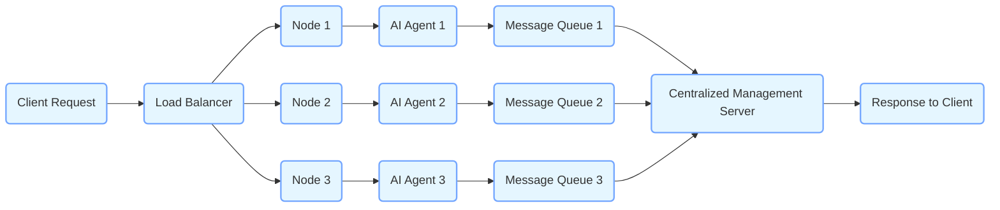

# 分布式部署：构建高可用的AI Agent系统

> 关键词：分布式部署、AI Agent系统、高可用性、负载均衡、容错机制

> 摘要：本文聚焦于分布式部署在构建高可用AI Agent系统中的应用。首先介绍了相关背景知识，包括目的范围、预期读者等。接着阐述了核心概念与联系，剖析了分布式部署和AI Agent系统的原理及架构。通过Python代码详细讲解了核心算法原理与具体操作步骤，并给出了数学模型和公式。结合项目实战，从开发环境搭建到源代码实现与解读进行了全面分析。探讨了实际应用场景，推荐了学习资源、开发工具框架以及相关论文著作。最后总结了未来发展趋势与挑战，提供了常见问题解答和扩展阅读参考资料，旨在为开发者构建高可用的AI Agent系统提供全面的技术指导。

## 1. 背景介绍 
### 1.1 目的和范围
在当今数字化时代，AI Agent系统的应用越来越广泛，涵盖了智能客服、自动化任务处理、数据分析等多个领域。然而，随着业务规模的不断扩大和用户需求的日益增长，单一节点的AI Agent系统往往难以满足高并发、高可用性的要求。分布式部署作为一种有效的解决方案，可以将AI Agent系统的各个组件分散到多个节点上运行，从而提高系统的性能、可扩展性和容错能力。

本文的目的是深入探讨分布式部署在构建高可用AI Agent系统中的应用，包括核心概念、算法原理、数学模型、项目实战等方面。范围涵盖了分布式部署的基本原理、常见的分布式架构、AI Agent系统的特点和需求，以及如何将两者结合起来构建高可用的系统。

### 1.2 预期读者
本文主要面向对分布式系统、人工智能和AI Agent技术感兴趣的开发者、架构师和技术爱好者。读者需要具备一定的编程基础，熟悉Python编程语言和常见的数据结构与算法。同时，对分布式系统的基本概念和原理有一定的了解将有助于更好地理解本文的内容。

### 1.3 文档结构概述
本文将按照以下结构进行组织：
1. 背景介绍：介绍本文的目的、范围、预期读者和文档结构。
2. 核心概念与联系：阐述分布式部署和AI Agent系统的核心概念、原理和架构，并给出相关的文本示意图和Mermaid流程图。
3. 核心算法原理 & 具体操作步骤：详细讲解分布式部署中常用的算法原理，如负载均衡算法、容错算法等，并使用Python源代码进行具体实现。
4. 数学模型和公式 & 详细讲解 & 举例说明：给出分布式部署和AI Agent系统的数学模型和公式，并通过具体的例子进行详细讲解。
5. 项目实战：代码实际案例和详细解释说明：结合实际项目，介绍如何搭建开发环境、实现源代码，并对代码进行详细解读和分析。
6. 实际应用场景：探讨分布式部署在不同领域的AI Agent系统中的实际应用场景。
7. 工具和资源推荐：推荐学习资源、开发工具框架和相关论文著作，帮助读者进一步深入学习和研究。
8. 总结：未来发展趋势与挑战：总结分布式部署在构建高可用AI Agent系统中的关键要点，分析未来的发展趋势和面临的挑战。
9. 附录：常见问题与解答：提供常见问题的解答，帮助读者解决在学习和实践过程中遇到的问题。
10. 扩展阅读 & 参考资料：列出扩展阅读的相关资料和参考文献，方便读者进一步查阅和学习。

### 1.4 术语表
#### 1.4.1 核心术语定义
- **分布式部署**：将系统的各个组件分散到多个节点上运行，通过网络进行通信和协作，以提高系统的性能、可扩展性和容错能力。
- **AI Agent系统**：由多个智能代理组成的系统，每个智能代理可以独立地感知环境、做出决策和执行任务，通过协作实现系统的整体目标。
- **高可用性**：系统在面对各种故障和异常情况时，仍然能够保持正常运行，提供不间断的服务。
- **负载均衡**：将系统的负载均匀地分配到多个节点上，避免某个节点负载过高而导致性能下降或故障。
- **容错机制**：系统在出现故障时能够自动检测、隔离和恢复，保证系统的正常运行。

#### 1.4.2 相关概念解释
- **节点**：分布式系统中的一个计算单元，可以是一台服务器、一个虚拟机或一个容器。
- **集群**：由多个节点组成的集合，这些节点通过网络连接在一起，共同完成系统的任务。
- **代理**：AI Agent系统中的一个智能实体，具有感知、决策和执行的能力。
- **消息队列**：一种异步通信机制，用于在不同节点之间传递消息和数据。

#### 1.4.3 缩略词列表
- **RPC**：Remote Procedure Call，远程过程调用
- **REST**：Representational State Transfer，表述性状态传递
- **MQ**：Message Queue，消息队列
- **HA**：High Availability，高可用性
- **LB**：Load Balancing，负载均衡

## 2. 核心概念与联系 
### 2.1 分布式部署原理
分布式部署的核心思想是将系统的各个组件分散到多个节点上运行，通过网络进行通信和协作。这样可以提高系统的性能、可扩展性和容错能力。分布式部署的常见架构包括客户端 - 服务器架构、对等网络架构和混合架构。

在客户端 - 服务器架构中，客户端向服务器发送请求，服务器处理请求并返回响应。服务器可以是单个节点，也可以是多个节点组成的集群。在对等网络架构中，每个节点都可以作为客户端和服务器，节点之间直接进行通信和协作。混合架构则结合了客户端 - 服务器架构和对等网络架构的特点。

### 2.2 AI Agent系统原理
AI Agent系统由多个智能代理组成，每个智能代理可以独立地感知环境、做出决策和执行任务。智能代理通常具有以下几个特点：
- **自主性**：能够独立地感知环境、做出决策和执行任务，不需要外部干预。
- **反应性**：能够对环境的变化做出及时的反应。
- **社会性**：能够与其他智能代理进行通信和协作，共同完成系统的任务。
- **目标导向性**：具有明确的目标，并能够通过一系列的行动来实现这些目标。

### 2.3 分布式部署与AI Agent系统的联系
分布式部署可以为AI Agent系统提供更好的性能、可扩展性和容错能力。通过将AI Agent系统的各个组件分散到多个节点上运行，可以提高系统的并发处理能力，避免单个节点负载过高。同时，分布式部署还可以提高系统的容错能力，当某个节点出现故障时，其他节点可以继续正常运行，保证系统的高可用性。

### 2.4 文本示意图
下面是一个简单的分布式AI Agent系统的文本示意图：

```plaintext
+-------------------+         +-------------------+         +-------------------+
|       Node 1      |         |       Node 2      |         |       Node 3      |
| +-------------+   |         | +-------------+   |         | +-------------+   |
| |  AI Agent 1 |   |         | |  AI Agent 2 |   |         | |  AI Agent 3 |   |
| +-------------+   |         | +-------------+   |         | +-------------+   |
| | Message Queue |   |         | | Message Queue |   |         | | Message Queue |   |
| +-------------+   |         | +-------------+   |         | +-------------+   |
| | Load Balancer |   |         | | Load Balancer |   |         | | Load Balancer |   |
| +-------------+   |         | +-------------+   |         | +-------------+   |
+-------------------+         +-------------------+         +-------------------+
                |                         |                         |
                |                         |                         |
                +-------------------------+-------------------------+
                                       |
                                       |
                                 +-------------+
                                 |  Centralized |
                                 |  Management |
                                 |    Server   |
                                 +-------------+
```

### 2.5 Mermaid流程图


## 3. 核心算法原理 & 具体操作步骤 
### 3.1 负载均衡算法原理
负载均衡是分布式部署中常用的技术，用于将系统的负载均匀地分配到多个节点上。常见的负载均衡算法包括轮询算法、随机算法、加权轮询算法和最小连接数算法。

#### 3.1.1 轮询算法
轮询算法按照顺序依次将请求分配到各个节点上。例如，有三个节点 Node1、Node2 和 Node3，请求 1 分配到 Node1，请求 2 分配到 Node2，请求 3 分配到 Node3，请求 4 又分配到 Node1，以此类推。

以下是使用 Python 实现的轮询算法示例代码：
```python
class RoundRobinLoadBalancer:
    def __init__(self, nodes):
        self.nodes = nodes
        self.index = 0

    def get_next_node(self):
        node = self.nodes[self.index]
        self.index = (self.index + 1) % len(self.nodes)
        return node

# 使用示例
nodes = ['Node1', 'Node2', 'Node3']
lb = RoundRobinLoadBalancer(nodes)
for i in range(5):
    print(lb.get_next_node())
```

#### 3.1.2 随机算法
随机算法随机选择一个节点来处理请求。以下是使用 Python 实现的随机算法示例代码：
```python
import random

class RandomLoadBalancer:
    def __init__(self, nodes):
        self.nodes = nodes

    def get_next_node(self):
        return random.choice(self.nodes)

# 使用示例
nodes = ['Node1', 'Node2', 'Node3']
lb = RandomLoadBalancer(nodes)
for i in range(5):
    print(lb.get_next_node())
```

#### 3.1.3 加权轮询算法
加权轮询算法根据节点的性能或负载情况为每个节点分配一个权重，然后按照权重的比例依次将请求分配到各个节点上。例如，节点 Node1 的权重为 2，节点 Node2 的权重为 1，节点 Node3 的权重为 1，那么请求的分配顺序可能是 Node1、Node1、Node2、Node3、Node1、Node1 等。

以下是使用 Python 实现的加权轮询算法示例代码：
```python
class WeightedRoundRobinLoadBalancer:
    def __init__(self, nodes, weights):
        self.nodes = nodes
        self.weights = weights
        self.current_index = 0
        self.current_weight = 0
        self.gcd = self._gcd(*weights)
        self.max_weight = max(weights)

    def _gcd(self, *numbers):
        from math import gcd
        result = numbers[0]
        for num in numbers[1:]:
            result = gcd(result, num)
        return result

    def get_next_node(self):
        while True:
            self.current_index = (self.current_index + 1) % len(self.nodes)
            if self.current_index == 0:
                self.current_weight = self.current_weight - self.gcd
                if self.current_weight <= 0:
                    self.current_weight = self.max_weight
                    if self.current_weight == 0:
                        return None
            if self.weights[self.current_index] >= self.current_weight:
                return self.nodes[self.current_index]

# 使用示例
nodes = ['Node1', 'Node2', 'Node3']
weights = [2, 1, 1]
lb = WeightedRoundRobinLoadBalancer(nodes, weights)
for i in range(5):
    print(lb.get_next_node())
```

#### 3.1.4 最小连接数算法
最小连接数算法选择当前连接数最少的节点来处理请求。以下是一个简化的最小连接数算法示例代码：
```python
class LeastConnectionsLoadBalancer:
    def __init__(self, nodes):
        self.nodes = nodes
        self.connections = {node: 0 for node in nodes}

    def get_next_node(self):
        min_connections = float('inf')
        selected_node = None
        for node, conn in self.connections.items():
            if conn < min_connections:
                min_connections = conn
                selected_node = node
        self.connections[selected_node] += 1
        return selected_node

    def release_connection(self, node):
        self.connections[node] -= 1

# 使用示例
nodes = ['Node1', 'Node2', 'Node3']
lb = LeastConnectionsLoadBalancer(nodes)
for i in range(5):
    node = lb.get_next_node()
    print(node)
    # 模拟处理完成，释放连接
    lb.release_connection(node)
```

### 3.2 容错算法原理
容错机制是保证分布式系统高可用性的关键。常见的容错算法包括心跳检测算法、主从复制算法和分布式共识算法。

#### 3.2.1 心跳检测算法
心跳检测算法通过定期发送心跳消息来检测节点的状态。如果某个节点在一定时间内没有收到心跳消息，则认为该节点出现故障。以下是一个简单的心跳检测算法示例代码：
```python
import time
import threading

class HeartbeatMonitor:
    def __init__(self, nodes, interval=5):
        self.nodes = nodes
        self.interval = interval
        self.node_status = {node: True for node in nodes}
        self.thread = threading.Thread(target=self._monitor)
        self.thread.daemon = True
        self.thread.start()

    def _monitor(self):
        while True:
            for node in self.nodes:
                # 模拟发送心跳消息
                try:
                    # 这里可以替换为实际的心跳检测逻辑
                    print(f"Sending heartbeat to {node}")
                    time.sleep(1)
                    # 假设如果没有异常则表示节点正常
                    self.node_status[node] = True
                except Exception as e:
                    print(f"Node {node} is down: {e}")
                    self.node_status[node] = False
            time.sleep(self.interval)

    def is_node_alive(self, node):
        return self.node_status.get(node, False)

# 使用示例
nodes = ['Node1', 'Node2', 'Node3']
hb_monitor = HeartbeatMonitor(nodes)
while True:
    for node in nodes:
        print(f"Node {node} is alive: {hb_monitor.is_node_alive(node)}")
    time.sleep(10)
```

#### 3.2.2 主从复制算法
主从复制算法用于将主节点的数据复制到从节点，以提高数据的可用性和容错能力。当主节点出现故障时，从节点可以晋升为主节点继续提供服务。以下是一个简单的主从复制算法示例代码：
```python
class MasterSlaveReplication:
    def __init__(self, master, slaves):
        self.master = master
        self.slaves = slaves
        self.data = {}

    def write_data(self, key, value):
        # 写入主节点
        self.data[key] = value
        # 复制到从节点
        for slave in self.slaves:
            try:
                # 这里可以替换为实际的复制逻辑
                print(f"Replicating data {key}:{value} to {slave}")
            except Exception as e:
                print(f"Failed to replicate data to {slave}: {e}")

    def read_data(self, key):
        # 优先从主节点读取数据
        if key in self.data:
            return self.data[key]
        # 从从节点读取数据
        for slave in self.slaves:
            try:
                # 这里可以替换为实际的读取逻辑
                print(f"Reading data {key} from {slave}")
                return self.data.get(key)
            except Exception as e:
                print(f"Failed to read data from {slave}: {e}")
        return None

# 使用示例
master = 'MasterNode'
slaves = ['SlaveNode1', 'SlaveNode2']
replication = MasterSlaveReplication(master, slaves)
replication.write_data('key1', 'value1')
print(replication.read_data('key1'))
```

#### 3.2.3 分布式共识算法
分布式共识算法用于在多个节点之间达成一致的决策。常见的分布式共识算法包括 Paxos、Raft 等。以下是一个简化的 Raft 算法示例代码：
```python
import random
import time

class RaftNode:
    def __init__(self, node_id, nodes):
        self.node_id = node_id
        self.nodes = nodes
        self.state = 'follower'
        self.leader = None
        self.current_term = 0
        self.voted_for = None
        self.log = []
        self.election_timeout = random.randint(150, 300) / 1000
        self.last_heartbeat_time = time.time()

    def start(self):
        while True:
            if self.state == 'follower':
                if time.time() - self.last_heartbeat_time > self.election_timeout:
                    self._become_candidate()
            elif self.state == 'candidate':
                self._start_election()
            elif self.state == 'leader':
                self._send_heartbeats()
            time.sleep(0.1)

    def _become_candidate(self):
        self.state = 'candidate'
        self.current_term += 1
        self.voted_for = self.node_id
        print(f"Node {self.node_id} becomes candidate in term {self.current_term}")

    def _start_election(self):
        votes = 1  # 自己给自己投票
        for node in self.nodes:
            if node!= self.node_id:
                # 模拟发送投票请求
                print(f"Node {self.node_id} sends vote request to {node} in term {self.current_term}")
                # 假设收到一半以上的投票就当选为 leader
                if random.random() > 0.5:
                    votes += 1
        if votes > len(self.nodes) / 2:
            self._become_leader()

    def _become_leader(self):
        self.state = 'leader'
        self.leader = self.node_id
        print(f"Node {self.node_id} becomes leader in term {self.current_term}")

    def _send_heartbeats(self):
        for node in self.nodes:
            if node!= self.node_id:
                # 模拟发送心跳消息
                print(f"Node {self.node_id} sends heartbeat to {node} in term {self.current_term}")
        self.last_heartbeat_time = time.time()

# 使用示例
nodes = [RaftNode(i, [0, 1, 2]) for i in range(3)]
for node in nodes:
    import threading
    t = threading.Thread(target=node.start)
    t.daemon = True
    t.start()
time.sleep(10)
```

## 4. 数学模型和公式 & 详细讲解 & 举例说明 
### 4.1 负载均衡数学模型
#### 4.1.1 轮询算法数学模型
轮询算法的数学模型可以用一个循环序列来表示。假设节点集合为 $N = \{n_1, n_2, \cdots, n_m\}$，请求序列为 $R = \{r_1, r_2, \cdots, r_k\}$。轮询算法将请求 $r_i$ 分配到节点 $n_j$ 上，其中 $j = (i - 1) \bmod m + 1$。

例如，有三个节点 $N = \{n_1, n_2, n_3\}$，请求序列 $R = \{r_1, r_2, r_3, r_4, r_5\}$。根据轮询算法，请求分配如下：
- $r_1$ 分配到 $n_1$，因为 $(1 - 1) \bmod 3 + 1 = 1$
- $r_2$ 分配到 $n_2$，因为 $(2 - 1) \bmod 3 + 1 = 2$
- $r_3$ 分配到 $n_3$，因为 $(3 - 1) \bmod 3 + 1 = 3$
- $r_4$ 分配到 $n_1$，因为 $(4 - 1) \bmod 3 + 1 = 1$
- $r_5$ 分配到 $n_2$，因为 $(5 - 1) \bmod 3 + 1 = 2$

#### 4.1.2 加权轮询算法数学模型
加权轮询算法的数学模型需要考虑节点的权重。假设节点集合为 $N = \{n_1, n_2, \cdots, n_m\}$，对应的权重集合为 $W = \{w_1, w_2, \cdots, w_m\}$。设当前权重为 $cw$，最大权重为 $mw$，最大公约数为 $gcd$。

算法步骤如下：
1. 初始化 $cw = mw$，当前节点索引 $i = 0$。
2. 循环执行以下步骤：
    - $i = (i + 1) \bmod m$
    - 如果 $i = 0$，则 $cw = cw - gcd$
    - 如果 $cw \leq 0$，则 $cw = mw$
    - 如果 $w_i \geq cw$，则选择节点 $n_i$

例如，节点集合 $N = \{n_1, n_2, n_3\}$，权重集合 $W = \{2, 1, 1\}$，$gcd = 1$，$mw = 2$。请求分配过程如下：
- 初始 $cw = 2$，$i = 0$，选择 $n_1$
- $i = 1$，$cw = 2$，选择 $n_1$
- $i = 2$，$cw = 2$，不选择 $n_2$
- $i = 0$，$cw = 1$，选择 $n_2$
- $i = 1$，$cw = 1$，选择 $n_3$

#### 4.1.3 最小连接数算法数学模型
最小连接数算法的数学模型可以用一个连接数向量来表示。设节点集合为 $N = \{n_1, n_2, \cdots, n_m\}$，对应的连接数向量为 $C = \{c_1, c_2, \cdots, c_m\}$。每次请求到来时，选择连接数最小的节点，即选择节点 $n_j$ 使得 $c_j = \min\{c_1, c_2, \cdots, c_m\}$。

例如，节点集合 $N = \{n_1, n_2, n_3\}$，连接数向量 $C = \{2, 1, 3\}$。则下一个请求将分配到 $n_2$ 节点。

### 4.2 容错算法数学模型
#### 4.2.1 心跳检测算法数学模型
心跳检测算法的数学模型可以用一个时间间隔和一个状态向量来表示。设节点集合为 $N = \{n_1, n_2, \cdots, n_m\}$，状态向量为 $S = \{s_1, s_2, \cdots, s_m\}$，其中 $s_i$ 表示节点 $n_i$ 的状态（$s_i = 1$ 表示正常，$s_i = 0$ 表示故障）。心跳间隔为 $T$。

每隔时间 $T$，向每个节点发送心跳消息。如果在时间 $T$ 内没有收到某个节点的响应，则将该节点的状态置为 0。

#### 4.2.2 主从复制算法数学模型
主从复制算法的数学模型可以用一个数据集合和一个复制关系来表示。设主节点为 $M$，从节点集合为 $S = \{s_1, s_2, \cdots, s_m\}$，数据集合为 $D = \{d_1, d_2, \cdots, d_k\}$。当主节点 $M$ 写入数据 $d_i$ 时，需要将数据复制到所有从节点 $s_j$ 上。

#### 4.2.3 分布式共识算法数学模型
分布式共识算法（如 Raft 算法）的数学模型比较复杂，涉及到状态机、日志复制、选举等多个方面。这里简单介绍 Raft 算法的一些关键数学概念。

Raft 算法中的状态可以用一个三元组 $(T, V, L)$ 来表示，其中 $T$ 表示当前任期，$V$ 表示当前节点投票给的节点，$L$ 表示日志。选举过程中，节点需要在当前任期内获得超过一半节点的投票才能成为领导者。

设节点集合为 $N = \{n_1, n_2, \cdots, n_m\}$，当节点 $n_i$ 发起选举时，需要向其他节点发送投票请求。如果收到超过 $\frac{m}{2}$ 个节点的投票，则 $n_i$ 成为领导者。

## 5. 项目实战：代码实际案例和详细解释说明 
### 5.1 开发环境搭建
#### 5.1.1 安装 Python
首先，确保你已经安装了 Python 3.x 版本。可以从 Python 官方网站（https://www.python.org/downloads/） 下载并安装适合你操作系统的 Python 版本。

#### 5.1.2 安装必要的库
在本项目中，我们将使用一些常见的 Python 库，如 `Flask` 用于构建 Web 服务，`Redis` 用于消息队列。可以使用以下命令安装这些库：
```sh
pip install flask redis
```

#### 5.1.3 安装 Redis
Redis 是一个开源的内存数据存储系统，常用于消息队列和缓存。可以从 Redis 官方网站（https://redis.io/download） 下载并安装 Redis。安装完成后，启动 Redis 服务器：
```sh
redis-server
```

### 5.2 源代码详细实现和代码解读
#### 5.2.1 实现 AI Agent 节点
以下是一个简单的 AI Agent 节点的实现代码：
```python
from flask import Flask
import redis

app = Flask(__name__)
r = redis.Redis(host='localhost', port=6379, db=0)

@app.route('/process_task/<task>', methods=['GET'])
def process_task(task):
    # 模拟处理任务
    result = f"Task {task} processed by AI Agent"
    # 将结果存入消息队列
    r.rpush('task_results', result)
    return result

if __name__ == '__main__':
    app.run(host='0.0.0.0', port=5000)
```
**代码解读**：
- 导入 `Flask` 和 `redis` 库。
- 创建一个 Flask 应用实例 `app`，并连接到本地的 Redis 服务器。
- 定义一个路由 `/process_task/<task>`，用于处理任务。当接收到任务请求时，模拟处理任务并将结果存入 Redis 消息队列。
- 最后启动 Flask 应用。

#### 5.2.2 实现负载均衡器
以下是一个简单的负载均衡器的实现代码：
```python
import requests
import random

nodes = ['http://localhost:5000', 'http://localhost:5001']

def load_balance(task):
    # 随机选择一个节点
    node = random.choice(nodes)
    url = f"{node}/process_task/{task}"
    try:
        response = requests.get(url)
        return response.text
    except Exception as e:
        return f"Error: {e}"

if __name__ == '__main__':
    task = 'test_task'
    result = load_balance(task)
    print(result)
```
**代码解读**：
- 定义一个节点列表 `nodes`，包含两个 AI Agent 节点的地址。
- 实现一个 `load_balance` 函数，用于随机选择一个节点并将任务发送给该节点。
- 最后测试负载均衡器，发送一个测试任务并打印结果。

#### 5.2.3 实现消息队列消费者
以下是一个简单的消息队列消费者的实现代码：
```python
import redis

r = redis.Redis(host='localhost', port=6379, db=0)

while True:
    result = r.lpop('task_results')
    if result:
        print(f"Received result: {result.decode('utf-8')}")
    else:
        break
```
**代码解读**：
- 连接到本地的 Redis 服务器。
- 循环从 Redis 消息队列中取出任务结果并打印。如果队列为空，则退出循环。

### 5.3 代码解读与分析
#### 5.3.1 AI Agent 节点分析
AI Agent 节点使用 Flask 框架构建了一个简单的 Web 服务，通过路由 `/process_task/<task>` 接收任务请求。当接收到任务时，模拟处理任务并将结果存入 Redis 消息队列。这种实现方式使得 AI Agent 节点可以独立运行，并且可以通过网络接收任务请求。

#### 5.3.2 负载均衡器分析
负载均衡器使用随机算法选择一个节点来处理任务。这种算法简单易懂，但可能会导致节点负载不均衡。在实际应用中，可以根据节点的性能和负载情况选择更合适的负载均衡算法，如轮询算法、加权轮询算法或最小连接数算法。

#### 5.3.3 消息队列消费者分析
消息队列消费者使用 Redis 的列表数据结构来存储任务结果。通过循环从列表中取出结果并处理，可以实现异步处理任务结果的功能。这种方式可以提高系统的吞吐量和响应性能。

## 6. 实际应用场景 
### 6.1 智能客服系统
在智能客服系统中，分布式部署的 AI Agent 系统可以处理大量的用户咨询请求。通过负载均衡器将请求均匀地分配到多个 AI Agent 节点上，可以提高系统的并发处理能力。同时，容错机制可以保证系统在某个节点出现故障时仍然能够正常运行，提供不间断的服务。

例如，一个电商平台的智能客服系统，每天会收到成千上万的用户咨询请求。使用分布式部署的 AI Agent 系统，可以将这些请求分配到多个节点上处理，避免单个节点负载过高。当某个节点出现故障时，其他节点可以继续处理请求，保证用户能够及时得到回复。

### 6.2 自动化任务处理系统
自动化任务处理系统通常需要处理大量的重复性任务，如数据采集、数据清洗、报表生成等。分布式部署的 AI Agent 系统可以将这些任务分配到多个节点上并行处理，提高任务处理的效率。

例如，一个金融机构的自动化报表生成系统，每天需要生成大量的财务报表。使用分布式部署的 AI Agent 系统，可以将报表生成任务分配到多个节点上同时处理，大大缩短报表生成的时间。

### 6.3 数据分析与预测系统
数据分析与预测系统需要处理大量的数据，并进行复杂的数据分析和模型训练。分布式部署的 AI Agent 系统可以将数据和计算任务分配到多个节点上，提高数据处理和模型训练的速度。

例如，一个电商平台的用户行为分析系统，需要对海量的用户行为数据进行分析和预测。使用分布式部署的 AI Agent 系统，可以将数据分散到多个节点上进行处理，同时利用多个节点的计算资源进行模型训练，提高分析和预测的准确性和效率。

## 7. 工具和资源推荐
### 7.1 学习资源推荐
#### 7.1.1 书籍推荐
- 《分布式系统原理与范型》：介绍了分布式系统的基本原理、架构和算法，是学习分布式系统的经典教材。
- 《Python 分布式计算实战》：通过实际案例介绍了如何使用 Python 实现分布式计算，包括分布式文件系统、分布式数据库、分布式消息队列等。
- 《人工智能：一种现代的方法》：全面介绍了人工智能的基本概念、算法和应用，对理解 AI Agent 系统有很大的帮助。

#### 7.1.2 在线课程
- Coursera 上的“分布式系统”课程：由知名高校的教授授课，系统地介绍了分布式系统的原理和实践。
- edX 上的“Python 数据科学”课程：介绍了 Python 在数据科学领域的应用，包括数据分析、机器学习等。
- Udemy 上的“人工智能实战”课程：通过实际项目介绍了人工智能的应用和开发，包括 AI Agent 系统的开发。

#### 7.1.3 技术博客和网站
- 开源中国（https://www.oschina.net/）：提供了丰富的开源技术资讯和技术文章，包括分布式系统、人工智能等领域。
- 知乎（https://www.zhihu.com/）：有很多关于分布式系统和人工智能的讨论和分享，可以从中获取到最新的技术动态和实践经验。
- Medium（https://medium.com/）：有很多技术专家和开发者在上面分享自己的技术文章和经验，是学习技术的好去处。

### 7.2 开发工具框架推荐
#### 7.2.1 IDE和编辑器
- PyCharm：是一款专门为 Python 开发设计的集成开发环境，提供了丰富的功能和插件，方便开发者进行代码编写、调试和管理。
- Visual Studio Code：是一款轻量级的代码编辑器，支持多种编程语言，包括 Python。它具有丰富的插件生态系统，可以根据自己的需求进行扩展。
- Jupyter Notebook：是一个交互式的开发环境，适合进行数据分析和机器学习的实验和开发。它可以将代码、文本、图表等内容整合在一起，方便展示和分享。

#### 7.2.2 调试和性能分析工具
- pdb：是 Python 自带的调试工具，可以帮助开发者定位代码中的问题。
- cProfile：是 Python 自带的性能分析工具，可以分析代码的运行时间和函数调用情况，帮助开发者优化代码性能。
- Py-Spy：是一个轻量级的 Python 性能分析工具，可以实时监控 Python 程序的运行状态，找出性能瓶颈。

#### 7.2.3 相关框架和库
- Flask：是一个轻量级的 Python Web 框架，适合快速开发 Web 应用和服务。
- Django：是一个功能强大的 Python Web 框架，提供了丰富的功能和插件，适合开发大型的 Web 应用。
- Redis：是一个开源的内存数据存储系统，常用于消息队列、缓存和分布式锁等场景。
- Celery：是一个分布式任务队列框架，用于异步处理任务和定时任务。

### 7.3 相关论文著作推荐
#### 7.3.1 经典论文
- 《Paxos Made Simple》：介绍了 Paxos 算法的基本原理和实现，是分布式共识算法的经典论文。
- 《The Part-Time Parliament》：是 Paxos 算法的原始论文，详细介绍了 Paxos 算法的设计和实现。
- 《Raft: In Search of an Understandable Consensus Algorithm》：介绍了 Raft 算法的基本原理和实现，是一种易于理解和实现的分布式共识算法。

#### 7.3.2 最新研究成果
- 《Distributed Machine Learning: Algorithms, Systems, and Challenges》：介绍了分布式机器学习的最新研究成果和发展趋势，包括分布式优化算法、分布式训练系统等。
- 《AI Agents for Smart Cities: A Survey》：对智能城市中 AI Agent 系统的应用和研究进行了综述，介绍了最新的研究成果和发展趋势。
- 《Fault-Tolerant Distributed Systems: A Survey》：对容错分布式系统的研究进行了综述，介绍了常见的容错算法和技术。

#### 7.3.3 应用案例分析
- 《Case Studies in Distributed Systems》：通过实际案例介绍了分布式系统的设计和实现，包括分布式文件系统、分布式数据库、分布式计算等。
- 《AI Agent Applications in Healthcare》：介绍了 AI Agent 系统在医疗领域的应用案例，包括疾病诊断、治疗方案推荐等。
- 《Distributed AI in Autonomous Vehicles》：介绍了分布式 AI 在自动驾驶汽车中的应用案例，包括传感器融合、决策规划等。

## 8. 总结：未来发展趋势与挑战
### 8.1 未来发展趋势
#### 8.1.1 智能化与自动化
未来的 AI Agent 系统将更加智能化和自动化。AI Agent 可以通过学习和进化不断提高自己的能力，自动感知环境变化并做出相应的决策。同时，系统的自动化程度也将不断提高，减少人工干预，提高系统的效率和可靠性。

#### 8.1.2 分布式与协作
分布式部署将成为构建大规模 AI Agent 系统的主流方式。多个 AI Agent 可以分布在不同的节点上，通过网络进行通信和协作，共同完成复杂的任务。同时，不同的 AI Agent 系统之间也可以进行协作，实现更强大的功能。

#### 8.1.3 融合与创新
AI Agent 系统将与其他技术如物联网、区块链、云计算等进行融合，创造出更多的创新应用。例如，AI Agent 可以与物联网设备结合，实现智能感知和控制；与区块链技术结合，实现数据的安全共享和可信交易。

### 8.2 挑战
#### 8.2.1 性能与可扩展性
随着系统规模的不断扩大和用户需求的不断增长，AI Agent 系统的性能和可扩展性将面临更大的挑战。如何设计高效的分布式架构和算法，提高系统的并发处理能力和可扩展性，是需要解决的关键问题。

#### 8.2.2 容错与可靠性
分布式系统的容错和可靠性是保证系统正常运行的关键。在 AI Agent 系统中，如何设计有效的容错机制，及时检测和处理节点故障，保证系统的可靠性和可用性，是需要解决的重要问题。

#### 8.2.3 安全与隐私
AI Agent 系统通常需要处理大量的敏感数据，如用户信息、业务数据等。如何保证数据的安全和隐私，防止数据泄露和恶意攻击，是需要解决的重要问题。同时，AI Agent 的决策过程也需要保证透明和可解释，避免出现不可预测的结果。

## 9. 附录：常见问题与解答
### 9.1 分布式部署和集中式部署有什么区别？
分布式部署将系统的各个组件分散到多个节点上运行，通过网络进行通信和协作。而集中式部署将系统的所有组件集中在一个节点上运行。分布式部署具有更好的性能、可扩展性和容错能力，但也增加了系统的复杂性和管理难度。集中式部署则相对简单，但在面对大规模数据和高并发请求时，性能和可扩展性较差。

### 9.2 如何选择合适的负载均衡算法？
选择合适的负载均衡算法需要考虑多个因素，如节点的性能、负载情况、请求的特点等。如果节点的性能差异不大，请求比较均匀，可以选择轮询算法或随机算法。如果节点的性能差异较大，可以选择加权轮询算法。如果需要考虑节点的当前负载情况，可以选择最小连接数算法。

### 9.3 如何保证分布式系统的一致性？
保证分布式系统的一致性是一个复杂的问题，常见的方法包括使用分布式共识算法（如 Paxos、Raft 等）、主从复制、分布式锁等。分布式共识算法可以在多个节点之间达成一致的决策，保证数据的一致性。主从复制可以将主节点的数据复制到从节点，提高数据的可用性和一致性。分布式锁可以保证在多个节点之间对共享资源的互斥访问，避免数据冲突。

### 9.4 如何提高 AI Agent 系统的安全性？
提高 AI Agent 系统的安全性可以从多个方面入手，如数据加密、访问控制、身份认证、安全审计等。对敏感数据进行加密处理，防止数据泄露。设置严格的访问控制策略，限制用户对系统资源的访问权限。采用可靠的身份认证机制，确保用户的身份合法。定期进行安全审计，及时发现和处理安全漏洞。

## 10. 扩展阅读 & 参考资料
### 10.1 扩展阅读
- 《云原生技术原理与实践》：介绍了云原生技术的基本原理和实践，包括容器、微服务、DevOps 等，对理解分布式部署和高可用系统有很大的帮助。
- 《人工智能深度学习实战》：深入介绍了深度学习的原理和应用，包括神经网络、卷积神经网络、循环神经网络等，对开发 AI Agent 系统有很大的帮助。
- 《分布式系统设计模式》：介绍了分布式系统中常见的设计模式和最佳实践，如负载均衡、容错、缓存等，对构建高可用的 AI Agent 系统有很大的指导意义。

### 10.2 参考资料
- 维基百科：https://en.wikipedia.org/
- IEEE Xplore：https://ieeexplore.ieee.org/
- ACM Digital Library：https://dl.acm.org/

以上就是关于分布式部署构建高可用的 AI Agent 系统的详细介绍，希望对读者有所帮助。在实际开发中，可以根据具体的需求和场景选择合适的技术和方法，构建出高效、可靠的 AI Agent 系统。