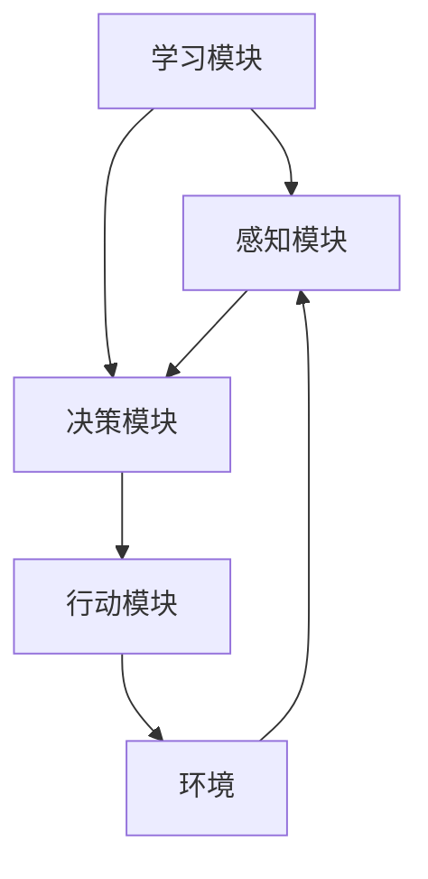
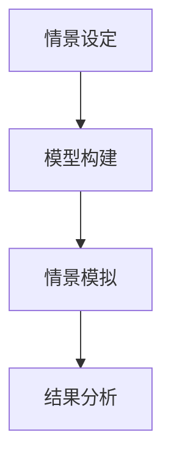

# 利用AI agents进行情景分析：增强价值投资的适应性

> 关键词：AI agents、情景分析、价值投资、适应性、金融科技

> 摘要：本文聚焦于利用AI agents进行情景分析以增强价值投资适应性这一主题。首先介绍了相关背景，包括目的范围、预期读者等内容。接着阐述了AI agents、情景分析和价值投资的核心概念及它们之间的联系。深入讲解了核心算法原理，通过Python代码详细阐述操作步骤，并给出了相关的数学模型和公式。在项目实战部分，展示了代码实际案例并进行详细解释。探讨了该技术在实际中的应用场景，推荐了学习、开发工具和相关论文著作。最后总结了未来发展趋势与挑战，解答常见问题并提供扩展阅读和参考资料，旨在为投资者和研究者提供全面的技术指导和深入的思考。

## 1. 背景介绍 
### 1.1 目的和范围
在当今复杂多变的金融市场中，价值投资作为一种经典的投资策略，面临着诸多挑战。市场环境的不确定性、信息的海量性和复杂性，使得传统的价值投资方法在适应性方面存在一定的局限性。本文章的目的在于探讨如何利用AI agents进行情景分析，以增强价值投资的适应性，帮助投资者更准确地评估投资价值，做出更明智的投资决策。

本文章的范围涵盖了AI agents、情景分析和价值投资的基本概念、核心算法原理、数学模型，以及实际应用案例等方面。通过对这些内容的深入研究，为投资者和相关研究人员提供理论支持和实践指导。

### 1.2 预期读者
本文的预期读者包括金融投资者，他们希望借助先进的技术手段提升价值投资的效果；金融科技领域的从业者，关注AI在金融领域的创新应用；以及相关专业的研究人员和学生，对AI agents和价值投资的结合感兴趣，希望深入了解相关技术和理论。

### 1.3 文档结构概述
本文首先介绍背景信息，包括目的、预期读者和文档结构概述等。接着阐述核心概念，分析它们之间的联系。然后详细讲解核心算法原理和具体操作步骤，给出数学模型和公式。通过项目实战展示代码实际案例并进行解读。探讨实际应用场景，推荐相关的学习资源、开发工具和论文著作。最后总结未来发展趋势与挑战，解答常见问题并提供扩展阅读和参考资料。

### 1.4 术语表
#### 1.4.1 核心术语定义
- **AI agents（人工智能智能体）**：是一种能够感知环境、根据内部状态和目标进行决策，并采取行动以实现目标的人工智能实体。它可以自主地与环境进行交互，不断学习和适应环境的变化。
- **情景分析**：是一种通过对各种可能的未来情景进行模拟和分析，评估投资项目或资产在不同情景下的表现和风险的方法。
- **价值投资**：是一种基于对资产内在价值的评估，寻找被低估的资产进行投资的策略。投资者通过分析资产的基本面，如财务状况、行业前景等，来确定其内在价值，并在价格低于内在价值时买入，等待价格回归价值。

#### 1.4.2 相关概念解释
- **人工智能**：是一门研究如何使计算机系统能够模拟人类智能的学科，包括机器学习、深度学习、自然语言处理等多个领域。
- **机器学习**：是人工智能的一个重要分支，它通过让计算机从数据中学习模式和规律，来实现预测、分类等任务。
- **深度学习**：是一种基于神经网络的机器学习方法，它通过构建多层神经网络，自动学习数据的特征和模式，在图像识别、语音识别等领域取得了显著的成果。

#### 1.4.3 缩略词列表
- **AI**：Artificial Intelligence（人工智能）
- **ML**：Machine Learning（机器学习）
- **DL**：Deep Learning（深度学习）

## 2. 核心概念与联系 

### 2.1 AI agents的原理和架构
AI agents的基本原理是感知环境、决策和行动。它通过传感器感知环境信息，然后根据内部的决策机制进行决策，最后通过执行器采取行动。AI agents的架构通常包括以下几个部分：

- **感知模块**：负责收集环境信息，如市场数据、新闻资讯等。
- **决策模块**：根据感知到的信息和内部的目标，进行决策。决策模块可以采用各种算法，如机器学习算法、规则引擎等。
- **行动模块**：根据决策结果，采取相应的行动，如买入或卖出资产。
- **学习模块**：通过不断地与环境交互，学习和优化自身的决策机制。

以下是AI agents架构的Mermaid流程图：


### 2.2 情景分析的原理和方法
情景分析的基本原理是通过设定不同的情景，模拟未来可能的发展趋势，评估投资项目或资产在不同情景下的表现和风险。情景分析的方法通常包括以下几个步骤：

- **情景设定**：根据历史数据、专家意见和市场趋势，设定不同的情景，如乐观情景、悲观情景和中性情景。
- **模型构建**：根据情景设定，构建相应的模型，如财务模型、市场模型等。
- **情景模拟**：利用构建的模型，对不同情景下的投资项目或资产进行模拟，得到相应的结果。
- **结果分析**：对情景模拟的结果进行分析，评估投资项目或资产在不同情景下的表现和风险。

以下是情景分析流程的Mermaid流程图：


### 2.3 价值投资的原理和策略
价值投资的基本原理是认为资产的价格会围绕其内在价值波动。投资者通过分析资产的基本面，如财务状况、行业前景等，来确定其内在价值，并在价格低于内在价值时买入，等待价格回归价值。价值投资的策略通常包括以下几个方面：

- **基本面分析**：通过分析资产的财务报表、行业竞争格局等，评估其内在价值。
- **安全边际**：在买入资产时，要确保价格有足够的安全边际，即价格低于内在价值的幅度足够大，以降低投资风险。
- **长期投资**：价值投资通常是一种长期投资策略，投资者要耐心等待价格回归价值。

### 2.4 核心概念之间的联系
AI agents可以用于情景分析，通过感知环境信息，设定不同的情景，并利用机器学习算法对不同情景下的投资项目或资产进行模拟和分析。情景分析的结果可以为价值投资提供参考，帮助投资者更好地评估投资项目或资产的风险和收益，从而做出更明智的投资决策。同时，AI agents可以通过学习和优化自身的决策机制，不断提高情景分析的准确性和价值投资的适应性。

## 3. 核心算法原理 & 具体操作步骤 

### 3.1 核心算法原理
在利用AI agents进行情景分析以增强价值投资适应性的过程中，常用的算法包括机器学习算法，如决策树、随机森林、神经网络等。这里以决策树算法为例进行介绍。

决策树是一种基于树结构进行决策的算法，它通过对数据的特征进行划分，构建决策树模型。决策树的每个内部节点是一个特征上的测试，每个分支是测试输出，每个叶节点是一个类别或值。决策树算法的基本步骤如下：

1. **特征选择**：选择一个最优的特征作为当前节点的划分特征。
2. **数据集划分**：根据选择的特征，将数据集划分为不同的子集。
3. **递归构建决策树**：对每个子集递归地构建决策树，直到满足终止条件。

### 3.2 具体操作步骤
以下是利用Python实现决策树算法进行情景分析的具体操作步骤：

#### 3.2.1 数据准备
首先，我们需要准备用于情景分析的数据。假设我们有一个包含市场数据和投资结果的数据集，我们可以使用Python的`pandas`库来读取和处理数据。

```python
import pandas as pd

# 读取数据集
data = pd.read_csv('market_data.csv')

# 划分特征和标签
X = data.drop('investment_result', axis=1)
y = data['investment_result']
```

#### 3.2.2 数据预处理
在使用决策树算法之前，我们需要对数据进行预处理，包括数据清洗、特征编码等。

```python
from sklearn.preprocessing import LabelEncoder

# 对分类特征进行编码
categorical_cols = X.select_dtypes(include=['object']).columns
for col in categorical_cols:
    le = LabelEncoder()
    X[col] = le.fit_transform(X[col])
```

#### 3.2.3 模型训练
接下来，我们使用`sklearn`库中的`DecisionTreeClassifier`类来训练决策树模型。

```python
from sklearn.model_selection import train_test_split
from sklearn.tree import DecisionTreeClassifier

# 划分训练集和测试集
X_train, X_test, y_train, y_test = train_test_split(X, y, test_size=0.2, random_state=42)

# 训练决策树模型
model = DecisionTreeClassifier()
model.fit(X_train, y_train)
```

#### 3.2.4 模型评估
最后，我们使用测试集对训练好的模型进行评估。

```python
from sklearn.metrics import accuracy_score

# 预测测试集
y_pred = model.predict(X_test)

# 计算准确率
accuracy = accuracy_score(y_test, y_pred)
print(f"模型准确率: {accuracy}")
```

## 4. 数学模型和公式 & 详细讲解 & 举例说明 

### 4.1 决策树算法的数学模型
决策树算法的核心是特征选择，常用的特征选择指标包括信息增益、信息增益比和基尼指数等。这里以信息增益为例进行介绍。

信息增益是指在划分数据集前后信息熵的变化。信息熵是对数据集不确定性的度量，其计算公式为：

$$H(D)=-\sum_{k=1}^{K}p_{k}\log_{2}p_{k}$$

其中，$D$ 表示数据集，$K$ 表示数据集的类别数，$p_{k}$ 表示第 $k$ 类样本在数据集中所占的比例。

信息增益的计算公式为：

$$g(D,A)=H(D)-H(D|A)$$

其中，$A$ 表示特征，$H(D|A)$ 表示在特征 $A$ 给定的条件下数据集 $D$ 的条件熵，其计算公式为：

$$H(D|A)=\sum_{i=1}^{n}\frac{|D_{i}|}{|D|}H(D_{i})$$

其中，$n$ 表示特征 $A$ 的取值个数，$D_{i}$ 表示特征 $A$ 取值为第 $i$ 个值的样本子集。

### 4.2 详细讲解
信息增益的含义是，通过特征 $A$ 对数据集 $D$ 进行划分后，数据集的不确定性减少的程度。信息增益越大，说明特征 $A$ 对数据集的划分能力越强，越适合作为当前节点的划分特征。

### 4.3 举例说明
假设我们有一个包含天气和是否打网球的数据集，如下表所示：

| 天气 | 温度 | 湿度 | 风速 | 是否打网球 |
| ---- | ---- | ---- | ---- | ---- |
| 晴天 | 炎热 | 高 | 弱 | 否 |
| 晴天 | 炎热 | 高 | 强 | 否 |
| 多云 | 炎热 | 高 | 弱 | 是 |
| 雨天 | 适中 | 高 | 弱 | 是 |
| 雨天 | 凉爽 | 正常 | 弱 | 是 |
| 雨天 | 凉爽 | 正常 | 强 | 否 |
| 多云 | 凉爽 | 正常 | 强 | 是 |
| 晴天 | 适中 | 高 | 弱 | 否 |
| 晴天 | 凉爽 | 正常 | 弱 | 是 |
| 雨天 | 适中 | 正常 | 弱 | 是 |
| 晴天 | 适中 | 正常 | 强 | 是 |
| 多云 | 适中 | 高 | 强 | 是 |
| 多云 | 炎热 | 正常 | 弱 | 是 |
| 雨天 | 适中 | 高 | 强 | 否 |

首先，我们计算数据集的信息熵：

$p_{是}=\frac{9}{14}$，$p_{否}=\frac{5}{14}$

$H(D)=-\frac{9}{14}\log_{2}\frac{9}{14}-\frac{5}{14}\log_{2}\frac{5}{14}\approx0.940$

然后，我们计算以天气特征进行划分后的条件熵：

天气取值为晴天的样本子集 $D_{晴天}$ 中，$p_{是}=\frac{2}{5}$，$p_{否}=\frac{3}{5}$，$H(D_{晴天})=-\frac{2}{5}\log_{2}\frac{2}{5}-\frac{3}{5}\log_{2}\frac{3}{5}\approx0.971$

天气取值为多云的样本子集 $D_{多云}$ 中，$p_{是}=\frac{4}{4}$，$p_{否}=0$，$H(D_{多云})=0$

天气取值为雨天的样本子集 $D_{雨天}$ 中，$p_{是}=\frac{3}{5}$，$p_{否}=\frac{2}{5}$，$H(D_{雨天})=-\frac{3}{5}\log_{2}\frac{3}{5}-\frac{2}{5}\log_{2}\frac{2}{5}\approx0.971$

$H(D|天气)=\frac{5}{14}H(D_{晴天})+\frac{4}{14}H(D_{多云})+\frac{5}{14}H(D_{雨天})\approx0.694$

最后，我们计算天气特征的信息增益：

$g(D,天气)=H(D)-H(D|天气)=0.940 - 0.694 = 0.246$

同理，我们可以计算其他特征的信息增益，选择信息增益最大的特征作为当前节点的划分特征。

## 5. 项目实战：代码实际案例和详细解释说明 

### 5.1  开发环境搭建
在进行项目实战之前，我们需要搭建开发环境。以下是搭建开发环境的步骤：

1. **安装Python**：从Python官方网站（https://www.python.org/downloads/）下载并安装Python 3.x版本。
2. **安装必要的库**：使用`pip`命令安装必要的库，如`pandas`、`numpy`、`scikit-learn`等。

```sh
pip install pandas numpy scikit-learn
```

### 5.2  源代码详细实现和代码解读
以下是一个完整的利用AI agents进行情景分析以增强价值投资适应性的代码示例：

```python
import pandas as pd
import numpy as np
from sklearn.model_selection import train_test_split
from sklearn.tree import DecisionTreeClassifier
from sklearn.metrics import accuracy_score

# 读取数据集
data = pd.read_csv('market_data.csv')

# 划分特征和标签
X = data.drop('investment_result', axis=1)
y = data['investment_result']

# 对分类特征进行编码
categorical_cols = X.select_dtypes(include=['object']).columns
for col in categorical_cols:
    le = LabelEncoder()
    X[col] = le.fit_transform(X[col])

# 划分训练集和测试集
X_train, X_test, y_train, y_test = train_test_split(X, y, test_size=0.2, random_state=42)

# 训练决策树模型
model = DecisionTreeClassifier()
model.fit(X_train, y_train)

# 预测测试集
y_pred = model.predict(X_test)

# 计算准确率
accuracy = accuracy_score(y_test, y_pred)
print(f"模型准确率: {accuracy}")
```

### 5.3  代码解读与分析
- **数据读取**：使用`pandas`库的`read_csv`函数读取包含市场数据和投资结果的数据集。
- **特征和标签划分**：将数据集划分为特征矩阵 $X$ 和标签向量 $y$。
- **数据预处理**：对分类特征进行编码，将其转换为数值型特征，以便决策树模型能够处理。
- **数据集划分**：使用`train_test_split`函数将数据集划分为训练集和测试集，其中测试集占总数据集的20%。
- **模型训练**：使用`DecisionTreeClassifier`类训练决策树模型。
- **模型预测**：使用训练好的模型对测试集进行预测。
- **模型评估**：使用`accuracy_score`函数计算模型的准确率。

## 6. 实际应用场景 
### 6.1 股票投资
在股票投资中，AI agents可以通过感知市场信息，如公司财务报表、行业新闻、宏观经济数据等，设定不同的情景，如行业发展趋势、公司业绩变化等。然后利用情景分析对不同情景下的股票价格走势进行模拟和分析，为价值投资者提供参考。投资者可以根据情景分析的结果，评估股票的投资价值，做出更明智的投资决策。

### 6.2 债券投资
对于债券投资，AI agents可以考虑利率变化、信用风险等因素，设定不同的情景。通过情景分析，评估债券在不同情景下的收益和风险，帮助投资者选择合适的债券进行投资。例如，在利率上升的情景下，债券价格可能下跌，投资者可以根据情景分析的结果调整债券投资组合。

### 6.3 基金投资
在基金投资中，AI agents可以分析基金的投资策略、业绩表现、持仓情况等信息，设定不同的情景。情景分析可以帮助投资者了解基金在不同市场环境下的表现，评估基金的投资价值和风险。投资者可以根据情景分析的结果，选择适合自己风险偏好的基金进行投资。

## 7. 工具和资源推荐
### 7.1 学习资源推荐
#### 7.1.1 书籍推荐
- 《机器学习》（周志华著）：全面介绍了机器学习的基本概念、算法和应用，是学习机器学习的经典教材。
- 《Python机器学习》（Sebastian Raschka著）：结合Python语言，详细介绍了机器学习的算法和实践，适合初学者学习。
- 《价值投资：从格雷厄姆到巴菲特》（布鲁斯·格林沃尔德著）：深入探讨了价值投资的理论和实践，是价值投资领域的经典著作。

#### 7.1.2 在线课程
- Coursera上的“机器学习”课程（Andrew Ng教授）：是一门非常经典的机器学习课程，由斯坦福大学的Andrew Ng教授授课，讲解深入浅出，适合初学者学习。
- edX上的“数据科学与机器学习微硕士项目”：提供了系统的数据分析和机器学习课程，包括数据预处理、模型选择、深度学习等内容。

#### 7.1.3 技术博客和网站
- Medium：是一个技术博客平台，上面有很多关于AI、机器学习和金融科技的文章，可以帮助读者了解最新的技术动态和研究成果。
- Kaggle：是一个数据科学竞赛平台，上面有很多关于金融数据的数据集和竞赛项目，可以帮助读者提高数据分析和机器学习的实践能力。

### 7.2 开发工具框架推荐
#### 7.2.1 IDE和编辑器
- PyCharm：是一款专门为Python开发设计的集成开发环境，具有代码编辑、调试、自动补全等功能，非常适合Python开发。
- Jupyter Notebook：是一个交互式的开发环境，支持Python、R等多种编程语言，可以方便地进行数据分析和模型训练。

#### 7.2.2 调试和性能分析工具
- PDB：是Python自带的调试工具，可以帮助开发者定位代码中的问题。
- cProfile：是Python的性能分析工具，可以帮助开发者分析代码的性能瓶颈。

#### 7.2.3 相关框架和库
- Scikit-learn：是一个简单易用的机器学习库，提供了各种机器学习算法和工具，如分类、回归、聚类等。
- TensorFlow：是一个开源的深度学习框架，由Google开发，广泛应用于图像识别、语音识别等领域。
- PyTorch：是一个开源的深度学习框架，由Facebook开发，具有动态图的特点，适合快速开发和实验。

### 7.3 相关论文著作推荐
#### 7.3.1 经典论文
- “A Decision-Theoretic Generalization of On-Line Learning and an Application to Boosting”（Yoav Freund和Robert E. Schapire著）：提出了Adaboost算法，是机器学习领域的经典论文。
- “Gradient-Based Learning Applied to Document Recognition”（Yann LeCun等著）：介绍了卷积神经网络（CNN）在手写数字识别中的应用，是深度学习领域的经典论文。

#### 7.3.2 最新研究成果
- 关注顶级学术会议，如NeurIPS（神经信息处理系统大会）、ICML（国际机器学习会议）等，上面有很多关于AI和机器学习的最新研究成果。
- 查阅顶级学术期刊，如Journal of Machine Learning Research（机器学习研究杂志）、Artificial Intelligence（人工智能杂志）等，了解最新的学术动态。

#### 7.3.3 应用案例分析
- 阅读金融科技公司的研究报告和案例分析，了解AI agents在金融领域的实际应用和效果。
- 关注行业新闻和媒体报道，了解AI agents在价值投资中的最新应用案例。

## 8. 总结：未来发展趋势与挑战
### 8.1 未来发展趋势
- **更强大的AI agents**：随着人工智能技术的不断发展，AI agents的能力将不断增强，能够处理更复杂的情景分析任务，提供更准确的投资建议。
- **多领域融合**：AI agents将与区块链、物联网等技术融合，实现更全面的市场信息感知和分析，为价值投资提供更丰富的决策依据。
- **个性化投资服务**：根据投资者的风险偏好、投资目标等个性化信息，AI agents将提供更加个性化的情景分析和投资建议，满足不同投资者的需求。

### 8.2 挑战
- **数据质量和安全**：AI agents的性能依赖于大量的高质量数据，但数据的收集、存储和处理过程中存在数据质量和安全问题，如数据缺失、数据错误、数据泄露等。
- **算法解释性**：深度学习等复杂算法在提高AI agents性能的同时，也带来了算法解释性的问题。投资者难以理解算法的决策过程，增加了投资决策的风险。
- **法律法规和伦理问题**：AI agents在金融领域的应用涉及到法律法规和伦理问题，如隐私保护、公平性、责任界定等，需要建立相应的法律法规和伦理准则来规范其应用。

## 9. 附录：常见问题与解答
### 9.1 AI agents在情景分析中会出现错误吗？
AI agents在情景分析中可能会出现错误。这可能是由于数据质量问题、算法局限性、环境变化等原因导致的。为了减少错误，需要不断优化数据质量，选择合适的算法，并对AI agents进行持续的训练和优化。

### 9.2 如何评估AI agents的性能？
可以使用多种指标来评估AI agents的性能，如准确率、召回率、F1值等。此外，还可以通过实际应用案例，观察AI agents在情景分析和价值投资中的表现，评估其实际效果。

### 9.3 AI agents会完全取代人类投资者吗？
AI agents不会完全取代人类投资者。虽然AI agents在数据处理和分析方面具有优势，但人类投资者具有丰富的经验、判断力和情感因素，这些是AI agents无法替代的。在实际投资中，AI agents可以作为人类投资者的辅助工具，帮助投资者做出更明智的决策。

## 10. 扩展阅读 & 参考资料
### 10.1 扩展阅读
- 《智能时代》（吴军著）：探讨了人工智能对社会和经济的影响，为读者提供了更广阔的视野。
- 《大数据时代》（维克托·迈尔-舍恩伯格著）：介绍了大数据的概念、技术和应用，帮助读者了解数据在当今社会中的重要性。

### 10.2 参考资料
- 相关学术论文和研究报告
- 金融科技公司的官方网站和文档
- 行业新闻和媒体报道