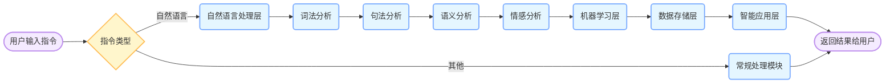

# 利用人工智能提升团队协作工具

> 关键词：人工智能、团队协作工具、自然语言处理、机器学习、智能助手、工作流优化、协作效率提升

> 摘要：本文围绕利用人工智能提升团队协作工具展开深入探讨。首先介绍了相关背景，包括目的范围、预期读者等内容。接着阐述了人工智能与团队协作工具结合的核心概念与联系，通过示意图和流程图直观展示。详细讲解了核心算法原理及具体操作步骤，并辅以 Python 源代码。呈现了相关数学模型和公式并举例说明。在项目实战部分，给出代码实际案例及详细解释。探讨了其实际应用场景，推荐了学习、开发等相关工具和资源，还介绍了经典论文及最新研究成果。最后总结了未来发展趋势与挑战，提供常见问题解答及扩展阅读参考资料，旨在全面剖析如何借助人工智能有效提升团队协作工具的性能和效率。

## 1. 背景介绍 
### 1.1 目的和范围
随着科技的飞速发展，团队协作的方式和需求也在不断演变。传统的团队协作工具在面对日益复杂的工作场景和海量的数据时，逐渐暴露出效率低下、智能化程度不足等问题。本文章的目的在于深入探讨如何利用人工智能技术来提升团队协作工具的功能和性能，以满足现代团队协作的多样化需求。

范围涵盖了人工智能在团队协作工具中的多个应用方面，包括但不限于自然语言处理在沟通交流中的应用、机器学习在任务分配和预测中的应用、智能助手在日常办公中的辅助等。同时，会对相关的算法原理、实际应用案例以及未来发展趋势进行详细的分析和讨论。

### 1.2 预期读者
本文的预期读者主要包括对团队协作工具和人工智能技术感兴趣的各类人群。具体有：
 - **团队管理者**：希望通过引入人工智能技术来优化团队协作流程，提高团队工作效率和管理水平的企业管理者、项目负责人等。
 - **技术开发者**：从事团队协作工具开发或对人工智能技术在软件领域应用有研究兴趣的程序员、软件工程师、架构师等。
 - **科研人员**：致力于人工智能和团队协作相关领域研究的学者、研究人员，期望从本文中获取新的研究思路和方向。
 - **普通用户**：对先进的团队协作工具和人工智能技术有一定了解需求，希望提升自身工作效率和协作体验的普通职场人士。

### 1.3 文档结构概述
本文将按照以下结构展开：
 - **核心概念与联系**：介绍人工智能与团队协作工具相关的核心概念，通过文本示意图和 Mermaid 流程图展示它们之间的联系。
 - **核心算法原理 & 具体操作步骤**：详细讲解人工智能在团队协作工具中应用的核心算法原理，并给出具体的操作步骤，同时使用 Python 源代码进行阐述。
 - **数学模型和公式 & 详细讲解 & 举例说明**：呈现相关的数学模型和公式，对其进行详细讲解，并通过实际例子进行说明。
 - **项目实战：代码实际案例和详细解释说明**：提供一个实际的项目案例，包括开发环境搭建、源代码实现和代码解读。
 - **实际应用场景**：探讨人工智能在团队协作工具中的各种实际应用场景。
 - **工具和资源推荐**：推荐学习人工智能和团队协作工具相关的资源，以及开发过程中使用的工具、框架和相关论文著作。
 - **总结：未来发展趋势与挑战**：总结利用人工智能提升团队协作工具的未来发展趋势和面临的挑战。
 - **附录：常见问题与解答**：解答读者在阅读过程中可能遇到的常见问题。
 - **扩展阅读 & 参考资料**：提供相关的扩展阅读内容和参考资料，方便读者进一步深入学习。

### 1.4 术语表
#### 1.4.1 核心术语定义
 - **人工智能（Artificial Intelligence，AI）**：是一门研究如何使计算机能够模拟人类智能的学科和技术领域，包括机器学习、自然语言处理、计算机视觉等多个分支。
 - **团队协作工具（Team Collaboration Tools）**：用于支持团队成员之间进行沟通、协作和项目管理的软件或平台，如 Slack、Trello、Microsoft Teams 等。
 - **自然语言处理（Natural Language Processing，NLP）**：人工智能的一个重要分支，主要研究如何让计算机理解、处理和生成人类语言，包括文本分类、情感分析、机器翻译等任务。
 - **机器学习（Machine Learning，ML）**：是人工智能的核心技术之一，通过让计算机从数据中学习模式和规律，从而实现预测、分类等功能，常见的算法有决策树、神经网络等。
 - **智能助手（Intelligent Assistant）**：基于人工智能技术开发的软件或程序，能够理解用户的自然语言指令，为用户提供信息和帮助，如 Siri、小爱同学等。

#### 1.4.2 相关概念解释
 - **工作流自动化（Workflow Automation）**：利用技术手段自动执行重复性的工作流程，减少人工干预，提高工作效率。在团队协作工具中，可以通过人工智能技术实现任务分配、提醒、审批等工作流的自动化。
 - **知识图谱（Knowledge Graph）**：一种语义网络，用于表示实体之间的关系和知识。在团队协作中，知识图谱可以帮助团队成员更好地理解项目相关的知识和信息，促进知识共享和传承。
 - **情感分析（Sentiment Analysis）**：自然语言处理的一个任务，用于分析文本中表达的情感倾向，如积极、消极或中性。在团队协作中，情感分析可以帮助管理者了解团队成员的情绪状态，及时调整管理策略。

#### 1.4.3 缩略词列表
 - **AI**：Artificial Intelligence（人工智能）
 - **NLP**：Natural Language Processing（自然语言处理）
 - **ML**：Machine Learning（机器学习）
 - **API**：Application Programming Interface（应用程序编程接口）
 - **SDK**：Software Development Kit（软件开发工具包）

## 2. 核心概念与联系 

### 核心概念原理
人工智能与团队协作工具的结合主要基于以下几个核心概念：

**自然语言处理原理**：自然语言处理旨在让计算机理解和处理人类语言。其基本原理包括词法分析、句法分析、语义分析等步骤。词法分析将文本分解为单词或词块，句法分析确定句子的语法结构，语义分析则理解句子的含义。例如，在团队协作工具中，自然语言处理可以用于实现智能搜索功能，用户输入自然语言查询，系统通过分析查询语句的语义，准确地在团队文档和对话记录中找到相关信息。

**机器学习原理**：机器学习通过让计算机从数据中学习模式和规律，从而实现预测和分类等功能。在团队协作工具中，机器学习可以用于任务分配和预测。例如，根据团队成员的历史工作记录、技能水平和任务难度等数据，使用机器学习算法预测每个成员完成任务的时间和质量，从而合理地分配任务。

**智能助手原理**：智能助手基于自然语言处理和机器学习技术，能够理解用户的自然语言指令，并根据用户的需求提供相应的服务。在团队协作中，智能助手可以帮助用户完成各种任务，如查询信息、安排会议、提醒任务等。例如，用户可以通过语音或文本向智能助手发送指令：“帮我查询一下上周的项目报告”，智能助手会根据指令在团队文档中查找相关报告并返回给用户。

### 架构的文本示意图
以下是人工智能与团队协作工具结合的架构示意图：

用户界面层：这是团队成员与协作工具交互的界面，包括网页界面、移动应用界面等。用户通过界面输入指令、查看信息和进行操作。

自然语言处理层：负责处理用户输入的自然语言信息，包括语音识别、文本分析、情感分析等。将用户的自然语言转换为计算机能够理解的形式。

机器学习层：利用历史数据进行训练，学习团队成员的行为模式、任务完成情况等规律。根据学习到的模式进行任务预测、推荐等操作。

数据存储层：存储团队协作过程中的各种数据，包括项目文档、聊天记录、任务信息等。为自然语言处理和机器学习提供数据支持。

智能应用层：基于自然语言处理和机器学习的结果，实现各种智能应用，如智能搜索、智能提醒、智能任务分配等。

### Mermaid 流程图


这个流程图展示了用户输入指令后，系统的处理流程。首先判断指令类型，如果是自然语言指令，则进入自然语言处理层进行一系列分析，然后经过机器学习层和数据存储层，最终通过智能应用层返回结果给用户。如果是其他类型的指令，则直接进入常规处理模块进行处理。

## 3. 核心算法原理 & 具体操作步骤 

### 自然语言处理算法原理及 Python 实现
#### 词法分析
词法分析的主要任务是将文本分解为单词或词块。在 Python 中，可以使用 `nltk`（Natural Language Toolkit）库来实现词法分析。以下是一个简单的示例代码：
```python
import nltk
nltk.download('punkt')

text = "This is a sample sentence for tokenization."
tokens = nltk.word_tokenize(text)
print(tokens)
```
在这个代码中，首先导入 `nltk` 库，并下载 `punkt` 分词器。然后定义一个文本字符串，使用 `word_tokenize` 函数将文本进行分词，最后打印出分词结果。

#### 句法分析
句法分析用于确定句子的语法结构。在 Python 中，可以使用 `spaCy` 库进行句法分析。以下是一个示例代码：
```python
import spacy

nlp = spacy.load("en_core_web_sm")
text = "The cat chased the mouse."
doc = nlp(text)

for token in doc:
    print(token.text, token.dep_, token.head.text)
```
在这个代码中，首先加载 `en_core_web_sm` 英语语言模型，然后定义一个文本字符串，将其传递给 `nlp` 函数进行处理，得到一个 `Doc` 对象。最后遍历 `Doc` 对象中的每个词元，打印出词元的文本、依赖关系和头部词元的文本。

#### 语义分析
语义分析的目的是理解句子的含义。可以使用预训练的词向量模型，如 `Word2Vec` 来进行语义分析。以下是一个使用 `gensim` 库实现 `Word2Vec` 的示例代码：
```python
from gensim.models import Word2Vec
from nltk.tokenize import word_tokenize

sentences = ["This is a sample sentence", "Another sample sentence"]
tokenized_sentences = [word_tokenize(sentence) for sentence in sentences]

model = Word2Vec(tokenized_sentences, min_count=1)
similar_words = model.wv.most_similar('sample')
print(similar_words)
```
在这个代码中，首先定义一个句子列表，将其进行分词处理。然后使用 `Word2Vec` 模型对分词后的句子进行训练，最后查找与 `sample` 最相似的词。

### 机器学习算法原理及 Python 实现
#### 任务分配预测
假设我们要根据团队成员的历史工作记录、技能水平和任务难度等数据，预测每个成员完成任务的时间。可以使用线性回归算法来实现这个预测。以下是一个简单的示例代码：
```python
import numpy as np
from sklearn.linear_model import LinearRegression

# 假设的训练数据
X = np.array([[1, 2, 3], [4, 5, 6], [7, 8, 9]])  # 特征矩阵，包含历史工作记录、技能水平和任务难度等特征
y = np.array([10, 20, 30])  # 目标值，即完成任务的时间

# 创建线性回归模型
model = LinearRegression()

# 训练模型
model.fit(X, y)

# 预测新任务的完成时间
new_task = np.array([[2, 3, 4]])
predicted_time = model.predict(new_task)
print("Predicted time:", predicted_time)
```
在这个代码中，首先定义了训练数据的特征矩阵 `X` 和目标值 `y`。然后创建一个线性回归模型，使用 `fit` 方法对模型进行训练。最后，定义一个新的任务特征向量，使用训练好的模型进行预测，并打印出预测结果。

### 具体操作步骤
#### 自然语言处理的操作步骤
1. **数据收集**：收集团队协作过程中的文本数据，如聊天记录、项目文档等。
2. **数据预处理**：对收集到的数据进行清洗、分词、去除停用词等预处理操作。
3. **模型选择和训练**：根据具体的任务选择合适的自然语言处理模型，如词法分析可以选择 `nltk` 分词器，句法分析可以选择 `spaCy` 模型等。使用预处理后的数据对模型进行训练。
4. **应用和评估**：将训练好的模型应用到团队协作工具中，进行实际的自然语言处理任务。并对模型的性能进行评估，根据评估结果进行调整和优化。

#### 机器学习的操作步骤
1. **数据收集和准备**：收集团队成员的历史工作记录、技能水平、任务信息等数据，并进行数据清洗、特征提取和数据划分等准备工作。
2. **模型选择**：根据具体的任务选择合适的机器学习模型，如任务分配预测可以选择线性回归模型，分类任务可以选择决策树、神经网络等模型。
3. **模型训练**：使用准备好的训练数据对模型进行训练。
4. **模型评估和调优**：使用测试数据对训练好的模型进行评估，根据评估结果调整模型的参数，进行模型调优。
5. **模型部署**：将调优后的模型部署到团队协作工具中，进行实际的预测和分类任务。

## 4. 数学模型和公式 & 详细讲解 & 举例说明 

### 自然语言处理中的数学模型和公式
#### 词向量模型
词向量模型是自然语言处理中常用的一种数学模型，用于将单词表示为向量形式。其中，`Word2Vec` 是一种经典的词向量模型，其核心思想是通过预测上下文来学习单词的向量表示。

`Word2Vec` 有两种训练模式：`Skip - Gram` 和 `Continuous Bag - of - Words (CBOW)`。

**Skip - Gram 模型**
Skip - Gram 模型的目标是根据中心词预测其上下文词。假设我们有一个词序列 $w_1, w_2, \cdots, w_T$，中心词为 $w_t$，上下文窗口大小为 $c$，则 Skip - Gram 模型的目标函数是最大化以下概率：
$$
\prod_{t = 1}^{T}\prod_{-c\leq j\leq c,j\neq0}P(w_{t + j}|w_t)
$$
其中，$P(w_{t + j}|w_t)$ 表示在中心词为 $w_t$ 的情况下，上下文词为 $w_{t + j}$ 的概率。这个概率通常使用 softmax 函数来计算：
$$
P(w_{O}|w_{I})=\frac{\exp(u_{O}^{T}v_{I})}{\sum_{w = 1}^{V}\exp(u_{w}^{T}v_{I})}
$$
其中，$v_{I}$ 是中心词 $w_{I}$ 的输入向量，$u_{O}$ 是上下文词 $w_{O}$ 的输出向量，$V$ 是词汇表的大小。

**举例说明**：假设我们有一个句子 “The cat chased the mouse”，上下文窗口大小为 2。对于中心词 “cat”，其上下文词为 “The”、“chased”。Skip - Gram 模型的目标就是通过学习来最大化在中心词为 “cat” 的情况下，预测出上下文词 “The” 和 “chased” 的概率。

#### 情感分析中的数学模型
情感分析可以使用朴素贝叶斯分类器来实现。朴素贝叶斯分类器基于贝叶斯定理，假设特征之间相互独立。

贝叶斯定理的公式为：
$$
P(c|x)=\frac{P(x|c)P(c)}{P(x)}
$$
其中，$P(c|x)$ 表示在特征 $x$ 出现的情况下，类别 $c$ 的概率；$P(x|c)$ 表示在类别 $c$ 下，特征 $x$ 出现的概率；$P(c)$ 是类别 $c$ 的先验概率；$P(x)$ 是特征 $x$ 的先验概率。

在情感分析中，$c$ 可以表示积极、消极或中性等情感类别，$x$ 可以表示文本中的单词或特征。由于 $P(x)$ 对于所有类别都是相同的，所以在分类时可以忽略 $P(x)$，只需要比较 $P(x|c)P(c)$ 的大小即可。

**举例说明**：假设我们有一个文本 “This movie is really great”，我们要判断它的情感类别是积极还是消极。我们可以统计积极和消极类别中每个单词出现的频率，计算出 $P(x|c)$ 和 $P(c)$，然后比较在积极和消极类别下的 $P(x|c)P(c)$ 值，选择值较大的类别作为文本的情感类别。

### 机器学习中的数学模型和公式
#### 线性回归模型
线性回归模型的目标是找到一个线性函数来拟合数据。假设我们有 $n$ 个样本，每个样本有 $m$ 个特征，目标值为 $y$，特征矩阵为 $X$，则线性回归模型的表达式为：
$$
y = X\theta+\epsilon
$$
其中，$\theta$ 是模型的参数向量，$\epsilon$ 是误差项。

线性回归模型的目标是最小化误差平方和，即最小化以下损失函数：
$$
J(\theta)=\frac{1}{2n}\sum_{i = 1}^{n}(y^{(i)}-x^{(i)}\theta)^2
$$
其中，$y^{(i)}$ 是第 $i$ 个样本的目标值，$x^{(i)}$ 是第 $i$ 个样本的特征向量。

可以使用梯度下降法来求解 $\theta$ 的最优值。梯度下降法的更新公式为：
$$
\theta_{j}:=\theta_{j}-\alpha\frac{\partial J(\theta)}{\partial\theta_{j}}
$$
其中，$\alpha$ 是学习率，$\frac{\partial J(\theta)}{\partial\theta_{j}}$ 是损失函数 $J(\theta)$ 关于 $\theta_{j}$ 的偏导数。

**举例说明**：假设我们有一个数据集，包含房屋的面积和价格信息。我们要使用线性回归模型来预测房屋的价格。我们可以将房屋的面积作为特征，价格作为目标值，使用上述公式来训练模型，找到最优的参数 $\theta$，从而实现对房屋价格的预测。

#### 决策树模型
决策树是一种基于树结构进行决策的机器学习模型。决策树的每个内部节点是一个特征上的测试，每个分支是测试输出，每个叶节点是一个类别或值。

决策树的构建过程通常使用信息增益、信息增益比或基尼指数等指标来选择最优的特征进行划分。

**信息增益**
信息增益是衡量特征对分类的贡献程度的指标。信息增益的计算公式为：
$$
IG(D, A)=H(D)-H(D|A)
$$
其中，$H(D)$ 是数据集 $D$ 的信息熵，$H(D|A)$ 是在特征 $A$ 给定的情况下，数据集 $D$ 的条件信息熵。

信息熵的计算公式为：
$$
H(D)=-\sum_{k = 1}^{K}p_{k}\log_{2}p_{k}
$$
其中，$p_{k}$ 是数据集 $D$ 中第 $k$ 类样本的比例，$K$ 是类别数。

条件信息熵的计算公式为：
$$
H(D|A)=\sum_{i = 1}^{n}\frac{|D_{i}|}{|D|}H(D_{i})
$$
其中，$D_{i}$ 是特征 $A$ 取值为第 $i$ 个值的样本子集，$|D_{i}|$ 是 $D_{i}$ 的样本数，$|D|$ 是数据集 $D$ 的样本数。

**举例说明**：假设我们有一个数据集，包含天气、温度、湿度等特征，以及是否适合户外运动的类别标签。我们可以使用信息增益来选择最优的特征进行划分，构建决策树模型。例如，计算天气特征的信息增益，如果信息增益较大，则说明天气特征对分类的贡献较大，可以将天气特征作为决策树的根节点进行划分。

## 5. 项目实战：代码实际案例和详细解释说明 

### 5.1  开发环境搭建
#### 操作系统
可以选择 Windows、Linux 或 macOS 等主流操作系统。本项目实战以 Windows 10 为例进行说明。

#### 编程语言和开发工具
 - **Python**：选择 Python 3.7 及以上版本。可以从 Python 官方网站（https://www.python.org/downloads/） 下载并安装。
 - **集成开发环境（IDE）**：推荐使用 PyCharm 或 Visual Studio Code。可以从各自的官方网站下载并安装。

#### 相关库和框架
 - **自然语言处理库**：`nltk`、`spaCy`、`gensim` 等。可以使用 `pip` 命令进行安装，例如：
```sh
pip install nltk
pip install spacy
python -m spacy download en_core_web_sm
pip install gensim
```
 - **机器学习库**：`scikit - learn`、`numpy`、`pandas` 等。同样使用 `pip` 命令进行安装：
```sh
pip install scikit - learn
pip install numpy
pip install pandas
```

### 5.2  源代码详细实现和代码解读
#### 智能搜索功能实现
以下是一个简单的智能搜索功能的实现代码：
```python
import nltk
from nltk.tokenize import word_tokenize
from sklearn.feature_extraction.text import TfidfVectorizer
from sklearn.metrics.pairwise import cosine_similarity

# 示例文档数据
documents = [
    "This is the first document about team collaboration.",
    "The second document focuses on artificial intelligence in collaboration tools.",
    "Here is another document related to project management in teams."
]

# 对文档进行分词处理
tokenized_documents = []
for doc in documents:
    tokens = word_tokenize(doc.lower())
    tokenized_documents.append(' '.join(tokens))

# 使用 TF - IDF 向量化器将文档转换为向量
vectorizer = TfidfVectorizer()
document_vectors = vectorizer.fit_transform(tokenized_documents)

# 用户查询
query = "team collaboration"
tokenized_query = word_tokenize(query.lower())
query_vector = vectorizer.transform([' '.join(tokenized_query)])

# 计算查询向量与文档向量的余弦相似度
similarities = cosine_similarity(query_vector, document_vectors)

# 找到相似度最高的文档
most_similar_index = similarities.argmax()
most_similar_document = documents[most_similar_index]

print("Most similar document:", most_similar_document)
```
**代码解读**：
1. **数据准备**：定义了一个文档列表 `documents`，并对每个文档进行分词处理，将分词后的文档存储在 `tokenized_documents` 列表中。
2. **向量化**：使用 `TfidfVectorizer` 将文档转换为 TF - IDF 向量，存储在 `document_vectors` 中。
3. **用户查询处理**：对用户输入的查询进行分词处理，然后使用相同的向量化器将查询转换为向量 `query_vector`。
4. **相似度计算**：使用 `cosine_similarity` 函数计算查询向量与文档向量的余弦相似度，找到相似度最高的文档的索引。
5. **结果输出**：根据索引找到最相似的文档并输出。

#### 任务分配预测功能实现
以下是一个简单的任务分配预测功能的实现代码：
```python
import numpy as np
from sklearn.linear_model import LinearRegression

# 示例训练数据
# 特征矩阵，包含历史工作记录、技能水平和任务难度等特征
X = np.array([[1, 2, 3], [4, 5, 6], [7, 8, 9]])
# 目标值，即完成任务的时间
y = np.array([10, 20, 30])

# 创建线性回归模型
model = LinearRegression()

# 训练模型
model.fit(X, y)

# 新任务的特征向量
new_task = np.array([[2, 3, 4]])

# 预测新任务的完成时间
predicted_time = model.predict(new_task)

print("Predicted time:", predicted_time)
```
**代码解读**：
1. **数据准备**：定义了训练数据的特征矩阵 `X` 和目标值 `y`。
2. **模型创建**：创建一个线性回归模型 `model`。
3. **模型训练**：使用 `fit` 方法对模型进行训练。
4. **预测**：定义一个新任务的特征向量 `new_task`，使用训练好的模型进行预测，并输出预测结果。

### 5.3  代码解读与分析
#### 智能搜索功能分析
 - **优点**：使用 TF - IDF 向量化和余弦相似度计算的方法简单有效，能够快速地在文档中找到与查询相关的内容。而且 `TfidfVectorizer` 可以自动处理停用词和词频统计，减少了数据预处理的工作量。
 - **缺点**：该方法没有考虑到语义信息，只是基于词频和逆文档频率进行计算。对于一些同义词、近义词的处理效果可能不佳。可以结合词向量模型或深度学习模型来改进语义理解能力。

#### 任务分配预测功能分析
 - **优点**：线性回归模型简单易懂，训练速度快，对于一些线性关系较强的数据能够取得较好的预测效果。而且可以很方便地解释模型的参数，了解每个特征对目标值的影响程度。
 - **缺点**：线性回归模型假设数据之间存在线性关系，如果数据之间存在复杂的非线性关系，模型的预测效果可能会较差。可以考虑使用更复杂的机器学习模型，如决策树、神经网络等。

## 6. 实际应用场景 
### 智能沟通与协作
 - **智能聊天机器人**：在团队协作工具中集成智能聊天机器人，能够实时回答团队成员的问题，提供相关的信息和帮助。例如，当团队成员询问项目进度、任务分配等问题时，聊天机器人可以快速准确地给出回答。同时，聊天机器人还可以进行情感分析，了解团队成员的情绪状态，及时进行安抚和鼓励。
 - **自动摘要和翻译**：对于长篇的文档和聊天记录，人工智能可以自动生成摘要，帮助团队成员快速了解核心内容。在跨国团队协作中，自动翻译功能可以消除语言障碍，实现不同语言之间的实时沟通。

### 任务管理与分配
 - **智能任务分配**：利用机器学习算法分析团队成员的历史工作记录、技能水平和任务难度等数据，自动合理地分配任务。例如，将难度较高的任务分配给经验丰富、技能水平高的成员，将简单的任务分配给新成员进行锻炼。
 - **任务进度预测**：根据任务的历史数据和当前进度，预测任务的完成时间和可能出现的风险。提前提醒团队成员采取相应的措施，确保任务按时完成。

### 知识管理与共享
 - **智能知识图谱**：构建团队的知识图谱，将项目相关的知识和信息进行整合和关联。团队成员可以通过知识图谱快速查找和获取所需的知识，促进知识的共享和传承。
 - **智能推荐**：根据团队成员的历史行为和兴趣，推荐相关的文档、任务和人员。例如，当团队成员查看某个项目文档时，系统可以推荐与该项目相关的其他文档和参与人员。

### 工作流自动化
 - **自动化审批流程**：利用人工智能技术实现审批流程的自动化。例如，当团队成员提交请假申请、报销申请等时，系统可以根据预设的规则自动进行审批，提高审批效率。
 - **任务提醒和跟进**：自动提醒团队成员任务的截止日期、待办事项等，确保任务不被遗漏。同时，对任务的进度进行跟进，及时发现问题并进行处理。

## 7. 工具和资源推荐
### 7.1 学习资源推荐
#### 7.1.1 书籍推荐
 - 《Python 自然语言处理》（Natural Language Processing with Python）：这本书详细介绍了使用 Python 进行自然语言处理的各种技术和方法，包括词法分析、句法分析、语义分析等。
 - 《机器学习》（Machine Learning）：由周志华教授编写，是机器学习领域的经典教材，全面介绍了机器学习的基本概念、算法和应用。
 - 《人工智能：一种现代的方法》（Artificial Intelligence: A Modern Approach）：这本书是人工智能领域的权威著作，涵盖了人工智能的各个方面，包括自然语言处理、机器学习、计算机视觉等。

#### 7.1.2 在线课程
 - Coursera 平台上的 “机器学习” 课程：由 Andrew Ng 教授授课，是机器学习领域的经典在线课程，讲解深入浅出，适合初学者。
 - edX 平台上的 “自然语言处理” 课程：该课程系统地介绍了自然语言处理的理论和实践，包括各种自然语言处理技术和工具的使用。
 - 哔哩哔哩（B 站）上有很多关于人工智能和团队协作工具的教学视频，可以根据自己的需求进行选择学习。

#### 7.1.3 技术博客和网站
 - 博客园（https://www.cnblogs.com/）：有很多技术开发者分享的关于人工智能和团队协作工具的技术文章和经验分享。
 - 掘金（https://juejin.cn/）：专注于互联网技术领域，提供了大量关于人工智能、软件开发等方面的优质文章。
 - Medium（https://medium.com/）：一个国际化的技术博客平台，有很多国外的技术专家分享的最新技术和研究成果。

### 7.2 开发工具框架推荐
#### 7.2.1 IDE和编辑器
 - PyCharm：一款专门为 Python 开发设计的集成开发环境，具有代码自动补全、调试、版本控制等功能，非常适合 Python 开发。
 - Visual Studio Code：一款轻量级的代码编辑器，支持多种编程语言，具有丰富的插件扩展功能，可以满足不同的开发需求。

#### 7.2.2 调试和性能分析工具
 - Py-Spy：一个用于分析 Python 程序性能的工具，可以帮助开发者找出程序中的性能瓶颈。
 - PDB（Python Debugger）：Python 自带的调试工具，可以方便地对 Python 程序进行调试。

#### 7.2.3 相关框架和库
 - TensorFlow：一个开源的机器学习框架，提供了丰富的工具和接口，支持深度学习模型的开发和训练。
 - PyTorch：另一个流行的深度学习框架，具有简洁易用的特点，在学术界和工业界都有广泛的应用。
 - Flask：一个轻量级的 Python Web 框架，可以用于快速开发团队协作工具的后端服务。

### 7.3 相关论文著作推荐
#### 7.3.1 经典论文
 - “Efficient Estimation of Word Representations in Vector Space”：这篇论文提出了 `Word2Vec` 模型，是词向量模型领域的经典论文。
 - “Gradient - Based Learning Applied to Document Recognition”：这篇论文介绍了卷积神经网络（CNN）在文档识别中的应用，是深度学习领域的经典论文之一。

#### 7.3.2 最新研究成果
 - 可以通过 IEEE Xplore、ACM Digital Library 等学术数据库查找关于人工智能和团队协作工具的最新研究论文。关注相关领域的顶级会议，如 NeurIPS（神经信息处理系统大会）、ACL（计算语言学协会年会）等，获取最新的研究成果。

#### 7.3.3 应用案例分析
 - 一些知名企业的技术博客会分享他们在人工智能和团队协作工具方面的应用案例，如 Google AI Blog、Microsoft Research Blog 等。可以从中学习到实际应用中的经验和技巧。

## 8. 总结：未来发展趋势与挑战
### 未来发展趋势
 - **更深度的智能化**：未来的团队协作工具将更加智能化，能够自动理解团队成员的意图和需求，提供更加个性化的服务。例如，智能助手可以根据团队成员的工作习惯和偏好，自动推荐合适的任务和信息。
 - **多模态交互**：除了传统的文本和语音交互，未来的团队协作工具将支持更多的交互方式，如图像、视频等。例如，团队成员可以通过上传图片或视频来表达自己的想法和需求，系统可以自动对其进行分析和处理。
 - **与物联网的融合**：随着物联网技术的发展，团队协作工具将与物联网设备进行深度融合。例如，团队成员可以通过物联网设备实时获取项目相关的物理数据，如设备状态、环境参数等，提高团队协作的效率和决策的准确性。
 - **跨平台和跨设备协作**：未来的团队协作工具将支持在不同平台和设备上进行无缝协作。团队成员可以在手机、平板、电脑等设备上随时随地进行协作，提高工作的灵活性和效率。

### 挑战
 - **数据隐私和安全问题**：人工智能在团队协作工具中的应用需要大量的数据支持，如何保证数据的隐私和安全是一个重要的挑战。需要采取有效的数据加密、访问控制等措施，防止数据泄露和滥用。
 - **算法的可解释性**：一些复杂的人工智能算法，如深度学习算法，往往具有较高的复杂度和黑盒性，难以解释其决策过程和结果。在团队协作中，需要算法具有较高的可解释性，以便团队成员理解和信任系统的决策。
 - **技术人才短缺**：人工智能技术的发展需要大量的专业人才，包括自然语言处理、机器学习等领域的专家。目前，相关技术人才的短缺是制约人工智能在团队协作工具中应用的一个重要因素。
 - **用户接受度**：一些团队成员可能对新的人工智能技术和协作方式存在抵触情绪，需要进行有效的培训和推广，提高用户的接受度和使用意愿。

## 9. 附录：常见问题与解答
### 1. 人工智能在团队协作工具中的应用会导致团队成员失业吗？
不会。人工智能在团队协作工具中的应用主要是为了提高团队协作的效率和质量，减轻团队成员的重复性工作负担。它可以帮助团队成员更好地完成工作，而不是取代他们。例如，智能任务分配可以让团队成员专注于更有价值的工作，提高个人的工作效率和职业发展。

### 2. 如何确保人工智能算法在团队协作工具中的公平性？
要确保人工智能算法的公平性，需要从数据和算法两个方面入手。在数据方面，要确保训练数据的多样性和代表性，避免数据偏差。在算法方面，要对算法进行评估和优化，避免算法对某些群体产生歧视。例如，在任务分配算法中，要考虑到团队成员的公平性，避免将任务集中分配给少数成员。

### 3. 人工智能技术在团队协作工具中的应用成本高吗？
人工智能技术的应用成本因具体的应用场景和技术方案而异。对于一些简单的应用，如智能聊天机器人，可以使用开源的工具和框架，成本相对较低。对于一些复杂的应用，如深度学习模型的训练，可能需要较高的计算资源和专业的技术人员，成本相对较高。但是，随着技术的发展和普及，人工智能技术的应用成本正在逐渐降低。

### 4. 如何选择适合团队的人工智能团队协作工具？
选择适合团队的人工智能团队协作工具需要考虑多个因素，如团队的规模、业务需求、预算等。可以先对市场上的相关工具进行调研和比较，了解它们的功能和特点。然后可以进行试用，根据团队成员的反馈和使用体验来选择最适合的工具。同时，要考虑工具的可扩展性和兼容性，以便未来进行功能扩展和集成。

## 10. 扩展阅读 & 参考资料
### 扩展阅读
 - 《人类简史：从动物到上帝》（Sapiens: A Brief History of Humankind）：这本书从人类历史的角度探讨了人类的发展和变革，对于理解人工智能在人类社会中的角色和影响有一定的启发。
 - 《未来简史：从智人到神人》（Homo Deus: A Brief History of Tomorrow）：作者继续探讨了人类的未来发展，包括人工智能、生物技术等对人类社会的影响。

### 参考资料
 - 相关的学术论文和研究报告，如 IEEE、ACM 等学术数据库中的论文。
 - 人工智能和团队协作工具相关的官方文档和技术博客，如 TensorFlow 官方文档、Slack 技术博客等。
 - 书籍《Python 数据分析实战》《深度学习》等相关技术书籍。