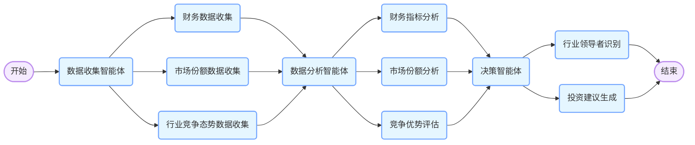

# 利用多智能体AI实现巴菲特式的行业领导者识别

> 关键词：多智能体AI、巴菲特投资理念、行业领导者识别、金融分析、智能决策

> 摘要：本文聚焦于如何运用多智能体AI技术来实现巴菲特式的行业领导者识别。首先介绍了相关背景，包括研究目的、预期读者、文档结构和术语表。接着阐述了多智能体AI和巴菲特投资理念的核心概念及其联系，给出了原理和架构的文本示意图与Mermaid流程图。详细讲解了核心算法原理和具体操作步骤，并结合Python源代码进行说明。同时，给出了相关的数学模型和公式，并举例说明。通过项目实战，展示了代码实际案例及详细解释。探讨了该技术在实际中的应用场景，推荐了学习、开发工具框架以及相关论文著作。最后总结了未来发展趋势与挑战，提供了常见问题解答和扩展阅读参考资料，旨在为金融领域的行业领导者识别提供一种创新且有效的方法。

## 1. 背景介绍 

### 1.1 目的和范围
本研究的主要目的是借助多智能体AI技术，实现类似于巴菲特投资理念下的行业领导者识别。巴菲特在投资领域以精准识别具有长期竞争优势和卓越盈利能力的行业领导者而闻名。通过运用多智能体AI，我们期望能够从海量的金融数据和市场信息中筛选出符合巴菲特投资标准的行业领导者，为投资者提供有价值的决策参考。

研究范围涵盖了多个行业，包括但不限于金融、科技、消费、医疗等。我们将收集这些行业内企业的财务报表、市场份额、竞争态势等多维度数据，并运用多智能体AI进行分析和处理。

### 1.2 预期读者
本文的预期读者主要包括金融投资者、金融分析师、人工智能研究人员以及对金融与人工智能交叉领域感兴趣的专业人士。对于金融投资者和分析师而言，本文提供了一种创新的行业领导者识别方法，有助于他们在投资决策中做出更明智的选择。对于人工智能研究人员，本文展示了多智能体AI在金融领域的具体应用，为相关研究提供了新的思路和案例。

### 1.3 文档结构概述
本文将按照以下结构进行阐述：首先介绍多智能体AI和巴菲特投资理念的核心概念及其联系，通过文本示意图和Mermaid流程图进行清晰展示。接着详细讲解核心算法原理和具体操作步骤，结合Python源代码进行深入分析。然后给出相关的数学模型和公式，并举例说明其在行业领导者识别中的应用。通过项目实战，展示代码实际案例及详细解释。探讨该技术在实际中的应用场景，推荐学习、开发工具框架以及相关论文著作。最后总结未来发展趋势与挑战，提供常见问题解答和扩展阅读参考资料。

### 1.4 术语表
#### 1.4.1 核心术语定义
- **多智能体AI（Multi - Agent AI）**：由多个智能体组成的人工智能系统，每个智能体具有自主决策和交互能力，通过协作完成复杂任务。
- **巴菲特式投资理念**：强调寻找具有长期竞争优势、稳定现金流、合理估值的企业进行投资，注重企业的内在价值和护城河。
- **行业领导者**：在某个行业中具有领先的市场份额、卓越的盈利能力、强大的品牌影响力和技术创新能力的企业。

#### 1.4.2 相关概念解释
- **智能体（Agent）**：在多智能体AI中，智能体是一个具有感知、决策和行动能力的实体。它可以根据自身的目标和环境信息做出决策，并与其他智能体进行交互。
- **护城河（Moat）**：巴菲特提出的概念，指企业所拥有的可持续竞争优势，如品牌优势、成本优势、技术专利等，能够保护企业免受竞争对手的侵蚀。
- **内在价值（Intrinsic Value）**：企业未来现金流的折现值，是评估企业真实价值的重要指标。

#### 1.4.3 缩略词列表
- **AI**：Artificial Intelligence，人工智能
- **MAI**：Multi - Agent AI，多智能体AI

## 2. 核心概念与联系 

### 核心概念原理
#### 多智能体AI原理
多智能体AI由多个智能体组成，每个智能体可以看作是一个独立的决策单元。这些智能体通过感知环境信息，根据自身的目标和规则进行决策，并与其他智能体进行交互。智能体之间的交互可以是合作、竞争或协调的关系，通过这种交互，整个系统能够完成复杂的任务。

例如，在一个股票市场分析的多智能体系统中，可能有负责收集财务数据的智能体、负责分析市场趋势的智能体和负责做出投资决策的智能体。这些智能体相互协作，共同完成对股票的评估和投资决策。

#### 巴菲特投资理念原理
巴菲特的投资理念基于价值投资的原则，核心是寻找具有长期竞争优势和稳定现金流的企业。他强调关注企业的内在价值，而不是短期的市场波动。巴菲特认为，一个优秀的企业应该具有宽阔的护城河，能够在长期内保持盈利增长。他通过深入研究企业的财务报表、商业模式、管理团队等方面，来评估企业的内在价值和竞争优势。

### 核心概念联系
多智能体AI与巴菲特投资理念的联系在于，多智能体AI可以为巴菲特式的行业领导者识别提供强大的技术支持。通过多智能体AI，我们可以实现对海量金融数据的快速收集、分析和处理，从而更准确地评估企业的内在价值和竞争优势。

例如，不同的智能体可以分别负责收集企业的财务数据、市场份额数据、行业竞争态势数据等，然后通过智能体之间的协作和交互，对这些数据进行综合分析，找出符合巴菲特投资标准的行业领导者。

### 文本示意图
```plaintext
多智能体AI系统
|-- 数据收集智能体
|   |-- 财务数据收集
|   |-- 市场份额数据收集
|   |-- 行业竞争态势数据收集
|-- 数据分析智能体
|   |-- 财务指标分析
|   |-- 市场份额分析
|   |-- 竞争优势评估
|-- 决策智能体
|   |-- 行业领导者识别
|   |-- 投资建议生成

巴菲特投资理念
|-- 寻找具有长期竞争优势的企业
|-- 关注企业的内在价值
|-- 注重稳定的现金流

联系：多智能体AI为巴菲特式行业领导者识别提供数据处理和分析能力，帮助实现投资理念
```

### Mermaid流程图


## 3. 核心算法原理 & 具体操作步骤 

### 核心算法原理
我们采用基于多智能体协作的决策算法来实现行业领导者识别。每个智能体负责不同的数据收集和分析任务，通过智能体之间的消息传递和协作，最终得出行业领导者的识别结果。

具体来说，数据收集智能体负责从各种数据源收集企业的相关数据，包括财务报表、市场数据等。数据分析智能体对收集到的数据进行处理和分析，计算各种财务指标和市场指标，评估企业的竞争优势。决策智能体根据数据分析智能体的结果，结合巴菲特投资理念的标准，识别出行业领导者。

### 具体操作步骤
#### 步骤1：数据收集
数据收集智能体通过网络爬虫、API接口等方式从金融数据库、财经网站等数据源收集企业的财务数据、市场份额数据、行业竞争态势数据等。例如，使用Python的`requests`库和`BeautifulSoup`库可以实现网页数据的爬取。

```python
import requests
from bs4 import BeautifulSoup

# 示例：爬取某财经网站的企业财务数据
url = 'https://example.com/financial_data'
response = requests.get(url)
soup = BeautifulSoup(response.text, 'html.parser')
# 解析数据
financial_data = soup.find_all('div', class_='financial-data')
```

#### 步骤2：数据预处理
对收集到的数据进行清洗、转换和归一化处理，以提高数据的质量和可用性。例如，处理缺失值、异常值，将不同单位的数据进行统一。

```python
import pandas as pd
import numpy as np

# 示例：处理缺失值
data = pd.DataFrame({'column1': [1, 2, np.nan, 4], 'column2': [5, np.nan, 7, 8]})
data = data.fillna(data.mean())  # 用均值填充缺失值
```

#### 步骤3：数据分析
数据分析智能体对预处理后的数据进行分析，计算各种财务指标和市场指标，如毛利率、净利率、市场份额增长率等。

```python
# 示例：计算毛利率
data['gross_profit_margin'] = (data['revenue'] - data['cost_of_goods_sold']) / data['revenue']
```

#### 步骤4：竞争优势评估
根据计算得到的指标，评估企业的竞争优势。可以采用层次分析法（AHP）等方法，为不同的指标分配权重，综合评估企业的竞争优势。

```python
from sklearn.preprocessing import MinMaxScaler

# 示例：使用MinMaxScaler对指标进行归一化
scaler = MinMaxScaler()
data[['gross_profit_margin', 'market_share_growth']] = scaler.fit_transform(data[['gross_profit_margin', 'market_share_growth']])
# 假设权重
weights = [0.6, 0.4]
data['competitive_advantage_score'] = data['gross_profit_margin'] * weights[0] + data['market_share_growth'] * weights[1]
```

#### 步骤5：行业领导者识别
决策智能体根据竞争优势评估的结果，结合巴菲特投资理念的标准，如稳定的现金流、合理的估值等，识别出行业领导者。

```python
# 示例：筛选出竞争优势得分最高且现金流稳定的企业
leader = data[(data['competitive_advantage_score'] == data['competitive_advantage_score'].max()) & (data['cash_flow_stability'] > 0.8)].iloc[0]
```

## 4. 数学模型和公式 & 详细讲解 & 举例说明 

### 财务指标计算
#### 毛利率（Gross Profit Margin）
毛利率是衡量企业盈利能力的重要指标，计算公式为：
$$
\text{Gross Profit Margin} = \frac{\text{Revenue} - \text{Cost of Goods Sold}}{\text{Revenue}}
$$
其中，$\text{Revenue}$ 表示企业的营业收入，$\text{Cost of Goods Sold}$ 表示企业的营业成本。

例如，某企业的营业收入为1000万元，营业成本为600万元，则该企业的毛利率为：
$$
\text{Gross Profit Margin} = \frac{1000 - 600}{1000} = 0.4 = 40\%
$$

#### 净利率（Net Profit Margin）
净利率反映了企业在扣除所有成本和费用后，每一元营业收入所带来的净利润，计算公式为：
$$
\text{Net Profit Margin} = \frac{\text{Net Profit}}{\text{Revenue}}
$$
其中，$\text{Net Profit}$ 表示企业的净利润。

例如，某企业的净利润为200万元，营业收入为1000万元，则该企业的净利率为：
$$
\text{Net Profit Margin} = \frac{200}{1000} = 0.2 = 20\%
$$

### 竞争优势评估模型
我们采用层次分析法（AHP）来综合评估企业的竞争优势。假设我们选择了毛利率、净利率、市场份额增长率三个指标来评估企业的竞争优势，首先需要构建判断矩阵。

判断矩阵是一个 $n\times n$ 的矩阵，其中 $n$ 是指标的数量。矩阵中的元素 $a_{ij}$ 表示指标 $i$ 相对于指标 $j$ 的重要性程度。例如，判断矩阵如下：
$$
A = 
\begin{bmatrix}
1 & 3 & 5 \\
\frac{1}{3} & 1 & 3 \\
\frac{1}{5} & \frac{1}{3} & 1
\end{bmatrix}
$$
表示毛利率相对于净利率的重要性为3倍，相对于市场份额增长率的重要性为5倍。

接下来，计算判断矩阵的特征向量和特征值。特征向量表示各个指标的权重，特征值用于检验判断矩阵的一致性。

Python代码实现如下：
```python
import numpy as np

# 判断矩阵
A = np.array([[1, 3, 5], [1/3, 1, 3], [1/5, 1/3, 1]])

# 计算特征向量和特征值
eigenvalues, eigenvectors = np.linalg.eig(A)

# 最大特征值
max_eigenvalue = np.max(eigenvalues)

# 对应的特征向量
index = np.argmax(eigenvalues)
weights = eigenvectors[:, index] / np.sum(eigenvectors[:, index])

print("权重：", weights)
```

### 内在价值评估模型
巴菲特强调关注企业的内在价值，我们可以采用现金流折现模型（DCF）来评估企业的内在价值。现金流折现模型的基本公式为：
$$
\text{Intrinsic Value} = \sum_{t = 1}^{n} \frac{\text{FCF}_t}{(1 + r)^t} + \frac{\text{TV}}{(1 + r)^n}
$$
其中，$\text{FCF}_t$ 表示第 $t$ 年的自由现金流，$r$ 表示折现率，$n$ 表示预测期，$\text{TV}$ 表示终值。

终值的计算可以采用永续增长模型：
$$
\text{TV} = \frac{\text{FCF}_{n + 1}}{r - g}
$$
其中，$\text{FCF}_{n + 1}$ 表示预测期结束后下一年的自由现金流，$g$ 表示永续增长率。

例如，假设某企业未来5年的自由现金流分别为100万元、120万元、140万元、160万元、180万元，折现率为10%，永续增长率为3%，则该企业的内在价值计算如下：

```python
import numpy as np

# 自由现金流
fcf = np.array([100, 120, 140, 160, 180])

# 折现率
r = 0.1

# 永续增长率
g = 0.03

# 预测期
n = 5

# 计算终值
fcf_n_plus_1 = fcf[-1] * (1 + g)
tv = fcf_n_plus_1 / (r - g)

# 计算内在价值
discount_factors = (1 + r) ** np.arange(1, n + 1)
intrinsic_value = np.sum(fcf / discount_factors) + tv / ((1 + r) ** n)

print("内在价值：", intrinsic_value)
```

## 5. 项目实战：代码实际案例和详细解释说明 

### 5.1  开发环境搭建
#### 安装Python
首先，需要安装Python开发环境。可以从Python官方网站（https://www.python.org/downloads/）下载适合自己操作系统的Python版本，并按照安装向导进行安装。

#### 安装必要的库
使用`pip`命令安装项目所需的库，如`pandas`、`numpy`、`requests`、`BeautifulSoup`等。
```bash
pip install pandas numpy requests beautifulsoup4
```

### 5.2  源代码详细实现和代码解读
```python
import requests
from bs4 import BeautifulSoup
import pandas as pd
import numpy as np

# 步骤1：数据收集
def collect_data():
    url = 'https://example.com/financial_data'
    response = requests.get(url)
    soup = BeautifulSoup(response.text, 'html.parser')
    # 解析数据
    financial_data = soup.find_all('div', class_='financial-data')
    data = []
    for item in financial_data:
        revenue = float(item.find('span', class_='revenue').text)
        cost_of_goods_sold = float(item.find('span', class_='cost-of-goods-sold').text)
        net_profit = float(item.find('span', class_='net-profit').text)
        market_share = float(item.find('span', class_='market-share').text)
        data.append([revenue, cost_of_goods_sold, net_profit, market_share])
    df = pd.DataFrame(data, columns=['revenue', 'cost_of_goods_sold', 'net_profit', 'market_share'])
    return df

# 步骤2：数据预处理
def preprocess_data(df):
    df = df.fillna(df.mean())  # 用均值填充缺失值
    return df

# 步骤3：数据分析
def analyze_data(df):
    df['gross_profit_margin'] = (df['revenue'] - df['cost_of_goods_sold']) / df['revenue']
    df['net_profit_margin'] = df['net_profit'] / df['revenue']
    df['market_share_growth'] = df['market_share'].pct_change()
    return df

# 步骤4：竞争优势评估
def evaluate_competitive_advantage(df):
    from sklearn.preprocessing import MinMaxScaler
    scaler = MinMaxScaler()
    df[['gross_profit_margin', 'net_profit_margin', 'market_share_growth']] = scaler.fit_transform(df[['gross_profit_margin', 'net_profit_margin', 'market_share_growth']])
    # 假设权重
    weights = [0.4, 0.3, 0.3]
    df['competitive_advantage_score'] = df['gross_profit_margin'] * weights[0] + df['net_profit_margin'] * weights[1] + df['market_share_growth'] * weights[2]
    return df

# 步骤5：行业领导者识别
def identify_industry_leader(df):
    leader = df[df['competitive_advantage_score'] == df['competitive_advantage_score'].max()].iloc[0]
    return leader

# 主函数
def main():
    # 数据收集
    data = collect_data()
    # 数据预处理
    preprocessed_data = preprocess_data(data)
    # 数据分析
    analyzed_data = analyze_data(preprocessed_data)
    # 竞争优势评估
    evaluated_data = evaluate_competitive_advantage(analyzed_data)
    # 行业领导者识别
    leader = identify_industry_leader(evaluated_data)
    print("行业领导者：", leader)

if __name__ == "__main__":
    main()
```

### 5.3  代码解读与分析
- **数据收集函数`collect_data`**：通过`requests`库发送HTTP请求获取网页数据，使用`BeautifulSoup`库解析网页数据，提取企业的财务数据和市场份额数据，并将其存储在`pandas`的`DataFrame`中。
- **数据预处理函数`preprocess_data`**：使用均值填充缺失值，提高数据的质量。
- **数据分析函数`analyze_data`**：计算毛利率、净利率和市场份额增长率等财务指标。
- **竞争优势评估函数`evaluate_competitive_advantage`**：使用`MinMaxScaler`对指标进行归一化处理，根据假设的权重计算竞争优势得分。
- **行业领导者识别函数`identify_industry_leader`**：筛选出竞争优势得分最高的企业作为行业领导者。
- **主函数`main`**：依次调用上述函数，完成数据收集、预处理、分析、竞争优势评估和行业领导者识别的整个流程。

## 6. 实际应用场景 
### 投资决策
对于金融投资者来说，利用多智能体AI实现的行业领导者识别可以为投资决策提供重要参考。投资者可以根据识别结果，选择投资具有竞争优势的行业领导者，提高投资回报率。例如，在股票投资中，投资者可以将资金集中投资于被识别为行业领导者的企业股票，降低投资风险。

### 行业研究
金融分析师可以利用该技术进行行业研究，深入了解行业内企业的竞争态势和发展趋势。通过识别行业领导者，分析师可以分析其成功的原因和竞争优势，为其他企业提供借鉴和参考。同时，也可以发现行业内的潜在机会和威胁，为行业的发展提供预测和建议。

### 企业战略规划
企业管理者可以借助该技术了解自身在行业中的地位和竞争优势，与行业领导者进行对比分析，找出自身的差距和不足。根据分析结果，企业可以制定相应的战略规划，如加强研发投入、拓展市场份额、优化成本结构等，以提升自身的竞争力，向行业领导者迈进。

## 7. 工具和资源推荐
### 7.1 学习资源推荐
#### 7.1.1 书籍推荐
- 《聪明的投资者》（The Intelligent Investor）：作者是本杰明·格雷厄姆（Benjamin Graham），这本书是价值投资的经典之作，对巴菲特的投资理念产生了深远影响。
- 《巴菲特致股东的信：股份公司教程》（Letters to Shareholders of Berkshire Hathaway）：由沃伦·巴菲特（Warren Buffett）撰写，书中包含了巴菲特多年来给股东的信，详细阐述了他的投资哲学和方法。
- 《多智能体系统：原理与编程》（Multi - Agent Systems: Principles and Programming）：介绍了多智能体系统的基本原理、算法和编程实现，适合对多智能体AI感兴趣的读者。

#### 7.1.2 在线课程
- Coursera上的“Machine Learning”：由斯坦福大学教授吴恩达（Andrew Ng）讲授，课程涵盖了机器学习的基本概念、算法和应用，为学习多智能体AI提供了基础。
- edX上的“Artificial Intelligence: Principles and Techniques”：介绍了人工智能的基本原理和技术，包括多智能体系统的相关内容。

#### 7.1.3 技术博客和网站
- Medium上有许多关于金融科技和人工智能的技术博客，如Towards Data Science，其中包含了大量关于金融数据分析和多智能体AI应用的文章。
- 金融界网站（https://www.jrj.com.cn/）提供了丰富的金融数据和市场信息，适合进行金融领域的研究和分析。

### 7.2 开发工具框架推荐
#### 7.2.1 IDE和编辑器
- PyCharm：是一款专业的Python集成开发环境，提供了丰富的代码编辑、调试和项目管理功能，适合Python开发。
- Jupyter Notebook：是一个交互式的开发环境，支持Python、R等多种编程语言，方便进行数据探索和分析。

#### 7.2.2 调试和性能分析工具
- `pdb`：Python自带的调试器，可以帮助开发者定位代码中的问题。
- `cProfile`：Python的性能分析工具，可以分析代码的运行时间和函数调用情况，帮助优化代码性能。

#### 7.2.3 相关框架和库
- `pandas`：是一个强大的数据分析库，提供了高效的数据结构和数据处理方法，适合处理金融数据。
- `numpy`：是Python的数值计算库，提供了高性能的多维数组和数学函数，为数据分析和算法实现提供了基础。
- `scikit - learn`：是一个常用的机器学习库，包含了各种机器学习算法和工具，可用于数据预处理、模型训练和评估。

### 7.3 相关论文著作推荐
#### 7.3.1 经典论文
- “Multi - Agent Systems: A Modern Approach to Distributed Artificial Intelligence”：介绍了多智能体系统的基本概念、模型和算法，是多智能体系统领域的经典论文。
- “The Theory of Investment Value”：作者是约翰·伯尔·威廉姆斯（John Burr Williams），提出了现金流折现模型，为价值投资提供了理论基础。

#### 7.3.2 最新研究成果
- 在IEEE Transactions on Neural Networks and Learning Systems、ACM Transactions on Intelligent Systems and Technology等学术期刊上，经常发表关于多智能体AI和金融科技的最新研究成果。
- 国际人工智能联合会议（IJCAI）、神经信息处理系统大会（NeurIPS）等学术会议上也有相关的研究报告和论文。

#### 7.3.3 应用案例分析
- 一些金融机构和研究机构会发布关于多智能体AI在金融领域应用的案例分析报告，如高盛、摩根大通等公司的研究报告，可以在其官方网站上查找。

## 8. 总结：未来发展趋势与挑战
### 未来发展趋势
- **融合更多数据来源**：未来，多智能体AI在行业领导者识别中将融合更多的数据来源，如社交媒体数据、物联网数据等，以更全面地了解企业的运营状况和市场反应。
- **与深度学习结合**：将多智能体AI与深度学习技术相结合，能够提高模型的预测能力和决策准确性。例如，使用深度学习模型对企业的文本信息进行情感分析，为行业领导者识别提供更多的信息。
- **跨行业应用拓展**：该技术不仅可以应用于金融领域，还可以拓展到其他行业，如制造业、医疗保健业等，帮助不同行业识别行业领导者，推动行业的发展。

### 挑战
- **数据质量和隐私问题**：多智能体AI需要大量的数据来进行分析和决策，数据的质量和隐私问题是一个重要的挑战。如何确保数据的准确性、完整性和安全性，同时保护用户的隐私，是需要解决的问题。
- **模型解释性**：多智能体AI模型通常比较复杂，其决策过程难以解释。在金融领域，模型的解释性尤为重要，因为投资者需要了解决策的依据。如何提高模型的解释性，是未来研究的一个方向。
- **技术复杂性**：多智能体AI的开发和应用涉及到多个领域的知识和技术，如人工智能、分布式系统、金融分析等。技术的复杂性增加了开发和应用的难度，需要培养跨学科的人才。

## 9. 附录：常见问题与解答
### 问题1：多智能体AI与传统AI有什么区别？
多智能体AI由多个智能体组成，每个智能体具有自主决策和交互能力，通过协作完成复杂任务。而传统AI通常是一个单一的智能系统，由一个中央控制器进行决策。多智能体AI更适合处理复杂的、动态的环境，能够更好地模拟现实世界中的多主体交互。

### 问题2：如何确定判断矩阵的元素值？
判断矩阵的元素值通常根据专家经验或主观判断来确定。可以邀请金融领域的专家，根据指标的重要性程度进行两两比较，给出相对重要性的评分。例如，如果认为毛利率比净利率重要3倍，则判断矩阵中对应元素的值为3。

### 问题3：现金流折现模型中的折现率如何确定？
折现率的确定通常考虑企业的风险水平和市场利率。可以使用资本资产定价模型（CAPM）来计算折现率，公式为：
$$
r = r_f + \beta \times (r_m - r_f)
$$
其中，$r_f$ 表示无风险利率，$\beta$ 表示企业的贝塔系数，$r_m$ 表示市场收益率。

## 10. 扩展阅读 & 参考资料
### 扩展阅读
- 《金融炼金术》（The Alchemy of Finance）：作者是乔治·索罗斯（George Soros），书中介绍了他的投资哲学和金融市场的运作规律。
- 《人工智能：现代方法》（Artificial Intelligence: A Modern Approach）：全面介绍了人工智能的基本概念、算法和应用，是人工智能领域的经典教材。

### 参考资料
- Graham, B. (2003). The Intelligent Investor. HarperBusiness.
- Buffett, W. E. (2008). Letters to Shareholders of Berkshire Hathaway.
- Wooldridge, M. (2009). Multi - Agent Systems: An Introduction to Distributed Artificial Intelligence. Wiley.
- Williams, J. B. (1938). The Theory of Investment Value. Harvard University Press.