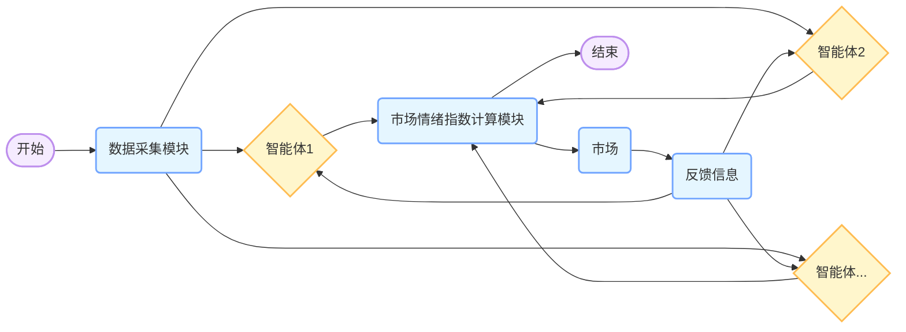

# 利用多智能体系统构建动态的市场情绪指数

> 关键词：多智能体系统、市场情绪指数、动态建模、人工智能、金融市场

> 摘要：本文聚焦于利用多智能体系统构建动态的市场情绪指数。首先介绍了相关背景知识，包括研究目的、预期读者等内容。接着阐述了多智能体系统和市场情绪指数的核心概念及其联系，详细讲解了构建动态市场情绪指数的核心算法原理与具体操作步骤，并给出了相应的数学模型和公式。通过项目实战部分的代码实际案例，深入剖析了开发环境搭建、源代码实现及解读过程。同时探讨了该技术在金融市场等领域的实际应用场景，推荐了相关的学习资源、开发工具框架和论文著作。最后总结了未来发展趋势与挑战，还在附录中提供了常见问题与解答，为利用多智能体系统构建动态市场情绪指数的研究和实践提供全面而深入的参考。

## 1. 背景介绍 
### 1.1 目的和范围
在金融市场中，市场情绪是影响资产价格波动的重要因素之一。传统的市场分析方法往往侧重于基本面和技术面的分析，而忽略了投资者情绪这一关键因素。本研究的目的在于利用多智能体系统构建动态的市场情绪指数，以更全面、准确地捕捉市场情绪的变化，为投资者提供更有价值的决策参考。

本研究的范围涵盖了多智能体系统的理论与应用、市场情绪的度量与建模、金融市场数据的分析与处理等多个领域。通过综合运用这些领域的知识和技术，旨在开发出一种高效、准确的动态市场情绪指数构建方法。

### 1.2 预期读者
本文预期读者包括金融市场投资者、金融分析师、人工智能与机器学习领域的研究人员、相关专业的学生以及对市场情绪分析和多智能体系统应用感兴趣的人士。

### 1.3 文档结构概述
本文共分为十个部分。第一部分为背景介绍，阐述研究的目的、范围、预期读者和文档结构概述，并给出术语表。第二部分介绍多智能体系统和市场情绪指数的核心概念及其联系，包括原理和架构的文本示意图以及 Mermaid 流程图。第三部分详细讲解构建动态市场情绪指数的核心算法原理，并给出具体操作步骤，同时使用 Python 源代码进行阐述。第四部分介绍相关的数学模型和公式，并进行详细讲解和举例说明。第五部分为项目实战，包括开发环境搭建、源代码详细实现和代码解读以及代码分析。第六部分探讨该技术在实际中的应用场景。第七部分推荐相关的学习资源、开发工具框架和论文著作。第八部分总结未来发展趋势与挑战。第九部分为附录，提供常见问题与解答。第十部分列出扩展阅读和参考资料。

### 1.4 术语表
#### 1.4.1 核心术语定义
- **多智能体系统（Multi - Agent System，MAS）**：由多个智能体组成的系统，这些智能体能够通过相互协作和交互来完成复杂的任务。每个智能体具有一定的自主性、反应性和社会性。
- **市场情绪指数**：用于度量市场参与者对市场整体或特定资产的情绪状态的指标。它反映了投资者的乐观、悲观或中性等情绪倾向。
- **动态建模**：对系统的状态和行为随时间变化进行建模的过程，以捕捉系统的动态特性。

#### 1.4.2 相关概念解释
- **智能体**：是具有感知、决策和行动能力的实体，能够根据自身的目标和环境信息做出相应的决策和行动。
- **情绪度量**：通过各种方法和指标来量化市场参与者的情绪状态，如文本分析、交易数据挖掘等。
- **金融市场数据**：包括股票价格、交易量、新闻资讯、社交媒体数据等与金融市场相关的数据。

#### 1.4.3 缩略词列表
- **MAS**：Multi - Agent System（多智能体系统）
- **AI**：Artificial Intelligence（人工智能）
- **ML**：Machine Learning（机器学习）

## 2. 核心概念与联系 

### 2.1 多智能体系统原理
多智能体系统由多个智能体组成，每个智能体具有一定的自主性和智能性。智能体之间通过通信和协作来完成共同的任务。智能体的基本结构包括感知模块、决策模块和行动模块。感知模块用于获取环境信息，决策模块根据感知到的信息和自身的目标进行决策，行动模块则根据决策结果采取相应的行动。

智能体的行为可以分为反应式行为和目标导向行为。反应式行为是指智能体根据当前的环境刺激立即做出反应，而目标导向行为则是智能体为了实现特定的目标而采取的一系列行动。

### 2.2 市场情绪指数原理
市场情绪指数是通过对市场参与者的情绪进行度量和分析得到的。市场情绪可以受到多种因素的影响，如宏观经济数据、政策变化、公司业绩、新闻资讯和社交媒体等。

常见的市场情绪度量方法包括文本分析、交易数据挖掘和问卷调查等。文本分析是通过对新闻、社交媒体等文本信息进行情感分析，以获取市场参与者的情绪倾向。交易数据挖掘则是通过对股票价格、交易量等交易数据进行分析，以发现市场参与者的情绪变化。

### 2.3 两者的联系
多智能体系统可以用于构建动态的市场情绪指数。在多智能体系统中，每个智能体可以代表一个市场参与者或一类市场参与者。智能体通过感知市场信息（如新闻、交易数据等），并根据自身的决策规则进行决策，从而反映出市场参与者的情绪状态。

多个智能体之间的交互和协作可以模拟市场参与者之间的相互影响和信息传播，从而更准确地捕捉市场情绪的动态变化。通过对多智能体系统中智能体的行为和状态进行分析，可以构建出动态的市场情绪指数。

### 2.4 文本示意图
多智能体系统构建动态市场情绪指数的基本架构如下：

多智能体系统由多个智能体组成，每个智能体与数据采集模块相连，数据采集模块负责收集市场信息，如新闻、交易数据等。智能体根据采集到的信息进行决策，并将决策结果反馈给市场情绪指数计算模块。市场情绪指数计算模块根据智能体的决策结果计算市场情绪指数，并将指数反馈给市场，同时将指数信息反馈给智能体，以便智能体调整自身的决策。

### 2.5 Mermaid 流程图


## 3. 核心算法原理 & 具体操作步骤 

### 3.1 核心算法原理
构建动态市场情绪指数的核心算法主要包括以下几个步骤：

1. **数据采集与预处理**：收集市场信息，如新闻、交易数据等，并对数据进行清洗、转换和特征提取等预处理操作。
2. **智能体建模**：定义智能体的结构和行为规则。智能体的行为规则可以基于机器学习算法、专家系统或其他决策模型。
3. **智能体交互与协作**：设计智能体之间的交互和协作机制，以模拟市场参与者之间的相互影响和信息传播。
4. **市场情绪指数计算**：根据智能体的决策结果计算市场情绪指数。市场情绪指数可以采用加权平均、聚类分析等方法进行计算。

### 3.2 具体操作步骤

#### 3.2.1 数据采集与预处理
- **数据采集**：使用网络爬虫技术从新闻网站、社交媒体平台、金融数据提供商等数据源收集市场信息。
- **数据清洗**：去除重复数据、缺失值和噪声数据。
- **数据转换**：将文本数据转换为数值特征，如使用词袋模型、TF - IDF 等方法。
- **特征提取**：提取与市场情绪相关的特征，如关键词频率、情感极性等。

#### 3.2.2 智能体建模
- **定义智能体结构**：每个智能体包括感知模块、决策模块和行动模块。
- **设计决策规则**：可以使用机器学习算法（如神经网络、支持向量机等）或专家系统来设计智能体的决策规则。

#### 3.2.3 智能体交互与协作
- **定义交互协议**：智能体之间通过消息传递进行交互，定义消息的格式和语义。
- **设计协作机制**：智能体可以通过合作、竞争等方式进行协作，以模拟市场参与者之间的相互影响。

#### 3.2.4 市场情绪指数计算
- **确定计算方法**：可以采用加权平均、聚类分析等方法计算市场情绪指数。
- **更新指数**：根据智能体的决策结果实时更新市场情绪指数。

### 3.3 Python 源代码实现

```python
import numpy as np
import pandas as pd
from sklearn.feature_extraction.text import TfidfVectorizer
from sklearn.svm import SVC

# 数据采集与预处理
def data_preprocessing(data):
    # 数据清洗
    data = data.dropna()
    data = data.drop_duplicates()
    
    # 数据转换
    vectorizer = TfidfVectorizer()
    X = vectorizer.fit_transform(data['text'])
    y = data['label']
    
    return X, y

# 智能体建模
class Agent:
    def __init__(self):
        self.model = SVC()
    
    def train(self, X, y):
        self.model.fit(X, y)
    
    def predict(self, X):
        return self.model.predict(X)

# 市场情绪指数计算
def calculate_market_sentiment_index(predictions):
    positive_count = np.sum(predictions == 1)
    negative_count = np.sum(predictions == -1)
    neutral_count = np.sum(predictions == 0)
    
    total_count = positive_count + negative_count + neutral_count
    
    if total_count == 0:
        return 0
    
    sentiment_index = (positive_count - negative_count) / total_count
    
    return sentiment_index

# 主函数
def main():
    # 读取数据
    data = pd.read_csv('market_data.csv')
    
    # 数据预处理
    X, y = data_preprocessing(data)
    
    # 智能体建模
    agent = Agent()
    agent.train(X, y)
    
    # 预测
    predictions = agent.predict(X)
    
    # 计算市场情绪指数
    sentiment_index = calculate_market_sentiment_index(predictions)
    
    print(f"市场情绪指数: {sentiment_index}")

if __name__ == "__main__":
    main()
```

## 4. 数学模型和公式 & 详细讲解 & 举例说明 

### 4.1 数据预处理中的数学模型和公式

#### 4.1.1 TF - IDF 公式
TF - IDF（Term Frequency - Inverse Document Frequency）是一种常用的文本特征提取方法。TF 表示词频，即某个词在文档中出现的频率；IDF 表示逆文档频率，即某个词在整个文档集合中出现的频率的倒数。

词频 $TF_{t,d}$ 计算公式为：

$$TF_{t,d}=\frac{n_{t,d}}{\sum_{k}n_{k,d}}$$

其中，$n_{t,d}$ 表示词 $t$ 在文档 $d$ 中出现的次数，$\sum_{k}n_{k,d}$ 表示文档 $d$ 中所有词的出现次数之和。

逆文档频率 $IDF_{t}$ 计算公式为：

$$IDF_{t}=\log\frac{N}{df_{t}}$$

其中，$N$ 表示文档集合中的文档总数，$df_{t}$ 表示包含词 $t$ 的文档数。

TF - IDF 值 $TF - IDF_{t,d}$ 计算公式为：

$$TF - IDF_{t,d}=TF_{t,d}\times IDF_{t}$$

#### 4.1.2 举例说明
假设有以下三个文档：

文档 1："The cat sat on the mat"
文档 2："The dog chased the cat"
文档 3："The bird flew in the sky"

对于词 "cat"，在文档 1 中出现 1 次，文档 2 中出现 1 次，文档 3 中出现 0 次。

文档 1 中所有词的出现次数之和为 6，文档 2 中所有词的出现次数之和为 4，文档 3 中所有词的出现次数之和为 5。

则词 "cat" 在文档 1 中的词频 $TF_{cat,1}=\frac{1}{6}$，在文档 2 中的词频 $TF_{cat,2}=\frac{1}{4}$，在文档 3 中的词频 $TF_{cat,3}=0$。

包含词 "cat" 的文档数 $df_{cat}=2$，文档总数 $N = 3$，则词 "cat" 的逆文档频率 $IDF_{cat}=\log\frac{3}{2}$。

词 "cat" 在文档 1 中的 TF - IDF 值 $TF - IDF_{cat,1}=\frac{1}{6}\times\log\frac{3}{2}$，在文档 2 中的 TF - IDF 值 $TF - IDF_{cat,2}=\frac{1}{4}\times\log\frac{3}{2}$，在文档 3 中的 TF - IDF 值 $TF - IDF_{cat,3}=0$。

### 4.2 市场情绪指数计算的数学模型和公式

#### 4.2.1 加权平均法
假设市场中有 $n$ 个智能体，每个智能体的决策结果为 $s_i$（$s_i\in\{-1,0,1\}$，分别表示悲观、中性、乐观），对应的权重为 $w_i$，且 $\sum_{i = 1}^{n}w_i = 1$。

则市场情绪指数 $S$ 计算公式为：

$$S=\sum_{i = 1}^{n}w_is_i$$

#### 4.2.2 举例说明
假设有三个智能体，决策结果分别为 $s_1 = 1$（乐观），$s_2 = 0$（中性），$s_3=-1$（悲观），对应的权重分别为 $w_1 = 0.4$，$w_2 = 0.3$，$w_3 = 0.3$。

则市场情绪指数 $S=0.4\times1 + 0.3\times0+0.3\times(-1)=0.1$。

## 5. 项目实战：代码实际案例和详细解释说明 

### 5.1  开发环境搭建
#### 5.1.1 安装 Python
首先需要安装 Python 环境，建议使用 Python 3.7 及以上版本。可以从 Python 官方网站（https://www.python.org/downloads/）下载并安装。

#### 5.1.2 安装依赖库
使用以下命令安装所需的依赖库：

```sh
pip install numpy pandas scikit-learn
```

### 5.2  源代码详细实现和代码解读

```python
import numpy as np
import pandas as pd
from sklearn.feature_extraction.text import TfidfVectorizer
from sklearn.svm import SVC

# 数据采集与预处理
def data_preprocessing(data):
    # 数据清洗
    data = data.dropna()  # 去除缺失值
    data = data.drop_duplicates()  # 去除重复数据
    
    # 数据转换
    vectorizer = TfidfVectorizer()  # 初始化 TF - IDF 向量化器
    X = vectorizer.fit_transform(data['text'])  # 将文本数据转换为 TF - IDF 特征矩阵
    y = data['label']  # 提取标签
    
    return X, y

# 智能体建模
class Agent:
    def __init__(self):
        self.model = SVC()  # 初始化支持向量机模型
    
    def train(self, X, y):
        self.model.fit(X, y)  # 训练模型
    
    def predict(self, X):
        return self.model.predict(X)  # 进行预测

# 市场情绪指数计算
def calculate_market_sentiment_index(predictions):
    positive_count = np.sum(predictions == 1)  # 统计乐观预测的数量
    negative_count = np.sum(predictions == -1)  # 统计悲观预测的数量
    neutral_count = np.sum(predictions == 0)  # 统计中性预测的数量
    
    total_count = positive_count + negative_count + neutral_count  # 计算总预测数量
    
    if total_count == 0:
        return 0  # 如果总预测数量为 0，则市场情绪指数为 0
    
    sentiment_index = (positive_count - negative_count) / total_count  # 计算市场情绪指数
    
    return sentiment_index

# 主函数
def main():
    # 读取数据
    data = pd.read_csv('market_data.csv')  # 读取市场数据文件
    
    # 数据预处理
    X, y = data_preprocessing(data)  # 对数据进行预处理
    
    # 智能体建模
    agent = Agent()  # 初始化智能体
    agent.train(X, y)  # 训练智能体模型
    
    # 预测
    predictions = agent.predict(X)  # 进行预测
    
    # 计算市场情绪指数
    sentiment_index = calculate_market_sentiment_index(predictions)  # 计算市场情绪指数
    
    print(f"市场情绪指数: {sentiment_index}")

if __name__ == "__main__":
    main()
```

### 5.3  代码解读与分析
- **数据采集与预处理**：`data_preprocessing` 函数负责对市场数据进行清洗和转换。使用 `pandas` 库去除缺失值和重复数据，使用 `TfidfVectorizer` 将文本数据转换为 TF - IDF 特征矩阵。
- **智能体建模**：`Agent` 类封装了支持向量机模型，包括训练和预测方法。
- **市场情绪指数计算**：`calculate_market_sentiment_index` 函数根据预测结果计算市场情绪指数。通过统计乐观、悲观和中性预测的数量，计算市场情绪指数。
- **主函数**：`main` 函数是程序的入口，负责读取数据、进行数据预处理、训练智能体模型、进行预测和计算市场情绪指数，并输出结果。

## 6. 实际应用场景 
### 6.1 金融投资决策
投资者可以根据动态的市场情绪指数调整投资策略。当市场情绪指数为正且上升时，说明市场参与者情绪乐观，投资者可以适当增加股票等风险资产的投资比例；当市场情绪指数为负且下降时，说明市场参与者情绪悲观，投资者可以适当减少风险资产的投资比例，增加债券等避险资产的投资比例。

### 6.2 风险管理
金融机构可以利用市场情绪指数进行风险管理。通过监测市场情绪指数的变化，及时发现市场风险，调整风险敞口，降低潜在的损失。例如，当市场情绪指数急剧下降时，金融机构可以采取措施减少杠杆率，增加流动性储备。

### 6.3 政策制定
政府和监管机构可以根据市场情绪指数制定相关政策。当市场情绪过于乐观时，可能会导致资产泡沫的形成，政府可以采取适当的政策措施进行调控，如提高利率、加强监管等；当市场情绪过于悲观时，政府可以采取刺激经济的政策，如降低利率、增加财政支出等。

### 6.4 市场趋势预测
市场情绪指数可以作为预测市场趋势的重要指标之一。通过分析市场情绪指数的历史数据和变化趋势，可以预测市场的未来走势。例如，如果市场情绪指数持续上升，且伴随着交易量的增加，可能预示着市场将进入上升趋势。

## 7. 工具和资源推荐
### 7.1 学习资源推荐
#### 7.1.1 书籍推荐
- 《多智能体系统导论》：全面介绍了多智能体系统的理论、方法和应用，是学习多智能体系统的经典教材。
- 《金融市场技术分析》：详细讲解了金融市场的技术分析方法，包括市场情绪分析的相关内容。
- 《Python 机器学习》：介绍了使用 Python 进行机器学习的方法和技巧，对于实现多智能体系统和市场情绪分析算法有很大帮助。

#### 7.1.2 在线课程
- Coursera 上的“多智能体系统”课程：由知名大学的教授授课，系统地介绍了多智能体系统的知识和技术。
- edX 上的“金融市场分析”课程：提供了金融市场分析的理论和实践知识，包括市场情绪分析的方法和应用。
- 网易云课堂上的“Python 数据分析与机器学习实战”课程：通过实际案例讲解了使用 Python 进行数据分析和机器学习的方法，对于项目实战有很大的指导作用。

#### 7.1.3 技术博客和网站
- Medium：上面有很多关于多智能体系统、人工智能和金融市场分析的技术文章和案例分享。
- 知乎：有很多专业人士分享关于多智能体系统和市场情绪分析的经验和见解。
- arXiv：提供了最新的学术研究论文，对于了解多智能体系统和市场情绪分析的前沿研究有很大帮助。

### 7.2 开发工具框架推荐
#### 7.2.1 IDE和编辑器
- PyCharm：是一款功能强大的 Python 集成开发环境，提供了代码编辑、调试、版本控制等功能，对于开发多智能体系统和市场情绪分析项目非常方便。
- Jupyter Notebook：是一种交互式的开发环境，适合进行数据探索、模型实验和代码演示。可以方便地展示代码、数据和分析结果。

#### 7.2.2 调试和性能分析工具
- PDB：Python 自带的调试工具，可以帮助开发者定位代码中的错误和问题。
- cProfile：Python 自带的性能分析工具，可以分析代码的性能瓶颈，帮助开发者优化代码。

#### 7.2.3 相关框架和库
- NumPy：是 Python 中用于科学计算的基础库，提供了高效的数组操作和数学函数。
- Pandas：是 Python 中用于数据处理和分析的库，提供了数据结构和数据操作方法，方便进行数据清洗、转换和分析。
- Scikit - learn：是 Python 中常用的机器学习库，提供了各种机器学习算法和工具，如分类、回归、聚类等。
- NLTK：是 Python 中用于自然语言处理的库，提供了文本处理、情感分析等功能，对于市场情绪分析中的文本数据处理有很大帮助。

### 7.3 相关论文著作推荐
#### 7.3.1 经典论文
- "Multi - Agent Systems: A Modern Approach to Distributed Artificial Intelligence"：这篇论文是多智能体系统领域的经典之作，介绍了多智能体系统的基本概念、理论和方法。
- "Measuring Investor Sentiment"：该论文详细探讨了市场情绪的度量方法和应用，对于构建市场情绪指数有重要的参考价值。

#### 7.3.2 最新研究成果
- 关注顶级学术会议（如 IJCAI、AAAI 等）和期刊（如 Journal of Artificial Intelligence Research、Journal of Financial Economics 等）上的最新研究论文，了解多智能体系统和市场情绪分析的最新研究成果。

#### 7.3.3 应用案例分析
- 分析一些实际应用案例，如金融机构如何利用多智能体系统和市场情绪指数进行风险管理和投资决策，从中学习实践经验和方法。

## 8. 总结：未来发展趋势与挑战
### 8.1 未来发展趋势
- **多学科融合**：利用多智能体系统构建动态的市场情绪指数将与人工智能、机器学习、自然语言处理、金融工程等多个学科进行更深入的融合，以提高市场情绪指数的准确性和实用性。
- **实时监测与预测**：随着技术的不断发展，市场情绪指数的实时监测和预测能力将不断提高。可以利用实时数据和流式计算技术，实现对市场情绪的实时跟踪和预测，为投资者和决策者提供更及时的信息。
- **个性化服务**：根据不同投资者的风险偏好、投资目标和投资经验，提供个性化的市场情绪指数和投资建议。通过对投资者行为数据的分析和挖掘，实现个性化的服务和推荐。
- **区块链技术应用**：区块链技术的去中心化、不可篡改等特性可以应用于市场情绪数据的存储和管理，提高数据的安全性和可信度。同时，区块链技术还可以实现智能合约的应用，自动执行投资策略和风险管理措施。

### 8.2 挑战
- **数据质量与隐私**：市场情绪分析需要大量的数据，数据的质量和隐私是关键问题。如何确保数据的准确性、完整性和一致性，以及如何保护用户的隐私是需要解决的难题。
- **模型复杂度与可解释性**：多智能体系统和市场情绪分析模型往往比较复杂，模型的可解释性较差。如何提高模型的可解释性，让投资者和决策者更好地理解模型的决策过程和结果是一个挑战。
- **市场不确定性**：金融市场具有高度的不确定性，市场情绪也会受到多种因素的影响。如何准确地捕捉市场情绪的变化，以及如何应对市场的不确定性是需要解决的问题。
- **技术更新换代**：信息技术发展迅速，新的算法和技术不断涌现。如何及时掌握和应用新的技术，保持系统的先进性和竞争力是一个挑战。

## 9. 附录：常见问题与解答
### 9.1 数据采集过程中如何确保数据的准确性和完整性？
- **多数据源采集**：从多个不同的数据源采集数据，以提高数据的准确性和完整性。例如，可以同时从新闻网站、社交媒体平台、金融数据提供商等数据源采集市场信息。
- **数据验证和清洗**：在数据采集后，对数据进行验证和清洗，去除错误数据、缺失值和噪声数据。可以使用数据验证规则和算法来检查数据的准确性和完整性。
- **人工审核**：对于一些关键数据，可以进行人工审核，以确保数据的准确性和可靠性。

### 9.2 如何选择合适的机器学习算法来构建智能体的决策模型？
- **数据特点**：根据数据的特点选择合适的机器学习算法。如果数据是线性可分的，可以选择线性分类算法，如逻辑回归、支持向量机等；如果数据是非线性的，可以选择非线性分类算法，如神经网络、决策树等。
- **模型复杂度**：考虑模型的复杂度和计算效率。如果数据量较小，可以选择简单的模型；如果数据量较大，可以选择复杂的模型。
- **可解释性**：如果需要对模型的决策过程进行解释，可以选择可解释性较好的模型，如决策树、线性回归等。

### 9.3 市场情绪指数的计算方法有哪些优缺点？
- **加权平均法**：优点是计算简单，易于理解和实现；缺点是权重的确定比较困难，可能会受到主观因素的影响。
- **聚类分析方法**：优点是可以自动发现数据中的聚类结构，更准确地反映市场情绪的分布；缺点是计算复杂度较高，需要选择合适的聚类算法和参数。

### 9.4 如何评估市场情绪指数的准确性和有效性？
- **与市场实际表现对比**：将市场情绪指数与市场的实际表现（如股票价格、交易量等）进行对比，分析市场情绪指数与市场实际表现之间的相关性。
- **回测分析**：使用历史数据对市场情绪指数进行回测分析，评估市场情绪指数在历史市场环境中的表现。
- **专家评估**：邀请金融专家和市场分析师对市场情绪指数进行评估，听取他们的意见和建议。

## 10. 扩展阅读 & 参考资料
- 《人工智能：一种现代的方法》，Stuart J. Russell，Peter Norvig 著
- 《金融时间序列分析》，Ruey S. Tsay 著
- "A Survey of Multi - Agent System Research"，作者：[具体作者]，发表期刊：[具体期刊]
- 相关的金融市场数据提供商网站，如 Wind 资讯、东方财富网等
- 多智能体系统和人工智能领域的开源项目，如 OpenAI Gym、JADE 等