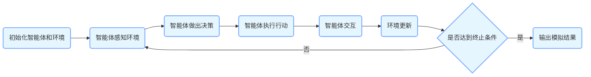

# 利用多智能体系统模拟不同税收政策：评估政策影响

> 关键词：多智能体系统、税收政策模拟、政策评估、经济模型、智能体交互

> 摘要：本文旨在探讨如何利用多智能体系统来模拟不同的税收政策，并对这些政策的影响进行评估。多智能体系统作为一种强大的建模工具，能够模拟复杂的经济系统中各个主体的行为和交互。通过构建基于多智能体的税收政策模拟模型，我们可以深入理解不同税收政策对经济主体的决策、市场动态以及宏观经济指标的影响。文章详细介绍了多智能体系统的核心概念、算法原理、数学模型，通过项目实战展示了如何实现税收政策模拟，并分析了实际应用场景。最后，推荐了相关的工具和资源，总结了未来发展趋势与挑战，为税收政策的制定和评估提供了一种创新的方法和视角。

## 1. 背景介绍 
### 1.1 目的和范围
税收政策是政府调控经济的重要手段之一，不同的税收政策会对经济主体的行为和整个经济系统产生深远的影响。传统的税收政策评估方法往往基于宏观经济模型，这些模型通常假设经济主体具有完全理性和一致的行为模式，难以准确反映现实中经济主体的多样性和复杂性。多智能体系统（Multi - Agent System, MAS）提供了一种新的方法来模拟税收政策，它可以考虑到经济主体的异质性、适应性和交互性，从而更真实地反映税收政策的影响。

本文的范围包括介绍多智能体系统的基本概念和原理，构建基于多智能体的税收政策模拟模型，通过Python代码实现该模型，分析不同税收政策下的模拟结果，以及探讨该方法在实际税收政策制定中的应用。

### 1.2 预期读者
本文预期读者包括经济学研究人员、政策制定者、计算机科学领域的研究人员和开发者，以及对税收政策和多智能体系统感兴趣的爱好者。对于经济学研究人员和政策制定者，本文提供了一种新的政策评估方法；对于计算机科学领域的人员，本文展示了多智能体系统在经济学领域的应用；对于爱好者，本文可以帮助他们了解多智能体系统和税收政策模拟的基本原理。

### 1.3 文档结构概述
本文首先介绍多智能体系统的背景知识，包括目的、预期读者和文档结构。接着阐述多智能体系统的核心概念和联系，包括智能体的定义、分类和交互方式，并给出相应的文本示意图和Mermaid流程图。然后详细讲解核心算法原理和具体操作步骤，通过Python代码实现。之后介绍数学模型和公式，并通过具体例子进行说明。再通过项目实战展示如何搭建开发环境、实现源代码并进行代码解读。随后分析实际应用场景，推荐相关的工具和资源。最后总结未来发展趋势与挑战，提供常见问题与解答和扩展阅读及参考资料。

### 1.4 术语表
#### 1.4.1 核心术语定义
- **多智能体系统（Multi - Agent System, MAS）**：由多个智能体组成的系统，这些智能体能够感知环境、自主决策并与其他智能体进行交互，以实现系统的整体目标。
- **智能体（Agent）**：具有自主性、反应性、社会性和适应性的实体，能够在一定的环境中独立地执行任务。
- **税收政策**：政府为了实现一定的经济和社会目标，通过税收制度对经济活动进行调节的一系列措施。
- **经济主体**：参与经济活动的个人、企业、政府等实体。

#### 1.4.2 相关概念解释
- **自主性**：智能体能够独立地做出决策和执行任务，不受外部的直接控制。
- **反应性**：智能体能够感知环境的变化，并根据这些变化做出相应的反应。
- **社会性**：智能体能够与其他智能体进行交互，通过合作或竞争来实现共同的目标。
- **适应性**：智能体能够根据过去的经验和环境的变化调整自己的行为。

#### 1.4.3 缩略词列表
- **MAS**：Multi - Agent System（多智能体系统）

## 2. 核心概念与联系 
### 核心概念原理
多智能体系统的核心概念是智能体。智能体是一个具有自主性、反应性、社会性和适应性的实体。在税收政策模拟中，智能体可以代表不同的经济主体，如个人、企业等。每个智能体都有自己的属性和行为规则，这些属性和规则决定了智能体在不同环境下的决策和行动。

智能体之间通过交互来影响彼此的行为和决策。交互方式可以是合作、竞争、通信等。例如，企业之间可能存在竞争关系，它们会根据市场价格、税收政策等因素调整自己的生产和销售策略；个人之间可能会通过通信交流就业信息、消费经验等。

多智能体系统的环境是智能体生存和活动的空间，它包含了各种资源和约束条件。在税收政策模拟中，环境可以包括市场价格、劳动力市场、税收制度等。智能体的行为和决策会受到环境的影响，同时也会对环境产生反馈作用。

### 架构的文本示意图
多智能体税收政策模拟系统的架构可以分为以下几个层次：
- **智能体层**：包含多个智能体，每个智能体代表一个经济主体，具有自己的属性和行为规则。
- **交互层**：负责智能体之间的交互，包括合作、竞争、通信等。
- **环境层**：提供智能体生存和活动的环境，包括市场价格、税收制度等。
- **管理层**：负责对整个系统进行管理和控制，包括初始化智能体、设置环境参数、收集和分析模拟结果等。

### Mermaid 流程图


## 3. 核心算法原理 & 具体操作步骤 
### 核心算法原理
在多智能体税收政策模拟中，主要的算法原理包括智能体的决策算法和交互算法。

#### 智能体决策算法
智能体的决策算法基于其目标和约束条件。在税收政策模拟中，个人智能体的目标可能是最大化自己的收入和福利，企业智能体的目标可能是最大化自己的利润。智能体的决策过程可以分为以下几个步骤：
1. **感知环境**：智能体获取当前环境的信息，包括市场价格、税收政策等。
2. **评估可选方案**：智能体根据自己的目标和约束条件，评估不同的行动方案。
3. **选择最优方案**：智能体选择能够最大化自己目标的行动方案。

#### 交互算法
智能体之间的交互算法包括合作、竞争和通信等。在合作交互中，智能体通过协商和协调来实现共同的目标；在竞争交互中，智能体通过竞争资源和市场份额来实现自己的目标；在通信交互中，智能体通过传递信息来影响彼此的决策。

### 具体操作步骤
以下是使用Python实现多智能体税收政策模拟的具体操作步骤：

#### 步骤1：定义智能体类
```python
class Agent:
    def __init__(self, id, initial_income):
        self.id = id
        self.income = initial_income
        self.tax_paid = 0

    def calculate_tax(self, tax_rate):
        self.tax_paid = self.income * tax_rate
        self.income -= self.tax_paid
        return self.tax_paid
```

#### 步骤2：定义环境类
```python
class Environment:
    def __init__(self, tax_rate):
        self.tax_rate = tax_rate
        self.agents = []

    def add_agent(self, agent):
        self.agents.append(agent)

    def simulate(self):
        total_tax = 0
        for agent in self.agents:
            tax = agent.calculate_tax(self.tax_rate)
            total_tax += tax
        return total_tax
```

#### 步骤3：初始化智能体和环境
```python
# 创建智能体
agent1 = Agent(1, 10000)
agent2 = Agent(2, 20000)

# 创建环境
env = Environment(0.2)

# 添加智能体到环境中
env.add_agent(agent1)
env.add_agent(agent2)
```

#### 步骤4：运行模拟
```python
total_tax = env.simulate()
print(f"Total tax collected: {total_tax}")
```

## 4. 数学模型和公式 & 详细讲解 & 举例说明 
### 数学模型
在多智能体税收政策模拟中，我们可以使用以下数学模型来描述智能体的行为和税收政策的影响。

#### 个人智能体的收入模型
设个人智能体 $i$ 的初始收入为 $I_i^0$，税收政策的税率为 $t$，则个人智能体 $i$ 缴纳的税款 $T_i$ 和税后收入 $I_i$ 可以表示为：
$$T_i = t \times I_i^0$$
$$I_i = I_i^0 - T_i=(1 - t) \times I_i^0$$

#### 企业智能体的利润模型
设企业智能体 $j$ 的销售收入为 $R_j$，成本为 $C_j$，税收政策的税率为 $t$，则企业智能体 $j$ 缴纳的税款 $T_j$ 和税后利润 $\pi_j$ 可以表示为：
$$T_j = t \times (R_j - C_j)$$
$$\pi_j=(R_j - C_j)-T_j=(1 - t) \times (R_j - C_j)$$

### 详细讲解
个人智能体的收入模型表明，个人缴纳的税款与初始收入和税率成正比，税后收入与税率成反比。当税率增加时，个人缴纳的税款增加，税后收入减少。

企业智能体的利润模型表明，企业缴纳的税款与销售收入、成本和税率有关。当税率增加时，企业缴纳的税款增加，税后利润减少。

### 举例说明
#### 个人智能体举例
假设个人智能体 $A$ 的初始收入为 $I_A^0 = 5000$ 元，税收政策的税率为 $t = 0.1$，则个人智能体 $A$ 缴纳的税款为：
$$T_A = t \times I_A^0=0.1\times5000 = 500$$
税后收入为：
$$I_A=(1 - t) \times I_A^0=(1 - 0.1)\times5000 = 4500$$

#### 企业智能体举例
假设企业智能体 $B$ 的销售收入为 $R_B = 10000$ 元，成本为 $C_B = 6000$ 元，税收政策的税率为 $t = 0.2$，则企业智能体 $B$ 缴纳的税款为：
$$T_B = t \times (R_B - C_B)=0.2\times(10000 - 6000)=800$$
税后利润为：
$$\pi_B=(1 - t) \times (R_B - C_B)=(1 - 0.2)\times(10000 - 6000)=3200$$

## 5. 项目实战：代码实际案例和详细解释说明 
### 5.1  开发环境搭建
#### 安装Python
首先，需要安装Python。可以从Python官方网站（https://www.python.org/downloads/）下载适合自己操作系统的Python版本，并按照安装向导进行安装。

#### 安装必要的库
在多智能体税收政策模拟中，我们主要使用Python的基本库，一般不需要额外安装其他库。如果需要进行数据可视化或更复杂的计算，可以安装以下库：
- **NumPy**：用于数值计算。
- **Matplotlib**：用于数据可视化。

可以使用以下命令安装这些库：
```sh
pip install numpy matplotlib
```

### 5.2  源代码详细实现和代码解读
以下是一个更复杂的多智能体税收政策模拟的源代码：

```python
import numpy as np
import matplotlib.pyplot as plt

# 定义智能体类
class Agent:
    def __init__(self, id, initial_income, risk_aversion):
        self.id = id
        self.income = initial_income
        self.risk_aversion = risk_aversion
        self.tax_paid = 0
        self.consumption = 0

    def calculate_tax(self, tax_rate):
        self.tax_paid = self.income * tax_rate
        self.income -= self.tax_paid
        return self.tax_paid

    def make_consumption_decision(self, consumption_rate):
        self.consumption = self.income * consumption_rate
        self.income -= self.consumption

# 定义环境类
class Environment:
    def __init__(self, tax_rate, consumption_rate, num_agents):
        self.tax_rate = tax_rate
        self.consumption_rate = consumption_rate
        self.agents = []
        for i in range(num_agents):
            initial_income = np.random.uniform(1000, 10000)
            risk_aversion = np.random.uniform(0.1, 1)
            agent = Agent(i, initial_income, risk_aversion)
            self.agents.append(agent)

    def simulate(self):
        total_tax = 0
        total_consumption = 0
        for agent in self.agents:
            tax = agent.calculate_tax(self.tax_rate)
            total_tax += tax
            agent.make_consumption_decision(self.consumption_rate)
            total_consumption += agent.consumption
        return total_tax, total_consumption

# 主函数
def main():
    tax_rate = 0.2
    consumption_rate = 0.8
    num_agents = 100

    env = Environment(tax_rate, consumption_rate, num_agents)
    total_tax, total_consumption = env.simulate()

    print(f"Total tax collected: {total_tax}")
    print(f"Total consumption: {total_consumption}")

    # 可视化智能体的收入分布
    incomes = [agent.income for agent in env.agents]
    plt.hist(incomes, bins=20)
    plt.xlabel('Income')
    plt.ylabel('Number of Agents')
    plt.title('Income Distribution of Agents')
    plt.show()

if __name__ == "__main__":
    main()
```

### 5.3  代码解读与分析
#### 智能体类（Agent）
- `__init__` 方法：初始化智能体的属性，包括智能体的ID、初始收入、风险厌恶程度、已缴纳税款和消费金额。
- `calculate_tax` 方法：根据税率计算智能体需要缴纳的税款，并更新智能体的收入。
- `make_consumption_decision` 方法：根据消费率做出消费决策，并更新智能体的收入。

#### 环境类（Environment）
- `__init__` 方法：初始化环境的属性，包括税率、消费率和智能体的数量。创建指定数量的智能体，并将它们添加到环境中。
- `simulate` 方法：模拟税收政策的实施过程，计算总税款和总消费金额。

#### 主函数（main）
- 定义税率、消费率和智能体的数量。
- 创建环境对象并运行模拟。
- 输出总税款和总消费金额。
- 可视化智能体的收入分布。

通过这个代码示例，我们可以看到不同税收政策对智能体的收入、消费和税收收入的影响。

## 6. 实际应用场景 
### 政策制定与评估
多智能体系统模拟不同税收政策可以为政策制定者提供重要的参考。政策制定者可以通过模拟不同的税收政策方案，评估这些方案对经济主体的行为、市场动态和宏观经济指标的影响，从而选择最优的税收政策方案。例如，政府可以模拟提高企业所得税对企业投资和就业的影响，或者模拟降低个人所得税对消费和经济增长的影响。

### 经济研究
在经济研究中，多智能体系统可以帮助研究人员深入理解税收政策与经济系统之间的复杂关系。研究人员可以通过改变模型中的参数和假设，探索不同因素对税收政策效果的影响，从而为经济理论的发展提供实证支持。例如，研究人员可以研究税收政策的公平性和效率之间的权衡关系，或者研究税收政策对不同收入群体的影响。

### 教学与培训
多智能体税收政策模拟可以作为一种教学和培训工具，帮助学生和政策制定者更好地理解税收政策的原理和影响。通过实际操作模拟模型，学生和政策制定者可以亲身体验不同税收政策的效果，提高他们的政策分析和决策能力。例如，在经济学课程中，教师可以使用多智能体税收政策模拟模型来讲解税收政策的基本原理和应用。

## 7. 工具和资源推荐
### 7.1 学习资源推荐
#### 7.1.1 书籍推荐
- 《多智能体系统：原理与编程》：介绍了多智能体系统的基本原理和编程方法，是学习多智能体系统的经典教材。
- 《税收经济学》：系统地介绍了税收政策的基本原理和经济影响，是学习税收政策的重要参考书。
- 《复杂系统建模与仿真》：讲解了复杂系统的建模和仿真方法，包括多智能体系统的应用，对于理解多智能体税收政策模拟有很大帮助。

#### 7.1.2 在线课程
- Coursera上的“Multi - Agent Systems”课程：由知名高校的教授授课，详细介绍了多智能体系统的理论和实践。
- edX上的“Tax Policy and Economic Growth”课程：探讨了税收政策与经济增长之间的关系，提供了丰富的案例和分析。

#### 7.1.3 技术博客和网站
- Multi - Agent Systems Wiki：提供了多智能体系统的详细介绍和最新研究成果。
- Tax Policy Center：是一个专注于税收政策研究的网站，提供了大量的税收政策分析和数据。

### 7.2 开发工具框架推荐
#### 7.2.1 IDE和编辑器
- PyCharm：是一款专业的Python集成开发环境，提供了丰富的功能和工具，方便开发多智能体系统。
- Visual Studio Code：是一款轻量级的代码编辑器，支持多种编程语言，具有丰富的插件生态系统，适合快速开发和调试。

#### 7.2.2 调试和性能分析工具
- PDB：是Python自带的调试工具，可以帮助开发者定位和解决代码中的问题。
- cProfile：是Python的性能分析工具，可以分析代码的运行时间和资源消耗，帮助开发者优化代码性能。

#### 7.2.3 相关框架和库
- Mesa：是一个用于构建多智能体系统的Python框架，提供了丰富的组件和工具，方便开发者快速构建和运行多智能体模型。
- NetworkX：是一个用于创建、操作和研究复杂网络的Python库，可以用于模拟智能体之间的交互关系。

### 7.3 相关论文著作推荐
#### 7.3.1 经典论文
- “Multi - Agent Systems: A Modern Approach to Distributed Artificial Intelligence”：介绍了多智能体系统的基本概念和理论，是多智能体系统领域的经典论文。
- “Tax Policy and Economic Growth: A Review of the Literature”：对税收政策与经济增长之间的关系进行了全面的综述，是研究税收政策的重要参考文献。

#### 7.3.2 最新研究成果
- 可以通过学术数据库（如IEEE Xplore、ACM Digital Library、ScienceDirect等）搜索多智能体系统和税收政策模拟的最新研究论文，了解该领域的最新发展动态。

#### 7.3.3 应用案例分析
- 一些政府机构和研究机构会发布关于税收政策评估和模拟的应用案例报告，可以通过这些报告了解多智能体系统在实际税收政策制定中的应用。

## 8. 总结：未来发展趋势与挑战
### 未来发展趋势
#### 与其他技术的融合
多智能体系统将与大数据、人工智能、区块链等技术深度融合。例如，利用大数据可以获取更丰富的经济主体信息，提高模拟的准确性；利用人工智能可以优化智能体的决策算法，提高智能体的适应性和智能水平；利用区块链可以实现智能体之间的可信交互，提高系统的安全性和可靠性。

#### 更复杂的模型和场景
未来的多智能体税收政策模拟模型将更加复杂，考虑更多的因素和场景。例如，模型将考虑经济主体的心理因素、社会网络结构、动态变化的环境等，从而更真实地反映现实世界的复杂性。

#### 跨学科研究
多智能体税收政策模拟是一个跨学科的研究领域，未来将吸引更多来自经济学、计算机科学、数学、社会学等不同学科的研究人员参与。跨学科研究将促进不同学科之间的交流和合作，推动多智能体税收政策模拟的发展。

### 挑战
#### 数据获取和处理
多智能体税收政策模拟需要大量的经济主体信息和环境数据，数据的获取和处理是一个挑战。一方面，数据的来源可能有限，数据的质量和准确性也需要保证；另一方面，处理大量的数据需要高效的算法和计算资源。

#### 模型验证和校准
多智能体模型的验证和校准是一个复杂的过程。由于模型中包含多个智能体和复杂的交互关系，很难确定模型的输出是否准确反映了现实世界的情况。需要通过与实际数据进行比较和验证，不断调整模型的参数和结构，提高模型的准确性和可靠性。

#### 计算资源需求
随着模型的复杂性增加，多智能体税收政策模拟的计算资源需求也会大幅增加。需要开发高效的算法和并行计算技术，以提高模拟的效率和速度。

## 9. 附录：常见问题与解答
### 问题1：多智能体系统模拟税收政策的准确性如何保证？
解答：为了保证多智能体系统模拟税收政策的准确性，需要从以下几个方面入手：一是获取准确和丰富的经济主体信息和环境数据，作为模型的输入；二是合理设计智能体的行为规则和决策算法，使其能够真实地反映经济主体的行为；三是对模型进行验证和校准，通过与实际数据进行比较和分析，不断调整模型的参数和结构。

### 问题2：多智能体系统模拟税收政策需要多长时间？
解答：多智能体系统模拟税收政策的时间取决于多个因素，如模型的复杂性、智能体的数量、计算资源的性能等。简单的模型可能只需要几分钟或几小时，而复杂的模型可能需要几天甚至几周的时间。可以通过优化算法、使用并行计算技术等方法来提高模拟的效率和速度。

### 问题3：多智能体系统模拟税收政策的结果如何应用？
解答：多智能体系统模拟税收政策的结果可以为政策制定者提供重要的参考。政策制定者可以根据模拟结果评估不同税收政策方案的优缺点，选择最优的政策方案。同时，模拟结果也可以用于经济研究和教学培训，帮助研究人员深入理解税收政策与经济系统之间的关系，提高学生和政策制定者的政策分析和决策能力。

## 10. 扩展阅读 & 参考资料
### 扩展阅读
- 《基于多智能体的经济系统建模与仿真》
- 《税收政策的动态分析与优化》

### 参考资料
- Wooldridge, M. (2009). An Introduction to Multi - Agent Systems. John Wiley & Sons.
- Auerbach, A. J., & Hines Jr, J. R. (2002). Taxation and Economic Efficiency. Handbook of Public Economics, 3, 1347 - 1421.
- Epstein, J. M., & Axtell, R. (1996). Growing Artificial Societies: Social Science from the Bottom Up. MIT Press.