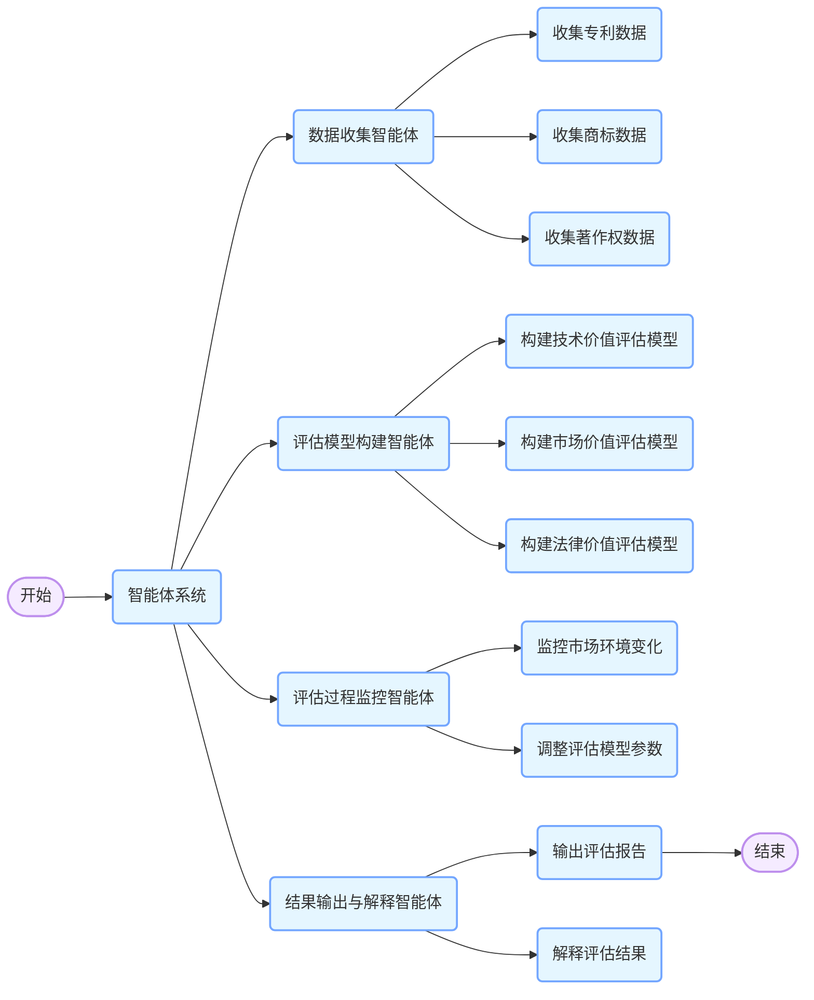

# 利用智能体系统进行全面的公司知识产权价值评估

> 关键词：智能体系统、公司知识产权、价值评估、评估模型、应用场景

> 摘要：本文聚焦于利用智能体系统进行公司知识产权价值评估这一主题。首先介绍了研究的背景、目的、预期读者和文档结构等内容。详细阐述了智能体系统、公司知识产权等核心概念及其联系，并给出相应的原理和架构示意图。深入讲解了核心算法原理，结合 Python 代码进行了具体操作步骤的说明。同时，给出了相关的数学模型和公式，并举例进行了详细讲解。通过项目实战，展示了开发环境搭建、源代码实现及解读分析。探讨了该评估方法在实际中的应用场景，推荐了相关的学习资源、开发工具框架以及论文著作。最后总结了未来发展趋势与挑战，解答了常见问题，并提供了扩展阅读和参考资料，旨在为全面、准确地评估公司知识产权价值提供有效的技术手段和理论支持。

## 1. 背景介绍 
### 1.1 目的和范围
在当今知识经济时代，知识产权已成为公司核心竞争力的重要组成部分。准确评估公司知识产权的价值，对于公司的战略决策、融资、并购等活动具有至关重要的意义。然而，传统的知识产权价值评估方法存在主观性强、评估过程复杂、难以全面考虑各种因素等问题。

本研究的目的在于利用智能体系统构建一个全面、客观、高效的公司知识产权价值评估体系。通过智能体系统的自主性、协作性和适应性，综合考虑知识产权的技术价值、市场价值、法律价值等多方面因素，实现对公司知识产权价值的准确评估。

本研究的范围涵盖了常见的公司知识产权类型，包括专利、商标、著作权等。同时，考虑了不同行业、不同规模公司的知识产权特点，旨在提供一个具有广泛适用性的评估方法。

### 1.2 预期读者
本文的预期读者包括公司的管理人员、知识产权管理人员、金融机构的评估人员、科研人员以及对知识产权价值评估和智能体系统感兴趣的技术爱好者。公司管理人员可以利用本文的评估方法更好地了解公司的知识产权价值，为公司的战略决策提供依据；知识产权管理人员可以借助智能体系统提高知识产权管理的效率和准确性；金融机构的评估人员可以利用该方法为公司的融资、并购等活动提供更可靠的评估报告；科研人员可以从本文中获取关于智能体系统在知识产权价值评估领域的研究思路和方法；技术爱好者可以了解智能体系统的实际应用场景和开发技术。

### 1.3 文档结构概述
本文共分为十个部分。第一部分为背景介绍，阐述了研究的目的、范围、预期读者和文档结构。第二部分介绍了智能体系统和公司知识产权的核心概念及其联系，并给出了相应的原理和架构示意图。第三部分详细讲解了核心算法原理，并结合 Python 代码说明了具体操作步骤。第四部分给出了相关的数学模型和公式，并通过举例进行了详细讲解。第五部分通过项目实战，展示了开发环境搭建、源代码实现及解读分析。第六部分探讨了该评估方法在实际中的应用场景。第七部分推荐了相关的学习资源、开发工具框架以及论文著作。第八部分总结了未来发展趋势与挑战。第九部分解答了常见问题。第十部分提供了扩展阅读和参考资料。

### 1.4 术语表
#### 1.4.1 核心术语定义
- **智能体系统**：由多个智能体组成的系统，每个智能体具有一定的自主性、协作性和适应性，能够感知环境、做出决策并执行相应的动作。
- **公司知识产权**：公司拥有的受法律保护的智力成果，包括专利、商标、著作权、商业秘密等。
- **知识产权价值评估**：对公司知识产权的经济价值进行评估的过程，旨在确定其在市场上的合理价格。

#### 1.4.2 相关概念解释
- **专利价值**：专利的技术价值、市场价值和法律价值的综合体现。技术价值取决于专利的创新性和实用性；市场价值取决于专利产品或服务的市场需求和竞争状况；法律价值取决于专利的有效性和保护范围。
- **商标价值**：商标的知名度、美誉度和市场影响力所带来的经济价值。商标价值与商标的品牌形象、市场份额、消费者忠诚度等因素密切相关。
- **著作权价值**：著作权作品的创作难度、市场需求和传播范围所决定的经济价值。著作权价值与作品的类型、质量、受众群体等因素有关。

#### 1.4.3 缩略词列表
- **AI**：Artificial Intelligence，人工智能
- **MAS**：Multi - Agent System，多智能体系统
- **IP**：Intellectual Property，知识产权

## 2. 核心概念与联系 

### 2.1 智能体系统原理
智能体系统是一种分布式人工智能系统，由多个智能体组成。每个智能体可以看作是一个独立的实体，具有以下特点：
- **自主性**：智能体能够在没有外界干预的情况下，自主地感知环境、做出决策并执行相应的动作。
- **协作性**：智能体可以与其他智能体进行通信和协作，共同完成复杂的任务。
- **适应性**：智能体能够根据环境的变化调整自己的行为和策略。

智能体系统的架构通常包括以下几个部分：
- **智能体层**：由多个智能体组成，每个智能体负责特定的任务。
- **通信层**：负责智能体之间的通信和信息交换。
- **协调层**：负责协调智能体之间的行为和任务分配。
- **环境层**：智能体所处的外部环境，包括各种数据和信息。

以下是智能体系统原理的文本示意图：

智能体系统由多个智能体组成，智能体通过传感器感知环境信息，经过内部的决策模块处理后，通过执行器执行相应的动作。智能体之间通过通信模块进行信息交换和协作，以实现系统的整体目标。环境为智能体提供了数据和信息，同时也受到智能体行为的影响。

### 2.2 公司知识产权概述
公司知识产权是公司的重要资产，主要包括以下几种类型：
- **专利**：发明创造人或其权利受让人对特定的发明创造在一定期限内依法享有的独占实施权。专利可以分为发明专利、实用新型专利和外观设计专利。
- **商标**：用以区别商品或服务来源的标志。商标可以是文字、图形、字母、数字、三维标志、颜色组合和声音等，以及上述要素的组合。
- **著作权**：文学、艺术和科学作品的作者对其作品享有的权利。著作权包括人身权和财产权，人身权如发表权、署名权等，财产权如复制权、发行权等。
- **商业秘密**：不为公众所知悉、具有商业价值并经权利人采取相应保密措施的技术信息、经营信息等商业信息。

### 2.3 智能体系统与公司知识产权价值评估的联系
智能体系统可以应用于公司知识产权价值评估的多个环节，具体如下：
- **数据收集与处理**：智能体可以自动收集与公司知识产权相关的数据，如专利的申请信息、商标的使用情况、著作权的传播数据等，并对这些数据进行清洗、整理和分析。
- **评估模型构建**：智能体可以根据收集到的数据，利用机器学习、深度学习等算法构建知识产权价值评估模型。不同类型的智能体可以负责不同的评估任务，如技术价值评估智能体、市场价值评估智能体等。
- **评估过程监控**：智能体可以实时监控评估过程，及时发现评估过程中出现的问题，并进行调整和优化。例如，当市场环境发生变化时，智能体可以自动调整评估模型的参数。
- **结果输出与解释**：智能体可以将评估结果以直观的方式输出，并对评估结果进行解释。例如，智能体可以生成评估报告，详细说明知识产权的价值构成和评估依据。

### 2.4 核心概念架构的 Mermaid 流程图


## 3. 核心算法原理 & 具体操作步骤 

### 3.1 核心算法原理
在利用智能体系统进行公司知识产权价值评估时，主要涉及以下几种核心算法：
- **机器学习算法**：如决策树、支持向量机、神经网络等，用于构建知识产权价值评估模型。这些算法可以根据历史数据学习知识产权价值与各种影响因素之间的关系，从而对新的知识产权进行价值评估。
- **模糊综合评价算法**：由于知识产权价值评估涉及多个因素，且这些因素的重要性和评价标准往往具有模糊性，因此可以使用模糊综合评价算法对知识产权的价值进行综合评价。
- **层次分析法**：用于确定各评估因素的权重。层次分析法将复杂的评估问题分解为多个层次，通过两两比较确定各因素的相对重要性，从而得到各因素的权重。

### 3.2 Python 代码实现具体操作步骤

#### 3.2.1 数据收集与预处理
```python
import pandas as pd
import numpy as np

# 模拟收集专利数据
patent_data = {
    '专利编号': ['P001', 'P002', 'P003'],
    '技术创新性得分': [80, 90, 70],
    '市场需求得分': [75, 85, 65],
    '法律稳定性得分': [85, 95, 75]
}
patent_df = pd.DataFrame(patent_data)

# 数据预处理：缺失值处理和标准化
patent_df = patent_df.fillna(0)
features = ['技术创新性得分', '市场需求得分', '法律稳定性得分']
for feature in features:
    patent_df[feature] = (patent_df[feature] - patent_df[feature].mean()) / patent_df[feature].std()

print(patent_df)
```

#### 3.2.2 构建评估模型（以决策树为例）
```python
from sklearn.tree import DecisionTreeRegressor
from sklearn.model_selection import train_test_split

# 准备训练数据
X = patent_df[features]
y = np.random.rand(len(patent_df))  # 模拟知识产权价值

# 划分训练集和测试集
X_train, X_test, y_train, y_test = train_test_split(X, y, test_size=0.2, random_state=42)

# 构建决策树模型
model = DecisionTreeRegressor()
model.fit(X_train, y_train)

# 模型评估
score = model.score(X_test, y_test)
print(f"模型得分: {score}")
```

#### 3.2.3 模糊综合评价
```python
import skfuzzy as fuzz
from skfuzzy import control as ctrl

# 定义输入变量
tech_innovation = ctrl.Antecedent(np.arange(0, 101, 1), '技术创新性得分')
market_demand = ctrl.Antecedent(np.arange(0, 101, 1), '市场需求得分')
legal_stability = ctrl.Antecedent(np.arange(0, 101, 1), '法律稳定性得分')

# 定义输出变量
ip_value = ctrl.Consequent(np.arange(0, 101, 1), '知识产权价值')

# 定义模糊集
tech_innovation['低'] = fuzz.trimf(tech_innovation.universe, [0, 0, 50])
tech_innovation['中'] = fuzz.trimf(tech_innovation.universe, [0, 50, 100])
tech_innovation['高'] = fuzz.trimf(tech_innovation.universe, [50, 100, 100])

market_demand['低'] = fuzz.trimf(market_demand.universe, [0, 0, 50])
market_demand['中'] = fuzz.trimf(market_demand.universe, [0, 50, 100])
market_demand['高'] = fuzz.trimf(market_demand.universe, [50, 100, 100])

legal_stability['低'] = fuzz.trimf(legal_stability.universe, [0, 0, 50])
legal_stability['中'] = fuzz.trimf(legal_stability.universe, [0, 50, 100])
legal_stability['高'] = fuzz.trimf(legal_stability.universe, [50, 100, 100])

ip_value['低'] = fuzz.trimf(ip_value.universe, [0, 0, 50])
ip_value['中'] = fuzz.trimf(ip_value.universe, [0, 50, 100])
ip_value['高'] = fuzz.trimf(ip_value.universe, [50, 100, 100])

# 定义模糊规则
rule1 = ctrl.Rule(tech_innovation['高'] & market_demand['高'] & legal_stability['高'], ip_value['高'])
rule2 = ctrl.Rule(tech_innovation['中'] & market_demand['中'] & legal_stability['中'], ip_value['中'])
rule3 = ctrl.Rule(tech_innovation['低'] & market_demand['低'] & legal_stability['低'], ip_value['低'])

# 创建模糊控制系统
ip_value_ctrl = ctrl.ControlSystem([rule1, rule2, rule3])
ip_value_sim = ctrl.ControlSystemSimulation(ip_value_ctrl)

# 输入具体得分进行评估
ip_value_sim.input['技术创新性得分'] = 80
ip_value_sim.input['市场需求得分'] = 75
ip_value_sim.input['法律稳定性得分'] = 85

# 进行模糊推理
ip_value_sim.compute()

# 输出评估结果
print(f"模糊综合评价的知识产权价值: {ip_value_sim.output['知识产权价值']}")
```

#### 3.2.4 层次分析法确定权重
```python
import numpy as np

# 构建判断矩阵
A = np.array([[1, 3, 5],
              [1/3, 1, 3],
              [1/5, 1/3, 1]])

# 计算特征值和特征向量
eigenvalues, eigenvectors = np.linalg.eig(A)

# 最大特征值
max_eigenvalue = np.max(eigenvalues).real

# 对应的特征向量
max_eigenvector = eigenvectors[:, np.argmax(eigenvalues)].real

# 归一化特征向量得到权重
weights = max_eigenvector / np.sum(max_eigenvector)

print(f"各因素权重: {weights}")
```

## 4. 数学模型和公式 & 详细讲解 & 举例说明 

### 4.1 决策树模型数学原理
决策树是一种基于树结构进行决策的模型。决策树的每个内部节点是一个属性上的测试，每个分支是一个测试输出，每个叶节点是一个类别或值。

决策树的构建过程通常基于信息增益、信息增益率或基尼指数等准则。以信息增益为例，信息增益的计算公式为：

$$
IG(D, a) = Ent(D) - \sum_{v = 1}^{V} \frac{|D^v|}{|D|} Ent(D^v)
$$

其中，$IG(D, a)$ 表示属性 $a$ 对数据集 $D$ 的信息增益，$Ent(D)$ 表示数据集 $D$ 的信息熵，$V$ 表示属性 $a$ 的取值个数，$D^v$ 表示属性 $a$ 取值为 $v$ 时的数据集。

信息熵的计算公式为：

$$
Ent(D) = - \sum_{k = 1}^{K} p_k \log_2 p_k
$$

其中，$K$ 表示数据集 $D$ 中类别的个数，$p_k$ 表示第 $k$ 类样本在数据集 $D$ 中所占的比例。

举例说明：假设有一个数据集 $D$ 包含 10 个样本，分为两类，其中第一类有 6 个样本，第二类有 4 个样本。则数据集 $D$ 的信息熵为：

$$
Ent(D) = - (\frac{6}{10} \log_2 \frac{6}{10} + \frac{4}{10} \log_2 \frac{4}{10}) \approx 0.971
$$

假设属性 $a$ 有两个取值 $v_1$ 和 $v_2$，$D^{v_1}$ 包含 4 个样本，其中第一类有 3 个，第二类有 1 个；$D^{v_2}$ 包含 6 个样本，其中第一类有 3 个，第二类有 3 个。则：

$$
Ent(D^{v_1}) = - (\frac{3}{4} \log_2 \frac{3}{4} + \frac{1}{4} \log_2 \frac{1}{4}) \approx 0.811
$$

$$
Ent(D^{v_2}) = - (\frac{3}{6} \log_2 \frac{3}{6} + \frac{3}{6} \log_2 \frac{3}{6}) = 1
$$

属性 $a$ 对数据集 $D$ 的信息增益为：

$$
IG(D, a) = 0.971 - (\frac{4}{10} \times 0.811 + \frac{6}{10} \times 1) \approx 0.107
$$

### 4.2 模糊综合评价数学模型
模糊综合评价的基本步骤包括：确定评价因素集 $U$、评语集 $V$、单因素评价矩阵 $R$ 和权重向量 $W$，然后进行模糊合成运算得到综合评价结果。

设评价因素集 $U = \{u_1, u_2, \cdots, u_n\}$，评语集 $V = \{v_1, v_2, \cdots, v_m\}$，单因素评价矩阵 $R$ 是一个 $n \times m$ 的矩阵，其中 $r_{ij}$ 表示因素 $u_i$ 对评语 $v_j$ 的隶属度。权重向量 $W = (w_1, w_2, \cdots, w_n)$，满足 $\sum_{i = 1}^{n} w_i = 1$。

综合评价结果 $B$ 可以通过模糊合成运算得到：

$$
B = W \circ R
$$

其中，$\circ$ 表示模糊合成算子，常用的有最大 - 最小合成算子和加权平均合成算子。

举例说明：假设评价因素集 $U = \{技术创新性, 市场需求, 法律稳定性\}$，评语集 $V = \{低, 中, 高\}$，单因素评价矩阵 $R$ 为：

$$
R = \begin{bmatrix}
0.2 & 0.5 & 0.3 \\
0.1 & 0.6 & 0.3 \\
0.2 & 0.4 & 0.4
\end{bmatrix}
$$

权重向量 $W = (0.3, 0.4, 0.3)$。使用最大 - 最小合成算子进行模糊合成运算：

$$
B = W \circ R = \begin{bmatrix}
0.3 & 0.4 & 0.3
\end{bmatrix} \circ \begin{bmatrix}
0.2 & 0.5 & 0.3 \\
0.1 & 0.6 & 0.3 \\
0.2 & 0.4 & 0.4
\end{bmatrix} = \begin{bmatrix}
\max(\min(0.3, 0.2), \min(0.4, 0.1), \min(0.3, 0.2)) & \max(\min(0.3, 0.5), \min(0.4, 0.6), \min(0.3, 0.4)) & \max(\min(0.3, 0.3), \min(0.4, 0.3), \min(0.3, 0.4))
\end{bmatrix} = \begin{bmatrix}
0.2 & 0.4 & 0.3
\end{bmatrix}
$$

### 4.3 层次分析法数学原理
层次分析法的基本步骤包括：构建层次结构模型、构造判断矩阵、计算权重向量和进行一致性检验。

判断矩阵 $A = (a_{ij})_{n \times n}$ 是一个正互反矩阵，其中 $a_{ij}$ 表示因素 $i$ 相对于因素 $j$ 的重要性程度，且满足 $a_{ij} > 0$，$a_{ji} = \frac{1}{a_{ij}}$，$a_{ii} = 1$。

计算判断矩阵的最大特征值 $\lambda_{max}$ 和对应的特征向量 $W$，归一化后的特征向量即为权重向量。

一致性指标 $CI$ 的计算公式为：

$$
CI = \frac{\lambda_{max} - n}{n - 1}
$$

其中，$n$ 是判断矩阵的阶数。

随机一致性指标 $RI$ 可以通过查表得到，当 $n = 3$ 时，$RI = 0.58$。

一致性比率 $CR$ 的计算公式为：

$$
CR = \frac{CI}{RI}
$$

当 $CR < 0.1$ 时，认为判断矩阵具有满意的一致性。

举例说明：假设判断矩阵 $A$ 为：

$$
A = \begin{bmatrix}
1 & 3 & 5 \\
\frac{1}{3} & 1 & 3 \\
\frac{1}{5} & \frac{1}{3} & 1
\end{bmatrix}
$$

计算得到 $\lambda_{max} \approx 3.038$，$CI = \frac{3.038 - 3}{3 - 1} \approx 0.019$，$CR = \frac{0.019}{0.58} \approx 0.033 < 0.1$，说明判断矩阵具有满意的一致性。

## 5. 项目实战：代码实际案例和详细解释说明 

### 5.1  开发环境搭建
#### 5.1.1 安装 Python
首先，需要安装 Python 环境。可以从 Python 官方网站（https://www.python.org/downloads/）下载适合自己操作系统的 Python 安装包，并按照安装向导进行安装。建议安装 Python 3.7 及以上版本。

#### 5.1.2 安装必要的库
在命令行中使用以下命令安装必要的 Python 库：
```sh
pip install pandas numpy scikit-learn scikit-fuzzy
```

### 5.2  源代码详细实现和代码解读
以下是一个完整的利用智能体系统进行公司知识产权价值评估的代码示例：

```python
import pandas as pd
import numpy as np
from sklearn.tree import DecisionTreeRegressor
from sklearn.model_selection import train_test_split
import skfuzzy as fuzz
from skfuzzy import control as ctrl

# 模拟收集专利数据
def collect_patent_data():
    patent_data = {
        '专利编号': ['P001', 'P002', 'P003', 'P004', 'P005'],
        '技术创新性得分': [80, 90, 70, 85, 75],
        '市场需求得分': [75, 85, 65, 80, 70],
        '法律稳定性得分': [85, 95, 75, 90, 80]
    }
    patent_df = pd.DataFrame(patent_data)
    return patent_df

# 数据预处理
def preprocess_data(df):
    df = df.fillna(0)
    features = ['技术创新性得分', '市场需求得分', '法律稳定性得分']
    for feature in features:
        df[feature] = (df[feature] - df[feature].mean()) / df[feature].std()
    return df

# 构建决策树评估模型
def build_decision_tree_model(X, y):
    X_train, X_test, y_train, y_test = train_test_split(X, y, test_size=0.2, random_state=42)
    model = DecisionTreeRegressor()
    model.fit(X_train, y_train)
    score = model.score(X_test, y_test)
    print(f"模型得分: {score}")
    return model

# 模糊综合评价
def fuzzy_evaluation():
    # 定义输入变量
    tech_innovation = ctrl.Antecedent(np.arange(0, 101, 1), '技术创新性得分')
    market_demand = ctrl.Antecedent(np.arange(0, 101, 1), '市场需求得分')
    legal_stability = ctrl.Antecedent(np.arange(0, 101, 1), '法律稳定性得分')

    # 定义输出变量
    ip_value = ctrl.Consequent(np.arange(0, 101, 1), '知识产权价值')

    # 定义模糊集
    tech_innovation['低'] = fuzz.trimf(tech_innovation.universe, [0, 0, 50])
    tech_innovation['中'] = fuzz.trimf(tech_innovation.universe, [0, 50, 100])
    tech_innovation['高'] = fuzz.trimf(tech_innovation.universe, [50, 100, 100])

    market_demand['低'] = fuzz.trimf(market_demand.universe, [0, 0, 50])
    market_demand['中'] = fuzz.trimf(market_demand.universe, [0, 50, 100])
    market_demand['高'] = fuzz.trimf(market_demand.universe, [50, 100, 100])

    legal_stability['低'] = fuzz.trimf(legal_stability.universe, [0, 0, 50])
    legal_stability['中'] = fuzz.trimf(legal_stability.universe, [0, 50, 100])
    legal_stability['高'] = fuzz.trimf(legal_stability.universe, [50, 100, 100])

    ip_value['低'] = fuzz.trimf(ip_value.universe, [0, 0, 50])
    ip_value['中'] = fuzz.trimf(ip_value.universe, [0, 50, 100])
    ip_value['高'] = fuzz.trimf(ip_value.universe, [50, 100, 100])

    # 定义模糊规则
    rule1 = ctrl.Rule(tech_innovation['高'] & market_demand['高'] & legal_stability['高'], ip_value['高'])
    rule2 = ctrl.Rule(tech_innovation['中'] & market_demand['中'] & legal_stability['中'], ip_value['中'])
    rule3 = ctrl.Rule(tech_innovation['低'] & market_demand['低'] & legal_stability['低'], ip_value['低'])

    # 创建模糊控制系统
    ip_value_ctrl = ctrl.ControlSystem([rule1, rule2, rule3])
    ip_value_sim = ctrl.ControlSystemSimulation(ip_value_ctrl)

    # 输入具体得分进行评估
    ip_value_sim.input['技术创新性得分'] = 80
    ip_value_sim.input['市场需求得分'] = 75
    ip_value_sim.input['法律稳定性得分'] = 85

    # 进行模糊推理
    ip_value_sim.compute()

    # 输出评估结果
    print(f"模糊综合评价的知识产权价值: {ip_value_sim.output['知识产权价值']}")

# 主函数
def main():
    # 收集数据
    patent_df = collect_patent_data()

    # 数据预处理
    processed_df = preprocess_data(patent_df)

    # 准备训练数据
    features = ['技术创新性得分', '市场需求得分', '法律稳定性得分']
    X = processed_df[features]
    y = np.random.rand(len(processed_df))  # 模拟知识产权价值

    # 构建决策树模型
    model = build_decision_tree_model(X, y)

    # 模糊综合评价
    fuzzy_evaluation()

if __name__ == "__main__":
    main()
```

### 5.3  代码解读与分析
#### 5.3.1 数据收集函数 `collect_patent_data`
该函数模拟收集专利数据，创建一个包含专利编号、技术创新性得分、市场需求得分和法律稳定性得分的 DataFrame。

#### 5.3.2 数据预处理函数 `preprocess_data`
该函数对收集到的数据进行预处理，包括缺失值处理和标准化。缺失值用 0 填充，每个特征进行标准化处理，使数据具有零均值和单位方差。

#### 5.3.3 决策树模型构建函数 `build_decision_tree_model`
该函数将数据集划分为训练集和测试集，使用决策树回归模型进行训练，并输出模型的得分。

#### 5.3.4 模糊综合评价函数 `fuzzy_evaluation`
该函数定义了输入变量、输出变量和模糊集，制定了模糊规则，创建了模糊控制系统，并进行模糊推理，输出知识产权的模糊综合评价结果。

#### 5.3.5 主函数 `main`
主函数调用上述函数，依次完成数据收集、数据预处理、决策树模型构建和模糊综合评价的过程。

## 6. 实际应用场景 
### 6.1 公司战略决策
公司在制定战略决策时，需要准确了解自身知识产权的价值。通过利用智能体系统进行知识产权价值评估，公司可以确定哪些知识产权具有较高的价值，从而将资源集中投入到这些核心知识产权的研发和保护上。例如，一家科技公司通过评估发现某项专利技术具有巨大的市场潜力和技术创新性，公司可以加大对该专利技术的研发投入，进一步提升其市场竞争力。

### 6.2 融资与并购
在融资和并购活动中，准确评估公司知识产权的价值至关重要。金融机构在为公司提供融资时，需要了解公司知识产权的价值作为抵押物的价值。在公司并购过程中，收购方需要评估被收购方的知识产权价值，以确定合理的收购价格。利用智能体系统进行评估可以提供更客观、准确的评估结果，为融资和并购决策提供有力支持。

### 6.3 知识产权交易
在知识产权交易市场上，买卖双方需要对知识产权的价值达成共识。智能体系统可以为知识产权交易提供公正、客观的评估结果，帮助买卖双方确定合理的交易价格。例如，一家软件公司想要出售其拥有的软件著作权，通过智能体系统评估该著作权的价值，可以为交易谈判提供参考。

### 6.4 知识产权风险管理
公司在知识产权管理过程中面临着各种风险，如专利侵权风险、商标被抢注风险等。通过对知识产权价值的评估，公司可以识别出高价值的知识产权，并采取相应的风险防范措施。例如，对于具有高价值的专利，公司可以加强专利保护，及时申请专利布局，防止竞争对手侵权。

## 7. 工具和资源推荐
### 7.1 学习资源推荐
#### 7.1.1 书籍推荐
- 《人工智能：一种现代的方法》：这是一本经典的人工智能教材，涵盖了人工智能的各个领域，包括智能体系统、机器学习、知识表示等内容，对于深入理解智能体系统的原理和应用具有重要的参考价值。
- 《知识产权评估》：详细介绍了知识产权评估的理论、方法和实践，对于学习公司知识产权价值评估的专业知识非常有帮助。
- 《Python 机器学习》：本书以 Python 为工具，介绍了机器学习的各种算法和应用，对于利用 Python 实现知识产权价值评估模型很有指导意义。

#### 7.1.2 在线课程
- Coursera 上的“人工智能基础”课程：由知名高校的教授授课，系统地介绍了人工智能的基础知识和核心算法，包括智能体系统的相关内容。
- edX 上的“知识产权管理与评估”课程：专注于知识产权管理和评估的专业知识，结合实际案例进行讲解，有助于提高知识产权价值评估的实践能力。
- 网易云课堂上的“Python 数据分析与机器学习实战”课程：通过实际项目案例，教授如何使用 Python 进行数据分析和机器学习模型的构建，对于实现知识产权价值评估的代码实践很有帮助。

#### 7.1.3 技术博客和网站
- 机器之心：提供人工智能领域的最新技术动态、研究成果和实践案例，对于了解智能体系统在各个领域的应用有很大的帮助。
- 中国知识产权网：专注于知识产权领域的信息服务，提供知识产权法律法规、政策解读、评估案例等内容，是学习知识产权价值评估的重要资源。
- Stack Overflow：一个技术问答社区，开发者可以在上面提问、分享经验和代码，对于解决在实现知识产权价值评估过程中遇到的技术问题非常有帮助。

### 7.2 开发工具框架推荐
#### 7.2.1 IDE和编辑器
- PyCharm：一款专业的 Python 集成开发环境，具有代码编辑、调试、版本控制等功能，支持各种 Python 库和框架，对于开发知识产权价值评估的 Python 代码非常方便。
- Jupyter Notebook：一种交互式的开发环境，可以将代码、文本、图表等内容集成在一个文档中，适合进行数据分析和模型实验，对于验证知识产权价值评估模型的效果很有用。

#### 7.2.2 调试和性能分析工具
- pdb：Python 自带的调试器，可以帮助开发者逐行调试代码，找出代码中的错误和问题。
- cProfile：Python 的性能分析工具，可以分析代码的运行时间和函数调用情况，帮助开发者优化代码性能。

#### 7.2.3 相关框架和库
- scikit-learn：一个常用的机器学习库，提供了各种机器学习算法的实现，如决策树、支持向量机、神经网络等，对于构建知识产权价值评估模型非常方便。
- scikit-fuzzy：一个用于模糊逻辑和模糊控制的 Python 库，支持模糊集合的定义、模糊规则的制定和模糊推理的实现，适用于知识产权价值的模糊综合评价。

### 7.3 相关论文著作推荐
#### 7.3.1 经典论文
- “Multi - Agent Systems: A Modern Approach to Distributed Artificial Intelligence”：该论文系统地介绍了多智能体系统的概念、原理和应用，是智能体系统领域的经典之作。
- “Valuation of Intellectual Property: A Review of the Literature”：对知识产权价值评估的相关文献进行了综述，分析了不同评估方法的优缺点，为知识产权价值评估的研究提供了重要的参考。

#### 7.3.2 最新研究成果
- 近年来，在人工智能和知识产权领域的顶级学术会议和期刊上，如 AAAI、IJCAI、Journal of Intellectual Property Rights 等，发表了许多关于利用智能体系统进行知识产权价值评估的最新研究成果。可以通过学术数据库如 IEEE Xplore、ACM Digital Library 等进行检索。

#### 7.3.3 应用案例分析
- 一些知名企业的知识产权价值评估案例，如苹果公司、华为公司等，在相关的商业杂志和行业报告中有所介绍。这些案例分析可以帮助我们了解实际应用中智能体系统在知识产权价值评估中的具体应用和效果。

## 8. 总结：未来发展趋势与挑战
### 8.1 未来发展趋势
#### 8.1.1 智能化程度不断提高
随着人工智能技术的不断发展，智能体系统的智能化程度将不断提高。智能体将能够更加准确地感知环境、理解复杂的信息，并做出更加合理的决策。在公司知识产权价值评估中，智能体系统将能够自动收集更多、更全面的数据，构建更加精准的评估模型，提高评估结果的准确性和可靠性。

#### 8.1.2 与区块链技术结合
区块链技术具有去中心化、不可篡改、可追溯等特点，将智能体系统与区块链技术结合，可以提高知识产权价值评估的可信度和安全性。例如，将知识产权的相关信息记录在区块链上，智能体系统可以从区块链上获取准确、可靠的数据进行评估，同时评估结果也可以存储在区块链上，确保评估过程的透明和可追溯。

#### 8.1.3 跨领域融合应用
未来，智能体系统在公司知识产权价值评估中的应用将与其他领域进行更深入的融合。例如，与大数据、云计算、物联网等技术相结合，实现对知识产权数据的实时监测和分析；与法律、金融等领域相结合，为知识产权的保护、交易和融资提供更加全面的服务。

### 8.2 挑战
#### 8.2.1 数据质量和隐私问题
准确的知识产权价值评估依赖于高质量的数据。然而，目前知识产权数据存在数据不完整、不准确、不一致等问题，影响了评估结果的准确性。同时，知识产权数据涉及公司的商业秘密和隐私，如何在保证数据安全和隐私的前提下，实现数据的有效利用是一个亟待解决的问题。

#### 8.2.2 评估模型的解释性
智能体系统构建的评估模型往往是复杂的黑盒模型，难以解释评估结果的形成过程和依据。在实际应用中，决策者需要了解评估结果的合理性和可靠性，因此如何提高评估模型的解释性是一个重要的挑战。

#### 8.2.3 法律法规和标准的完善
目前，关于利用智能体系统进行公司知识产权价值评估的法律法规和标准还不完善。缺乏统一的评估方法和标准，导致评估结果的可比性和可信度受到影响。因此，需要加快制定相关的法律法规和标准，规范评估行为。

## 9. 附录：常见问题与解答
### 9.1 智能体系统在知识产权价值评估中的优势是什么？
智能体系统在知识产权价值评估中的优势主要体现在以下几个方面：
- **自动化和高效性**：智能体可以自动收集、处理和分析大量的知识产权数据，大大提高了评估效率。
- **全面性和客观性**：智能体系统可以综合考虑知识产权的多个方面因素，如技术价值、市场价值、法律价值等，减少了人为因素的干扰，使评估结果更加客观和全面。
- **适应性和灵活性**：智能体系统可以根据环境的变化和评估需求的不同，调整评估模型和方法，具有较强的适应性和灵活性。

### 9.2 如何保证智能体系统评估结果的准确性？
为了保证智能体系统评估结果的准确性，可以采取以下措施：
- **数据质量控制**：确保收集到的知识产权数据准确、完整、一致。可以通过数据清洗、验证和补充等方法提高数据质量。
- **模型选择和优化**：根据评估问题的特点和数据的情况，选择合适的评估模型，并对模型进行优化和调整。可以使用交叉验证、网格搜索等方法选择最优的模型参数。
- **多模型融合**：结合多种评估模型的结果，进行综合评估。不同的模型可能具有不同的优势和局限性，多模型融合可以提高评估结果的准确性和可靠性。

### 9.3 智能体系统在知识产权价值评估中的应用是否受行业限制？
智能体系统在知识产权价值评估中的应用不受行业限制。不同行业的知识产权具有不同的特点，但智能体系统可以通过调整评估模型和方法，适应不同行业的需求。例如，对于科技行业的专利评估，可以重点考虑技术创新性和市场潜力；对于文化创意行业的著作权评估，可以关注作品的艺术价值和市场传播范围。

## 10. 扩展阅读 & 参考资料
### 10.1 扩展阅读
- 《智能体系统原理与应用》：深入介绍了智能体系统的原理、设计和应用，对于进一步了解智能体系统在各个领域的应用有很大的帮助。
- 《知识产权战略管理》：从战略管理的角度出发，介绍了知识产权的规划、保护和运营等方面的内容，有助于全面理解公司知识产权管理的重要性。
- 《大数据时代的数据分析与挖掘》：介绍了大数据分析和挖掘的技术和方法，对于利用大数据进行知识产权价值评估有一定的启示作用。

### 10.2 参考资料
- 中华人民共和国知识产权局官方网站：提供了知识产权法律法规、政策解读、专利申请等方面的信息，是了解我国知识产权制度的重要参考。
- IEEE 计算机协会官方网站：发布了人工智能、智能体系统等领域的最新研究成果和技术动态，对于跟踪行业前沿技术有很大的帮助。
- 各高校和科研机构的学术数据库：如清华大学学术期刊库、中国知网等，包含了大量的学术论文和研究报告，是进行学术研究和技术创新的重要资源。