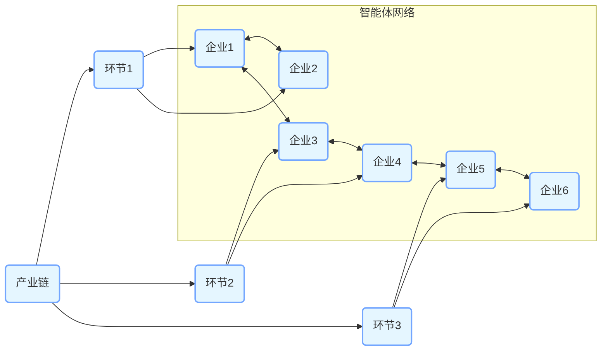

# 利用智能体网络分析公司在产业链中的地位变化

> 关键词：智能体网络、产业链、公司地位变化、复杂网络、数据分析

> 摘要：本文聚焦于利用智能体网络分析公司在产业链中的地位变化。首先介绍了相关背景知识，包括研究目的、预期读者等内容。接着阐述了智能体网络、产业链等核心概念及其联系，并给出相应的示意图和流程图。详细讲解了核心算法原理，用 Python 代码进行了具体实现。探讨了相关数学模型和公式，结合实际例子进行说明。通过项目实战展示了如何搭建开发环境、实现源代码并进行解读分析。介绍了智能体网络分析在实际中的应用场景，推荐了学习资源、开发工具框架以及相关论文著作。最后总结了未来发展趋势与挑战，解答了常见问题并提供了扩展阅读和参考资料，旨在为深入理解和运用智能体网络分析公司在产业链中的地位变化提供全面的技术指导。

## 1. 背景介绍 
### 1.1 目的和范围
在当今复杂多变的商业环境中，产业链的结构和动态变化对公司的发展有着至关重要的影响。公司在产业链中的地位决定了其获取资源、市场份额以及利润的能力。传统的分析方法往往难以全面、动态地把握公司在产业链中的地位变化。本研究的目的在于利用智能体网络这一先进的技术手段，构建一个能够模拟和分析公司在产业链中相互关系及地位变化的模型。

本研究的范围涵盖了多个行业的产业链，包括制造业、服务业、信息技术产业等。通过对不同行业产业链中公司的分析，验证智能体网络模型的通用性和有效性。同时，研究不仅关注公司在产业链中的静态地位，更着重于分析其随时间的动态变化，以揭示产业链发展的规律和趋势。

### 1.2 预期读者
本文预期读者包括从事产业链研究的学者、企业战略规划人员、市场分析师以及对复杂网络和人工智能技术感兴趣的技术人员。对于学者而言，本文提供了一种新的研究视角和方法，有助于推动产业链相关理论的发展；企业战略规划人员可以借助本文的分析方法，更好地了解自身企业在产业链中的地位，制定合理的发展战略；市场分析师可以通过智能体网络分析，更准确地预测市场趋势和企业竞争力；技术人员则可以从本文中获取关于智能体网络建模和算法实现的技术细节，为进一步的研究和开发提供参考。

### 1.3 文档结构概述
本文共分为十个部分。第一部分背景介绍，阐述了研究的目的、范围、预期读者和文档结构概述，并给出了相关术语的定义和解释。第二部分介绍核心概念与联系，包括智能体网络、产业链等概念的原理和架构，同时提供文本示意图和 Mermaid 流程图。第三部分详细讲解核心算法原理，并使用 Python 源代码进行具体实现。第四部分介绍数学模型和公式，结合实际例子进行详细说明。第五部分通过项目实战，展示开发环境搭建、源代码实现和代码解读分析。第六部分介绍智能体网络分析在实际中的应用场景。第七部分推荐学习资源、开发工具框架以及相关论文著作。第八部分总结未来发展趋势与挑战。第九部分解答常见问题。第十部分提供扩展阅读和参考资料。

### 1.4 术语表
#### 1.4.1 核心术语定义
- **智能体（Agent）**：是一个具有自主性、反应性、社会性和主动性的实体，能够在特定环境中感知信息、进行决策并采取行动。在产业链分析中，智能体可以代表公司、供应商、客户等实体。
- **智能体网络（Agent Network）**：由多个智能体相互连接形成的网络结构，智能体之间通过信息传递和交互来实现各自的目标。在产业链中，智能体网络反映了公司之间的合作、竞争等关系。
- **产业链（Industrial Chain）**：是各个产业部门之间基于一定的技术经济关联，并依据特定的逻辑关系和时空布局关系客观形成的链条式关联关系形态。产业链包含价值链、企业链、供需链和空间链四个维度。
- **公司地位（Company Status）**：指公司在产业链中所处的位置和影响力，包括市场份额、技术实力、品牌价值、供应链地位等多个方面。

#### 1.4.2 相关概念解释
- **复杂网络（Complex Network）**：是描述复杂系统中个体之间相互关系的数学模型，具有节点（个体）和边（关系）两个基本要素。智能体网络是复杂网络的一种特殊形式，强调智能体的自主决策和行为能力。
- **多智能体系统（Multi - Agent System，MAS）**：由多个智能体组成的系统，智能体之间通过协作、竞争等方式实现系统的整体目标。在产业链分析中，多智能体系统可以模拟公司之间的动态交互过程。
- **网络拓扑结构（Network Topology）**：指网络中节点和边的连接方式和布局。不同的网络拓扑结构对智能体之间的信息传播和交互效率有重要影响，进而影响公司在产业链中的地位。

#### 1.4.3 缩略词列表
- **MAS**：Multi - Agent System（多智能体系统）
- **AI**：Artificial Intelligence（人工智能）
- **ML**：Machine Learning（机器学习）

## 2. 核心概念与联系 

### 智能体网络原理
智能体网络是由多个智能体组成的复杂系统。每个智能体具有独立的感知、决策和行动能力。智能体通过感知周围环境的信息，根据自身的目标和规则进行决策，并采取相应的行动。智能体之间通过信息传递和交互来实现协作和竞争。

例如，在一个产业链的智能体网络中，公司作为智能体，感知市场需求、供应商供应能力、竞争对手策略等信息。根据这些信息，公司决定生产规模、产品价格、合作对象等决策，并采取相应的行动，如扩大生产、降低价格、与其他公司合作等。

### 产业链原理
产业链是各个产业部门之间基于一定的技术经济关联形成的链条式关联关系形态。产业链包含多个环节，从原材料供应、生产制造、产品销售到售后服务等。每个环节都有不同的企业参与，这些企业之间存在着供需关系、合作关系和竞争关系。

例如，在智能手机产业链中，原材料供应商提供芯片、屏幕、电池等零部件，手机制造商进行组装和生产，经销商负责销售，售后服务商提供维修和保养服务。这些企业之间相互依存、相互影响，共同构成了智能手机产业链。

### 智能体网络与产业链的联系
智能体网络可以很好地模拟产业链中企业之间的复杂关系。在智能体网络中，每个企业可以看作一个智能体，企业之间的供需关系、合作关系和竞争关系可以通过智能体之间的信息传递和交互来表示。通过对智能体网络的分析，可以深入了解企业在产业链中的地位和作用，以及产业链的整体结构和动态变化。

### 文本示意图
智能体网络与产业链的关系可以用以下文本示意图表示：

产业链由多个环节组成，每个环节包含多个企业。这些企业作为智能体，通过信息传递和交互形成智能体网络。智能体网络中的智能体之间的关系反映了产业链中企业之间的供需、合作和竞争关系。通过对智能体网络的分析，可以了解企业在产业链中的地位和产业链的整体结构和动态变化。

### Mermaid 流程图


## 3. 核心算法原理 & 具体操作步骤 

### 智能体行为决策算法
智能体的行为决策是智能体网络分析的核心。在本研究中，我们采用基于规则的决策算法和机器学习算法相结合的方法。

#### 基于规则的决策算法
基于规则的决策算法是根据预先定义的规则来进行决策。例如，在产业链中，企业根据市场需求和自身库存情况来决定生产规模。如果市场需求大于库存，企业增加生产；如果市场需求小于库存，企业减少生产。

以下是一个简单的基于规则的决策算法的 Python 代码示例：
```python
class CompanyAgent:
    def __init__(self, initial_inventory, production_capacity):
        self.inventory = initial_inventory
        self.production_capacity = production_capacity

    def decision(self, market_demand):
        if market_demand > self.inventory:
            production_amount = min(market_demand - self.inventory, self.production_capacity)
            self.inventory += production_amount
            return production_amount
        else:
            production_amount = 0
            return production_amount

# 示例使用
company = CompanyAgent(100, 50)
market_demand = 150
production = company.decision(market_demand)
print(f"生产数量: {production}, 库存: {company.inventory}")
```

#### 机器学习决策算法
机器学习决策算法是通过对历史数据的学习来进行决策。例如，使用神经网络算法，根据市场需求、原材料价格、竞争对手策略等历史数据，预测未来的市场趋势，从而决定企业的生产规模、产品价格等决策。

以下是一个简单的使用神经网络进行决策的 Python 代码示例：
```python
import numpy as np
from tensorflow.keras.models import Sequential
from tensorflow.keras.layers import Dense

# 生成示例数据
np.random.seed(0)
X = np.random.rand(100, 3)  # 输入特征：市场需求、原材料价格、竞争对手策略
y = np.random.randint(0, 2, 100)  # 输出决策：生产或不生产

# 构建神经网络模型
model = Sequential()
model.add(Dense(10, input_dim=3, activation='relu'))
model.add(Dense(1, activation='sigmoid'))

# 编译模型
model.compile(loss='binary_crossentropy', optimizer='adam', metrics=['accuracy'])

# 训练模型
model.fit(X, y, epochs=100, batch_size=10, verbose=0)

# 进行决策
new_data = np.random.rand(1, 3)
prediction = model.predict(new_data)
print(f"决策结果: {prediction}")
```

### 智能体网络演化算法
智能体网络的演化是指智能体之间的关系随时间的变化。在本研究中，我们采用基于网络动力学的演化算法。

#### 网络动力学原理
网络动力学研究网络中节点和边的动态变化。在智能体网络中，节点代表智能体，边代表智能体之间的关系。网络动力学通过模拟节点和边的变化来反映智能体网络的演化。

#### 演化算法步骤
1. **初始化智能体网络**：随机生成智能体网络的节点和边，每个节点代表一个智能体，边代表智能体之间的关系。
2. **智能体行为决策**：每个智能体根据自身的感知信息和决策算法进行决策，并采取相应的行动。
3. **网络更新**：根据智能体的行动，更新智能体网络的节点和边。例如，如果两个智能体之间建立了合作关系，则在网络中添加一条边；如果两个智能体之间的合作关系结束，则在网络中删除一条边。
4. **重复步骤 2 和 3**：不断重复智能体行为决策和网络更新的过程，直到达到指定的时间步或满足终止条件。

以下是一个简单的智能体网络演化算法的 Python 代码示例：
```python
import networkx as nx
import random

# 初始化智能体网络
G = nx.Graph()
num_agents = 10
for i in range(num_agents):
    G.add_node(i)

# 随机添加边
for i in range(num_agents):
    for j in range(i + 1, num_agents):
        if random.random() < 0.3:
            G.add_edge(i, j)

# 演化过程
num_steps = 10
for step in range(num_steps):
    # 智能体行为决策
    for node in G.nodes():
        # 这里简单模拟智能体的决策，随机选择是否与其他智能体建立合作关系
        if random.random() < 0.2:
            other_node = random.choice(list(G.nodes()))
            if other_node != node:
                G.add_edge(node, other_node)
    # 网络更新
    # 这里简单模拟删除一些边
    for edge in list(G.edges()):
        if random.random() < 0.1:
            G.remove_edge(*edge)

# 输出最终的智能体网络
print("最终的智能体网络节点数:", G.number_of_nodes())
print("最终的智能体网络边数:", G.number_of_edges())
```

## 4. 数学模型和公式 & 详细讲解 & 举例说明 

### 智能体行为决策模型
#### 基于规则的决策模型
在基于规则的决策模型中，智能体的决策可以用以下公式表示：

设 $D$ 为市场需求，$I$ 为智能体的库存，$P_{max}$ 为智能体的最大生产能力，$P$ 为智能体的生产数量，则：

$$
P = 
\begin{cases}
\min(D - I, P_{max}) & \text{if } D > I \\
0 & \text{if } D \leq I
\end{cases}
$$

**详细讲解**：当市场需求 $D$ 大于库存 $I$ 时，智能体的生产数量 $P$ 为市场需求与库存之差和最大生产能力中的较小值；当市场需求 $D$ 小于等于库存 $I$ 时，智能体不进行生产，生产数量 $P$ 为 0。

**举例说明**：假设市场需求 $D = 200$，智能体的库存 $I = 100$，最大生产能力 $P_{max} = 80$，则生产数量 $P = \min(200 - 100, 80) = 80$。

#### 机器学习决策模型
在机器学习决策模型中，通常使用神经网络来进行决策。神经网络的输出可以表示智能体的决策概率。

设神经网络的输入为 $X = [x_1, x_2, \cdots, x_n]$，输出为 $y$，则神经网络的前向传播过程可以表示为：

$$
z^{(l)} = W^{(l)}a^{(l - 1)} + b^{(l)}
$$

$$
a^{(l)} = f(z^{(l)})
$$

其中，$W^{(l)}$ 是第 $l$ 层的权重矩阵，$b^{(l)}$ 是第 $l$ 层的偏置向量，$a^{(l)}$ 是第 $l$ 层的激活值，$f$ 是激活函数。

**详细讲解**：神经网络通过不断调整权重矩阵 $W^{(l)}$ 和偏置向量 $b^{(l)}$ 来拟合输入数据和输出数据之间的关系。在决策时，根据神经网络的输出 $y$ 来进行决策。例如，如果 $y > 0.5$，则智能体采取某种行动；如果 $y \leq 0.5$，则智能体不采取行动。

**举例说明**：假设神经网络的输入为市场需求、原材料价格和竞争对手策略三个特征，经过神经网络的前向传播，输出 $y = 0.7$，则智能体采取生产行动。

### 智能体网络演化模型
#### 网络拓扑结构模型
智能体网络的拓扑结构可以用图论中的图 $G=(V, E)$ 来表示，其中 $V$ 是节点集合，$E$ 是边集合。

节点的度 $d(v)$ 表示与节点 $v$ 相连的边的数量，即：

$$
d(v) = \sum_{u \in V} A_{vu}
$$

其中，$A$ 是图 $G$ 的邻接矩阵，$A_{vu}$ 表示节点 $v$ 和节点 $u$ 之间是否有边相连，$A_{vu} = 1$ 表示有边相连，$A_{vu} = 0$ 表示没有边相连。

**详细讲解**：节点的度反映了节点在网络中的连接程度，度越大，说明节点与其他节点的联系越紧密。

**举例说明**：假设有一个智能体网络，节点集合 $V = \{1, 2, 3\}$，邻接矩阵 $A = \begin{bmatrix}0 & 1 & 1 \\ 1 & 0 & 0 \\ 1 & 0 & 0\end{bmatrix}$，则节点 1 的度 $d(1) = 2$，节点 2 的度 $d(2) = 1$，节点 3 的度 $d(3) = 1$。

#### 网络演化模型
智能体网络的演化可以用网络动力学模型来描述。在每个时间步 $t$，网络的状态可以用图 $G_t=(V_t, E_t)$ 表示。

网络的演化规则可以表示为：

$$
G_{t + 1} = F(G_t, A_t)
$$

其中，$A_t$ 是智能体在时间步 $t$ 的行动集合，$F$ 是演化函数，根据智能体的行动更新网络的拓扑结构。

**详细讲解**：网络的演化是由智能体的行动决定的，智能体的行动包括建立新的连接、删除已有的连接等。演化函数 $F$ 根据智能体的行动更新网络的节点和边，从而实现网络的演化。

**举例说明**：假设在时间步 $t$，智能体网络 $G_t$ 有节点 $\{1, 2, 3\}$ 和边 $\{(1, 2)\}$，在时间步 $t$ 中，智能体 1 和智能体 3 建立了合作关系，则在时间步 $t + 1$，网络 $G_{t + 1}$ 有节点 $\{1, 2, 3\}$ 和边 $\{(1, 2), (1, 3)\}$。

## 5. 项目实战：代码实际案例和详细解释说明 

### 5.1  开发环境搭建
#### 安装 Python
首先，需要安装 Python 环境。可以从 Python 官方网站（https://www.python.org/downloads/） 下载适合自己操作系统的 Python 安装包，并按照安装向导进行安装。

#### 安装必要的库
在本项目中，需要安装以下几个必要的 Python 库：
- **NumPy**：用于数值计算。
- **TensorFlow**：用于构建和训练机器学习模型。
- **NetworkX**：用于构建和分析复杂网络。
- **Matplotlib**：用于数据可视化。

可以使用以下命令来安装这些库：
```sh
pip install numpy tensorflow networkx matplotlib
```

### 5.2  源代码详细实现和代码解读
以下是一个完整的项目实战代码示例，用于模拟公司在产业链中的地位变化：
```python
import numpy as np
import networkx as nx
import matplotlib.pyplot as plt
from tensorflow.keras.models import Sequential
from tensorflow.keras.layers import Dense

# 定义公司智能体类
class CompanyAgent:
    def __init__(self, id, initial_inventory, production_capacity, market_share):
        self.id = id
        self.inventory = initial_inventory
        self.production_capacity = production_capacity
        self.market_share = market_share
        self.model = self.build_model()

    def build_model(self):
        model = Sequential()
        model.add(Dense(10, input_dim=3, activation='relu'))
        model.add(Dense(1, activation='sigmoid'))
        model.compile(loss='binary_crossentropy', optimizer='adam', metrics=['accuracy'])
        return model

    def train_model(self, X, y):
        self.model.fit(X, y, epochs=100, batch_size=10, verbose=0)

    def decision(self, market_demand, raw_material_price, competitor_strategy):
        input_data = np.array([[market_demand, raw_material_price, competitor_strategy]])
        prediction = self.model.predict(input_data)
        if prediction > 0.5:
            production_amount = min(market_demand - self.inventory, self.production_capacity)
            self.inventory += production_amount
            return production_amount
        else:
            return 0

# 定义产业链环境类
class IndustrialChainEnvironment:
    def __init__(self, num_companies):
        self.num_companies = num_companies
        self.companies = []
        self.network = nx.Graph()
        self.initialize_companies()
        self.initialize_network()

    def initialize_companies(self):
        for i in range(self.num_companies):
            initial_inventory = np.random.randint(50, 150)
            production_capacity = np.random.randint(30, 80)
            market_share = np.random.uniform(0.1, 0.3)
            company = CompanyAgent(i, initial_inventory, production_capacity, market_share)
            self.companies.append(company)

    def initialize_network(self):
        for i in range(self.num_companies):
            self.network.add_node(i)
        for i in range(self.num_companies):
            for j in range(i + 1, self.num_companies):
                if np.random.random() < 0.3:
                    self.network.add_edge(i, j)

    def simulate(self, num_steps):
        market_shares = []
        for step in range(num_steps):
            market_demand = np.random.randint(100, 300)
            raw_material_price = np.random.uniform(10, 20)
            competitor_strategy = np.random.uniform(0, 1)
            for company in self.companies:
                production = company.decision(market_demand, raw_material_price, competitor_strategy)
                # 简单模拟市场份额的变化
                if production > 0:
                    company.market_share += 0.01
                else:
                    company.market_share -= 0.01
                company.market_share = max(0, company.market_share)
            market_shares.append([company.market_share for company in self.companies])
            # 网络演化
            for node in self.network.nodes():
                if np.random.random() < 0.2:
                    other_node = np.random.choice(list(self.network.nodes()))
                    if other_node != node:
                        self.network.add_edge(node, other_node)
            for edge in list(self.network.edges()):
                if np.random.random() < 0.1:
                    self.network.remove_edge(*edge)
        return market_shares

# 主函数
if __name__ == "__main__":
    num_companies = 5
    num_steps = 20
    env = IndustrialChainEnvironment(num_companies)
    market_shares = env.simulate(num_steps)

    # 可视化市场份额变化
    plt.figure(figsize=(10, 6))
    for i in range(num_companies):
        plt.plot(range(num_steps), [share[i] for share in market_shares], label=f"Company {i}")
    plt.xlabel("Time Step")
    plt.ylabel("Market Share")
    plt.title("Market Share Changes of Companies in Industrial Chain")
    plt.legend()
    plt.show()
```

### 5.3  代码解读与分析
#### 公司智能体类（CompanyAgent）
- **初始化**：在 `__init__` 方法中，初始化公司的基本属性，如库存、生产能力、市场份额等，并构建一个简单的神经网络模型。
- **模型构建**：`build_model` 方法用于构建一个简单的神经网络模型，该模型有一个输入层、一个隐藏层和一个输出层。
- **模型训练**：`train_model` 方法用于训练神经网络模型，使用给定的输入数据和标签进行训练。
- **决策**：`decision` 方法根据市场需求、原材料价格和竞争对手策略等信息，使用神经网络模型进行决策，并更新公司的库存。

#### 产业链环境类（IndustrialChainEnvironment）
- **初始化**：在 `__init__` 方法中，初始化公司智能体列表和智能体网络。
- **公司初始化**：`initialize_companies` 方法随机初始化每个公司的库存、生产能力和市场份额。
- **网络初始化**：`initialize_network` 方法随机生成智能体网络的节点和边。
- **模拟**：`simulate` 方法模拟公司在产业链中的动态变化，包括公司的决策、市场份额的变化和智能体网络的演化。

#### 主函数
在主函数中，创建一个产业链环境对象，进行模拟，并可视化公司的市场份额变化。

通过这个项目实战，我们可以看到公司在产业链中的地位（市场份额）随时间的动态变化，以及智能体网络的演化过程。

## 6. 实际应用场景 
### 企业战略规划
企业可以利用智能体网络分析自身在产业链中的地位，了解与上下游企业的关系。通过模拟不同的战略决策，预测企业在产业链中的地位变化，从而制定合理的发展战略。例如，企业可以根据分析结果决定是否与其他企业建立合作关系、是否拓展新的市场领域等。

### 政府产业政策制定
政府可以通过智能体网络分析产业链的整体结构和动态变化，了解产业发展的瓶颈和关键环节。根据分析结果，制定相应的产业政策，促进产业链的升级和优化。例如，政府可以通过政策引导，鼓励企业加大在关键技术领域的研发投入，提高产业链的竞争力。

### 市场趋势预测
市场分析师可以利用智能体网络分析公司在产业链中的地位变化，预测市场趋势。例如，通过分析产业链中领先企业的行为和决策，预测相关产品的市场需求和价格走势，为投资者提供参考。

### 风险管理
企业和投资者可以利用智能体网络分析产业链中的风险因素。例如，通过分析企业之间的供应链关系，预测供应链中断的风险；通过分析企业的市场份额变化，预测企业的经营风险。从而采取相应的风险防范措施，降低损失。

## 7. 工具和资源推荐
### 7.1 学习资源推荐
#### 7.1.1 书籍推荐
- 《复杂网络理论及其应用》：全面介绍了复杂网络的基本理论和方法，包括网络拓扑结构、网络动力学、网络同步等内容，对于理解智能体网络的原理和分析方法有很大帮助。
- 《多智能体系统：原理与应用》：系统地阐述了多智能体系统的基本概念、理论和技术，包括智能体的建模、智能体之间的协作和通信、多智能体系统的设计和实现等内容。
- 《Python 数据分析实战》：介绍了使用 Python 进行数据分析的方法和技巧，包括数据处理、数据可视化、机器学习等内容，对于实现智能体网络分析的代码有很大帮助。

#### 7.1.2 在线课程
- Coursera 上的 “Complex Networks” 课程：由知名大学的教授授课，详细讲解复杂网络的理论和应用，提供丰富的案例和实践项目。
- edX 上的 “Multi - Agent Systems” 课程：系统介绍多智能体系统的原理和技术，包括智能体的决策、智能体之间的交互、多智能体系统的应用等内容。
- 中国大学 MOOC 上的 “Python 语言程序设计” 课程：适合初学者学习 Python 编程，为实现智能体网络分析的代码打下基础。

#### 7.1.3 技术博客和网站
- arXiv.org：提供大量的学术论文和研究报告，涵盖了复杂网络、多智能体系统、人工智能等领域的最新研究成果。
- Medium.com：有许多技术博客文章，分享了智能体网络分析的实践经验和案例。
- Stack Overflow：一个技术问答社区，可以在上面查找关于智能体网络分析、Python 编程等方面的问题和解决方案。

### 7.2 开发工具框架推荐
#### 7.2.1 IDE和编辑器
- PyCharm：一款专业的 Python 集成开发环境，提供代码编辑、调试、版本控制等功能，适合开发智能体网络分析的 Python 代码。
- Visual Studio Code：一款轻量级的代码编辑器，支持多种编程语言，通过安装 Python 扩展可以方便地进行 Python 开发。

#### 7.2.2 调试和性能分析工具
- PDB：Python 自带的调试工具，可以在代码中设置断点，逐步执行代码，查看变量的值和程序的执行流程。
- cProfile：Python 自带的性能分析工具，可以分析代码的运行时间和函数调用次数，帮助优化代码性能。

#### 7.2.3 相关框架和库
- NetworkX：用于构建和分析复杂网络的 Python 库，提供了丰富的图论算法和数据结构，方便实现智能体网络的建模和分析。
- TensorFlow：一个开源的机器学习框架，用于构建和训练神经网络模型，在智能体的决策算法中可以使用 TensorFlow 来实现机器学习模型。
- NumPy：用于数值计算的 Python 库，提供了高效的数组操作和数学函数，在智能体网络分析中可以使用 NumPy 进行数据处理和计算。

### 7.3 相关论文著作推荐
#### 7.3.1 经典论文
- “Emergence of Scaling in Random Networks”：该论文提出了无标度网络的概念，揭示了复杂网络的幂律分布特性，对于理解智能体网络的拓扑结构有重要意义。
- “The Small World Problem”：该论文提出了小世界网络的概念，阐述了复杂网络中节点之间的短路径特性，对于理解智能体网络中信息传播和交互的效率有重要意义。

#### 7.3.2 最新研究成果
- 在 ACM SIGKDD、IEEE Transactions on Neural Networks and Learning Systems 等学术期刊和会议上发表的关于智能体网络、复杂网络分析的最新研究论文，关注智能体网络分析的前沿技术和方法。

#### 7.3.3 应用案例分析
- 一些关于智能体网络在供应链管理、产业经济学等领域的应用案例分析论文，通过实际案例展示了智能体网络分析的应用效果和价值。

## 8. 总结：未来发展趋势与挑战
### 未来发展趋势
#### 与大数据和人工智能的深度融合
随着大数据技术的发展，越来越多的产业链数据被收集和存储。智能体网络可以结合大数据分析技术，挖掘产业链中的潜在信息和规律。同时，人工智能技术的不断进步，如深度学习、强化学习等，可以进一步提高智能体的决策能力和适应性，使智能体网络更加智能和高效。

#### 跨学科研究的加强
智能体网络分析涉及复杂网络理论、人工智能、产业经济学等多个学科领域。未来，跨学科研究将不断加强，不同学科的专家将共同合作，推动智能体网络分析在产业链研究中的应用和发展。例如，结合经济学理论和智能体网络模型，深入研究产业链中的市场机制和企业行为。

#### 可视化和交互性的提升
为了更好地理解和应用智能体网络分析结果，未来将注重可视化和交互性的提升。通过开发更加直观、生动的可视化工具，用户可以更清晰地看到公司在产业链中的地位变化和智能体网络的演化过程。同时，提供交互性的界面，用户可以进行参数调整和模拟实验，深入探索产业链的动态变化。

### 挑战
#### 数据质量和可用性
智能体网络分析需要大量的产业链数据，包括企业的生产数据、市场数据、供应链数据等。然而，目前的数据质量和可用性存在一定问题，数据的准确性、完整性和一致性难以保证。此外，数据的获取也面临着隐私保护、数据安全等问题。

#### 模型的复杂性和可解释性
智能体网络模型通常比较复杂，包含多个智能体和复杂的交互关系。模型的复杂性使得模型的训练和求解变得困难，同时也降低了模型的可解释性。如何在保证模型准确性的前提下，提高模型的可解释性，是一个亟待解决的问题。

#### 计算资源和时间成本
智能体网络分析涉及大量的计算和模拟，需要消耗大量的计算资源和时间。在大规模产业链分析中，计算资源和时间成本的问题更加突出。如何优化算法和模型，提高计算效率，是未来需要解决的关键问题之一。

## 9. 附录：常见问题与解答
### 1. 智能体网络和传统网络分析方法有什么区别？
智能体网络强调智能体的自主性和决策能力，每个智能体可以根据自身的目标和感知信息进行决策和行动。而传统网络分析方法主要关注网络的拓扑结构和静态特征，忽略了节点的自主性和动态行为。智能体网络可以更好地模拟产业链中企业的复杂行为和相互关系，更适合分析公司在产业链中的地位变化。

### 2. 如何确定智能体的决策规则？
智能体的决策规则可以根据具体的应用场景和研究目的来确定。可以采用基于规则的方法，根据预先定义的规则进行决策；也可以采用机器学习的方法，通过对历史数据的学习来进行决策。在实际应用中，可以结合两种方法，根据不同的情况选择合适的决策规则。

### 3. 智能体网络分析的结果可靠吗？
智能体网络分析的结果的可靠性取决于多个因素，包括模型的准确性、数据的质量、参数的设置等。在建立模型时，需要充分考虑产业链的实际情况，合理设置模型的参数。同时，需要保证数据的准确性和完整性。通过不断地验证和优化模型，可以提高智能体网络分析结果的可靠性。

### 4. 智能体网络分析可以应用于哪些行业的产业链？
智能体网络分析具有较强的通用性，可以应用于多个行业的产业链，如制造业、服务业、信息技术产业、能源产业等。不同行业的产业链具有不同的特点和规律，在应用智能体网络分析时，需要根据行业的特点进行适当的调整和优化。

## 10. 扩展阅读 & 参考资料
### 扩展阅读
- 《人工智能：一种现代方法》：全面介绍了人工智能的基本理论和方法，包括知识表示、推理、搜索、机器学习、自然语言处理等内容，对于深入理解智能体的决策和行为有很大帮助。
- 《产业经济学》：系统阐述了产业经济学的基本理论和方法，包括产业组织、产业结构、产业政策等内容，对于理解产业链的结构和运行机制有重要意义。

### 参考资料
- Barabási, A. - L., & Albert, R. (1999). Emergence of scaling in random networks. Science, 286(5439), 509 - 512.
- Milgram, S. (1967). The small world problem. Psychology Today, 2(1), 60 - 67.
- Russell, S. J., & Norvig, P. (2009). Artificial Intelligence: A Modern Approach (3rd ed.). Prentice Hall.
- Tirole, J. (1988). The Theory of Industrial Organization. MIT Press.