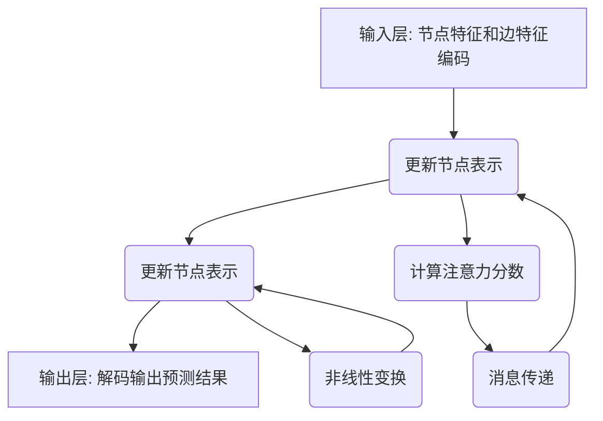

# 动态关系推理中图Transformer的优化技术研究

> 关键词：动态关系推理、图Transformer、优化技术、图神经网络、深度学习

> 摘要：本文聚焦于动态关系推理中图Transformer的优化技术。首先介绍了相关背景知识，包括研究目的、预期读者等内容。详细阐述了图Transformer的核心概念、架构及原理，通过Python代码展示核心算法原理和具体操作步骤。深入探讨了其数学模型和公式，并结合实例进行说明。通过项目实战，给出代码实际案例并进行详细解读。分析了图Transformer在不同领域的实际应用场景，推荐了学习资源、开发工具框架以及相关论文著作。最后总结了图Transformer未来的发展趋势与挑战，并提供常见问题解答和扩展阅读参考资料，旨在为相关领域的研究者和开发者提供全面且深入的技术指导。

## 1. 背景介绍 
### 1.1 目的和范围
在当今复杂的信息环境中，动态关系推理具有重要意义。许多实际问题，如社交网络分析、交通流量预测、生物分子相互作用研究等，都涉及到动态变化的关系推理。图Transformer作为一种强大的深度学习模型，在处理图结构数据方面展现出了巨大的潜力，但在动态关系推理场景下，仍存在一些性能和效率方面的问题。本研究的目的是深入探讨图Transformer在动态关系推理中的优化技术，以提高其在处理动态图数据时的准确性、效率和鲁棒性。研究范围涵盖了图Transformer的核心原理、算法优化、实际应用等多个方面，旨在为相关领域的研究和实践提供理论支持和技术指导。

### 1.2 预期读者
本文的预期读者包括计算机科学、人工智能、机器学习等领域的研究人员，他们可以从本文中获取关于图Transformer优化技术的最新研究成果和理论分析，为进一步的学术研究提供参考。同时，软件开发工程师、数据科学家等专业人士也可以从本文中学习到图Transformer在实际项目中的应用和优化方法，将其应用到实际的工程项目中。此外，对图神经网络和深度学习感兴趣的学生和爱好者也可以通过阅读本文，了解图Transformer的基本原理和优化技术，拓宽自己的知识面。

### 1.3 文档结构概述
本文将按照以下结构进行组织：
- 核心概念与联系：介绍图Transformer的基本概念、架构和工作原理，通过文本示意图和Mermaid流程图进行直观展示。
- 核心算法原理 & 具体操作步骤：详细讲解图Transformer的核心算法，使用Python源代码进行详细阐述，并给出具体的操作步骤。
- 数学模型和公式 & 详细讲解 & 举例说明：深入分析图Transformer的数学模型和公式，通过具体的例子进行详细讲解。
- 项目实战：通过实际的代码案例，展示图Transformer在动态关系推理中的应用，并对代码进行详细解读。
- 实际应用场景：探讨图Transformer在不同领域的实际应用场景，分析其优势和挑战。
- 工具和资源推荐：推荐学习图Transformer的相关资源，包括书籍、在线课程、技术博客和网站等，同时介绍开发图Transformer模型的相关工具和框架。
- 总结：总结图Transformer在动态关系推理中的优化技术，展望其未来的发展趋势和面临的挑战。
- 附录：提供常见问题的解答，帮助读者更好地理解和应用图Transformer。
- 扩展阅读 & 参考资料：提供相关的扩展阅读材料和参考资料，方便读者进一步深入研究。

### 1.4 术语表
#### 1.4.1 核心术语定义
- **动态关系推理**：指在不断变化的环境中，对实体之间的关系进行推理和预测的过程。例如，在社交网络中，随着用户的行为和社交关系的不断变化，需要实时推理用户之间的关系和互动模式。
- **图Transformer**：是一种基于Transformer架构的图神经网络模型，用于处理图结构数据。它结合了Transformer的注意力机制和图神经网络的消息传递机制，能够有效地捕捉图中节点和边的信息。
- **图神经网络（GNN）**：是一类专门用于处理图结构数据的神经网络模型，通过消息传递机制在图的节点之间传递信息，从而学习节点和图的表示。
- **注意力机制**：是一种在深度学习中广泛应用的机制，用于自动地关注输入数据中的重要部分。在图Transformer中，注意力机制用于计算节点之间的相关性，从而实现信息的选择性传递。

#### 1.4.2 相关概念解释
- **图结构数据**：由节点和边组成的数据结构，用于表示实体之间的关系。例如，社交网络可以用图来表示，其中用户是节点，用户之间的好友关系是边。
- **消息传递机制**：是图神经网络中用于在节点之间传递信息的一种机制。通过消息传递，节点可以聚合其邻居节点的信息，从而更新自己的表示。
- **多头注意力**：是Transformer中的一种注意力机制扩展，通过多个独立的注意力头并行地计算注意力，能够捕捉不同方面的信息。

#### 1.4.3 缩略词列表
- **GNN**：Graph Neural Network（图神经网络）
- **DNN**：Deep Neural Network（深度神经网络）
- **MLP**：Multi - Layer Perceptron（多层感知机）
- **ReLU**：Rectified Linear Unit（修正线性单元）

## 2. 核心概念与联系 

### 2.1 图Transformer的基本概念
图Transformer是一种结合了图神经网络和Transformer架构的模型，用于处理图结构数据。在传统的图神经网络中，消息传递机制是核心，它通过在节点之间传递信息来更新节点的表示。而Transformer架构以其强大的注意力机制而闻名，能够自动地关注输入序列中的重要部分。图Transformer将这两种机制相结合，通过注意力机制来计算图中节点之间的相关性，从而实现信息的选择性传递。

### 2.2 图Transformer的架构
图Transformer的架构主要由输入层、多头注意力层、前馈神经网络层和输出层组成。

- **输入层**：将图的节点特征和边特征进行编码，转换为适合模型处理的向量表示。
- **多头注意力层**：通过多个独立的注意力头并行地计算节点之间的注意力，捕捉不同方面的信息。每个注意力头计算一个注意力分数，用于衡量节点之间的相关性。然后，根据注意力分数对节点的邻居信息进行加权求和，更新节点的表示。
- **前馈神经网络层**：对多头注意力层的输出进行非线性变换，进一步提取特征。通常由多层感知机（MLP）组成。
- **输出层**：根据具体的任务，对节点或图的表示进行解码，输出最终的预测结果。

### 2.3 图Transformer的工作原理
图Transformer的工作原理基于注意力机制和消息传递机制。具体步骤如下：

1. **特征编码**：将图的节点特征和边特征进行编码，得到节点和边的向量表示。
2. **注意力计算**：在多头注意力层中，计算每个节点对其邻居节点的注意力分数。注意力分数表示节点之间的相关性，通过以下公式计算：
   $$\text{Attention}(Q, K, V) = \text{softmax}(\frac{QK^T}{\sqrt{d_k}})V$$
   其中，$Q$ 是查询矩阵，$K$ 是键矩阵，$V$ 是值矩阵，$d_k$ 是键向量的维度。
3. **消息传递**：根据注意力分数，对节点的邻居信息进行加权求和，更新节点的表示。
4. **前馈神经网络处理**：将更新后的节点表示输入到前馈神经网络层中，进行非线性变换。
5. **重复步骤2 - 4**：多次重复注意力计算、消息传递和前馈神经网络处理，以增强模型的表达能力。
6. **输出预测**：根据具体的任务，对节点或图的表示进行解码，输出最终的预测结果。

### 2.4 文本示意图
图Transformer的架构可以用以下文本示意图表示：

```plaintext
输入层：节点特征和边特征编码
|
V
多头注意力层：计算节点之间的注意力，消息传递
|
V
前馈神经网络层：非线性变换
|
V
输出层：解码输出预测结果
```

### 2.5 Mermaid流程图


## 3. 核心算法原理 & 具体操作步骤 

### 3.1 核心算法原理
图Transformer的核心算法主要包括多头注意力机制和前馈神经网络。

#### 3.1.1 多头注意力机制
多头注意力机制通过多个独立的注意力头并行地计算注意力，能够捕捉不同方面的信息。具体步骤如下：

1. **线性变换**：将输入的节点表示 $X$ 分别通过三个线性变换矩阵 $W^Q$、$W^K$ 和 $W^V$ 得到查询矩阵 $Q$、键矩阵 $K$ 和值矩阵 $V$：
   $$Q = XW^Q$$
   $$K = XW^K$$
   $$V = XW^V$$
2. **注意力计算**：对于每个注意力头 $i$，计算注意力分数：
   $$\text{Attention}_i(Q_i, K_i, V_i) = \text{softmax}(\frac{Q_iK_i^T}{\sqrt{d_k}})V_i$$
   其中，$d_k$ 是键向量的维度。
3. **拼接和线性变换**：将所有注意力头的输出拼接起来，然后通过一个线性变换矩阵 $W^O$ 得到最终的输出：
   $$\text{MultiHead}(Q, K, V) = \text{Concat}(\text{Attention}_1, \text{Attention}_2, \cdots, \text{Attention}_h)W^O$$
   其中，$h$ 是注意力头的数量。

#### 3.1.2 前馈神经网络
前馈神经网络通常由两层全连接层和一个非线性激活函数组成。具体步骤如下：

1. **第一层全连接层**：将多头注意力层的输出 $X$ 通过一个全连接层进行线性变换：
   $$Y_1 = \text{Linear}_1(X)$$
2. **非线性激活函数**：对第一层全连接层的输出应用非线性激活函数，如ReLU：
   $$Y_2 = \text{ReLU}(Y_1)$$
3. **第二层全连接层**：将非线性激活函数的输出通过另一个全连接层进行线性变换：
   $$Y_3 = \text{Linear}_2(Y_2)$$

### 3.2 Python源代码实现
以下是一个简单的图Transformer层的Python实现：

```python
import torch
import torch.nn as nn
import torch.nn.functional as F

class MultiHeadAttention(nn.Module):
    def __init__(self, input_dim, num_heads):
        super(MultiHeadAttention, self).__init__()
        self.input_dim = input_dim
        self.num_heads = num_heads
        self.head_dim = input_dim // num_heads

        self.W_q = nn.Linear(input_dim, input_dim)
        self.W_k = nn.Linear(input_dim, input_dim)
        self.W_v = nn.Linear(input_dim, input_dim)
        self.W_o = nn.Linear(input_dim, input_dim)

    def forward(self, x):
        batch_size, seq_len, _ = x.size()

        # 线性变换得到Q, K, V
        Q = self.W_q(x).view(batch_size, seq_len, self.num_heads, self.head_dim).transpose(1, 2)
        K = self.W_k(x).view(batch_size, seq_len, self.num_heads, self.head_dim).transpose(1, 2)
        V = self.W_v(x).view(batch_size, seq_len, self.num_heads, self.head_dim).transpose(1, 2)

        # 计算注意力分数
        attn_scores = torch.matmul(Q, K.transpose(-2, -1)) / torch.sqrt(torch.tensor(self.head_dim, dtype=torch.float32))
        attn_probs = F.softmax(attn_scores, dim=-1)

        # 加权求和得到输出
        output = torch.matmul(attn_probs, V)
        output = output.transpose(1, 2).contiguous().view(batch_size, seq_len, self.input_dim)

        # 线性变换得到最终输出
        output = self.W_o(output)
        return output

class FeedForward(nn.Module):
    def __init__(self, input_dim, hidden_dim):
        super(FeedForward, self).__init__()
        self.linear1 = nn.Linear(input_dim, hidden_dim)
        self.linear2 = nn.Linear(hidden_dim, input_dim)
        self.relu = nn.ReLU()

    def forward(self, x):
        x = self.linear1(x)
        x = self.relu(x)
        x = self.linear2(x)
        return x

class GraphTransformerLayer(nn.Module):
    def __init__(self, input_dim, num_heads, hidden_dim):
        super(GraphTransformerLayer, self).__init__()
        self.multihead_attn = MultiHeadAttention(input_dim, num_heads)
        self.feed_forward = FeedForward(input_dim, hidden_dim)
        self.norm1 = nn.LayerNorm(input_dim)
        self.norm2 = nn.LayerNorm(input_dim)

    def forward(self, x):
        # 多头注意力
        attn_output = self.multihead_attn(x)
        x = self.norm1(x + attn_output)

        # 前馈神经网络
        ff_output = self.feed_forward(x)
        x = self.norm2(x + ff_output)

        return x
```

### 3.3 具体操作步骤
以下是使用上述图Transformer层进行动态关系推理的具体操作步骤：

1. **数据准备**：准备图结构数据，包括节点特征和边信息。将数据转换为适合模型输入的格式，如PyTorch的张量。
2. **模型初始化**：初始化图Transformer模型，设置输入维度、注意力头数量和隐藏维度等参数。
3. **前向传播**：将输入数据输入到图Transformer模型中，进行前向传播，得到节点或图的表示。
4. **任务特定处理**：根据具体的任务，对节点或图的表示进行解码，输出最终的预测结果。例如，在节点分类任务中，可以使用一个全连接层将节点表示映射到类别标签上。
5. **训练模型**：定义损失函数和优化器，使用训练数据对模型进行训练。在训练过程中，不断调整模型的参数，以最小化损失函数。
6. **模型评估**：使用测试数据对训练好的模型进行评估，计算评估指标，如准确率、召回率等，评估模型的性能。

## 4. 数学模型和公式 & 详细讲解 & 举例说明 

### 4.1 多头注意力机制的数学模型和公式
#### 4.1.1 线性变换
如前文所述，将输入的节点表示 $X \in \mathbb{R}^{n \times d}$（其中 $n$ 是节点数量，$d$ 是节点特征维度）分别通过三个线性变换矩阵 $W^Q \in \mathbb{R}^{d \times d}$、$W^K \in \mathbb{R}^{d \times d}$ 和 $W^V \in \mathbb{R}^{d \times d}$ 得到查询矩阵 $Q$、键矩阵 $K$ 和值矩阵 $V$：
$$Q = XW^Q$$
$$K = XW^K$$
$$V = XW^V$$

#### 4.1.2 注意力计算
对于每个注意力头 $i$，将 $Q$、$K$ 和 $V$ 划分为 $h$ 个部分，每个部分的维度为 $d_k = \frac{d}{h}$。计算注意力分数：
$$\text{Attention}_i(Q_i, K_i, V_i) = \text{softmax}(\frac{Q_iK_i^T}{\sqrt{d_k}})V_i$$
其中，$Q_i \in \mathbb{R}^{n \times d_k}$，$K_i \in \mathbb{R}^{n \times d_k}$，$V_i \in \mathbb{R}^{n \times d_k}$。

#### 4.1.3 拼接和线性变换
将所有注意力头的输出拼接起来，得到 $\text{Concat}(\text{Attention}_1, \text{Attention}_2, \cdots, \text{Attention}_h) \in \mathbb{R}^{n \times d}$，然后通过一个线性变换矩阵 $W^O \in \mathbb{R}^{d \times d}$ 得到最终的输出：
$$\text{MultiHead}(Q, K, V) = \text{Concat}(\text{Attention}_1, \text{Attention}_2, \cdots, \text{Attention}_h)W^O$$

### 4.2 详细讲解
- **线性变换的作用**：线性变换的作用是将输入的节点表示投影到不同的子空间中，以便后续计算注意力。通过不同的线性变换矩阵 $W^Q$、$W^K$ 和 $W^V$，可以学习到不同的查询、键和值的表示。
- **注意力分数的计算**：注意力分数 $\frac{QK^T}{\sqrt{d_k}}$ 衡量了节点之间的相关性。除以 $\sqrt{d_k}$ 是为了防止点积结果过大，导致softmax函数的梯度消失。softmax函数将注意力分数转换为概率分布，使得每个节点对其邻居节点的注意力权重之和为1。
- **多头注意力的优势**：多头注意力通过多个独立的注意力头并行地计算注意力，能够捕捉不同方面的信息。不同的注意力头可以关注不同的特征子空间，从而提高模型的表达能力。

### 4.3 举例说明
假设我们有一个包含3个节点的图，每个节点的特征维度为4，即 $X \in \mathbb{R}^{3 \times 4}$。我们设置注意力头数量 $h = 2$，则 $d_k = \frac{4}{2} = 2$。

- **线性变换**：
  假设 $W^Q = \begin{bmatrix} 1 & 0 & 0 & 0 \\ 0 & 1 & 0 & 0 \\ 0 & 0 & 1 & 0 \\ 0 & 0 & 0 & 1 \end{bmatrix}$，$W^K = \begin{bmatrix} 1 & 0 & 0 & 0 \\ 0 & 1 & 0 & 0 \\ 0 & 0 & 1 & 0 \\ 0 & 0 & 0 & 1 \end{bmatrix}$，$W^V = \begin{bmatrix} 1 & 0 & 0 & 0 \\ 0 & 1 & 0 & 0 \\ 0 & 0 & 1 & 0 \\ 0 & 0 & 0 & 1 \end{bmatrix}$。
  则 $Q = XW^Q = X$，$K = XW^K = X$，$V = XW^V = X$。
- **注意力计算**：
  将 $Q$、$K$ 和 $V$ 划分为两个部分：$Q_1, Q_2, K_1, K_2, V_1, V_2 \in \mathbb{R}^{3 \times 2}$。
  计算注意力分数：$\text{Attention}_1(Q_1, K_1, V_1) = \text{softmax}(\frac{Q_1K_1^T}{\sqrt{2}})V_1$，$\text{Attention}_2(Q_2, K_2, V_2) = \text{softmax}(\frac{Q_2K_2^T}{\sqrt{2}})V_2$。
- **拼接和线性变换**：
  将 $\text{Attention}_1$ 和 $\text{Attention}_2$ 拼接起来，得到 $\text{Concat}(\text{Attention}_1, \text{Attention}_2) \in \mathbb{R}^{3 \times 4}$。
  假设 $W^O = \begin{bmatrix} 1 & 0 & 0 & 0 \\ 0 & 1 & 0 & 0 \\ 0 & 0 & 1 & 0 \\ 0 & 0 & 0 & 1 \end{bmatrix}$，则 $\text{MultiHead}(Q, K, V) = \text{Concat}(\text{Attention}_1, \text{Attention}_2)W^O$。

### 4.4 前馈神经网络的数学模型和公式
前馈神经网络的数学模型和公式如下：

#### 4.4.1 第一层全连接层
将多头注意力层的输出 $X \in \mathbb{R}^{n \times d}$ 通过一个全连接层进行线性变换：
$$Y_1 = \text{Linear}_1(X) = XW_1 + b_1$$
其中，$W_1 \in \mathbb{R}^{d \times h}$ 是权重矩阵，$b_1 \in \mathbb{R}^{h}$ 是偏置向量，$h$ 是隐藏层维度。

#### 4.4.2 非线性激活函数
对第一层全连接层的输出应用非线性激活函数，如ReLU：
$$Y_2 = \text{ReLU}(Y_1) = \max(0, Y_1)$$

#### 4.4.3 第二层全连接层
将非线性激活函数的输出通过另一个全连接层进行线性变换：
$$Y_3 = \text{Linear}_2(Y_2) = Y_2W_2 + b_2$$
其中，$W_2 \in \mathbb{R}^{h \times d}$ 是权重矩阵，$b_2 \in \mathbb{R}^{d}$ 是偏置向量。

### 4.5 详细讲解
- **全连接层的作用**：全连接层用于对输入进行线性变换，学习输入和输出之间的线性关系。通过多个全连接层的组合，可以学习到更复杂的非线性关系。
- **非线性激活函数的作用**：非线性激活函数的作用是引入非线性因素，使得模型能够学习到更复杂的函数。ReLU是一种常用的非线性激活函数，它具有计算简单、收敛速度快等优点。

### 4.6 举例说明
假设多头注意力层的输出 $X \in \mathbb{R}^{3 \times 4}$，隐藏层维度 $h = 6$。

- **第一层全连接层**：
  假设 $W_1 = \begin{bmatrix} 1 & 0 & 0 & 0 \\ 0 & 1 & 0 & 0 \\ 0 & 0 & 1 & 0 \\ 0 & 0 & 0 & 1 \\ 1 & 0 & 0 & 0 \\ 0 & 1 & 0 & 0 \end{bmatrix}$，$b_1 = \begin{bmatrix} 0 \\ 0 \\ 0 \\ 0 \\ 0 \\ 0 \end{bmatrix}$。
  则 $Y_1 = XW_1 + b_1$。
- **非线性激活函数**：
  $Y_2 = \text{ReLU}(Y_1)$。
- **第二层全连接层**：
  假设 $W_2 = \begin{bmatrix} 1 & 0 & 0 & 0 & 1 & 0 \\ 0 & 1 & 0 & 0 & 0 & 1 \\ 0 & 0 & 1 & 0 & 0 & 0 \\ 0 & 0 & 0 & 1 & 0 & 0 \end{bmatrix}$，$b_2 = \begin{bmatrix} 0 \\ 0 \\ 0 \\ 0 \end{bmatrix}$。
  则 $Y_3 = Y_2W_2 + b_2$。

## 5. 项目实战：代码实际案例和详细解释说明 

### 5.1  开发环境搭建
#### 5.1.1 安装Python
首先，确保你已经安装了Python 3.6或更高版本。你可以从Python官方网站（https://www.python.org/downloads/）下载并安装Python。

#### 5.1.2 安装深度学习框架
本项目使用PyTorch作为深度学习框架。可以使用以下命令安装PyTorch：
```bash
pip install torch torchvision
```

#### 5.1.3 安装图神经网络库
我们还需要安装一个图神经网络库，如PyTorch Geometric。可以使用以下命令安装：
```bash
pip install torch-geometric
```

### 5.2  源代码详细实现和代码解读
以下是一个使用图Transformer进行节点分类任务的完整代码示例：

```python
import torch
import torch.nn.functional as F
from torch_geometric.data import DataLoader
from torch_geometric.datasets import Planetoid
import torch_geometric.nn as gnn

# 定义图Transformer层
class GraphTransformerLayer(torch.nn.Module):
    def __init__(self, in_channels, out_channels, heads=4):
        super(GraphTransformerLayer, self).__init__()
        self.conv = gnn.GATConv(in_channels, out_channels // heads, heads=heads)

    def forward(self, x, edge_index):
        x = self.conv(x, edge_index)
        x = F.relu(x)
        return x

# 定义图Transformer模型
class GraphTransformer(torch.nn.Module):
    def __init__(self, in_channels, hidden_channels, out_channels, num_layers=2):
        super(GraphTransformer, self).__init__()
        self.layers = torch.nn.ModuleList()
        self.layers.append(GraphTransformerLayer(in_channels, hidden_channels))
        for _ in range(num_layers - 2):
            self.layers.append(GraphTransformerLayer(hidden_channels, hidden_channels))
        self.layers.append(GraphTransformerLayer(hidden_channels, out_channels))

    def forward(self, x, edge_index):
        for layer in self.layers:
            x = layer(x, edge_index)
        return F.log_softmax(x, dim=1)

# 加载数据集
dataset = Planetoid(root='data/Planetoid', name='Cora')
data = dataset[0]

# 初始化模型、优化器和损失函数
model = GraphTransformer(dataset.num_node_features, 128, dataset.num_classes)
optimizer = torch.optim.Adam(model.parameters(), lr=0.01, weight_decay=5e-4)
criterion = torch.nn.NLLLoss()

# 训练模型
def train():
    model.train()
    optimizer.zero_grad()
    out = model(data.x, data.edge_index)
    loss = criterion(out[data.train_mask], data.y[data.train_mask])
    loss.backward()
    optimizer.step()
    return loss.item()

# 测试模型
def test():
    model.eval()
    out = model(data.x, data.edge_index)
    pred = out.argmax(dim=1)
    test_correct = pred[data.test_mask] == data.y[data.test_mask]
    test_acc = int(test_correct.sum()) / int(data.test_mask.sum())
    return test_acc

# 训练和测试循环
for epoch in range(200):
    loss = train()
    if (epoch + 1) % 10 == 0:
        test_acc = test()
        print(f'Epoch: {epoch + 1}, Loss: {loss:.4f}, Test Acc: {test_acc:.4f}')
```

### 5.3  代码解读与分析
#### 5.3.1 图Transformer层的定义
`GraphTransformerLayer` 类继承自 `torch.nn.Module`，使用 `gnn.GATConv` 作为核心组件。`GATConv` 是一种基于注意力机制的图卷积层，类似于图Transformer中的多头注意力机制。在 `forward` 方法中，将输入的节点特征 `x` 和边索引 `edge_index` 输入到 `GATConv` 中，进行卷积操作，然后应用ReLU激活函数。

#### 5.3.2 图Transformer模型的定义
`GraphTransformer` 类继承自 `torch.nn.Module`，使用 `torch.nn.ModuleList` 来存储多个图Transformer层。在 `forward` 方法中，将输入的节点特征和边索引依次通过每个图Transformer层，最后应用 `F.log_softmax` 函数得到分类概率。

#### 5.3.3 数据集加载
使用 `Planetoid` 数据集，该数据集包含了一些经典的图节点分类任务，如Cora数据集。

#### 5.3.4 模型训练和测试
定义了 `train` 和 `test` 函数分别用于训练和测试模型。在训练过程中，使用 `Adam` 优化器和 `NLLLoss` 损失函数进行训练。在测试过程中，计算模型在测试集上的准确率。

#### 5.3.5 训练和测试循环
通过一个循环进行200个epoch的训练，并每隔10个epoch进行一次测试，打印出当前的损失和测试准确率。

## 6. 实际应用场景 
### 6.1 社交网络分析
在社交网络中，用户之间的关系是动态变化的。图Transformer可以用于分析社交网络中的用户行为、关系推理和社区发现等任务。例如，通过分析用户的社交关系和行为记录，预测用户之间的潜在关系，为社交推荐系统提供支持。

### 6.2 交通流量预测
交通网络可以用图来表示，其中节点表示交通路口，边表示道路。图Transformer可以用于预测交通流量的动态变化，通过考虑交通网络的拓扑结构和历史流量数据，提高交通流量预测的准确性。例如，预测不同时间段内各个路口的车流量，为交通管理部门提供决策支持。

### 6.3 生物分子相互作用研究
生物分子之间的相互作用可以用图来表示，其中节点表示生物分子，边表示分子之间的相互作用。图Transformer可以用于研究生物分子的结构和功能，预测生物分子之间的相互作用模式。例如，预测蛋白质之间的相互作用，为药物研发提供理论支持。

### 6.4 金融风险评估
在金融领域，不同金融实体之间存在着复杂的关系。图Transformer可以用于构建金融风险评估模型，通过分析金融实体之间的关系和交易数据，预测金融风险的发生概率。例如，评估银行之间的信用风险，为金融监管部门提供决策支持。

### 6.5 推荐系统
推荐系统可以将用户和物品之间的交互关系表示为图。图Transformer可以用于捕捉用户和物品之间的复杂关系，提高推荐系统的准确性和个性化程度。例如，根据用户的历史行为和偏好，为用户推荐感兴趣的物品。

## 7. 工具和资源推荐
### 7.1 学习资源推荐
#### 7.1.1 书籍推荐
- 《深度学习》（Deep Learning）：由Ian Goodfellow、Yoshua Bengio和Aaron Courville所著，是深度学习领域的经典教材，涵盖了深度学习的基本原理、算法和应用。
- 《图神经网络：基础、前沿与应用》：全面介绍了图神经网络的基本概念、算法和应用，对于理解图Transformer有很大的帮助。
- 《Transformer自然语言处理》：详细介绍了Transformer架构的原理和应用，对于理解图Transformer中的注意力机制有重要的参考价值。

#### 7.1.2 在线课程
- Coursera上的“深度学习专项课程”：由Andrew Ng教授授课，涵盖了深度学习的各个方面，包括神经网络、卷积神经网络、循环神经网络等。
- edX上的“图神经网络”课程：系统介绍了图神经网络的基本概念、算法和应用，适合初学者学习。
- B站等平台上有很多关于图神经网络和Transformer的教程视频，可以帮助学习者快速入门。

#### 7.1.3 技术博客和网站
- Medium上有很多关于深度学习和图神经网络的技术博客，如Towards Data Science，其中有很多关于图Transformer的最新研究成果和实践经验分享。
- arXiv.org是一个预印本平台，上面有很多关于图Transformer的最新研究论文，可以及时了解该领域的最新动态。
- GitHub上有很多开源的图Transformer项目，可以参考和学习这些项目的代码实现。

### 7.2 开发工具框架推荐
#### 7.2.1 IDE和编辑器
- PyCharm：是一款专门为Python开发设计的集成开发环境，具有强大的代码编辑、调试和项目管理功能，适合开发图Transformer模型。
- Jupyter Notebook：是一个交互式的开发环境，可以方便地进行代码编写、数据可视化和模型训练，适合进行实验和研究。
- Visual Studio Code：是一款轻量级的代码编辑器，支持多种编程语言和插件，具有丰富的扩展功能，适合快速开发和调试。

#### 7.2.2 调试和性能分析工具
- PyTorch自带的调试工具：如`torch.utils.bottleneck`可以帮助分析代码中的性能瓶颈，`torch.utils.checkpoint`可以用于内存优化。
- TensorBoard：是一个可视化工具，可以用于可视化模型的训练过程、损失曲线、准确率等指标，帮助开发者更好地理解模型的性能。
- NVIDIA Nsight Systems：是一款性能分析工具，可以用于分析GPU的使用情况和性能瓶颈，优化模型的训练速度。

#### 7.2.3 相关框架和库
- PyTorch：是一个开源的深度学习框架，具有动态图机制和丰富的神经网络层，适合开发图Transformer模型。
- PyTorch Geometric：是一个基于PyTorch的图神经网络库，提供了丰富的图神经网络层和数据集，方便开发者进行图神经网络的开发和实验。
- DGL（Deep Graph Library）：是另一个开源的图神经网络库，支持多种深度学习框架，具有高效的图计算和分布式训练能力。

### 7.3 相关论文著作推荐
#### 7.3.1 经典论文
- “Attention Is All You Need”：提出了Transformer架构，是图Transformer的基础，详细介绍了多头注意力机制和前馈神经网络的原理和实现。
- “Graph Attention Networks”：提出了图注意力网络（GAT），为图Transformer的发展奠定了基础，介绍了如何在图结构数据中应用注意力机制。
- “Graph Transformer Networks”：首次提出了图Transformer的概念，详细介绍了图Transformer的架构和算法。

#### 7.3.2 最新研究成果
可以通过arXiv.org、ACM Digital Library、IEEE Xplore等学术数据库搜索关于图Transformer的最新研究论文，了解该领域的最新发展动态。

#### 7.3.3 应用案例分析
一些顶级学术会议，如NeurIPS、ICML、KDD等，会收录很多关于图Transformer在不同领域的应用案例分析论文，可以从中学习到图Transformer的实际应用经验和方法。

## 8. 总结：未来发展趋势与挑战
### 8.1 未来发展趋势
#### 8.1.1 模型架构优化
未来，图Transformer的模型架构将不断优化，以提高其在动态关系推理中的性能和效率。例如，研究人员可能会提出更加高效的注意力机制，减少计算复杂度；或者设计更加灵活的图结构表示方法，更好地适应动态图数据的变化。

#### 8.1.2 多模态融合
随着多模态数据的广泛应用，图Transformer将与其他模态的深度学习模型进行融合，如视觉、文本、语音等。通过融合多模态信息，可以提高动态关系推理的准确性和全面性。例如，在社交网络分析中，可以同时考虑用户的文本信息、图像信息和社交关系信息，进行更加精准的用户行为预测。

#### 8.1.3 可解释性研究
图Transformer作为一种深度学习模型，其决策过程往往是黑盒的，缺乏可解释性。未来，研究人员将更加关注图Transformer的可解释性研究，开发出能够解释模型决策过程的方法和工具。这将有助于提高模型的可信度和实用性，特别是在一些对解释性要求较高的领域，如医疗、金融等。

#### 8.1.4 应用领域拓展
图Transformer将在更多的领域得到应用，如智能交通、智能制造、环境监测等。随着这些领域数据的不断丰富和复杂，图Transformer的优势将得到更加充分的发挥，为解决实际问题提供更加有效的方法和技术支持。

### 8.2 挑战
#### 8.2.1 计算资源需求
图Transformer的计算复杂度较高，特别是在处理大规模图数据时，需要大量的计算资源和时间。如何在有限的计算资源下提高图Transformer的训练和推理效率，是一个亟待解决的问题。

#### 8.2.2 动态图数据处理
动态图数据的变化频繁，需要模型能够实时地适应这些变化。如何设计出能够高效处理动态图数据的图Transformer模型，是当前面临的一个挑战。例如，如何在图结构和节点特征发生变化时，快速更新模型的参数和表示。

#### 8.2.3 数据质量和标注
图Transformer的性能很大程度上依赖于数据的质量和标注。在实际应用中，获取高质量的图数据和准确的标注信息往往是困难的。如何处理噪声数据和缺失数据，以及如何进行有效的数据标注，是需要解决的问题。

#### 8.2.4 模型可扩展性
随着图数据规模的不断增大，图Transformer模型的可扩展性成为一个重要的问题。如何设计出能够处理大规模图数据的分布式图Transformer模型，是未来研究的一个方向。

## 9. 附录：常见问题与解答
### 9.1 图Transformer与传统图神经网络有什么区别？
传统图神经网络主要通过消息传递机制在节点之间传递信息，更新节点的表示。而图Transformer引入了Transformer的注意力机制，能够自动地关注图中节点之间的重要关系，实现信息的选择性传递。因此，图Transformer在捕捉图中节点之间的长距离依赖关系方面具有优势，能够更好地处理复杂的图结构数据。

### 9.2 图Transformer的计算复杂度如何？
图Transformer的计算复杂度主要取决于节点数量、特征维度和注意力头数量等因素。在多头注意力机制中，计算注意力分数的复杂度为 $O(n^2d)$，其中 $n$ 是节点数量，$d$ 是特征维度。因此，当节点数量较大时，图Transformer的计算复杂度会显著增加。为了降低计算复杂度，研究人员提出了一些优化方法，如稀疏注意力机制、近似注意力机制等。

### 9.3 如何选择图Transformer的超参数？
选择图Transformer的超参数需要考虑多个因素，如数据集的规模、复杂度和任务的类型等。一般来说，可以通过网格搜索、随机搜索等方法进行超参数调优。一些常用的超参数包括注意力头数量、隐藏层维度、学习率、正则化系数等。在调优过程中，可以使用交叉验证等方法评估不同超参数组合的性能，选择最优的超参数组合。

### 9.4 图Transformer在处理动态图数据时存在哪些问题？
图Transformer在处理动态图数据时存在一些问题，如计算效率低、模型更新不及时等。由于动态图数据的结构和节点特征会不断变化，需要模型能够实时地适应这些变化。然而，图Transformer的训练和推理过程通常比较复杂，难以实现实时更新。为了解决这些问题，研究人员提出了一些方法，如增量学习、在线学习等。

## 10. 扩展阅读 & 参考资料
### 10.1 扩展阅读
- “Deep Learning on Graphs: Methods and Applications”：详细介绍了图深度学习的各种方法和应用，对于深入理解图Transformer有很大的帮助。
- “Graph Neural Networks in Action”：通过实际案例介绍了图神经网络的应用，包括图Transformer在不同领域的应用案例。

### 10.2 参考资料
- Vaswani, A., Shazeer, N., Parmar, N., et al. “Attention Is All You Need”. Advances in Neural Information Processing Systems, 2017.
- Veličković, P., Cucurull, G., Casanova, A., et al. “Graph Attention Networks”. International Conference on Learning Representations, 2018.
- Dwivedi, V. P., Bresson, X. “Graph Transformer Networks”. arXiv preprint arXiv:2012.09699, 2020.