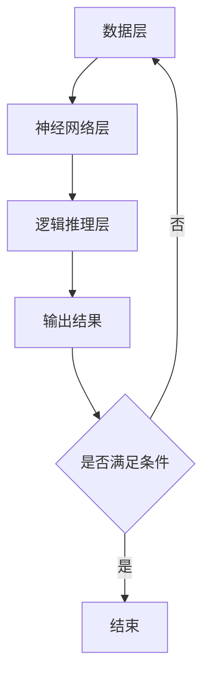

# 动态规则学习中自适应神经逻辑编程的应用

> 关键词：动态规则学习、自适应神经逻辑编程、逻辑推理、机器学习、知识表示

> 摘要：本文深入探讨了自适应神经逻辑编程在动态规则学习中的应用。首先介绍了相关的背景知识，包括研究目的、预期读者和文档结构等。接着阐述了核心概念，给出了原理和架构的示意图及流程图。详细讲解了核心算法原理，通过 Python 源代码进行说明，并介绍了相关的数学模型和公式。通过项目实战，展示了代码实现和详细解释。分析了实际应用场景，推荐了学习、开发工具和相关论文著作。最后总结了未来发展趋势与挑战，提供了常见问题解答和扩展阅读参考资料，旨在为读者全面呈现自适应神经逻辑编程在动态规则学习领域的应用全貌。

## 1. 背景介绍 
### 1.1 目的和范围
动态规则学习在众多领域中都具有重要意义，如智能决策系统、自动化流程控制、知识图谱构建等。传统的规则学习方法往往难以适应动态变化的环境和复杂的知识表示。自适应神经逻辑编程作为一种融合了神经网络和逻辑编程优势的方法，为动态规则学习提供了新的思路和解决方案。本文的目的在于深入研究自适应神经逻辑编程在动态规则学习中的应用原理、算法实现和实际应用，探讨其在不同场景下的有效性和局限性，为相关领域的研究和实践提供理论和技术支持。

### 1.2 预期读者
本文预期读者包括从事人工智能、机器学习、知识工程等领域的研究人员、工程师和学生。对于希望深入了解动态规则学习和自适应神经逻辑编程的专业人士，以及对相关技术应用感兴趣的初学者都具有参考价值。

### 1.3 文档结构概述
本文首先介绍背景知识，包括目的、读者和结构等。然后阐述核心概念和联系，给出原理和架构的示意图及流程图。接着详细讲解核心算法原理，通过 Python 代码实现。介绍相关的数学模型和公式，并举例说明。通过项目实战展示代码实现和详细解释。分析实际应用场景，推荐学习、开发工具和相关论文著作。最后总结未来发展趋势与挑战，提供常见问题解答和扩展阅读参考资料。

### 1.4 术语表
#### 1.4.1 核心术语定义
- **动态规则学习**：在不断变化的环境中，自动发现、调整和优化规则的过程，以适应新的数据和任务需求。
- **自适应神经逻辑编程**：结合神经网络的学习能力和逻辑编程的知识表示与推理能力，能够自适应地处理动态变化的规则和知识。
- **逻辑推理**：基于逻辑规则从已知事实推导出新事实的过程。
- **机器学习**：让计算机通过数据学习模式和规律，从而实现预测和决策的技术。
- **知识表示**：将人类知识以计算机可处理的形式进行表达的方法。

#### 1.4.2 相关概念解释
- **神经网络**：由大量神经元组成的计算模型，能够自动学习数据中的模式和特征。
- **逻辑编程**：基于逻辑规则进行编程的方法，强调知识的表示和推理。
- **规则**：描述事物之间关系和约束的语句，用于指导决策和行为。

#### 1.4.3 缩略词列表
- **ANN**：Artificial Neural Network（人工神经网络）
- **ILP**：Inductive Logic Programming（归纳逻辑编程）
- **ANLP**：Adaptive Neural Logic Programming（自适应神经逻辑编程）

## 2. 核心概念与联系 

### 2.1 自适应神经逻辑编程的原理
自适应神经逻辑编程旨在将神经网络的学习能力与逻辑编程的知识表示和推理能力相结合。神经网络可以从数据中学习到复杂的模式和特征，而逻辑编程则可以利用逻辑规则进行精确的推理和知识表示。在自适应神经逻辑编程中，神经网络用于学习规则的参数和权重，而逻辑编程则用于定义规则的结构和语义。

### 2.2 架构的文本示意图
自适应神经逻辑编程的架构主要包括三个部分：数据层、神经网络层和逻辑推理层。数据层负责收集和预处理原始数据，为神经网络提供输入。神经网络层通过学习数据中的模式和特征，生成规则的参数和权重。逻辑推理层利用逻辑规则和神经网络生成的参数进行推理，得出结论。

### 2.3 Mermaid 流程图


## 3. 核心算法原理 & 具体操作步骤 

### 3.1 算法原理
自适应神经逻辑编程的核心算法主要包括两个部分：神经网络的训练和逻辑推理。在神经网络的训练过程中，使用反向传播算法来调整网络的参数和权重，以最小化预测结果与真实结果之间的误差。在逻辑推理过程中，根据逻辑规则和神经网络生成的参数进行推理，得出结论。

### 3.2 Python 源代码实现
```python
import torch
import torch.nn as nn
import torch.optim as optim

# 定义神经网络模型
class NeuralNetwork(nn.Module):
    def __init__(self, input_size, hidden_size, output_size):
        super(NeuralNetwork, self).__init__()
        self.fc1 = nn.Linear(input_size, hidden_size)
        self.relu = nn.ReLU()
        self.fc2 = nn.Linear(hidden_size, output_size)

    def forward(self, x):
        out = self.fc1(x)
        out = self.relu(out)
        out = self.fc2(out)
        return out

# 训练神经网络
def train_network(model, train_data, train_labels, epochs, learning_rate):
    criterion = nn.MSELoss()
    optimizer = optim.Adam(model.parameters(), lr=learning_rate)

    for epoch in range(epochs):
        outputs = model(train_data)
        loss = criterion(outputs, train_labels)

        optimizer.zero_grad()
        loss.backward()
        optimizer.step()

        if (epoch + 1) % 100 == 0:
            print(f'Epoch [{epoch+1}/{epochs}], Loss: {loss.item():.4f}')

    return model

# 逻辑推理
def logical_reasoning(model, input_data, logic_rules):
    # 根据神经网络的输出和逻辑规则进行推理
    output = model(input_data)
    # 这里只是简单示例，实际应用中需要根据具体逻辑规则进行推理
    result = output > 0.5
    return result

# 示例数据
input_size = 10
hidden_size = 20
output_size = 1
train_data = torch.randn(100, input_size)
train_labels = torch.randn(100, output_size)

# 创建神经网络模型
model = NeuralNetwork(input_size, hidden_size, output_size)

# 训练神经网络
trained_model = train_network(model, train_data, train_labels, epochs=1000, learning_rate=0.001)

# 逻辑推理示例
test_data = torch.randn(1, input_size)
logic_rules = []  # 实际应用中需要定义具体的逻辑规则
result = logical_reasoning(trained_model, test_data, logic_rules)
print(f'Reasoning result: {result}')
```

### 3.3 具体操作步骤
1. **数据准备**：收集和预处理原始数据，将其转换为神经网络可以处理的格式。
2. **模型定义**：定义神经网络的结构和参数。
3. **模型训练**：使用训练数据对神经网络进行训练，调整网络的参数和权重。
4. **逻辑规则定义**：定义逻辑规则，用于逻辑推理。
5. **逻辑推理**：根据神经网络的输出和逻辑规则进行推理，得出结论。

## 4. 数学模型和公式 & 详细讲解 & 举例说明 

### 4.1 神经网络的数学模型
神经网络的数学模型可以表示为一个函数 $f(x; \theta)$，其中 $x$ 是输入数据，$\theta$ 是网络的参数和权重。在神经网络中，通常使用多层感知器（Multilayer Perceptron，MLP）来实现。MLP 由输入层、隐藏层和输出层组成，每层由多个神经元组成。神经元的输出可以表示为：

$$
z_j = \sum_{i=1}^{n} w_{ij} x_i + b_j
$$

其中 $z_j$ 是第 $j$ 个神经元的输入，$w_{ij}$ 是第 $i$ 个输入与第 $j$ 个神经元之间的权重，$x_i$ 是第 $i$ 个输入，$b_j$ 是第 $j$ 个神经元的偏置。神经元的输出可以通过激活函数进行非线性变换：

$$
y_j = \sigma(z_j)
$$

其中 $\sigma$ 是激活函数，常用的激活函数包括 sigmoid 函数、ReLU 函数等。

### 4.2 反向传播算法的数学原理
反向传播算法是神经网络训练的核心算法，用于调整网络的参数和权重。其基本思想是通过计算损失函数对参数的梯度，然后根据梯度下降法更新参数。损失函数通常使用均方误差（Mean Squared Error，MSE）：

$$
L(\theta) = \frac{1}{2} \sum_{k=1}^{m} (y_k - \hat{y}_k)^2
$$

其中 $y_k$ 是真实标签，$\hat{y}_k$ 是预测标签，$m$ 是样本数量。根据链式法则，损失函数对参数的梯度可以表示为：

$$
\frac{\partial L}{\partial w_{ij}} = \frac{\partial L}{\partial z_j} \frac{\partial z_j}{\partial w_{ij}}
$$

通过不断更新参数，使得损失函数逐渐减小，从而提高网络的性能。

### 4.3 举例说明
假设我们有一个简单的神经网络，输入层有 2 个神经元，隐藏层有 3 个神经元，输出层有 1 个神经元。输入数据为 $x = [x_1, x_2]$，隐藏层神经元的输入可以表示为：

$$
z_{j1} = w_{1j} x_1 + w_{2j} x_2 + b_j, j = 1, 2, 3
$$

隐藏层神经元的输出可以表示为：

$$
y_{j1} = \sigma(z_{j1}), j = 1, 2, 3
$$

输出层神经元的输入可以表示为：

$$
z_{12} = \sum_{j=1}^{3} w_{j1} y_{j1} + b_1
$$

输出层神经元的输出可以表示为：

$$
\hat{y} = \sigma(z_{12})
$$

假设真实标签为 $y$，损失函数可以表示为：

$$
L = \frac{1}{2} (y - \hat{y})^2
$$

根据反向传播算法，可以计算出损失函数对参数的梯度，然后更新参数，使得损失函数逐渐减小。

## 5. 项目实战：代码实际案例和详细解释说明 

### 5.1  开发环境搭建
1. **安装 Python**：建议使用 Python 3.7 及以上版本。
2. **安装 PyTorch**：根据自己的操作系统和 CUDA 版本选择合适的安装方式。可以使用以下命令安装：
```sh
pip install torch torchvision
```
3. **安装其他依赖库**：根据项目需求安装其他必要的库，如 numpy、matplotlib 等。

### 5.2  源代码详细实现和代码解读
```python
import torch
import torch.nn as nn
import torch.optim as optim
import numpy as np

# 定义神经网络模型
class NeuralNetwork(nn.Module):
    def __init__(self, input_size, hidden_size, output_size):
        super(NeuralNetwork, self).__init__()
        self.fc1 = nn.Linear(input_size, hidden_size)
        self.relu = nn.ReLU()
        self.fc2 = nn.Linear(hidden_size, output_size)

    def forward(self, x):
        out = self.fc1(x)
        out = self.relu(out)
        out = self.fc2(out)
        return out

# 训练神经网络
def train_network(model, train_data, train_labels, epochs, learning_rate):
    criterion = nn.MSELoss()
    optimizer = optim.Adam(model.parameters(), lr=learning_rate)

    for epoch in range(epochs):
        outputs = model(train_data)
        loss = criterion(outputs, train_labels)

        optimizer.zero_grad()
        loss.backward()
        optimizer.step()

        if (epoch + 1) % 100 == 0:
            print(f'Epoch [{epoch+1}/{epochs}], Loss: {loss.item():.4f}')

    return model

# 逻辑推理
def logical_reasoning(model, input_data, logic_rules):
    output = model(input_data)
    result = output > 0.5
    return result

# 生成示例数据
input_size = 10
hidden_size = 20
output_size = 1
num_samples = 100

train_data = torch.randn(num_samples, input_size)
train_labels = torch.randn(num_samples, output_size)

# 创建神经网络模型
model = NeuralNetwork(input_size, hidden_size, output_size)

# 训练神经网络
trained_model = train_network(model, train_data, train_labels, epochs=1000, learning_rate=0.001)

# 逻辑推理示例
test_data = torch.randn(1, input_size)
logic_rules = []  # 实际应用中需要定义具体的逻辑规则
result = logical_reasoning(trained_model, test_data, logic_rules)
print(f'Reasoning result: {result}')
```
### 代码解读：
1. **神经网络模型定义**：`NeuralNetwork` 类定义了一个简单的两层神经网络，包括一个输入层、一个隐藏层和一个输出层。`forward` 方法定义了前向传播的过程。
2. **训练函数**：`train_network` 函数使用 Adam 优化器和均方误差损失函数对神经网络进行训练。在每个 epoch 中，计算损失函数并进行反向传播，更新网络的参数。
3. **逻辑推理函数**：`logical_reasoning` 函数根据神经网络的输出和逻辑规则进行推理。在这个示例中，简单地将输出与 0.5 进行比较，大于 0.5 则认为结果为真。
4. **数据生成和训练**：生成示例数据，创建神经网络模型，调用训练函数进行训练。
5. **逻辑推理示例**：生成测试数据，调用逻辑推理函数进行推理，并输出结果。

### 5.3  代码解读与分析
- **优点**：代码结构清晰，易于理解和扩展。使用 PyTorch 框架，方便进行深度学习模型的开发和训练。通过逻辑推理函数，可以将神经网络的输出与逻辑规则相结合，实现自适应的规则学习。
- **缺点**：逻辑规则部分只是简单示例，实际应用中需要根据具体需求进行定义和实现。代码中没有考虑数据的预处理和模型的评估，在实际应用中需要进一步完善。

## 6. 实际应用场景 
### 6.1 智能决策系统
在智能决策系统中，需要根据不同的情况和条件做出决策。自适应神经逻辑编程可以结合历史数据和逻辑规则，学习动态的决策规则，提高决策的准确性和适应性。例如，在金融投资决策中，可以根据市场数据和投资规则，使用自适应神经逻辑编程学习最优的投资策略。

### 6.2 自动化流程控制
在自动化流程控制中，需要根据不同的任务和环境条件调整流程。自适应神经逻辑编程可以学习动态的流程规则，实现自动化流程的优化和调整。例如，在工业生产中，可以根据生产数据和工艺规则，使用自适应神经逻辑编程优化生产流程，提高生产效率。

### 6.3 知识图谱构建
在知识图谱构建中，需要从大量的数据中提取知识和关系。自适应神经逻辑编程可以结合机器学习和逻辑推理，学习动态的知识规则，提高知识图谱的准确性和完整性。例如，在语义网中，可以根据文本数据和语义规则，使用自适应神经逻辑编程构建知识图谱，实现知识的表示和推理。

## 7. 工具和资源推荐
### 7.1 学习资源推荐
#### 7.1.1 书籍推荐
- 《深度学习》（Deep Learning）：由 Ian Goodfellow、Yoshua Bengio 和 Aaron Courville 所著，是深度学习领域的经典教材，介绍了深度学习的基本原理和方法。
- 《人工智能：一种现代的方法》（Artificial Intelligence: A Modern Approach）：由 Stuart Russell 和 Peter Norvig 所著，是人工智能领域的经典教材，涵盖了人工智能的各个方面。
- 《逻辑编程导论》（Introduction to Logic Programming）：由 Leon Sterling 和 Ehud Shapiro 所著，介绍了逻辑编程的基本原理和方法。

#### 7.1.2 在线课程
- Coursera 上的“深度学习专项课程”（Deep Learning Specialization）：由 Andrew Ng 教授授课，介绍了深度学习的基本原理和应用。
- edX 上的“人工智能导论”（Introduction to Artificial Intelligence）：由麻省理工学院（MIT）的 Patrick Winston 教授授课，介绍了人工智能的基本概念和方法。
- Udemy 上的“逻辑编程实战”（Logic Programming in Practice）：介绍了逻辑编程的实际应用和案例。

#### 7.1.3 技术博客和网站
- Medium 上的 AI 相关博客：有很多人工智能领域的专家和爱好者分享的技术文章和经验。
- arXiv 网站：提供了大量的学术论文和研究成果，涵盖了人工智能、机器学习等领域。
- Towards Data Science 网站：专注于数据科学和机器学习领域的技术文章和案例分享。

### 7.2 开发工具框架推荐
#### 7.2.1 IDE和编辑器
- PyCharm：是一款专门为 Python 开发设计的集成开发环境（IDE），提供了丰富的功能和插件，方便进行 Python 代码的开发和调试。
- Jupyter Notebook：是一个交互式的开发环境，适合进行数据分析、模型训练和实验。
- Visual Studio Code：是一款轻量级的代码编辑器，支持多种编程语言和插件，适合进行快速开发和调试。

#### 7.2.2 调试和性能分析工具
- PyTorch Profiler：是 PyTorch 提供的性能分析工具，可以帮助用户分析模型的性能瓶颈和优化方向。
- TensorBoard：是 TensorFlow 提供的可视化工具，也可以与 PyTorch 结合使用，用于可视化模型的训练过程和性能指标。
- cProfile：是 Python 内置的性能分析工具，可以帮助用户分析代码的性能瓶颈和运行时间。

#### 7.2.3 相关框架和库
- PyTorch：是一个开源的深度学习框架，提供了丰富的神经网络模型和工具，方便进行深度学习模型的开发和训练。
- scikit-learn：是一个开源的机器学习库，提供了多种机器学习算法和工具，适合进行数据预处理、模型选择和评估。
- Prolog：是一种逻辑编程语言，提供了丰富的逻辑推理和知识表示功能，适合进行逻辑编程和规则学习。

### 7.3 相关论文著作推荐
#### 7.3.1 经典论文
- “Neural Logic Programming”（神经逻辑编程）：介绍了神经逻辑编程的基本原理和方法，是该领域的经典论文。
- “Inductive Logic Programming: Theory and Methods”（归纳逻辑编程：理论与方法）：介绍了归纳逻辑编程的基本原理和方法，是逻辑编程领域的经典论文。
- “Deep Learning”（深度学习）：由 Yann LeCun、Yoshua Bengio 和 Geoffrey Hinton 所著，是深度学习领域的经典综述论文。

#### 7.3.2 最新研究成果
- 关注 arXiv 网站上关于自适应神经逻辑编程和动态规则学习的最新研究论文，了解该领域的最新发展动态。
- 参加相关的学术会议和研讨会，如 NeurIPS（神经信息处理系统大会）、ICML（国际机器学习会议）等，获取最新的研究成果和技术报告。

#### 7.3.3 应用案例分析
- 关注各大科技公司和研究机构发布的关于自适应神经逻辑编程和动态规则学习的应用案例，了解其在实际应用中的效果和经验。
- 阅读相关的技术博客和文章，了解不同领域中自适应神经逻辑编程的应用场景和实践经验。

## 8. 总结：未来发展趋势与挑战
### 8.1 未来发展趋势
- **融合多模态数据**：未来的自适应神经逻辑编程将更加注重融合多模态数据，如图像、文本、语音等，以提高模型的学习能力和推理能力。
- **强化学习与逻辑推理的结合**：将强化学习与逻辑推理相结合，实现更加智能的决策和行为控制。
- **可解释性和可信赖性**：提高自适应神经逻辑编程模型的可解释性和可信赖性，使其在安全关键领域得到更广泛的应用。
- **跨领域应用**：自适应神经逻辑编程将在更多领域得到应用，如医疗、交通、教育等，为这些领域的发展提供技术支持。

### 8.2 挑战
- **数据和知识的获取**：获取高质量的数据和知识是自适应神经逻辑编程的关键挑战之一。需要解决数据的标注、清洗和整合等问题，以及知识的表示和获取问题。
- **模型的复杂度和计算资源**：随着模型的复杂度增加，计算资源的需求也会相应增加。需要解决模型的训练效率和推理速度问题，以满足实际应用的需求。
- **可解释性和可信赖性的实现**：实现自适应神经逻辑编程模型的可解释性和可信赖性是一个具有挑战性的问题。需要研究新的方法和技术，以提高模型的透明度和可靠性。
- **伦理和法律问题**：自适应神经逻辑编程的应用可能会带来一些伦理和法律问题，如隐私保护、算法歧视等。需要研究相应的伦理和法律规范，以确保技术的合理应用。

## 9. 附录：常见问题与解答
### 9.1 自适应神经逻辑编程与传统神经网络有什么区别？
自适应神经逻辑编程结合了神经网络的学习能力和逻辑编程的知识表示与推理能力，能够更好地处理复杂的知识和规则。传统神经网络主要侧重于从数据中学习模式和特征，缺乏明确的知识表示和推理能力。

### 9.2 如何定义逻辑规则？
逻辑规则的定义需要根据具体的应用场景和问题进行。可以使用逻辑编程语言（如 Prolog）来定义逻辑规则，也可以使用自然语言描述逻辑规则，然后将其转换为计算机可处理的形式。

### 9.3 自适应神经逻辑编程的训练时间长吗？
自适应神经逻辑编程的训练时间取决于模型的复杂度、数据的规模和计算资源等因素。一般来说，模型越复杂、数据规模越大，训练时间就越长。可以通过优化模型结构、使用并行计算等方法来缩短训练时间。

### 9.4 自适应神经逻辑编程在实际应用中效果如何？
自适应神经逻辑编程在一些领域已经取得了较好的应用效果，如智能决策系统、自动化流程控制等。但是，其效果还受到数据质量、模型设计和参数调整等因素的影响。在实际应用中，需要根据具体情况进行优化和调整。

## 10. 扩展阅读 & 参考资料
### 10.1 扩展阅读
- 阅读相关的学术论文和书籍，深入了解自适应神经逻辑编程和动态规则学习的理论和方法。
- 关注相关的技术博客和网站，了解该领域的最新发展动态和应用案例。
- 参加相关的学术会议和研讨会，与该领域的专家和学者进行交流和讨论。

### 10.2 参考资料
- Goodfellow, I., Bengio, Y., & Courville, A. (2016). Deep Learning. MIT Press.
- Russell, S. J., & Norvig, P. (2016). Artificial Intelligence: A Modern Approach. Pearson.
- Sterling, L., & Shapiro, E. (1994). The Art of Prolog: Advanced Programming Techniques. MIT Press.
- arXiv.org: https://arxiv.org/
- Coursera: https://www.coursera.org/
- edX: https://www.edx.org/
- Udemy: https://www.udemy.com/
- PyTorch: https://pytorch.org/
- scikit-learn: https://scikit-learn.org/
- Prolog: https://www.swi-prolog.org/