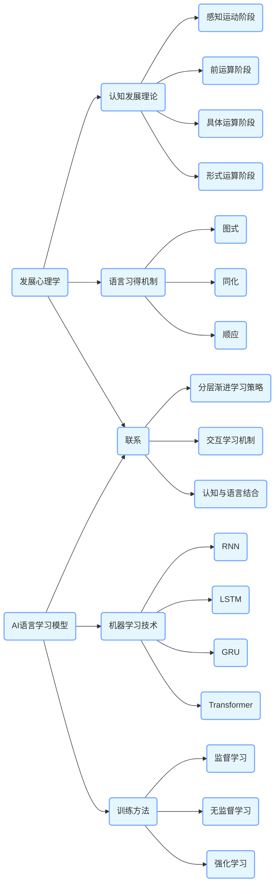

# 发展心理学启发的AI语言学习模型设计

> 关键词：发展心理学、AI语言学习模型、认知发展、语言习得、机器学习、神经网络、自然语言处理

> 摘要：本文旨在探讨如何借鉴发展心理学的理论和观点来设计AI语言学习模型。通过深入研究人类语言习得的过程和机制，我们可以为AI语言学习模型提供新的思路和方法。文章首先介绍了发展心理学和AI语言学习模型的背景知识，接着阐述了两者之间的核心概念与联系，详细讲解了基于发展心理学启发的核心算法原理及具体操作步骤，给出了相应的数学模型和公式，并通过实际案例进行说明。随后展示了项目实战，包括开发环境搭建、源代码实现与解读。还探讨了该模型的实际应用场景，推荐了相关的学习资源、开发工具框架和论文著作。最后总结了未来发展趋势与挑战，解答了常见问题，并提供了扩展阅读和参考资料，以期为相关领域的研究和实践提供有价值的参考。

## 1. 背景介绍 
### 1.1 目的和范围
本研究的目的在于探索如何将发展心理学的理论和原则融入到AI语言学习模型的设计中，以构建更加智能、高效且符合人类认知规律的语言学习系统。范围涵盖了从发展心理学的基础理论到AI语言学习模型的算法设计、实现和应用的全过程，涉及多个学科领域的知识和技术。

### 1.2 预期读者
本文预期读者包括人工智能领域的研究人员、开发者，心理学领域对认知和语言发展感兴趣的学者，以及从事自然语言处理相关项目的工程师和技术爱好者。

### 1.3 文档结构概述
本文将按照以下结构进行阐述：首先介绍发展心理学和AI语言学习模型的相关背景知识，包括术语和概念的解释；接着深入探讨两者的核心概念与联系，用示意图和流程图展示其架构；然后详细讲解基于发展心理学启发的核心算法原理和具体操作步骤，结合Python代码进行说明；再给出相关的数学模型和公式，并举例说明；之后通过项目实战展示模型的具体实现和代码解读；接着探讨该模型的实际应用场景；推荐相关的学习资源、开发工具框架和论文著作；最后总结未来发展趋势与挑战，解答常见问题，并提供扩展阅读和参考资料。

### 1.4 术语表
#### 1.4.1 核心术语定义
- **发展心理学**：是研究个体从受精卵开始到出生、成熟直至衰老的生命全程中心理发生、发展的特点和规律的学科。
- **AI语言学习模型**：指利用人工智能技术构建的，能够学习和处理自然语言的模型。
- **语言习得**：是指个体获得语言能力的过程，包括对语音、词汇、语法等语言要素的学习和掌握。
- **认知发展**：是指个体在心理上表征世界、思考世界的方式的发展。

#### 1.4.2 相关概念解释
- **图式**：在发展心理学中，图式是指个体对世界的知觉、理解和思考的方式，是认知结构的起点和核心。
- **同化**：个体将环境中的信息纳入并整合到已有的认知结构的过程。
- **顺应**：当个体遇到不能用原有图式来同化新的刺激时，便要对原有图式加以修改或重建，以适应环境的过程。

#### 1.4.3 缩略词列表
- **NLP**：自然语言处理（Natural Language Processing）
- **ML**：机器学习（Machine Learning）
- **DL**：深度学习（Deep Learning）

## 2. 核心概念与联系 

### 发展心理学的核心概念
发展心理学中有许多重要的理论和概念，对理解人类语言学习过程具有关键作用。例如，皮亚杰的认知发展理论认为，儿童的认知发展经历了四个阶段：感知运动阶段、前运算阶段、具体运算阶段和形式运算阶段。在语言学习方面，儿童在不同阶段表现出不同的语言能力和学习特点。

在感知运动阶段（0 - 2岁），儿童主要通过感知和动作来认识世界，语言开始萌芽。他们通过声音和简单的手势与外界交流，逐渐理解一些简单的语言指令。

在前运算阶段（2 - 7岁），儿童的语言能力迅速发展，开始使用符号来表征事物。他们能够进行简单的语言表达，但思维具有自我中心性，难以理解他人的观点。

在具体运算阶段（7 - 11岁），儿童的思维逐渐具有逻辑性，能够理解守恒等概念。语言方面，他们能够进行更复杂的语言交流，理解和运用语法规则。

在形式运算阶段（11岁及以后），儿童的思维达到了抽象逻辑水平，能够进行假设 - 演绎推理。语言能力也更加成熟，能够进行抽象的语言表达和批判性思考。

### AI语言学习模型的核心概念
AI语言学习模型通常基于机器学习和深度学习技术，通过大量的文本数据进行训练，以学习语言的模式和规律。常见的模型包括循环神经网络（RNN）、长短时记忆网络（LSTM）、门控循环单元（GRU）和Transformer等。

RNN是一种具有循环结构的神经网络，能够处理序列数据，如文本。它通过在不同时间步之间传递隐藏状态来捕捉序列中的上下文信息。

LSTM和GRU是对RNN的改进，解决了RNN中的梯度消失问题，能够更好地处理长序列数据。

Transformer是一种基于注意力机制的模型，它能够并行处理序列数据，避免了RNN的顺序处理限制，在自然语言处理任务中取得了显著的效果。

### 两者的联系
发展心理学的理论和概念为AI语言学习模型的设计提供了重要的启示。例如，儿童在语言学习过程中是逐步发展的，从简单到复杂，从具体到抽象。这启示我们在设计AI语言学习模型时，可以采用分层、渐进的学习策略，让模型逐步学习语言的不同层次的知识。

儿童的语言学习是在与环境的交互中进行的，他们通过感知、模仿、尝试和纠错等方式来学习语言。这可以启发我们在AI语言学习模型中引入强化学习和交互学习机制，让模型在与环境的交互中不断优化自己的语言能力。

儿童的认知发展与语言发展是相互促进的。认知能力的提高有助于语言的学习，而语言的学习也反过来促进认知的发展。在AI语言学习模型中，我们可以尝试将认知模型与语言模型相结合，以提高模型的智能水平。

### 文本示意图
```plaintext
发展心理学
|-- 认知发展理论
|   |-- 感知运动阶段
|   |-- 前运算阶段
|   |-- 具体运算阶段
|   |-- 形式运算阶段
|-- 语言习得机制
|   |-- 图式
|   |-- 同化
|   |-- 顺应

AI语言学习模型
|-- 机器学习技术
|   |-- 循环神经网络（RNN）
|   |-- 长短时记忆网络（LSTM）
|   |-- 门控循环单元（GRU）
|   |-- Transformer
|-- 训练方法
|   |-- 监督学习
|   |-- 无监督学习
|   |-- 强化学习

联系
|-- 分层渐进学习策略
|-- 交互学习机制
|-- 认知与语言结合
```

### Mermaid流程图


## 3. 核心算法原理 & 具体操作步骤 

### 基于发展心理学启发的分层渐进学习算法原理
该算法的核心思想是模仿儿童语言学习的渐进过程，将语言学习任务分为多个层次，模型从简单的语言知识开始学习，逐步过渡到更复杂的语言知识。

#### 层次划分
- **语音层**：学习语音的基本特征和发音规则，例如音素的识别和发音。
- **词汇层**：学习词汇的语义和用法，包括词汇的分类、词义的理解等。
- **语法层**：学习语法规则，能够正确地组合词汇形成句子。
- **语用层**：学习语言在不同语境中的使用，包括语篇的理解和生成。

#### 学习过程
模型在每个层次上进行训练，使用相应层次的训练数据。在完成一个层次的学习后，将学习到的知识作为先验知识传递到下一个层次，帮助模型更好地学习更复杂的语言知识。

### Python代码实现
```python
import numpy as np
import tensorflow as tf

# 定义语音层模型
class PhoneticLayer(tf.keras.Model):
    def __init__(self):
        super(PhoneticLayer, self).__init__()
        self.dense1 = tf.keras.layers.Dense(64, activation='relu')
        self.dense2 = tf.keras.layers.Dense(32, activation='relu')
        self.output_layer = tf.keras.layers.Dense(10, activation='softmax')  # 假设10个音素类别

    def call(self, inputs):
        x = self.dense1(inputs)
        x = self.dense2(x)
        return self.output_layer(x)

# 定义词汇层模型
class VocabularyLayer(tf.keras.Model):
    def __init__(self, phonetic_model):
        super(VocabularyLayer, self).__init__()
        self.phonetic_model = phonetic_model
        self.dense1 = tf.keras.layers.Dense(128, activation='relu')
        self.dense2 = tf.keras.layers.Dense(64, activation='relu')
        self.output_layer = tf.keras.layers.Dense(100, activation='softmax')  # 假设100个词汇类别

    def call(self, inputs):
        phonetic_output = self.phonetic_model(inputs)
        x = tf.concat([inputs, phonetic_output], axis=-1)
        x = self.dense1(x)
        x = self.dense2(x)
        return self.output_layer(x)

# 定义语法层模型
class GrammarLayer(tf.keras.Model):
    def __init__(self, vocabulary_model):
        super(GrammarLayer, self).__init__()
        self.vocabulary_model = vocabulary_model
        self.dense1 = tf.keras.layers.Dense(256, activation='relu')
        self.dense2 = tf.keras.layers.Dense(128, activation='relu')
        self.output_layer = tf.keras.layers.Dense(20, activation='softmax')  # 假设20个语法类别

    def call(self, inputs):
        vocabulary_output = self.vocabulary_model(inputs)
        x = tf.concat([inputs, vocabulary_output], axis=-1)
        x = self.dense1(x)
        x = self.dense2(x)
        return self.output_layer(x)

# 定义语用层模型
class PragmaticsLayer(tf.keras.Model):
    def __init__(self, grammar_model):
        super(PragmaticsLayer, self).__init__()
        self.grammar_model = grammar_model
        self.dense1 = tf.keras.layers.Dense(512, activation='relu')
        self.dense2 = tf.keras.layers.Dense(256, activation='relu')
        self.output_layer = tf.keras.layers.Dense(5, activation='softmax')  # 假设5个语用类别

    def call(self, inputs):
        grammar_output = self.grammar_model(inputs)
        x = tf.concat([inputs, grammar_output], axis=-1)
        x = self.dense1(x)
        x = self.dense2(x)
        return self.output_layer(x)

# 生成示例数据
input_data = np.random.rand(100, 20)  # 100个样本，每个样本20个特征

# 训练语音层模型
phonetic_model = PhoneticLayer()
phonetic_model.compile(optimizer='adam', loss='categorical_crossentropy', metrics=['accuracy'])
phonetic_labels = np.random.randint(0, 10, 100)
phonetic_labels = tf.keras.utils.to_categorical(phonetic_labels, num_classes=10)
phonetic_model.fit(input_data, phonetic_labels, epochs=10, batch_size=32)

# 训练词汇层模型
vocabulary_model = VocabularyLayer(phonetic_model)
vocabulary_model.compile(optimizer='adam', loss='categorical_crossentropy', metrics=['accuracy'])
vocabulary_labels = np.random.randint(0, 100, 100)
vocabulary_labels = tf.keras.utils.to_categorical(vocabulary_labels, num_classes=100)
vocabulary_model.fit(input_data, vocabulary_labels, epochs=10, batch_size=32)

# 训练语法层模型
grammar_model = GrammarLayer(vocabulary_model)
grammar_model.compile(optimizer='adam', loss='categorical_crossentropy', metrics=['accuracy'])
grammar_labels = np.random.randint(0, 20, 100)
grammar_labels = tf.keras.utils.to_categorical(grammar_labels, num_classes=20)
grammar_model.fit(input_data, grammar_labels, epochs=10, batch_size=32)

# 训练语用层模型
pragmatics_model = PragmaticsLayer(grammar_model)
pragmatics_model.compile(optimizer='adam', loss='categorical_crossentropy', metrics=['accuracy'])
pragmatics_labels = np.random.randint(0, 5, 100)
pragmatics_labels = tf.keras.utils.to_categorical(pragmatics_labels, num_classes=5)
pragmatics_model.fit(input_data, pragmatics_labels, epochs=10, batch_size=32)
```

### 具体操作步骤
1. **数据准备**：收集和整理不同层次的训练数据，包括语音数据、词汇数据、语法数据和语用数据。
2. **模型初始化**：初始化各个层次的模型，如上述代码中的`PhoneticLayer`、`VocabularyLayer`、`GrammarLayer`和`PragmaticsLayer`。
3. **分层训练**：按照语音层、词汇层、语法层和语用层的顺序依次训练模型，将前一层的输出作为后一层的输入。
4. **模型评估**：在每个层次训练完成后，使用相应的评估指标对模型进行评估，如准确率、召回率等。
5. **模型优化**：根据评估结果对模型进行优化，调整模型的参数和结构。

## 4. 数学模型和公式 & 详细讲解 & 举例说明 

### 损失函数
在训练AI语言学习模型时，常用的损失函数是交叉熵损失函数。对于多分类问题，交叉熵损失函数的公式为：

$$L = -\frac{1}{N}\sum_{i=1}^{N}\sum_{j=1}^{C}y_{ij}\log(p_{ij})$$

其中，$N$ 是样本数量，$C$ 是类别数量，$y_{ij}$ 是第 $i$ 个样本的真实标签的第 $j$ 个分量（如果第 $i$ 个样本属于第 $j$ 类，则 $y_{ij}=1$，否则 $y_{ij}=0$），$p_{ij}$ 是模型预测第 $i$ 个样本属于第 $j$ 类的概率。

### 详细讲解
交叉熵损失函数的目的是衡量模型预测的概率分布与真实标签的概率分布之间的差异。当模型的预测结果与真实标签完全一致时，交叉熵损失函数的值为0；当模型的预测结果与真实标签差异较大时，交叉熵损失函数的值会增大。

在训练过程中，我们的目标是最小化交叉熵损失函数，通过调整模型的参数来使模型的预测结果更接近真实标签。

### 举例说明
假设我们有一个三分类问题，有3个样本，真实标签分别为 $[1, 0, 0]$、$[0, 1, 0]$ 和 $[0, 0, 1]$，模型的预测概率分别为 $[0.8, 0.1, 0.1]$、$[0.2, 0.7, 0.1]$ 和 $[0.1, 0.2, 0.7]$。

根据交叉熵损失函数的公式，计算过程如下：

对于第一个样本：
$$L_1 = -(1\times\log(0.8) + 0\times\log(0.1) + 0\times\log(0.1)) \approx 0.223$$

对于第二个样本：
$$L_2 = -(0\times\log(0.2) + 1\times\log(0.7) + 0\times\log(0.1)) \approx 0.357$$

对于第三个样本：
$$L_3 = -(0\times\log(0.1) + 0\times\log(0.2) + 1\times\log(0.7)) \approx 0.357$$

则总的损失函数值为：
$$L = \frac{1}{3}(L_1 + L_2 + L_3) \approx \frac{1}{3}(0.223 + 0.357 + 0.357) \approx 0.312$$

### 优化算法
常用的优化算法是随机梯度下降（SGD）及其变种，如Adagrad、Adadelta、Adam等。以Adam算法为例，其更新参数的公式为：

$$m_{t+1} = \beta_1m_t + (1 - \beta_1)g_t$$
$$v_{t+1} = \beta_2v_t + (1 - \beta_2)g_t^2$$
$$\hat{m}_{t+1} = \frac{m_{t+1}}{1 - \beta_1^{t+1}}$$
$$\hat{v}_{t+1} = \frac{v_{t+1}}{1 - \beta_2^{t+1}}$$
$$\theta_{t+1} = \theta_t - \frac{\eta}{\sqrt{\hat{v}_{t+1}} + \epsilon}\hat{m}_{t+1}$$

其中，$m_t$ 和 $v_t$ 分别是梯度的一阶矩估计和二阶矩估计，$\beta_1$ 和 $\beta_2$ 是衰减率，$g_t$ 是当前时间步的梯度，$\eta$ 是学习率，$\epsilon$ 是一个很小的常数，用于防止分母为0，$\theta_t$ 是当前时间步的参数。

Adam算法结合了Adagrad和RMSProp的优点，能够自适应地调整每个参数的学习率，在许多深度学习任务中取得了很好的效果。

## 5. 项目实战：代码实际案例和详细解释说明 

### 5.1  开发环境搭建
#### 安装Python
首先需要安装Python，建议使用Python 3.6及以上版本。可以从Python官方网站（https://www.python.org/downloads/）下载并安装。

#### 安装深度学习框架
本项目使用TensorFlow作为深度学习框架，可以使用以下命令安装：
```sh
pip install tensorflow
```

#### 安装其他依赖库
还需要安装一些其他的依赖库，如NumPy、Pandas等，可以使用以下命令安装：
```sh
pip install numpy pandas
```

### 5.2  源代码详细实现和代码解读
```python
import numpy as np
import tensorflow as tf
from tensorflow.keras.preprocessing.text import Tokenizer
from tensorflow.keras.preprocessing.sequence import pad_sequences
from tensorflow.keras.models import Sequential
from tensorflow.keras.layers import Embedding, LSTM, Dense

# 数据准备
texts = ["This is a sample sentence.", "Another sample sentence for testing."]
labels = [0, 1]

# 分词
tokenizer = Tokenizer(num_words=100)
tokenizer.fit_on_texts(texts)
sequences = tokenizer.texts_to_sequences(texts)

# 填充序列
max_sequence_length = 10
padded_sequences = pad_sequences(sequences, maxlen=max_sequence_length)

# 构建模型
model = Sequential()
model.add(Embedding(input_dim=100, output_dim=16, input_length=max_sequence_length))
model.add(LSTM(32))
model.add(Dense(1, activation='sigmoid'))

# 编译模型
model.compile(optimizer='adam', loss='binary_crossentropy', metrics=['accuracy'])

# 训练模型
model.fit(padded_sequences, np.array(labels), epochs=10, batch_size=1)

# 预测
new_text = ["A new sentence for prediction."]
new_sequence = tokenizer.texts_to_sequences(new_text)
new_padded_sequence = pad_sequences(new_sequence, maxlen=max_sequence_length)
prediction = model.predict(new_padded_sequence)
print("Prediction:", prediction)
```

### 代码解读与分析
1. **数据准备**：首先定义了一些文本数据和对应的标签，然后使用`Tokenizer`对文本进行分词，将文本转换为数字序列。接着使用`pad_sequences`对序列进行填充，使其长度一致。
2. **模型构建**：使用`Sequential`模型构建了一个简单的神经网络，包括一个嵌入层、一个LSTM层和一个全连接层。嵌入层将输入的数字序列转换为向量表示，LSTM层用于处理序列数据，全连接层用于输出预测结果。
3. **模型编译**：使用`compile`方法编译模型，指定优化器、损失函数和评估指标。
4. **模型训练**：使用`fit`方法对模型进行训练，指定训练数据、训练轮数和批量大小。
5. **模型预测**：对新的文本数据进行预测，先将其转换为数字序列并填充，然后使用训练好的模型进行预测。

## 6. 实际应用场景 
### 智能客服
发展心理学启发的AI语言学习模型可以应用于智能客服系统中。通过学习人类语言的发展规律，模型能够更好地理解用户的问题和意图，提供更加准确和自然的回答。例如，模型可以根据用户的语言水平和表达习惯，调整回答的方式和难度，提高用户体验。

### 教育领域
在教育领域，该模型可以用于辅助语言学习。它可以根据学生的学习进度和语言能力，提供个性化的学习内容和指导。例如，对于初学者，模型可以重点教授基础的语音和词汇知识；对于有一定基础的学生，模型可以提供更复杂的语法和语用练习。

### 智能写作助手
智能写作助手可以利用该模型来提高写作质量。模型可以分析文本的语言结构和风格，提供语法检查、词汇推荐和句子优化等功能。同时，模型还可以根据不同的写作场景和目的，生成合适的文本内容。

### 社交机器人
社交机器人可以使用该模型来更好地与人类进行交流。模型能够理解人类的情感和意图，做出恰当的回应，增强社交互动的效果。例如，在聊天过程中，机器人可以根据用户的情绪状态，调整自己的语气和表达方式。

## 7. 工具和资源推荐
### 7.1 学习资源推荐
#### 7.1.1 书籍推荐
- 《发展心理学：儿童与青少年》：全面介绍了发展心理学的理论和研究成果，对理解人类语言发展过程有很大帮助。
- 《深度学习》：由Ian Goodfellow、Yoshua Bengio和Aaron Courville合著，是深度学习领域的经典教材。
- 《自然语言处理入门》：适合初学者的自然语言处理教材，介绍了自然语言处理的基本概念和方法。

#### 7.1.2 在线课程
- Coursera上的“深度学习专项课程”：由Andrew Ng教授讲授，系统地介绍了深度学习的理论和实践。
- edX上的“自然语言处理基础”：提供了自然语言处理的基础知识和技术。
- 哔哩哔哩上的“发展心理学公开课”：有许多大学教授的公开课视频，帮助学习者了解发展心理学的知识。

#### 7.1.3 技术博客和网站
- 机器之心：提供人工智能领域的最新技术和研究成果。
- 开源中国：有许多关于人工智能和自然语言处理的技术文章和项目分享。
- 知乎：有很多关于人工智能和发展心理学的讨论和问答。

### 7.2 开发工具框架推荐
#### 7.2.1 IDE和编辑器
- PyCharm：功能强大的Python集成开发环境，提供代码编辑、调试、版本控制等功能。
- Jupyter Notebook：交互式的开发环境，适合进行数据探索和模型实验。
- Visual Studio Code：轻量级的代码编辑器，支持多种编程语言和插件扩展。

#### 7.2.2 调试和性能分析工具
- TensorBoard：TensorFlow提供的可视化工具，用于监控模型的训练过程和性能。
- PyTorch Profiler：PyTorch提供的性能分析工具，帮助开发者优化模型的性能。
- cProfile：Python内置的性能分析工具，用于分析代码的运行时间和调用关系。

#### 7.2.3 相关框架和库
- TensorFlow：广泛使用的深度学习框架，提供了丰富的工具和接口。
- PyTorch：另一个流行的深度学习框架，具有动态图和易于调试的特点。
- NLTK：自然语言处理工具包，提供了许多自然语言处理的功能和数据集。

### 7.3 相关论文著作推荐
#### 7.3.1 经典论文
- "Attention Is All You Need"：介绍了Transformer模型，是自然语言处理领域的经典论文。
- "Learning Phrase Representations using RNN Encoder–Decoder for Statistical Machine Translation"：提出了RNN编码器 - 解码器模型，用于机器翻译任务。
- "A Neural Probabilistic Language Model"：提出了神经网络语言模型，为语言模型的发展奠定了基础。

#### 7.3.2 最新研究成果
- 关注顶级学术会议如ACL（Association for Computational Linguistics）、EMNLP（Conference on Empirical Methods in Natural Language Processing）等的论文，了解自然语言处理领域的最新研究动态。
- 查阅相关学术期刊如Journal of Artificial Intelligence Research（JAIR）、Artificial Intelligence等的文章，获取最新的研究成果。

#### 7.3.3 应用案例分析
- 许多公司和研究机构会发布他们在人工智能和自然语言处理领域的应用案例，可以通过他们的官方网站或技术博客获取相关信息。例如，谷歌、微软、百度等公司的技术博客都有很多有价值的应用案例分享。

## 8. 总结：未来发展趋势与挑战
### 未来发展趋势
- **多模态融合**：将语言学习与视觉、听觉等其他模态的信息相结合，使AI能够更好地理解和处理复杂的现实场景。例如，在智能客服中，结合用户的语音和表情信息，提供更准确的服务。
- **个性化学习**：根据用户的个体差异，如学习风格、兴趣爱好等，提供更加个性化的语言学习方案。模型可以自适应地调整学习内容和难度，提高学习效果。
- **跨语言学习**：打破语言界限，使AI能够同时学习多种语言，并实现语言之间的自动翻译和转换。这将促进不同语言和文化之间的交流与合作。
- **认知增强**：进一步将认知模型与语言模型相结合，提高AI的智能水平。AI可以像人类一样进行推理、思考和创新，更好地理解语言背后的语义和意图。

### 挑战
- **数据获取和标注**：高质量的语言数据是训练模型的基础，但获取和标注大规模的语言数据是一项艰巨的任务。同时，不同语言和文化的差异也增加了数据处理的难度。
- **计算资源和效率**：训练复杂的AI语言学习模型需要大量的计算资源和时间。如何提高模型的训练效率，降低计算成本，是一个亟待解决的问题。
- **模型可解释性**：深度学习模型通常是黑盒模型，难以解释其决策过程和结果。在一些对解释性要求较高的应用场景中，如教育和医疗领域，模型的可解释性是一个重要的挑战。
- **伦理和社会问题**：随着AI技术的发展，伦理和社会问题也日益凸显。例如，AI语言学习模型可能会传播虚假信息、歧视性内容等，需要制定相应的伦理准则和法律法规来规范其发展。

## 9. 附录：常见问题与解答
### 问题1：发展心理学的理论如何具体应用到AI语言学习模型中？
答：发展心理学的理论可以从多个方面应用到AI语言学习模型中。例如，借鉴儿童语言学习的渐进过程，采用分层渐进的学习策略，让模型逐步学习语言的不同层次的知识；引入交互学习机制，让模型在与环境的交互中不断优化自己的语言能力；将认知模型与语言模型相结合，提高模型的智能水平。

### 问题2：基于发展心理学启发的AI语言学习模型与传统的语言学习模型有什么区别？
答：传统的语言学习模型主要基于机器学习和深度学习技术，通过大量的文本数据进行训练，以学习语言的模式和规律。而基于发展心理学启发的AI语言学习模型则更加注重模仿人类语言学习的过程和机制，考虑了人类认知发展的特点。例如，它采用分层渐进的学习策略，能够更好地处理语言学习的复杂性；引入交互学习机制，使模型能够在与环境的交互中不断学习和改进。

### 问题3：在训练AI语言学习模型时，如何选择合适的损失函数和优化算法？
答：选择合适的损失函数和优化算法需要根据具体的任务和数据特点来决定。对于分类问题，常用的损失函数是交叉熵损失函数；对于回归问题，常用的损失函数是均方误差损失函数。优化算法方面，随机梯度下降（SGD）及其变种如Adagrad、Adadelta、Adam等都有各自的优缺点。一般来说，Adam算法在许多深度学习任务中表现较好，能够自适应地调整每个参数的学习率。

### 问题4：如何评估基于发展心理学启发的AI语言学习模型的性能？
答：可以使用多种评估指标来评估模型的性能，如准确率、召回率、F1值等。对于语言生成任务，还可以使用困惑度、BLEU值等指标。此外，还可以通过人工评估的方式，让人类专家对模型的输出进行评价，以了解模型在实际应用中的表现。

## 10. 扩展阅读 & 参考资料
### 扩展阅读
- 《人工智能时代的教育革命》：探讨了人工智能对教育领域的影响和变革，包括AI语言学习模型在教育中的应用。
- 《语言与认知》：介绍了语言和认知之间的关系，为理解发展心理学和AI语言学习模型的联系提供了更深入的视角。
- 《AI未来进行式》：讲述了人工智能的发展趋势和未来应用前景，对AI语言学习模型的发展有一定的启示作用。

### 参考资料
- Piaget, J. (1952). The Origins of Intelligence in Children. International Universities Press.
- Goodfellow, I., Bengio, Y., & Courville, A. (2016). Deep Learning. MIT Press.
- Jurafsky, D., & Martin, J. H. (2021). Speech and Language Processing. Pearson.