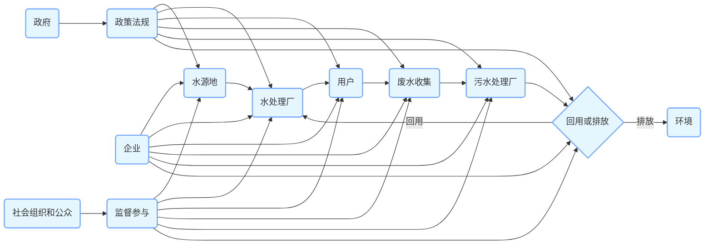

# 可持续水资源管理的创新商业模式研究

> 关键词：可持续水资源管理、创新商业模式、水资源价值、水循环经济、利益相关者、市场机制、水资源投资

> 摘要：本文聚焦于可持续水资源管理的创新商业模式研究。首先阐述了在全球水资源短缺与环境问题日益严峻的背景下，传统水资源管理模式的局限性，凸显创新商业模式的必要性。深入剖析了可持续水资源管理创新商业模式的核心概念，包括水资源价值的重新认知、水循环经济的理念等，并通过文本示意图和 Mermaid 流程图展示其架构联系。详细讲解了相关核心算法原理和具体操作步骤，运用 Python 代码进行说明。同时给出了数学模型和公式，并结合实际案例进行分析。通过项目实战，从开发环境搭建到源代码实现与解读，展示了创新商业模式在实际中的应用。探讨了其在不同领域的实际应用场景，推荐了相关的学习资源、开发工具框架以及论文著作。最后总结了未来发展趋势与挑战，对常见问题进行解答并提供扩展阅读与参考资料，旨在为推动可持续水资源管理的创新实践提供全面的理论与实践指导。

## 1. 背景介绍 
### 1.1 目的和范围
随着全球人口的持续增长、经济的快速发展以及气候变化的影响，水资源短缺和水污染问题日益严峻，已经成为制约人类社会可持续发展的关键因素之一。传统的水资源管理模式主要依赖政府主导的公共服务，在资金投入、运营效率和创新能力等方面存在一定的局限性。本研究的目的在于探索可持续水资源管理的创新商业模式，以提高水资源管理的效率和效益，实现水资源的可持续利用。研究范围涵盖了水资源的开发、利用、保护和循环利用等各个环节，涉及到政府、企业、社会组织和公众等多个利益相关者。

### 1.2 预期读者
本文的预期读者包括从事水资源管理、环境保护、经济管理等领域的研究人员、政策制定者、企业管理者和相关从业人员。同时，对于关注可持续发展和水资源问题的公众也具有一定的参考价值。

### 1.3 文档结构概述
本文共分为十个部分。第一部分介绍研究的背景，包括目的、范围、预期读者和文档结构概述；第二部分阐述可持续水资源管理创新商业模式的核心概念与联系，通过文本示意图和 Mermaid 流程图进行展示；第三部分讲解核心算法原理和具体操作步骤，使用 Python 代码进行详细阐述；第四部分给出数学模型和公式，并进行详细讲解和举例说明；第五部分通过项目实战，展示创新商业模式的代码实际案例和详细解释；第六部分探讨实际应用场景；第七部分推荐相关的工具和资源；第八部分总结未来发展趋势与挑战；第九部分为附录，解答常见问题；第十部分提供扩展阅读和参考资料。

### 1.4 术语表
#### 1.4.1 核心术语定义
- **可持续水资源管理**：指在满足当代人对水资源需求的同时，不损害后代人满足其需求的能力，实现水资源的合理开发、高效利用、有效保护和科学管理。
- **创新商业模式**：是指打破传统的水资源管理模式，通过引入新的技术、理念和市场机制，创造出具有竞争力和可持续性的商业运营模式。
- **水资源价值**：包括水资源的经济价值、生态价值和社会价值，是衡量水资源重要性和稀缺性的综合指标。
- **水循环经济**：以水资源的循环利用为核心，通过建立水资源的循环产业链，实现水资源的高效利用和废弃物的最小化排放。

#### 1.4.2 相关概念解释
- **利益相关者**：指与水资源管理相关的各个主体，包括政府、企业、社会组织和公众等，他们在水资源管理中具有不同的利益诉求和责任。
- **市场机制**：通过价格、竞争和供求等市场要素的相互作用，实现水资源的优化配置和有效利用。
- **水资源投资**：指对水资源开发、利用、保护和循环利用等项目的资金投入，旨在提高水资源的供给能力和利用效率。

#### 1.4.3 缩略词列表
- **WDM**：Water Demand Management（需水管理）
- **WRM**：Water Resource Management（水资源管理）
- **WWTP**：Wastewater Treatment Plant（污水处理厂）

## 2. 核心概念与联系 

### 核心概念原理
可持续水资源管理的创新商业模式基于对水资源价值的重新认知和水循环经济的理念。传统的水资源管理往往只注重水资源的经济价值，而忽视了其生态价值和社会价值。创新商业模式强调将水资源的经济、生态和社会价值进行综合考量，通过市场机制实现水资源的优化配置。

水循环经济是创新商业模式的核心理论之一。它借鉴了工业循环经济的理念，将水资源的开发、利用、处理和回用视为一个完整的循环系统。在这个系统中，水资源在不同的产业和环节中循环流动，实现了水资源的高效利用和废弃物的最小化排放。

### 架构的文本示意图
可持续水资源管理的创新商业模式涉及多个利益相关者和环节，其架构可以用以下文本示意图表示：

政府作为政策制定者和监管者，制定水资源管理的政策法规，引导和规范市场行为。企业作为市场主体，通过投资、运营和技术创新，参与水资源的开发、利用和处理。社会组织和公众作为监督者和参与者，对水资源管理的决策和执行进行监督，并积极参与水资源保护和节约活动。

在具体的业务流程中，水资源从水源地获取，经过处理后供应给用户使用。用户产生的废水经过收集和处理后，部分可以回用，实现水资源的循环利用。同时，在整个过程中，通过市场机制的调节，实现水资源的合理定价和资源的优化配置。

### Mermaid 流程图


这个流程图展示了可持续水资源管理创新商业模式的主要环节和利益相关者之间的关系。从水源地的取水到用户的使用，再到废水的处理和回用，形成了一个完整的水循环系统。政府通过政策法规对整个过程进行引导和监管，企业负责具体的运营和技术创新，社会组织和公众则发挥监督和参与的作用。

## 3. 核心算法原理 & 具体操作步骤 

### 核心算法原理
在可持续水资源管理的创新商业模式中，一个重要的算法是水资源价值评估算法。水资源价值评估是实现水资源合理定价和优化配置的基础。

水资源价值评估算法可以基于多属性决策理论。该理论认为，水资源的价值受到多个属性的影响，包括水资源的数量、质量、生态功能、社会需求等。通过对这些属性进行量化和综合评估，可以得到水资源的综合价值。

以下是一个简化的水资源价值评估算法的 Python 代码示例：

```python
import numpy as np

# 定义水资源属性权重
weights = np.array([0.3, 0.3, 0.2, 0.2])  # 数量、质量、生态功能、社会需求的权重

# 定义水资源属性得分
scores = np.array([8, 7, 6, 7])  # 数量、质量、生态功能、社会需求的得分

# 计算水资源综合价值
def water_value_evaluation(weights, scores):
    return np.dot(weights, scores)

# 调用函数计算水资源综合价值
value = water_value_evaluation(weights, scores)
print(f"水资源综合价值: {value}")
```

### 具体操作步骤
1. **确定水资源属性**：首先需要确定影响水资源价值的主要属性，如数量、质量、生态功能、社会需求等。
2. **确定属性权重**：根据不同属性的重要程度，确定其权重。权重的确定可以通过专家打分、层次分析法等方法进行。
3. **量化属性得分**：对每个属性进行量化评估，得到相应的得分。得分可以根据实际情况进行设定，如采用百分制。
4. **计算综合价值**：将属性权重和属性得分进行加权求和，得到水资源的综合价值。
5. **应用综合价值**：根据水资源的综合价值，进行水资源的定价、分配和管理决策。

## 4. 数学模型和公式 & 详细讲解 & 举例说明 

### 数学模型和公式
水资源价值评估的数学模型可以表示为：

$$V = \sum_{i=1}^{n} w_i \times s_i$$

其中，$V$ 表示水资源的综合价值，$w_i$ 表示第 $i$ 个属性的权重，$s_i$ 表示第 $i$ 个属性的得分，$n$ 表示属性的数量。

### 详细讲解
这个公式的原理是基于加权平均的思想。每个属性的得分乘以其权重，然后将所有属性的乘积相加，得到水资源的综合价值。权重反映了每个属性在水资源价值中的重要程度，得分反映了该属性的实际情况。

### 举例说明
假设我们要评估某一地区的水资源价值，确定的属性包括数量、质量、生态功能和社会需求，权重分别为 0.3、0.3、0.2 和 0.2。经过评估，数量得分 8 分，质量得分 7 分，生态功能得分 6 分，社会需求得分 7 分。

根据上述公式计算：

$$V = 0.3 \times 8 + 0.3 \times 7 + 0.2 \times 6 + 0.2 \times 7$$
$$V = 2.4 + 2.1 + 1.2 + 1.4$$
$$V = 7.1$$

因此，该地区的水资源综合价值为 7.1 分。这个结果可以用于水资源的定价、分配和管理决策，例如，如果水资源综合价值较高，可以适当提高水价，以促进水资源的节约和高效利用。

## 5. 项目实战：代码实际案例和详细解释说明 

### 5.1  开发环境搭建
为了实现可持续水资源管理的创新商业模式的相关代码，我们可以使用 Python 语言进行开发。以下是开发环境的搭建步骤：

1. **安装 Python**：从 Python 官方网站（https://www.python.org/downloads/）下载并安装适合你操作系统的 Python 版本。建议安装 Python 3.6 及以上版本。
2. **安装开发工具**：可以选择使用 PyCharm、VS Code 等集成开发环境（IDE），也可以使用 Jupyter Notebook 进行交互式开发。这里以 PyCharm 为例，从 JetBrains 官方网站（https://www.jetbrains.com/pycharm/download/）下载并安装 PyCharm 社区版。
3. **创建虚拟环境**：在项目目录下，使用以下命令创建虚拟环境：

```bash
python -m venv myenv
```

4. **激活虚拟环境**：
- 在 Windows 系统下，使用以下命令激活虚拟环境：

```bash
myenv\Scripts\activate
```

- 在 Linux 或 macOS 系统下，使用以下命令激活虚拟环境：

```bash
source myenv/bin/activate
```

5. **安装依赖库**：在虚拟环境中，使用以下命令安装所需的依赖库：

```bash
pip install numpy pandas matplotlib
```

### 5.2  源代码详细实现和代码解读
以下是一个更完整的水资源管理模拟项目的 Python 代码示例，包括水资源的供应、需求、处理和回用等环节：

```python
import numpy as np
import pandas as pd
import matplotlib.pyplot as plt

# 定义水资源供应类
class WaterSupply:
    def __init__(self, initial_volume):
        self.volume = initial_volume

    def supply_water(self, demand):
        if self.volume >= demand:
            self.volume -= demand
            return demand
        else:
            available_water = self.volume
            self.volume = 0
            return available_water

# 定义用户需求类
class UserDemand:
    def __init__(self, initial_demand):
        self.demand = initial_demand

    def update_demand(self, factor):
        self.demand *= factor

# 定义污水处理厂类
class WastewaterTreatmentPlant:
    def __init__(self, treatment_capacity, reuse_rate):
        self.treatment_capacity = treatment_capacity
        self.reuse_rate = reuse_rate
        self.treated_water = 0

    def treat_wastewater(self, wastewater):
        if wastewater <= self.treatment_capacity:
            self.treated_water = wastewater
        else:
            self.treated_water = self.treatment_capacity
        return self.treated_water * self.reuse_rate

# 模拟水资源管理过程
def simulate_water_management(initial_supply, initial_demand, treatment_capacity, reuse_rate, num_steps, demand_factor):
    supply = WaterSupply(initial_supply)
    demand = UserDemand(initial_demand)
    treatment_plant = WastewaterTreatmentPlant(treatment_capacity, reuse_rate)

    supply_history = []
    demand_history = []
    reuse_history = []

    for step in range(num_steps):
        # 计算用户需求
        current_demand = demand.demand
        # 获取水资源供应
        supplied_water = supply.supply_water(current_demand)
        # 产生废水
        wastewater = supplied_water
        # 处理废水并回用
        reused_water = treatment_plant.treat_wastewater(wastewater)
        # 更新供应
        supply.volume += reused_water
        # 更新需求
        demand.update_demand(demand_factor)

        supply_history.append(supply.volume)
        demand_history.append(current_demand)
        reuse_history.append(reused_water)

    return supply_history, demand_history, reuse_history

# 设定参数
initial_supply = 1000  # 初始水资源供应量
initial_demand = 100   # 初始用户需求
treatment_capacity = 80  # 污水处理厂处理能力
reuse_rate = 0.5  # 回用率
num_steps = 20  # 模拟步数
demand_factor = 1.1  # 需求增长因子

# 运行模拟
supply_history, demand_history, reuse_history = simulate_water_management(initial_supply, initial_demand, treatment_capacity, reuse_rate, num_steps, demand_factor)

# 绘制结果
steps = np.arange(num_steps)
plt.plot(steps, supply_history, label='Water Supply')
plt.plot(steps, demand_history, label='User Demand')
plt.plot(steps, reuse_history, label='Reused Water')
plt.xlabel('Time Steps')
plt.ylabel('Volume')
plt.title('Water Management Simulation')
plt.legend()
plt.show()
```

### 5.3  代码解读与分析
1. **类的定义**：
    - `WaterSupply` 类：用于表示水资源的供应情况，包含一个初始水量属性 `volume` 和一个 `supply_water` 方法，用于根据用户需求提供水资源。
    - `UserDemand` 类：用于表示用户的需求情况，包含一个初始需求属性 `demand` 和一个 `update_demand` 方法，用于更新用户需求。
    - `WastewaterTreatmentPlant` 类：用于表示污水处理厂的情况，包含处理能力属性 `treatment_capacity`、回用率属性 `reuse_rate` 和一个 `treat_wastewater` 方法，用于处理废水并计算回用的水量。

2. **模拟函数**：
    - `simulate_water_management` 函数：用于模拟水资源管理的过程。在每个时间步中，计算用户需求，获取水资源供应，产生废水，处理废水并回用，更新水资源供应和用户需求。同时，记录每个时间步的水资源供应、用户需求和回用水量。

3. **参数设定和模拟运行**：
    - 设定初始水资源供应量、初始用户需求、污水处理厂处理能力、回用率、模拟步数和需求增长因子等参数。
    - 调用 `simulate_water_management` 函数进行模拟，并获取模拟结果。

4. **结果可视化**：
    - 使用 `matplotlib` 库绘制水资源供应、用户需求和回用水量随时间变化的曲线，直观地展示水资源管理的过程。

通过这个项目实战，我们可以模拟不同参数下的水资源管理情况，评估不同策略的效果，为可持续水资源管理的创新商业模式提供决策支持。

## 6. 实际应用场景 
### 城市供水系统
在城市供水系统中，创新商业模式可以通过引入市场机制，提高供水效率和服务质量。例如，采用公私合营（PPP）模式，政府与企业合作建设和运营供水设施。企业通过投资和技术创新，提高水资源的利用效率和处理能力；政府则负责监管和保障公共利益。同时，可以根据水资源的价值评估结果，实行阶梯水价制度，促进居民节约用水。

### 工业用水管理
工业是用水大户，创新商业模式可以帮助工业企业实现水资源的高效利用和循环利用。例如，企业可以通过建立内部的水循环系统，将生产过程中产生的废水进行处理和回用，减少对外部水资源的依赖。此外，还可以开展水资源交易，将企业多余的水资源出售给其他企业，实现水资源的优化配置。

### 农业灌溉
在农业灌溉方面，创新商业模式可以推广节水灌溉技术，提高水资源的利用效率。例如，采用滴灌、喷灌等节水灌溉设备，减少水资源的浪费。同时，可以建立农业用水合作社，通过规模化经营和专业化管理，降低灌溉成本。此外，还可以开展水资源权交易，鼓励农民节约用水，将节约的水资源指标出售给其他用户。

### 水资源保护和生态修复
创新商业模式可以吸引社会资本参与水资源保护和生态修复项目。例如，通过设立水资源保护基金，鼓励企业和社会公众捐赠资金，用于水资源保护和生态修复。此外，还可以采用生态补偿机制，对因保护水资源而受到经济损失的地区和群体进行补偿，促进水资源保护和经济发展的协调共进。

## 7. 工具和资源推荐
### 7.1 学习资源推荐
#### 7.1.1 书籍推荐
- 《水资源管理学》：系统介绍了水资源管理的基本理论、方法和技术，是学习水资源管理的经典教材。
- 《循环经济理论与实践》：阐述了循环经济的基本原理和应用案例，对理解水循环经济有很大帮助。
- 《可持续发展经济学》：探讨了可持续发展的经济理论和政策，为可持续水资源管理的创新商业模式提供了理论基础。

#### 7.1.2 在线课程
- Coursera 平台上的“Water Resources Management”课程：由知名高校的教授授课，涵盖了水资源管理的各个方面。
- edX 平台上的“Circular Economy: Concepts and Applications”课程：介绍了循环经济的概念和应用，对水资源循环利用有深入讲解。
- 中国大学 MOOC 平台上的“可持续发展导论”课程：从宏观角度介绍了可持续发展的理论和实践，对理解可持续水资源管理有重要意义。

#### 7.1.3 技术博客和网站
- 国际水资源管理研究所（IWMI）官网（https://www.iwmi.org/）：提供了全球水资源管理的最新研究成果和实践案例。
- 世界银行水资源团队官网（https://www.worldbank.org/en/topic/water）：发布了关于水资源管理的政策研究和项目经验。
- 中国水网（https://www.h2o-china.com/）：专注于中国水资源领域的新闻资讯、研究报告和行业动态。

### 7.2 开发工具框架推荐
#### 7.2.1 IDE和编辑器
- PyCharm：功能强大的 Python 集成开发环境，提供了代码编辑、调试、版本控制等一系列功能。
- VS Code：轻量级的代码编辑器，支持多种编程语言，通过安装插件可以实现 Python 开发的各种功能。
- Jupyter Notebook：交互式的开发环境，适合进行数据分析和代码演示。

#### 7.2.2 调试和性能分析工具
- PDB：Python 自带的调试工具，可以帮助开发者定位和解决代码中的问题。
- cProfile：Python 标准库中的性能分析工具，可以分析代码的运行时间和资源消耗情况。
- Py-Spy：一个用于分析 Python 程序性能的工具，可以实时监控程序的运行状态。

#### 7.2.3 相关框架和库
- NumPy：用于科学计算的 Python 库，提供了高效的数组操作和数学函数。
- Pandas：用于数据处理和分析的 Python 库，提供了数据结构和数据分析工具。
- Matplotlib：用于数据可视化的 Python 库，可以绘制各种类型的图表。

### 7.3 相关论文著作推荐
#### 7.3.1 经典论文
- "The Economics of Water Management"：该论文从经济学的角度探讨了水资源管理的问题，提出了水资源定价和分配的理论模型。
- "Sustainable Water Management: A Review of Concepts and Practices"：对可持续水资源管理的概念和实践进行了全面的综述，为后续的研究提供了重要的参考。
- "Circular Economy in the Water Sector: A Conceptual Framework"：构建了水循环经济在水资源领域的概念框架，为创新商业模式的研究提供了理论支持。

#### 7.3.2 最新研究成果
- 关注《Water Resources Research》、《Journal of Hydrology》等国际知名期刊，这些期刊发表了水资源管理领域的最新研究成果。
- 查阅国际水资源管理会议（IWRA World Water Congress）、国际水利学协会（IAHR）会议等学术会议的论文集，了解最新的研究动态。

#### 7.3.3 应用案例分析
- 分析国内外成功的水资源管理创新商业模式案例，如新加坡的水资源管理模式、以色列的节水农业模式等，从中汲取经验教训，为实际应用提供参考。

## 8. 总结：未来发展趋势与挑战
### 未来发展趋势
1. **数字化和智能化**：随着信息技术的快速发展，水资源管理将越来越多地采用数字化和智能化技术。例如，利用物联网技术实现对水资源的实时监测和管理，利用大数据和人工智能技术进行水资源的预测和决策。
2. **多领域融合**：可持续水资源管理将与能源、交通、农业等多个领域进行深度融合。例如，发展水能源一体化项目，实现水资源和能源的协同利用；推广节水型交通设施，减少交通领域的水资源消耗。
3. **全球合作加强**：水资源是全球性的问题，需要各国之间加强合作。未来，国际社会将进一步加强在水资源管理方面的合作，共同应对水资源短缺和水污染等挑战。
4. **创新商业模式不断涌现**：随着市场机制的不断完善和社会资本的积极参与，可持续水资源管理的创新商业模式将不断涌现。例如，开展水资源金融创新，推出水资源期货、水资源保险等金融产品。

### 挑战
1. **技术难题**：虽然数字化和智能化技术为水资源管理带来了机遇，但也面临着一些技术难题。例如，如何确保传感器数据的准确性和可靠性，如何处理和分析海量的水资源数据等。
2. **政策法规不完善**：目前，我国水资源管理的政策法规还存在一些不足之处。例如，水资源定价机制不合理，水资源产权制度不明确等，这些问题制约了创新商业模式的发展。
3. **公众意识淡薄**：部分公众对水资源短缺和水污染问题的认识不足，节水意识淡薄。这给水资源管理工作带来了一定的困难，需要加强宣传教育，提高公众的水资源保护意识。
4. **资金投入不足**：可持续水资源管理需要大量的资金投入，包括水资源开发、利用、保护和循环利用等方面的基础设施建设和技术研发。目前，资金投入不足是制约水资源管理发展的重要因素之一。

## 9. 附录：常见问题与解答
### 1. 创新商业模式如何解决水资源管理中的资金问题？
创新商业模式可以通过多种方式解决水资源管理中的资金问题。例如，采用公私合营（PPP）模式，吸引社会资本参与水资源项目的投资和运营；开展水资源交易，通过市场机制实现水资源的价值，为水资源管理提供资金支持；设立水资源保护基金，鼓励企业和社会公众捐赠资金等。

### 2. 如何确保创新商业模式的可持续性？
要确保创新商业模式的可持续性，需要从多个方面入手。首先，要建立合理的定价机制，确保水资源的价格能够反映其真实价值，从而吸引投资者和消费者的参与。其次，要加强技术创新，提高水资源的利用效率和处理能力，降低运营成本。此外，还需要建立健全的监管机制，保障公众利益和环境安全。

### 3. 创新商业模式对政府的角色有何要求？
在创新商业模式中，政府的角色主要是政策制定者、监管者和引导者。政府需要制定相关的政策法规，引导和规范市场行为；加强对水资源项目的监管，保障公众利益和环境安全；通过财政补贴、税收优惠等政策措施，引导社会资本参与水资源管理。

### 4. 如何提高公众对创新商业模式的接受度？
提高公众对创新商业模式的接受度，需要加强宣传教育。通过宣传水资源短缺和水污染的严峻形势，让公众认识到创新商业模式的重要性和必要性。同时，要确保创新商业模式的公平性和透明度，让公众能够参与到水资源管理的决策和监督中来。

## 10. 扩展阅读 & 参考资料
### 扩展阅读
- 《水的未来：解决世界最紧迫资源危机的蓝图》：深入探讨了全球水资源危机的现状和未来发展趋势，提出了一系列解决水资源问题的方案。
- 《蓝色经济：10 年 100 项创新改变地球》：介绍了蓝色经济的理念和实践案例，为可持续水资源管理提供了新的思路和方法。
- 《生态经济学：原理与应用》：从生态经济学的角度探讨了水资源管理的问题，对理解水资源的生态价值和经济价值有很大帮助。

### 参考资料
1. 中华人民共和国水利部官网（https://www.mwr.gov.cn/）
2. 联合国水资源官网（https://www.unwater.org/）
3. 国际水资源协会（IWRA）官网（https://www.iwra.org/）
4. 相关学术论文和研究报告。