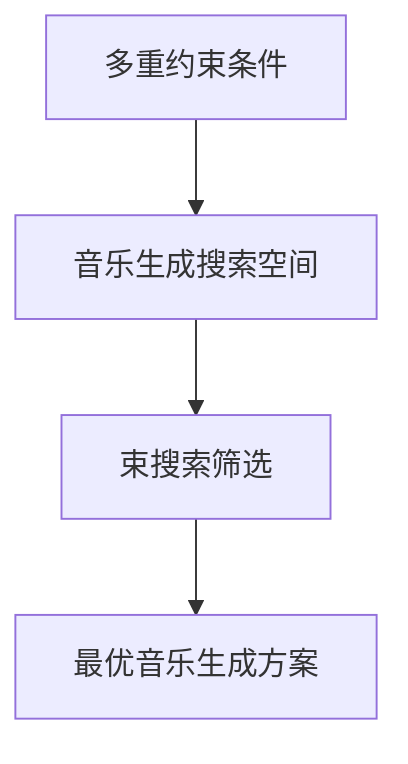

# 可控音乐生成:使用束搜索满足多重约束

> 关键词：可控音乐生成、束搜索、多重约束、音乐算法、音乐创作

> 摘要：本文聚焦于可控音乐生成领域，详细探讨了如何运用束搜索算法来满足多重约束条件。首先介绍了可控音乐生成的背景，包括其目的、预期读者和文档结构。接着阐述了核心概念，如束搜索和多重约束的原理及联系，并给出了相应的文本示意图和 Mermaid 流程图。深入讲解了核心算法原理，使用 Python 源代码进行详细说明，同时给出了相关的数学模型和公式，并举例说明。通过项目实战，展示了代码的实际案例和详细解释。分析了该技术的实际应用场景，推荐了相关的工具和资源，包括学习资源、开发工具框架以及论文著作。最后总结了未来发展趋势与挑战，并给出常见问题解答和扩展阅读参考资料，旨在为读者全面呈现可控音乐生成中束搜索算法在满足多重约束方面的应用。

## 1. 背景介绍 

### 1.1 目的和范围
在音乐创作领域，传统的音乐创作方式依赖于音乐家的灵感和专业技能，创作过程耗时且受限于个人能力。可控音乐生成技术的出现为音乐创作带来了新的可能性。本研究的目的在于探索如何通过束搜索算法实现可控音乐生成，以满足多重约束条件，如旋律的节奏模式、和声规则、情感表达等。范围涵盖了从算法原理的阐述到实际项目的实现，以及对该技术在不同音乐场景中的应用分析。

### 1.2 预期读者
本文预期读者包括音乐技术爱好者、人工智能研究者、音乐创作者以及对计算机音乐生成感兴趣的专业人士。对于音乐技术爱好者，本文可以帮助他们了解前沿的音乐生成技术；人工智能研究者可以从中获取束搜索算法在音乐领域应用的思路；音乐创作者则可以借助该技术拓展创作灵感；专业人士可以通过深入研究，将其应用到实际的音乐项目中。

### 1.3 文档结构概述
本文将按照以下结构展开：首先介绍核心概念，包括束搜索和多重约束的原理及联系；接着详细讲解核心算法原理，并使用 Python 代码进行具体实现；给出相关的数学模型和公式，并举例说明；通过项目实战展示代码的实际应用；分析该技术的实际应用场景；推荐相关的工具和资源；最后总结未来发展趋势与挑战，提供常见问题解答和扩展阅读参考资料。

### 1.4 术语表

#### 1.4.1 核心术语定义
- **可控音乐生成**：指在一定的约束条件下，利用计算机算法生成符合特定要求的音乐作品。
- **束搜索**：一种启发式搜索算法，在每一步搜索过程中，只保留有限个最优候选解，以减少搜索空间，提高搜索效率。
- **多重约束**：在音乐生成过程中，同时考虑多个约束条件，如节奏、和声、旋律等方面的要求。

#### 1.4.2 相关概念解释
- **音乐特征**：包括音高、节奏、时长、音色等，是描述音乐的基本元素。
- **约束条件**：可以是规则性的，如音乐理论中的和声规则；也可以是主观性的，如用户对音乐情感的要求。

#### 1.4.3 缩略词列表
- **AI**：人工智能（Artificial Intelligence）
- **MIDI**：乐器数字接口（Musical Instrument Digital Interface）

## 2. 核心概念与联系 

### 核心概念原理
#### 束搜索原理
束搜索是一种在搜索空间中寻找最优解的算法。在每一步搜索中，它会生成多个候选解，并根据一定的评估函数对这些候选解进行打分。然后，只保留得分最高的前 $k$ 个候选解（$k$ 称为束宽），其余的候选解被舍弃。这样可以大大减少搜索空间，提高搜索效率。

#### 多重约束原理
多重约束是指在音乐生成过程中，同时考虑多个约束条件。这些约束条件可以分为不同的类型，如节奏约束、和声约束、旋律约束等。例如，节奏约束可以规定音乐的节拍模式，和声约束可以要求生成的音乐符合特定的和声进行。

### 核心概念联系
束搜索和多重约束在可控音乐生成中是相互关联的。多重约束为音乐生成提供了明确的目标和规则，而束搜索则是在满足这些约束条件的前提下，寻找最优的音乐生成方案。束搜索通过不断筛选候选解，确保生成的音乐在多个约束条件下达到最优。

### 文本示意图
```plaintext
多重约束条件
    |
    V
音乐生成搜索空间
    |
    | 束搜索筛选
    V
最优音乐生成方案
```

### Mermaid 流程图


## 3. 核心算法原理 & 具体操作步骤 

### 核心算法原理
束搜索算法的核心思想是在每一步搜索中，从当前的候选解集合中生成新的候选解，并根据评估函数对这些新候选解进行打分。然后，只保留得分最高的前 $k$ 个候选解，作为下一步搜索的基础。

### 具体操作步骤
1. **初始化**：设定束宽 $k$，并初始化一个候选解集合，该集合可以包含一个或多个初始的音乐片段。
2. **生成新候选解**：对于候选解集合中的每个候选解，根据音乐生成规则生成新的候选解。
3. **评估候选解**：根据多重约束条件，对生成的新候选解进行评估，计算每个候选解的得分。
4. **筛选候选解**：从所有新候选解中选择得分最高的前 $k$ 个候选解，更新候选解集合。
5. **终止条件判断**：如果达到预定的终止条件（如生成的音乐长度达到要求），则停止搜索；否则，返回步骤 2。

### Python 源代码实现
```python
import random

# 评估函数示例，这里简单假设是随机打分
def evaluate_candidate(candidate):
    return random.random()

# 束搜索算法实现
def beam_search(initial_candidates, beam_width, max_steps):
    current_candidates = initial_candidates
    for step in range(max_steps):
        new_candidates = []
        # 生成新候选解
        for candidate in current_candidates:
            # 这里简单假设每个候选解可以生成两个新候选解
            new_candidates.extend([candidate + [1], candidate + [2]])
        # 评估候选解
        scores = [evaluate_candidate(candidate) for candidate in new_candidates]
        # 筛选候选解
        sorted_candidates = [candidate for _, candidate in sorted(zip(scores, new_candidates), reverse=True)]
        current_candidates = sorted_candidates[:beam_width]
    return current_candidates

# 初始化候选解集合
initial_candidates = [[0]]
beam_width = 3
max_steps = 5

# 执行束搜索
result = beam_search(initial_candidates, beam_width, max_steps)
print("最终候选解:", result)
```

## 4. 数学模型和公式 & 详细讲解 & 举例说明 

### 数学模型
设 $S$ 为音乐生成的搜索空间，$C$ 为候选解集合，$f(c)$ 为评估函数，用于评估候选解 $c$ 的得分。束搜索算法的目标是在满足多重约束条件的前提下，从搜索空间 $S$ 中找到得分最高的候选解。

### 公式
在每一步搜索中，设当前候选解集合为 $C_t$，生成的新候选解集合为 $N_t$，则新候选解集合可以表示为：
$$N_t = \bigcup_{c \in C_t} \text{generate}(c)$$
其中，$\text{generate}(c)$ 表示从候选解 $c$ 生成新候选解的函数。

对新候选解集合 $N_t$ 中的每个候选解 $n$ 计算得分 $f(n)$，然后选择得分最高的前 $k$ 个候选解，更新候选解集合：
$$C_{t+1} = \text{top}_k(N_t, f)$$
其中，$\text{top}_k(N_t, f)$ 表示从集合 $N_t$ 中选择得分最高的前 $k$ 个候选解的函数。

### 详细讲解
评估函数 $f(c)$ 是束搜索算法的关键，它需要综合考虑多重约束条件。例如，在音乐生成中，评估函数可以考虑节奏的合理性、和声的协调性等因素。在实际应用中，评估函数的设计需要根据具体的约束条件进行调整。

### 举例说明
假设我们要生成一段长度为 4 的音乐序列，每个音符可以取值为 0 或 1。初始候选解集合为 $C_0 = \{[0]\}$，束宽 $k = 2$。

- **第一步**：
  - 生成新候选解：$N_0 = \{[0, 0], [0, 1]\}$
  - 评估候选解：假设 $f([0, 0]) = 0.6$，$f([0, 1]) = 0.8$
  - 筛选候选解：$C_1 = \{[0, 1], [0, 0]\}$

- **第二步**：
  - 生成新候选解：$N_1 = \{[0, 1, 0], [0, 1, 1], [0, 0, 0], [0, 0, 1]\}$
  - 评估候选解：假设 $f([0, 1, 0]) = 0.7$，$f([0, 1, 1]) = 0.9$，$f([0, 0, 0]) = 0.5$，$f([0, 0, 1]) = 0.6$
  - 筛选候选解：$C_2 = \{[0, 1, 1], [0, 1, 0]\}$

以此类推，直到生成的音乐序列长度达到 4。

## 5. 项目实战：代码实际案例和详细解释说明 

### 5.1  开发环境搭建
#### 操作系统
推荐使用 Windows、Linux 或 macOS 操作系统。

#### 编程语言和库
- **Python**：选择 Python 3.7 及以上版本。
- **MIDIUtil**：用于生成 MIDI 文件，可通过 `pip install MIDIUtil` 进行安装。

### 5.2  源代码详细实现和代码解读
```python
from midiutil import MIDIFile

# 评估函数示例，考虑音高的合理性
def evaluate_candidate(candidate):
    # 简单假设音高变化不要太大
    pitch_changes = [abs(candidate[i + 1] - candidate[i]) for i in range(len(candidate) - 1)]
    return 1 / (1 + sum(pitch_changes))

# 束搜索算法实现
def beam_search(initial_candidates, beam_width, max_steps):
    current_candidates = initial_candidates
    for step in range(max_steps):
        new_candidates = []
        # 生成新候选解
        for candidate in current_candidates:
            # 假设每个音符可以在当前音高基础上变化 -1 到 1
            for offset in [-1, 0, 1]:
                new_pitch = candidate[-1] + offset
                if 0 <= new_pitch <= 127:
                    new_candidates.append(candidate + [new_pitch])
        # 评估候选解
        scores = [evaluate_candidate(candidate) for candidate in new_candidates]
        # 筛选候选解
        sorted_candidates = [candidate for _, candidate in sorted(zip(scores, new_candidates), reverse=True)]
        current_candidates = sorted_candidates[:beam_width]
    return current_candidates

# 初始化候选解集合
initial_candidates = [[60]]
beam_width = 3
max_steps = 10

# 执行束搜索
result = beam_search(initial_candidates, beam_width, max_steps)
best_candidate = result[0]

# 生成 MIDI 文件
midi = MIDIFile(1)
track = 0
channel = 0
time = 0
duration = 1
volume = 100

for pitch in best_candidate:
    midi.addNote(track, channel, pitch, time, duration, volume)
    time += 1

# 保存 MIDI 文件
with open("generated_music.mid", "wb") as output_file:
    midi.writeFile(output_file)

print("音乐生成完成，已保存为 generated_music.mid")
```

### 代码解读与分析
- **评估函数 `evaluate_candidate`**：该函数用于评估候选解的得分，这里考虑了音高变化的合理性，音高变化越小，得分越高。
- **束搜索算法 `beam_search`**：实现了束搜索的核心逻辑，包括生成新候选解、评估候选解和筛选候选解。
- **生成 MIDI 文件**：使用 `MIDIUtil` 库将生成的音乐序列转换为 MIDI 文件，并保存到本地。

## 6. 实际应用场景 
### 音乐创作辅助
对于音乐创作者来说，可控音乐生成技术可以作为创作的辅助工具。创作者可以设置多重约束条件，如特定的节奏模式、和声进行等，让算法生成符合要求的音乐片段，为创作提供灵感。

### 游戏音乐生成
在游戏开发中，需要根据不同的游戏场景生成相应的音乐。通过可控音乐生成技术，可以根据游戏的情节、氛围等设置约束条件，实时生成适合的音乐，增强游戏的沉浸感。

### 影视配乐
影视制作中，配乐需要与画面的情感、节奏相匹配。使用可控音乐生成技术，可以根据影视片段的特点设置约束条件，生成符合要求的配乐，提高配乐的创作效率。

### 音乐教育
在音乐教育中，可控音乐生成技术可以帮助学生更好地理解音乐理论和创作原理。学生可以通过设置不同的约束条件，观察算法生成的音乐，从而加深对音乐元素和创作规则的理解。

## 7. 工具和资源推荐

### 7.1 学习资源推荐

#### 7.1.1 书籍推荐
- 《人工智能与音乐创作》：介绍了人工智能在音乐创作领域的应用，包括各种音乐生成算法和技术。
- 《音乐理论基础》：为理解音乐的基本元素和规则提供了理论基础，对于实现多重约束条件有很大帮助。

#### 7.1.2 在线课程
- Coursera 上的“人工智能与音乐”课程：系统地介绍了人工智能在音乐领域的应用，包括音乐生成算法的原理和实践。
- edX 上的“音乐创作与编程”课程：结合编程和音乐创作，帮助学习者掌握使用代码生成音乐的技术。

#### 7.1.3 技术博客和网站
- Medium 上的音乐技术博客：经常分享最新的音乐生成技术和研究成果。
- Music Technology Group 网站：提供了大量关于音乐技术的研究论文和开源项目。

### 7.2 开发工具框架推荐

#### 7.2.1 IDE和编辑器
- PyCharm：功能强大的 Python 集成开发环境，适合开发音乐生成项目。
- Visual Studio Code：轻量级的代码编辑器，支持多种编程语言和插件，方便进行代码编写和调试。

#### 7.2.2 调试和性能分析工具
- Py-Spy：用于分析 Python 代码的性能，找出性能瓶颈。
- PDB：Python 内置的调试器，可帮助开发者调试代码。

#### 7.2.3 相关框架和库
- TensorFlow：开源的机器学习框架，可用于构建复杂的音乐生成模型。
- PyTorch：另一个流行的深度学习框架，在音乐生成领域也有广泛应用。

### 7.3 相关论文著作推荐

#### 7.3.1 经典论文
- "A Hierarchical Recurrent Neural Network for Symbolic Music Generation"：提出了一种基于层次循环神经网络的音乐生成方法。
- "Music Composition with Recurrent Neural Networks"：探讨了循环神经网络在音乐创作中的应用。

#### 7.3.2 最新研究成果
- 关注 arXiv 上关于音乐生成的最新论文，了解该领域的前沿研究动态。

#### 7.3.3 应用案例分析
- 一些知名的音乐科技公司会发布他们在音乐生成方面的应用案例，可通过其官方网站或相关技术论坛获取。

## 8. 总结：未来发展趋势与挑战
### 未来发展趋势
- **融合更多音乐元素**：未来的可控音乐生成技术将不仅仅局限于音高、节奏等基本元素，还将融合音色、情感等更多复杂的音乐元素，生成更加丰富多样的音乐作品。
- **与其他技术的结合**：与虚拟现实、增强现实等技术相结合，为用户提供更加沉浸式的音乐体验。例如，在虚拟现实环境中，根据用户的动作和场景实时生成音乐。
- **个性化音乐生成**：根据用户的个人喜好和音乐历史数据，实现更加个性化的音乐生成。例如，为每个用户生成独一无二的专属音乐。

### 挑战
- **约束条件的复杂性**：随着音乐元素的增加，多重约束条件将变得更加复杂，如何设计合理的评估函数和搜索算法来满足这些约束条件是一个挑战。
- **音乐的创造性和艺术性**：虽然算法可以生成符合约束条件的音乐，但如何让生成的音乐具有创造性和艺术性，达到人类音乐家的创作水平，仍然是一个难题。
- **数据的质量和多样性**：高质量、多样化的音乐数据是训练音乐生成模型的基础，但目前音乐数据的收集和标注存在一定的困难，需要进一步解决。

## 9. 附录：常见问题与解答
### 问题 1：束搜索算法的束宽 $k$ 如何选择？
解答：束宽 $k$ 的选择需要根据具体的问题和计算资源来确定。较大的束宽可以增加搜索的全面性，但会增加计算复杂度；较小的束宽可以提高搜索效率，但可能会错过一些最优解。一般可以通过实验来选择合适的束宽。

### 问题 2：如何设计有效的评估函数？
解答：评估函数的设计需要综合考虑多重约束条件。可以将不同的约束条件转化为量化的指标，然后根据这些指标的权重来计算得分。例如，在音乐生成中，可以考虑音高的合理性、节奏的协调性等因素，并为每个因素分配不同的权重。

### 问题 3：可控音乐生成技术是否会取代人类音乐家？
解答：目前来看，可控音乐生成技术还无法取代人类音乐家。虽然算法可以生成符合约束条件的音乐，但音乐创作不仅仅是技术层面的问题，还涉及到情感表达、创造力等方面，这些是人类音乐家的优势所在。可控音乐生成技术更多地是作为一种辅助工具，帮助人类音乐家拓展创作思路。

## 10. 扩展阅读 & 参考资料
### 扩展阅读
- 《计算机音乐技术》：深入介绍了计算机在音乐领域的各种应用技术。
- 《音乐信息检索》：讲解了如何从音乐数据中提取有用信息，对于音乐生成中的数据处理有很大帮助。

### 参考资料
- 相关的学术论文和研究报告，可通过学术数据库如 IEEE Xplore、ACM Digital Library 等获取。
- 开源的音乐生成项目，如 Magenta，可在 GitHub 上找到其源代码和文档。