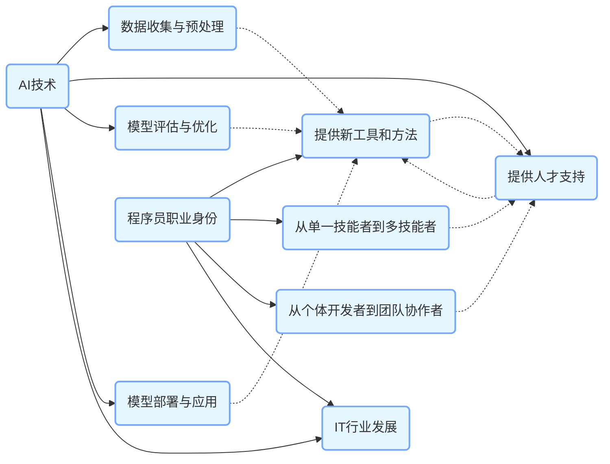

# 在AI浪潮中重塑程序员的职业身份

> 关键词：AI浪潮、程序员、职业身份、重塑、技术变革、职业发展、技能提升

> 摘要：随着人工智能（AI）技术的迅猛发展，整个IT行业正经历着前所未有的变革。在这股AI浪潮中，程序员的职业身份也面临着重塑的挑战与机遇。本文旨在深入探讨AI浪潮对程序员职业的多方面影响，详细剖析程序员需要重塑职业身份的原因，阐述核心概念及联系，介绍相关算法原理与操作步骤，给出数学模型与公式，通过项目实战案例进行分析，探讨实际应用场景，推荐学习和开发的工具资源，最后总结未来发展趋势与挑战，解答常见问题并提供扩展阅读与参考资料，助力程序员在AI浪潮中实现职业身份的成功重塑。

## 1. 背景介绍 
### 1.1 目的和范围
本文的目的在于全面分析AI浪潮对程序员职业身份的影响，为程序员在这一变革时期提供全面、深入的指导，帮助他们理解职业发展的新趋势，掌握重塑职业身份所需的关键技能和知识。范围涵盖了AI技术的基本原理、对程序员工作的影响、新的职业角色和技能要求、实际应用场景、相关工具和资源等多个方面。

### 1.2 预期读者
本文主要面向广大程序员群体，包括初级、中级和高级程序员，以及对AI技术和程序员职业发展感兴趣的相关人士，如IT行业的管理者、技术爱好者等。

### 1.3 文档结构概述
本文首先介绍背景信息，包括目的、预期读者和文档结构概述。接着阐述核心概念与联系，包括AI技术和程序员职业身份的相关原理和架构。然后详细讲解核心算法原理和具体操作步骤，给出数学模型和公式。通过项目实战案例展示代码实现和解读。探讨实际应用场景，推荐相关的工具和资源。最后总结未来发展趋势与挑战，解答常见问题并提供扩展阅读与参考资料。

### 1.4 术语表
#### 1.4.1 核心术语定义
- **人工智能（AI）**：是一门研究如何使计算机能够模拟人类智能的学科，包括机器学习、深度学习、自然语言处理等多个领域。
- **机器学习（ML）**：是AI的一个重要分支，通过让计算机从数据中学习模式和规律，从而实现预测和决策。
- **深度学习（DL）**：是机器学习的一种，基于人工神经网络，通过多层神经元的组合来学习数据的复杂特征。
- **职业身份**：指个体在职业领域中所具有的角色、地位、技能和价值观等的综合体现。

#### 1.4.2 相关概念解释
- **AI浪潮**：指当前AI技术快速发展并广泛应用所带来的行业变革和发展趋势。
- **程序员职业身份重塑**：指在AI浪潮的影响下，程序员需要调整自己的技能、知识和角色定位，以适应新的职业需求。

#### 1.4.3 缩略词列表
- **AI**：Artificial Intelligence（人工智能）
- **ML**：Machine Learning（机器学习）
- **DL**：Deep Learning（深度学习）
- **NLP**：Natural Language Processing（自然语言处理）

## 2. 核心概念与联系 
### 2.1 AI技术原理
AI技术的核心是让计算机模拟人类的智能行为，主要包括以下几个方面：
- **数据收集与预处理**：收集大量的相关数据，并对其进行清洗、转换和标注等预处理操作，以便计算机能够更好地理解和处理。
- **模型训练**：选择合适的机器学习或深度学习模型，使用预处理后的数据对模型进行训练，让模型学习数据中的模式和规律。
- **模型评估与优化**：使用测试数据对训练好的模型进行评估，根据评估结果对模型进行优化，提高模型的性能。
- **模型部署与应用**：将优化后的模型部署到实际应用中，实现对新数据的预测和决策。

### 2.2 程序员职业身份的演变
在传统的软件开发中，程序员主要负责编写代码、实现功能和进行调试。随着AI技术的发展，程序员的职业身份逐渐发生了变化：
- **从代码实现者到问题解决者**：程序员不仅要编写代码，还要理解业务需求，运用AI技术解决实际问题。
- **从单一技能者到多技能者**：除了传统的编程技能外，程序员还需要掌握AI相关的知识和技能，如机器学习算法、数据分析等。
- **从个体开发者到团队协作者**：AI项目通常需要跨学科的团队协作，程序员需要与数据科学家、算法工程师等密切合作。

### 2.3 核心概念的联系
AI技术的发展推动了程序员职业身份的重塑，而程序员职业身份的重塑又促进了AI技术的应用和发展。具体联系如下：
- **AI技术为程序员提供了新的工具和方法**：程序员可以利用AI技术提高开发效率、优化代码性能、实现更智能的功能。
- **程序员的职业身份重塑为AI技术的发展提供了人才支持**：具备AI相关技能的程序员能够更好地推动AI技术的研究和应用。
- **两者相互促进，共同推动IT行业的发展**：AI技术的不断进步促使程序员不断学习和提升自己的技能，而程序员的技能提升又推动了AI技术在更多领域的应用。

### 2.4 文本示意图
```plaintext
AI技术
|-- 数据收集与预处理
|-- 模型训练
|-- 模型评估与优化
|-- 模型部署与应用

程序员职业身份
|-- 代码实现者 -> 问题解决者
|-- 单一技能者 -> 多技能者
|-- 个体开发者 -> 团队协作者

联系
|-- AI技术为程序员提供新工具和方法
|-- 程序员职业身份重塑为AI技术发展提供人才支持
|-- 相互促进，推动IT行业发展
```

### 2.5 Mermaid流程图


## 3. 核心算法原理 & 具体操作步骤 
### 3.1 机器学习算法原理
机器学习算法是AI技术的核心之一，常见的机器学习算法包括线性回归、逻辑回归、决策树、支持向量机等。下面以线性回归为例，详细讲解其原理和Python实现。

#### 3.1.1 线性回归原理
线性回归是一种用于预测连续数值的机器学习算法，其基本思想是通过找到一条直线（或超平面），使得数据点到该直线（或超平面）的距离之和最小。线性回归的数学模型可以表示为：
$$y = \theta_0 + \theta_1x_1 + \theta_2x_2 + \cdots + \theta_nx_n + \epsilon$$
其中，$y$ 是预测值，$x_1, x_2, \cdots, x_n$ 是输入特征，$\theta_0, \theta_1, \theta_2, \cdots, \theta_n$ 是模型的参数，$\epsilon$ 是误差项。

#### 3.1.2 Python实现线性回归
```python
import numpy as np
from sklearn.linear_model import LinearRegression
from sklearn.model_selection import train_test_split
from sklearn.metrics import mean_squared_error

# 生成示例数据
np.random.seed(0)
X = np.random.rand(100, 1)
y = 2 * X + 1 + 0.5 * np.random.randn(100, 1)

# 划分训练集和测试集
X_train, X_test, y_train, y_test = train_test_split(X, y, test_size=0.2, random_state=42)

# 创建线性回归模型
model = LinearRegression()

# 训练模型
model.fit(X_train, y_train)

# 预测
y_pred = model.predict(X_test)

# 评估模型
mse = mean_squared_error(y_test, y_pred)
print(f"Mean Squared Error: {mse}")
```

### 3.2 深度学习算法原理
深度学习是机器学习的一个分支，基于人工神经网络，通过多层神经元的组合来学习数据的复杂特征。下面以简单的全连接神经网络为例，讲解其原理和Python实现。

#### 3.2.1 全连接神经网络原理
全连接神经网络由输入层、隐藏层和输出层组成，每层的神经元与下一层的所有神经元相连。神经元通过激活函数将输入信号转换为输出信号，网络通过反向传播算法来调整神经元的权重和偏置，以最小化损失函数。

#### 3.2.2 Python实现全连接神经网络
```python
import tensorflow as tf
from tensorflow.keras.datasets import mnist
from tensorflow.keras.models import Sequential
from tensorflow.keras.layers import Dense, Flatten
from tensorflow.keras.utils import to_categorical

# 加载MNIST数据集
(X_train, y_train), (X_test, y_test) = mnist.load_data()

# 数据预处理
X_train = X_train / 255.0
X_test = X_test / 255.0
y_train = to_categorical(y_train)
y_test = to_categorical(y_test)

# 创建全连接神经网络模型
model = Sequential([
    Flatten(input_shape=(28, 28)),
    Dense(128, activation='relu'),
    Dense(10, activation='softmax')
])

# 编译模型
model.compile(optimizer='adam',
              loss='categorical_crossentropy',
              metrics=['accuracy'])

# 训练模型
model.fit(X_train, y_train, epochs=5, batch_size=32, validation_data=(X_test, y_test))

# 评估模型
_, accuracy = model.evaluate(X_test, y_test)
print(f"Accuracy: {accuracy}")
```

### 3.3 具体操作步骤
#### 3.3.1 数据准备
- **收集数据**：根据具体的任务需求，收集相关的数据。
- **数据清洗**：去除数据中的噪声、缺失值和重复值。
- **数据转换**：对数据进行归一化、标准化等转换操作，以便模型更好地学习。

#### 3.3.2 模型选择与训练
- **选择合适的模型**：根据任务的类型（分类、回归等）和数据的特点，选择合适的机器学习或深度学习模型。
- **训练模型**：使用训练数据对模型进行训练，调整模型的参数。

#### 3.3.3 模型评估与优化
- **评估模型**：使用测试数据对训练好的模型进行评估，计算模型的性能指标（如准确率、召回率、均方误差等）。
- **优化模型**：根据评估结果，对模型进行优化，如调整模型的超参数、增加数据量等。

#### 3.3.4 模型部署与应用
- **部署模型**：将优化后的模型部署到实际应用中，如Web应用、移动应用等。
- **应用模型**：使用部署好的模型对新数据进行预测和决策。

## 4. 数学模型和公式 & 详细讲解 & 举例说明 
### 4.1 线性回归数学模型和公式
线性回归的数学模型为：
$$y = \theta_0 + \theta_1x_1 + \theta_2x_2 + \cdots + \theta_nx_n + \epsilon$$
其中，$y$ 是预测值，$x_1, x_2, \cdots, x_n$ 是输入特征，$\theta_0, \theta_1, \theta_2, \cdots, \theta_n$ 是模型的参数，$\epsilon$ 是误差项。

为了找到最优的参数 $\theta$，通常使用最小二乘法，即最小化误差平方和：
$$J(\theta) = \frac{1}{2m}\sum_{i=1}^{m}(h_{\theta}(x^{(i)}) - y^{(i)})^2$$
其中，$m$ 是样本数量，$h_{\theta}(x^{(i)})$ 是模型对第 $i$ 个样本的预测值，$y^{(i)}$ 是第 $i$ 个样本的真实值。

通过对 $J(\theta)$ 求偏导数并令其等于0，可以得到最优的参数 $\theta$。

### 4.2 逻辑回归数学模型和公式
逻辑回归是一种用于分类的机器学习算法，其数学模型为：
$$h_{\theta}(x) = g(\theta^Tx) = \frac{1}{1 + e^{-\theta^Tx}}$$
其中，$g(z)$ 是逻辑函数（也称为Sigmoid函数），$\theta$ 是模型的参数，$x$ 是输入特征。

逻辑回归的损失函数通常使用对数损失函数：
$$J(\theta) = -\frac{1}{m}\sum_{i=1}^{m}[y^{(i)}\log(h_{\theta}(x^{(i)})) + (1 - y^{(i)})\log(1 - h_{\theta}(x^{(i)}))]$$
通过对 $J(\theta)$ 求偏导数并使用梯度下降法等优化算法，可以找到最优的参数 $\theta$。

### 4.3 举例说明
#### 4.3.1 线性回归举例
假设我们有一组房屋面积和房价的数据，我们想通过房屋面积来预测房价。我们可以使用线性回归模型：
$$y = \theta_0 + \theta_1x$$
其中，$y$ 是房价，$x$ 是房屋面积。

通过最小二乘法，我们可以找到最优的参数 $\theta_0$ 和 $\theta_1$，从而得到一个可以预测房价的模型。

#### 4.3.2 逻辑回归举例
假设我们有一组学生的考试成绩和是否被录取的数据，我们想通过考试成绩来预测学生是否被录取。我们可以使用逻辑回归模型：
$$h_{\theta}(x) = \frac{1}{1 + e^{-\theta_0 - \theta_1x}}$$
其中，$h_{\theta}(x)$ 是学生被录取的概率，$x$ 是考试成绩。

通过对数损失函数和梯度下降法，我们可以找到最优的参数 $\theta_0$ 和 $\theta_1$，从而得到一个可以预测学生是否被录取的模型。

## 5. 项目实战：代码实际案例和详细解释说明 
### 5.1  开发环境搭建
#### 5.1.1 安装Python
首先，需要安装Python解释器。可以从Python官方网站（https://www.python.org/downloads/）下载适合自己操作系统的Python版本，并按照安装向导进行安装。

#### 5.1.2 安装必要的库
在项目中，我们需要使用一些Python库，如NumPy、Pandas、Scikit-learn、TensorFlow等。可以使用以下命令来安装这些库：
```sh
pip install numpy pandas scikit-learn tensorflow
```

#### 5.1.3 选择开发工具
可以选择自己喜欢的开发工具，如PyCharm、Jupyter Notebook等。PyCharm是一个功能强大的Python集成开发环境，适合大型项目的开发；Jupyter Notebook是一个交互式的开发环境，适合数据探索和模型实验。

### 5.2  源代码详细实现和代码解读
#### 5.2.1 数据准备
```python
import pandas as pd
from sklearn.model_selection import train_test_split
from sklearn.preprocessing import StandardScaler

# 加载数据集
data = pd.read_csv('data.csv')

# 分离特征和标签
X = data.drop('target', axis=1)
y = data['target']

# 划分训练集和测试集
X_train, X_test, y_train, y_test = train_test_split(X, y, test_size=0.2, random_state=42)

# 数据标准化
scaler = StandardScaler()
X_train = scaler.fit_transform(X_train)
X_test = scaler.transform(X_test)
```
**代码解读**：
- 首先，使用 `pandas` 库加载数据集。
- 然后，将特征和标签分离。
- 接着，使用 `train_test_split` 函数将数据集划分为训练集和测试集。
- 最后，使用 `StandardScaler` 对数据进行标准化处理，使得数据的均值为0，标准差为1。

#### 5.2.2 模型训练
```python
from sklearn.linear_model import LogisticRegression

# 创建逻辑回归模型
model = LogisticRegression()

# 训练模型
model.fit(X_train, y_train)
```
**代码解读**：
- 首先，导入 `LogisticRegression` 类。
- 然后，创建一个逻辑回归模型实例。
- 最后，使用训练集数据对模型进行训练。

#### 5.2.3 模型评估
```python
from sklearn.metrics import accuracy_score, classification_report

# 预测
y_pred = model.predict(X_test)

# 计算准确率
accuracy = accuracy_score(y_test, y_pred)
print(f"Accuracy: {accuracy}")

# 打印分类报告
print(classification_report(y_test, y_pred))
```
**代码解读**：
- 首先，使用训练好的模型对测试集数据进行预测。
- 然后，使用 `accuracy_score` 函数计算模型的准确率。
- 最后，使用 `classification_report` 函数打印分类报告，包括精确率、召回率、F1值等指标。

### 5.3  代码解读与分析
#### 5.3.1 数据准备阶段
数据准备是机器学习项目的重要环节，它直接影响模型的性能。在这个项目中，我们使用了 `pandas` 库来加载和处理数据，使用 `train_test_split` 函数来划分训练集和测试集，使用 `StandardScaler` 对数据进行标准化处理。标准化处理可以使得数据的特征具有相同的尺度，有助于模型的收敛和性能提升。

#### 5.3.2 模型训练阶段
在模型训练阶段，我们选择了逻辑回归模型。逻辑回归是一种简单而有效的分类算法，适用于二分类问题。我们使用 `fit` 方法对模型进行训练，该方法会根据训练集数据调整模型的参数。

#### 5.3.3 模型评估阶段
在模型评估阶段，我们使用了 `accuracy_score` 函数和 `classification_report` 函数来评估模型的性能。准确率是一个常用的评估指标，它表示模型预测正确的样本数占总样本数的比例。分类报告则提供了更详细的评估信息，包括精确率、召回率、F1值等指标，可以帮助我们更全面地了解模型的性能。

## 6. 实际应用场景 
### 6.1 智能客服
在智能客服场景中，程序员可以利用AI技术开发智能客服系统。通过自然语言处理技术，智能客服可以理解用户的问题，并自动给出回答。程序员需要掌握NLP相关的算法和技术，如词法分析、句法分析、语义理解等，同时还需要与数据科学家合作，对大量的用户对话数据进行训练和优化，以提高智能客服的准确性和效率。

### 6.2 图像识别
在图像识别领域，程序员可以开发图像识别系统，用于人脸识别、物体检测、图像分类等任务。深度学习算法在图像识别中取得了很好的效果，程序员需要掌握卷积神经网络（CNN）等深度学习模型的原理和实现，以及图像处理的相关技术，如图像增强、特征提取等。

### 6.3 推荐系统
推荐系统在电商、社交媒体等领域有着广泛的应用。程序员可以利用AI技术开发推荐系统，根据用户的历史行为和偏好，为用户推荐个性化的商品或内容。推荐系统通常使用协同过滤、深度学习等算法，程序员需要掌握这些算法的原理和实现，同时还需要处理大规模的数据，优化系统的性能。

### 6.4 自动驾驶
自动驾驶是AI技术的一个重要应用领域。程序员需要参与自动驾驶系统的开发，包括传感器数据处理、环境感知、决策规划等模块的实现。自动驾驶系统涉及到多个领域的知识，如计算机视觉、控制理论、机器学习等，程序员需要具备跨学科的知识和技能。

## 7. 工具和资源推荐
### 7.1 学习资源推荐
#### 7.1.1 书籍推荐
- 《机器学习》（周志华）：这本书是机器学习领域的经典教材，全面介绍了机器学习的基本概念、算法和应用。
- 《深度学习》（Ian Goodfellow、Yoshua Bengio、Aaron Courville）：这本书是深度学习领域的权威著作，详细介绍了深度学习的原理、算法和应用。
- 《Python机器学习》（Sebastian Raschka、Vahid Mirjalili）：这本书以Python为工具，介绍了机器学习的基本算法和实践技巧。

#### 7.1.2 在线课程
- Coursera上的《机器学习》（Andrew Ng）：这是一门非常经典的机器学习课程，由斯坦福大学的Andrew Ng教授主讲，内容深入浅出，适合初学者。
- edX上的《深度学习微硕士》：这是一系列深度学习课程，涵盖了深度学习的各个方面，适合有一定基础的学习者。
- 吴恩达的《深度学习专项课程》：该课程由吴恩达教授亲自授课，内容包括神经网络和深度学习、改善深层神经网络、结构化机器学习项目、卷积神经网络、序列模型等。

#### 7.1.3 技术博客和网站
- Medium：这是一个技术博客平台，上面有很多关于AI、机器学习、深度学习等领域的优秀文章。
- Towards Data Science：这是一个专注于数据科学和机器学习的博客，提供了很多实用的教程和案例。
- Kaggle：这是一个数据科学竞赛平台，上面有很多数据集和优秀的解决方案，可以学习到很多实践经验。

### 7.2 开发工具框架推荐
#### 7.2.1 IDE和编辑器
- PyCharm：这是一个功能强大的Python集成开发环境，提供了代码编辑、调试、版本控制等功能，适合大型项目的开发。
- Jupyter Notebook：这是一个交互式的开发环境，适合数据探索和模型实验。可以在浏览器中编写和运行代码，同时还可以添加文本说明和可视化图表。
- Visual Studio Code：这是一个轻量级的代码编辑器，支持多种编程语言和插件扩展，适合快速开发和调试。

#### 7.2.2 调试和性能分析工具
- TensorBoard：这是TensorFlow提供的一个可视化工具，可以用于查看模型的训练过程、损失函数曲线、梯度分布等信息，帮助我们调试和优化模型。
- PyTorch Profiler：这是PyTorch提供的一个性能分析工具，可以用于分析模型的性能瓶颈，如计算时间、内存占用等，帮助我们优化模型的性能。
- cProfile：这是Python标准库中的一个性能分析工具，可以用于分析Python代码的性能瓶颈，帮助我们优化代码的执行效率。

#### 7.2.3 相关框架和库
- TensorFlow：这是一个开源的深度学习框架，由Google开发和维护。它提供了丰富的深度学习模型和工具，支持CPU、GPU和TPU等多种计算设备。
- PyTorch：这是一个开源的深度学习框架，由Facebook开发和维护。它具有动态图的特点，适合快速开发和实验。
- Scikit-learn：这是一个开源的机器学习库，提供了丰富的机器学习算法和工具，如分类、回归、聚类等。

### 7.3 相关论文著作推荐
#### 7.3.1 经典论文
- 《Gradient-based learning applied to document recognition》（Yann LeCun、Léon Bottou、Yoshua Bengio、Patrick Haffner）：这篇论文介绍了卷积神经网络（CNN）在手写数字识别中的应用，是CNN领域的经典论文。
- 《ImageNet Classification with Deep Convolutional Neural Networks》（Alex Krizhevsky、Ilya Sutskever、Geoffrey E. Hinton）：这篇论文介绍了AlexNet网络，在2012年的ImageNet图像分类竞赛中取得了巨大的成功，开启了深度学习在计算机视觉领域的热潮。
- 《Attention Is All You Need》（Ashish Vaswani、Noam Shazeer、Niki Parmar等）：这篇论文介绍了Transformer模型，提出了注意力机制，在自然语言处理领域取得了很好的效果。

#### 7.3.2 最新研究成果
- 可以关注顶级学术会议和期刊，如NeurIPS（神经信息处理系统大会）、ICML（国际机器学习会议）、CVPR（计算机视觉与模式识别会议）、ACL（计算语言学协会年会）等，了解AI领域的最新研究成果。

#### 7.3.3 应用案例分析
- 可以参考一些知名公司的技术博客和案例分享，如Google AI Blog、Facebook AI Research、Microsoft AI等，了解AI技术在实际应用中的案例和经验。

## 8. 总结：未来发展趋势与挑战
### 8.1 未来发展趋势
- **AI与其他技术的融合**：AI将与物联网、大数据、云计算等技术深度融合，创造出更多的应用场景和商业价值。
- **自动化和智能化的软件开发**：AI技术将应用于软件开发的各个环节，如代码生成、测试、优化等，提高软件开发的效率和质量。
- **跨学科的人才需求**：未来的程序员需要具备跨学科的知识和技能，不仅要掌握编程和AI技术，还要了解相关领域的业务知识。

### 8.2 挑战
- **技术更新换代快**：AI技术发展迅速，程序员需要不断学习和更新自己的知识和技能，以适应技术的变化。
- **数据隐私和安全问题**：AI技术的应用需要大量的数据，如何保护数据的隐私和安全是一个重要的挑战。
- **伦理和社会问题**：AI技术的发展可能会带来一些伦理和社会问题，如就业结构的变化、算法偏见等，程序员需要关注这些问题，并积极参与解决。

## 9. 附录：常见问题与解答
### 9.1 AI技术会取代程序员吗？
不会。虽然AI技术可以自动化一些简单的编程任务，但程序员在解决复杂问题、理解业务需求、进行创新等方面仍然具有不可替代的作用。而且，AI技术的发展也需要程序员来开发和维护相关的系统和模型。

### 9.2 程序员如何快速学习AI技术？
- **学习基础知识**：先学习数学基础，如线性代数、概率论、统计学等，再学习机器学习、深度学习等AI相关的基础知识。
- **实践项目**：通过实践项目来巩固所学的知识，提高实际操作能力。可以从简单的项目开始，逐渐增加难度。
- **参考优秀资源**：参考优秀的书籍、在线课程、技术博客等资源，学习他人的经验和技巧。

### 9.3 如何应对AI技术带来的数据隐私和安全问题？
- **加强数据管理**：建立完善的数据管理制度，对数据进行分类、加密、备份等处理，确保数据的安全。
- **使用安全的技术和框架**：选择安全可靠的AI技术和框架，遵循安全开发的最佳实践。
- **加强法律法规意识**：了解相关的法律法规，遵守数据隐私和安全的规定。

## 10. 扩展阅读 & 参考资料
### 10.1 扩展阅读
- 《AI未来进行式》（李开复、王咏刚）：这本书介绍了AI技术的发展趋势和应用场景，以及对社会和人类的影响。
- 《智能时代》（吴军）：这本书探讨了AI技术对人类社会的变革和影响，以及我们应该如何应对。

### 10.2 参考资料
- 相关学术论文和研究报告
- 各大技术公司的官方文档和技术博客
- 开源代码库和项目示例