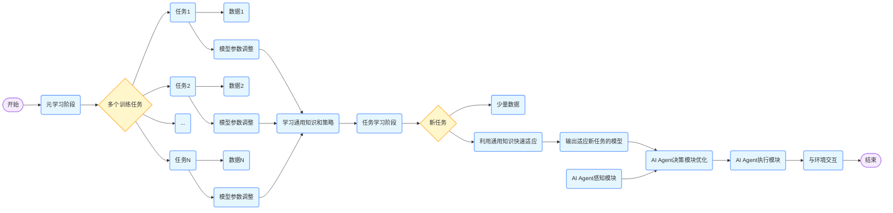

# 基于元学习的个性化AI Agent定制

> 关键词：元学习、个性化定制、AI Agent、机器学习、智能体

> 摘要：本文聚焦于基于元学习的个性化AI Agent定制这一前沿技术。首先介绍了该技术的背景，包括目的、预期读者、文档结构和相关术语。接着阐述了核心概念，如元学习和AI Agent的原理与联系，并通过示意图和流程图进行展示。详细讲解了核心算法原理，用Python代码呈现具体操作步骤。同时给出了相关的数学模型和公式，并举例说明。通过项目实战，从开发环境搭建到源代码实现和解读，深入剖析了该技术的实际应用。探讨了实际应用场景，推荐了学习资源、开发工具框架和相关论文著作。最后总结了未来发展趋势与挑战，提供了常见问题解答和扩展阅读参考资料，旨在为读者全面深入地理解和应用基于元学习的个性化AI Agent定制技术提供有价值的指导。

## 1. 背景介绍 
### 1.1 目的和范围
在当今人工智能快速发展的时代，AI Agent的应用越来越广泛。然而，通用的AI Agent往往难以满足不同用户的个性化需求。基于元学习的个性化AI Agent定制的目的在于，利用元学习的强大能力，让AI Agent能够快速适应不同用户的特定需求和偏好，实现个性化的服务和交互。

本文章的范围涵盖了从元学习和AI Agent的基本概念出发，深入探讨核心算法原理、数学模型，通过实际项目案例展示具体实现过程，以及分析该技术在不同领域的应用场景，并对未来发展趋势和挑战进行展望。

### 1.2 预期读者
本文预期读者包括人工智能领域的研究人员、开发者、数据科学家，以及对元学习和个性化AI Agent感兴趣的技术爱好者。对于有一定机器学习基础的读者，能够进一步深入理解和掌握基于元学习的个性化AI Agent定制技术；对于初学者，也可以通过本文了解该领域的基本概念和技术框架。

### 1.3 文档结构概述
本文将按照以下结构进行组织：首先介绍背景知识，包括目的、预期读者和文档结构；接着阐述核心概念和它们之间的联系，通过示意图和流程图进行可视化展示；然后详细讲解核心算法原理和具体操作步骤，并用Python代码实现；随后给出相关的数学模型和公式，并举例说明；通过项目实战展示代码的实际应用和详细解释；探讨该技术的实际应用场景；推荐学习资源、开发工具框架和相关论文著作；最后总结未来发展趋势与挑战，提供常见问题解答和扩展阅读参考资料。

### 1.4 术语表
#### 1.4.1 核心术语定义
- **元学习（Meta-learning）**：也称为“学习如何学习”，是一种让模型能够从多个任务中快速学习和适应新任务的技术。它的目标是学习到一种通用的学习策略，使得模型在面对新任务时能够利用之前学习到的经验，快速收敛到较好的性能。
- **AI Agent（人工智能智能体）**：是一种能够感知环境、做出决策并执行动作的智能实体。它可以是软件程序、机器人等，通过与环境进行交互来实现特定的目标。
- **个性化定制**：根据用户的特定需求、偏好、历史数据等信息，为用户量身定制AI Agent的功能和行为。

#### 1.4.2 相关概念解释
- **少样本学习（Few-shot learning）**：是元学习的一个重要应用场景，指的是在只有少量样本的情况下，模型能够快速学习并对新样本进行分类或预测。这在实际应用中非常有用，因为获取大量标注数据往往是困难和昂贵的。
- **模型参数初始化**：在训练模型时，需要为模型的参数赋予初始值。元学习可以学习到更好的参数初始化策略，使得模型在新任务上能够更快地收敛。

#### 1.4.3 缩略词列表
- **MAML（Model-Agnostic Meta-Learning）**：模型无关元学习，是一种常用的元学习算法。
- **RL（Reinforcement Learning）**：强化学习，一种通过智能体与环境进行交互并根据奖励信号来学习最优策略的机器学习方法。

## 2. 核心概念与联系 
### 核心概念原理
#### 元学习原理
元学习的核心思想是将学习过程分为两个层次：元学习阶段和任务学习阶段。在元学习阶段，模型从多个不同的任务中学习到通用的知识和学习策略；在任务学习阶段，模型利用元学习阶段学到的知识，快速适应新的任务。

例如，在少样本学习场景中，元学习模型通过在多个不同的分类任务上进行训练，学习到如何利用少量的样本进行有效的分类。当遇到一个新的分类任务时，模型可以利用之前学到的学习策略，快速调整自身的参数，以适应新任务。

#### AI Agent原理
AI Agent通常由感知模块、决策模块和执行模块组成。感知模块用于获取环境的信息，决策模块根据感知到的信息和自身的目标，做出相应的决策，执行模块则将决策转化为具体的动作并在环境中执行。

例如，一个智能机器人作为AI Agent，它的摄像头和传感器就是感知模块，用于获取周围环境的图像和数据；机器人的控制系统是决策模块，根据感知到的信息决定下一步的行动；机器人的机械臂和轮子等是执行模块，用于执行决策模块下达的命令。

### 架构的文本示意图
```plaintext
元学习模块
|
|-- 元学习阶段
|   |-- 多个训练任务
|   |   |-- 任务1
|   |   |   |-- 数据1
|   |   |   |-- 模型参数调整
|   |   |-- 任务2
|   |   |   |-- 数据2
|   |   |   |-- 模型参数调整
|   |   |--...
|   |   |-- 任务N
|   |       |-- 数据N
|   |       |-- 模型参数调整
|   |-- 学习通用知识和策略
|
|-- 任务学习阶段
|   |-- 新任务
|   |   |-- 少量数据
|   |   |-- 利用通用知识快速适应
|
|-- 输出适应新任务的模型

AI Agent模块
|
|-- 感知模块
|   |-- 环境信息获取
|
|-- 决策模块
|   |-- 根据感知信息和目标决策
|
|-- 执行模块
|   |-- 执行决策动作

关联：元学习模块输出的适应新任务的模型可用于优化AI Agent的决策模块，使AI Agent能够更好地适应不同用户的个性化需求。
```

### Mermaid流程图


## 3. 核心算法原理 & 具体操作步骤 
### 核心算法原理 - MAML（Model-Agnostic Meta-Learning）
MAML是一种经典的元学习算法，其核心思想是找到一组模型参数，使得模型在经过少量的梯度更新后，能够在新任务上取得较好的性能。

具体来说，MAML的训练过程分为两个步骤：
1. **内循环（Inner loop）**：对于每个训练任务，使用当前的模型参数进行少量的梯度更新，得到适应该任务的临时参数。
2. **外循环（Outer loop）**：使用所有任务的临时参数，计算元损失，并更新模型的原始参数。

### Python源代码详细阐述
```python
import torch
import torch.nn as nn
import torch.optim as optim

# 定义一个简单的神经网络模型
class SimpleNet(nn.Module):
    def __init__(self):
        super(SimpleNet, self).__init__()
        self.fc1 = nn.Linear(10, 20)
        self.fc2 = nn.Linear(20, 1)

    def forward(self, x):
        x = torch.relu(self.fc1(x))
        x = self.fc2(x)
        return x

# 元学习训练函数
def maml_train(model, tasks, num_inner_steps, inner_lr, outer_lr, num_epochs):
    meta_optimizer = optim.Adam(model.parameters(), lr=outer_lr)

    for epoch in range(num_epochs):
        meta_loss = 0
        for task in tasks:
            # 复制当前模型参数
            fast_weights = list(model.parameters())

            # 内循环
            for _ in range(num_inner_steps):
                x, y = task
                logits = model(x)
                loss = nn.MSELoss()(logits, y)
                grads = torch.autograd.grad(loss, fast_weights)
                fast_weights = [w - inner_lr * g for w, g in zip(fast_weights, grads)]

            # 计算元损失
            x, y = task
            logits = model.forward_with_weights(x, fast_weights)
            meta_loss += nn.MSELoss()(logits, y)

        # 外循环：更新模型原始参数
        meta_optimizer.zero_grad()
        meta_loss.backward()
        meta_optimizer.step()

        if (epoch + 1) % 100 == 0:
            print(f'Epoch {epoch + 1}, Meta Loss: {meta_loss.item()}')

    return model

# 示例任务
tasks = []
for _ in range(10):
    x = torch.randn(20, 10)
    y = torch.randn(20, 1)
    tasks.append((x, y))

# 初始化模型
model = SimpleNet()

# 训练模型
trained_model = maml_train(model, tasks, num_inner_steps=5, inner_lr=0.01, outer_lr=0.001, num_epochs=1000)
```

### 具体操作步骤
1. **定义模型**：定义一个神经网络模型，这里使用一个简单的两层全连接网络。
2. **准备训练任务**：生成多个训练任务，每个任务包含输入数据和对应的标签。
3. **初始化元优化器**：使用Adam优化器来更新模型的原始参数。
4. **进行元学习训练**：
    - 对于每个训练任务，进行内循环的梯度更新，得到适应该任务的临时参数。
    - 计算所有任务的元损失，并进行外循环的参数更新。
5. **输出训练好的模型**：经过多个epoch的训练后，得到适应新任务能力较强的模型。

## 4. 数学模型和公式 & 详细讲解 & 举例说明 
### 数学模型和公式
#### 内循环
在MAML的内循环中，对于第 $i$ 个训练任务，模型的参数更新公式为：
$$
\theta_{i}' = \theta - \alpha \nabla_{\theta} L(\theta, \mathcal{D}_{i})
$$
其中，$\theta$ 是模型的原始参数，$\alpha$ 是内循环的学习率，$L(\theta, \mathcal{D}_{i})$ 是第 $i$ 个任务的损失函数，$\mathcal{D}_{i}$ 是第 $i$ 个任务的训练数据，$\theta_{i}'$ 是适应第 $i$ 个任务的临时参数。

#### 外循环
在MAML的外循环中，元损失的计算公式为：
$$
\mathcal{L}_{meta}(\theta) = \sum_{i=1}^{N} L(\theta_{i}', \mathcal{D}_{i}^{test})
$$
其中，$N$ 是训练任务的数量，$\mathcal{D}_{i}^{test}$ 是第 $i$ 个任务的测试数据。模型的原始参数 $\theta$ 通过最小化元损失来更新：
$$
\theta \leftarrow \theta - \beta \nabla_{\theta} \mathcal{L}_{meta}(\theta)
$$
其中，$\beta$ 是外循环的学习率。

### 详细讲解
内循环的目的是让模型快速适应每个训练任务。通过在每个任务上进行少量的梯度更新，得到临时参数 $\theta_{i}'$，使得模型在该任务上的性能得到提升。

外循环的目的是学习到一组通用的模型参数 $\theta$，使得模型在经过内循环的更新后，能够在多个任务上都取得较好的性能。通过最小化元损失，不断调整模型的原始参数，使得模型能够更好地适应新任务。

### 举例说明
假设我们有两个训练任务 $\mathcal{D}_{1}$ 和 $\mathcal{D}_{2}$，模型的原始参数为 $\theta$。

#### 内循环
对于任务 $\mathcal{D}_{1}$，计算损失 $L(\theta, \mathcal{D}_{1})$，并根据公式更新临时参数 $\theta_{1}' = \theta - \alpha \nabla_{\theta} L(\theta, \mathcal{D}_{1})$。
对于任务 $\mathcal{D}_{2}$，同样计算损失 $L(\theta, \mathcal{D}_{2})$，并更新临时参数 $\theta_{2}' = \theta - \alpha \nabla_{\theta} L(\theta, \mathcal{D}_{2})$。

#### 外循环
计算元损失 $\mathcal{L}_{meta}(\theta) = L(\theta_{1}', \mathcal{D}_{1}^{test}) + L(\theta_{2}', \mathcal{D}_{2}^{test})$，然后根据公式更新模型的原始参数 $\theta \leftarrow \theta - \beta \nabla_{\theta} \mathcal{L}_{meta}(\theta)$。

通过不断重复内循环和外循环，模型的参数会逐渐收敛到一组能够快速适应新任务的通用参数。

## 5. 项目实战：代码实际案例和详细解释说明 
### 5.1  开发环境搭建
#### 安装Python
首先，确保你已经安装了Python 3.6或更高版本。可以从Python官方网站（https://www.python.org/downloads/）下载并安装。

#### 安装必要的库
使用以下命令安装必要的Python库：
```sh
pip install torch torchvision numpy matplotlib
```
- `torch` 和 `torchvision` 是PyTorch深度学习框架的核心库，用于构建和训练神经网络。
- `numpy` 是用于数值计算的库。
- `matplotlib` 是用于数据可视化的库。

### 5.2  源代码详细实现和代码解读
```python
import torch
import torch.nn as nn
import torch.optim as optim
import numpy as np
import matplotlib.pyplot as plt

# 定义一个简单的神经网络模型
class SimpleNet(nn.Module):
    def __init__(self):
        super(SimpleNet, self).__init__()
        self.fc1 = nn.Linear(1, 10)
        self.fc2 = nn.Linear(10, 1)

    def forward(self, x):
        x = torch.relu(self.fc1(x))
        x = self.fc2(x)
        return x

    def forward_with_weights(self, x, weights):
        x = torch.relu(nn.functional.linear(x, weights[0], weights[1]))
        x = nn.functional.linear(x, weights[2], weights[3])
        return x

# 生成任务数据
def generate_task():
    amplitude = np.random.uniform(0.1, 5.0)
    phase = np.random.uniform(0, np.pi)
    x = torch.randn(10, 1)
    y = amplitude * torch.sin(x + phase)
    return x, y

# 元学习训练函数
def maml_train(model, num_tasks, num_inner_steps, inner_lr, outer_lr, num_epochs):
    meta_optimizer = optim.Adam(model.parameters(), lr=outer_lr)
    meta_losses = []

    for epoch in range(num_epochs):
        meta_loss = 0
        for _ in range(num_tasks):
            task = generate_task()
            # 复制当前模型参数
            fast_weights = list(model.parameters())

            # 内循环
            for _ in range(num_inner_steps):
                x, y = task
                logits = model.forward_with_weights(x, fast_weights)
                loss = nn.MSELoss()(logits, y)
                grads = torch.autograd.grad(loss, fast_weights)
                fast_weights = [w - inner_lr * g for w, g in zip(fast_weights, grads)]

            # 计算元损失
            x, y = task
            logits = model.forward_with_weights(x, fast_weights)
            meta_loss += nn.MSELoss()(logits, y)

        # 外循环：更新模型原始参数
        meta_optimizer.zero_grad()
        meta_loss.backward()
        meta_optimizer.step()

        meta_losses.append(meta_loss.item())
        if (epoch + 1) % 100 == 0:
            print(f'Epoch {epoch + 1}, Meta Loss: {meta_loss.item()}')

    return model, meta_losses

# 初始化模型
model = SimpleNet()

# 训练模型
trained_model, meta_losses = maml_train(model, num_tasks=10, num_inner_steps=5, inner_lr=0.01, outer_lr=0.001, num_epochs=1000)

# 绘制元损失曲线
plt.plot(meta_losses)
plt.xlabel('Epoch')
plt.ylabel('Meta Loss')
plt.title('MAML Training Meta Loss')
plt.show()
```

### 代码解读与分析
#### 模型定义
`SimpleNet` 是一个简单的两层全连接神经网络，包含一个输入层、一个隐藏层和一个输出层。`forward` 方法用于前向传播，`forward_with_weights` 方法用于使用给定的参数进行前向传播。

#### 任务数据生成
`generate_task` 函数用于生成一个随机的正弦函数任务。每个任务的振幅和相位是随机生成的，输入数据 $x$ 是随机生成的，标签 $y$ 是根据正弦函数计算得到的。

#### 元学习训练
`maml_train` 函数实现了MAML的训练过程。在每个epoch中，生成多个训练任务，对于每个任务进行内循环的梯度更新，得到临时参数，然后计算元损失并进行外循环的参数更新。

#### 结果可视化
最后，使用 `matplotlib` 库绘制元损失曲线，直观地展示模型的训练过程。

通过这个项目实战，我们可以看到如何使用MAML算法进行元学习训练，以及如何将其应用到实际的任务中。

## 6. 实际应用场景 
### 个性化推荐系统
在个性化推荐系统中，用户的兴趣和偏好各不相同。基于元学习的个性化AI Agent可以通过学习多个用户的历史数据，快速适应新用户的偏好，为用户提供更加个性化的推荐。例如，在电商平台上，AI Agent可以根据用户的浏览历史、购买记录等信息，为用户推荐符合其兴趣的商品。

### 智能客服
智能客服需要能够快速理解用户的问题并提供准确的回答。基于元学习的个性化AI Agent可以通过学习多个用户的常见问题和回答，快速适应新用户的问题类型，提供更加个性化的服务。例如，在在线客服系统中，AI Agent可以根据用户的历史咨询记录，为用户提供更加精准的解决方案。

### 自动驾驶
在自动驾驶领域，不同的驾驶场景和路况需要车辆做出不同的决策。基于元学习的个性化AI Agent可以通过学习多个驾驶场景的数据，快速适应新的驾驶环境，提高自动驾驶的安全性和可靠性。例如，在不同的天气条件下，AI Agent可以根据之前学习到的经验，调整车辆的行驶速度和驾驶策略。

### 医疗诊断
在医疗诊断中，每个患者的病情和症状都有所不同。基于元学习的个性化AI Agent可以通过学习多个患者的病历数据，快速适应新患者的病情，提供更加个性化的诊断建议。例如，在影像诊断中，AI Agent可以根据之前学习到的经验，对新患者的影像数据进行分析和诊断。

## 7. 工具和资源推荐
### 7.1 学习资源推荐
#### 7.1.1 书籍推荐
- 《深度学习》（Deep Learning）：由Ian Goodfellow、Yoshua Bengio和Aaron Courville所著，是深度学习领域的经典教材，涵盖了深度学习的基本原理、算法和应用。
- 《元学习：理论与实践》（Meta-Learning: Theory and Practice）：专门介绍元学习的书籍，详细讲解了元学习的概念、算法和应用场景。

#### 7.1.2 在线课程
- Coursera上的“深度学习专项课程”（Deep Learning Specialization）：由Andrew Ng教授授课，系统地介绍了深度学习的各个方面，包括神经网络、卷积神经网络、循环神经网络等。
- edX上的“元学习基础”（Foundations of Meta-Learning）：专门针对元学习的课程，深入讲解了元学习的核心概念和算法。

#### 7.1.3 技术博客和网站
- arXiv.org：一个开放的预印本平台，包含了大量的人工智能领域的最新研究成果，包括元学习和AI Agent相关的论文。
- Medium上的AI相关博客：许多人工智能领域的专家和研究者会在Medium上分享他们的研究成果和经验，如Towards Data Science等。

### 7.2 开发工具框架推荐
#### 7.2.1 IDE和编辑器
- PyCharm：一款专门为Python开发设计的集成开发环境，提供了丰富的代码编辑、调试和项目管理功能。
- Jupyter Notebook：一个交互式的开发环境，适合进行数据探索、模型实验和代码演示。

#### 7.2.2 调试和性能分析工具
- TensorBoard：TensorFlow提供的可视化工具，可以用于可视化模型的训练过程、损失曲线、模型结构等。
- PyTorch Profiler：PyTorch提供的性能分析工具，可以帮助开发者分析模型的性能瓶颈，优化代码。

#### 7.2.3 相关框架和库
- PyTorch：一个开源的深度学习框架，提供了丰富的神经网络层和优化算法，方便开发者构建和训练深度学习模型。
- TensorFlow：另一个广泛使用的深度学习框架，具有强大的分布式训练和部署能力。
- MetaLearn：一个专门用于元学习的Python库，提供了多种元学习算法的实现。

### 7.3 相关论文著作推荐
#### 7.3.1 经典论文
- "Model-Agnostic Meta-Learning for Fast Adaptation of Deep Networks"：MAML算法的原始论文，详细介绍了MAML的原理和实现方法。
- "Learning to Learn by Gradient Descent by Gradient Descent"：提出了一种基于梯度下降的元学习方法，为元学习的发展奠定了基础。

#### 7.3.2 最新研究成果
- 关注arXiv.org上的最新论文，了解元学习和个性化AI Agent领域的最新研究动态。
- 参加国际人工智能会议，如NeurIPS、ICML等，获取最新的研究成果和趋势。

#### 7.3.3 应用案例分析
- 一些知名科技公司的技术博客会分享他们在实际项目中应用元学习和AI Agent的案例，如Google AI Blog、Facebook AI Research等。

## 8. 总结：未来发展趋势与挑战
### 未来发展趋势
#### 更强大的元学习算法
随着研究的不断深入，未来将会出现更加高效、强大的元学习算法，能够更好地解决少样本学习、跨领域学习等问题，进一步提高AI Agent的个性化定制能力。

#### 与其他技术的融合
元学习将与强化学习、迁移学习、生成对抗网络等其他机器学习技术进行更深入的融合，创造出更加智能、灵活的AI Agent。例如，将元学习与强化学习相结合，可以让AI Agent在复杂的环境中更快地学习到最优策略。

#### 应用领域的拓展
基于元学习的个性化AI Agent将在更多的领域得到应用，如金融、教育、娱乐等。在金融领域，AI Agent可以根据不同投资者的风险偏好和投资目标，提供个性化的投资建议；在教育领域，AI Agent可以根据学生的学习情况和特点，提供个性化的学习方案。

### 挑战
#### 数据隐私和安全问题
在个性化AI Agent定制过程中，需要收集和使用大量的用户数据。如何保护用户的数据隐私和安全，防止数据泄露和滥用，是一个亟待解决的问题。

#### 计算资源需求
元学习算法通常需要大量的计算资源和时间进行训练。如何降低计算成本，提高训练效率，是推广基于元学习的个性化AI Agent的关键挑战之一。

#### 模型可解释性
深度学习模型，尤其是基于元学习的模型，往往具有较高的复杂性，其决策过程难以解释。如何提高模型的可解释性，让用户能够理解AI Agent的决策依据，是提高用户信任度的重要问题。

## 9. 附录：常见问题与解答
### 问题1：元学习和传统机器学习有什么区别？
传统机器学习通常是在一个固定的数据集上进行训练，模型的泛化能力主要依赖于训练数据的多样性和规模。而元学习的目标是学习到一种通用的学习策略，使得模型能够在面对新任务时，利用之前学习到的经验，快速适应新任务。元学习更注重模型的快速学习和适应能力，尤其适用于少样本学习场景。

### 问题2：MAML算法的复杂度如何？
MAML算法的复杂度主要取决于内循环和外循环的迭代次数、模型的复杂度以及训练任务的数量。内循环的梯度更新会增加计算量，尤其是在模型参数较多的情况下。因此，MAML算法的计算复杂度相对较高，需要较大的计算资源和时间。

### 问题3：如何评估基于元学习的个性化AI Agent的性能？
可以使用以下几种方法来评估基于元学习的个性化AI Agent的性能：
- **准确率**：在新任务上的分类或预测准确率。
- **学习速度**：模型在新任务上达到一定性能所需的训练步数或时间。
- **泛化能力**：模型在不同类型的新任务上的性能表现。

### 问题4：元学习在实际应用中有哪些限制？
元学习在实际应用中存在以下一些限制：
- **数据要求**：虽然元学习可以在少样本情况下学习，但仍然需要一定数量的训练任务来学习通用的知识和策略。
- **计算资源**：元学习算法的训练过程通常需要较大的计算资源和时间。
- **模型可解释性**：元学习模型的决策过程往往比较复杂，难以解释。

## 10. 扩展阅读 & 参考资料
### 扩展阅读
- 关注人工智能领域的顶级会议论文集，如NeurIPS、ICML、CVPR等，了解最新的研究成果和趋势。
- 阅读相关的学术期刊，如Journal of Artificial Intelligence Research（JAIR）、Artificial Intelligence等。

### 参考资料
- Goodfellow, I., Bengio, Y., & Courville, A. (2016). Deep Learning. MIT Press.
- Finn, C., Abbeel, P., & Levine, S. (2017). Model-Agnostic Meta-Learning for Fast Adaptation of Deep Networks. Proceedings of the 34th International Conference on Machine Learning-Volume 70.
- Andrychowicz, M., Denil, M., Gomez, S., Hoffman, M. W., Pfau, D., Schaul, T., & De Freitas, N. (2016). Learning to learn by gradient descent by gradient descent. Advances in neural information processing systems.