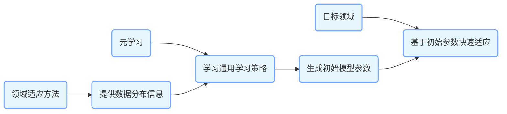

# 基于元学习的快速领域适应推理方法优化

> 关键词：元学习、领域适应、快速推理、优化方法、机器学习

> 摘要：本文聚焦于基于元学习的快速领域适应推理方法的优化研究。在机器学习应用中，领域适应问题一直是关键挑战，而元学习为解决这一问题提供了新的思路。文章首先介绍了相关背景知识，包括研究的目的、预期读者等。接着深入阐述了元学习与领域适应的核心概念及其联系，详细讲解了核心算法原理并给出Python代码示例。通过数学模型和公式对推理过程进行了理论分析，结合实际案例展示了优化方法的具体实现和效果。同时探讨了该方法的实际应用场景，推荐了相关的学习资源、开发工具和论文著作。最后对未来发展趋势与挑战进行了总结，并提供了常见问题解答和扩展阅读参考资料，旨在为相关领域的研究者和开发者提供全面而深入的技术指导。

## 1. 背景介绍 
### 1.1 目的和范围
在机器学习的实际应用中，不同领域的数据分布往往存在显著差异。传统的机器学习模型在一个领域训练后，直接应用到另一个领域时，性能通常会大幅下降。领域适应旨在解决这一问题，使模型能够在不同领域之间快速迁移并保持较好的性能。元学习作为一种新兴的学习范式，通过学习如何学习，能够在少量样本的情况下快速适应新的任务或领域。本研究的目的在于优化基于元学习的快速领域适应推理方法，提高模型在不同领域的适应速度和推理性能。

本研究的范围涵盖了元学习和领域适应的基本理论、核心算法原理、数学模型分析、实际案例实现以及相关的工具和资源推荐等方面，旨在为研究者和开发者提供一个全面的技术指导。

### 1.2 预期读者
本文预期读者包括对机器学习、元学习、领域适应等领域感兴趣的研究者、学生以及从事相关软件开发的工程师。对于希望深入了解元学习在领域适应中的应用以及如何优化快速推理方法的人员具有一定的参考价值。

### 1.3 文档结构概述
本文将按照以下结构进行组织：
1. **背景介绍**：介绍研究的目的、预期读者、文档结构概述以及相关术语表。
2. **核心概念与联系**：阐述元学习和领域适应的核心概念，展示它们之间的联系，并通过文本示意图和Mermaid流程图进行说明。
3. **核心算法原理 & 具体操作步骤**：详细讲解基于元学习的快速领域适应推理方法的核心算法原理，并给出Python源代码示例。
4. **数学模型和公式 & 详细讲解 & 举例说明**：通过数学模型和公式对推理过程进行理论分析，并举例说明。
5. **项目实战：代码实际案例和详细解释说明**：介绍开发环境搭建，给出源代码详细实现和代码解读，对代码进行分析。
6. **实际应用场景**：探讨基于元学习的快速领域适应推理方法的实际应用场景。
7. **工具和资源推荐**：推荐相关的学习资源、开发工具和论文著作。
8. **总结：未来发展趋势与挑战**：总结研究成果，分析未来发展趋势和面临的挑战。
9. **附录：常见问题与解答**：提供常见问题的解答。
10. **扩展阅读 & 参考资料**：提供扩展阅读的相关资料和参考书目。

### 1.4 术语表
#### 1.4.1 核心术语定义
- **元学习（Meta - Learning）**：也称为“学习如何学习”，是一种让模型从多个任务中学习通用的学习策略，以便在新任务上能够快速学习和适应的机器学习范式。
- **领域适应（Domain Adaptation）**：指的是将在一个源领域（Source Domain）上训练的模型应用到另一个目标领域（Target Domain）时，通过一定的方法减少两个领域之间的数据分布差异，使模型在目标领域上也能取得较好的性能。
- **快速推理（Fast Inference）**：在保证模型性能的前提下，尽可能减少模型推理所需的时间和计算资源。

#### 1.4.2 相关概念解释
- **数据分布差异**：不同领域的数据在特征分布、标签分布等方面存在的差异。这种差异可能导致模型在源领域上训练良好，但在目标领域上表现不佳。
- **任务（Task）**：在元学习中，任务通常指的是一个具体的学习问题，例如一个分类任务或回归任务。每个任务包含一组训练数据和测试数据。

#### 1.4.3 缩略词列表
- **MAML（Model - Agnostic Meta - Learning）**：模型无关元学习，是一种经典的元学习算法。
- **SGD（Stochastic Gradient Descent）**：随机梯度下降，是一种常用的优化算法。

## 2. 核心概念与联系 

### 2.1 元学习的核心概念
元学习的核心思想是学习如何学习，即从多个任务中学习通用的学习策略，使得模型能够在新任务上快速适应。传统的机器学习方法通常是在单个任务上进行训练，而元学习则是在多个任务组成的任务分布上进行训练。

元学习可以分为基于模型的元学习、基于优化的元学习和基于度量的元学习等不同类型。其中，基于优化的元学习（如MAML）是一种较为流行的方法，它通过在多个任务上进行快速的梯度更新，学习到一个初始的模型参数，使得模型在新任务上能够通过少量的梯度更新快速收敛到较好的性能。

### 2.2 领域适应的核心概念
领域适应的目标是解决不同领域之间的数据分布差异问题。在实际应用中，源领域和目标领域的数据往往来自不同的数据源或环境，它们的特征分布和标签分布可能存在很大的差异。领域适应的方法通常包括特征变换、对抗训练、基于迁移学习的方法等，旨在减少两个领域之间的差异，提高模型在目标领域上的性能。

### 2.3 元学习与领域适应的联系
元学习和领域适应之间存在着密切的联系。元学习可以为领域适应提供快速适应新领域的能力，通过学习通用的学习策略，模型可以在目标领域上快速调整参数，减少对目标领域大量标注数据的依赖。而领域适应的方法可以为元学习提供更多的任务分布信息，帮助元学习模型更好地学习到通用的学习策略。

### 2.4 文本示意图
元学习和领域适应的联系可以用以下文本示意图表示：

元学习通过学习多个任务的通用学习策略，生成一个初始的模型参数。当遇到新的领域（目标领域）时，基于这个初始参数，模型可以通过少量的梯度更新快速适应目标领域的数据分布。领域适应的方法可以在元学习的过程中，提供不同领域的数据分布信息，帮助元学习模型更好地学习到通用的学习策略，从而提高模型在目标领域上的适应速度和性能。

### 2.5 Mermaid流程图


## 3. 核心算法原理 & 具体操作步骤 

### 3.1 核心算法原理
本研究采用基于MAML的元学习算法来实现快速领域适应推理。MAML的核心思想是通过在多个任务上进行快速的梯度更新，学习到一个初始的模型参数，使得模型在新任务上能够通过少量的梯度更新快速收敛到较好的性能。

具体来说，MAML的训练过程包括两个步骤：内层循环和外层循环。在内层循环中，对于每个任务，使用当前的模型参数进行一次或多次梯度更新，得到一个临时的模型参数。在外层循环中，使用这些临时的模型参数在验证集上计算损失，并对初始的模型参数进行更新。

### 3.2 具体操作步骤
1. **任务采样**：从任务分布中采样一组任务。
2. **内层循环**：对于每个任务，使用当前的模型参数进行一次或多次梯度更新，得到一个临时的模型参数。
3. **外层循环**：使用这些临时的模型参数在验证集上计算损失，并对初始的模型参数进行更新。
4. **重复步骤1 - 3**：直到模型收敛。

### 3.3 Python源代码示例
```python
import torch
import torch.nn as nn
import torch.optim as optim

# 定义一个简单的神经网络模型
class SimpleNet(nn.Module):
    def __init__(self, input_size, hidden_size, output_size):
        super(SimpleNet, self).__init__()
        self.fc1 = nn.Linear(input_size, hidden_size)
        self.relu = nn.ReLU()
        self.fc2 = nn.Linear(hidden_size, output_size)

    def forward(self, x):
        out = self.fc1(x)
        out = self.relu(out)
        out = self.fc2(out)
        return out

# 定义MAML算法
class MAML:
    def __init__(self, model, inner_lr, outer_lr):
        self.model = model
        self.inner_lr = inner_lr
        self.outer_lr = outer_lr
        self.outer_optimizer = optim.Adam(self.model.parameters(), lr=outer_lr)

    def inner_loop(self, support_x, support_y):
        inner_model = SimpleNet(10, 20, 2)
        inner_model.load_state_dict(self.model.state_dict())
        inner_optimizer = optim.SGD(inner_model.parameters(), lr=self.inner_lr)
        loss_fn = nn.CrossEntropyLoss()

        for _ in range(1):  # 内层循环一次
            output = inner_model(support_x)
            loss = loss_fn(output, support_y)
            inner_optimizer.zero_grad()
            loss.backward()
            inner_optimizer.step()

        return inner_model

    def outer_loop(self, tasks):
        meta_loss = 0
        for task in tasks:
            support_x, support_y, query_x, query_y = task
            inner_model = self.inner_loop(support_x, support_y)
            loss_fn = nn.CrossEntropyLoss()
            output = inner_model(query_x)
            loss = loss_fn(output, query_y)
            meta_loss += loss

        self.outer_optimizer.zero_grad()
        meta_loss.backward()
        self.outer_optimizer.step()

        return meta_loss.item()

# 示例使用
model = SimpleNet(10, 20, 2)
maml = MAML(model, inner_lr=0.01, outer_lr=0.001)

# 模拟任务
tasks = []
for _ in range(10):
    support_x = torch.randn(10, 10)
    support_y = torch.randint(0, 2, (10,))
    query_x = torch.randn(5, 10)
    query_y = torch.randint(0, 2, (5,))
    tasks.append((support_x, support_y, query_x, query_y))

# 训练
for epoch in range(100):
    loss = maml.outer_loop(tasks)
    if epoch % 10 == 0:
        print(f'Epoch {epoch}, Loss: {loss}')
```

## 4. 数学模型和公式 & 详细讲解 & 举例说明 

### 4.1 数学模型和公式
#### 4.1.1 内层循环
设 $\theta$ 为初始的模型参数，$\tau$ 为一个任务，$S_{\tau}$ 为任务 $\tau$ 的支持集（训练集），$L$ 为损失函数。在内层循环中，对于任务 $\tau$，使用梯度下降法更新模型参数：

$$\theta_{\tau}' = \theta - \alpha \nabla_{\theta} L(S_{\tau}, \theta)$$

其中，$\alpha$ 为内层学习率。

#### 4.1.2 外层循环
设 $T$ 为采样的任务集合，$Q_{\tau}$ 为任务 $\tau$ 的查询集（验证集）。在外层循环中，使用这些临时的模型参数 $\theta_{\tau}'$ 在查询集上计算损失，并对初始的模型参数 $\theta$ 进行更新：

$$\theta = \theta - \beta \nabla_{\theta} \sum_{\tau \in T} L(Q_{\tau}, \theta_{\tau}')$$

其中，$\beta$ 为外层学习率。

### 4.2 详细讲解
内层循环的目的是在每个任务上快速调整模型参数，使得模型能够适应该任务的数据分布。外层循环的目的是通过在多个任务的查询集上计算损失，对初始的模型参数进行更新，使得模型能够学习到通用的学习策略。

### 4.3 举例说明
假设我们有两个任务 $\tau_1$ 和 $\tau_2$，初始的模型参数为 $\theta$。在内层循环中，对于任务 $\tau_1$，我们使用梯度下降法更新模型参数得到 $\theta_{\tau_1}'$，对于任务 $\tau_2$，我们得到 $\theta_{\tau_2}'$。在外层循环中，我们使用 $\theta_{\tau_1}'$ 和 $\theta_{\tau_2}'$ 在各自的查询集上计算损失，并对初始的模型参数 $\theta$ 进行更新。

## 5. 项目实战：代码实际案例和详细解释说明 

### 5.1 开发环境搭建
#### 5.1.1 安装Python
首先需要安装Python，建议使用Python 3.6及以上版本。可以从Python官方网站（https://www.python.org/downloads/）下载并安装。

#### 5.1.2 安装深度学习框架
本项目使用PyTorch作为深度学习框架，可以使用以下命令安装：
```sh
pip install torch torchvision
```

### 5.2 源代码详细实现和代码解读
#### 5.2.1 模型定义
```python
class SimpleNet(nn.Module):
    def __init__(self, input_size, hidden_size, output_size):
        super(SimpleNet, self).__init__()
        self.fc1 = nn.Linear(input_size, hidden_size)
        self.relu = nn.ReLU()
        self.fc2 = nn.Linear(hidden_size, output_size)

    def forward(self, x):
        out = self.fc1(x)
        out = self.relu(out)
        out = self.fc2(out)
        return out
```
这段代码定义了一个简单的全连接神经网络模型，包含一个输入层、一个隐藏层和一个输出层。

#### 5.2.2 MAML算法实现
```python
class MAML:
    def __init__(self, model, inner_lr, outer_lr):
        self.model = model
        self.inner_lr = inner_lr
        self.outer_lr = outer_lr
        self.outer_optimizer = optim.Adam(self.model.parameters(), lr=outer_lr)

    def inner_loop(self, support_x, support_y):
        inner_model = SimpleNet(10, 20, 2)
        inner_model.load_state_dict(self.model.state_dict())
        inner_optimizer = optim.SGD(inner_model.parameters(), lr=self.inner_lr)
        loss_fn = nn.CrossEntropyLoss()

        for _ in range(1):  # 内层循环一次
            output = inner_model(support_x)
            loss = loss_fn(output, support_y)
            inner_optimizer.zero_grad()
            loss.backward()
            inner_optimizer.step()

        return inner_model

    def outer_loop(self, tasks):
        meta_loss = 0
        for task in tasks:
            support_x, support_y, query_x, query_y = task
            inner_model = self.inner_loop(support_x, support_y)
            loss_fn = nn.CrossEntropyLoss()
            output = inner_model(query_x)
            loss = loss_fn(output, query_y)
            meta_loss += loss

        self.outer_optimizer.zero_grad()
        meta_loss.backward()
        self.outer_optimizer.step()

        return meta_loss.item()
```
这段代码实现了MAML算法，包括内层循环和外层循环。内层循环使用梯度下降法在每个任务的支持集上更新模型参数，外层循环使用这些临时的模型参数在查询集上计算损失，并对初始的模型参数进行更新。

#### 5.2.3 示例使用
```python
model = SimpleNet(10, 20, 2)
maml = MAML(model, inner_lr=0.01, outer_lr=0.001)

# 模拟任务
tasks = []
for _ in range(10):
    support_x = torch.randn(10, 10)
    support_y = torch.randint(0, 2, (10,))
    query_x = torch.randn(5, 10)
    query_y = torch.randint(0, 2, (5,))
    tasks.append((support_x, support_y, query_x, query_y))

# 训练
for epoch in range(100):
    loss = maml.outer_loop(tasks)
    if epoch % 10 == 0:
        print(f'Epoch {epoch}, Loss: {loss}')
```
这段代码使用模拟的任务数据对MAML模型进行训练，并打印出每个epoch的损失值。

### 5.3 代码解读与分析
#### 5.3.1 模型定义
`SimpleNet` 类定义了一个简单的全连接神经网络模型，通过 `__init__` 方法初始化模型的层结构，通过 `forward` 方法定义模型的前向传播过程。

#### 5.3.2 MAML算法实现
`MAML` 类实现了MAML算法的核心逻辑。`inner_loop` 方法实现了内层循环，使用梯度下降法在每个任务的支持集上更新模型参数。`outer_loop` 方法实现了外层循环，使用这些临时的模型参数在查询集上计算损失，并对初始的模型参数进行更新。

#### 5.3.3 示例使用
在示例使用部分，我们首先创建了一个 `SimpleNet` 模型和一个 `MAML` 对象。然后模拟了一些任务数据，并使用这些任务数据对MAML模型进行训练。通过打印每个epoch的损失值，我们可以观察到模型的训练过程。

## 6. 实际应用场景 
### 6.1 图像识别
在图像识别领域，不同的数据集可能具有不同的数据分布，例如不同的光照条件、图像分辨率等。基于元学习的快速领域适应推理方法可以帮助模型在新的图像数据集上快速适应，减少对大量标注数据的依赖。例如，在医学图像识别中，不同医院的医学图像数据集可能存在差异，使用该方法可以使模型在不同医院的数据集上快速达到较好的性能。

### 6.2 自然语言处理
在自然语言处理领域，不同的文本数据源可能具有不同的语言风格、词汇分布等。基于元学习的快速领域适应推理方法可以帮助模型在新的文本数据集上快速适应，提高模型的泛化能力。例如，在情感分析任务中，不同的产品评论数据集可能具有不同的语言风格，使用该方法可以使模型在不同的产品评论数据集上快速达到较好的性能。

### 6.3 机器人控制
在机器人控制领域，不同的工作环境可能对机器人的控制策略提出不同的要求。基于元学习的快速领域适应推理方法可以帮助机器人在新的工作环境中快速适应，调整控制策略。例如，在机器人导航任务中，不同的室内环境可能具有不同的布局和障碍物分布，使用该方法可以使机器人在不同的室内环境中快速找到合适的导航路径。

## 7. 工具和资源推荐
### 7.1 学习资源推荐
#### 7.1.1 书籍推荐
- 《深度学习》（Deep Learning）：由Ian Goodfellow、Yoshua Bengio和Aaron Courville所著，是深度学习领域的经典教材，涵盖了深度学习的基本理论和算法。
- 《机器学习》（Machine Learning: A Probabilistic Perspective）：由Kevin P. Murphy所著，从概率的角度介绍了机器学习的基本理论和算法，对理解元学习和领域适应的原理有很大帮助。

#### 7.1.2 在线课程
- Coursera上的“深度学习专项课程”（Deep Learning Specialization）：由Andrew Ng教授授课，包括深度学习的基础、卷积神经网络、循环神经网络等内容，是学习深度学习的优秀在线课程。
- edX上的“强化学习”（Reinforcement Learning）：由UC Berkeley的Pieter Abbeel教授授课，介绍了强化学习的基本理论和算法，对理解机器人控制等领域的应用有很大帮助。

#### 7.1.3 技术博客和网站
- arXiv（https://arxiv.org/）：是一个预印本平台，提供了大量的机器学习和人工智能领域的最新研究论文。
- Medium（https://medium.com/）：有很多机器学习和人工智能领域的技术博客，提供了丰富的学习资源和实践经验分享。

### 7.2 开发工具框架推荐
#### 7.2.1 IDE和编辑器
- PyCharm：是一款专门为Python开发设计的集成开发环境，提供了丰富的代码编辑、调试和分析功能。
- Jupyter Notebook：是一个交互式的开发环境，适合进行数据分析和模型训练的实验和演示。

#### 7.2.2 调试和性能分析工具
- TensorBoard：是TensorFlow提供的一个可视化工具，可以帮助用户可视化模型的训练过程和性能指标。
- PyTorch Profiler：是PyTorch提供的一个性能分析工具，可以帮助用户分析模型的性能瓶颈。

#### 7.2.3 相关框架和库
- PyTorch：是一个开源的深度学习框架，提供了丰富的深度学习模型和算法实现，支持GPU加速。
- Scikit - learn：是一个开源的机器学习库，提供了丰富的机器学习算法和工具，适合进行机器学习的实验和开发。

### 7.3 相关论文著作推荐
#### 7.3.1 经典论文
- "Model - Agnostic Meta - Learning for Fast Adaptation of Deep Networks"：提出了MAML算法，是元学习领域的经典论文。
- "Domain Adaptation via Transfer Component Analysis"：提出了基于迁移成分分析的领域适应方法，是领域适应领域的经典论文。

#### 7.3.2 最新研究成果
- 可以通过arXiv等预印本平台关注元学习和领域适应领域的最新研究成果。

#### 7.3.3 应用案例分析
- 可以通过相关的学术会议论文和技术博客了解元学习和领域适应在不同领域的应用案例分析。

## 8. 总结：未来发展趋势与挑战
### 8.1 未来发展趋势
#### 8.1.1 多模态元学习与领域适应
随着多模态数据（如图像、文本、音频等）的广泛应用，未来的研究可能会关注多模态元学习与领域适应的方法。通过融合不同模态的数据信息，可以提高模型在不同领域的适应能力和推理性能。

#### 8.1.2 强化学习与元学习的结合
强化学习在机器人控制、游戏等领域取得了显著的成果，未来的研究可能会将强化学习与元学习相结合，实现更加智能和灵活的决策和控制。通过元学习，强化学习模型可以更快地适应新的环境和任务，提高学习效率和性能。

#### 8.1.3 自适应元学习
未来的研究可能会关注自适应元学习方法，即模型能够根据不同的任务和领域自动调整学习策略和参数。这种自适应能力可以使模型更加灵活和高效地适应不同的应用场景。

### 8.2 挑战
#### 8.2.1 计算资源需求
基于元学习的快速领域适应推理方法通常需要大量的计算资源，尤其是在处理大规模数据集和复杂模型时。如何降低计算资源需求，提高算法的效率是一个亟待解决的问题。

#### 8.2.2 数据分布差异的度量
准确地度量不同领域之间的数据分布差异是领域适应的关键问题之一。目前的方法在度量数据分布差异时还存在一定的局限性，如何更准确地度量数据分布差异，提高领域适应的效果是一个挑战。

#### 8.2.3 模型的可解释性
元学习模型通常是黑盒模型，其决策过程和学习策略难以解释。在一些对模型可解释性要求较高的应用场景中，如何提高元学习模型的可解释性是一个重要的挑战。

## 9. 附录：常见问题与解答
### 9.1 元学习和传统机器学习有什么区别？
元学习的核心思想是学习如何学习，即从多个任务中学习通用的学习策略，使得模型能够在新任务上快速适应。而传统机器学习方法通常是在单个任务上进行训练，对新任务的适应能力较差。

### 9.2 领域适应的方法有哪些？
领域适应的方法通常包括特征变换、对抗训练、基于迁移学习的方法等。特征变换方法通过对源领域和目标领域的数据进行特征变换，减少两个领域之间的差异。对抗训练方法通过引入对抗网络，使得模型能够学习到与领域无关的特征。基于迁移学习的方法通过将源领域的知识迁移到目标领域，提高模型在目标领域上的性能。

### 9.3 MAML算法的复杂度如何？
MAML算法的复杂度主要取决于内层循环和外层循环的迭代次数以及模型的复杂度。在实际应用中，可以通过调整内层学习率、外层学习率和迭代次数等参数来平衡算法的复杂度和性能。

## 10. 扩展阅读 & 参考资料
### 10.1 扩展阅读
- "Meta - Learning: A Survey"：对元学习领域进行了全面的综述，介绍了元学习的不同类型和方法。
- "Domain Adaptation: A Comprehensive Survey"：对领域适应领域进行了全面的综述，介绍了领域适应的不同方法和应用。

### 10.2 参考资料
- Goodfellow, I., Bengio, Y., & Courville, A. (2016). Deep Learning. MIT Press.
- Murphy, K. P. (2012). Machine Learning: A Probabilistic Perspective. MIT Press.
- Finn, C., Abbeel, P., & Levine, S. (2017). Model - Agnostic Meta - Learning for Fast Adaptation of Deep Networks. arXiv preprint arXiv:1703.03400.
- Pan, S. J., & Yang, Q. (2010). A survey on transfer learning. IEEE Transactions on Knowledge and Data Engineering, 22(10), 1345 - 1359.