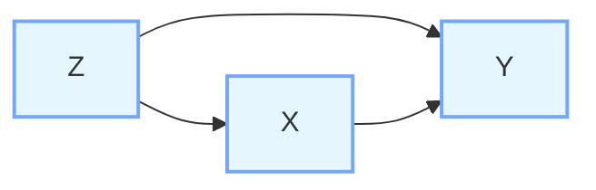

# 基于因果推理的AI模型设计与应用

> 关键词：因果推理、AI模型、设计、应用、因果效应、结构因果模型、反事实推理

> 摘要：本文围绕基于因果推理的AI模型展开，深入探讨其核心概念、算法原理、数学模型等内容。详细介绍因果推理在AI领域的重要性，通过Python代码阐述核心算法原理，结合数学公式进行理论支撑。同时给出项目实战案例，包括开发环境搭建、代码实现与解读。分析其实际应用场景，推荐相关学习资源、开发工具和论文著作。最后总结未来发展趋势与挑战，解答常见问题并提供参考资料，旨在为读者全面呈现基于因果推理的AI模型的设计与应用全貌。

## 1. 背景介绍 
### 1.1 目的和范围
随着人工智能技术的不断发展，传统的基于相关性的AI模型在面对复杂的现实问题时逐渐暴露出局限性。基于因果推理的AI模型旨在从数据中挖掘出因果关系，从而更深入地理解数据背后的机制，做出更具解释性和可信赖的决策。本文的范围涵盖基于因果推理的AI模型的基本概念、算法原理、数学模型、实际应用以及未来发展趋势等方面，旨在为读者提供一个全面而深入的技术指南。

### 1.2 预期读者
本文预期读者包括人工智能领域的研究人员、开发者、学生以及对因果推理和AI模型感兴趣的技术爱好者。对于有一定编程基础和机器学习知识的读者，能够更深入地理解文中的算法原理和代码实现；而对于初学者，通过阅读本文也能对基于因果推理的AI模型有一个系统的认识。

### 1.3 文档结构概述
本文首先介绍基于因果推理的AI模型的背景知识，包括目的、预期读者和文档结构。接着阐述核心概念与联系，通过文本示意图和Mermaid流程图进行直观展示。然后详细讲解核心算法原理，结合Python代码进行说明，并给出数学模型和公式。通过项目实战案例，展示代码的实际应用和解读。分析基于因果推理的AI模型的实际应用场景，推荐相关的学习资源、开发工具和论文著作。最后总结未来发展趋势与挑战，解答常见问题并提供参考资料。

### 1.4 术语表
#### 1.4.1 核心术语定义
- **因果推理**：是一种从数据中推断因果关系的方法，旨在确定一个变量的变化是否会导致另一个变量的变化。
- **结构因果模型（SCM）**：是一种用图结构表示因果关系的数学模型，由一组变量和一组结构方程组成。
- **因果效应**：表示某个原因变量对结果变量的影响程度。
- **反事实推理**：是一种思考在不同条件下可能发生的情况的推理方式，用于评估因果效应。

#### 1.4.2 相关概念解释
- **相关性与因果性**：相关性是指两个变量之间的统计关联，而因果性则强调一个变量的变化是另一个变量变化的原因。例如，冰淇淋销量和溺水事故数量可能存在相关性，但并非因果关系，它们可能都受到气温等共同因素的影响。
- **混淆变量**：是指同时影响原因变量和结果变量的变量，会导致因果关系的误判。例如，在研究吸烟与肺癌的关系时，年龄可能是一个混淆变量，因为年龄既影响吸烟的概率，也影响患肺癌的风险。

#### 1.4.3 缩略词列表
- **SCM**：结构因果模型（Structural Causal Model）
- **ATE**：平均因果效应（Average Treatment Effect）
- **CACE**：依从者平均因果效应（Complier Average Causal Effect）

## 2. 核心概念与联系 

### 因果推理的基本原理
因果推理的核心目标是从数据中识别出因果关系，而不是仅仅依赖于相关性。传统的机器学习模型主要关注数据中的统计模式，而因果推理则试图揭示数据背后的因果机制。

#### 结构因果模型（SCM）
结构因果模型是因果推理中的一个重要概念，它用图结构来表示变量之间的因果关系。一个SCM由以下几个部分组成：
- **变量集合**：表示系统中的所有相关变量。
- **图结构**：用有向无环图（DAG）表示变量之间的因果关系，图中的节点表示变量，边表示因果关系。
- **结构方程**：描述每个变量是如何由其直接原因变量决定的。

例如，考虑一个简单的因果关系：吸烟（$X$）导致肺癌（$Y$），同时年龄（$Z$）是一个混淆变量。其结构因果模型可以用图1表示：


图1：吸烟、肺癌和年龄的结构因果模型

在这个图中，$Z$ 指向 $X$ 和 $Y$ 表示年龄同时影响吸烟和肺癌，$X$ 指向 $Y$ 表示吸烟导致肺癌。

#### 因果效应的估计
因果效应是指某个原因变量对结果变量的影响程度。常见的因果效应度量包括平均因果效应（ATE）和依从者平均因果效应（CACE）等。

为了估计因果效应，通常需要进行随机对照试验（RCT），但在很多情况下，RCT 是不可行的，因此需要使用观察性数据进行因果推理。

### 因果推理与AI模型的联系
传统的AI模型主要基于相关性进行预测，而基于因果推理的AI模型则能够提供更深入的理解和更可靠的决策。因果推理可以帮助AI模型解决以下问题：
- **可解释性**：通过识别因果关系，AI模型的决策过程可以得到更好的解释，提高模型的可信度。
- **泛化能力**：因果关系具有更强的稳定性，基于因果推理的AI模型在不同的数据分布和环境下具有更好的泛化能力。
- **干预分析**：因果推理可以帮助AI模型预测干预措施的效果，从而做出更合理的决策。

## 3. 核心算法原理 & 具体操作步骤 

### 因果图发现算法
因果图发现算法的目标是从观察性数据中推断出变量之间的因果图结构。其中一个经典的算法是PC算法（Peter-Clark算法）。

#### PC算法原理
PC算法的基本思想是通过检验变量之间的条件独立性来逐步确定因果图的结构。具体步骤如下：
1. **初始化**：构建一个完全无向图，图中的节点表示所有变量。
2. **条件独立性检验**：对于图中的每一对节点 $X$ 和 $Y$，检验它们在给定不同的变量集合 $S$ 下是否条件独立。如果条件独立，则删除 $X$ 和 $Y$ 之间的边。
3. **确定边的方向**：根据条件独立性检验的结果，确定边的方向。

#### Python代码实现
```python
import numpy as np
import pandas as pd
from sklearn.preprocessing import StandardScaler
from scipy.stats import chi2_contingency

def pc_algorithm(data, alpha=0.05):
    num_vars = data.shape[1]
    graph = np.ones((num_vars, num_vars)) - np.eye(num_vars)  # 初始化完全无向图
    nodes = list(data.columns)
    l = 0
    while True:
        no_edge_removed = True
        for i in range(num_vars):
            for j in range(i + 1, num_vars):
                if graph[i, j] == 1:
                    neighbors = np.where(graph[i] == 1)[0]
                    neighbors = np.delete(neighbors, np.where(neighbors == j))
                    if len(neighbors) >= l:
                        subsets = get_subsets(neighbors, l)
                        for subset in subsets:
                            if is_conditionally_independent(data, nodes[i], nodes[j], [nodes[k] for k in subset], alpha):
                                graph[i, j] = 0
                                graph[j, i] = 0
                                no_edge_removed = False
                                break
        l += 1
        if no_edge_removed:
            break
    return graph

def get_subsets(arr, k):
    from itertools import combinations
    return list(combinations(arr, k))

def is_conditionally_independent(data, x, y, z, alpha):
    contingency_table = pd.crosstab(data[x], [data[y]] + data[z])
    chi2, p, _, _ = chi2_contingency(contingency_table)
    return p > alpha

# 示例数据
data = pd.DataFrame({
    'X': np.random.randint(0, 2, 100),
    'Y': np.random.randint(0, 2, 100),
    'Z': np.random.randint(0, 2, 100)
})

graph = pc_algorithm(data)
print(graph)
```
### 因果效应估计算法
在确定了因果图结构后，需要估计因果效应。一个常用的方法是逆概率加权（IPW）。

#### 逆概率加权（IPW）原理
逆概率加权的基本思想是通过对每个样本进行加权，使得处理组和对照组在协变量上的分布更加平衡，从而消除混淆变量的影响。具体步骤如下：
1. **估计倾向得分**：倾向得分是指一个样本接受处理的概率，通常使用逻辑回归等方法进行估计。
2. **计算权重**：对于处理组的样本，权重为 $1 /$ 倾向得分；对于对照组的样本，权重为 $1 / (1 -$ 倾向得分$)$。
3. **估计因果效应**：使用加权后的样本计算处理组和对照组的平均结果，两者之差即为平均因果效应（ATE）。

#### Python代码实现
```python
from sklearn.linear_model import LogisticRegression

def ipw_ate(data, treatment, outcome, covariates):
    X = data[covariates]
    T = data[treatment]
    Y = data[outcome]
    
    # 估计倾向得分
    lr = LogisticRegression()
    lr.fit(X, T)
    propensity_scores = lr.predict_proba(X)[:, 1]
    
    # 计算权重
    weights = np.where(T == 1, 1 / propensity_scores, 1 / (1 - propensity_scores))
    
    # 估计因果效应
    treated_outcome = np.sum(weights[T == 1] * Y[T == 1]) / np.sum(weights[T == 1])
    control_outcome = np.sum(weights[T == 0] * Y[T == 0]) / np.sum(weights[T == 0])
    ate = treated_outcome - control_outcome
    return ate

# 示例数据
data = pd.DataFrame({
    'treatment': np.random.randint(0, 2, 100),
    'outcome': np.random.randn(100),
    'covariate1': np.random.randn(100),
    'covariate2': np.random.randn(100)
})

ate = ipw_ate(data, 'treatment', 'outcome', ['covariate1', 'covariate2'])
print(ate)
```

## 4. 数学模型和公式 & 详细讲解 & 举例说明 

### 结构因果模型（SCM）的数学表示
一个结构因果模型（SCM）可以用以下数学公式表示：

$$\mathcal{M} = \langle \mathbf{U}, \mathbf{V}, \mathbf{F}, P(\mathbf{U}) \rangle$$

其中：
- $\mathbf{U}$ 是外生变量集合，这些变量的取值由模型外部因素决定。
- $\mathbf{V}$ 是内生变量集合，这些变量的取值由其他变量决定。
- $\mathbf{F}$ 是一组结构方程，每个方程描述一个内生变量是如何由其直接原因变量决定的。例如，对于内生变量 $V_i \in \mathbf{V}$，其结构方程可以表示为 $V_i = f_i(PA_i, U_i)$，其中 $PA_i$ 是 $V_i$ 的直接原因变量集合，$U_i$ 是与 $V_i$ 相关的外生变量。
- $P(\mathbf{U})$ 是外生变量的概率分布。

### 因果效应的数学定义
#### 平均因果效应（ATE）
平均因果效应（ATE）定义为：

$$ATE = E[Y(1) - Y(0)]$$

其中 $Y(1)$ 表示在处理条件下的潜在结果，$Y(0)$ 表示在对照条件下的潜在结果。$E[\cdot]$ 表示期望。

#### 举例说明
假设我们要研究某种药物（处理变量 $T$）对患者康复（结果变量 $Y$）的影响，同时考虑患者的年龄（协变量 $X$）。我们有以下数据：

| 患者编号 | 年龄 $X$ | 药物使用 $T$ | 康复情况 $Y$ |
|---|---|---|---|
| 1 | 30 | 1 | 1 |
| 2 | 40 | 0 | 0 |
| 3 | 35 | 1 | 1 |
| 4 | 45 | 0 | 0 |

为了估计 ATE，我们可以使用逆概率加权（IPW）方法。首先，我们使用逻辑回归估计倾向得分 $P(T = 1|X)$，然后计算权重 $W$，最后计算处理组和对照组的加权平均结果，两者之差即为 ATE。

### 条件独立性检验的数学原理
条件独立性检验通常使用卡方检验。对于两个变量 $X$ 和 $Y$，在给定变量集合 $Z$ 的条件下，它们的条件独立性可以通过检验以下假设来判断：

$$H_0: P(X, Y|Z) = P(X|Z)P(Y|Z)$$

卡方统计量定义为：

$$\chi^2 = \sum_{i, j, k} \frac{(O_{ijk} - E_{ijk})^2}{E_{ijk}}$$

其中 $O_{ijk}$ 是观测频数，$E_{ijk}$ 是期望频数。如果卡方统计量对应的 $p$ 值大于给定的显著性水平 $\alpha$，则接受原假设，即 $X$ 和 $Y$ 在给定 $Z$ 的条件下独立。

## 5. 项目实战：代码实际案例和详细解释说明 

### 5.1  开发环境搭建
#### 安装Python
首先，确保你已经安装了Python 3.x 版本。可以从Python官方网站（https://www.python.org/downloads/） 下载并安装。

#### 安装必要的库
我们需要安装一些必要的Python库，包括 `pandas`、`numpy`、`scikit-learn` 等。可以使用以下命令进行安装：

```sh
pip install pandas numpy scikit-learn
```

### 5.2  源代码详细实现和代码解读
#### 数据准备
我们使用一个模拟的数据集来演示基于因果推理的AI模型的应用。假设我们要研究某种广告（处理变量）对用户购买行为（结果变量）的影响，同时考虑用户的年龄和性别（协变量）。

```python
import pandas as pd
import numpy as np

# 生成模拟数据
np.random.seed(42)
n_samples = 1000
age = np.random.randint(18, 60, n_samples)
gender = np.random.randint(0, 2, n_samples)
ad_exposure = np.random.randint(0, 2, n_samples)
purchase_prob = 0.1 + 0.01 * age + 0.1 * ad_exposure + 0.05 * gender
purchase = np.random.binomial(1, purchase_prob, n_samples)

data = pd.DataFrame({
    'age': age,
    'gender': gender,
    'ad_exposure': ad_exposure,
    'purchase': purchase
})
```

#### 因果图发现
使用PC算法发现变量之间的因果图结构。

```python
from sklearn.preprocessing import StandardScaler
from scipy.stats import chi2_contingency

def pc_algorithm(data, alpha=0.05):
    num_vars = data.shape[1]
    graph = np.ones((num_vars, num_vars)) - np.eye(num_vars)  # 初始化完全无向图
    nodes = list(data.columns)
    l = 0
    while True:
        no_edge_removed = True
        for i in range(num_vars):
            for j in range(i + 1, num_vars):
                if graph[i, j] == 1:
                    neighbors = np.where(graph[i] == 1)[0]
                    neighbors = np.delete(neighbors, np.where(neighbors == j))
                    if len(neighbors) >= l:
                        subsets = get_subsets(neighbors, l)
                        for subset in subsets:
                            if is_conditionally_independent(data, nodes[i], nodes[j], [nodes[k] for k in subset], alpha):
                                graph[i, j] = 0
                                graph[j, i] = 0
                                no_edge_removed = False
                                break
        l += 1
        if no_edge_removed:
            break
    return graph

def get_subsets(arr, k):
    from itertools import combinations
    return list(combinations(arr, k))

def is_conditionally_independent(data, x, y, z, alpha):
    contingency_table = pd.crosstab(data[x], [data[y]] + data[z])
    chi2, p, _, _ = chi2_contingency(contingency_table)
    return p > alpha

graph = pc_algorithm(data)
print(graph)
```

#### 因果效应估计
使用逆概率加权（IPW）方法估计广告对用户购买行为的平均因果效应（ATE）。

```python
from sklearn.linear_model import LogisticRegression

def ipw_ate(data, treatment, outcome, covariates):
    X = data[covariates]
    T = data[treatment]
    Y = data[outcome]
    
    # 估计倾向得分
    lr = LogisticRegression()
    lr.fit(X, T)
    propensity_scores = lr.predict_proba(X)[:, 1]
    
    # 计算权重
    weights = np.where(T == 1, 1 / propensity_scores, 1 / (1 - propensity_scores))
    
    # 估计因果效应
    treated_outcome = np.sum(weights[T == 1] * Y[T == 1]) / np.sum(weights[T == 1])
    control_outcome = np.sum(weights[T == 0] * Y[T == 0]) / np.sum(weights[T == 0])
    ate = treated_outcome - control_outcome
    return ate

ate = ipw_ate(data, 'ad_exposure', 'purchase', ['age', 'gender'])
print(ate)
```

### 5.3  代码解读与分析
#### 数据准备部分
我们使用 `numpy` 生成了模拟数据，包括用户的年龄、性别、广告曝光情况和购买行为。然后将这些数据存储在 `pandas` 的 `DataFrame` 中。

#### 因果图发现部分
PC算法通过条件独立性检验逐步删除图中的边，最终得到变量之间的因果图结构。`is_conditionally_independent` 函数使用卡方检验来判断两个变量在给定其他变量的条件下是否独立。

#### 因果效应估计部分
逆概率加权（IPW）方法首先使用逻辑回归估计倾向得分，然后计算每个样本的权重，最后使用加权后的样本计算处理组和对照组的平均结果，两者之差即为平均因果效应（ATE）。

## 6. 实际应用场景 

### 医疗领域
在医疗领域，因果推理可以帮助医生更好地理解疾病的病因和治疗效果。例如，通过分析患者的基因数据、临床症状和治疗方案，使用因果推理模型可以确定哪些因素是导致疾病发生的真正原因，以及哪种治疗方案对患者最有效。这有助于医生制定个性化的治疗方案，提高治疗效果。

### 市场营销领域
在市场营销中，因果推理可以帮助企业评估广告投放、促销活动等营销策略的效果。通过分析用户的行为数据，使用因果推理模型可以确定哪些营销活动真正促进了用户的购买行为，以及这些活动的因果效应大小。这有助于企业优化营销策略，提高营销效率。

### 金融领域
在金融领域，因果推理可以用于风险评估和投资决策。例如，通过分析市场数据、公司财务数据等，使用因果推理模型可以确定哪些因素是导致金融风险的真正原因，以及这些因素之间的因果关系。这有助于投资者更好地评估投资风险，做出更明智的投资决策。

### 交通领域
在交通领域，因果推理可以用于交通流量预测和交通管理。例如，通过分析交通传感器数据、天气数据等，使用因果推理模型可以确定哪些因素是导致交通拥堵的真正原因，以及如何采取有效的交通管理措施来缓解拥堵。这有助于提高交通效率，减少交通事故。

## 7. 工具和资源推荐
### 7.1 学习资源推荐
#### 7.1.1 书籍推荐
- 《Causal Inference in Statistics: A Primer》：这本书是因果推理领域的经典入门书籍，介绍了因果推理的基本概念、方法和应用。
- 《Elements of Causal Inference: Foundations and Learning Algorithms》：这本书深入探讨了因果推理的理论基础和学习算法，适合有一定基础的读者。
- 《The Book of Why: The New Science of Cause and Effect》：这本书以通俗易懂的语言介绍了因果推理的历史、理论和应用，适合广大读者阅读。

#### 7.1.2 在线课程
- Coursera上的 “A Crash Course in Causality: Inferring Causal Effects from Observational Data”：这门课程由知名学者授课，介绍了因果推理的基本概念和方法，通过实际案例进行讲解。
- edX上的 “Causal Analysis in Social Science”：这门课程从社会科学的角度介绍了因果推理的应用，适合对社会科学领域的因果分析感兴趣的读者。

#### 7.1.3 技术博客和网站
- Medium上的 “Towards Data Science”：这个博客上有很多关于因果推理和人工智能的技术文章，涵盖了最新的研究成果和应用案例。
- Causal Inference Initiative（https://causalinference.org/）：这个网站是因果推理领域的权威网站，提供了大量的研究资源、论文和工具。

### 7.2 开发工具框架推荐
#### 7.2.1 IDE和编辑器
- PyCharm：是一款专业的Python集成开发环境，提供了丰富的代码编辑、调试和项目管理功能。
- Jupyter Notebook：是一个交互式的开发环境，适合进行数据分析和模型开发，方便展示代码和结果。

#### 7.2.2 调试和性能分析工具
- PDB：是Python自带的调试工具，可以帮助开发者逐步调试代码，查找问题。
- cProfile：是Python的性能分析工具，可以分析代码的运行时间和内存使用情况，帮助开发者优化代码性能。

#### 7.2.3 相关框架和库
- CausalNex：是一个用于因果推理的Python库，提供了因果图发现、因果效应估计等功能。
- DoWhy：是一个开源的因果推理库，支持多种因果推理方法，提供了简单易用的API。

### 7.3 相关论文著作推荐
#### 7.3.1 经典论文
- Judea Pearl的 “Causal diagrams for empirical research”：这篇论文是因果推理领域的经典之作，介绍了因果图的基本概念和应用。
- Donald Rubin的 “Estimating causal effects of treatments in randomized and nonrandomized studies”：这篇论文提出了潜在结果框架，为因果效应估计提供了重要的理论基础。

#### 7.3.2 最新研究成果
- 每年的NeurIPS、ICML等顶级机器学习会议上都有很多关于因果推理的最新研究成果，可以关注这些会议的论文。
- 《Journal of Causal Inference》是因果推理领域的专业期刊，发表了很多高质量的研究论文。

#### 7.3.3 应用案例分析
- 可以关注一些实际应用案例的研究论文，例如医疗、市场营销、金融等领域的因果推理应用案例，学习如何将因果推理方法应用到实际问题中。

## 8. 总结：未来发展趋势与挑战
### 未来发展趋势
- **与深度学习的结合**：将因果推理与深度学习相结合，有望开发出更强大的AI模型，提高模型的可解释性和泛化能力。例如，通过将因果信息融入到神经网络的结构和训练过程中，可以使神经网络更好地理解数据背后的因果机制。
- **多源数据融合**：随着数据的不断增长和多样化，未来的因果推理模型将能够处理多源数据，包括结构化数据、非结构化数据和时空数据等。通过融合不同来源的数据，可以更全面地了解因果关系。
- **实时因果分析**：在一些实时性要求较高的应用场景中，如智能交通、金融交易等，需要实时进行因果分析。未来的因果推理模型将具备实时处理和分析数据的能力，及时做出决策。

### 挑战
- **数据质量和可用性**：因果推理需要高质量的数据，包括准确的变量测量和足够的样本量。然而，在实际应用中，数据往往存在噪声、缺失值等问题，这给因果推理带来了挑战。
- **因果关系的复杂性**：现实世界中的因果关系往往非常复杂，存在多个原因变量和结果变量，以及复杂的交互作用。如何准确地识别和建模这些复杂的因果关系是一个难题。
- **计算复杂度**：一些因果推理算法的计算复杂度较高，特别是在处理大规模数据和复杂的因果图结构时。如何提高算法的效率和可扩展性是未来需要解决的问题。

## 9. 附录：常见问题与解答
### 1. 因果推理与传统机器学习有什么区别？
传统机器学习主要关注数据中的统计模式和相关性，而因果推理则试图揭示数据背后的因果机制。因果推理可以提供更深入的理解和更可靠的决策，例如在评估干预措施的效果时，因果推理能够给出更准确的结果。

### 2. 因果图发现算法一定能得到正确的因果图结构吗？
因果图发现算法通常基于观察性数据进行推断，由于数据的局限性和模型的假设，不一定能得到完全正确的因果图结构。但是，这些算法可以提供有价值的信息，帮助我们了解变量之间的因果关系。

### 3. 逆概率加权（IPW）方法有什么局限性？
逆概率加权（IPW）方法的一个局限性是对倾向得分的估计比较敏感。如果倾向得分估计不准确，可能会导致权重计算不准确，从而影响因果效应的估计结果。此外，IPW方法要求所有的混淆变量都被观测到，如果存在未观测到的混淆变量，可能会导致因果效应的估计偏差。

### 4. 如何选择合适的因果推理方法？
选择合适的因果推理方法需要考虑多个因素，包括数据类型、研究问题、假设条件等。例如，如果数据是随机对照试验数据，可以使用简单的差值估计方法；如果数据是观察性数据，可能需要使用更复杂的方法，如逆概率加权、工具变量法等。此外，还需要根据具体问题的特点选择合适的因果效应度量。

## 10. 扩展阅读 & 参考资料
### 扩展阅读
- 可以进一步阅读关于因果推理的高级主题，如因果发现的理论基础、因果效应的非参数估计方法等。
- 关注因果推理在不同领域的应用案例，了解如何将因果推理方法应用到实际问题中。

### 参考资料
- Pearl, J., Glymour, M., & Jewell, N. P. (2016). Causal Inference in Statistics: A Primer. Wiley.
- Peters, J., Janzing, D., & Schölkopf, B. (2017). Elements of Causal Inference: Foundations and Learning Algorithms. MIT Press.
- Rubin, D. B. (1974). Estimating causal effects of treatments in randomized and nonrandomized studies. Journal of Educational Psychology, 66(5), 688-701.
- CausalNex官方文档（https://causalnex.readthedocs.io/）
- DoWhy官方文档（https://microsoft.github.io/dowhy/）