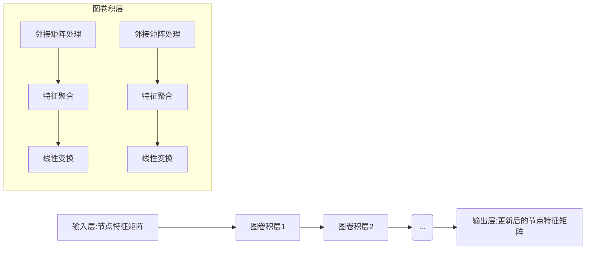

# 基于图卷积的动态社交网络影响力推理分析

> 关键词：图卷积、动态社交网络、影响力推理、图神经网络、社交网络分析

> 摘要：本文聚焦于基于图卷积的动态社交网络影响力推理分析。首先介绍了研究背景、目的及相关术语，接着深入阐述了图卷积、动态社交网络等核心概念及其联系，详细讲解了核心算法原理并给出 Python 实现步骤。同时，介绍了相关数学模型和公式，通过项目实战展示代码实现与解读。分析了实际应用场景，推荐了学习、开发相关的工具和资源。最后对未来发展趋势与挑战进行总结，并给出常见问题解答和扩展阅读参考资料，旨在为相关领域的研究和实践提供全面且深入的指导。

## 1. 背景介绍 
### 1.1 目的和范围
在当今数字化时代，社交网络已成为人们生活中不可或缺的一部分。动态社交网络蕴含着大量的用户行为信息和社交关系，分析其中的影响力传播机制具有重要的理论和实际意义。本研究的目的在于利用图卷积技术，对动态社交网络中的影响力进行推理和分析，以揭示信息传播的规律、识别关键影响节点等。范围涵盖了从图卷积理论基础到实际应用场景的各个方面，包括算法实现、数学模型构建以及项目实战等。

### 1.2 预期读者
本文预期读者包括对图神经网络、社交网络分析、数据挖掘等领域感兴趣的科研人员、学生，以及从事相关软件开发和数据分析的专业人士。对于希望深入了解图卷积在动态社交网络中应用的技术爱好者也具有一定的参考价值。

### 1.3 文档结构概述
本文首先介绍研究背景和相关术语，为后续内容奠定基础。接着阐述核心概念及联系，包括图卷积和动态社交网络的原理与架构。然后详细讲解核心算法原理和具体操作步骤，给出 Python 代码实现。再介绍相关数学模型和公式，并举例说明。通过项目实战展示代码的实际应用和解读。分析实际应用场景，推荐学习和开发相关的工具和资源。最后总结未来发展趋势与挑战，给出常见问题解答和扩展阅读参考资料。

### 1.4 术语表
#### 1.4.1 核心术语定义
- **图卷积**：是一种在图结构数据上进行卷积操作的技术，通过聚合节点及其邻居节点的信息来更新节点的特征表示。
- **动态社交网络**：社交网络的结构和节点属性随时间动态变化的网络，反映了用户之间社交关系和行为的实时性和动态性。
- **影响力推理**：通过对社交网络中节点和边的信息进行分析，推断出某个节点或事件对其他节点的影响程度和范围。
- **图神经网络（GNN）**：一类专门处理图结构数据的神经网络，图卷积网络是其重要的一种。

#### 1.4.2 相关概念解释
- **节点**：在社交网络中表示用户、组织或其他实体。
- **边**：表示节点之间的关系，如朋友关系、关注关系等。
- **特征表示**：用向量来描述节点或边的属性，例如用户的年龄、性别、兴趣爱好等。

#### 1.4.3 缩略词列表
- **GCN**：Graph Convolutional Network（图卷积网络）
- **GNN**：Graph Neural Network（图神经网络）
- **SNA**：Social Network Analysis（社交网络分析）

## 2. 核心概念与联系 

### 2.1 图卷积的原理和架构
图卷积的核心思想是通过聚合节点及其邻居节点的特征信息来更新节点的特征表示。其基本原理可以描述为：对于图中的每个节点，将其邻居节点的特征进行加权求和，并与该节点自身的特征进行组合，从而得到更新后的节点特征。

图卷积网络（GCN）的架构通常由多个图卷积层组成，每个图卷积层包含以下步骤：
1. **邻接矩阵的处理**：将图的邻接矩阵进行归一化处理，以确保信息在传播过程中的稳定性。
2. **特征聚合**：根据归一化后的邻接矩阵，对节点的邻居节点特征进行加权求和。
3. **线性变换**：将聚合后的特征通过一个线性变换，得到更新后的节点特征。

以下是图卷积网络架构的文本示意图：

输入层（节点特征矩阵） -> 图卷积层 1（邻接矩阵处理、特征聚合、线性变换） -> 图卷积层 2（邻接矩阵处理、特征聚合、线性变换） -> ... -> 输出层（更新后的节点特征矩阵）

以下是对应的 Mermaid 流程图：


### 2.2 动态社交网络的特点和表示
动态社交网络具有以下特点：
- **时间动态性**：网络的结构和节点属性随时间不断变化，例如新用户的加入、用户之间关系的建立或删除等。
- **复杂性**：节点之间的关系复杂多样，可能存在多种类型的边，如朋友关系、业务合作关系等。
- **不确定性**：由于用户行为的不确定性，信息在网络中的传播路径和影响力范围难以准确预测。

动态社交网络可以用多种方式表示，常见的有：
- **时间序列图**：将不同时间点的图依次排列，每个图表示该时间点的社交网络状态。
- **动态图模型**：通过定义图的演化规则，描述社交网络随时间的变化过程。

### 2.3 图卷积与动态社交网络的联系
图卷积技术可以很好地应用于动态社交网络的影响力推理分析中。由于动态社交网络具有图结构，图卷积可以有效地捕捉节点之间的局部和全局信息，从而更好地理解信息在网络中的传播机制。通过在不同时间点对图进行卷积操作，可以跟踪社交网络的动态变化，推断出影响力的传播路径和范围。

具体来说，图卷积可以帮助我们：
- **节点特征更新**：根据节点的邻居信息和网络结构的变化，实时更新节点的特征表示，反映节点在不同时间点的状态。
- **影响力传播建模**：通过聚合邻居节点的信息，模拟影响力在社交网络中的传播过程，预测信息的扩散范围和速度。

## 3. 核心算法原理 & 具体操作步骤 

### 3.1 图卷积算法原理
图卷积的核心公式可以表示为：

$$H^{(l+1)} = \sigma(\tilde{D}^{-\frac{1}{2}}\tilde{A}\tilde{D}^{-\frac{1}{2}}H^{(l)}W^{(l)})$$

其中：
- $H^{(l)}$ 是第 $l$ 层的节点特征矩阵，形状为 $N \times F^{(l)}$，$N$ 是节点数量，$F^{(l)}$ 是第 $l$ 层的特征维度。
- $\tilde{A} = A + I$，$A$ 是图的邻接矩阵，$I$ 是单位矩阵。
- $\tilde{D}$ 是 $\tilde{A}$ 的度矩阵，即 $\tilde{D}_{ii} = \sum_{j}\tilde{A}_{ij}$。
- $W^{(l)}$ 是第 $l$ 层的可学习权重矩阵，形状为 $F^{(l)} \times F^{(l+1)}$。
- $\sigma$ 是激活函数，如 ReLU 函数。

### 3.2 具体操作步骤及 Python 代码实现
以下是一个简单的图卷积层的 Python 实现，使用 PyTorch 框架：

```python
import torch
import torch.nn as nn
import torch.nn.functional as F

class GraphConvolution(nn.Module):
    def __init__(self, in_features, out_features, bias=True):
        super(GraphConvolution, self).__init__()
        self.in_features = in_features
        self.out_features = out_features
        self.weight = nn.Parameter(torch.FloatTensor(in_features, out_features))
        if bias:
            self.bias = nn.Parameter(torch.FloatTensor(out_features))
        else:
            self.register_parameter('bias', None)
        self.reset_parameters()

    def reset_parameters(self):
        nn.init.xavier_uniform_(self.weight)
        if self.bias is not None:
            nn.init.zeros_(self.bias)

    def forward(self, input, adj):
        support = torch.mm(input, self.weight)
        output = torch.spmm(adj, support)
        if self.bias is not None:
            return output + self.bias
        else:
            return output
```

### 3.3 基于图卷积的动态社交网络影响力推理算法步骤
1. **数据预处理**：将动态社交网络数据转换为图结构数据，包括节点特征矩阵和邻接矩阵的构建。
2. **模型构建**：使用图卷积层构建影响力推理模型，例如可以构建一个多层的图卷积网络。
3. **训练模型**：使用历史数据对模型进行训练，优化模型的参数。
4. **影响力推理**：在新的时间点，使用训练好的模型对社交网络中的影响力进行推理和分析。

以下是一个简单的基于图卷积的影响力推理模型的 Python 实现：

```python
class GCNInfluenceModel(nn.Module):
    def __init__(self, nfeat, nhid, nclass, dropout):
        super(GCNInfluenceModel, self).__init__()
        self.gc1 = GraphConvolution(nfeat, nhid)
        self.gc2 = GraphConvolution(nhid, nclass)
        self.dropout = dropout

    def forward(self, x, adj):
        x = F.relu(self.gc1(x, adj))
        x = F.dropout(x, self.dropout, training=self.training)
        x = self.gc2(x, adj)
        return F.log_softmax(x, dim=1)
```

## 4. 数学模型和公式 & 详细讲解 & 举例说明 

### 4.1 图卷积的数学模型和公式
如前面所述，图卷积的核心公式为：

$$H^{(l+1)} = \sigma(\tilde{D}^{-\frac{1}{2}}\tilde{A}\tilde{D}^{-\frac{1}{2}}H^{(l)}W^{(l)})$$

#### 详细讲解
- **邻接矩阵的处理**：$\tilde{A} = A + I$ 的目的是将节点自身的信息也考虑到特征聚合中。$\tilde{D}^{-\frac{1}{2}}\tilde{A}\tilde{D}^{-\frac{1}{2}}$ 是对邻接矩阵进行归一化处理，使得信息在传播过程中不会因为节点的度不同而产生过大的差异。
- **特征聚合**：$\tilde{D}^{-\frac{1}{2}}\tilde{A}\tilde{D}^{-\frac{1}{2}}H^{(l)}$ 表示对节点的邻居节点特征进行加权求和，其中权重由邻接矩阵和度矩阵决定。
- **线性变换**：$H^{(l)}W^{(l)}$ 是将聚合后的特征通过一个线性变换，得到更新后的节点特征。
- **激活函数**：$\sigma$ 函数引入了非线性因素，增加了模型的表达能力。

### 4.2 影响力推理的数学模型
影响力推理的目标是预测某个节点或事件对其他节点的影响程度。一种常见的方法是通过计算节点之间的影响力得分。假设 $y_{ij}$ 表示节点 $i$ 对节点 $j$ 的影响力得分，可以定义为：

$$y_{ij} = f(H_i, H_j, A_{ij})$$

其中 $H_i$ 和 $H_j$ 分别是节点 $i$ 和节点 $j$ 的特征向量，$A_{ij}$ 是邻接矩阵中 $(i, j)$ 位置的元素。$f$ 是一个函数，可以根据具体的需求进行定义，例如可以是一个神经网络模型。

### 4.3 举例说明
假设我们有一个简单的社交网络，包含 3 个节点，节点特征矩阵 $H^{(0)}$ 为：

$$H^{(0)} = \begin{bmatrix}
1 & 2 \\
3 & 4 \\
5 & 6
\end{bmatrix}$$

邻接矩阵 $A$ 为：

$$A = \begin{bmatrix}
0 & 1 & 1 \\
1 & 0 & 1 \\
1 & 1 & 0
\end{bmatrix}$$

则 $\tilde{A} = A + I$ 为：

$$\tilde{A} = \begin{bmatrix}
1 & 1 & 1 \\
1 & 1 & 1 \\
1 & 1 & 1
\end{bmatrix}$$

$\tilde{D}$ 为：

$$\tilde{D} = \begin{bmatrix}
3 & 0 & 0 \\
0 & 3 & 0 \\
0 & 0 & 3
\end{bmatrix}$$

$\tilde{D}^{-\frac{1}{2}}$ 为：

$$\tilde{D}^{-\frac{1}{2}} = \begin{bmatrix}
\frac{1}{\sqrt{3}} & 0 & 0 \\
0 & \frac{1}{\sqrt{3}} & 0 \\
0 & 0 & \frac{1}{\sqrt{3}}
\end{bmatrix}$$

假设 $W^{(0)}$ 为：

$$W^{(0)} = \begin{bmatrix}
1 & 0 \\
0 & 1
\end{bmatrix}$$

则 $H^{(1)}$ 可以计算如下：

1. 计算 $\tilde{D}^{-\frac{1}{2}}\tilde{A}\tilde{D}^{-\frac{1}{2}}$：

$$\tilde{D}^{-\frac{1}{2}}\tilde{A}\tilde{D}^{-\frac{1}{2}} = \begin{bmatrix}
\frac{1}{3} & \frac{1}{3} & \frac{1}{3} \\
\frac{1}{3} & \frac{1}{3} & \frac{1}{3} \\
\frac{1}{3} & \frac{1}{3} & \frac{1}{3}
\end{bmatrix}$$

2. 计算 $\tilde{D}^{-\frac{1}{2}}\tilde{A}\tilde{D}^{-\frac{1}{2}}H^{(0)}$：

$$\tilde{D}^{-\frac{1}{2}}\tilde{A}\tilde{D}^{-\frac{1}{2}}H^{(0)} = \begin{bmatrix}
3 & 4 \\
3 & 4 \\
3 & 4
\end{bmatrix}$$

3. 计算 $\tilde{D}^{-\frac{1}{2}}\tilde{A}\tilde{D}^{-\frac{1}{2}}H^{(0)}W^{(0)}$：

$$\tilde{D}^{-\frac{1}{2}}\tilde{A}\tilde{D}^{-\frac{1}{2}}H^{(0)}W^{(0)} = \begin{bmatrix}
3 & 4 \\
3 & 4 \\
3 & 4
\end{bmatrix}$$

4. 假设 $\sigma$ 为 ReLU 函数，则 $H^{(1)}$ 为：

$$H^{(1)} = \begin{bmatrix}
3 & 4 \\
3 & 4 \\
3 & 4
\end{bmatrix}$$

## 5. 项目实战：代码实际案例和详细解释说明 

### 5.1  开发环境搭建
#### 硬件环境
- **CPU**：Intel Core i7 及以上
- **GPU**：NVIDIA GeForce GTX 1080 及以上（可选，用于加速训练过程）
- **内存**：16GB 及以上

#### 软件环境
- **操作系统**：Ubuntu 18.04 或 Windows 10
- **Python**：3.7 及以上
- **深度学习框架**：PyTorch 1.7 及以上

#### 安装依赖库
可以使用以下命令安装所需的依赖库：

```bash
pip install torch torchvision numpy scikit-learn networkx
```

### 5.2  源代码详细实现和代码解读
以下是一个完整的基于图卷积的动态社交网络影响力推理项目的代码实现：

```python
import torch
import torch.nn as nn
import torch.nn.functional as F
import numpy as np
import networkx as nx
from sklearn.model_selection import train_test_split

# 定义图卷积层
class GraphConvolution(nn.Module):
    def __init__(self, in_features, out_features, bias=True):
        super(GraphConvolution, self).__init__()
        self.in_features = in_features
        self.out_features = out_features
        self.weight = nn.Parameter(torch.FloatTensor(in_features, out_features))
        if bias:
            self.bias = nn.Parameter(torch.FloatTensor(out_features))
        else:
            self.register_parameter('bias', None)
        self.reset_parameters()

    def reset_parameters(self):
        nn.init.xavier_uniform_(self.weight)
        if self.bias is not None:
            nn.init.zeros_(self.bias)

    def forward(self, input, adj):
        support = torch.mm(input, self.weight)
        output = torch.spmm(adj, support)
        if self.bias is not None:
            return output + self.bias
        else:
            return output

# 定义基于图卷积的影响力推理模型
class GCNInfluenceModel(nn.Module):
    def __init__(self, nfeat, nhid, nclass, dropout):
        super(GCNInfluenceModel, self).__init__()
        self.gc1 = GraphConvolution(nfeat, nhid)
        self.gc2 = GraphConvolution(nhid, nclass)
        self.dropout = dropout

    def forward(self, x, adj):
        x = F.relu(self.gc1(x, adj))
        x = F.dropout(x, self.dropout, training=self.training)
        x = self.gc2(x, adj)
        return F.log_softmax(x, dim=1)

# 生成示例数据
def generate_data():
    G = nx.karate_club_graph()
    adj = nx.adjacency_matrix(G).todense()
    features = np.eye(G.number_of_nodes())
    labels = np.array([G.nodes[i]['club'] == 'Officer' for i in G.nodes()]).astype(int)
    return torch.FloatTensor(features), torch.FloatTensor(adj), torch.LongTensor(labels)

# 训练模型
def train_model(model, features, adj, labels, epochs=200, lr=0.01, weight_decay=5e-4):
    optimizer = torch.optim.Adam(model.parameters(), lr=lr, weight_decay=weight_decay)
    for epoch in range(epochs):
        model.train()
        optimizer.zero_grad()
        output = model(features, adj)
        loss = F.nll_loss(output, labels)
        loss.backward()
        optimizer.step()
        if epoch % 10 == 0:
            print(f'Epoch {epoch}: Loss = {loss.item()}')

# 主函数
if __name__ == '__main__':
    features, adj, labels = generate_data()
    nfeat = features.shape[1]
    nhid = 16
    nclass = 2
    dropout = 0.5
    model = GCNInfluenceModel(nfeat, nhid, nclass, dropout)
    train_model(model, features, adj, labels)
```

### 5.3  代码解读与分析
#### 图卷积层的实现
`GraphConvolution` 类实现了图卷积层的核心功能。在 `__init__` 方法中，定义了可学习的权重矩阵 `weight` 和偏置 `bias`，并使用 Xavier 初始化方法对权重进行初始化。在 `forward` 方法中，首先计算输入特征与权重矩阵的乘积，然后根据邻接矩阵进行特征聚合，最后加上偏置（如果有）。

#### 影响力推理模型的实现
`GCNInfluenceModel` 类构建了一个基于图卷积的影响力推理模型，包含两个图卷积层和一个 Dropout 层。在 `forward` 方法中，通过 ReLU 激活函数增加模型的非线性，最后使用 `log_softmax` 函数输出预测结果。

#### 数据生成
`generate_data` 函数使用 NetworkX 库生成一个示例社交网络（Zachary 空手道俱乐部网络），并构建节点特征矩阵、邻接矩阵和标签。

#### 模型训练
`train_model` 函数使用 Adam 优化器对模型进行训练，通过最小化负对数似然损失函数来更新模型的参数。

## 6. 实际应用场景 
### 6.1 市场营销
在市场营销中，了解社交网络中具有影响力的用户可以帮助企业更好地进行广告投放和产品推广。通过基于图卷积的影响力推理分析，可以识别出那些能够在社交网络中广泛传播信息的关键节点，企业可以与这些节点合作，进行口碑营销，提高产品的知名度和销售量。

### 6.2 舆情监测
在舆情监测方面，动态社交网络中的信息传播速度非常快。利用图卷积技术可以实时跟踪信息的传播路径和影响力范围，及时发现潜在的舆情热点和危机事件。相关部门可以根据分析结果采取相应的措施，引导舆论方向，避免不良影响的扩散。

### 6.3 推荐系统
在推荐系统中，用户之间的社交关系可以提供有价值的信息。通过分析动态社交网络中的影响力，可以更好地理解用户的兴趣和偏好，为用户提供更个性化的推荐。例如，根据用户的社交好友的行为和评价，为用户推荐相关的商品、电影或音乐等。

### 6.4 疾病传播预测
在公共卫生领域，社交网络可以反映人与人之间的接触关系。基于图卷积的影响力推理分析可以模拟疾病在人群中的传播过程，预测疾病的传播趋势和范围。这有助于卫生部门提前采取防控措施，如隔离、疫苗接种等，减少疾病的传播风险。

## 7. 工具和资源推荐
### 7.1 学习资源推荐
#### 7.1.1 书籍推荐
- 《深度学习》（Deep Learning）：由 Ian Goodfellow、Yoshua Bengio 和 Aaron Courville 编写，是深度学习领域的经典教材，涵盖了神经网络、图神经网络等方面的基础知识。
- 《图神经网络》（Graph Neural Networks）：详细介绍了图神经网络的原理、算法和应用，对于深入理解图卷积技术有很大的帮助。

#### 7.1.2 在线课程
- Coursera 上的“深度学习专项课程”（Deep Learning Specialization）：由 Andrew Ng 教授授课，提供了深度学习的系统学习资源，包括图神经网络的相关内容。
- edX 上的“图神经网络：基础与应用”（Graph Neural Networks: Foundations and Applications）：专门介绍图神经网络的原理和应用，适合有一定基础的学习者。

#### 7.1.3 技术博客和网站
- Medium 上的“Towards Data Science”：有许多关于图神经网络、社交网络分析等领域的技术文章和案例分享。
- arXiv.org：可以获取最新的图神经网络和社交网络分析的研究论文。

### 7.2 开发工具框架推荐
#### 7.2.1 IDE和编辑器
- PyCharm：是一款功能强大的 Python 集成开发环境，提供了代码编辑、调试、版本控制等功能，适合开发基于 Python 的图神经网络项目。
- Jupyter Notebook：交互式的开发环境，方便进行代码的编写、调试和可视化展示，对于快速验证和实验图卷积算法非常有用。

#### 7.2.2 调试和性能分析工具
- TensorBoard：是 TensorFlow 提供的可视化工具，也可以与 PyTorch 结合使用，用于可视化模型的训练过程、损失函数变化等，帮助调试和优化模型。
- PyTorch Profiler：可以对 PyTorch 模型的性能进行分析，找出性能瓶颈，优化代码的运行效率。

#### 7.2.3 相关框架和库
- PyTorch Geometric：是一个基于 PyTorch 的图神经网络库，提供了丰富的图卷积层和数据集，方便快速实现和训练图神经网络模型。
- NetworkX：是一个用于创建、操作和研究复杂网络的 Python 库，可以方便地构建和分析社交网络的图结构。

### 7.3 相关论文著作推荐
#### 7.3.1 经典论文
- “Semi-Supervised Classification with Graph Convolutional Networks”：介绍了图卷积网络的基本原理和算法，是图神经网络领域的经典论文。
- “DeepWalk: Online Learning of Social Representations”：提出了一种基于随机游走的图嵌入方法，为图结构数据的表示学习提供了新的思路。

#### 7.3.2 最新研究成果
可以关注 NeurIPS、ICML、KDD 等顶级学术会议上关于图神经网络和社交网络分析的最新研究成果，了解该领域的前沿动态。

#### 7.3.3 应用案例分析
一些知名企业和研究机构会发布关于图卷积在社交网络、市场营销等领域的应用案例分析，例如 Google、Facebook 等公司的技术博客，可以从中学习到实际应用中的经验和技巧。

## 8. 总结：未来发展趋势与挑战
### 8.1 未来发展趋势
- **多模态融合**：将图卷积技术与其他模态的数据（如图像、文本、音频等）进行融合，以更全面地理解动态社交网络中的信息和影响力传播机制。例如，结合用户的社交关系图和用户发布的文本内容，进行更准确的影响力推理。
- **强化学习与图卷积的结合**：利用强化学习的方法来优化图卷积模型，使其能够在动态环境中自适应地调整行为，更好地应对社交网络的动态变化。
- **大规模分布式计算**：随着社交网络数据量的不断增加，需要开发更高效的大规模分布式计算方法，以提高图卷积模型的训练和推理效率。

### 8.2 挑战
- **数据隐私和安全**：社交网络数据包含大量用户的个人信息，在进行影响力推理分析时，需要确保数据的隐私和安全，避免用户信息的泄露。
- **动态性处理**：动态社交网络的结构和节点属性随时间不断变化，如何有效地处理这种动态性，准确地捕捉信息的传播过程，是一个亟待解决的问题。
- **可解释性**：图卷积模型通常是黑盒模型，其决策过程难以解释。在一些关键应用场景中，如医疗、金融等，需要提高模型的可解释性，以便更好地理解和信任模型的输出结果。

## 9. 附录：常见问题与解答
### 9.1 图卷积与传统卷积有什么区别？
传统卷积主要应用于规则的网格结构数据（如图像、音频等），而图卷积应用于不规则的图结构数据。图卷积需要考虑节点之间的连接关系，通过聚合邻居节点的信息来更新节点的特征表示，而传统卷积是通过固定的卷积核在网格上滑动来提取特征。

### 9.2 如何处理动态社交网络中的缺失数据？
可以采用以下方法处理缺失数据：
- **数据插补**：使用均值、中位数等统计方法对缺失值进行插补。
- **基于模型的方法**：使用机器学习模型（如自编码器）来预测缺失值。
- **忽略缺失数据**：在某些情况下，如果缺失数据的比例较小，可以直接忽略这些数据。

### 9.3 如何评估基于图卷积的影响力推理模型的性能？
可以使用以下指标来评估模型的性能：
- **准确率**：预测正确的样本数占总样本数的比例。
- **召回率**：实际为正样本且被预测为正样本的比例。
- **F1 值**：准确率和召回率的调和平均数，综合考虑了模型的准确性和召回能力。
- **AUC-ROC**：ROC 曲线下的面积，用于评估模型的分类性能。

## 10. 扩展阅读 & 参考资料
- Goodfellow, I., Bengio, Y., & Courville, A. (2016). Deep Learning. MIT Press.
- Kipf, T. N., & Welling, M. (2016). Semi-Supervised Classification with Graph Convolutional Networks. arXiv preprint arXiv:1609.02907.
- Perozzi, B., Al-Rfou, R., & Skiena, S. (2014). DeepWalk: Online Learning of Social Representations. In Proceedings of the 20th ACM SIGKDD international conference on Knowledge discovery and data mining (pp. 701-710).
- PyTorch 官方文档：https://pytorch.org/docs/stable/index.html
- NetworkX 官方文档：https://networkx.org/documentation/stable/
- PyTorch Geometric 官方文档：https://pytorch-geometric.readthedocs.io/en/latest/