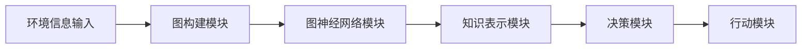

# 基于图神经网络的AI Agent知识表示

> 关键词：图神经网络、AI Agent、知识表示、深度学习、智能决策

> 摘要：本文聚焦于基于图神经网络的AI Agent知识表示这一前沿领域。首先介绍了该研究的背景，包括目的、预期读者、文档结构和相关术语。接着阐述了核心概念，通过文本示意图和Mermaid流程图展示了图神经网络与AI Agent知识表示的联系。详细讲解了核心算法原理，并给出Python源代码示例。深入探讨了数学模型和公式，辅以具体例子说明。通过项目实战，从开发环境搭建到源代码实现及解读进行了全面剖析。分析了该技术的实际应用场景，推荐了学习资源、开发工具框架和相关论文著作。最后总结了未来发展趋势与挑战，并提供常见问题解答和扩展阅读参考资料，旨在为读者全面深入理解基于图神经网络的AI Agent知识表示提供系统的指导。

## 1. 背景介绍 
### 1.1 目的和范围
在人工智能领域，AI Agent需要高效地表示和利用知识，以做出合理的决策和行动。传统的知识表示方法在处理复杂的关系和结构时存在一定的局限性。图神经网络（Graph Neural Networks, GNN）因其能够有效处理图结构数据的能力，为AI Agent的知识表示提供了新的思路和方法。本文的目的是深入探讨基于图神经网络的AI Agent知识表示，包括其核心概念、算法原理、数学模型、实际应用等方面。范围涵盖从理论基础到实际项目应用，旨在为相关研究人员和开发者提供全面的参考。

### 1.2 预期读者
本文预期读者包括人工智能领域的研究人员、研究生、软件开发者以及对图神经网络和AI Agent知识表示感兴趣的技术爱好者。对于有一定机器学习和深度学习基础的读者，能够更深入地理解本文的内容；而对于初学者，通过本文也可以对该领域有一个初步的认识和了解。

### 1.3 文档结构概述
本文将按照以下结构进行组织：首先介绍核心概念与联系，包括图神经网络和AI Agent知识表示的基本原理和它们之间的关系；接着详细讲解核心算法原理和具体操作步骤，并给出Python源代码示例；然后介绍数学模型和公式，并进行详细讲解和举例说明；通过项目实战，展示如何在实际中应用基于图神经网络的AI Agent知识表示；分析该技术的实际应用场景；推荐相关的学习资源、开发工具框架和论文著作；最后总结未来发展趋势与挑战，提供常见问题解答和扩展阅读参考资料。

### 1.4 术语表
#### 1.4.1 核心术语定义
- **图神经网络（Graph Neural Networks, GNN）**：是一类专门用于处理图结构数据的神经网络，它能够在图的节点和边上进行信息传播和聚合，从而学习到图的结构和节点的特征表示。
- **AI Agent**：是指能够感知环境、做出决策并采取行动的智能体，它可以是虚拟的软件实体，也可以是物理的机器人等。
- **知识表示**：是指将知识以某种形式进行编码和存储，以便AI Agent能够有效地利用这些知识进行推理和决策。

#### 1.4.2 相关概念解释
- **图结构数据**：由节点（Vertex）和边（Edge）组成的数据结构，节点表示实体，边表示实体之间的关系。例如，社交网络可以看作是一个图结构数据，用户是节点，用户之间的好友关系是边。
- **信息传播和聚合**：在图神经网络中，节点通过与相邻节点进行信息交换和聚合，更新自己的特征表示。这种信息传播和聚合的过程可以让节点学习到图的全局结构和局部信息。

#### 1.4.3 缩略词列表
- **GNN**：Graph Neural Networks（图神经网络）
- **AI**：Artificial Intelligence（人工智能）

## 2. 核心概念与联系 
### 核心概念原理
#### 图神经网络原理
图神经网络的核心思想是通过节点之间的信息传播和聚合来学习节点的特征表示。以简单的图卷积网络（Graph Convolutional Network, GCN）为例，它的每一层都可以看作是对节点特征的一次线性变换和聚合。假设图 $G=(V, E)$ 有 $N$ 个节点，节点特征矩阵为 $X \in \mathbb{R}^{N \times F}$，其中 $F$ 是节点特征的维度。邻接矩阵为 $A \in \mathbb{R}^{N \times N}$，表示节点之间的连接关系。GCN的一层传播可以表示为：

$$H^{(l+1)} = \sigma(\tilde{D}^{-\frac{1}{2}}\tilde{A}\tilde{D}^{-\frac{1}{2}}H^{(l)}W^{(l)})$$

其中，$\tilde{A} = A + I$ 是添加了自环的邻接矩阵，$I$ 是单位矩阵；$\tilde{D}$ 是 $\tilde{A}$ 的度矩阵；$H^{(l)}$ 是第 $l$ 层的节点特征矩阵，$H^{(0)} = X$；$W^{(l)}$ 是第 $l$ 层的可学习权重矩阵；$\sigma$ 是激活函数，如ReLU函数。

#### AI Agent知识表示原理
AI Agent的知识表示旨在将环境中的信息和规则以一种合适的方式编码，以便Agent能够利用这些知识进行决策和行动。传统的知识表示方法包括逻辑表示、语义网络等，但这些方法在处理复杂的关系和不确定性时存在一定的局限性。基于图神经网络的知识表示方法将知识表示为图结构，节点表示实体，边表示实体之间的关系，通过图神经网络学习图的结构和节点的特征表示，从而为AI Agent提供更丰富和有效的知识表示。

### 架构的文本示意图
以下是基于图神经网络的AI Agent知识表示的架构示意图：

```plaintext
环境信息输入
|
V
图构建模块（将环境信息转化为图结构）
|
V
图神经网络模块（学习图的结构和节点特征）
|
V
知识表示模块（生成AI Agent的知识表示）
|
V
决策模块（根据知识表示做出决策）
|
V
行动模块（执行决策行动）
```

### Mermaid流程图


## 3. 核心算法原理 & 具体操作步骤 
### 核心算法原理
这里以图卷积网络（GCN）为例，详细介绍基于图神经网络的AI Agent知识表示的核心算法原理。

GCN的主要目标是学习图中节点的特征表示，通过多层的信息传播和聚合，使得节点能够捕获图的全局结构和局部信息。在每一层中，节点会从其相邻节点接收信息，并结合自身的特征进行更新。

具体来说，GCN的一层传播过程可以分为以下几个步骤：
1. **邻接矩阵处理**：将原始的邻接矩阵 $A$ 添加自环，得到 $\tilde{A} = A + I$，然后计算 $\tilde{D}^{-\frac{1}{2}}\tilde{A}\tilde{D}^{-\frac{1}{2}}$，其中 $\tilde{D}$ 是 $\tilde{A}$ 的度矩阵。这个操作的目的是对邻接矩阵进行归一化，使得不同度的节点在信息传播过程中具有相同的权重。
2. **线性变换**：将当前层的节点特征矩阵 $H^{(l)}$ 与可学习权重矩阵 $W^{(l)}$ 相乘，得到 $H^{(l)}W^{(l)}$。
3. **信息聚合**：将归一化后的邻接矩阵 $\tilde{D}^{-\frac{1}{2}}\tilde{A}\tilde{D}^{-\frac{1}{2}}$ 与 $H^{(l)}W^{(l)}$ 相乘，得到聚合后的节点特征。
4. **激活函数**：对聚合后的节点特征应用激活函数 $\sigma$，得到下一层的节点特征矩阵 $H^{(l+1)}$。

### 具体操作步骤
以下是使用Python和PyTorch实现一个简单的两层GCN的具体操作步骤和代码示例：

```python
import torch
import torch.nn as nn
import torch.nn.functional as F

# 定义GCN层
class GCNLayer(nn.Module):
    def __init__(self, in_features, out_features):
        super(GCNLayer, self).__init__()
        self.weight = nn.Parameter(torch.FloatTensor(in_features, out_features))
        nn.init.xavier_uniform_(self.weight)

    def forward(self, adj, x):
        # 邻接矩阵处理
        adj_hat = adj + torch.eye(adj.size(0))
        d_hat = torch.diag(torch.pow(adj_hat.sum(dim=1), -0.5))
        adj_norm = torch.mm(torch.mm(d_hat, adj_hat), d_hat)

        # 线性变换
        support = torch.mm(x, self.weight)

        # 信息聚合
        output = torch.mm(adj_norm, support)

        return output

# 定义两层GCN模型
class TwoLayerGCN(nn.Module):
    def __init__(self, in_features, hidden_features, out_features):
        super(TwoLayerGCN, self).__init__()
        self.gcn1 = GCNLayer(in_features, hidden_features)
        self.gcn2 = GCNLayer(hidden_features, out_features)

    def forward(self, adj, x):
        x = F.relu(self.gcn1(adj, x))
        x = self.gcn2(adj, x)
        return x

# 示例使用
# 假设图有5个节点，每个节点的特征维度为10
num_nodes = 5
in_features = 10
hidden_features = 20
out_features = 15

# 随机生成邻接矩阵和节点特征矩阵
adj = torch.randn(num_nodes, num_nodes)
adj = (adj > 0).float()  # 二值化邻接矩阵
x = torch.randn(num_nodes, in_features)

# 初始化模型
model = TwoLayerGCN(in_features, hidden_features, out_features)

# 前向传播
output = model(adj, x)
print("Output shape:", output.shape)
```

### 代码解释
1. **GCNLayer类**：定义了一个GCN层，包含一个可学习的权重矩阵 `self.weight`。在 `forward` 方法中，实现了邻接矩阵的归一化、线性变换和信息聚合的过程。
2. **TwoLayerGCN类**：定义了一个两层的GCN模型，包含两个GCN层。在 `forward` 方法中，第一层GCN层后应用ReLU激活函数，第二层GCN层不应用激活函数。
3. **示例使用**：随机生成邻接矩阵和节点特征矩阵，初始化模型并进行前向传播，输出节点的特征表示。

## 4. 数学模型和公式 & 详细讲解 & 举例说明 
### 数学模型和公式
#### 图卷积网络（GCN）的数学模型
如前面所述，GCN的一层传播可以表示为：

$$H^{(l+1)} = \sigma(\tilde{D}^{-\frac{1}{2}}\tilde{A}\tilde{D}^{-\frac{1}{2}}H^{(l)}W^{(l)})$$

其中，$\tilde{A} = A + I$ 是添加了自环的邻接矩阵，$I$ 是单位矩阵；$\tilde{D}$ 是 $\tilde{A}$ 的度矩阵；$H^{(l)}$ 是第 $l$ 层的节点特征矩阵，$H^{(0)} = X$；$W^{(l)}$ 是第 $l$ 层的可学习权重矩阵；$\sigma$ 是激活函数。

#### 详细讲解
- **邻接矩阵处理**：$\tilde{D}^{-\frac{1}{2}}\tilde{A}\tilde{D}^{-\frac{1}{2}}$ 是对邻接矩阵进行归一化的操作。$\tilde{D}$ 是 $\tilde{A}$ 的度矩阵，其对角元素表示每个节点的度（包括自环）。通过对邻接矩阵进行归一化，可以使得不同度的节点在信息传播过程中具有相同的权重，避免度大的节点对信息传播的影响过大。
- **线性变换**：$H^{(l)}W^{(l)}$ 是对当前层的节点特征进行线性变换，$W^{(l)}$ 是可学习的权重矩阵，通过训练可以学习到节点特征之间的关系。
- **信息聚合**：$\tilde{D}^{-\frac{1}{2}}\tilde{A}\tilde{D}^{-\frac{1}{2}}H^{(l)}W^{(l)}$ 是将归一化后的邻接矩阵与线性变换后的节点特征相乘，实现了节点之间的信息聚合。每个节点会从其相邻节点接收信息，并结合自身的特征进行更新。
- **激活函数**：$\sigma$ 是激活函数，如ReLU函数，它可以引入非线性因素，增强模型的表达能力。

### 举例说明
假设我们有一个简单的图，包含3个节点，邻接矩阵 $A$ 为：

$$A = \begin{bmatrix}
0 & 1 & 1 \\
1 & 0 & 1 \\
1 & 1 & 0
\end{bmatrix}$$

节点特征矩阵 $X$ 为：

$$X = \begin{bmatrix}
1 & 2 \\
3 & 4 \\
5 & 6
\end{bmatrix}$$

添加自环后的邻接矩阵 $\tilde{A}$ 为：

$$\tilde{A} = \begin{bmatrix}
1 & 1 & 1 \\
1 & 1 & 1 \\
1 & 1 & 1
\end{bmatrix}$$

$\tilde{A}$ 的度矩阵 $\tilde{D}$ 为：

$$\tilde{D} = \begin{bmatrix}
3 & 0 & 0 \\
0 & 3 & 0 \\
0 & 0 & 3
\end{bmatrix}$$

则 $\tilde{D}^{-\frac{1}{2}}$ 为：

$$\tilde{D}^{-\frac{1}{2}} = \begin{bmatrix}
\frac{1}{\sqrt{3}} & 0 & 0 \\
0 & \frac{1}{\sqrt{3}} & 0 \\
0 & 0 & \frac{1}{\sqrt{3}}
\end{bmatrix}$$

$\tilde{D}^{-\frac{1}{2}}\tilde{A}\tilde{D}^{-\frac{1}{2}}$ 为：

$$\tilde{D}^{-\frac{1}{2}}\tilde{A}\tilde{D}^{-\frac{1}{2}} = \begin{bmatrix}
\frac{1}{3} & \frac{1}{3} & \frac{1}{3} \\
\frac{1}{3} & \frac{1}{3} & \frac{1}{3} \\
\frac{1}{3} & \frac{1}{3} & \frac{1}{3}
\end{bmatrix}$$

假设第一层的可学习权重矩阵 $W^{(0)}$ 为：

$$W^{(0)} = \begin{bmatrix}
1 & 2 \\
3 & 4
\end{bmatrix}$$

则 $H^{(0)}W^{(0)}$ 为：

$$H^{(0)}W^{(0)} = \begin{bmatrix}
1\times1 + 2\times3 & 1\times2 + 2\times4 \\
3\times1 + 4\times3 & 3\times2 + 4\times4 \\
5\times1 + 6\times3 & 5\times2 + 6\times4
\end{bmatrix} = \begin{bmatrix}
7 & 10 \\
15 & 22 \\
23 & 34
\end{bmatrix}$$

$\tilde{D}^{-\frac{1}{2}}\tilde{A}\tilde{D}^{-\frac{1}{2}}H^{(0)}W^{(0)}$ 为：

$$\tilde{D}^{-\frac{1}{2}}\tilde{A}\tilde{D}^{-\frac{1}{2}}H^{(0)}W^{(0)} = \begin{bmatrix}
\frac{1}{3}(7 + 15 + 23) & \frac{1}{3}(10 + 22 + 34) \\
\frac{1}{3}(7 + 15 + 23) & \frac{1}{3}(10 + 22 + 34) \\
\frac{1}{3}(7 + 15 + 23) & \frac{1}{3}(10 + 22 + 34)
\end{bmatrix} = \begin{bmatrix}
15 & 22 \\
15 & 22 \\
15 & 22
\end{bmatrix}$$

如果使用ReLU激活函数，则 $H^{(1)} = \sigma(\tilde{D}^{-\frac{1}{2}}\tilde{A}\tilde{D}^{-\frac{1}{2}}H^{(0)}W^{(0)})$ 为：

$$H^{(1)} = \begin{bmatrix}
15 & 22 \\
15 & 22 \\
15 & 22
\end{bmatrix}$$

这个例子展示了GCN的一层传播过程，通过信息传播和聚合，节点的特征得到了更新。

## 5. 项目实战：代码实际案例和详细解释说明 
### 5.1  开发环境搭建
#### 安装Python和PyTorch
首先，确保你已经安装了Python 3.6或更高版本。可以从Python官方网站（https://www.python.org/downloads/） 下载并安装Python。

然后，安装PyTorch。根据你的操作系统、CUDA版本等选择合适的安装命令。例如，如果你使用的是CPU版本的PyTorch，可以使用以下命令：

```bash
pip install torch torchvision
```

如果你使用的是GPU版本的PyTorch，需要根据你的CUDA版本选择相应的安装命令。可以参考PyTorch官方网站（https://pytorch.org/get-started/locally/） 进行安装。

#### 安装其他依赖库
还需要安装一些其他的依赖库，如 `numpy`、`scipy` 等。可以使用以下命令进行安装：

```bash
pip install numpy scipy
```

### 5.2  源代码详细实现和代码解读
以下是一个基于图神经网络的AI Agent知识表示的项目实战示例，使用PyTorch和 `torch_geometric` 库：

```python
import torch
import torch.nn.functional as F
from torch_geometric.nn import GCNConv
from torch_geometric.datasets import Planetoid
import torch_geometric.transforms as T

# 加载数据集
dataset = Planetoid(root='data/Planetoid', name='Cora', transform=T.NormalizeFeatures())
data = dataset[0]

# 定义GCN模型
class GCN(torch.nn.Module):
    def __init__(self, in_channels, hidden_channels, out_channels):
        super(GCN, self).__init__()
        self.conv1 = GCNConv(in_channels, hidden_channels)
        self.conv2 = GCNConv(hidden_channels, out_channels)

    def forward(self, x, edge_index):
        x = self.conv1(x, edge_index)
        x = F.relu(x)
        x = F.dropout(x, training=self.training)
        x = self.conv2(x, edge_index)
        return F.log_softmax(x, dim=1)

# 初始化模型、优化器和损失函数
device = torch.device('cuda' if torch.cuda.is_available() else 'cpu')
model = GCN(dataset.num_node_features, 16, dataset.num_classes).to(device)
data = data.to(device)
optimizer = torch.optim.Adam(model.parameters(), lr=0.01, weight_decay=5e-4)

# 训练模型
def train():
    model.train()
    optimizer.zero_grad()
    out = model(data.x, data.edge_index)
    loss = F.nll_loss(out[data.train_mask], data.y[data.train_mask])
    loss.backward()
    optimizer.step()
    return loss.item()

# 测试模型
def test():
    model.eval()
    out = model(data.x, data.edge_index)
    pred = out.argmax(dim=1)
    test_correct = pred[data.test_mask] == data.y[data.test_mask]
    test_acc = int(test_correct.sum()) / int(data.test_mask.sum())
    return test_acc

# 训练和测试循环
for epoch in range(200):
    loss = train()
    if (epoch + 1) % 10 == 0:
        test_acc = test()
        print(f'Epoch: {epoch+1}, Loss: {loss:.4f}, Test Acc: {test_acc:.4f}')
```

### 5.3  代码解读与分析
#### 加载数据集
使用 `torch_geometric.datasets.Planetoid` 加载Cora数据集，该数据集是一个常用的图数据集，用于节点分类任务。`T.NormalizeFeatures()` 对节点特征进行归一化处理。

#### 定义GCN模型
定义了一个两层的GCN模型，包含两个 `GCNConv` 层。在 `forward` 方法中，第一层GCN层后应用ReLU激活函数和Dropout层，第二层GCN层后应用 `log_softmax` 函数，用于输出节点的分类概率。

#### 初始化模型、优化器和损失函数
将模型和数据移动到GPU（如果可用）上，使用Adam优化器进行参数更新，使用负对数似然损失函数（`F.nll_loss`）进行训练。

#### 训练和测试模型
定义了 `train` 函数和 `test` 函数，分别用于训练模型和测试模型。在训练循环中，调用 `train` 函数进行训练，并在每10个epoch后调用 `test` 函数进行测试，输出损失和测试准确率。

通过这个项目实战示例，我们可以看到如何使用图神经网络进行节点分类任务，同时也展示了基于图神经网络的AI Agent知识表示在实际项目中的应用。

## 6. 实际应用场景 
### 社交网络分析
在社交网络中，用户可以看作是图的节点，用户之间的关系（如好友关系、关注关系等）可以看作是图的边。基于图神经网络的AI Agent知识表示可以用于分析社交网络的结构和用户的行为。例如，预测用户的兴趣爱好、发现社交网络中的社区结构、进行用户推荐等。通过学习图的结构和节点的特征表示，AI Agent可以更好地理解社交网络中的信息，做出更准确的决策。

### 知识图谱推理
知识图谱是一种以图结构表示知识的方式，节点表示实体，边表示实体之间的关系。基于图神经网络的AI Agent知识表示可以用于知识图谱的推理任务，如实体链接、关系预测等。通过学习知识图谱的结构和节点的特征表示，AI Agent可以推断出实体之间的隐含关系，扩展知识图谱的内容。

### 交通网络优化
交通网络可以看作是一个图，节点表示交通枢纽（如路口、车站等），边表示道路或线路。基于图神经网络的AI Agent知识表示可以用于交通网络的优化，如交通流量预测、路径规划等。通过学习交通网络的结构和节点的特征表示，AI Agent可以预测交通流量的变化，为用户提供最优的路径规划，提高交通效率。

### 生物医学研究
在生物医学领域，分子结构、蛋白质相互作用网络等都可以表示为图结构。基于图神经网络的AI Agent知识表示可以用于生物医学研究，如药物发现、疾病诊断等。通过学习生物分子图的结构和节点的特征表示，AI Agent可以预测药物的活性和副作用，辅助医生进行疾病诊断和治疗方案的制定。

## 7. 工具和资源推荐
### 7.1 学习资源推荐
#### 7.1.1 书籍推荐
- 《Deep Learning》（深度学习）：由Ian Goodfellow、Yoshua Bengio和Aaron Courville所著，是深度学习领域的经典教材，涵盖了深度学习的基本概念、算法和应用。
- 《Graph Neural Networks: Foundations, Frontiers, and Applications》（图神经网络：基础、前沿和应用）：全面介绍了图神经网络的理论基础、算法和应用，适合对图神经网络感兴趣的读者深入学习。

#### 7.1.2 在线课程
- Coursera上的 “Deep Learning Specialization”（深度学习专项课程）：由Andrew Ng教授授课，是深度学习领域的经典在线课程，涵盖了深度学习的各个方面。
- edX上的 “Graph Neural Networks for Machine Learning”（用于机器学习的图神经网络）：专门介绍了图神经网络的理论和实践，适合对图神经网络有一定基础的读者进一步学习。

#### 7.1.3 技术博客和网站
- Medium上的 “Towards Data Science”：是一个专注于数据科学和机器学习的技术博客，上面有很多关于图神经网络和AI Agent的优秀文章。
- arXiv.org：是一个预印本平台，上面有很多最新的图神经网络和AI Agent的研究论文，可以及时了解该领域的最新研究动态。

### 7.2 开发工具框架推荐
#### 7.2.1 IDE和编辑器
- PyCharm：是一个专门用于Python开发的集成开发环境，具有强大的代码编辑、调试和分析功能，适合开发基于图神经网络的项目。
- Jupyter Notebook：是一个交互式的开发环境，支持Python代码的编写、运行和可视化，非常适合进行实验和数据探索。

#### 7.2.2 调试和性能分析工具
- TensorBoard：是TensorFlow提供的一个可视化工具，可以用于可视化模型的训练过程、损失函数的变化等，帮助开发者调试和优化模型。
- PyTorch Profiler：是PyTorch提供的一个性能分析工具，可以用于分析模型的运行时间、内存使用等，帮助开发者优化模型的性能。

#### 7.2.3 相关框架和库
- PyTorch Geometric：是一个基于PyTorch的图神经网络库，提供了丰富的图神经网络模型和数据集，方便开发者进行图神经网络的开发和实验。
- DGL（Deep Graph Library）：是一个用于图神经网络的深度学习框架，支持多种深度学习框架（如PyTorch、TensorFlow等），具有高效的图计算能力。

### 7.3 相关论文著作推荐
#### 7.3.1 经典论文
- “Semi-Supervised Classification with Graph Convolutional Networks”：提出了图卷积网络（GCN）的概念，是图神经网络领域的经典论文。
- “Graph Attention Networks”：提出了图注意力网络（GAT），通过引入注意力机制，提高了图神经网络的表达能力。

#### 7.3.2 最新研究成果
可以关注arXiv.org上的最新研究论文，了解图神经网络和AI Agent知识表示领域的最新研究成果。例如，一些研究致力于提高图神经网络的可解释性、处理大规模图数据等。

#### 7.3.3 应用案例分析
- 一些会议论文集和期刊杂志会发表图神经网络和AI Agent知识表示在实际应用中的案例分析，如KDD（Knowledge Discovery and Data Mining）、ICML（International Conference on Machine Learning）等会议。通过阅读这些应用案例，可以了解该技术在不同领域的实际应用情况和效果。

## 8. 总结：未来发展趋势与挑战
### 未来发展趋势
#### 与其他技术的融合
基于图神经网络的AI Agent知识表示将与其他技术（如强化学习、自然语言处理等）进行更深入的融合。例如，将图神经网络与强化学习相结合，可以让AI Agent在复杂的环境中更好地进行决策和行动；将图神经网络与自然语言处理相结合，可以处理更复杂的语义信息，提高AI Agent的语言理解和生成能力。

#### 可解释性研究
随着图神经网络在越来越多的领域得到应用，其可解释性问题变得越来越重要。未来的研究将致力于提高图神经网络的可解释性，让人们能够更好地理解模型的决策过程和依据。例如，通过可视化技术展示图神经网络的信息传播过程，通过特征重要性分析解释模型的决策结果。

#### 处理大规模图数据
现实世界中的图数据往往非常庞大，如社交网络、知识图谱等。未来的研究将致力于开发更高效的算法和技术，处理大规模图数据。例如，采用分布式计算、采样技术等方法，提高图神经网络的训练和推理效率。

### 挑战
#### 数据质量和标注问题
图数据的质量和标注对于基于图神经网络的AI Agent知识表示至关重要。然而，现实世界中的图数据往往存在噪声、不完整等问题，同时数据标注也非常困难和昂贵。如何处理低质量的数据和进行有效的数据标注是一个亟待解决的问题。

#### 模型复杂度和计算资源问题
图神经网络的模型复杂度往往较高，需要大量的计算资源进行训练和推理。在实际应用中，如何在有限的计算资源下提高模型的性能和效率是一个挑战。例如，采用模型压缩、量化等技术，减少模型的参数数量和计算量。

#### 安全性和隐私问题
基于图神经网络的AI Agent知识表示涉及到大量的数据和信息，其安全性和隐私问题不容忽视。例如，如何保护图数据的隐私，防止数据泄露和恶意攻击；如何确保模型的决策结果是安全可靠的，避免因模型错误导致的安全事故。

## 9. 附录：常见问题与解答
### 问题1：图神经网络和传统神经网络有什么区别？
传统神经网络（如全连接神经网络、卷积神经网络等）主要处理的是欧几里得空间的数据（如图像、序列等），而图神经网络专门处理图结构数据。图结构数据具有不规则性和节点之间的复杂关系，传统神经网络无法直接处理。图神经网络通过节点之间的信息传播和聚合，学习图的结构和节点的特征表示，能够更好地处理图数据的特点。

### 问题2：如何选择合适的图神经网络模型？
选择合适的图神经网络模型需要考虑多个因素，如数据的特点、任务的需求、计算资源等。如果数据的图结构比较简单，可以选择简单的图卷积网络（GCN）；如果需要考虑节点之间的重要性差异，可以选择图注意力网络（GAT）；如果处理的是动态图数据，可以选择图循环神经网络（GRNN）等。同时，还需要根据任务的需求（如节点分类、图分类、链接预测等）选择合适的模型。

### 问题3：图神经网络的训练过程中容易出现哪些问题？
图神经网络的训练过程中容易出现以下问题：
- **过拟合**：由于图神经网络的模型复杂度较高，如果训练数据不足或模型参数过多，容易出现过拟合现象。可以采用正则化、Dropout等方法来缓解过拟合问题。
- **梯度消失或梯度爆炸**：在深度图神经网络中，由于信息传播的过程较长，容易出现梯度消失或梯度爆炸问题。可以采用残差连接、Layer Normalization等方法来解决这个问题。
- **计算资源不足**：图神经网络的训练需要大量的计算资源，特别是在处理大规模图数据时。可以采用分布式计算、采样技术等方法来提高计算效率。

### 问题4：如何评估基于图神经网络的AI Agent知识表示的性能？
评估基于图神经网络的AI Agent知识表示的性能可以从多个方面进行：
- **任务性能**：根据具体的任务（如节点分类、图分类、链接预测等），使用相应的评价指标（如准确率、召回率、F1值等）来评估模型的性能。
- **知识表示质量**：可以通过可视化、聚类分析等方法来评估知识表示的质量，看是否能够有效地表示图的结构和节点之间的关系。
- **泛化能力**：评估模型在未见数据上的性能，看是否能够在不同的数据集和任务上具有较好的泛化能力。

## 10. 扩展阅读 & 参考资料
### 扩展阅读
- 《Graph Representation Learning》（图表示学习）：深入介绍了图表示学习的理论和方法，包括图神经网络、随机游走等技术。
- 《Reinforcement Learning: An Introduction》（强化学习：导论）：是强化学习领域的经典教材，对于理解图神经网络与强化学习的结合有很大的帮助。

### 参考资料
- Kipf, T. N., & Welling, M. (2016). Semi-Supervised Classification with Graph Convolutional Networks. arXiv preprint arXiv:1609.02907.
- Veličković, P., Cucurull, G., Casanova, A., Romero, A., Lio, P., & Bengio, Y. (2017). Graph Attention Networks. arXiv preprint arXiv:1710.10903.
- PyTorch官方文档：https://pytorch.org/docs/stable/index.html
- torch_geometric官方文档：https://pytorch-geometric.readthedocs.io/en/latest/