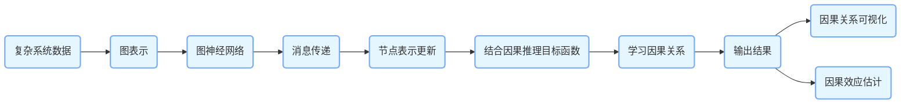

# 基于图神经网络的复杂系统因果推理

> 关键词：图神经网络、复杂系统、因果推理、深度学习、数据挖掘、机器学习、图模型

> 摘要：本文聚焦于基于图神经网络的复杂系统因果推理。在当今复杂系统广泛存在的背景下，因果推理对于理解系统内在机制、进行有效决策具有重要意义。图神经网络凭借其强大的图结构数据处理能力，为复杂系统因果推理提供了新的途径和方法。文章首先介绍了相关背景，包括目的范围、预期读者等；接着阐述了核心概念与联系，通过文本示意图和 Mermaid 流程图进行直观展示；详细讲解了核心算法原理并给出 Python 源代码；分析了数学模型和公式；通过项目实战给出代码实际案例和详细解释；探讨了实际应用场景；推荐了相关工具和资源；最后总结了未来发展趋势与挑战，还包含常见问题与解答以及扩展阅读参考资料，旨在全面深入地介绍基于图神经网络的复杂系统因果推理技术。

## 1. 背景介绍 
### 1.1 目的和范围
在现实世界中，复杂系统无处不在，如生物系统、社会网络、电力系统等。这些系统具有高度的复杂性和不确定性，其内部元素之间存在着复杂的因果关系。理解这些因果关系对于系统的建模、预测、控制和优化至关重要。传统的因果推理方法在处理复杂系统时面临诸多挑战，如数据的高维度、非线性、动态性等。图神经网络作为一种新兴的深度学习技术，能够有效地处理图结构数据，为复杂系统因果推理提供了新的解决方案。

本文的目的在于全面介绍基于图神经网络的复杂系统因果推理的原理、方法和应用。范围涵盖了从基本概念的阐述到核心算法的实现，再到实际应用场景的探讨，以及相关工具和资源的推荐等方面。

### 1.2 预期读者
本文预期读者包括但不限于以下几类人群：
- 研究人员：对因果推理、图神经网络、复杂系统等领域有研究兴趣的科研工作者，希望通过本文了解最新的研究进展和方法。
- 工程师：从事数据挖掘、机器学习、人工智能等相关领域的工程师，期望借鉴本文的方法和技术解决实际问题。
- 学生：计算机科学、统计学、数学等专业的学生，希望通过本文学习复杂系统因果推理的基本原理和实现方法。

### 1.3 文档结构概述
本文的文档结构如下：
- 核心概念与联系：介绍图神经网络、复杂系统、因果推理等核心概念及其相互联系，通过文本示意图和 Mermaid 流程图进行直观展示。
- 核心算法原理 & 具体操作步骤：详细讲解基于图神经网络的复杂系统因果推理的核心算法原理，并给出 Python 源代码。
- 数学模型和公式 & 详细讲解 & 举例说明：分析相关的数学模型和公式，并通过具体例子进行详细讲解。
- 项目实战：代码实际案例和详细解释说明：通过实际项目案例，展示基于图神经网络的复杂系统因果推理的实现过程，并对代码进行详细解读。
- 实际应用场景：探讨基于图神经网络的复杂系统因果推理在不同领域的实际应用场景。
- 工具和资源推荐：推荐相关的学习资源、开发工具框架和论文著作。
- 总结：未来发展趋势与挑战：总结基于图神经网络的复杂系统因果推理的发展趋势和面临的挑战。
- 附录：常见问题与解答：解答读者在学习和应用过程中常见的问题。
- 扩展阅读 & 参考资料：提供相关的扩展阅读材料和参考资料。

### 1.4 术语表
#### 1.4.1 核心术语定义
- 图神经网络（Graph Neural Network, GNN）：是一种专门处理图结构数据的神经网络，通过节点之间的消息传递来学习节点和图的表示。
- 复杂系统（Complex System）：由大量相互作用的组件组成，具有高度的复杂性和不确定性，其行为难以通过简单的线性关系来描述。
- 因果推理（Causal Inference）：是一种从数据中推断变量之间因果关系的方法，旨在回答“如果改变某个变量，会对其他变量产生什么影响”的问题。
- 图（Graph）：由节点（Node）和边（Edge）组成的数学结构，用于表示对象之间的关系。
- 消息传递（Message Passing）：图神经网络中节点之间信息传递的过程，通过聚合邻居节点的信息来更新节点的表示。

#### 1.4.2 相关概念解释
- 有向无环图（Directed Acyclic Graph, DAG）：一种有向图，其中不存在环，常用于表示因果关系。
- 结构因果模型（Structural Causal Model, SCM）：一种用于描述因果关系的数学模型，由一组结构方程和噪声变量组成。
- 因果效应（Causal Effect）：表示某个变量的变化对其他变量产生的影响。
- 干预（Intervention）：在因果推理中，指对某个变量进行外部控制，以观察其对其他变量的影响。

#### 1.4.3 缩略词列表
- GNN：Graph Neural Network（图神经网络）
- DAG：Directed Acyclic Graph（有向无环图）
- SCM：Structural Causal Model（结构因果模型）

## 2. 核心概念与联系 

### 核心概念原理

#### 图神经网络（GNN）
图神经网络是一种专门处理图结构数据的神经网络。在图结构数据中，节点表示对象，边表示对象之间的关系。GNN 的核心思想是通过节点之间的消息传递来学习节点和图的表示。具体来说，每个节点会聚合其邻居节点的信息，并根据一定的更新规则更新自身的表示。通过多次迭代的消息传递，节点可以捕获到其周围环境的信息，从而学习到图的全局结构和特征。

#### 复杂系统
复杂系统由大量相互作用的组件组成，这些组件之间的关系复杂且非线性。复杂系统具有涌现性、自组织性、适应性等特点，其行为难以通过简单的线性关系来描述。在复杂系统中，变量之间的因果关系往往隐藏在大量的数据中，需要通过因果推理方法来挖掘。

#### 因果推理
因果推理是一种从数据中推断变量之间因果关系的方法。传统的因果推理方法主要基于统计分析和实验设计，如随机对照试验、倾向得分匹配等。然而，在复杂系统中，由于数据的高维度、非线性、动态性等特点，传统方法往往难以适用。基于图神经网络的因果推理方法通过学习图结构数据中的因果关系，能够更好地处理复杂系统中的因果推理问题。

### 架构的文本示意图
图神经网络在复杂系统因果推理中的架构可以描述如下：

输入的复杂系统数据以图的形式表示，其中节点表示系统中的变量，边表示变量之间的关系。图神经网络对输入的图进行处理，通过多次消息传递更新节点的表示。在学习过程中，图神经网络可以结合因果推理的目标函数，如因果效应估计的损失函数，来学习变量之间的因果关系。最后，输出的结果可以用于因果关系的可视化、因果效应的估计等应用。

### Mermaid 流程图


## 3. 核心算法原理 & 具体操作步骤 

### 核心算法原理
基于图神经网络的复杂系统因果推理的核心算法原理主要包括以下几个步骤：

1. **图构建**：将复杂系统的数据转换为图结构数据，其中节点表示系统中的变量，边表示变量之间的关系。边的权重可以表示关系的强度。
2. **图神经网络的消息传递**：在图神经网络中，每个节点会聚合其邻居节点的信息，并根据一定的更新规则更新自身的表示。常用的消息传递机制包括图卷积网络（Graph Convolutional Network, GCN）、图注意力网络（Graph Attention Network, GAT）等。
3. **因果推理目标函数的定义**：为了学习变量之间的因果关系，需要定义合适的因果推理目标函数。常见的目标函数包括因果效应估计的损失函数、因果图结构学习的损失函数等。
4. **模型训练**：通过优化因果推理目标函数，训练图神经网络模型。在训练过程中，使用反向传播算法更新模型的参数。
5. **因果关系推断**：训练好的模型可以用于推断变量之间的因果关系，如估计因果效应、学习因果图结构等。

### 具体操作步骤

#### 步骤 1：图构建
以下是一个简单的图构建的 Python 代码示例：
```python
import networkx as nx
import numpy as np

# 定义节点和边
nodes = [1, 2, 3, 4]
edges = [(1, 2), (2, 3), (3, 4)]

# 创建图
G = nx.Graph()
G.add_nodes_from(nodes)
G.add_edges_from(edges)

# 节点特征
node_features = np.random.rand(len(nodes), 10)

# 边特征
edge_features = np.random.rand(len(edges), 5)
```

#### 步骤 2：图神经网络的消息传递
使用 PyTorch Geometric 库实现一个简单的图卷积网络（GCN）：
```python
import torch
import torch.nn.functional as F
from torch_geometric.nn import GCNConv

class GCN(torch.nn.Module):
    def __init__(self, in_channels, hidden_channels, out_channels):
        super(GCN, self).__init__()
        self.conv1 = GCNConv(in_channels, hidden_channels)
        self.conv2 = GCNConv(hidden_channels, out_channels)

    def forward(self, x, edge_index):
        x = self.conv1(x, edge_index)
        x = F.relu(x)
        x = F.dropout(x, training=self.training)
        x = self.conv2(x, edge_index)
        return x

# 初始化模型
model = GCN(in_channels=10, hidden_channels=16, out_channels=5)
```

#### 步骤 3：因果推理目标函数的定义
假设我们的目标是估计因果效应，我们可以定义一个均方误差损失函数：
```python
def causal_effect_loss(predicted_effect, true_effect):
    return F.mse_loss(predicted_effect, true_effect)
```

#### 步骤 4：模型训练
```python
import torch.optim as optim

# 定义优化器
optimizer = optim.Adam(model.parameters(), lr=0.01)

# 模拟真实的因果效应
true_effect = torch.randn(len(nodes), 1)

# 训练模型
for epoch in range(100):
    optimizer.zero_grad()
    # 前向传播
    out = model(torch.tensor(node_features, dtype=torch.float), torch.tensor(np.array(edges).T, dtype=torch.long))
    # 计算损失
    loss = causal_effect_loss(out, true_effect)
    # 反向传播
    loss.backward()
    optimizer.step()
    if epoch % 10 == 0:
        print(f'Epoch {epoch}, Loss: {loss.item()}')
```

#### 步骤 5：因果关系推断
```python
# 推断因果效应
with torch.no_grad():
    predicted_effect = model(torch.tensor(node_features, dtype=torch.float), torch.tensor(np.array(edges).T, dtype=torch.long))
    print('Predicted Causal Effects:', predicted_effect)
```

## 4. 数学模型和公式 & 详细讲解 & 举例说明 

### 图神经网络的数学模型

#### 图卷积网络（GCN）
图卷积网络（GCN）是一种常用的图神经网络，其核心公式如下：

$$H^{(l+1)} = \sigma(\tilde{D}^{-\frac{1}{2}}\tilde{A}\tilde{D}^{-\frac{1}{2}}H^{(l)}W^{(l)})$$

其中：
- $H^{(l)}$ 是第 $l$ 层的节点特征矩阵，形状为 $N \times C^{(l)}$，$N$ 是节点数量，$C^{(l)}$ 是第 $l$ 层的特征维度。
- $\tilde{A} = A + I$ 是邻接矩阵 $A$ 加上自环的矩阵，$I$ 是单位矩阵。
- $\tilde{D}$ 是 $\tilde{A}$ 的度矩阵，即 $\tilde{D}_{ii} = \sum_{j}\tilde{A}_{ij}$。
- $W^{(l)}$ 是第 $l$ 层的可学习权重矩阵，形状为 $C^{(l)} \times C^{(l+1)}$。
- $\sigma$ 是激活函数，如 ReLU 函数。

#### 详细讲解
GCN 的核心思想是通过聚合邻居节点的信息来更新节点的表示。$\tilde{D}^{-\frac{1}{2}}\tilde{A}\tilde{D}^{-\frac{1}{2}}$ 是归一化的邻接矩阵，用于对邻居节点的信息进行加权平均。$H^{(l)}W^{(l)}$ 是对节点特征进行线性变换，然后通过激活函数 $\sigma$ 引入非线性。

#### 举例说明
假设我们有一个简单的图，包含 3 个节点，节点特征维度为 2，即 $N = 3$，$C^{(0)} = 2$。邻接矩阵 $A$ 为：

$$A = \begin{bmatrix}
0 & 1 & 0 \\
1 & 0 & 1 \\
0 & 1 & 0
\end{bmatrix}$$

则 $\tilde{A} = A + I$ 为：

$$\tilde{A} = \begin{bmatrix}
1 & 1 & 0 \\
1 & 1 & 1 \\
0 & 1 & 1
\end{bmatrix}$$

$\tilde{D}$ 为：

$$\tilde{D} = \begin{bmatrix}
2 & 0 & 0 \\
0 & 3 & 0 \\
0 & 0 & 2
\end{bmatrix}$$

$\tilde{D}^{-\frac{1}{2}}\tilde{A}\tilde{D}^{-\frac{1}{2}}$ 为：

$$\tilde{D}^{-\frac{1}{2}}\tilde{A}\tilde{D}^{-\frac{1}{2}} = \begin{bmatrix}
\frac{1}{2} & \frac{1}{\sqrt{6}} & 0 \\
\frac{1}{\sqrt{6}} & \frac{1}{3} & \frac{1}{\sqrt{6}} \\
0 & \frac{1}{\sqrt{6}} & \frac{1}{2}
\end{bmatrix}$$

假设第 0 层的节点特征矩阵 $H^{(0)}$ 为：

$$H^{(0)} = \begin{bmatrix}
1 & 2 \\
3 & 4 \\
5 & 6
\end{bmatrix}$$

第 0 层的权重矩阵 $W^{(0)}$ 为：

$$W^{(0)} = \begin{bmatrix}
0.1 & 0.2 \\
0.3 & 0.4
\end{bmatrix}$$

则 $H^{(1)}$ 为：

$$H^{(1)} = \sigma(\tilde{D}^{-\frac{1}{2}}\tilde{A}\tilde{D}^{-\frac{1}{2}}H^{(0)}W^{(0)})$$

首先计算 $\tilde{D}^{-\frac{1}{2}}\tilde{A}\tilde{D}^{-\frac{1}{2}}H^{(0)}$：

$$\tilde{D}^{-\frac{1}{2}}\tilde{A}\tilde{D}^{-\frac{1}{2}}H^{(0)} = \begin{bmatrix}
\frac{1}{2} & \frac{1}{\sqrt{6}} & 0 \\
\frac{1}{\sqrt{6}} & \frac{1}{3} & \frac{1}{\sqrt{6}} \\
0 & \frac{1}{\sqrt{6}} & \frac{1}{2}
\end{bmatrix} \begin{bmatrix}
1 & 2 \\
3 & 4 \\
5 & 6
\end{bmatrix} = \begin{bmatrix}
\frac{1}{2} \times 1 + \frac{1}{\sqrt{6}} \times 3 & \frac{1}{2} \times 2 + \frac{1}{\sqrt{6}} \times 4 \\
\frac{1}{\sqrt{6}} \times 1 + \frac{1}{3} \times 3 + \frac{1}{\sqrt{6}} \times 5 & \frac{1}{\sqrt{6}} \times 2 + \frac{1}{3} \times 4 + \frac{1}{\sqrt{6}} \times 6 \\
\frac{1}{\sqrt{6}} \times 3 + \frac{1}{2} \times 5 & \frac{1}{\sqrt{6}} \times 4 + \frac{1}{2} \times 6
\end{bmatrix}$$

然后计算 $\tilde{D}^{-\frac{1}{2}}\tilde{A}\tilde{D}^{-\frac{1}{2}}H^{(0)}W^{(0)}$：

$$\tilde{D}^{-\frac{1}{2}}\tilde{A}\tilde{D}^{-\frac{1}{2}}H^{(0)}W^{(0)} = \begin{bmatrix}
\cdots & \cdots \\
\cdots & \cdots \\
\cdots & \cdots
\end{bmatrix} \begin{bmatrix}
0.1 & 0.2 \\
0.3 & 0.4
\end{bmatrix}$$

最后通过激活函数 $\sigma$ 得到 $H^{(1)}$。

### 因果推理的数学模型

#### 结构因果模型（SCM）
结构因果模型（SCM）是一种用于描述因果关系的数学模型，由一组结构方程和噪声变量组成。假设我们有一个变量集合 $V = \{X_1, X_2, \cdots, X_n\}$，SCM 可以表示为：

$$X_i = f_i(PA_i, U_i), i = 1, 2, \cdots, n$$

其中：
- $PA_i$ 是 $X_i$ 的父节点集合。
- $U_i$ 是噪声变量，代表未被观察到的因素。
- $f_i$ 是结构方程，描述了 $X_i$ 与 $PA_i$ 和 $U_i$ 之间的关系。

#### 详细讲解
SCM 通过结构方程来描述变量之间的因果关系。父节点集合 $PA_i$ 表示直接影响 $X_i$ 的变量，噪声变量 $U_i$ 表示无法用其他变量解释的随机因素。通过对 SCM 进行干预和反事实推理，可以估计因果效应。

#### 举例说明
假设我们有一个简单的 SCM，包含 3 个变量 $X_1$，$X_2$，$X_3$，其结构方程如下：

$$X_1 = U_1$$
$$X_2 = 2X_1 + U_2$$
$$X_3 = 3X_2 + U_3$$

其中 $U_1$，$U_2$，$U_3$ 是独立的噪声变量。如果我们对 $X_1$ 进行干预，将其值固定为 $x_1$，则 $X_2$ 的值变为 $2x_1 + U_2$，$X_3$ 的值变为 $3(2x_1 + U_2) + U_3$。通过比较干预前后 $X_3$ 的值，可以估计 $X_1$ 对 $X_3$ 的因果效应。

## 5. 项目实战：代码实际案例和详细解释说明 

### 5.1  开发环境搭建
在进行基于图神经网络的复杂系统因果推理项目实战之前，需要搭建相应的开发环境。以下是具体的步骤：

#### 安装 Python
首先，确保你已经安装了 Python 3.6 或更高版本。你可以从 Python 官方网站（https://www.python.org/downloads/） 下载并安装 Python。

#### 创建虚拟环境
为了避免不同项目之间的依赖冲突，建议使用虚拟环境。可以使用 `venv` 或 `conda` 来创建虚拟环境。以下是使用 `venv` 创建虚拟环境的示例：

```bash
python -m venv myenv
source myenv/bin/activate  # 对于 Linux/Mac
myenv\Scripts\activate  # 对于 Windows
```

#### 安装依赖库
在虚拟环境中，安装项目所需的依赖库，包括 `torch`、`torch_geometric`、`networkx` 等。可以使用 `pip` 来安装这些库：

```bash
pip install torch torch_geometric networkx numpy matplotlib
```

### 5.2  源代码详细实现和代码解读
以下是一个基于图神经网络的复杂系统因果推理的完整代码示例：

```python
import torch
import torch.nn.functional as F
from torch_geometric.nn import GCNConv
import networkx as nx
import numpy as np

# 定义图神经网络模型
class GCN(torch.nn.Module):
    def __init__(self, in_channels, hidden_channels, out_channels):
        super(GCN, self).__init__()
        self.conv1 = GCNConv(in_channels, hidden_channels)
        self.conv2 = GCNConv(hidden_channels, out_channels)

    def forward(self, x, edge_index):
        x = self.conv1(x, edge_index)
        x = F.relu(x)
        x = F.dropout(x, training=self.training)
        x = self.conv2(x, edge_index)
        return x

# 构建图
nodes = [1, 2, 3, 4]
edges = [(1, 2), (2, 3), (3, 4)]
G = nx.Graph()
G.add_nodes_from(nodes)
G.add_edges_from(edges)

# 节点特征
node_features = np.random.rand(len(nodes), 10)

# 边特征
edge_features = np.random.rand(len(edges), 5)

# 初始化模型
model = GCN(in_channels=10, hidden_channels=16, out_channels=5)

# 定义因果推理目标函数
def causal_effect_loss(predicted_effect, true_effect):
    return F.mse_loss(predicted_effect, true_effect)

# 定义优化器
optimizer = torch.optim.Adam(model.parameters(), lr=0.01)

# 模拟真实的因果效应
true_effect = torch.randn(len(nodes), 1)

# 训练模型
for epoch in range(100):
    optimizer.zero_grad()
    # 前向传播
    out = model(torch.tensor(node_features, dtype=torch.float), torch.tensor(np.array(edges).T, dtype=torch.long))
    # 计算损失
    loss = causal_effect_loss(out, true_effect)
    # 反向传播
    loss.backward()
    optimizer.step()
    if epoch % 10 == 0:
        print(f'Epoch {epoch}, Loss: {loss.item()}')

# 推断因果效应
with torch.no_grad():
    predicted_effect = model(torch.tensor(node_features, dtype=torch.float), torch.tensor(np.array(edges).T, dtype=torch.long))
    print('Predicted Causal Effects:', predicted_effect)
```

### 5.3  代码解读与分析
#### 图神经网络模型定义
`GCN` 类定义了一个简单的图卷积网络，包含两个图卷积层。`conv1` 和 `conv2` 分别是两个图卷积层，通过 `forward` 方法实现前向传播。

#### 图构建
使用 `networkx` 库构建图，定义节点和边，并添加到图中。节点特征和边特征通过随机生成的数组表示。

#### 因果推理目标函数
`causal_effect_loss` 函数定义了因果推理的目标函数，使用均方误差损失函数来衡量预测的因果效应和真实的因果效应之间的差异。

#### 优化器和训练过程
使用 `Adam` 优化器来更新模型的参数。在训练过程中，通过前向传播计算预测的因果效应，然后计算损失，再通过反向传播更新模型的参数。

#### 因果效应推断
在训练完成后，使用 `torch.no_grad()` 上下文管理器来关闭梯度计算，进行因果效应的推断。

## 6. 实际应用场景 

### 生物系统
在生物系统中，基因、蛋白质等分子之间存在着复杂的相互作用关系。基于图神经网络的复杂系统因果推理可以用于推断基因调控网络、蛋白质相互作用网络等，帮助理解生物系统的内在机制。例如，通过分析基因表达数据，推断基因之间的因果关系，有助于发现新的疾病相关基因和药物靶点。

### 社会网络
社会网络中，个体之间的关系和行为相互影响。基于图神经网络的因果推理可以用于分析社交网络中的信息传播、意见形成等过程。例如，推断某个用户的行为对其社交圈子中其他用户的影响，有助于制定有效的营销策略和舆情管理方案。

### 电力系统
电力系统是一个复杂的网络，包含发电、输电、配电等多个环节。基于图神经网络的因果推理可以用于故障诊断、负荷预测、电网优化等方面。例如，通过分析电力系统的运行数据，推断故障发生的原因和影响范围，及时采取措施进行修复，提高电力系统的可靠性和稳定性。

### 金融系统
金融系统中，各种金融资产之间存在着复杂的关联关系。基于图神经网络的因果推理可以用于风险评估、投资决策、市场预测等方面。例如，通过分析股票市场的交易数据，推断不同股票之间的因果关系，帮助投资者制定合理的投资策略。

## 7. 工具和资源推荐
### 7.1 学习资源推荐
#### 7.1.1 书籍推荐
- 《图神经网络：基础、前沿与应用》：全面介绍了图神经网络的基本原理、算法和应用，是学习图神经网络的经典书籍。
- 《因果推断：基础与前沿》：系统阐述了因果推断的基本理论和方法，对于理解因果推理的原理和应用有很大帮助。
- 《复杂系统科学导论》：介绍了复杂系统的基本概念、特性和研究方法，有助于深入理解复杂系统的本质。

#### 7.1.2 在线课程
- Coursera 上的“Graph Neural Networks for Machine Learning”：由知名学者授课，详细介绍了图神经网络的理论和实践。
- edX 上的“Causal Inference in Data Science”：系统讲解了因果推断在数据科学中的应用。
- 中国大学 MOOC 上的“复杂系统理论与方法”：介绍了复杂系统的基本理论和研究方法。

#### 7.1.3 技术博客和网站
- Medium 上的“Towards Data Science”：有很多关于图神经网络、因果推理等领域的技术文章和案例分享。
- ArXiv.org：提供了大量的学术论文，包括图神经网络和因果推理的最新研究成果。
- 图灵社区：有很多关于人工智能、机器学习等领域的技术文章和书籍推荐。

### 7.2 开发工具框架推荐
#### 7.2.1 IDE和编辑器
- PyCharm：是一款功能强大的 Python 集成开发环境，支持代码编辑、调试、版本控制等功能，适合开发基于 Python 的图神经网络和因果推理项目。
- Jupyter Notebook：是一个交互式的开发环境，适合进行数据探索、模型训练和结果展示，方便快速验证想法和进行实验。
- Visual Studio Code：是一款轻量级的代码编辑器，支持多种编程语言和插件扩展，具有丰富的代码编辑和调试功能。

#### 7.2.2 调试和性能分析工具
- TensorBoard：是 TensorFlow 提供的可视化工具，可以用于可视化训练过程中的损失函数、准确率等指标，帮助调试模型和分析性能。
- PyTorch Profiler：是 PyTorch 提供的性能分析工具，可以用于分析模型的运行时间、内存使用等情况，帮助优化模型性能。
- cProfile：是 Python 内置的性能分析工具，可以用于分析 Python 代码的运行时间和函数调用情况。

#### 7.2.3 相关框架和库
- PyTorch Geometric：是一个基于 PyTorch 的图神经网络库，提供了丰富的图神经网络模型和工具，方便进行图神经网络的开发和实验。
- NetworkX：是一个用于创建、操作和研究复杂网络的 Python 库，提供了各种图的表示和算法，适合进行图的构建和分析。
- DoWhy：是一个用于因果推断的 Python 库，提供了各种因果推断的方法和工具，方便进行因果推理的实验和应用。

### 7.3 相关论文著作推荐
#### 7.3.1 经典论文
- “Semi-Supervised Classification with Graph Convolutional Networks”：介绍了图卷积网络（GCN）的基本原理和算法，是图神经网络领域的经典论文。
- “Causal Inference in Statistics: A Primer”：系统阐述了因果推断的基本理论和方法，是因果推理领域的经典著作。
- “The Book of Why: The New Science of Cause and Effect”：从哲学和科学的角度探讨了因果关系的本质和因果推断的重要性。

#### 7.3.2 最新研究成果
- 关注 ArXiv.org 上的最新论文，特别是关于图神经网络和因果推理的研究成果。
- 参加相关的学术会议，如 NeurIPS、ICML、KDD 等，了解最新的研究动态和技术进展。

#### 7.3.3 应用案例分析
- 研究一些实际应用案例，如生物信息学、社会网络分析、电力系统等领域的应用案例，了解基于图神经网络的复杂系统因果推理在实际中的应用方法和效果。

## 8. 总结：未来发展趋势与挑战

### 未来发展趋势
#### 多模态数据融合
未来的研究将更加注重多模态数据的融合，如将图像、文本、音频等不同类型的数据与图结构数据相结合，以更全面地描述复杂系统，提高因果推理的准确性和可靠性。

#### 强化学习与因果推理的结合
强化学习和因果推理的结合将成为一个重要的研究方向。通过强化学习的方法，可以在复杂系统中进行干预和实验，从而更好地学习因果关系，实现智能决策和优化。

#### 可解释性因果推理
随着人工智能技术的广泛应用，可解释性因果推理越来越受到关注。未来的研究将致力于开发可解释的因果推理模型，使模型的决策过程和结果能够被人类理解和信任。

#### 大规模复杂系统的因果推理
随着数据量的不断增加和系统复杂度的不断提高，处理大规模复杂系统的因果推理将成为一个挑战。未来的研究将探索更高效的算法和技术，以应对大规模复杂系统的因果推理问题。

### 挑战
#### 数据质量和数量
复杂系统的数据往往具有高维度、非线性、动态性等特点，数据质量和数量对因果推理的结果有很大影响。如何获取高质量、足够数量的数据，并进行有效的预处理和特征工程，是一个需要解决的问题。

#### 因果关系的识别和验证
在复杂系统中，因果关系往往隐藏在大量的数据中，如何准确地识别和验证因果关系是一个挑战。此外，由于因果关系的复杂性和不确定性，如何评估因果推理结果的可靠性也是一个需要研究的问题。

#### 计算资源和效率
基于图神经网络的复杂系统因果推理通常需要大量的计算资源和时间。如何优化算法和模型，提高计算效率，是一个需要解决的问题。

#### 伦理和法律问题
因果推理的结果可能会对决策和社会产生重要影响，因此需要考虑伦理和法律问题。例如，如何确保因果推理的结果不被滥用，如何保护个人隐私和数据安全等。

## 9. 附录：常见问题与解答

### 问题 1：图神经网络和传统神经网络有什么区别？
图神经网络是专门处理图结构数据的神经网络，而传统神经网络主要处理欧几里得空间的数据，如图像、文本等。图神经网络通过节点之间的消息传递来学习节点和图的表示，能够更好地捕捉图结构数据中的关系信息。

### 问题 2：因果推理和相关性分析有什么区别？
相关性分析主要关注变量之间的统计关联，而因果推理旨在推断变量之间的因果关系。相关性并不意味着因果性，因果推理需要考虑变量之间的因果机制和干预效果。

### 问题 3：如何选择合适的图神经网络模型？
选择合适的图神经网络模型需要考虑数据的特点、任务的需求和计算资源等因素。不同的图神经网络模型适用于不同的场景，如 GCN 适用于节点分类任务，GAT 适用于图分类任务等。可以通过实验和比较不同模型的性能来选择合适的模型。

### 问题 4：如何评估因果推理的结果？
评估因果推理的结果可以从多个方面进行，如因果效应的估计准确性、因果图结构的学习准确性等。常用的评估指标包括均方误差、平均绝对误差、结构汉明距离等。此外，还可以通过实验验证和领域知识来评估因果推理结果的可靠性。

### 问题 5：基于图神经网络的复杂系统因果推理在实际应用中存在哪些局限性？
基于图神经网络的复杂系统因果推理在实际应用中存在一些局限性，如对数据质量和数量的要求较高、计算资源和时间成本较大、因果关系的识别和验证困难等。此外，由于图神经网络的黑盒性质，模型的可解释性也是一个问题。

## 10. 扩展阅读 & 参考资料

### 扩展阅读
- 《Deep Learning》：深度学习领域的经典书籍，介绍了深度学习的基本原理、算法和应用。
- 《Machine Learning: A Probabilistic Perspective》：从概率的角度介绍了机器学习的基本原理和算法，有助于深入理解机器学习的本质。
- 《Graph Signal Processing: Foundations, Challenges, and Applications》：介绍了图信号处理的基本理论和方法，与图神经网络有一定的关联。

### 参考资料
- Kipf, T. N., & Welling, M. (2016). Semi-Supervised Classification with Graph Convolutional Networks. arXiv preprint arXiv:1609.02907.
- Pearl, J., Glymour, M., & Jewell, N. P. (2016). Causal Inference in Statistics: A Primer. John Wiley & Sons.
- Pearl, J. (2018). The Book of Why: The New Science of Cause and Effect. Basic Books.
- https://pytorch-geometric.readthedocs.io/en/latest/
- https://networkx.org/
- https://microsoft.github.io/dowhy/