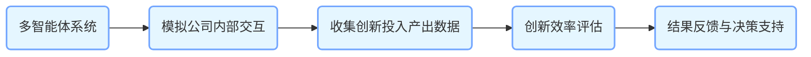

# 基于多智能体的自动化公司创新效率评估

> 关键词：多智能体系统、自动化公司、创新效率评估、人工智能、数据分析

> 摘要：本文聚焦于基于多智能体的自动化公司创新效率评估这一核心主题。随着自动化公司在科技浪潮中不断发展，准确评估其创新效率变得至关重要。多智能体系统作为一种先进的技术手段，为创新效率评估提供了新的视角和方法。文章首先介绍了研究的背景、目的、预期读者和文档结构，接着阐述了多智能体系统和创新效率评估的核心概念及联系，详细讲解了相关的核心算法原理和具体操作步骤，包括使用Python代码进行示例。同时，给出了数学模型和公式，并结合实际案例进行说明。通过项目实战，展示了如何搭建开发环境、实现源代码以及对代码进行解读和分析。此外，还探讨了该评估方法的实际应用场景，推荐了相关的学习资源、开发工具框架和论文著作。最后，总结了未来的发展趋势与挑战，并提供了常见问题的解答和扩展阅读的参考资料，旨在为相关领域的研究和实践提供全面而深入的指导。

## 1. 背景介绍 
### 1.1 目的和范围
在当今快速发展的科技时代，自动化公司面临着日益激烈的市场竞争。创新能力成为了企业生存和发展的关键因素之一。准确评估自动化公司的创新效率，有助于企业了解自身的创新优势和不足，为制定合理的创新策略提供依据。同时，对于投资者、监管机构等外部利益相关者来说，也能更好地了解企业的创新能力和发展潜力。

本研究的范围主要聚焦于基于多智能体系统对自动化公司的创新效率进行评估。多智能体系统具有分布式、自主性和协作性等特点，能够模拟自动化公司内部不同部门、人员之间的交互和协作过程，从而更全面、准确地评估创新效率。研究将涵盖多智能体系统的构建、创新效率评估指标的确定、相关算法的设计和实现等方面。

### 1.2 预期读者
本文的预期读者包括自动化公司的管理人员、研发人员、市场营销人员等，他们可以通过本文了解如何利用多智能体系统评估公司的创新效率，为企业的创新管理提供决策支持。同时，对于从事人工智能、管理学、经济学等领域的研究人员来说，也可以作为相关研究的参考资料。此外，投资者、监管机构等对自动化公司创新能力感兴趣的外部人员，也能从本文中获取有价值的信息。

### 1.3 文档结构概述
本文将按照以下结构进行组织：
1. **背景介绍**：阐述研究的目的、范围、预期读者和文档结构，以及相关术语的定义和解释。
2. **核心概念与联系**：介绍多智能体系统和创新效率评估的核心概念，分析它们之间的联系，并通过文本示意图和Mermaid流程图进行展示。
3. **核心算法原理 & 具体操作步骤**：详细讲解基于多智能体的创新效率评估的核心算法原理，并使用Python源代码进行示例。
4. **数学模型和公式 & 详细讲解 & 举例说明**：给出创新效率评估的数学模型和公式，并结合实际案例进行详细讲解。
5. **项目实战：代码实际案例和详细解释说明**：通过一个实际的项目案例，展示如何搭建开发环境、实现源代码以及对代码进行解读和分析。
6. **实际应用场景**：探讨基于多智能体的自动化公司创新效率评估在实际中的应用场景。
7. **工具和资源推荐**：推荐相关的学习资源、开发工具框架和论文著作。
8. **总结：未来发展趋势与挑战**：总结研究的主要成果，分析未来的发展趋势和面临的挑战。
9. **附录：常见问题与解答**：提供常见问题的解答，帮助读者更好地理解和应用本文的内容。
10. **扩展阅读 & 参考资料**：列出相关的扩展阅读材料和参考资料，供读者进一步深入研究。

### 1.4 术语表
#### 1.4.1 核心术语定义
- **多智能体系统（Multi - Agent System, MAS）**：由多个智能体组成的系统，每个智能体具有自主性、社会性、反应性和主动性等特点，能够通过相互协作完成复杂的任务。
- **自动化公司**：指在生产、管理等各个环节广泛应用自动化技术的企业，通常具有较高的科技含量和创新能力。
- **创新效率**：衡量企业在创新过程中投入资源与产出成果之间的比例关系，反映了企业利用资源进行创新的能力和效果。

#### 1.4.2 相关概念解释
- **智能体（Agent）**：是一个具有感知、决策和行动能力的实体，能够根据自身的知识和目标，对环境的变化做出响应，并采取相应的行动。
- **创新投入**：包括人力、物力、财力等方面的资源投入，用于支持企业的创新活动，如研发人员的工资、研发设备的购置等。
- **创新产出**：指企业通过创新活动所获得的成果，如新产品、新技术、新专利等。

#### 1.4.3 缩略词列表
- **MAS**：Multi - Agent System（多智能体系统）
- **R&D**：Research and Development（研究与开发）

## 2. 核心概念与联系 
### 2.1 多智能体系统的原理和架构
多智能体系统是一种分布式的人工智能系统，由多个智能体组成。每个智能体都有自己的目标、知识和能力，能够独立地感知环境、做出决策和采取行动。智能体之间通过通信和协作机制，共同完成系统的整体任务。

多智能体系统的架构通常包括以下几个部分：
- **智能体层**：由多个智能体组成，每个智能体负责完成特定的任务。
- **通信层**：提供智能体之间的通信机制，使智能体能够交换信息和协调行动。
- **协调层**：负责对智能体的行为进行协调和管理，以确保系统的整体性能最优。
- **环境层**：是智能体所处的外部环境，智能体通过感知环境的变化来调整自己的行为。

以下是多智能体系统架构的文本示意图：

```plaintext
+-----------------+
|   环境层        |
+-----------------+
|   通信层        |
+-----------------+
|   协调层        |
+-----------------+
|   智能体层      |
|   - 智能体 1    |
|   - 智能体 2    |
|  ...           |
|   - 智能体 n    |
+-----------------+
```

### 2.2 创新效率评估的原理和方法
创新效率评估的基本原理是通过比较企业的创新投入和创新产出，来衡量企业利用资源进行创新的能力和效果。常用的创新效率评估方法包括数据包络分析（DEA）、随机前沿分析（SFA）等。

数据包络分析是一种非参数的评估方法，它通过构建生产前沿面，将每个决策单元（如企业）与前沿面进行比较，从而确定其相对效率。随机前沿分析则是一种参数化的评估方法，它假设生产过程中存在随机误差和技术无效率，通过估计生产函数来评估企业的创新效率。

### 2.3 多智能体系统与创新效率评估的联系
多智能体系统可以为创新效率评估提供更加真实和复杂的模拟环境。在自动化公司中，不同部门、人员之间的交互和协作对创新效率有着重要的影响。多智能体系统可以模拟这些交互和协作过程，考虑到各种因素的动态变化，从而更准确地评估创新效率。

例如，可以将自动化公司的研发部门、市场营销部门、生产部门等分别抽象为不同的智能体，每个智能体具有自己的目标和行为规则。通过模拟这些智能体之间的通信和协作，观察创新投入和产出的变化情况，进而评估创新效率。

### 2.4 Mermaid流程图


该流程图展示了基于多智能体系统进行创新效率评估的主要流程。首先，多智能体系统模拟自动化公司内部不同部门之间的交互；然后，收集创新投入和产出的数据；接着，利用这些数据进行创新效率评估；最后，将评估结果反馈给企业管理层，为决策提供支持。

## 3. 核心算法原理 & 具体操作步骤 
### 3.1 核心算法原理
在基于多智能体的自动化公司创新效率评估中，核心算法主要包括智能体的行为决策算法和创新效率评估算法。

#### 3.1.1 智能体的行为决策算法
智能体的行为决策算法用于确定智能体在不同情况下的行动策略。常用的行为决策算法包括基于规则的算法、基于机器学习的算法等。

基于规则的算法通过预先定义一系列的规则来指导智能体的行为。例如，当研发智能体接收到市场需求信息时，如果该需求与自身的研发方向匹配，且研发资源充足，则决定开展相应的研发项目。

基于机器学习的算法则通过对历史数据的学习，自动生成智能体的行为策略。例如，可以使用强化学习算法，让智能体在与环境的交互中不断学习，以最大化自身的奖励。

#### 3.1.2 创新效率评估算法
创新效率评估算法用于根据智能体模拟得到的创新投入和产出数据，计算自动化公司的创新效率。如前文所述，常用的评估算法包括数据包络分析（DEA）和随机前沿分析（SFA）。

### 3.2 具体操作步骤
#### 3.2.1 智能体建模
- **定义智能体类型**：根据自动化公司的组织结构和业务流程，定义不同类型的智能体，如研发智能体、市场营销智能体、生产智能体等。
- **确定智能体属性**：为每个智能体定义属性，如资源数量、知识水平、目标等。
- **设计智能体行为规则**：根据智能体的类型和属性，设计相应的行为规则，指导智能体的决策和行动。

#### 3.2.2 多智能体系统模拟
- **初始化智能体状态**：为每个智能体设置初始状态，包括资源数量、知识水平等。
- **模拟智能体交互**：按照智能体的行为规则，模拟智能体之间的通信和协作过程，记录创新投入和产出数据。
- **更新智能体状态**：根据智能体的行动结果，更新智能体的状态，如资源数量的变化、知识水平的提升等。

#### 3.2.3 创新效率评估
- **数据预处理**：对模拟得到的创新投入和产出数据进行预处理，如数据清洗、归一化等。
- **选择评估算法**：根据实际情况选择合适的创新效率评估算法，如DEA或SFA。
- **计算创新效率**：使用选择的评估算法，计算自动化公司的创新效率。

### 3.3 Python源代码示例
以下是一个简单的基于多智能体的自动化公司创新效率评估的Python代码示例：

```python
import numpy as np

# 定义智能体类
class Agent:
    def __init__(self, name, resources, knowledge):
        self.name = name
        self.resources = resources
        self.knowledge = knowledge

    def make_decision(self):
        # 简单的决策规则：如果资源和知识充足，则进行创新活动
        if self.resources > 10 and self.knowledge > 0.5:
            return True
        else:
            return False

    def conduct_innovation(self):
        # 模拟创新活动，消耗资源并提升知识
        self.resources -= 5
        self.knowledge += 0.2
        return 1  # 假设创新产出为 1

# 定义多智能体系统类
class MultiAgentSystem:
    def __init__(self):
        self.agents = []

    def add_agent(self, agent):
        self.agents.append(agent)

    def simulate(self, steps):
        total_input = 0
        total_output = 0
        for step in range(steps):
            for agent in self.agents:
                if agent.make_decision():
                    total_input += 5
                    output = agent.conduct_innovation()
                    total_output += output
        return total_input, total_output

# 定义创新效率评估函数
def evaluate_innovation_efficiency(input, output):
    if input == 0:
        return 0
    return output / input

# 主程序
if __name__ == "__main__":
    # 创建智能体
    agent1 = Agent("研发智能体1", 20, 0.6)
    agent2 = Agent("研发智能体2", 15, 0.7)

    # 创建多智能体系统
    mas = MultiAgentSystem()
    mas.add_agent(agent1)
    mas.add_agent(agent2)

    # 模拟多智能体系统运行 10 步
    total_input, total_output = mas.simulate(10)

    # 评估创新效率
    efficiency = evaluate_innovation_efficiency(total_input, total_output)

    print(f"总创新投入: {total_input}")
    print(f"总创新产出: {total_output}")
    print(f"创新效率: {efficiency}")
```

### 3.4 代码解释
- **Agent类**：表示智能体，包含智能体的名称、资源数量和知识水平等属性。`make_decision`方法用于根据资源和知识水平决定是否进行创新活动，`conduct_innovation`方法用于模拟创新活动，消耗资源并提升知识水平。
- **MultiAgentSystem类**：表示多智能体系统，包含一个智能体列表。`add_agent`方法用于向系统中添加智能体，`simulate`方法用于模拟多智能体系统的运行，记录创新投入和产出数据。
- **evaluate_innovation_efficiency函数**：用于计算创新效率，即创新产出与创新投入的比值。
- **主程序**：创建两个研发智能体，将它们添加到多智能体系统中，模拟系统运行10步，计算并输出总创新投入、总创新产出和创新效率。

## 4. 数学模型和公式 & 详细讲解 & 举例说明 
### 4.1 数据包络分析（DEA）模型
#### 4.1.1 基本原理
数据包络分析（DEA）是一种基于线性规划的非参数评估方法，用于评估多个决策单元（DMU）的相对效率。在创新效率评估中，每个自动化公司可以看作一个决策单元，创新投入和创新产出分别作为输入和输出变量。

DEA的基本思想是通过构建生产前沿面，将每个决策单元与前沿面进行比较，从而确定其相对效率。生产前沿面是由所有有效决策单元组成的边界，位于前沿面上的决策单元被认为是技术有效的，其效率值为1；而位于前沿面下方的决策单元则是技术无效的，其效率值小于1。

#### 4.1.2 CCR模型
CCR模型是DEA的基本模型，由Charnes、Cooper和Rhodes于1978年提出。该模型假设规模报酬不变，用于评估决策单元的总体效率。

假设有 $n$ 个决策单元，每个决策单元有 $m$ 种输入和 $s$ 种输出。设 $x_{ij}$ 表示第 $j$ 个决策单元的第 $i$ 种输入，$y_{rj}$ 表示第 $j$ 个决策单元的第 $r$ 种输出。对于第 $k$ 个决策单元，其CCR模型的线性规划问题可以表示为：

$$
\begin{aligned}
\max_{u,v} \quad & h_k = \frac{\sum_{r = 1}^{s} u_r y_{rk}}{\sum_{i = 1}^{m} v_i x_{ik}} \\
\text{s.t.} \quad & \frac{\sum_{r = 1}^{s} u_r y_{rj}}{\sum_{i = 1}^{m} v_i x_{ij}} \leq 1, \quad j = 1,2,\cdots,n \\
& u_r \geq \epsilon, \quad r = 1,2,\cdots,s \\
& v_i \geq \epsilon, \quad i = 1,2,\cdots,m
\end{aligned}
$$

其中，$u_r$ 和 $v_i$ 分别是输出和输入的权重，$\epsilon$ 是一个非阿基米德无穷小量，用于保证权重的非负性。

为了将上述分式规划问题转化为线性规划问题，可以引入约束条件 $\sum_{i = 1}^{m} v_i x_{ik} = 1$，得到以下等价的线性规划问题：

$$
\begin{aligned}
\max_{u,v} \quad & h_k = \sum_{r = 1}^{s} u_r y_{rk} \\
\text{s.t.} \quad & \sum_{r = 1}^{s} u_r y_{rj} - \sum_{i = 1}^{m} v_i x_{ij} \leq 0, \quad j = 1,2,\cdots,n \\
& \sum_{i = 1}^{m} v_i x_{ik} = 1 \\
& u_r \geq \epsilon, \quad r = 1,2,\cdots,s \\
& v_i \geq \epsilon, \quad i = 1,2,\cdots,m
\end{aligned}
$$

#### 4.1.3 举例说明
假设有3个自动化公司（决策单元），每个公司的创新投入和产出数据如下表所示：

| 公司 | 研发人员数量（人） | 研发经费（万元） | 新产品数量 | 专利数量 |
| ---- | ------------------ | ---------------- | ---------- | -------- |
| A    | 20                 | 100              | 5          | 3        |
| B    | 30                 | 150              | 6          | 4        |
| C    | 15                 | 80               | 4          | 2        |

我们以公司A为例，使用CCR模型评估其创新效率。设研发人员数量和研发经费为输入变量，新产品数量和专利数量为输出变量。

根据CCR模型的线性规划问题，我们可以使用Python的`pulp`库来求解：

```python
from pulp import LpMaximize, LpProblem, LpVariable

# 输入数据
x = [[20, 100], [30, 150], [15, 80]]
y = [[5, 3], [6, 4], [4, 2]]

# 定义线性规划问题
prob = LpProblem("CCR_Model", LpMaximize)

# 定义变量
u1 = LpVariable("u1", lowBound=0.0001)
u2 = LpVariable("u2", lowBound=0.0001)
v1 = LpVariable("v1", lowBound=0.0001)
v2 = LpVariable("v2", lowBound=0.0001)

# 定义目标函数
prob += 5 * u1 + 3 * u2

# 定义约束条件
for j in range(3):
    prob += y[j][0] * u1 + y[j][1] * u2 - (x[j][0] * v1 + x[j][1] * v2) <= 0

prob += 20 * v1 + 100 * v2 == 1

# 求解线性规划问题
prob.solve()

# 输出结果
efficiency = prob.objective.value()
print(f"公司A的创新效率: {efficiency}")
```

### 4.2 随机前沿分析（SFA）模型
#### 4.2.1 基本原理
随机前沿分析（SFA）是一种参数化的评估方法，它假设生产过程中存在随机误差和技术无效率。SFA通过估计生产函数来评估决策单元的创新效率。

生产函数通常可以表示为：

$$
y_{j} = f(x_{j}; \beta) \cdot \exp(v_{j} - u_{j})
$$

其中，$y_{j}$ 是第 $j$ 个决策单元的产出，$x_{j}$ 是第 $j$ 个决策单元的输入向量，$\beta$ 是生产函数的参数向量，$v_{j}$ 是随机误差项，服从正态分布 $N(0, \sigma_v^2)$，$u_{j}$ 是技术无效率项，服从非负的半正态分布 $N^+(0, \sigma_u^2)$。

#### 4.2.2 模型估计
SFA模型的参数估计通常使用极大似然估计法。通过最大化对数似然函数来估计参数 $\beta$、$\sigma_v^2$ 和 $\sigma_u^2$。

对数似然函数可以表示为：

$$
\ln L(\beta, \sigma_v^2, \sigma_u^2) = \sum_{j = 1}^{n} \ln \left[ \frac{1}{\sigma} \phi\left(\frac{\epsilon_j \lambda}{\sigma}\right) \Phi\left(-\frac{\epsilon_j \lambda}{\sigma}\right) \right]
$$

其中，$\epsilon_j = v_j - u_j$，$\sigma^2 = \sigma_v^2 + \sigma_u^2$，$\lambda = \frac{\sigma_u}{\sigma_v}$，$\phi(\cdot)$ 和 $\Phi(\cdot)$ 分别是标准正态分布的概率密度函数和累积分布函数。

#### 4.2.3 创新效率计算
在估计出SFA模型的参数后，可以计算每个决策单元的创新效率。创新效率可以表示为：

$$
Efficiency_j = \exp(-u_j)
$$

其中，$u_j$ 是第 $j$ 个决策单元的技术无效率项。

### 4.3 举例说明（SFA）
假设我们使用柯布 - 道格拉斯生产函数来描述自动化公司的创新过程：

$$
\ln y_{j} = \beta_0 + \beta_1 \ln x_{1j} + \beta_2 \ln x_{2j} + v_{j} - u_{j}
$$

其中，$y_{j}$ 是新产品数量，$x_{1j}$ 是研发人员数量，$x_{2j}$ 是研发经费。

我们可以使用Python的`statsmodels`库来估计SFA模型：

```python
import numpy as np
import statsmodels.api as sm
from scipy.stats import norm

# 输入数据
x1 = np.array([20, 30, 15])
x2 = np.array([100, 150, 80])
y = np.array([5, 6, 4])

# 对数变换
ln_x1 = np.log(x1)
ln_x2 = np.log(x2)
ln_y = np.log(y)

# 构建自变量矩阵
X = np.column_stack((np.ones(len(ln_x1)), ln_x1, ln_x2))

# 估计SFA模型
model = sm.OLS(ln_y, X)
results = model.fit()

# 计算残差
residuals = results.resid

# 假设 u 服从半正态分布，v 服从正态分布
# 这里简单示例，实际中需要更复杂的估计方法
sigma_u = 0.1
sigma_v = 0.2
sigma = np.sqrt(sigma_u**2 + sigma_v**2)
lambda_ = sigma_u / sigma_v

# 计算创新效率
for j in range(len(residuals)):
    epsilon_j = residuals[j]
    u_j = norm.cdf(-epsilon_j * lambda_ / sigma)
    efficiency = np.exp(-u_j)
    print(f"公司 {j + 1} 的创新效率: {efficiency}")
```

需要注意的是，上述代码中的SFA模型估计是一个简化的示例，实际应用中需要使用更复杂的方法来估计参数和计算创新效率。

## 5. 项目实战：代码实际案例和详细解释说明 
### 5.1  开发环境搭建
#### 5.1.1 操作系统
本项目可以在多种操作系统上进行开发，如Windows、Linux和macOS。建议使用最新版本的操作系统以确保兼容性和稳定性。

#### 5.1.2 Python环境
Python是本项目的主要编程语言，建议使用Python 3.7及以上版本。可以从Python官方网站（https://www.python.org/downloads/）下载并安装Python。

#### 5.1.3 虚拟环境
为了避免不同项目之间的依赖冲突，建议使用虚拟环境来管理项目的依赖。可以使用`venv`或`conda`来创建虚拟环境。

使用`venv`创建虚拟环境的命令如下：

```bash
python -m venv myenv
```

激活虚拟环境：

- 在Windows上：
```bash
myenv\Scripts\activate
```
- 在Linux和macOS上：
```bash
source myenv/bin/activate
```

#### 5.1.4 安装依赖库
在虚拟环境中，使用`pip`安装项目所需的依赖库，包括`numpy`、`pulp`、`statsmodels`等。

```bash
pip install numpy pulp statsmodels
```

### 5.2  源代码详细实现和代码解读
#### 5.2.1 多智能体系统模拟
以下是一个更完整的多智能体系统模拟的Python代码：

```python
import numpy as np

# 定义智能体类
class Agent:
    def __init__(self, name, resources, knowledge, innovation_rate):
        self.name = name
        self.resources = resources
        self.knowledge = knowledge
        self.innovation_rate = innovation_rate
        self.output = 0

    def make_decision(self):
        # 决策规则：如果资源和知识达到一定阈值，则进行创新活动
        if self.resources > 10 and self.knowledge > 0.5:
            return True
        else:
            return False

    def conduct_innovation(self):
        # 模拟创新活动，消耗资源并产生产出
        if np.random.rand() < self.innovation_rate:
            self.resources -= 5
            self.knowledge += 0.2
            self.output += 1
            return 1
        else:
            return 0

# 定义多智能体系统类
class MultiAgentSystem:
    def __init__(self):
        self.agents = []
        self.total_input = 0
        self.total_output = 0

    def add_agent(self, agent):
        self.agents.append(agent)

    def simulate(self, steps):
        for step in range(steps):
            for agent in self.agents:
                if agent.make_decision():
                    output = agent.conduct_innovation()
                    if output > 0:
                        self.total_input += 5
                        self.total_output += output
        return self.total_input, self.total_output

# 主程序
if __name__ == "__main__":
    # 创建智能体
    agent1 = Agent("研发智能体1", 20, 0.6, 0.8)
    agent2 = Agent("研发智能体2", 15, 0.7, 0.9)

    # 创建多智能体系统
    mas = MultiAgentSystem()
    mas.add_agent(agent1)
    mas.add_agent(agent2)

    # 模拟多智能体系统运行 10 步
    total_input, total_output = mas.simulate(10)

    print(f"总创新投入: {total_input}")
    print(f"总创新产出: {total_output}")
```

#### 5.2.2 代码解读
- **Agent类**：表示智能体，包含智能体的名称、资源数量、知识水平、创新率和产出等属性。`make_decision`方法根据资源和知识水平决定是否进行创新活动，`conduct_innovation`方法模拟创新活动，以一定的概率产生创新产出。
- **MultiAgentSystem类**：表示多智能体系统，包含一个智能体列表和总创新投入、总创新产出等属性。`add_agent`方法用于向系统中添加智能体，`simulate`方法模拟多智能体系统的运行，记录创新投入和产出数据。
- **主程序**：创建两个研发智能体，将它们添加到多智能体系统中，模拟系统运行10步，输出总创新投入和总创新产出。

#### 5.2.3 创新效率评估
以下是使用DEA模型进行创新效率评估的代码：

```python
from pulp import LpMaximize, LpProblem, LpVariable

# 输入数据
x = [[20, 100], [30, 150], [15, 80]]
y = [[5, 3], [6, 4], [4, 2]]

# 定义函数计算每个决策单元的创新效率
def dea_efficiency(x, y, k):
    prob = LpProblem("CCR_Model", LpMaximize)

    # 定义变量
    u1 = LpVariable("u1", lowBound=0.0001)
    u2 = LpVariable("u2", lowBound=0.0001)
    v1 = LpVariable("v1", lowBound=0.0001)
    v2 = LpVariable("v2", lowBound=0.0001)

    # 定义目标函数
    prob += y[k][0] * u1 + y[k][1] * u2

    # 定义约束条件
    for j in range(len(x)):
        prob += y[j][0] * u1 + y[j][1] * u2 - (x[j][0] * v1 + x[j][1] * v2) <= 0

    prob += x[k][0] * v1 + x[k][1] * v2 == 1

    # 求解线性规划问题
    prob.solve()

    return prob.objective.value()

# 计算每个决策单元的创新效率
for k in range(len(x)):
    efficiency = dea_efficiency(x, y, k)
    print(f"公司 {k + 1} 的创新效率: {efficiency}")
```

#### 5.2.4 代码解读
- **dea_efficiency函数**：根据CCR模型计算指定决策单元的创新效率。该函数接受输入数据`x`、输出数据`y`和决策单元的索引`k`作为参数，返回该决策单元的创新效率。
- **主程序**：遍历每个决策单元，调用`dea_efficiency`函数计算其创新效率，并输出结果。

### 5.3  代码解读与分析
#### 5.3.1 多智能体系统模拟代码分析
- **灵活性**：通过定义智能体的属性和行为规则，可以灵活地模拟不同类型的智能体和复杂的交互过程。例如，可以根据实际情况调整智能体的创新率、资源消耗和知识增长等参数。
- **扩展性**：可以方便地扩展多智能体系统的功能，如添加新的智能体类型、增加智能体之间的通信和协作机制等。
- **局限性**：当前的模拟代码是一个简化的模型，没有考虑到智能体之间的复杂交互和动态变化。在实际应用中，可能需要更复杂的模型来准确模拟自动化公司的创新过程。

#### 5.3.2 创新效率评估代码分析
- **准确性**：DEA模型可以有效地评估决策单元的相对效率，通过求解线性规划问题得到准确的效率值。
- **可解释性**：DEA模型的结果具有较好的可解释性，可以通过分析输入和输出的权重来了解决策单元的效率来源。
- **局限性**：DEA模型假设生产前沿面是固定的，没有考虑到随机因素的影响。在实际应用中，可能需要结合其他方法，如SFA模型，来更准确地评估创新效率。

## 6. 实际应用场景 
### 6.1 企业内部创新管理
基于多智能体的自动化公司创新效率评估可以帮助企业管理层更好地了解公司内部的创新情况，发现创新过程中的瓶颈和问题。通过模拟不同部门之间的交互和协作，评估各个部门的创新效率，为资源分配、人员调配等决策提供依据。例如，如果发现某个研发部门的创新效率较低，可以进一步分析原因，是资源不足、人员能力不够还是协作机制存在问题，从而采取相应的措施进行改进。

### 6.2 投资决策
对于投资者来说，评估自动化公司的创新效率是判断其投资价值的重要依据。通过基于多智能体的评估方法，可以更全面、准确地了解公司的创新能力和发展潜力。投资者可以根据评估结果选择具有较高创新效率的公司进行投资，降低投资风险，提高投资回报率。

### 6.3 行业竞争分析
在自动化行业中，了解竞争对手的创新效率可以帮助企业制定合理的竞争策略。通过对行业内不同公司的创新效率进行评估和比较，企业可以发现自身的优势和劣势，学习竞争对手的先进经验，从而提升自身的竞争力。例如，如果发现竞争对手在某个领域的创新效率较高，企业可以加大在该领域的研发投入，或者寻求合作机会，共同提升创新能力。

### 6.4 政策制定
政府部门在制定相关政策时，可以参考基于多智能体的自动化公司创新效率评估结果。例如，对于创新效率较高的企业，可以给予更多的政策支持和奖励，鼓励其进一步创新；对于创新效率较低的企业，可以提供相应的培训和指导，帮助其提升创新能力。通过政策的引导和扶持，促进整个自动化行业的创新发展。

## 7. 工具和资源推荐
### 7.1 学习资源推荐
#### 7.1.1 书籍推荐
- 《多智能体系统导论》：全面介绍了多智能体系统的基本概念、理论和方法，包括智能体的建模、通信、协作等方面的内容。
- 《创新管理：技术、市场与组织变革的整合》：深入探讨了创新管理的理论和实践，包括创新战略、创新过程、创新评估等方面的内容，对于理解自动化公司的创新效率评估具有重要的参考价值。
- 《数据包络分析：理论、方法与应用》：详细介绍了数据包络分析的基本原理、模型和算法，以及在各个领域的应用案例，是学习DEA模型的经典书籍。

#### 7.1.2 在线课程
- Coursera上的“Multi - Agent Systems”课程：由知名高校的教授授课，系统地介绍了多智能体系统的相关知识和技术。
- edX上的“Innovation Management”课程：提供了创新管理的理论和实践指导，帮助学习者了解创新过程和创新评估的方法。
- 中国大学MOOC上的“运筹学”课程：包含了线性规划等相关内容，对于理解DEA模型的求解方法有很大的帮助。

#### 7.1.3 技术博客和网站
- AI社区：提供了大量关于人工智能、多智能体系统等方面的技术文章和案例，是学习和交流的好平台。
- 知乎：有很多关于创新管理、效率评估等方面的讨论和分享，可以从中获取不同的观点和经验。
- 学术网站如IEEE Xplore、ACM Digital Library等：可以查找最新的学术研究成果和论文，了解该领域的前沿动态。

### 7.2 开发工具框架推荐
#### 7.2.1 IDE和编辑器
- PyCharm：是一款专业的Python集成开发环境，提供了丰富的功能和插件，如代码编辑、调试、版本控制等，非常适合Python项目的开发。
- Visual Studio Code：是一款轻量级的代码编辑器，支持多种编程语言，具有丰富的扩展功能，可以通过安装Python扩展来进行Python项目的开发。

#### 7.2.2 调试和性能分析工具
- PDB：是Python自带的调试工具，可以帮助开发者定位代码中的问题和错误。
- cProfile：是Python的性能分析工具，可以分析代码的运行时间和资源消耗情况，帮助开发者优化代码性能。

#### 7.2.3 相关框架和库
- Mesa：是一个用于构建基于智能体的模型的Python框架，提供了丰富的功能和工具，如智能体建模、环境模拟、可视化等，方便开发者快速搭建多智能体系统。
- DEAP：是一个用于实现进化算法和遗传算法的Python库，可以用于优化DEA模型的参数和求解复杂的优化问题。

### 7.3 相关论文著作推荐
#### 7.3.1 经典论文
- Charnes, A., Cooper, W. W., & Rhodes, E. (1978). Measuring the efficiency of decision making units. European Journal of Operational Research, 2(6), 429 - 444. 该论文提出了数据包络分析（DEA）的CCR模型，是DEA领域的经典之作。
- Arrow, K. J. (1962). Economic welfare and the allocation of resources for invention. In The rate and direction of inventive activity: Economic and social factors (pp. 609 - 626). Princeton University Press. 该论文探讨了创新资源分配和经济福利之间的关系，对创新效率评估的理论基础有重要贡献。

#### 7.3.2 最新研究成果
- 在IEEE Transactions on Systems, Man, and Cybernetics: Systems、Journal of Artificial Intelligence Research等期刊上可以找到关于多智能体系统和创新效率评估的最新研究成果。
- 每年的AAAI（Association for the Advancement of Artificial Intelligence）、IJCAI（International Joint Conference on Artificial Intelligence）等学术会议上也会有相关的研究报告和论文发表。

#### 7.3.3 应用案例分析
- 可以在Harvard Business Review、MIT Sloan Management Review等商业管理期刊上找到关于自动化公司创新管理和效率评估的应用案例分析，了解实际企业在这方面的实践经验和成功案例。

## 8. 总结：未来发展趋势与挑战
### 8.1 未来发展趋势
#### 8.1.1 与大数据和人工智能的深度融合
随着大数据和人工智能技术的不断发展，基于多智能体的自动化公司创新效率评估将与这些技术深度融合。通过收集和分析大量的企业数据，如研发数据、市场数据、生产数据等，可以更准确地刻画智能体的行为和创新过程。同时，利用人工智能算法，如深度学习、强化学习等，可以优化智能体的决策和协作机制，提高评估的准确性和可靠性。

#### 8.1.2 考虑更多的因素和动态变化
未来的评估模型将考虑更多的因素和动态变化，如市场需求的变化、技术进步的影响、政策环境的调整等。通过引入这些因素，可以更全面、真实地模拟自动化公司的创新过程，评估结果也将更具参考价值。例如，可以构建动态多智能体模型，实时跟踪企业的创新效率变化，为企业的决策提供及时的支持。

#### 8.1.3 跨学科研究的加强
基于多智能体的自动化公司创新效率评估涉及到人工智能、管理学、经济学等多个学科领域。未来，跨学科研究将得到进一步加强，不同学科的专家将共同合作，从不同的角度和层面研究创新效率评估问题。例如，结合经济学的理论和方法，深入分析创新投入和产出之间的经济关系；利用管理学的知识，优化企业的创新管理策略。

### 8.2 面临的挑战
#### 8.2.1 数据质量和获取问题
准确的评估需要大量高质量的数据支持。然而，在实际应用中，数据质量和获取往往是一个难题。一方面，企业的数据可能存在不完整、不准确、不一致等问题，影响评估结果的可靠性；另一方面，有些数据可能涉及到企业的商业机密，难以获取。因此，如何提高数据质量和解决数据获取问题是未来需要面临的挑战之一。

#### 8.2.2 模型的复杂性和可解释性
随着评估模型考虑的因素越来越多，模型的复杂性也会不断增加。复杂的模型虽然可以更准确地模拟现实情况，但也会带来可解释性的问题。决策者往往需要了解评估结果的依据和含义，以便做出合理的决策。因此，如何在保证模型准确性的前提下，提高模型的可解释性是未来需要解决的问题。

#### 8.2.3 智能体的行为建模和协作机制设计
智能体的行为建模和协作机制设计是基于多智能体的评估方法的核心。然而，准确地刻画智能体的行为和设计合理的协作机制是非常困难的。智能体的行为受到多种因素的影响，如个体的知识、经验、偏好等，而且智能体之间的协作也存在着复杂的交互关系。因此，如何建立更准确的智能体行为模型和设计更有效的协作机制是未来需要研究的重点。

## 9. 附录：常见问题与解答
### 9.1 多智能体系统中的智能体是如何通信的？
智能体之间的通信可以通过多种方式实现，常见的有消息传递、共享内存等。在消息传递方式中，智能体通过发送和接收消息来交换信息；在共享内存方式中，智能体可以访问共享的内存区域，从中读取和写入信息。具体的通信方式取决于多智能体系统的设计和应用场景。

### 9.2 DEA模型和SFA模型有什么区别？
DEA模型是一种非参数的评估方法，它通过构建生产前沿面来评估决策单元的相对效率，不需要对生产函数的形式进行假设。SFA模型是一种参数化的评估方法，它假设生产过程中存在随机误差和技术无效率，通过估计生产函数来评估决策单元的创新效率。DEA模型更注重决策单元之间的相对比较，而SFA模型可以考虑随机因素的影响。

### 9.3 如何选择合适的创新效率评估方法？
选择合适的创新效率评估方法需要考虑多个因素，如数据的可用性、评估的目的、生产过程的特点等。如果数据较少，且对生产函数的形式不太清楚，可以选择DEA模型；如果需要考虑随机因素的影响，且有足够的数据支持，可以选择SFA模型。此外，还可以结合多种方法进行综合评估，以提高评估结果的准确性和可靠性。

### 9.4 多智能体系统模拟的时间复杂度如何？
多智能体系统模拟的时间复杂度取决于多个因素，如智能体的数量、智能体的行为复杂度、模拟的步数等。一般来说，智能体的数量越多、行为越复杂、模拟的步数越多，时间复杂度就越高。在实际应用中，可以通过优化算法、并行计算等方法来降低时间复杂度。

## 10. 扩展阅读 & 参考资料
### 10.1 扩展阅读
- 《人工智能：一种现代的方法》：全面介绍了人工智能的基本概念、理论和方法，对于理解多智能体系统和智能体的行为决策算法有很大的帮助。
- 《创新经济学》：深入探讨了创新的经济原理和规律，为创新效率评估提供了经济学的理论基础。
- 《复杂系统与复杂网络》：介绍了复杂系统和复杂网络的基本概念和研究方法，有助于理解多智能体系统中的复杂交互和协作关系。

### 10.2 参考资料
- 相关学术期刊：IEEE Transactions on Systems, Man, and Cybernetics: Systems、Journal of Artificial Intelligence Research、Management Science等。
- 学术会议：AAAI（Association for the Advancement of Artificial Intelligence）、IJCAI（International Joint Conference on Artificial Intelligence）、ICMAS（International Conference on Multi - Agent Systems）等。
- 行业报告：如Gartner、IDC等机构发布的关于自动化行业的研究报告，提供了行业的最新动态和发展趋势。