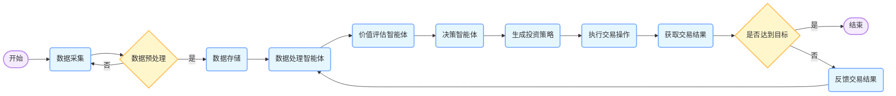

# 基于多智能体的自适应价值投资策略

> 关键词：多智能体系统、自适应策略、价值投资、投资决策、强化学习

> 摘要：本文聚焦于基于多智能体的自适应价值投资策略。首先介绍了该策略产生的背景和相关基本概念，深入探讨了多智能体系统的核心原理和架构，详细阐述了实现该策略的核心算法及具体操作步骤，运用数学模型和公式对策略进行了理论分析并举例说明。通过项目实战展示了代码的实际案例及详细解释。接着探讨了该策略在实际投资场景中的应用，推荐了相关的学习资源、开发工具框架和论文著作。最后总结了该策略的未来发展趋势与挑战，并给出常见问题的解答和扩展阅读及参考资料，旨在为投资者和研究者提供全面且深入的基于多智能体的自适应价值投资策略的知识体系。

## 1. 背景介绍 
### 1.1 目的和范围
在当今复杂多变的金融市场环境中，传统的投资策略往往难以适应市场的快速变化和不确定性。基于多智能体的自适应价值投资策略旨在利用多智能体系统的分布式计算和自适应能力，结合价值投资的核心理念，为投资者提供更加灵活、高效且能适应市场动态变化的投资决策方法。本策略的应用范围涵盖股票、债券、基金等多种金融资产的投资决策，通过智能体之间的协作和竞争，实现对资产价值的准确评估和投资组合的优化。

### 1.2 预期读者
本文预期读者包括金融投资领域的从业者，如投资经理、交易员等，他们可以通过本文了解多智能体技术在投资决策中的应用，为实际投资操作提供新的思路和方法；计算机科学领域的研究者和开发者，他们可以从技术实现的角度深入理解多智能体系统在金融领域的应用，探索相关算法和模型的优化；以及对金融科技感兴趣的学生和爱好者，帮助他们构建对基于多智能体的自适应价值投资策略的全面认识。

### 1.3 文档结构概述
本文首先介绍基于多智能体的自适应价值投资策略的背景信息，包括目的、预期读者和文档结构概述等。接着阐述核心概念与联系，展示多智能体系统的原理和架构。然后详细讲解核心算法原理及具体操作步骤，通过 Python 源代码进行说明。之后运用数学模型和公式对策略进行理论分析并举例。再通过项目实战展示代码的实际案例和详细解释。随后探讨该策略在实际应用场景中的应用。接着推荐相关的学习资源、开发工具框架和论文著作。最后总结未来发展趋势与挑战，给出常见问题的解答和扩展阅读及参考资料。

### 1.4 术语表
#### 1.4.1 核心术语定义
- **多智能体系统（Multi - Agent System，MAS）**：由多个智能体组成的系统，每个智能体具有自主决策和行动的能力，通过与其他智能体的交互和协作来完成共同的任务或实现各自的目标。
- **自适应策略**：能够根据环境的变化自动调整自身行为和决策的策略，以适应不同的市场条件和投资需求。
- **价值投资**：一种基于对资产内在价值的评估进行投资决策的方法，投资者通过分析资产的基本面因素，如财务状况、盈利能力等，寻找被低估的资产进行投资。
- **智能体**：具有感知、决策和行动能力的实体，能够根据自身的知识和环境信息做出决策并采取相应的行动。

#### 1.4.2 相关概念解释
- **分布式计算**：将计算任务分配到多个计算节点上进行并行处理的计算模式，多智能体系统利用分布式计算的思想，使各个智能体能够独立进行计算和决策，提高系统的效率和灵活性。
- **强化学习**：一种机器学习方法，智能体通过与环境进行交互，根据环境反馈的奖励信号来学习最优的行为策略，在基于多智能体的自适应价值投资策略中，强化学习可用于智能体的决策优化。

#### 1.4.3 缩略词列表
- **MAS**：Multi - Agent System（多智能体系统）
- **RL**：Reinforcement Learning（强化学习）

## 2. 核心概念与联系 

### 核心概念原理
多智能体系统的核心原理在于各个智能体的自主性和交互性。每个智能体都有自己的目标和决策机制，它们通过感知环境信息和与其他智能体的通信来获取必要的知识。在基于多智能体的自适应价值投资策略中，不同的智能体可以承担不同的任务，例如有的智能体负责收集和分析市场数据，有的智能体负责评估资产的价值，有的智能体负责执行投资决策等。这些智能体之间通过协作和竞争，不断调整自己的行为，以适应市场的变化。

价值投资的原理是基于资产的内在价值进行投资。投资者通过对资产的基本面分析，如财务报表、行业前景等，来评估资产的真实价值。当资产的市场价格低于其内在价值时，认为该资产被低估，具有投资价值；反之，则认为资产被高估，应谨慎投资。

自适应策略的原理是智能体能够根据环境的变化动态调整自己的决策和行为。在金融市场中，市场环境是不断变化的，如宏观经济数据的发布、政策的调整等。智能体通过感知这些变化，利用强化学习等方法更新自己的策略，以实现最优的投资回报。

### 架构的文本示意图
基于多智能体的自适应价值投资策略的架构主要包括以下几个部分：
1. **数据采集层**：负责收集各种市场数据，如股票价格、财务报表、宏观经济数据等。这些数据将作为智能体决策的依据。
2. **智能体层**：由多个不同功能的智能体组成，包括数据处理智能体、价值评估智能体、决策智能体等。各个智能体之间通过通信机制进行信息交换和协作。
3. **决策层**：根据智能体的决策结果，生成具体的投资策略，如买入、卖出或持有资产等。
4. **执行层**：负责执行决策层生成的投资策略，进行实际的交易操作。
5. **反馈层**：将交易结果反馈给智能体层，智能体根据反馈信息调整自己的策略，实现自适应的过程。

### Mermaid 流程图


## 3. 核心算法原理 & 具体操作步骤 

### 核心算法原理
基于多智能体的自适应价值投资策略主要运用强化学习算法，其中 Q - learning 算法是一种常用的方法。Q - learning 算法的核心思想是通过学习一个动作价值函数 $Q(s,a)$，来表示在状态 $s$ 下采取动作 $a$ 的期望累积奖励。智能体在每个时间步根据当前状态 $s$ 选择一个动作 $a$，执行该动作后进入下一个状态 $s'$，并获得一个奖励 $r$。然后，智能体根据以下更新公式更新 $Q$ 值：

$Q(s,a) \leftarrow Q(s,a) + \alpha [r + \gamma \max_{a'} Q(s',a') - Q(s,a)]$

其中，$\alpha$ 是学习率，控制每次更新的步长；$\gamma$ 是折扣因子，用于权衡当前奖励和未来奖励的重要性。

### 具体操作步骤
1. **初始化**：初始化 $Q$ 表，将所有 $Q(s,a)$ 值设置为 0。设置学习率 $\alpha$ 和折扣因子 $\gamma$。
2. **状态感知**：智能体感知当前的市场状态 $s$，包括资产价格、市场趋势等信息。
3. **动作选择**：根据当前状态 $s$ 和 $Q$ 表，选择一个动作 $a$。可以采用 $\epsilon$ - 贪心策略，即以 $\epsilon$ 的概率随机选择一个动作，以 $1 - \epsilon$ 的概率选择 $Q$ 值最大的动作。
4. **动作执行**：执行选择的动作 $a$，进入下一个状态 $s'$，并获得奖励 $r$。奖励可以根据投资回报、风险等因素进行定义。
5. **Q 值更新**：根据上述更新公式更新 $Q(s,a)$ 值。
6. **重复步骤 2 - 5**：不断重复上述步骤，直到达到终止条件，如达到最大迭代次数或满足投资目标。

### Python 源代码实现
```python
import numpy as np

# 定义 Q - learning 类
class QLearningAgent:
    def __init__(self, state_size, action_size, learning_rate=0.1, discount_factor=0.9):
        self.state_size = state_size
        self.action_size = action_size
        self.learning_rate = learning_rate
        self.discount_factor = discount_factor
        # 初始化 Q 表
        self.q_table = np.zeros((state_size, action_size))

    def choose_action(self, state, epsilon=0.1):
        if np.random.uniform(0, 1) < epsilon:
            # 随机选择动作
            action = np.random.choice(self.action_size)
        else:
            # 选择 Q 值最大的动作
            action = np.argmax(self.q_table[state, :])
        return action

    def update_q_table(self, state, action, reward, next_state):
        # 根据 Q - learning 更新公式更新 Q 表
        max_q_next = np.max(self.q_table[next_state, :])
        self.q_table[state, action] += self.learning_rate * (reward + self.discount_factor * max_q_next - self.q_table[state, action])
```

## 4. 数学模型和公式 & 详细讲解 & 举例说明 

### 数学模型和公式
#### 1. 动作价值函数
动作价值函数 $Q(s,a)$ 表示在状态 $s$ 下采取动作 $a$ 的期望累积奖励。其数学定义为：

$Q(s,a) = \mathbb{E} \left[ \sum_{t = 0}^{\infty} \gamma^t r_{t + 1} | s_0 = s, a_0 = a \right]$

其中，$r_{t + 1}$ 是在时间步 $t + 1$ 获得的奖励，$\gamma \in [0,1]$ 是折扣因子，用于权衡当前奖励和未来奖励的重要性。

#### 2. Q - learning 更新公式
$Q(s,a) \leftarrow Q(s,a) + \alpha [r + \gamma \max_{a'} Q(s',a') - Q(s,a)]$

其中，$\alpha \in [0,1]$ 是学习率，控制每次更新的步长。$r$ 是执行动作 $a$ 后获得的即时奖励，$s'$ 是下一个状态。

### 详细讲解
- **动作价值函数**：动作价值函数 $Q(s,a)$ 反映了在当前状态 $s$ 下采取动作 $a$ 所能获得的长期收益。折扣因子 $\gamma$ 的作用是使得未来的奖励在计算中逐渐衰减，因为未来的奖励具有更大的不确定性。当 $\gamma$ 接近 0 时，智能体更关注即时奖励；当 $\gamma$ 接近 1 时，智能体更关注长期奖励。
- **Q - learning 更新公式**：该公式的核心思想是通过不断更新 $Q$ 值，使得智能体能够学习到最优的动作策略。$r + \gamma \max_{a'} Q(s',a')$ 表示在状态 $s$ 下采取动作 $a$ 后的期望总奖励，$Q(s,a)$ 是当前估计的总奖励。两者的差值乘以学习率 $\alpha$ 就是需要更新的量。

### 举例说明
假设一个简单的投资场景，有两个状态：市场上涨（$s_1$）和市场下跌（$s_2$），有两个动作：买入（$a_1$）和卖出（$a_2$）。初始时，$Q$ 表的值都为 0。

在某个时间步，智能体处于状态 $s_1$，选择动作 $a_1$，执行该动作后进入状态 $s_1$，并获得奖励 $r = 10$。假设学习率 $\alpha = 0.1$，折扣因子 $\gamma = 0.9$。

当前 $Q(s_1,a_1) = 0$，$\max_{a'} Q(s_1,a') = 0$。

根据更新公式：

$Q(s_1,a_1) \leftarrow 0 + 0.1 [10 + 0.9 \times 0 - 0] = 1$

经过多次迭代，$Q$ 表的值会不断更新，智能体逐渐学习到在不同状态下的最优动作。

## 5. 项目实战：代码实际案例和详细解释说明 

### 5.1  开发环境搭建
- **Python 环境**：建议使用 Python 3.7 及以上版本。可以从 Python 官方网站（https://www.python.org/downloads/）下载并安装。
- **开发工具**：推荐使用 PyCharm 或 Jupyter Notebook。PyCharm 是一款功能强大的 Python 集成开发环境，提供了代码编辑、调试、版本控制等丰富的功能；Jupyter Notebook 则适合交互式编程和数据可视化。
- **相关库**：需要安装 `numpy`、`pandas`、`matplotlib` 等库。可以使用 `pip` 命令进行安装：
```sh
pip install numpy pandas matplotlib
```

### 5.2  源代码详细实现和代码解读
```python
import numpy as np
import pandas as pd
import matplotlib.pyplot as plt

# 定义 Q - learning 类
class QLearningAgent:
    def __init__(self, state_size, action_size, learning_rate=0.1, discount_factor=0.9):
        self.state_size = state_size
        self.action_size = action_size
        self.learning_rate = learning_rate
        self.discount_factor = discount_factor
        # 初始化 Q 表
        self.q_table = np.zeros((state_size, action_size))

    def choose_action(self, state, epsilon=0.1):
        if np.random.uniform(0, 1) < epsilon:
            # 随机选择动作
            action = np.random.choice(self.action_size)
        else:
            # 选择 Q 值最大的动作
            action = np.argmax(self.q_table[state, :])
        return action

    def update_q_table(self, state, action, reward, next_state):
        # 根据 Q - learning 更新公式更新 Q 表
        max_q_next = np.max(self.q_table[next_state, :])
        self.q_table[state, action] += self.learning_rate * (reward + self.discount_factor * max_q_next - self.q_table[state, action])

# 模拟市场数据
def generate_market_data(num_steps):
    prices = np.random.randn(num_steps).cumsum() + 100
    return prices

# 定义奖励函数
def get_reward(current_price, next_price, action):
    if action == 0:  # 买入
        if next_price > current_price:
            return 10
        else:
            return -10
    elif action == 1:  # 卖出
        if next_price < current_price:
            return 10
        else:
            return -10

# 主函数
def main():
    num_steps = 100
    state_size = 2  # 简单示例，两个状态：价格上涨和价格下跌
    action_size = 2  # 两个动作：买入和卖出
    agent = QLearningAgent(state_size, action_size)

    market_data = generate_market_data(num_steps)
    total_rewards = []

    for step in range(num_steps - 1):
        current_price = market_data[step]
        next_price = market_data[step + 1]

        # 根据价格变化确定状态
        if next_price > current_price:
            state = 0  # 价格上涨
        else:
            state = 1  # 价格下跌

        # 选择动作
        action = agent.choose_action(state)

        # 计算奖励
        reward = get_reward(current_price, next_price, action)

        # 更新 Q 表
        if next_price > current_price:
            next_state = 0
        else:
            next_state = 1
        agent.update_q_table(state, action, reward, next_state)

        total_rewards.append(reward)

    # 绘制总奖励曲线
    plt.plot(total_rewards)
    plt.xlabel('Step')
    plt.ylabel('Total Reward')
    plt.title('Total Reward over Time')
    plt.show()

if __name__ == "__main__":
    main()
```

### 5.3  代码解读与分析
- **QLearningAgent 类**：实现了 Q - learning 算法的核心功能，包括初始化 Q 表、选择动作和更新 Q 表。
- **generate_market_data 函数**：模拟生成市场数据，这里简单地使用随机数生成价格序列。
- **get_reward 函数**：根据当前价格、下一个价格和动作计算奖励。如果买入后价格上涨或卖出后价格下跌，则获得正奖励；否则获得负奖励。
- **main 函数**：主函数，控制整个投资过程。在每个时间步，根据当前价格确定状态，选择动作，计算奖励，更新 Q 表，并记录总奖励。最后绘制总奖励曲线，展示智能体的学习过程。

通过这个简单的示例，我们可以看到智能体如何通过 Q - learning 算法不断学习，根据市场状态选择最优的投资动作，以获得最大的奖励。

## 6. 实际应用场景 
### 股票投资
在股票投资中，基于多智能体的自适应价值投资策略可以帮助投资者更好地进行选股和择时。不同的智能体可以负责分析不同的股票基本面信息，如财务报表、行业前景等，评估股票的内在价值。同时，智能体可以根据市场的实时变化，如股价波动、成交量等，动态调整投资策略。例如，当市场出现突发利好消息时，智能体可以快速判断哪些股票可能受益，及时调整投资组合，买入相关股票；当市场出现风险信号时，智能体可以迅速卖出风险较高的股票，降低损失。

### 基金投资
对于基金投资，多智能体系统可以对不同类型的基金进行评估和筛选。一些智能体可以负责分析基金的历史业绩、投资风格、基金经理的能力等因素，评估基金的投资价值。另一些智能体可以关注市场的宏观经济环境和行业趋势，根据市场变化调整基金的配置比例。例如，在经济增长预期较强的情况下，增加股票型基金的配置；在经济衰退预期下，增加债券型基金的配置。

### 资产配置
在资产配置方面，基于多智能体的自适应价值投资策略可以综合考虑多种资产的风险和收益特征，实现最优的资产配置。智能体可以根据投资者的风险偏好、投资目标和市场环境，动态调整不同资产的投资比例。例如，对于风险偏好较低的投资者，智能体可以增加债券、现金等低风险资产的配置比例；对于风险偏好较高的投资者，智能体可以适当增加股票、期货等高风险资产的配置比例。同时，智能体可以根据市场的变化及时调整资产配置，以适应不同的市场条件。

## 7. 工具和资源推荐
### 7.1 学习资源推荐
#### 7.1.1 书籍推荐
- 《多智能体系统：原理与编程》：全面介绍了多智能体系统的基本原理、模型和编程实现方法，是学习多智能体系统的经典教材。
- 《价值投资：从格雷厄姆到巴菲特》：深入阐述了价值投资的理论和实践，介绍了价值投资的核心理念和分析方法，是价值投资领域的权威著作。
- 《强化学习：原理与Python实现》：系统讲解了强化学习的基本概念、算法和应用，通过 Python 代码实现了各种强化学习算法，帮助读者更好地理解和应用强化学习。

#### 7.1.2 在线课程
- Coursera 上的“Multi - Agent Systems”课程：由知名高校的教授授课，详细介绍了多智能体系统的理论和应用，提供了丰富的案例和实践项目。
- edX 上的“Reinforcement Learning”课程：深入讲解了强化学习的基本原理和算法，通过在线实验和编程作业，帮助学生掌握强化学习的编程实现。
- 中国大学MOOC上的“金融投资学”课程：系统介绍了金融投资的基本理论和方法，包括股票投资、债券投资、基金投资等内容，适合对金融投资感兴趣的初学者。

#### 7.1.3 技术博客和网站
- Towards Data Science：一个专注于数据科学和机器学习的技术博客，经常发布关于多智能体系统、强化学习等领域的最新研究成果和实践经验。
- ArXiv.org：一个开放的学术论文预印本平台，提供了大量关于多智能体系统、金融科技等领域的最新研究论文。
- 金融界网站：提供了丰富的金融市场信息和投资分析工具，包括股票行情、基金净值、宏观经济数据等，是投资者获取市场信息的重要渠道。

### 7.2 开发工具框架推荐
#### 7.2.1 IDE和编辑器
- PyCharm：一款功能强大的 Python 集成开发环境，提供了代码编辑、调试、版本控制等丰富的功能，适合开发基于 Python 的多智能体系统和投资策略。
- Jupyter Notebook：一种交互式编程环境，支持 Python、R 等多种编程语言，适合进行数据探索、模型训练和可视化展示，方便开发者快速验证和实现投资策略。
- Visual Studio Code：一款轻量级的代码编辑器，支持多种编程语言和插件扩展，具有丰富的代码提示和调试功能，是开发者常用的开发工具之一。

#### 7.2.2 调试和性能分析工具
- PDB：Python 自带的调试工具，通过在代码中设置断点，可以逐步执行代码，查看变量的值和程序的执行流程，帮助开发者定位和解决问题。
- cProfile：Python 的性能分析工具，可以分析程序的运行时间和函数调用次数，帮助开发者找出程序的性能瓶颈，进行优化。
- TensorBoard：一个可视化工具，主要用于 TensorFlow 模型的训练过程监控和可视化展示。在基于强化学习的投资策略开发中，可以使用 TensorBoard 查看智能体的训练过程和性能指标。

#### 7.2.3 相关框架和库
- Mesa：一个用于构建多智能体系统的 Python 框架，提供了丰富的智能体模型和交互机制，方便开发者快速实现多智能体系统的开发。
- OpenAI Gym：一个用于开发和比较强化学习算法的工具包，提供了多种环境和任务，方便开发者进行强化学习算法的测试和验证。
- Pandas：一个强大的数据分析库，提供了数据结构和数据处理工具，适合对金融市场数据进行处理和分析。

### 7.3 相关论文著作推荐
#### 7.3.1 经典论文
- “Multi - Agent Systems: A Modern Approach to Distributed Artificial Intelligence”：该论文系统介绍了多智能体系统的基本概念、模型和应用，是多智能体系统领域的经典文献。
- “Value Investing: The Use of Historical Financial Statement Information to Separate Winners from Losers”：该论文深入研究了价值投资的理论和方法，通过实证分析验证了价值投资策略的有效性。
- “Reinforcement Learning: An Introduction”：该论文是强化学习领域的经典综述论文，全面介绍了强化学习的基本概念、算法和应用。

#### 7.3.2 最新研究成果
- 关注顶级学术会议，如 IJCAI（国际人工智能联合会议）、AAMAS（自治个体和多智能体系统国际会议）等，这些会议上发表的论文反映了多智能体系统和强化学习领域的最新研究成果。
- 查阅相关学术期刊，如《Artificial Intelligence》、《Journal of Financial Economics》等，这些期刊上发表的论文涵盖了多智能体系统、金融科技等领域的前沿研究。

#### 7.3.3 应用案例分析
- 分析一些知名投资机构的投资策略和实践案例，了解他们如何运用多智能体系统和价值投资理念进行投资决策。
- 研究一些金融科技公司的创新产品和服务，如智能投顾平台等，了解他们在投资领域的应用和实践经验。

## 8. 总结：未来发展趋势与挑战
### 未来发展趋势
- **与深度学习的融合**：未来，基于多智能体的自适应价值投资策略将与深度学习技术更加紧密地结合。深度学习可以用于处理复杂的市场数据，如文本数据、图像数据等，提取更有价值的信息。多智能体系统可以利用深度学习的模型和算法，提高智能体的决策能力和适应性。
- **跨领域应用**：该策略将不仅仅局限于金融投资领域，还将在其他领域得到广泛应用，如供应链管理、智能交通、医疗保健等。在这些领域中，多智能体系统可以通过自适应的决策和协作，优化资源配置，提高系统的效率和性能。
- **智能化和自动化**：随着人工智能技术的不断发展，基于多智能体的自适应价值投资策略将更加智能化和自动化。智能体可以自动感知市场变化，实时调整投资策略，实现无人值守的投资决策。

### 挑战
- **数据质量和隐私问题**：金融市场数据的质量和隐私是一个重要的挑战。不准确或不完整的数据可能导致智能体做出错误的决策，而数据隐私问题则涉及到投资者的个人信息和商业机密的保护。
- **模型可解释性**：基于多智能体和强化学习的投资策略模型往往具有较高的复杂性，其决策过程难以解释。在实际应用中，投资者和监管机构需要了解模型的决策依据，以确保投资决策的合理性和合法性。
- **市场不确定性**：金融市场具有高度的不确定性，市场变化难以预测。智能体需要不断适应市场的变化，提高自身的抗风险能力。同时，如何在复杂多变的市场环境中实现稳定的投资回报，是该策略面临的一个重要挑战。

## 9. 附录：常见问题与解答
### 1. 多智能体系统在投资决策中的优势是什么？
多智能体系统在投资决策中的优势主要包括：分布式计算能力，能够同时处理大量的市场数据；自适应能力，智能体可以根据市场变化动态调整决策；协作和竞争机制，不同智能体之间可以通过协作和竞争，提高决策的准确性和效率。

### 2. 如何确定 Q - learning 算法中的学习率和折扣因子？
学习率和折扣因子的确定通常需要通过实验和调优。学习率控制每次更新的步长，过大的学习率可能导致算法无法收敛，过小的学习率则会导致学习速度过慢。折扣因子权衡当前奖励和未来奖励的重要性，通常取值在 0.9 左右。可以通过网格搜索等方法，在一定范围内尝试不同的学习率和折扣因子组合，选择性能最优的参数。

### 3. 基于多智能体的自适应价值投资策略的风险如何控制？
可以通过多种方式控制风险，如设置止损点，当投资损失达到一定程度时，及时卖出资产；进行资产分散投资，降低单一资产的风险；智能体可以根据市场的风险指标，动态调整投资组合的风险水平。

### 4. 该策略在实际应用中需要考虑哪些因素？
在实际应用中，需要考虑市场数据的准确性和及时性、智能体的计算能力和通信效率、投资策略的合规性等因素。同时，还需要根据投资者的风险偏好和投资目标，对策略进行个性化的调整和优化。

## 10. 扩展阅读 & 参考资料
### 扩展阅读
- 《人工智能：一种现代的方法》：全面介绍了人工智能的基本概念、算法和应用，涵盖了多智能体系统、机器学习、自然语言处理等多个领域，是学习人工智能的经典教材。
- 《金融科技：发展趋势与监管》：探讨了金融科技的发展趋势和监管问题，介绍了金融科技在支付、信贷、投资等领域的应用，帮助读者了解金融科技的最新发展动态。
- 《复杂系统与复杂性科学》：介绍了复杂系统的基本概念、理论和方法，探讨了复杂系统在经济、社会、生态等领域的应用，有助于读者从更宏观的角度理解多智能体系统和金融市场的复杂性。

### 参考资料
- 相关学术论文和研究报告，如发表在《Journal of Financial Economics》、《Artificial Intelligence》等期刊上的论文。
- 金融市场数据提供商的官方网站，如 Wind 资讯、东方财富网等，获取准确的金融市场数据。
- 开源代码库，如 GitHub 上的相关项目，参考其他开发者的实现和经验。