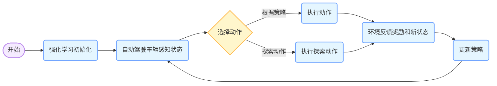

# 基于强化学习的AI自动驾驶车队协同控制系统

> 关键词：强化学习、AI自动驾驶、车队协同控制、智能交通、马尔可夫决策过程

> 摘要：本文聚焦于基于强化学习的AI自动驾驶车队协同控制系统。随着自动驾驶技术的发展，车队协同控制对于提高交通效率、降低能耗和提升交通安全具有重要意义。强化学习作为一种能够让智能体通过与环境交互学习最优策略的方法，为自动驾驶车队协同控制提供了有效的解决方案。文章详细介绍了该系统的背景、核心概念、算法原理、数学模型，通过实际项目案例展示了系统的实现过程，探讨了其实际应用场景，推荐了相关的学习资源、开发工具和论文著作，最后对系统的未来发展趋势与挑战进行了总结，并给出常见问题解答和扩展阅读参考资料。

## 1. 背景介绍 
### 1.1 目的和范围
本研究旨在开发一种基于强化学习的AI自动驾驶车队协同控制系统，以提高自动驾驶车队的整体性能。具体目标包括优化车队的行驶效率，如减少行驶时间、提高道路利用率；降低能耗，通过合理的速度规划和跟车策略减少车辆的能量消耗；增强交通安全，避免碰撞和其他交通事故的发生。研究范围涵盖了从理论模型的建立到实际系统的开发和测试，涉及强化学习算法的设计、自动驾驶车辆的动力学建模、车队协同策略的制定等多个方面。

### 1.2 预期读者
本文的预期读者包括从事自动驾驶、智能交通、强化学习等领域的研究人员和工程师，他们希望深入了解基于强化学习的自动驾驶车队协同控制技术的原理和实现方法。同时，对于对智能交通系统发展感兴趣的行业从业者、政策制定者和学生也具有一定的参考价值。

### 1.3 文档结构概述
本文将按照以下结构进行组织：首先介绍系统的背景信息，包括目的、预期读者和文档结构概述；接着阐述核心概念，包括强化学习、自动驾驶和车队协同控制的原理和它们之间的联系，并给出相应的文本示意图和Mermaid流程图；然后详细讲解核心算法原理和具体操作步骤，使用Python源代码进行阐述；之后介绍数学模型和公式，并通过具体例子进行说明；再通过实际项目案例展示系统的开发过程，包括开发环境搭建、源代码实现和代码解读；探讨系统的实际应用场景；推荐相关的学习资源、开发工具和论文著作；最后总结系统的未来发展趋势与挑战，给出常见问题解答和扩展阅读参考资料。

### 1.4 术语表
#### 1.4.1 核心术语定义
- **强化学习（Reinforcement Learning）**：一种机器学习方法，智能体通过与环境进行交互，根据环境反馈的奖励信号来学习最优策略，以最大化长期累积奖励。
- **自动驾驶（Autonomous Driving）**：车辆在不需要人类驾驶员干预的情况下，依靠车载传感器、算法和控制系统实现自主行驶的技术。
- **车队协同控制（Fleet Cooperative Control）**：多个自动驾驶车辆组成的车队，通过信息交互和协同策略，实现高效、安全行驶的控制方法。
- **智能体（Agent）**：在强化学习中，能够感知环境状态、执行动作并根据奖励信号进行学习的实体，在自动驾驶车队中可以看作是每一辆自动驾驶车辆。
- **状态（State）**：环境在某一时刻的特征描述，对于自动驾驶车队，状态可以包括车辆的位置、速度、加速度等信息。
- **动作（Action）**：智能体在某一状态下可以执行的操作，例如车辆的加速、减速、转向等。
- **奖励（Reward）**：环境在智能体执行动作后给予的反馈信号，用于评价动作的好坏，引导智能体学习最优策略。

#### 1.4.2 相关概念解释
- **马尔可夫决策过程（Markov Decision Process, MDP）**：是强化学习的理论基础，描述了一个具有马尔可夫性质的决策过程。在MDP中，智能体的决策只依赖于当前状态，而与历史状态无关。
- **策略（Policy）**：智能体根据当前状态选择动作的规则，通常用 $\pi(s)$ 表示，其中 $s$ 是状态。
- **值函数（Value Function）**：用于评估在某一状态下采取某种策略所能获得的长期累积奖励，包括状态值函数 $V^{\pi}(s)$ 和动作值函数 $Q^{\pi}(s,a)$。

#### 1.4.3 缩略词列表
- **MDP**：Markov Decision Process（马尔可夫决策过程）
- **DQN**：Deep Q-Network（深度Q网络）
- **PPO**：Proximal Policy Optimization（近端策略优化）

## 2. 核心概念与联系 

### 核心概念原理
#### 强化学习原理
强化学习的核心思想是智能体通过与环境进行交互，不断尝试不同的动作，并根据环境给予的奖励信号来调整自己的策略，以最大化长期累积奖励。智能体在每个时间步 $t$ 感知环境的状态 $s_t$，根据当前策略 $\pi$ 选择一个动作 $a_t$ 执行，环境在执行动作后转移到新的状态 $s_{t+1}$，并给予智能体一个奖励 $r_t$。智能体的目标是学习一个最优策略 $\pi^*$，使得长期累积奖励 $R = \sum_{t=0}^{T} \gamma^t r_t$ 最大化，其中 $\gamma$ 是折扣因子，用于权衡当前奖励和未来奖励的重要性。

#### 自动驾驶原理
自动驾驶技术主要依赖于车载传感器（如激光雷达、摄像头、毫米波雷达等）来感知车辆周围的环境信息，包括道路状况、其他车辆和行人的位置等。然后，通过算法对传感器数据进行处理和分析，做出决策，如规划行驶路径、控制车辆的速度和转向等。最后，通过车辆的执行系统（如发动机、刹车、转向系统等）实现决策的执行。

#### 车队协同控制原理
车队协同控制的目标是使多个自动驾驶车辆组成的车队能够高效、安全地行驶。车队中的车辆通过车与车（V2V）和车与基础设施（V2I）通信技术进行信息交互，共享各自的状态信息（如位置、速度、加速度等）。基于这些信息，车队可以制定协同策略，如保持合适的车间距、协调加速和减速等，以提高车队的整体性能。

### 核心概念联系
强化学习为自动驾驶车队协同控制提供了一种有效的决策方法。通过将自动驾驶车队的协同控制问题建模为一个强化学习问题，每个车辆可以作为一个智能体，根据当前的车队状态选择合适的动作。环境（即交通环境）根据车辆的动作给予奖励，智能体通过不断学习来优化自己的策略，从而实现车队的协同控制。

### 文本示意图
```plaintext
              +----------------+
              |  强化学习      |
              |                |
              |  策略学习      |
              +----------------+
                     |
                     |  应用于
                     v
 +------------------------+
 |  自动驾驶车队协同控制 |
 |                        |
 |  车辆状态感知         |
 |  动作决策             |
 |  信息交互             |
 +------------------------+
                     |
                     |  依赖于
                     v
              +----------------+
              |  自动驾驶技术  |
              |                |
              |  传感器感知    |
              |  路径规划      |
              |  执行控制      |
              +----------------+
```

### Mermaid流程图


## 3. 核心算法原理 & 具体操作步骤 

### 核心算法原理：深度Q网络（DQN）
深度Q网络（DQN）是一种结合了深度学习和Q学习的强化学习算法，用于解决高维状态空间下的强化学习问题。其核心思想是使用一个深度神经网络来近似动作值函数 $Q(s,a)$，通过不断优化网络参数来学习最优策略。

DQN的目标是最小化损失函数 $L(\theta)$，定义为：
$$L(\theta) = \mathbb{E}_{(s,a,r,s') \sim U(D)} [(r + \gamma \max_{a'} Q(s',a';\theta^-) - Q(s,a;\theta))^2]$$
其中，$\theta$ 是当前Q网络的参数，$\theta^-$ 是目标Q网络的参数，$D$ 是经验回放缓冲区，$U(D)$ 表示从经验回放缓冲区中均匀采样。

### 具体操作步骤
#### 1. 初始化
- 初始化Q网络 $Q(s,a;\theta)$ 和目标Q网络 $Q(s,a;\theta^-)$，并将 $\theta^-$ 初始化为 $\theta$。
- 初始化经验回放缓冲区 $D$，用于存储智能体的经验 $(s,a,r,s')$。

#### 2. 智能体与环境交互
- 在每个时间步 $t$，智能体感知环境状态 $s_t$。
- 根据 $\epsilon$-贪心策略选择动作 $a_t$：
  - 以概率 $\epsilon$ 随机选择一个动作。
  - 以概率 $1 - \epsilon$ 选择 $Q(s_t,a;\theta)$ 值最大的动作。
- 执行动作 $a_t$，环境转移到新的状态 $s_{t+1}$，并给予奖励 $r_t$。
- 将经验 $(s_t,a_t,r_t,s_{t+1})$ 存储到经验回放缓冲区 $D$ 中。

#### 3. 经验回放
- 从经验回放缓冲区 $D$ 中随机采样一批经验 $(s,a,r,s')$。
- 计算目标值 $y = r + \gamma \max_{a'} Q(s',a';\theta^-)$。
- 计算损失函数 $L(\theta)$，并使用梯度下降法更新Q网络的参数 $\theta$。

#### 4. 目标网络更新
- 每隔一定的时间步，将目标Q网络的参数 $\theta^-$ 更新为当前Q网络的参数 $\theta$。

### Python源代码实现
```python
import torch
import torch.nn as nn
import torch.optim as optim
import numpy as np
import random

# 定义Q网络
class QNetwork(nn.Module):
    def __init__(self, state_size, action_size):
        super(QNetwork, self).__init__()
        self.fc1 = nn.Linear(state_size, 64)
        self.fc2 = nn.Linear(64, 64)
        self.fc3 = nn.Linear(64, action_size)

    def forward(self, x):
        x = torch.relu(self.fc1(x))
        x = torch.relu(self.fc2(x))
        return self.fc3(x)

# 定义DQN智能体
class DQNAgent:
    def __init__(self, state_size, action_size):
        self.state_size = state_size
        self.action_size = action_size
        self.memory = []
        self.gamma = 0.95  # 折扣因子
        self.epsilon = 1.0  # 探索率
        self.epsilon_min = 0.01
        self.epsilon_decay = 0.995
        self.learning_rate = 0.001
        self.model = QNetwork(state_size, action_size)
        self.target_model = QNetwork(state_size, action_size)
        self.optimizer = optim.Adam(self.model.parameters(), lr=self.learning_rate)
        self.criterion = nn.MSELoss()

    def remember(self, state, action, reward, next_state):
        self.memory.append((state, action, reward, next_state))

    def act(self, state):
        if np.random.rand() <= self.epsilon:
            return random.randrange(self.action_size)
        state = torch.FloatTensor(state).unsqueeze(0)
        q_values = self.model(state)
        action = torch.argmax(q_values).item()
        return action

    def replay(self, batch_size):
        if len(self.memory) < batch_size:
            return
        minibatch = random.sample(self.memory, batch_size)
        for state, action, reward, next_state in minibatch:
            state = torch.FloatTensor(state).unsqueeze(0)
            next_state = torch.FloatTensor(next_state).unsqueeze(0)
            target = reward + self.gamma * torch.max(self.target_model(next_state)).item()
            target_f = self.model(state)
            target_f[0][action] = target
            self.optimizer.zero_grad()
            loss = self.criterion(self.model(state), target_f)
            loss.backward()
            self.optimizer.step()
        if self.epsilon > self.epsilon_min:
            self.epsilon *= self.epsilon_decay

    def update_target_model(self):
        self.target_model.load_state_dict(self.model.state_dict())
```

## 4. 数学模型和公式 & 详细讲解 & 举例说明 

### 马尔可夫决策过程（MDP）
马尔可夫决策过程是一个五元组 $(S, A, P, R, \gamma)$，其中：
- $S$ 是状态空间，表示环境所有可能的状态集合。
- $A$ 是动作空间，表示智能体在每个状态下可以执行的动作集合。
- $P(s'|s,a)$ 是状态转移概率，表示在状态 $s$ 执行动作 $a$ 后转移到状态 $s'$ 的概率。
- $R(s,a,s')$ 是奖励函数，表示在状态 $s$ 执行动作 $a$ 转移到状态 $s'$ 时获得的奖励。
- $\gamma \in [0,1]$ 是折扣因子，用于权衡当前奖励和未来奖励的重要性。

### 值函数
#### 状态值函数
状态值函数 $V^{\pi}(s)$ 表示在状态 $s$ 下遵循策略 $\pi$ 所能获得的长期累积奖励的期望，定义为：
$$V^{\pi}(s) = \mathbb{E}_{\pi} \left[ \sum_{t=0}^{\infty} \gamma^t r_t \mid s_0 = s \right]$$

#### 动作值函数
动作值函数 $Q^{\pi}(s,a)$ 表示在状态 $s$ 执行动作 $a$ 后遵循策略 $\pi$ 所能获得的长期累积奖励的期望，定义为：
$$Q^{\pi}(s,a) = \mathbb{E}_{\pi} \left[ \sum_{t=0}^{\infty} \gamma^t r_t \mid s_0 = s, a_0 = a \right]$$

### 贝尔曼方程
#### 状态值函数的贝尔曼方程
$$V^{\pi}(s) = \sum_{a \in A} \pi(a|s) \sum_{s' \in S} P(s'|s,a) [R(s,a,s') + \gamma V^{\pi}(s')]$$

#### 动作值函数的贝尔曼方程
$$Q^{\pi}(s,a) = \sum_{s' \in S} P(s'|s,a) [R(s,a,s') + \gamma \sum_{a' \in A} \pi(a'|s') Q^{\pi}(s',a')]$$

### 最优值函数和最优策略
最优状态值函数 $V^*(s)$ 和最优动作值函数 $Q^*(s,a)$ 分别定义为：
$$V^*(s) = \max_{\pi} V^{\pi}(s)$$
$$Q^*(s,a) = \max_{\pi} Q^{\pi}(s,a)$$

最优策略 $\pi^*$ 可以通过最优动作值函数得到：
$$\pi^*(a|s) = \begin{cases} 1, & \text{if } a = \arg \max_{a'} Q^*(s,a') \\ 0, & \text{otherwise} \end{cases}$$

### 举例说明
假设一个简单的自动驾驶车队场景，车辆可以处于三种状态：$S = \{s_1, s_2, s_3\}$，分别表示车辆距离前车较近、适中、较远；车辆可以执行两种动作：$A = \{a_1, a_2\}$，分别表示加速和减速。状态转移概率 $P(s'|s,a)$ 和奖励函数 $R(s,a,s')$ 如下表所示：

| $s$ | $a$ | $s'$ | $P(s'|s,a)$ | $R(s,a,s')$ |
| --- | --- | --- | --- | --- |
| $s_1$ | $a_1$ | $s_1$ | 0.2 | -10 |
| $s_1$ | $a_1$ | $s_2$ | 0.8 | 10 |
| $s_1$ | $a_2$ | $s_1$ | 0.9 | 5 |
| $s_1$ | $a_2$ | $s_2$ | 0.1 | 3 |
| $s_2$ | $a_1$ | $s_1$ | 0.1 | -5 |
| $s_2$ | $a_1$ | $s_2$ | 0.7 | 15 |
| $s_2$ | $a_1$ | $s_3$ | 0.2 | 8 |
| $s_2$ | $a_2$ | $s_1$ | 0.2 | -3 |
| $s_2$ | $a_2$ | $s_2$ | 0.8 | 12 |
| $s_3$ | $a_1$ | $s_2$ | 0.8 | 12 |
| $s_3$ | $a_1$ | $s_3$ | 0.2 | 10 |
| $s_3$ | $a_2$ | $s_3$ | 0.9 | 8 |

假设折扣因子 $\gamma = 0.9$，我们可以使用贝尔曼方程来计算状态值函数和动作值函数。

首先，初始化 $V^{\pi}(s)$ 为 0，然后迭代更新：
$$V^{\pi}(s) = \sum_{a \in A} \pi(a|s) \sum_{s' \in S} P(s'|s,a) [R(s,a,s') + \gamma V^{\pi}(s')]$$

假设策略 $\pi$ 是随机策略，即 $\pi(a|s) = 0.5$ 对于所有 $s \in S$ 和 $a \in A$。

第一次迭代：
- 对于 $s = s_1$：
  - 当 $a = a_1$：
    - $\sum_{s' \in S} P(s'|s_1,a_1) [R(s_1,a_1,s') + \gamma V^{\pi}(s')] = 0.2 \times (-10 + 0.9 \times 0) + 0.8 \times (10 + 0.9 \times 0) = -2 + 8 = 6$
  - 当 $a = a_2$：
    - $\sum_{s' \in S} P(s'|s_1,a_2) [R(s_1,a_2,s') + \gamma V^{\pi}(s')] = 0.9 \times (5 + 0.9 \times 0) + 0.1 \times (3 + 0.9 \times 0) = 4.5 + 0.3 = 4.8$
  - $V^{\pi}(s_1) = 0.5 \times 6 + 0.5 \times 4.8 = 5.4$

- 对于 $s = s_2$ 和 $s = s_3$ 同理计算。

经过多次迭代，$V^{\pi}(s)$ 会收敛到一个稳定的值，从而得到该策略下的状态值函数。

## 5. 项目实战：代码实际案例和详细解释说明 

### 5.1  开发环境搭建
#### 硬件环境
- 一台性能较好的计算机，建议具备多核CPU和NVIDIA GPU（用于加速深度学习训练）。
- 可以使用模拟器来模拟自动驾驶车队的环境，如SUMO（Simulation of Urban MObility）。

#### 软件环境
- 操作系统：Ubuntu 18.04或更高版本。
- Python版本：Python 3.7或更高版本。
- 深度学习框架：PyTorch 1.7或更高版本。
- 其他依赖库：NumPy、Matplotlib等。

### 安装步骤
1. 安装Python：可以从Python官方网站下载并安装Python 3.7或更高版本。
2. 安装PyTorch：根据自己的CUDA版本和操作系统，从PyTorch官方网站选择合适的安装命令进行安装。例如，对于CUDA 11.1和Ubuntu系统，可以使用以下命令：
```bash
pip install torch torchvision torchaudio --extra-index-url https://download.pytorch.org/whl/cu111
```
3. 安装其他依赖库：
```bash
pip install numpy matplotlib
```
4. 安装SUMO模拟器：可以从SUMO官方网站下载并安装SUMO，或者使用包管理器进行安装。例如，在Ubuntu系统上可以使用以下命令：
```bash
sudo add-apt-repository ppa:sumo/stable
sudo apt-get update
sudo apt-get install sumo sumo-tools sumo-doc
```

### 5.2  源代码详细实现和代码解读
以下是一个基于PyTorch和SUMO的自动驾驶车队协同控制项目的示例代码：

```python
import traci
import torch
import numpy as np
from collections import deque
import random

# 定义Q网络
class QNetwork(torch.nn.Module):
    def __init__(self, state_size, action_size):
        super(QNetwork, self).__init__()
        self.fc1 = torch.nn.Linear(state_size, 64)
        self.fc2 = torch.nn.Linear(64, 64)
        self.fc3 = torch.nn.Linear(64, action_size)

    def forward(self, x):
        x = torch.relu(self.fc1(x))
        x = torch.relu(self.fc2(x))
        return self.fc3(x)

# 定义DQN智能体
class DQNAgent:
    def __init__(self, state_size, action_size):
        self.state_size = state_size
        self.action_size = action_size
        self.memory = deque(maxlen=2000)
        self.gamma = 0.95  # 折扣因子
        self.epsilon = 1.0  # 探索率
        self.epsilon_min = 0.01
        self.epsilon_decay = 0.995
        self.learning_rate = 0.001
        self.model = QNetwork(state_size, action_size)
        self.target_model = QNetwork(state_size, action_size)
        self.optimizer = torch.optim.Adam(self.model.parameters(), lr=self.learning_rate)
        self.criterion = torch.nn.MSELoss()

    def remember(self, state, action, reward, next_state):
        self.memory.append((state, action, reward, next_state))

    def act(self, state):
        if np.random.rand() <= self.epsilon:
            return random.randrange(self.action_size)
        state = torch.FloatTensor(state).unsqueeze(0)
        q_values = self.model(state)
        action = torch.argmax(q_values).item()
        return action

    def replay(self, batch_size):
        if len(self.memory) < batch_size:
            return
        minibatch = random.sample(self.memory, batch_size)
        for state, action, reward, next_state in minibatch:
            state = torch.FloatTensor(state).unsqueeze(0)
            next_state = torch.FloatTensor(next_state).unsqueeze(0)
            target = reward + self.gamma * torch.max(self.target_model(next_state)).item()
            target_f = self.model(state)
            target_f[0][action] = target
            self.optimizer.zero_grad()
            loss = self.criterion(self.model(state), target_f)
            loss.backward()
            self.optimizer.step()
        if self.epsilon > self.epsilon_min:
            self.epsilon *= self.epsilon_decay

    def update_target_model(self):
        self.target_model.load_state_dict(self.model.state_dict())

# 定义SUMO环境交互函数
def sumo_step(vehicles, actions):
    for i, vehicle in enumerate(vehicles):
        if actions[i] == 0:
            traci.vehicle.slowDown(vehicle, traci.vehicle.getSpeed(vehicle) - 1, 1)
        elif actions[i] == 1:
            traci.vehicle.slowDown(vehicle, traci.vehicle.getSpeed(vehicle) + 1, 1)
    traci.simulationStep()
    next_states = []
    rewards = []
    for vehicle in vehicles:
        speed = traci.vehicle.getSpeed(vehicle)
        distance = traci.vehicle.getDistance(vehicle)
        state = [speed, distance]
        next_states.append(state)
        # 简单的奖励函数：速度适中且与前车保持安全距离
        if 20 <= speed <= 30:
            reward = 1
        else:
            reward = -1
        rewards.append(reward)
    return next_states, rewards

# 主训练函数
def train():
    # 启动SUMO模拟器
    sumo_binary = "sumo-gui"
    sumo_config = "path/to/your/sumo/config.sumocfg"
    traci.start([sumo_binary, "-c", sumo_config])

    # 初始化车辆列表
    vehicles = traci.vehicle.getIDList()
    state_size = 2  # 速度和距离
    action_size = 2  # 减速和加速
    agents = [DQNAgent(state_size, action_size) for _ in vehicles]

    num_episodes = 100
    batch_size = 32

    for episode in range(num_episodes):
        states = []
        for vehicle in vehicles:
            speed = traci.vehicle.getSpeed(vehicle)
            distance = traci.vehicle.getDistance(vehicle)
            state = [speed, distance]
            states.append(state)

        total_rewards = [0] * len(vehicles)

        while traci.simulation.getMinExpectedNumber() > 0:
            actions = []
            for i, agent in enumerate(agents):
                action = agent.act(states[i])
                actions.append(action)

            next_states, rewards = sumo_step(vehicles, actions)

            for i, agent in enumerate(agents):
                agent.remember(states[i], actions[i], rewards[i], next_states[i])
                agent.replay(batch_size)
                total_rewards[i] += rewards[i]

            states = next_states

        for agent in agents:
            agent.update_target_model()

        print(f"Episode {episode + 1}: Total rewards = {total_rewards}")

    traci.close()

if __name__ == "__main__":
    train()
```

### 代码解读
1. **Q网络定义**：`QNetwork` 类定义了一个简单的三层全连接神经网络，用于近似动作值函数。
2. **DQN智能体定义**：`DQNAgent` 类实现了DQN算法的核心逻辑，包括经验回放、动作选择和网络更新等。
3. **SUMO环境交互函数**：`sumo_step` 函数用于与SUMO模拟器进行交互，执行车辆的动作并获取下一个状态和奖励。
4. **主训练函数**：`train` 函数是主训练循环，初始化车辆列表和智能体，在每个episode中与SUMO模拟器进行交互，更新智能体的策略。

### 5.3  代码解读与分析
#### 优点
- **模块化设计**：代码采用了模块化设计，将Q网络、DQN智能体和SUMO环境交互等功能分别封装在不同的类和函数中，提高了代码的可读性和可维护性。
- **经验回放**：使用经验回放机制可以打破数据之间的相关性，提高训练的稳定性和效率。
- **目标网络**：使用目标网络可以减少训练过程中的波动，提高算法的收敛性。

#### 缺点
- **简单的奖励函数**：代码中使用的奖励函数比较简单，只考虑了车辆的速度，没有充分考虑车队的协同和交通安全等因素。
- **缺乏环境适应性**：代码没有考虑不同的交通场景和环境变化，在实际应用中可能需要进行改进。

#### 改进建议
- **设计更复杂的奖励函数**：考虑车辆之间的间距、车队的整体速度和行驶效率等因素，设计更合理的奖励函数。
- **引入环境感知和自适应策略**：使用更多的传感器数据和机器学习算法，使智能体能够根据不同的交通场景和环境变化自适应地调整策略。

## 6. 实际应用场景 
### 高速公路场景
在高速公路上，自动驾驶车队协同控制系统可以发挥重要作用。车队中的车辆可以通过协同控制保持合适的车间距，形成紧密的车队行驶，提高道路利用率。同时，通过统一的速度规划和加速减速策略，可以减少车辆的加减速次数，降低能耗。例如，在交通流量较大的情况下，车队可以根据前方路况和交通信号进行协同调整，避免急刹车和频繁变道，提高交通的流畅性和安全性。

### 物流运输场景
在物流运输中，自动驾驶车队可以实现货物的高效运输。车队协同控制系统可以根据货物的目的地和交货时间，合理规划行驶路线和速度。同时，通过车辆之间的信息共享和协同控制，可以实现货物的快速装卸和转运。例如，多个自动驾驶货车组成的车队可以在仓库和配送中心之间进行协同运输，提高物流效率，降低运输成本。

### 公共交通场景
在公共交通领域，自动驾驶车队协同控制系统可以用于公交车、有轨电车等公共交通工具的运营。车队可以根据乘客的需求和交通状况进行实时调度和协同控制，提高公共交通的服务质量和效率。例如，公交车队可以根据站点的客流量和线路的拥堵情况，动态调整发车间隔和行驶速度，减少乘客的等待时间。

### 智能园区场景
在智能园区内，自动驾驶车队可以用于人员和物资的运输。车队协同控制系统可以根据园区内的道路布局和交通规则，实现车辆的高效运行。例如，在工业园区内，自动驾驶叉车可以组成车队进行货物的搬运和存储，提高物流效率；在校园内，自动驾驶摆渡车可以组成车队为师生提供便捷的交通服务。

## 7. 工具和资源推荐
### 7.1 学习资源推荐
#### 7.1.1 书籍推荐
- 《Reinforcement Learning: An Introduction》（第二版）：由Richard S. Sutton和Andrew G. Barto所著，是强化学习领域的经典教材，全面介绍了强化学习的基本概念、算法和应用。
- 《Deep Reinforcement Learning Hands-On》（第二版）：由Max Lapan所著，通过实际案例和代码示例，详细介绍了深度强化学习的算法和应用，包括DQN、A2C、PPO等。
- 《Autonomous Driving: Foundations, Methods, and Systems》：由Shuo Feng和John M. Dolan所著，系统介绍了自动驾驶的基础理论、方法和系统架构，涵盖了感知、决策、规划和控制等方面。

#### 7.1.2 在线课程
- Coursera上的“Reinforcement Learning Specialization”：由University of Alberta提供，包括四门课程，从基础的强化学习概念到高级的深度强化学习算法，适合初学者和有一定基础的学习者。
- edX上的“Artificial Intelligence for Robotics”：由UC Berkeley提供，介绍了人工智能在机器人领域的应用，包括自动驾驶、机器人导航等，涉及强化学习等相关算法。
- Udemy上的“Complete Self-Driving Car Course - Applied Deep Learning”：通过实际项目和代码示例，介绍了自动驾驶的各个方面，包括感知、决策和控制，使用了TensorFlow和Keras等深度学习框架。

#### 7.1.3 技术博客和网站
- OpenAI Blog：OpenAI官方博客，提供了强化学习和人工智能领域的最新研究成果和技术进展。
- DeepMind Blog：DeepMind官方博客，发布了许多关于深度强化学习和人工智能的重要研究和应用案例。
- Towards Data Science：一个专注于数据科学和人工智能的技术博客平台，有许多关于强化学习和自动驾驶的优质文章。

### 7.2 开发工具框架推荐
#### 7.2.1 IDE和编辑器
- PyCharm：一款专业的Python集成开发环境，提供了代码编辑、调试、版本控制等功能，适合Python项目的开发。
- Visual Studio Code：一款轻量级的代码编辑器，支持多种编程语言和插件扩展，具有丰富的代码编辑和调试功能。
- Jupyter Notebook：一种交互式的开发环境，适合进行数据分析、模型训练和代码演示，支持Python、R等多种编程语言。

#### 7.2.2 调试和性能分析工具
- TensorBoard：TensorFlow的可视化工具，可以用于可视化模型的训练过程、损失函数和指标等，帮助调试和优化模型。
- PyTorch Profiler：PyTorch的性能分析工具，可以分析模型的运行时间、内存使用等情况，帮助发现性能瓶颈。
- SUMO Debugger：SUMO模拟器自带的调试工具，可以用于调试和分析交通仿真模型。

#### 7.2.3 相关框架和库
- PyTorch：一个开源的深度学习框架，提供了丰富的深度学习模型和算法实现，支持GPU加速，适合强化学习和自动驾驶等领域的开发。
- TensorFlow：另一个流行的深度学习框架，具有强大的分布式训练和模型部署能力，广泛应用于人工智能和机器学习领域。
- SUMO：一个开源的交通仿真模拟器，支持多种交通场景的建模和仿真，可用于自动驾驶车队协同控制的测试和验证。

### 7.3 相关论文著作推荐
#### 7.3.1 经典论文
- “Human-level control through deep reinforcement learning”：由DeepMind团队发表在Nature杂志上的论文，介绍了深度Q网络（DQN）算法，实现了在Atari游戏上的人类水平控制。
- “Proximal Policy Optimization Algorithms”：由OpenAI团队发表的论文，提出了近端策略优化（PPO）算法，是一种高效的策略梯度算法。
- “Cooperative Adaptive Cruise Control in Real Traffic Situations”：研究了协同自适应巡航控制（CACC）在实际交通场景中的应用，为自动驾驶车队协同控制提供了理论基础。

#### 7.3.2 最新研究成果
- 关注IEEE Transactions on Intelligent Transportation Systems、Journal of Field Robotics等期刊，以及NeurIPS、ICML、CVPR等顶级学术会议，获取自动驾驶和强化学习领域的最新研究成果。

#### 7.3.3 应用案例分析
- 一些实际的自动驾驶项目和案例研究，如Waymo、Tesla等公司的自动驾驶技术报告和论文，分析它们在自动驾驶车队协同控制方面的实践经验和技术创新。

## 8. 总结：未来发展趋势与挑战
### 未来发展趋势
#### 更复杂的协同策略
未来的自动驾驶车队协同控制系统将能够处理更复杂的交通场景和任务，例如多车道变道、交叉路口通行等。通过引入更高级的强化学习算法和多智能体协同技术，车队可以实现更高效、更灵活的协同控制。

#### 与智能交通系统的深度融合
自动驾驶车队协同控制系统将与智能交通系统（ITS）进行深度融合，实现车辆与基础设施、车辆与车辆之间的实时信息交互和协同决策。例如，通过与交通信号灯、路边传感器等基础设施的通信，车队可以提前获取交通信息，优化行驶策略。

#### 结合其他技术
将强化学习与其他技术如计算机视觉、传感器融合、深度学习等相结合，提高自动驾驶车队的感知能力和决策准确性。例如，利用计算机视觉技术识别道路标志和障碍物，为强化学习提供更丰富的状态信息。

#### 大规模应用
随着技术的不断成熟和成本的降低，自动驾驶车队协同控制系统将在更多的场景中得到大规模应用，如物流运输、公共交通、智能园区等，为社会带来更高效、更安全的交通解决方案。

### 挑战
#### 安全性和可靠性
自动驾驶车队的安全性和可靠性是首要挑战。强化学习算法在某些情况下可能会产生不稳定的决策，导致交通事故的发生。因此，需要开发更加安全可靠的算法和验证方法，确保系统在各种复杂场景下都能正常运行。

#### 数据隐私和安全
自动驾驶车队协同控制需要大量的车辆和交通数据，这些数据涉及用户的隐私和安全。如何保护数据的隐私和安全，防止数据泄露和恶意攻击，是一个亟待解决的问题。

#### 法规和标准
目前，自动驾驶技术的法规和标准还不够完善，对于自动驾驶车队协同控制的监管和规范还存在很多空白。需要政府和相关部门制定相应的法规和标准，确保自动驾驶车队的合法、安全运行。

#### 计算资源和能耗
强化学习算法通常需要大量的计算资源和能耗，尤其是在处理大规模的交通场景和复杂的策略学习时。如何降低计算资源的需求和能耗，提高系统的效率，是一个重要的挑战。

## 9. 附录：常见问题与解答
### 问题1：强化学习在自动驾驶车队协同控制中的优势是什么？
强化学习的优势在于它能够通过与环境的交互自主学习最优策略，不需要预先知道环境的模型。在自动驾驶车队协同控制中，交通环境是复杂多变的，强化学习可以根据实时的交通状况和奖励信号，不断调整车辆的行为，实现高效、安全的协同控制。

### 问题2：如何设计合适的奖励函数？
设计合适的奖励函数需要考虑多个因素，如车队的行驶效率、交通安全、能耗等。一般来说，奖励函数应该鼓励车辆保持合适的速度和车间距，避免碰撞和急刹车。例如，可以设置奖励函数为车辆的速度与目标速度的接近程度、与前车的安全距离等的加权和。同时，奖励函数应该具有明确的物理意义，便于理解和调整。

### 问题3：强化学习算法的收敛性如何保证？
为了保证强化学习算法的收敛性，可以采取以下措施：
- 使用目标网络：如DQN算法中使用目标网络来减少训练过程中的波动，提高算法的收敛性。
- 经验回放：通过经验回放机制打破数据之间的相关性，提高训练的稳定性。
- 合适的学习率：选择合适的学习率，避免学习率过大导致算法不稳定，学习率过小导致收敛速度过慢。
- 探索与利用平衡：合理设置探索率，在训练初期进行充分的探索，后期逐渐增加利用的比例。

### 问题4：如何评估自动驾驶车队协同控制系统的性能？
可以从以下几个方面评估自动驾驶车队协同控制系统的性能：
- 行驶效率：如平均行驶速度、行驶时间、道路利用率等。
- 安全性：如碰撞次数、急刹车次数等。
- 能耗：如车辆的燃油消耗或电能消耗。
- 协同性：如车队的车间距一致性、速度协调性等。

可以通过仿真实验和实际测试来收集相关数据，对系统的性能进行评估和分析。

### 问题5：自动驾驶车队协同控制需要哪些传感器？
自动驾驶车队协同控制通常需要以下传感器：
- 激光雷达：用于获取车辆周围的三维环境信息，检测障碍物和其他车辆的位置。
- 摄像头：用于识别道路标志、交通信号灯、其他车辆和行人等。
- 毫米波雷达：用于测量车辆与前方物体的距离和相对速度。
- 超声波传感器：用于近距离检测障碍物，如停车时检测周围物体。
- 惯性测量单元（IMU）：用于测量车辆的加速度和角速度，辅助车辆的定位和姿态估计。

## 10. 扩展阅读 & 参考资料
### 扩展阅读
- 《Probabilistic Robotics》：由Sebastian Thrun、Wolfram Burgard和Dieter Fox所著，介绍了机器人领域中的概率方法，包括定位、建图和决策等方面，对于理解自动驾驶中的感知和决策问题有很大帮助。
- 《Multi-Agent Systems: Algorithmic, Game-Theoretic, and Logical Foundations》：由Yoav Shoham和Kevin Leyton-Brown所著，系统介绍了多智能体系统的理论和方法，对于自动驾驶车队协同控制中的多智能体决策问题有深入的探讨。

### 参考资料
- OpenAI官方文档：https://openai.com/docs/
- PyTorch官方文档：https://pytorch.org/docs/stable/
- SUMO官方文档：https://sumo.dlr.de/docs/index.html
- IEEE Transactions on Intelligent Transportation Systems期刊：https://ieeexplore.ieee.org/xpl/RecentIssue.jsp?punumber=6979
- NeurIPS会议论文集：https://proceedings.neurips.cc/