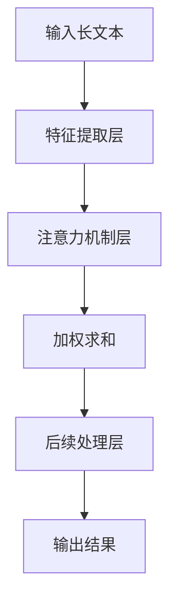

# 基于注意力机制的长文本理解在法律文书分析中的应用

> 关键词：注意力机制、长文本理解、法律文书分析、自然语言处理、深度学习

> 摘要：本文聚焦于基于注意力机制的长文本理解在法律文书分析中的应用。首先介绍了相关背景，包括研究目的、预期读者等内容。详细阐述了注意力机制、长文本理解等核心概念及其联系，给出了相应的架构示意图和流程图。深入剖析了核心算法原理，用Python代码进行详细说明，并讲解了相关数学模型和公式。通过项目实战，展示了在法律文书分析场景下的代码实现和解读。探讨了该技术在法律领域的实际应用场景，推荐了相关学习资源、开发工具和论文著作。最后总结了未来发展趋势与挑战，提供常见问题解答和扩展阅读参考资料，旨在全面深入地探讨该技术在法律文书分析中的应用，为相关领域的研究和实践提供参考。

## 1. 背景介绍 
### 1.1 目的和范围
在法律领域，法律文书包含了大量复杂且关键的信息，如案件事实、法律依据、判决结果等。传统的文本处理方法在处理这些长且复杂的法律文书时面临诸多挑战，如难以准确捕捉关键信息、理解文本的深层语义等。本研究的目的在于探索基于注意力机制的长文本理解技术在法律文书分析中的应用，以提高法律文书信息提取的准确性和效率，辅助法律从业者更高效地处理案件。

本研究的范围涵盖了注意力机制和长文本理解的基本原理、在法律文书分析中的具体应用方法、相关算法实现以及实际应用场景的探讨等方面。通过对这些内容的研究，旨在为法律文书的自动化分析提供一种有效的解决方案。

### 1.2 预期读者
本文预期读者包括法律领域的从业者，如律师、法官、检察官等，他们可以通过了解基于注意力机制的长文本理解技术，更好地利用信息技术辅助案件处理，提高工作效率和准确性。同时，也适合自然语言处理领域的研究人员和开发者，他们可以从法律文书分析这一具体应用场景中获取灵感，拓展技术的应用范围。此外，对人工智能在法律领域应用感兴趣的学者和爱好者也可以从本文中获得有价值的信息。

### 1.3 文档结构概述
本文首先介绍研究的背景信息，包括目的、预期读者和文档结构概述等内容。接着详细阐述注意力机制、长文本理解等核心概念及其联系，并给出相应的架构示意图和流程图。然后深入讲解核心算法原理，用Python代码进行详细说明，并介绍相关数学模型和公式。通过项目实战，展示在法律文书分析场景下的代码实现和解读。探讨该技术在法律领域的实际应用场景，推荐相关学习资源、开发工具和论文著作。最后总结未来发展趋势与挑战，提供常见问题解答和扩展阅读参考资料。

### 1.4 术语表
#### 1.4.1 核心术语定义
- **注意力机制（Attention Mechanism）**：是一种在深度学习中模拟人类注意力的机制，它可以自动地关注输入序列中的重要部分，为不同的部分分配不同的权重，从而提高模型对关键信息的捕捉能力。
- **长文本理解（Long Text Understanding）**：指的是对长度较长的文本进行语义分析、信息提取、情感理解等操作，以准确把握文本的核心内容和深层含义。
- **法律文书（Legal Document）**：是指法律机关、当事人或其他诉讼参与人在法律活动中依法制作的具有法律效力或法律意义的文书，如判决书、起诉书、裁定书等。

#### 1.4.2 相关概念解释
- **自然语言处理（Natural Language Processing，NLP）**：是人工智能领域的一个重要分支，它研究如何让计算机理解和处理人类语言，包括文本分类、信息提取、机器翻译等任务。
- **深度学习（Deep Learning）**：是一种基于人工神经网络的机器学习方法，通过构建多层神经网络模型，自动学习数据中的特征和模式，在图像识别、语音识别、自然语言处理等领域取得了显著的成果。

#### 1.4.3 缩略词列表
- **NLP**：Natural Language Processing（自然语言处理）
- **LSTM**：Long Short - Term Memory（长短期记忆网络）
- **GRU**：Gated Recurrent Unit（门控循环单元）
- **Transformer**：一种基于注意力机制的深度学习模型

## 2. 核心概念与联系 

### 注意力机制原理
注意力机制的核心思想是在处理输入序列时，自动地为序列中的不同元素分配不同的权重，从而让模型更加关注重要的信息。其基本原理可以用以下步骤来描述：

1. **计算注意力分数**：对于输入序列中的每个元素，通过一个打分函数计算其与查询向量（query）之间的相关性分数。常用的打分函数包括点积、缩放点积、加性模型等。
2. **计算注意力权重**：将注意力分数通过softmax函数进行归一化处理，得到每个元素的注意力权重，这些权重表示了每个元素在当前任务中的重要程度。
3. **加权求和**：将输入序列中的元素按照注意力权重进行加权求和，得到一个加权表示，该表示更加关注重要的元素。

### 长文本理解的挑战与解决方案
长文本理解面临着许多挑战，如文本长度过长导致的信息冗余、语义理解困难等。注意力机制可以有效地解决这些问题，通过自动聚焦于关键信息，减少冗余信息的干扰，提高长文本理解的准确性。

### 核心概念架构的文本示意图
```plaintext
输入长文本 -> 特征提取层（如词嵌入） -> 注意力机制层（计算注意力权重） -> 加权求和 -> 后续处理层（如分类器、信息提取模块） -> 输出结果（如文本分类标签、提取的关键信息）
```

### Mermaid 流程图


## 3. 核心算法原理 & 具体操作步骤 

### 注意力机制的Python实现
以下是一个简单的缩放点积注意力机制的Python实现：

```python
import torch
import torch.nn as nn

class ScaledDotProductAttention(nn.Module):
    def __init__(self, d_k):
        super(ScaledDotProductAttention, self).__init__()
        self.d_k = d_k

    def forward(self, q, k, v, mask=None):
        attn_scores = torch.matmul(q, k.transpose(-2, -1)) / torch.sqrt(torch.tensor(self.d_k, dtype=torch.float32))
        if mask is not None:
            attn_scores = attn_scores.masked_fill(mask == 0, -1e9)
        attn_weights = torch.softmax(attn_scores, dim=-1)
        output = torch.matmul(attn_weights, v)
        return output, attn_weights
```

### 具体操作步骤
1. **数据预处理**：对法律文书文本进行清洗、分词、词嵌入等操作，将文本转换为适合模型输入的向量表示。
2. **特征提取**：使用深度学习模型（如LSTM、GRU、Transformer等）对预处理后的数据进行特征提取，得到输入序列的特征表示。
3. **注意力计算**：将特征表示作为输入，通过注意力机制计算注意力权重，并进行加权求和，得到更加聚焦的特征表示。
4. **后续处理**：根据具体任务，使用分类器、信息提取模块等对加权后的特征表示进行处理，得到最终的输出结果。

## 4. 数学模型和公式 & 详细讲解 & 举例说明 

### 缩放点积注意力的数学公式
缩放点积注意力的计算公式如下：

$$
\text{Attention}(Q, K, V) = \text{softmax}\left(\frac{QK^T}{\sqrt{d_k}}\right)V
$$

其中，$Q$ 是查询矩阵，$K$ 是键矩阵，$V$ 是值矩阵，$d_k$ 是键向量的维度。

### 详细讲解
- **$QK^T$**：计算查询向量和键向量之间的相似度分数。
- **$\frac{QK^T}{\sqrt{d_k}}$**：对相似度分数进行缩放，以避免点积结果过大，导致softmax函数的梯度消失。
- **$\text{softmax}\left(\frac{QK^T}{\sqrt{d_k}}\right)$**：将缩放后的相似度分数通过softmax函数进行归一化处理，得到注意力权重。
- **$\text{softmax}\left(\frac{QK^T}{\sqrt{d_k}}\right)V$**：将注意力权重与值矩阵进行加权求和，得到最终的输出结果。

### 举例说明
假设我们有一个输入序列，其长度为 $n$，每个元素的特征维度为 $d$。查询矩阵 $Q$、键矩阵 $K$ 和值矩阵 $V$ 的形状分别为 $(n, d_k)$、$(n, d_k)$ 和 $(n, d_v)$，其中 $d_k$ 和 $d_v$ 分别是键向量和值向量的维度。通过上述公式计算得到的输出结果的形状为 $(n, d_v)$。

## 5. 项目实战：代码实际案例和详细解释说明 

### 5.1  开发环境搭建
- **Python环境**：建议使用Python 3.7及以上版本。
- **深度学习框架**：使用PyTorch作为深度学习框架，可以通过以下命令进行安装：
```bash
pip install torch torchvision
```
- **其他依赖库**：安装`numpy`、`pandas`、`nltk`等常用库：
```bash
pip install numpy pandas nltk
```

### 5.2  源代码详细实现和代码解读
以下是一个基于注意力机制的法律文书分类的代码示例：

```python
import torch
import torch.nn as nn
import torch.optim as optim
from torch.utils.data import Dataset, DataLoader
import numpy as np
import pandas as pd
from nltk.tokenize import word_tokenize
from sklearn.model_selection import train_test_split
from sklearn.preprocessing import LabelEncoder

# 定义数据集类
class LegalDocumentDataset(Dataset):
    def __init__(self, texts, labels, vocab, max_length):
        self.texts = texts
        self.labels = labels
        self.vocab = vocab
        self.max_length = max_length

    def __len__(self):
        return len(self.texts)

    def __getitem__(self, idx):
        text = self.texts[idx]
        label = self.labels[idx]
        tokens = word_tokenize(text)
        token_ids = [self.vocab.get(token, 0) for token in tokens][:self.max_length]
        token_ids += [0] * (self.max_length - len(token_ids))
        return torch.tensor(token_ids), torch.tensor(label)

# 定义注意力模型
class AttentionModel(nn.Module):
    def __init__(self, vocab_size, embedding_dim, hidden_dim, num_classes):
        super(AttentionModel, self).__init__()
        self.embedding = nn.Embedding(vocab_size, embedding_dim)
        self.lstm = nn.LSTM(embedding_dim, hidden_dim, batch_first=True)
        self.attention = ScaledDotProductAttention(hidden_dim)
        self.fc = nn.Linear(hidden_dim, num_classes)

    def forward(self, x):
        embedded = self.embedding(x)
        lstm_output, _ = self.lstm(embedded)
        output, _ = self.attention(lstm_output, lstm_output, lstm_output)
        output = torch.mean(output, dim=1)
        output = self.fc(output)
        return output

# 数据预处理
data = pd.read_csv('legal_documents.csv')
texts = data['text'].tolist()
labels = data['label'].tolist()
label_encoder = LabelEncoder()
labels = label_encoder.fit_transform(labels)

# 构建词汇表
vocab = {}
for text in texts:
    tokens = word_tokenize(text)
    for token in tokens:
        if token not in vocab:
            vocab[token] = len(vocab) + 1

# 划分训练集和测试集
train_texts, test_texts, train_labels, test_labels = train_test_split(texts, labels, test_size=0.2, random_state=42)

# 创建数据集和数据加载器
max_length = 200
train_dataset = LegalDocumentDataset(train_texts, train_labels, vocab, max_length)
test_dataset = LegalDocumentDataset(test_texts, test_labels, vocab, max_length)
train_loader = DataLoader(train_dataset, batch_size=32, shuffle=True)
test_loader = DataLoader(test_dataset, batch_size=32, shuffle=False)

# 初始化模型、损失函数和优化器
vocab_size = len(vocab) + 1
embedding_dim = 100
hidden_dim = 128
num_classes = len(label_encoder.classes_)
model = AttentionModel(vocab_size, embedding_dim, hidden_dim, num_classes)
criterion = nn.CrossEntropyLoss()
optimizer = optim.Adam(model.parameters(), lr=0.001)

# 训练模型
num_epochs = 10
for epoch in range(num_epochs):
    model.train()
    total_loss = 0
    for inputs, labels in train_loader:
        optimizer.zero_grad()
        outputs = model(inputs)
        loss = criterion(outputs, labels)
        loss.backward()
        optimizer.step()
        total_loss += loss.item()
    print(f'Epoch {epoch + 1}/{num_epochs}, Loss: {total_loss / len(train_loader)}')

# 测试模型
model.eval()
correct = 0
total = 0
with torch.no_grad():
    for inputs, labels in test_loader:
        outputs = model(inputs)
        _, predicted = torch.max(outputs.data, 1)
        total += labels.size(0)
        correct += (predicted == labels).sum().item()
print(f'Test Accuracy: {100 * correct / total}%')
```

### 5.3  代码解读与分析
- **数据集类**：`LegalDocumentDataset` 类用于处理法律文书数据集，将文本转换为词索引序列，并进行填充操作，使其长度一致。
- **注意力模型**：`AttentionModel` 类定义了一个基于注意力机制的文本分类模型，包括词嵌入层、LSTM层、注意力层和全连接层。
- **数据预处理**：对法律文书文本进行清洗、分词、构建词汇表等操作，并将标签进行编码。
- **训练和测试**：使用交叉熵损失函数和Adam优化器对模型进行训练，在测试集上评估模型的准确率。

## 6. 实际应用场景 
### 法律文书分类
基于注意力机制的长文本理解技术可以用于对法律文书进行分类，如将判决书、起诉书、裁定书等不同类型的法律文书进行自动分类，提高法律文书管理的效率。

### 关键信息提取
可以从法律文书中提取关键信息，如案件当事人、案件事实、法律依据、判决结果等，为法律从业者提供快速获取重要信息的途径，辅助案件处理。

### 法律风险评估
通过对法律文书的分析，评估案件的法律风险，如预测案件的胜诉概率、可能面临的法律责任等，为当事人提供决策参考。

### 法律知识图谱构建
利用注意力机制提取法律文书中的实体和关系信息，构建法律知识图谱，促进法律知识的共享和利用。

## 7. 工具和资源推荐
### 7.1 学习资源推荐
#### 7.1.1 书籍推荐
- 《深度学习》（Deep Learning）：由Ian Goodfellow、Yoshua Bengio和Aaron Courville所著，是深度学习领域的经典教材，涵盖了深度学习的基本原理、算法和应用。
- 《自然语言处理入门》：何晗著，适合初学者学习自然语言处理的基础知识和实践技巧。
- 《Python自然语言处理》（Natural Language Processing with Python）：Steven Bird、Ewan Klein和Edward Loper所著，介绍了使用Python进行自然语言处理的方法和工具。

#### 7.1.2 在线课程
- Coursera上的“Natural Language Processing Specialization”：由深度学习领域的知名学者授课，系统地介绍了自然语言处理的各个方面。
- 吴恩达的“Deep Learning Specialization”：涵盖了深度学习的基础知识和应用，对理解注意力机制和长文本理解有很大帮助。
- 哔哩哔哩（B 站）上有许多关于自然语言处理和深度学习的教学视频，可以根据自己的需求选择学习。

#### 7.1.3 技术博客和网站
- Medium：上面有许多关于自然语言处理和深度学习的技术文章，作者来自世界各地的研究人员和开发者。
- arXiv：是一个预印本平台，提供了最新的学术研究成果，包括注意力机制、长文本理解等领域的研究论文。
- Hugging Face：是一个专注于自然语言处理的开源社区，提供了许多预训练模型和工具，方便开发者进行实验和应用开发。

### 7.2 开发工具框架推荐
#### 7.2.1 IDE和编辑器
- PyCharm：是一款专业的Python集成开发环境，提供了丰富的代码编辑、调试和分析功能，适合Python项目的开发。
- Visual Studio Code：是一款轻量级的代码编辑器，支持多种编程语言和插件扩展，具有良好的用户体验。

#### 7.2.2 调试和性能分析工具
- PyTorch Profiler：是PyTorch提供的性能分析工具，可以帮助开发者分析模型的性能瓶颈，优化代码。
- TensorBoard：是TensorFlow提供的可视化工具，也可以与PyTorch结合使用，用于可视化模型的训练过程和性能指标。

#### 7.2.3 相关框架和库
- PyTorch：是一个开源的深度学习框架，提供了丰富的深度学习模型和工具，方便开发者进行模型的构建和训练。
- Transformers：是Hugging Face开发的一个自然语言处理库，提供了许多预训练的Transformer模型，如BERT、GPT等，可以用于长文本理解任务。
- NLTK：是一个Python自然语言处理库，提供了丰富的自然语言处理工具和语料库，适合初学者学习和实践。

### 7.3 相关论文著作推荐
#### 7.3.1 经典论文
- “Attention Is All You Need”：由Google Brain团队发表，提出了Transformer模型，是注意力机制领域的经典论文。
- “Long Short-Term Memory”：由Sepp Hochreiter和Jürgen Schmidhuber发表，介绍了长短期记忆网络（LSTM）的原理和应用。

#### 7.3.2 最新研究成果
- 在arXiv和顶级学术会议（如ACL、EMNLP、NAACL等）上可以找到关于注意力机制和长文本理解的最新研究成果。

#### 7.3.3 应用案例分析
- 一些法律科技公司的官方博客和研究报告中会分享基于注意力机制的长文本理解在法律文书分析中的应用案例，可以从中获取实际应用的经验和方法。

## 8. 总结：未来发展趋势与挑战
### 未来发展趋势
- **多模态融合**：将文本信息与图像、音频等多模态信息进行融合，更全面地理解法律文书中的信息，提高分析的准确性和效率。
- **预训练模型的应用**：利用大规模预训练模型，如BERT、GPT等，在法律领域进行微调，提高模型的性能和泛化能力。
- **可解释性增强**：研究如何提高基于注意力机制的模型的可解释性，使法律从业者能够更好地理解模型的决策过程，增强对模型的信任。

### 挑战
- **数据隐私和安全**：法律文书包含大量敏感信息，如何在保证数据隐私和安全的前提下进行数据处理和分析是一个重要的挑战。
- **领域知识融合**：法律领域具有复杂的专业知识和规则，如何将这些领域知识有效地融入到模型中，提高模型对法律文书的理解能力是一个亟待解决的问题。
- **模型性能优化**：尽管注意力机制在长文本理解中取得了一定的成果，但在处理大规模法律文书时，模型的性能和效率仍有待进一步提高。

## 9. 附录：常见问题与解答
### 问题1：注意力机制在长文本理解中的优势是什么？
注意力机制可以自动关注输入序列中的重要部分，为不同的部分分配不同的权重，从而提高模型对关键信息的捕捉能力。在长文本理解中，它可以有效地减少冗余信息的干扰，提高理解的准确性。

### 问题2：如何选择合适的注意力机制？
选择合适的注意力机制需要考虑任务的特点、数据的规模和模型的复杂度等因素。常见的注意力机制包括缩放点积注意力、加性注意力等，可以根据具体情况进行选择和调整。

### 问题3：在法律文书分析中，如何处理数据不平衡的问题？
可以采用以下方法处理数据不平衡问题：
- **数据增强**：对少数类样本进行数据增强，如随机替换、插入、删除等操作，增加少数类样本的数量。
- **重采样**：采用过采样（如SMOTE）或欠采样的方法，调整不同类别样本的比例。
- **调整损失函数**：在损失函数中对不同类别样本进行加权，增加少数类样本的权重。

### 问题4：如何评估基于注意力机制的长文本理解模型在法律文书分析中的性能？
可以使用以下指标评估模型的性能：
- **准确率（Accuracy）**：预测正确的样本数占总样本数的比例。
- **精确率（Precision）**：预测为正类的样本中实际为正类的比例。
- **召回率（Recall）**：实际为正类的样本中被预测为正类的比例。
- **F1值（F1 - Score）**：精确率和召回率的调和平均数。

## 10. 扩展阅读 & 参考资料
- [Attention Is All You Need](https://arxiv.org/abs/1706.03762)
- [Long Short-Term Memory](https://www.bioinf.jku.at/publications/older/2604.pdf)
- 《Python自然语言处理实战：核心技术与算法》
- 《深度学习实战：基于Python的理论与实现》
- Hugging Face官方文档：https://huggingface.co/docs
- PyTorch官方文档：https://pytorch.org/docs/stable/index.html