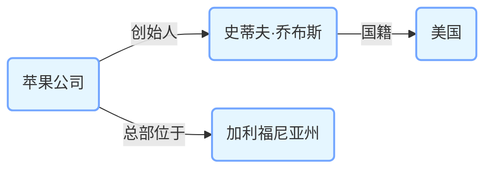

# 基于知识图谱的跨模态推理在智能客服系统中的优化

> 关键词：知识图谱、跨模态推理、智能客服系统、优化、多模态信息处理

> 摘要：本文聚焦于基于知识图谱的跨模态推理在智能客服系统中的优化问题。首先介绍了研究的背景、目的、预期读者等内容，阐述了相关核心概念及联系，包括知识图谱和跨模态推理的原理与架构。接着详细讲解了核心算法原理，用Python代码进行阐述，并给出数学模型和公式。通过项目实战展示了如何在智能客服系统中应用该技术，包括开发环境搭建、源代码实现与解读。探讨了实际应用场景，推荐了相关工具和资源。最后总结了未来发展趋势与挑战，还给出了常见问题解答和参考资料，旨在为智能客服系统的优化提供全面且深入的技术指导。

## 1. 背景介绍 
### 1.1 目的和范围
随着互联网技术的飞速发展，智能客服系统在各个领域得到了广泛应用。然而，传统的智能客服系统往往只能处理单一模态的信息，如文本信息，难以满足用户多样化的需求。基于知识图谱的跨模态推理技术为智能客服系统的优化提供了新的思路。本研究的目的在于探索如何利用知识图谱和跨模态推理技术，提升智能客服系统对多模态信息的处理能力，从而提高客服系统的智能水平和用户满意度。研究范围涵盖了知识图谱的构建、跨模态推理算法的设计、智能客服系统的开发与优化等多个方面。

### 1.2 预期读者
本文预期读者包括从事人工智能、自然语言处理、计算机视觉等领域的科研人员和工程师，智能客服系统的开发人员和运维人员，以及对智能客服技术和跨模态推理感兴趣的相关专业学生。

### 1.3 文档结构概述
本文首先介绍研究的背景信息，包括目的、预期读者等。接着阐述核心概念与联系，展示知识图谱和跨模态推理的原理与架构。然后详细讲解核心算法原理，用Python代码进行说明，并给出数学模型和公式。通过项目实战部分展示如何在智能客服系统中应用该技术，包括开发环境搭建、源代码实现与解读。探讨实际应用场景，推荐相关工具和资源。最后总结未来发展趋势与挑战，给出常见问题解答和参考资料。

### 1.4 术语表
#### 1.4.1 核心术语定义
- **知识图谱**：是一种用图模型来描述知识和建模世界万物之间的关联关系的技术方法。它由实体、关系和属性组成，以结构化的方式表示知识。
- **跨模态推理**：指的是在不同模态（如文本、图像、语音等）的数据之间进行推理和信息融合的过程。通过跨模态推理，可以挖掘不同模态数据之间的潜在联系。
- **智能客服系统**：是一种利用人工智能技术，自动回答用户问题、提供服务的系统。它可以通过多种渠道与用户进行交互，如网页、APP等。

#### 1.4.2 相关概念解释
- **多模态信息**：指的是包含多种不同类型信息的数据，如文本、图像、语音、视频等。多模态信息可以更全面地描述事物，提供更丰富的信息。
- **推理引擎**：是知识图谱中的一个重要组件，用于根据已有的知识和规则进行推理，得出新的结论。

#### 1.4.3 缩略词列表
- **NLP**：Natural Language Processing，自然语言处理
- **CV**：Computer Vision，计算机视觉
- **KG**：Knowledge Graph，知识图谱

## 2. 核心概念与联系 

### 知识图谱原理
知识图谱的核心是三元组，即（实体1，关系，实体2）。例如，（苹果公司，创始人，史蒂夫·乔布斯）就是一个典型的三元组。知识图谱通过收集、整理和存储大量的三元组，构建了一个庞大的知识网络。在这个网络中，实体是节点，关系是边，属性是节点的特征。知识图谱可以用图的形式表示，如图1所示。


图1：知识图谱示例

### 跨模态推理原理
跨模态推理的目的是在不同模态的数据之间建立联系，实现信息的融合和推理。例如，当用户提供一张产品图片和一段关于产品的文本描述时，跨模态推理可以将图片中的视觉信息和文本中的语义信息进行融合，从而更好地理解用户的需求。跨模态推理的过程可以分为以下几个步骤：
1. **特征提取**：从不同模态的数据中提取特征，如从文本中提取词向量，从图像中提取视觉特征。
2. **特征对齐**：将不同模态的特征映射到同一个空间中，使得它们可以进行比较和融合。
3. **推理计算**：根据对齐后的特征进行推理计算，得出结论。

### 知识图谱与跨模态推理的联系
知识图谱可以为跨模态推理提供丰富的背景知识。例如，在进行图像和文本的跨模态推理时，知识图谱可以提供关于图像中物体的语义信息，帮助更好地理解图像和文本之间的关系。同时，跨模态推理可以为知识图谱的构建和更新提供新的信息。例如，通过对用户的多模态交互数据进行跨模态推理，可以发现新的实体和关系，从而扩展知识图谱。

## 3. 核心算法原理 & 具体操作步骤 

### 跨模态特征提取算法
在跨模态推理中，首先需要从不同模态的数据中提取特征。对于文本数据，可以使用预训练的语言模型，如BERT，来提取词向量。对于图像数据，可以使用卷积神经网络（CNN），如ResNet，来提取视觉特征。以下是使用Python和PyTorch实现的文本和图像特征提取代码示例：

```python
import torch
from transformers import BertModel, BertTokenizer
import torchvision.models as models
from torchvision import transforms

# 文本特征提取
tokenizer = BertTokenizer.from_pretrained('bert-base-uncased')
model = BertModel.from_pretrained('bert-base-uncased')

def extract_text_features(text):
    inputs = tokenizer(text, return_tensors='pt')
    outputs = model(**inputs)
    text_features = outputs.last_hidden_state.mean(dim=1)
    return text_features

# 图像特征提取
resnet = models.resnet18(pretrained=True)
resnet.eval()
preprocess = transforms.Compose([
    transforms.Resize(256),
    transforms.CenterCrop(224),
    transforms.ToTensor(),
    transforms.Normalize(mean=[0.485, 0.456, 0.406], std=[0.229, 0.224, 0.225])
])

def extract_image_features(image):
    image = preprocess(image).unsqueeze(0)
    with torch.no_grad():
        image_features = resnet(image)
    return image_features
```

### 跨模态特征对齐算法
在提取了不同模态的特征后，需要将它们映射到同一个空间中，以便进行比较和融合。可以使用线性变换来实现特征对齐。以下是使用Python实现的特征对齐代码示例：

```python
import torch.nn as nn

class FeatureAligner(nn.Module):
    def __init__(self, input_dim1, input_dim2, output_dim):
        super(FeatureAligner, self).__init__()
        self.linear1 = nn.Linear(input_dim1, output_dim)
        self.linear2 = nn.Linear(input_dim2, output_dim)

    def forward(self, features1, features2):
        aligned_features1 = self.linear1(features1)
        aligned_features2 = self.linear2(features2)
        return aligned_features1, aligned_features2
```

### 跨模态推理算法
在特征对齐后，可以进行跨模态推理。可以使用注意力机制来计算不同模态特征之间的相关性，从而实现推理。以下是使用Python和PyTorch实现的跨模态推理代码示例：

```python
import torch.nn.functional as F

class CrossModalReasoner(nn.Module):
    def __init__(self, input_dim):
        super(CrossModalReasoner, self).__init__()
        self.attention = nn.Linear(input_dim * 2, 1)

    def forward(self, features1, features2):
        combined_features = torch.cat((features1, features2), dim=1)
        attention_scores = self.attention(combined_features)
        attention_weights = F.softmax(attention_scores, dim=0)
        weighted_features = attention_weights * combined_features
        output = weighted_features.sum(dim=0)
        return output
```

### 具体操作步骤
1. **数据预处理**：对输入的多模态数据进行预处理，如文本的分词、图像的裁剪和归一化。
2. **特征提取**：使用上述的特征提取算法，从不同模态的数据中提取特征。
3. **特征对齐**：使用特征对齐算法，将不同模态的特征映射到同一个空间中。
4. **跨模态推理**：使用跨模态推理算法，根据对齐后的特征进行推理，得出结论。

## 4. 数学模型和公式 & 详细讲解 & 举例说明 

### 跨模态特征提取的数学模型
对于文本特征提取，使用预训练的语言模型BERT。BERT的输入是一系列的词元（tokens），输出是每个词元的隐藏状态。文本特征可以表示为所有词元隐藏状态的平均值。设输入文本为 $T = [t_1, t_2, \cdots, t_n]$，经过BERT处理后得到的隐藏状态为 $H = [h_1, h_2, \cdots, h_n]$，则文本特征 $F_t$ 可以表示为：

$$F_t = \frac{1}{n} \sum_{i=1}^{n} h_i$$

对于图像特征提取，使用卷积神经网络ResNet。ResNet将输入图像 $I$ 经过一系列的卷积层和池化层处理后，得到图像特征 $F_i$。

### 跨模态特征对齐的数学模型
特征对齐使用线性变换，设文本特征的维度为 $d_t$，图像特征的维度为 $d_i$，对齐后的特征维度为 $d$。则文本特征的线性变换可以表示为：

$$F_{t}^{aligned} = W_t F_t + b_t$$

其中 $W_t$ 是一个 $d \times d_t$ 的权重矩阵，$b_t$ 是一个 $d$ 维的偏置向量。图像特征的线性变换可以表示为：

$$F_{i}^{aligned} = W_i F_i + b_i$$

其中 $W_i$ 是一个 $d \times d_i$ 的权重矩阵，$b_i$ 是一个 $d$ 维的偏置向量。

### 跨模态推理的数学模型
跨模态推理使用注意力机制。设对齐后的文本特征为 $F_{t}^{aligned}$，对齐后的图像特征为 $F_{i}^{aligned}$，将它们拼接起来得到 $F_{combined} = [F_{t}^{aligned}, F_{i}^{aligned}]$。注意力分数 $s$ 可以表示为：

$$s = W_a F_{combined} + b_a$$

其中 $W_a$ 是一个 $1 \times 2d$ 的权重矩阵，$b_a$ 是一个标量偏置。注意力权重 $w$ 可以通过对注意力分数进行softmax操作得到：

$$w = \text{softmax}(s)$$

最终的推理结果 $R$ 可以表示为：

$$R = w \cdot F_{combined}$$

### 举例说明
假设输入的文本是“这是一个苹果”，图像是一张苹果的图片。经过特征提取后，得到文本特征 $F_t$ 和图像特征 $F_i$。然后使用特征对齐算法，将 $F_t$ 和 $F_i$ 映射到同一个空间中，得到 $F_{t}^{aligned}$ 和 $F_{i}^{aligned}$。最后使用跨模态推理算法，计算注意力权重 $w$，并得到推理结果 $R$。根据 $R$ 可以判断文本和图像是否相关，以及它们所描述的内容是否一致。

## 5. 项目实战：代码实际案例和详细解释说明 

### 5.1  开发环境搭建
- **操作系统**：Ubuntu 20.04
- **Python版本**：Python 3.8
- **深度学习框架**：PyTorch 1.9.0
- **相关库**：transformers、torchvision

可以使用以下命令安装相关库：

```bash
pip install torch torchvision
pip install transformers
```

### 5.2  源代码详细实现和代码解读
以下是一个完整的基于知识图谱的跨模态推理在智能客服系统中的实现代码示例：

```python
import torch
from transformers import BertModel, BertTokenizer
import torchvision.models as models
from torchvision import transforms
import torch.nn as nn
import torch.nn.functional as F

# 文本特征提取
tokenizer = BertTokenizer.from_pretrained('bert-base-uncased')
model = BertModel.from_pretrained('bert-base-uncased')

def extract_text_features(text):
    inputs = tokenizer(text, return_tensors='pt')
    outputs = model(**inputs)
    text_features = outputs.last_hidden_state.mean(dim=1)
    return text_features

# 图像特征提取
resnet = models.resnet18(pretrained=True)
resnet.eval()
preprocess = transforms.Compose([
    transforms.Resize(256),
    transforms.CenterCrop(224),
    transforms.ToTensor(),
    transforms.Normalize(mean=[0.485, 0.456, 0.406], std=[0.229, 0.224, 0.225])
])

def extract_image_features(image):
    image = preprocess(image).unsqueeze(0)
    with torch.no_grad():
        image_features = resnet(image)
    return image_features

# 特征对齐
class FeatureAligner(nn.Module):
    def __init__(self, input_dim1, input_dim2, output_dim):
        super(FeatureAligner, self).__init__()
        self.linear1 = nn.Linear(input_dim1, output_dim)
        self.linear2 = nn.Linear(input_dim2, output_dim)

    def forward(self, features1, features2):
        aligned_features1 = self.linear1(features1)
        aligned_features2 = self.linear2(features2)
        return aligned_features1, aligned_features2

# 跨模态推理
class CrossModalReasoner(nn.Module):
    def __init__(self, input_dim):
        super(CrossModalReasoner, self).__init__()
        self.attention = nn.Linear(input_dim * 2, 1)

    def forward(self, features1, features2):
        combined_features = torch.cat((features1, features2), dim=1)
        attention_scores = self.attention(combined_features)
        attention_weights = F.softmax(attention_scores, dim=0)
        weighted_features = attention_weights * combined_features
        output = weighted_features.sum(dim=0)
        return output

# 模拟智能客服系统
def intelligent_customer_service(text, image):
    text_features = extract_text_features(text)
    image_features = extract_image_features(image)

    input_dim1 = text_features.shape[1]
    input_dim2 = image_features.shape[1]
    output_dim = 128

    aligner = FeatureAligner(input_dim1, input_dim2, output_dim)
    reasoner = CrossModalReasoner(output_dim)

    aligned_text_features, aligned_image_features = aligner(text_features, image_features)
    result = reasoner(aligned_text_features, aligned_image_features)

    return result
```

### 5.3  代码解读与分析
- **文本特征提取**：使用BERT模型将输入的文本转换为词向量，并取平均值作为文本特征。
- **图像特征提取**：使用ResNet模型对输入的图像进行特征提取。
- **特征对齐**：使用线性变换将文本特征和图像特征映射到同一个空间中。
- **跨模态推理**：使用注意力机制计算文本特征和图像特征之间的相关性，得到推理结果。
- **智能客服系统模拟**：将文本和图像作为输入，依次进行特征提取、特征对齐和跨模态推理，最终得到推理结果。

## 6. 实际应用场景 
### 电商客服
在电商平台中，用户可能会发送商品的图片和关于商品的问题，如“这个手机的电池续航怎么样？”。基于知识图谱的跨模态推理智能客服系统可以将图片中的手机信息和文本中的问题进行融合，结合知识图谱中的商品知识，准确回答用户的问题。

### 医疗客服
在医疗领域，患者可能会发送自己的症状描述和相关的医学影像。智能客服系统可以通过跨模态推理，结合医学知识图谱，对患者的病情进行初步诊断，并提供相应的建议。

### 旅游客服
在旅游场景中，用户可能会发送旅游景点的图片和关于旅游的问题，如“这个景点附近有什么好吃的餐厅？”。智能客服系统可以通过跨模态推理，结合旅游知识图谱，为用户提供相关的信息。

## 7. 工具和资源推荐
### 7.1 学习资源推荐
#### 7.1.1 书籍推荐
- 《知识图谱：方法、实践与应用》：全面介绍了知识图谱的基本概念、技术方法和应用案例。
- 《深度学习》：深度学习领域的经典教材，涵盖了神经网络、卷积神经网络等重要内容。
- 《自然语言处理入门》：适合初学者学习自然语言处理的基础知识和技术。

#### 7.1.2 在线课程
- Coursera上的“Natural Language Processing Specialization”：由斯坦福大学教授授课，深入讲解自然语言处理的相关知识。
- edX上的“Deep Learning Fundamentals”：介绍深度学习的基本原理和应用。
- 中国大学MOOC上的“知识图谱技术与应用”：详细讲解知识图谱的构建和应用。

#### 7.1.3 技术博客和网站
- Medium：有很多关于人工智能、知识图谱和跨模态推理的技术文章。
- arXiv：可以获取最新的学术研究成果。
- 机器之心：关注人工智能领域的最新动态和技术进展。

### 7.2 开发工具框架推荐
#### 7.2.1 IDE和编辑器
- PyCharm：功能强大的Python集成开发环境，适合开发深度学习项目。
- Jupyter Notebook：交互式的开发环境，方便进行代码测试和实验。

#### 7.2.2 调试和性能分析工具
- TensorBoard：用于可视化深度学习模型的训练过程和性能指标。
- PyTorch Profiler：可以对PyTorch代码进行性能分析，找出性能瓶颈。

#### 7.2.3 相关框架和库
- PyTorch：深度学习框架，提供了丰富的深度学习模型和工具。
- Transformers：由Hugging Face开发的自然语言处理库，包含了多种预训练的语言模型。
- torchvision：PyTorch的计算机视觉库，提供了多种预训练的图像模型。

### 7.3 相关论文著作推荐
#### 7.3.1 经典论文
- “BERT: Pre-training of Deep Bidirectional Transformers for Language Understanding”：介绍了BERT模型的原理和训练方法。
- “ImageNet Classification with Deep Convolutional Neural Networks”：提出了AlexNet模型，开启了深度学习在计算机视觉领域的应用。

#### 7.3.2 最新研究成果
- 关注顶级学术会议，如NeurIPS、ICML、CVPR等，获取关于知识图谱和跨模态推理的最新研究成果。

#### 7.3.3 应用案例分析
- 可以参考一些实际应用案例的论文，了解基于知识图谱的跨模态推理在不同领域的应用方法和效果。

## 8. 总结：未来发展趋势与挑战
### 未来发展趋势
- **多模态融合的深度和广度将不断提升**：未来的智能客服系统将能够更好地融合多种模态的信息，如文本、图像、语音、视频等，提供更加全面和准确的服务。
- **知识图谱的规模和质量将不断提高**：随着知识图谱技术的发展，知识图谱的规模将不断扩大，质量将不断提高，为跨模态推理提供更丰富和准确的知识支持。
- **与其他技术的融合将更加紧密**：基于知识图谱的跨模态推理技术将与区块链、物联网等技术深度融合，创造出更多的应用场景和商业价值。

### 挑战
- **多模态数据的处理和融合难度较大**：不同模态的数据具有不同的特点和表示方式，如何有效地处理和融合这些数据是一个挑战。
- **知识图谱的构建和更新成本较高**：知识图谱的构建需要大量的人力和物力，而且知识图谱需要不断更新和维护，以保证其准确性和时效性。
- **跨模态推理的可解释性较差**：跨模态推理的过程往往比较复杂，难以解释推理结果的依据，这在一些对可解释性要求较高的领域（如医疗、金融等）是一个问题。

## 9. 附录：常见问题与解答
### 问题1：如何选择合适的预训练模型进行特征提取？
解答：选择预训练模型时，需要考虑任务的特点和数据的类型。对于文本数据，可以选择BERT、GPT等预训练语言模型；对于图像数据，可以选择ResNet、VGG等预训练图像模型。同时，还需要考虑模型的性能和计算资源的限制。

### 问题2：如何提高跨模态推理的准确性？
解答：可以从以下几个方面提高跨模态推理的准确性：1. 选择合适的特征提取和特征对齐方法；2. 优化跨模态推理算法，如使用更复杂的注意力机制；3. 增加训练数据的规模和多样性；4. 结合知识图谱，提供更丰富的背景知识。

### 问题3：如何处理跨模态数据中的噪声和缺失值？
解答：对于噪声数据，可以使用数据清洗和预处理方法，如滤波、去噪等。对于缺失值，可以使用插值、填充等方法进行处理。同时，也可以使用一些鲁棒的跨模态推理算法，提高模型对噪声和缺失值的容忍度。

## 10. 扩展阅读 & 参考资料
### 扩展阅读
- 《人工智能：一种现代的方法》：全面介绍了人工智能的基本概念、技术和应用。
- 《计算机视觉：算法与应用》：深入讲解计算机视觉的相关算法和应用。

### 参考资料
- 相关学术论文和研究报告。
- 开源代码库和数据集。
- 相关技术论坛和社区的讨论。