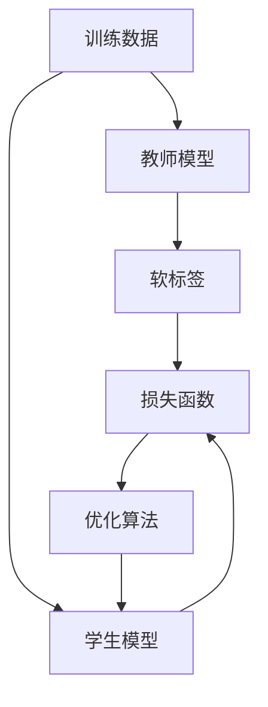

# 基于知识蒸馏的轻量级推理模型设计

> 关键词：知识蒸馏、轻量级推理模型、深度学习、模型压缩、迁移学习

> 摘要：本文围绕基于知识蒸馏的轻量级推理模型设计展开深入探讨。首先介绍了研究的背景，包括目的、预期读者等内容。接着详细阐述了知识蒸馏和轻量级推理模型的核心概念与联系，通过文本示意图和 Mermaid 流程图进行直观呈现。在核心算法原理部分，使用 Python 源代码详细讲解知识蒸馏的具体操作步骤。同时给出相关的数学模型和公式，并举例说明。通过项目实战，展示了开发环境搭建、源代码实现及解读。还分析了实际应用场景，推荐了学习资源、开发工具框架以及相关论文著作。最后总结了未来发展趋势与挑战，并提供常见问题与解答和扩展阅读参考资料，旨在为相关领域的研究者和开发者提供全面且深入的技术指导。

## 1. 背景介绍 
### 1.1 目的和范围
在深度学习领域，随着模型复杂度的不断增加，模型的参数量和计算量也急剧上升。这虽然提升了模型的性能，但也带来了诸多问题，如推理速度慢、对硬件资源要求高、能耗大等。在一些资源受限的场景，如移动设备、嵌入式系统等，这些问题尤为突出。基于知识蒸馏的轻量级推理模型设计的目的就是在保证模型性能的前提下，通过知识蒸馏技术将复杂模型（教师模型）的知识迁移到简单模型（学生模型）中，从而实现模型的压缩和加速，使其能够在资源受限的环境中高效运行。

本文的范围涵盖了知识蒸馏和轻量级推理模型的基本概念、核心算法原理、数学模型、项目实战、实际应用场景以及相关工具和资源推荐等方面，旨在为读者全面介绍基于知识蒸馏的轻量级推理模型设计的理论和实践方法。

### 1.2 预期读者
本文预期读者包括深度学习领域的研究者、人工智能工程师、对模型压缩和优化感兴趣的开发者、相关专业的学生等。无论你是初学者想要了解知识蒸馏和轻量级推理模型的基本概念，还是有一定经验的专业人士希望深入研究其技术细节和应用，本文都将为你提供有价值的参考。

### 1.3 文档结构概述
本文首先介绍基于知识蒸馏的轻量级推理模型设计的背景，包括目的、预期读者和文档结构概述等内容。接着详细阐述核心概念与联系，通过文本示意图和 Mermaid 流程图直观展示知识蒸馏和轻量级推理模型的原理和架构。然后讲解核心算法原理和具体操作步骤，使用 Python 源代码进行详细说明。随后给出相关的数学模型和公式，并举例说明。通过项目实战部分，展示开发环境搭建、源代码实现及解读。分析实际应用场景，推荐学习资源、开发工具框架以及相关论文著作。最后总结未来发展趋势与挑战，提供常见问题与解答和扩展阅读参考资料。

### 1.4 术语表
#### 1.4.1 核心术语定义
- **知识蒸馏（Knowledge Distillation）**：一种模型压缩和迁移学习技术，通过将复杂模型（教师模型）的知识传递给简单模型（学生模型），使学生模型能够在较小的参数量和计算量下达到接近教师模型的性能。
- **教师模型（Teacher Model）**：在知识蒸馏中，通常是一个复杂、性能较高的模型，用于生成软标签（soft labels），为学生模型提供学习的目标。
- **学生模型（Student Model）**：在知识蒸馏中，是一个相对简单、参数量较少的模型，通过学习教师模型的知识来提高自身性能。
- **轻量级推理模型（Lightweight Inference Model）**：具有较小的参数量和计算量，能够在资源受限的环境中快速进行推理的模型。
- **软标签（Soft Labels）**：教师模型输出的概率分布，包含了比硬标签（one - hot 编码的类别标签）更多的信息，能够为学生模型提供更丰富的学习信号。

#### 1.4.2 相关概念解释
- **模型压缩（Model Compression）**：通过各种技术减少模型的参数量和计算量，以降低模型的存储和计算成本，提高模型的推理效率。常见的模型压缩技术包括知识蒸馏、剪枝、量化等。
- **迁移学习（Transfer Learning）**：将在一个任务上学习到的知识迁移到另一个相关任务上的学习方法。知识蒸馏可以看作是一种特殊的迁移学习，它将教师模型在训练数据上学习到的知识迁移到学生模型中。

#### 1.4.3 缩略词列表
- **CNN（Convolutional Neural Network）**：卷积神经网络
- **DNN（Deep Neural Network）**：深度神经网络
- **MLP（Multi - Layer Perceptron）**：多层感知机

## 2. 核心概念与联系 
### 知识蒸馏的基本原理
知识蒸馏的核心思想是让学生模型学习教师模型的输出。传统的分类任务通常使用硬标签（one - hot 编码的类别标签）进行训练，而知识蒸馏引入了软标签。软标签是教师模型输出的概率分布，它包含了类别之间的相对关系和不确定性信息。通过让学生模型学习软标签，学生模型可以从教师模型中获取更多的知识，从而在较小的参数量下达到较好的性能。

#### 文本示意图
知识蒸馏的过程可以用以下文本示意图描述：

1. 首先，使用大量数据训练一个复杂的教师模型。教师模型在训练数据上进行前向传播，输出每个样本属于各个类别的概率分布，即软标签。
2. 然后，设计一个简单的学生模型。学生模型在训练数据上进行前向传播，同时与教师模型的软标签进行比较，计算损失函数。
3. 最后，使用优化算法（如随机梯度下降）更新学生模型的参数，使得学生模型的输出尽可能接近教师模型的软标签。

#### Mermaid 流程图


### 轻量级推理模型的特点
轻量级推理模型通常具有以下特点：
- **参数量少**：通过使用轻量级的网络结构（如 MobileNet、ShuffleNet 等）或模型压缩技术，减少模型的参数量，降低模型的存储成本。
- **计算量小**：采用高效的卷积运算（如深度可分离卷积）或量化技术，减少模型的计算量，提高模型的推理速度。
- **低能耗**：由于参数量和计算量的减少，轻量级推理模型在运行时消耗的能量也相应降低，适合在移动设备和嵌入式系统等资源受限的环境中使用。

### 知识蒸馏与轻量级推理模型的联系
知识蒸馏是设计轻量级推理模型的一种有效方法。通过知识蒸馏，轻量级的学生模型可以学习到复杂教师模型的知识，从而在保证性能的前提下实现模型的压缩和加速。具体来说，知识蒸馏可以帮助轻量级推理模型：
- **提高性能**：学生模型通过学习教师模型的软标签，可以获取更多的知识，从而提高自身的分类准确率。
- **减少过拟合**：软标签中包含的不确定性信息可以帮助学生模型更好地泛化，减少过拟合的风险。
- **加速训练**：由于学生模型的参数量较少，训练速度通常比教师模型快，知识蒸馏可以进一步加速学生模型的训练过程。

## 3. 核心算法原理 & 具体操作步骤 
### 知识蒸馏的核心算法原理
知识蒸馏的核心是设计合适的损失函数，使得学生模型的输出尽可能接近教师模型的软标签。常见的知识蒸馏损失函数包括蒸馏损失（distillation loss）和学生模型的分类损失（classification loss）。

蒸馏损失通常使用 KL 散度（Kullback - Leibler divergence）来衡量学生模型输出的概率分布和教师模型输出的软标签之间的差异。KL 散度的定义如下：

$$D_{KL}(P||Q)=\sum_{i}P(i)\log\frac{P(i)}{Q(i)}$$

其中，$P(i)$ 是教师模型输出的软标签，$Q(i)$ 是学生模型输出的概率分布。

学生模型的分类损失通常使用交叉熵损失（cross - entropy loss）来衡量学生模型输出的概率分布和真实标签之间的差异。交叉熵损失的定义如下：

$$H(y,p)=-\sum_{i}y_{i}\log p_{i}$$

其中，$y_{i}$ 是真实标签，$p_{i}$ 是学生模型输出的概率分布。

最终的损失函数是蒸馏损失和分类损失的加权和：

$$L = \alpha D_{KL}(P||Q)+(1 - \alpha)H(y,p)$$

其中，$\alpha$ 是一个超参数，用于控制蒸馏损失和分类损失的相对权重。

### 具体操作步骤
以下是使用 Python 和 PyTorch 实现知识蒸馏的具体操作步骤：

```python
import torch
import torch.nn as nn
import torch.optim as optim

# 定义教师模型
class TeacherModel(nn.Module):
    def __init__(self):
        super(TeacherModel, self).__init__()
        # 定义教师模型的网络结构
        self.fc1 = nn.Linear(10, 20)
        self.relu = nn.ReLU()
        self.fc2 = nn.Linear(20, 5)

    def forward(self, x):
        x = self.fc1(x)
        x = self.relu(x)
        x = self.fc2(x)
        return x

# 定义学生模型
class StudentModel(nn.Module):
    def __init__(self):
        super(StudentModel, self).__init__()
        # 定义学生模型的网络结构
        self.fc1 = nn.Linear(10, 10)
        self.relu = nn.ReLU()
        self.fc2 = nn.Linear(10, 5)

    def forward(self, x):
        x = self.fc1(x)
        x = self.relu(x)
        x = self.fc2(x)
        return x

# 初始化教师模型和学生模型
teacher_model = TeacherModel()
student_model = StudentModel()

# 定义损失函数和优化器
criterion_ce = nn.CrossEntropyLoss()
criterion_kl = nn.KLDivLoss(reduction='batchmean')
optimizer = optim.Adam(student_model.parameters(), lr=0.001)

# 超参数
alpha = 0.5
temperature = 2.0

# 训练过程
num_epochs = 100
for epoch in range(num_epochs):
    # 生成随机数据
    inputs = torch.randn(32, 10)
    labels = torch.randint(0, 5, (32,))

    # 教师模型前向传播
    teacher_outputs = teacher_model(inputs)
    teacher_probs = nn.functional.softmax(teacher_outputs / temperature, dim=1)

    # 学生模型前向传播
    student_outputs = student_model(inputs)
    student_probs = nn.functional.log_softmax(student_outputs / temperature, dim=1)

    # 计算蒸馏损失
    distillation_loss = criterion_kl(student_probs, teacher_probs) * (temperature ** 2)

    # 计算分类损失
    classification_loss = criterion_ce(student_outputs, labels)

    # 计算总损失
    total_loss = alpha * distillation_loss + (1 - alpha) * classification_loss

    # 反向传播和优化
    optimizer.zero_grad()
    total_loss.backward()
    optimizer.step()

    if (epoch + 1) % 10 == 0:
        print(f'Epoch [{epoch + 1}/{num_epochs}], Loss: {total_loss.item():.4f}')
```

### 代码解释
1. **模型定义**：定义了教师模型和学生模型，教师模型的网络结构比学生模型更复杂。
2. **损失函数和优化器**：使用交叉熵损失函数计算分类损失，使用 KL 散度损失函数计算蒸馏损失。使用 Adam 优化器更新学生模型的参数。
3. **超参数设置**：设置了 $\alpha$ 和 $temperature$ 两个超参数，$\alpha$ 用于控制蒸馏损失和分类损失的相对权重，$temperature$ 用于调整软标签的平滑程度。
4. **训练过程**：在每个 epoch 中，首先生成随机数据，然后教师模型和学生模型分别进行前向传播，计算蒸馏损失和分类损失，最后将两者加权求和得到总损失，并进行反向传播和优化。

## 4. 数学模型和公式 & 详细讲解 & 举例说明 
### 知识蒸馏的数学模型
知识蒸馏的数学模型主要基于 KL 散度和交叉熵损失。

#### KL 散度
KL 散度是一种衡量两个概率分布之间差异的指标。在知识蒸馏中，我们使用 KL 散度来衡量学生模型输出的概率分布 $Q(i)$ 和教师模型输出的软标签 $P(i)$ 之间的差异。KL 散度的公式为：

$$D_{KL}(P||Q)=\sum_{i}P(i)\log\frac{P(i)}{Q(i)}$$

KL 散度具有以下性质：
- **非负性**：$D_{KL}(P||Q)\geq0$，当且仅当 $P = Q$ 时，$D_{KL}(P||Q)=0$。
- **不对称性**：$D_{KL}(P||Q)\neq D_{KL}(Q||P)$。

#### 交叉熵损失
交叉熵损失是一种常用的分类损失函数，用于衡量学生模型输出的概率分布 $p_{i}$ 和真实标签 $y_{i}$ 之间的差异。交叉熵损失的公式为：

$$H(y,p)=-\sum_{i}y_{i}\log p_{i}$$

交叉熵损失具有以下性质：
- **非负性**：$H(y,p)\geq0$，当且仅当 $p_{i}=y_{i}$ 时，$H(y,p)=0$。
- **单调性**：当学生模型的输出概率分布更接近真实标签时，交叉熵损失减小。

#### 总损失函数
最终的损失函数是蒸馏损失和分类损失的加权和：

$$L = \alpha D_{KL}(P||Q)+(1 - \alpha)H(y,p)$$

其中，$\alpha$ 是一个超参数，用于控制蒸馏损失和分类损失的相对权重。

### 详细讲解
- **KL 散度的作用**：KL 散度用于衡量学生模型输出的概率分布和教师模型输出的软标签之间的差异。通过最小化 KL 散度，学生模型可以学习到教师模型的知识，从而提高自身的性能。
- **交叉熵损失的作用**：交叉熵损失用于衡量学生模型输出的概率分布和真实标签之间的差异。通过最小化交叉熵损失，学生模型可以学习到正确的分类信息。
- **超参数 $\alpha$ 的作用**：$\alpha$ 控制了蒸馏损失和分类损失的相对权重。当 $\alpha$ 较大时，学生模型更注重学习教师模型的知识；当 $\alpha$ 较小时，学生模型更注重学习真实标签的信息。

### 举例说明
假设我们有一个二分类问题，真实标签为 $y = [1, 0]$，教师模型输出的软标签为 $P = [0.8, 0.2]$，学生模型输出的概率分布为 $Q = [0.7, 0.3]$。

#### 计算 KL 散度
$$D_{KL}(P||Q)=P(1)\log\frac{P(1)}{Q(1)}+P(2)\log\frac{P(2)}{Q(2)}=0.8\log\frac{0.8}{0.7}+0.2\log\frac{0.2}{0.3}\approx0.057$$

#### 计算交叉熵损失
$$H(y,Q)=-y(1)\log Q(1)-y(2)\log Q(2)=-1\times\log 0.7 - 0\times\log 0.3\approx0.357$$

假设 $\alpha = 0.5$，则总损失为：

$$L = \alpha D_{KL}(P||Q)+(1 - \alpha)H(y,Q)=0.5\times0.057 + 0.5\times0.357 = 0.207$$

## 5. 项目实战：代码实际案例和详细解释说明 
### 5.1  开发环境搭建
#### 硬件环境
- **CPU**：Intel Core i7 及以上
- **GPU**：NVIDIA GPU（可选，用于加速训练过程）

#### 软件环境
- **操作系统**：Windows 10、Ubuntu 18.04 及以上
- **Python**：Python 3.6 及以上
- **深度学习框架**：PyTorch 1.7 及以上

#### 安装步骤
1. 安装 Python：可以从 Python 官方网站（https://www.python.org/downloads/） 下载并安装 Python。
2. 安装 PyTorch：根据自己的硬件环境和操作系统，选择合适的安装命令。例如，在使用 CUDA 11.1 的 NVIDIA GPU 上安装 PyTorch，可以使用以下命令：

```sh
pip install torch torchvision torchaudio --extra-index-url https://download.pytorch.org/whl/cu111
```

### 5.2  源代码详细实现和代码解读
#### 数据集准备
我们使用 MNIST 手写数字数据集作为示例。以下是加载数据集的代码：

```python
import torch
import torchvision
import torchvision.transforms as transforms

# 定义数据预处理
transform = transforms.Compose([
    transforms.ToTensor(),
    transforms.Normalize((0.1307,), (0.3081,))
])

# 加载训练集
trainset = torchvision.datasets.MNIST(root='./data', train=True,
                                      download=True, transform=transform)
trainloader = torch.utils.data.DataLoader(trainset, batch_size=64,
                                          shuffle=True)

# 加载测试集
testset = torchvision.datasets.MNIST(root='./data', train=False,
                                     download=True, transform=transform)
testloader = torch.utils.data.DataLoader(testset, batch_size=64,
                                         shuffle=False)
```

#### 教师模型和学生模型定义
```python
import torch.nn as nn

# 定义教师模型
class TeacherModel(nn.Module):
    def __init__(self):
        super(TeacherModel, self).__init__()
        self.conv1 = nn.Conv2d(1, 32, kernel_size=3, padding=1)
        self.relu1 = nn.ReLU()
        self.pool1 = nn.MaxPool2d(2)
        self.conv2 = nn.Conv2d(32, 64, kernel_size=3, padding=1)
        self.relu2 = nn.ReLU()
        self.pool2 = nn.MaxPool2d(2)
        self.fc1 = nn.Linear(64 * 7 * 7, 128)
        self.relu3 = nn.ReLU()
        self.fc2 = nn.Linear(128, 10)

    def forward(self, x):
        x = self.pool1(self.relu1(self.conv1(x)))
        x = self.pool2(self.relu2(self.conv2(x)))
        x = x.view(-1, 64 * 7 * 7)
        x = self.relu3(self.fc1(x))
        x = self.fc2(x)
        return x

# 定义学生模型
class StudentModel(nn.Module):
    def __init__(self):
        super(StudentModel, self).__init__()
        self.conv1 = nn.Conv2d(1, 16, kernel_size=3, padding=1)
        self.relu1 = nn.ReLU()
        self.pool1 = nn.MaxPool2d(2)
        self.fc1 = nn.Linear(16 * 14 * 14, 64)
        self.relu2 = nn.ReLU()
        self.fc2 = nn.Linear(64, 10)

    def forward(self, x):
        x = self.pool1(self.relu1(self.conv1(x)))
        x = x.view(-1, 16 * 14 * 14)
        x = self.relu2(self.fc1(x))
        x = self.fc2(x)
        return x
```

#### 训练过程
```python
import torch.optim as optim

# 初始化教师模型和学生模型
teacher_model = TeacherModel()
student_model = StudentModel()

# 定义损失函数和优化器
criterion_ce = nn.CrossEntropyLoss()
criterion_kl = nn.KLDivLoss(reduction='batchmean')
optimizer = optim.Adam(student_model.parameters(), lr=0.001)

# 超参数
alpha = 0.5
temperature = 2.0

# 训练过程
num_epochs = 10
for epoch in range(num_epochs):
    running_loss = 0.0
    for i, data in enumerate(trainloader, 0):
        inputs, labels = data

        # 教师模型前向传播
        teacher_outputs = teacher_model(inputs)
        teacher_probs = nn.functional.softmax(teacher_outputs / temperature, dim=1)

        # 学生模型前向传播
        student_outputs = student_model(inputs)
        student_probs = nn.functional.log_softmax(student_outputs / temperature, dim=1)

        # 计算蒸馏损失
        distillation_loss = criterion_kl(student_probs, teacher_probs) * (temperature ** 2)

        # 计算分类损失
        classification_loss = criterion_ce(student_outputs, labels)

        # 计算总损失
        total_loss = alpha * distillation_loss + (1 - alpha) * classification_loss

        # 反向传播和优化
        optimizer.zero_grad()
        total_loss.backward()
        optimizer.step()

        running_loss += total_loss.item()
    print(f'Epoch [{epoch + 1}/{num_epochs}], Loss: {running_loss / len(trainloader):.4f}')
```

### 5.3  代码解读与分析
#### 数据集准备
使用 `torchvision.datasets.MNIST` 加载 MNIST 数据集，并使用 `torch.utils.data.DataLoader` 创建数据加载器。数据预处理包括将图像转换为张量和归一化操作。

#### 教师模型和学生模型定义
教师模型是一个较复杂的卷积神经网络，包含两个卷积层和两个全连接层。学生模型是一个较简单的卷积神经网络，包含一个卷积层和两个全连接层。

#### 训练过程
在每个 epoch 中，遍历训练数据集，教师模型和学生模型分别进行前向传播，计算蒸馏损失和分类损失，然后将两者加权求和得到总损失，并进行反向传播和优化。

通过知识蒸馏，学生模型可以学习到教师模型的知识，从而在较小的参数量下达到较好的性能。

## 6. 实际应用场景 
### 移动设备上的图像分类
在移动设备上，由于计算资源和存储资源有限，需要使用轻量级的推理模型。基于知识蒸馏的轻量级推理模型可以在保证图像分类准确率的前提下，减少模型的参数量和计算量，从而实现快速的推理。例如，在智能手机上的图像识别应用中，使用轻量级推理模型可以实时识别图像中的物体，提高用户体验。

### 嵌入式系统中的目标检测
在嵌入式系统中，如智能摄像头、无人机等，需要在有限的资源下实现高效的目标检测。基于知识蒸馏的轻量级推理模型可以将复杂的目标检测模型的知识迁移到简单的模型中，从而在嵌入式系统中实现快速、准确的目标检测。例如，在智能摄像头中，使用轻量级推理模型可以实时检测视频中的行人、车辆等目标，实现智能监控。

### 自动驾驶中的感知任务
在自动驾驶中，需要对周围环境进行实时感知，包括目标检测、语义分割等任务。由于自动驾驶系统对计算资源和实时性要求较高，使用基于知识蒸馏的轻量级推理模型可以在保证感知任务准确率的前提下，提高系统的计算效率，确保自动驾驶的安全性和可靠性。

## 7. 工具和资源推荐
### 7.1 学习资源推荐
#### 7.1.1 书籍推荐
- 《深度学习》（Deep Learning）：由 Ian Goodfellow、Yoshua Bengio 和 Aaron Courville 合著，是深度学习领域的经典教材，介绍了深度学习的基本概念、算法和应用。
- 《Python 深度学习》（Deep Learning with Python）：由 Francois Chollet 著，通过实际案例介绍了如何使用 Python 和 Keras 进行深度学习开发。
- 《动手学深度学习》（Dive into Deep Learning）：由 Aston Zhang、Zachary C. Lipton、Mu Li 和 Alexander J. Smola 合著，提供了丰富的代码示例和详细的讲解，适合初学者学习深度学习。

#### 7.1.2 在线课程
- Coursera 上的《深度学习专项课程》（Deep Learning Specialization）：由 Andrew Ng 教授授课，包括神经网络和深度学习、改善深层神经网络、结构化机器学习项目、卷积神经网络、序列模型等课程，全面介绍了深度学习的理论和实践。
- edX 上的《使用 PyTorch 进行深度学习》（Introduction to Deep Learning with PyTorch）：介绍了如何使用 PyTorch 进行深度学习开发，包括张量操作、神经网络构建、训练和评估等内容。
- 哔哩哔哩上的《李宏毅机器学习》：由李宏毅教授授课，以生动有趣的方式讲解机器学习和深度学习的基本概念和算法。

#### 7.1.3 技术博客和网站
- Medium：是一个技术博客平台，上面有很多深度学习领域的优秀文章，如 Towards Data Science 等。
- arXiv：是一个预印本平台，提供了大量的深度学习研究论文，可以及时了解最新的研究成果。
- Kaggle：是一个数据科学竞赛平台，上面有很多深度学习的竞赛和代码示例，可以学习到其他开发者的优秀经验。

### 7.2 开发工具框架推荐
#### 7.2.1 IDE和编辑器
- PyCharm：是一款专门为 Python 开发设计的集成开发环境，提供了丰富的代码编辑、调试、版本控制等功能。
- Visual Studio Code：是一款轻量级的代码编辑器，支持多种编程语言和插件，适合快速开发和调试。
- Jupyter Notebook：是一个交互式的开发环境，适合进行数据探索、模型训练和可视化等任务。

#### 7.2.2 调试和性能分析工具
- PyTorch Profiler：是 PyTorch 自带的性能分析工具，可以帮助开发者分析模型的计算时间、内存使用等性能指标。
- TensorBoard：是 TensorFlow 提供的可视化工具，也可以与 PyTorch 集成，用于可视化模型的训练过程、损失函数变化等信息。
- NVIDIA Nsight Systems：是 NVIDIA 提供的性能分析工具，适合对使用 NVIDIA GPU 进行深度学习开发的程序进行性能分析。

#### 7.2.3 相关框架和库
- PyTorch：是一个开源的深度学习框架，提供了丰富的神经网络模块和优化算法，支持 GPU 加速，适合进行深度学习研究和开发。
- TensorFlow：是另一个流行的深度学习框架，具有广泛的应用和丰富的工具生态系统。
- Scikit - learn：是一个用于机器学习的 Python 库，提供了多种机器学习算法和工具，适合进行数据预处理、模型选择和评估等任务。

### 7.3 相关论文著作推荐
#### 7.3.1 经典论文
- 《Distilling the Knowledge in a Neural Network》：由 Geoffrey Hinton、Oriol Vinyals 和 Jeff Dean 发表，是知识蒸馏领域的开创性论文，介绍了知识蒸馏的基本思想和方法。
- 《MobileNets: Efficient Convolutional Neural Networks for Mobile Vision Applications》：提出了 MobileNet 轻量级卷积神经网络架构，通过深度可分离卷积减少了模型的参数量和计算量。
- 《ShuffleNet: An Extremely Efficient Convolutional Neural Network for Mobile Devices》：提出了 ShuffleNet 轻量级卷积神经网络架构，通过通道混洗操作提高了模型的计算效率。

#### 7.3.2 最新研究成果
- 关注 arXiv 上的最新论文，如关于知识蒸馏的改进算法、轻量级网络架构的新设计等。
- 参加国际机器学习会议（ICML）、神经信息处理系统大会（NeurIPS）、计算机视觉与模式识别会议（CVPR）等学术会议，了解最新的研究动态。

#### 7.3.3 应用案例分析
- 查看 Kaggle 上的优秀竞赛解决方案，了解基于知识蒸馏的轻量级推理模型在实际应用中的实现方法和技巧。
- 参考工业界的开源项目，如百度的 PaddlePaddle、字节跳动的 ByteDance AI Lab 等，学习他们在模型压缩和优化方面的经验。

## 8. 总结：未来发展趋势与挑战
### 未来发展趋势
- **更高效的知识蒸馏算法**：未来的研究将致力于开发更高效的知识蒸馏算法，进一步提高学生模型的性能，减少蒸馏过程的计算成本。
- **轻量级网络架构的创新**：不断探索新的轻量级网络架构，结合知识蒸馏技术，设计出性能更优、计算效率更高的轻量级推理模型。
- **跨领域的应用拓展**：基于知识蒸馏的轻量级推理模型将在更多领域得到应用，如医疗、金融、交通等，为这些领域的智能化发展提供支持。
- **与其他技术的融合**：知识蒸馏技术将与模型剪枝、量化等其他模型压缩技术相结合，进一步提高模型的压缩率和推理效率。

### 挑战
- **知识蒸馏的理论基础**：目前知识蒸馏的理论基础还不够完善，需要进一步深入研究知识蒸馏的原理和机制，为算法的优化提供理论支持。
- **学生模型的性能上限**：尽管知识蒸馏可以提高学生模型的性能，但学生模型的性能仍然受到教师模型和自身网络结构的限制，如何突破学生模型的性能上限是一个挑战。
- **计算资源的优化**：在资源受限的环境中，如何进一步优化知识蒸馏的计算过程，减少计算资源的消耗，是一个需要解决的问题。
- **数据隐私和安全**：在知识蒸馏过程中，教师模型的知识可能包含敏感信息，如何保证数据的隐私和安全是一个重要的挑战。

## 9. 附录：常见问题与解答
### 1. 知识蒸馏中 $\alpha$ 和 $temperature$ 如何选择？
$\alpha$ 和 $temperature$ 是知识蒸馏中的两个重要超参数。$\alpha$ 控制蒸馏损失和分类损失的相对权重，一般可以通过实验进行调优。当 $\alpha$ 较大时，学生模型更注重学习教师模型的知识；当 $\alpha$ 较小时，学生模型更注重学习真实标签的信息。$temperature$ 用于调整软标签的平滑程度，一般取值在 2 - 10 之间。较大的 $temperature$ 会使软标签更加平滑，较小的 $temperature$ 会使软标签更接近硬标签。

### 2. 知识蒸馏是否适用于所有类型的模型？
知识蒸馏适用于大多数类型的模型，包括卷积神经网络、循环神经网络、Transformer 等。但不同类型的模型在知识蒸馏过程中可能需要进行一些调整和优化。例如，对于循环神经网络，需要考虑序列的长度和时间步的信息；对于 Transformer 模型，需要考虑注意力机制的影响。

### 3. 如何评估知识蒸馏的效果？
可以通过比较学生模型和教师模型在测试集上的性能指标（如准确率、召回率、F1 值等）来评估知识蒸馏的效果。同时，还可以比较学生模型和教师模型的参数量、计算量等指标，评估模型的压缩效果。

### 4. 知识蒸馏是否可以与其他模型压缩技术结合使用？
可以。知识蒸馏可以与模型剪枝、量化等其他模型压缩技术结合使用，进一步提高模型的压缩率和推理效率。例如，可以先使用知识蒸馏将教师模型的知识迁移到学生模型中，然后对学生模型进行剪枝和量化操作。

## 10. 扩展阅读 & 参考资料
- Goodfellow, I., Bengio, Y., & Courville, A. (2016). Deep Learning. MIT Press.
- Chollet, F. (2018). Deep Learning with Python. Manning Publications.
- Zhang, A., Lipton, Z. C., Li, M., & Smola, A. J. (2020). Dive into Deep Learning.
- Hinton, G., Vinyals, O., & Dean, J. (2015). Distilling the Knowledge in a Neural Network. arXiv preprint arXiv:1503.02531.
- Howard, A. G., Zhu, M., Chen, B., Kalenichenko, D., Wang, W., Weyand, T., ... & Adam, H. (2017). MobileNets: Efficient Convolutional Neural Networks for Mobile Vision Applications. arXiv preprint arXiv:1704.04861.
- Zhang, X., Zhou, X., Lin, M., & Sun, J. (2017). ShuffleNet: An Extremely Efficient Convolutional Neural Network for Mobile Devices. In Proceedings of the IEEE conference on computer vision and pattern recognition (pp. 6848 - 6856).
- PyTorch 官方文档：https://pytorch.org/docs/stable/index.html
- TensorFlow 官方文档：https://www.tensorflow.org/api_docs
- Scikit - learn 官方文档：https://scikit - learn.org/stable/documentation.html