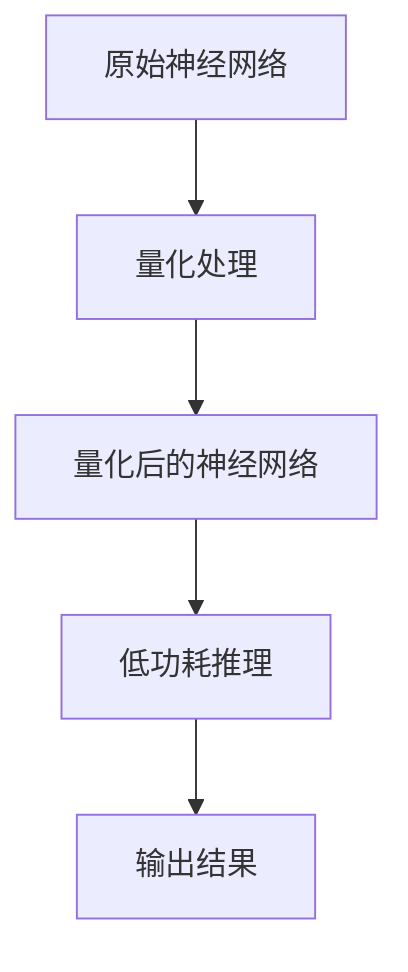

# 基于神经网络量化的低功耗推理模型设计

> 关键词：神经网络量化、低功耗推理、模型设计、深度学习、量化算法、低功耗计算

> 摘要：本文围绕基于神经网络量化的低功耗推理模型设计展开深入探讨。首先介绍了该研究的背景、目的、预期读者等内容，让读者对整体有清晰的认识。接着阐述了神经网络量化及低功耗推理的核心概念与联系，通过文本示意图和 Mermaid 流程图直观呈现。详细讲解了核心算法原理，用 Python 代码进行说明，还给出了相关数学模型和公式并举例。通过项目实战，从开发环境搭建到源代码实现与解读，展示了低功耗推理模型的具体实现过程。分析了实际应用场景，推荐了学习资源、开发工具框架和相关论文著作。最后总结了未来发展趋势与挑战，并给出常见问题解答和参考资料，旨在为相关领域的研究者和开发者提供全面且深入的技术指导，推动低功耗推理模型在实际中的应用与发展。

## 1. 背景介绍 
### 1.1 目的和范围
在当今深度学习蓬勃发展的时代，神经网络模型变得越来越复杂，其计算量和存储需求也急剧增加。这使得在资源受限的设备（如移动设备、物联网设备等）上进行高效的推理变得极具挑战性。一方面，复杂的模型需要大量的计算资源，导致设备功耗大幅上升，缩短了设备的续航时间；另一方面，庞大的模型参数需要大量的存储空间，这对于存储容量有限的设备来说是一个难题。

基于神经网络量化的低功耗推理模型设计的目的在于通过对神经网络进行量化处理，减少模型的计算量和存储需求，从而降低设备在推理过程中的功耗，同时尽可能保持模型的精度。本研究的范围涵盖了神经网络量化的基本原理、常见的量化算法、低功耗推理模型的设计方法，以及如何在实际项目中实现这些技术。

### 1.2 预期读者
本文预期读者包括对深度学习和神经网络感兴趣的研究人员、致力于开发低功耗智能设备的工程师、相关专业的学生，以及希望了解如何优化神经网络模型以实现低功耗推理的技术爱好者。无论您是初学者，希望对神经网络量化和低功耗推理有一个初步的认识，还是有一定经验的专业人士，想要深入研究相关技术细节，本文都将为您提供有价值的信息。

### 1.3 文档结构概述
本文将按照以下结构展开：首先介绍核心概念与联系，帮助读者理解神经网络量化和低功耗推理的基本原理和它们之间的关系；接着详细讲解核心算法原理，并给出具体操作步骤，同时用 Python 代码进行说明；然后介绍相关的数学模型和公式，并通过举例加深读者的理解；通过项目实战，展示低功耗推理模型的具体实现过程，包括开发环境搭建、源代码详细实现和代码解读；分析实际应用场景，让读者了解这些技术在现实中的应用；推荐学习资源、开发工具框架和相关论文著作，为读者提供进一步学习和研究的方向；最后总结未来发展趋势与挑战，给出常见问题解答和参考资料。

### 1.4 术语表
#### 1.4.1 核心术语定义
- **神经网络量化**：将神经网络中的浮点参数和计算转换为低精度的整数表示的过程，以减少计算量和存储需求。
- **低功耗推理**：在保证一定推理精度的前提下，通过优化模型和计算过程，降低设备在进行神经网络推理时的功耗。
- **推理**：使用训练好的神经网络模型对新的输入数据进行预测或分类的过程。
- **量化算法**：用于实现神经网络量化的具体算法，如线性量化、非线性量化等。

#### 1.4.2 相关概念解释
- **浮点运算**：计算机中使用浮点数进行的数值运算，浮点数可以表示很大或很小的数，但计算复杂度较高，功耗也较大。
- **整数运算**：使用整数进行的数值运算，计算复杂度相对较低，功耗也较小。通过将浮点运算转换为整数运算，可以降低计算功耗。
- **模型精度**：神经网络模型在预测或分类任务中的准确性，量化过程可能会对模型精度产生一定影响，需要在低功耗和精度之间进行权衡。

#### 1.4.3 缩略词列表
- **ReLU**：Rectified Linear Unit，修正线性单元，一种常用的神经网络激活函数。
- **QAT**：Quantization Aware Training，量化感知训练，一种在训练过程中考虑量化影响的训练方法。
- **INT8**：8 位整数，是一种常见的量化数据类型。

## 2. 核心概念与联系 
### 2.1 神经网络量化原理
神经网络量化的核心思想是将神经网络中的浮点参数（如权重和偏置）和计算转换为低精度的整数表示。在传统的神经网络中，参数通常以 32 位浮点数（FP32）的形式存储和计算，这种表示方式可以提供较高的精度，但需要较大的存储空间和计算资源。而量化后的参数可以用 8 位整数（INT8）甚至更低的位数来表示，大大减少了存储需求和计算量。

量化过程通常包括两个主要步骤：量化和反量化。量化是将浮点值映射到低精度整数范围的过程，而反量化则是将量化后的整数恢复为浮点值的过程。在推理过程中，大部分计算都可以在量化后的整数域中进行，只有在必要时才进行反量化操作。

### 2.2 低功耗推理原理
低功耗推理的关键在于减少计算量和存储需求，从而降低设备的功耗。通过神经网络量化，可以将原本复杂的浮点运算转换为简单的整数运算，减少了计算单元的工作量，降低了功耗。此外，量化后的模型参数占用的存储空间更小，减少了内存访问的次数，也有助于降低功耗。

### 2.3 核心概念联系
神经网络量化是实现低功耗推理的重要手段。通过量化，可以将神经网络模型进行压缩和优化，减少计算量和存储需求，从而降低设备在推理过程中的功耗。同时，低功耗推理的需求也推动了神经网络量化技术的发展，促使研究者不断探索更高效的量化算法和模型设计方法，以在保证模型精度的前提下，最大程度地降低功耗。

### 2.4 文本示意图
神经网络量化和低功耗推理的关系可以用以下文本示意图表示：

神经网络（FP32 参数和计算） -> 量化操作 -> 量化后的神经网络（低精度整数参数和计算） -> 低功耗推理

### 2.5 Mermaid 流程图


## 3. 核心算法原理 & 具体操作步骤 
### 3.1 线性量化算法原理
线性量化是一种常见的量化算法，其基本思想是将浮点值线性地映射到一个有限的整数范围。假设我们要将浮点值 $x$ 量化为 $n$ 位整数 $q$，可以通过以下公式实现：

$q = \text{round}(\frac{x}{S} + Z)$

其中，$S$ 是缩放因子，$Z$ 是零点偏移。反量化过程则是将量化后的整数 $q$ 恢复为浮点值 $x$：

$x = (q - Z) \times S$

### 3.2 具体操作步骤
1. **确定量化范围**：首先需要确定要量化的浮点值的范围，通常可以通过统计训练数据中的最大值和最小值来确定。
2. **计算缩放因子和零点偏移**：根据量化范围和量化位数，计算缩放因子 $S$ 和零点偏移 $Z$。
3. **量化操作**：将浮点值 $x$ 代入量化公式，得到量化后的整数 $q$。
4. **反量化操作**：在需要使用浮点值时，将量化后的整数 $q$ 代入反量化公式，得到浮点值 $x$。

### 3.3 Python 代码实现
```python
import numpy as np

def linear_quantize(x, bits=8):
    # 确定量化范围
    x_min = np.min(x)
    x_max = np.max(x)
    
    # 计算缩放因子和零点偏移
    q_max = 2**bits - 1
    S = (x_max - x_min) / q_max
    Z = np.round(-x_min / S)
    
    # 量化操作
    q = np.round(x / S + Z).astype(np.int8)
    
    return q, S, Z

def linear_dequantize(q, S, Z):
    # 反量化操作
    x = (q - Z) * S
    
    return x

# 示例数据
x = np.random.randn(10)

# 量化
q, S, Z = linear_quantize(x)

# 反量化
x_dequantized = linear_dequantize(q, S, Z)

print("Original values:", x)
print("Quantized values:", q)
print("Dequantized values:", x_dequantized)
```

### 3.4 代码解释
1. **`linear_quantize` 函数**：该函数实现了线性量化的过程。首先，通过 `np.min` 和 `np.max` 函数确定输入数据的最小值和最大值，从而确定量化范围。然后，根据量化位数计算最大量化值 $q_{max}$，并计算缩放因子 $S$ 和零点偏移 $Z$。最后，将输入数据代入量化公式，得到量化后的整数 $q$。
2. **`linear_dequantize` 函数**：该函数实现了反量化的过程。将量化后的整数 $q$ 代入反量化公式，得到浮点值 $x$。
3. **示例数据**：使用 `np.random.randn` 函数生成一个包含 10 个随机数的数组作为示例数据。调用 `linear_quantize` 函数进行量化，得到量化后的整数 $q$、缩放因子 $S$ 和零点偏移 $Z$。再调用 `linear_dequantize` 函数进行反量化，得到反量化后的浮点值 $x_{dequantized}$。最后，打印原始值、量化值和反量化值，以便观察量化和反量化的效果。

## 4. 数学模型和公式 & 详细讲解 & 举例说明 
### 4.1 线性量化的数学模型
线性量化的数学模型可以用以下公式表示：

$q = \text{round}(\frac{x - x_{min}}{x_{max} - x_{min}} \times (q_{max} - q_{min}) + q_{min})$

其中，$x$ 是要量化的浮点值，$x_{min}$ 和 $x_{max}$ 分别是浮点值的最小值和最大值，$q_{min}$ 和 $q_{max}$ 分别是量化后的整数的最小值和最大值，$\text{round}$ 是四舍五入函数。

### 4.2 缩放因子和零点偏移的计算
缩放因子 $S$ 和零点偏移 $Z$ 可以通过以下公式计算：

$S = \frac{x_{max} - x_{min}}{q_{max} - q_{min}}$

$Z = q_{min} - \text{round}(\frac{x_{min}}{S})$

### 4.3 举例说明
假设我们要将浮点值 $x$ 量化为 8 位整数（$q_{min} = 0$，$q_{max} = 255$），已知 $x_{min} = -1.0$，$x_{max} = 1.0$。

1. **计算缩放因子 $S$**：
$S = \frac{1.0 - (-1.0)}{255 - 0} = \frac{2.0}{255} \approx 0.007843$

2. **计算零点偏移 $Z$**：
$Z = 0 - \text{round}(\frac{-1.0}{0.007843}) = 128$

3. **量化操作**：
假设 $x = 0.5$，则量化后的整数 $q$ 为：
$q = \text{round}(\frac{0.5 - (-1.0)}{1.0 - (-1.0)} \times (255 - 0) + 0) = \text{round}(\frac{1.5}{2.0} \times 255) = \text{round}(191.25) = 191$

4. **反量化操作**：
将量化后的整数 $q = 191$ 反量化为浮点值 $x$：
$x = (191 - 128) \times 0.007843 = 0.4941$

### 4.4 误差分析
从上述例子可以看出，量化和反量化过程会引入一定的误差。误差的大小与量化位数、浮点值的范围以及量化算法有关。一般来说，量化位数越高，误差越小；浮点值的范围越小，误差也越小。在实际应用中，需要在量化位数和误差之间进行权衡，以达到最佳的性能和精度。

## 5. 项目实战：代码实际案例和详细解释说明 
### 5.1 开发环境搭建
#### 5.1.1 安装 Python
首先需要安装 Python 环境，建议使用 Python 3.6 及以上版本。可以从 Python 官方网站（https://www.python.org/downloads/）下载并安装适合自己操作系统的 Python 版本。

#### 5.1.2 安装深度学习框架
本文使用 PyTorch 作为深度学习框架，可以通过以下命令安装：
```sh
pip install torch torchvision
```

#### 5.1.3 安装其他依赖库
还需要安装一些其他的依赖库，如 `numpy`、`matplotlib` 等，可以通过以下命令安装：
```sh
pip install numpy matplotlib
```

### 5.2 源代码详细实现和代码解读
#### 5.2.1 定义简单的神经网络模型
```python
import torch
import torch.nn as nn

class SimpleNet(nn.Module):
    def __init__(self):
        super(SimpleNet, self).__init__()
        self.fc1 = nn.Linear(10, 20)
        self.relu = nn.ReLU()
        self.fc2 = nn.Linear(20, 1)

    def forward(self, x):
        x = self.fc1(x)
        x = self.relu(x)
        x = self.fc2(x)
        return x

# 创建模型实例
model = SimpleNet()
```
**代码解读**：
- `SimpleNet` 类继承自 `nn.Module`，是一个简单的全连接神经网络模型。
- `__init__` 方法中定义了两个全连接层 `fc1` 和 `fc2`，以及一个 ReLU 激活函数。
- `forward` 方法定义了模型的前向传播过程，输入数据依次通过 `fc1`、`ReLU` 和 `fc2` 层。

#### 5.2.2 量化模型
```python
import torch.quantization

# 定义量化配置
quantization_config = torch.quantization.get_default_qconfig('fbgemm')

# 准备量化模型
model.qconfig = quantization_config
torch.quantization.prepare(model, inplace=True)

# 进行量化校准
# 这里需要使用一些校准数据，为了简单起见，我们使用随机数据
calibration_data = torch.randn(100, 10)
model(calibration_data)

# 转换为量化模型
torch.quantization.convert(model, inplace=True)
```
**代码解读**：
- `torch.quantization.get_default_qconfig('fbgemm')` 用于获取默认的量化配置，`fbgemm` 是一种适用于 x86 架构的量化后端。
- `torch.quantization.prepare` 方法用于准备模型进行量化，将模型中的一些模块替换为量化友好的模块。
- 进行量化校准时，需要使用一些校准数据，这里使用随机数据作为示例。
- `torch.quantization.convert` 方法将准备好的模型转换为量化模型。

#### 5.2.3 推理测试
```python
# 生成测试数据
test_data = torch.randn(10, 10)

# 进行推理
output = model(test_data)

print("Output:", output)
```
**代码解读**：
- 生成测试数据 `test_data`。
- 使用量化后的模型进行推理，得到输出结果 `output`。

### 5.3 代码解读与分析
#### 5.3.1 量化配置
量化配置指定了量化的参数和方法，如量化位数、量化算法等。`torch.quantization.get_default_qconfig('fbgemm')` 可以获取适用于 x86 架构的默认量化配置。

#### 5.3.2 量化准备
`torch.quantization.prepare` 方法会将模型中的一些模块替换为量化友好的模块，如将 `nn.Linear` 替换为 `nn.qat.Linear`。这样可以在训练或推理过程中进行量化操作。

#### 5.3.3 量化校准
量化校准是为了确定量化参数（如缩放因子和零点偏移），使得量化后的模型尽可能保持原模型的精度。在实际应用中，需要使用具有代表性的校准数据进行校准。

#### 5.3.4 模型转换
`torch.quantization.convert` 方法将准备好的模型转换为量化模型，将量化友好的模块替换为量化模块，如将 `nn.qat.Linear` 替换为 `nn.quantized.Linear`。

#### 5.3.5 推理测试
使用量化后的模型进行推理，得到输出结果。由于量化后的模型使用低精度整数进行计算，计算量和存储需求都会减少，从而降低了功耗。

## 6. 实际应用场景 
### 6.1 移动设备
在移动设备（如智能手机、平板电脑等）上，电池续航是一个重要的问题。基于神经网络量化的低功耗推理模型可以减少设备在进行图像识别、语音识别等任务时的功耗，延长设备的续航时间。例如，在智能手机上的拍照应用中，使用量化后的图像分类模型可以在不影响拍照速度和效果的前提下，降低功耗。

### 6.2 物联网设备
物联网设备通常资源有限，如计算能力、存储容量和电池续航等。低功耗推理模型可以在这些设备上实现高效的智能处理，如智能传感器可以使用量化后的模型对采集到的数据进行实时分析和处理，减少数据传输和处理的功耗。

### 6.3 边缘计算
边缘计算是指在靠近数据源的边缘设备上进行数据处理和分析，以减少数据传输延迟和带宽需求。基于神经网络量化的低功耗推理模型可以在边缘设备上实现高效的推理，提高边缘计算的效率和性能。例如，在智能交通系统中，路边的边缘设备可以使用量化后的目标检测模型对交通图像进行实时分析，实现交通流量监测和违章行为识别。

### 6.4 自动驾驶
自动驾驶汽车需要实时处理大量的传感器数据，如摄像头图像、雷达数据等。低功耗推理模型可以在保证实时性的前提下，降低汽车的功耗，提高续航里程。例如，使用量化后的目标检测和识别模型可以对道路上的车辆、行人等进行实时检测和识别，为自动驾驶决策提供支持。

## 7. 工具和资源推荐
### 7.1 学习资源推荐
#### 7.1.1 书籍推荐
- 《深度学习》（Deep Learning）：由 Ian Goodfellow、Yoshua Bengio 和 Aaron Courville 合著，是深度学习领域的经典教材，介绍了深度学习的基本原理、算法和应用。
- 《Python 深度学习》（Deep Learning with Python）：由 Francois Chollet 著，通过实际案例介绍了如何使用 Python 和 Keras 进行深度学习开发。
- 《神经网络与深度学习》：由邱锡鹏著，系统地介绍了神经网络和深度学习的基本理论、算法和应用。

#### 7.1.2 在线课程
- Coursera 上的“深度学习专项课程”（Deep Learning Specialization）：由 Andrew Ng 教授授课，包括深度学习的基础、卷积神经网络、循环神经网络等多个模块。
- edX 上的“人工智能基础”（Introduction to Artificial Intelligence）：介绍了人工智能的基本概念、算法和应用，包括神经网络和深度学习的内容。
- 哔哩哔哩上的“动手学深度学习”课程：由李沐等教授授课，通过实际代码演示和讲解，介绍了深度学习的基本原理和应用。

#### 7.1.3 技术博客和网站
- Medium 上的 Towards Data Science：是一个数据科学和机器学习领域的技术博客，有很多关于深度学习和神经网络量化的文章。
- arXiv.org：是一个预印本服务器，提供了大量的学术论文，包括深度学习和神经网络量化的最新研究成果。
- TensorFlow 官方博客：提供了关于 TensorFlow 深度学习框架的最新消息和技术文章，包括量化和低功耗推理的相关内容。

### 7.2 开发工具框架推荐
#### 7.2.1 IDE和编辑器
- PyCharm：是一款专门为 Python 开发设计的集成开发环境（IDE），提供了丰富的功能，如代码编辑、调试、代码分析等。
- Jupyter Notebook：是一个交互式的开发环境，适合进行数据分析和深度学习实验，支持 Python、R 等多种编程语言。
- Visual Studio Code：是一款轻量级的代码编辑器，支持多种编程语言和插件，有很多与深度学习开发相关的插件。

#### 7.2.2 调试和性能分析工具
- TensorBoard：是 TensorFlow 提供的一个可视化工具，可以用于可视化模型的训练过程、性能指标等。
- PyTorch Profiler：是 PyTorch 提供的一个性能分析工具，可以用于分析模型的计算性能和内存使用情况。
- NVIDIA Nsight Systems：是 NVIDIA 提供的一个性能分析工具，适合用于分析 GPU 上的深度学习模型的性能。

#### 7.2.3 相关框架和库
- PyTorch：是一个开源的深度学习框架，提供了丰富的神经网络模块和工具，支持量化和低功耗推理。
- TensorFlow：是另一个广泛使用的深度学习框架，也提供了量化和低功耗推理的支持。
- ONNX：是一个开放的神经网络交换格式，可以用于在不同的深度学习框架之间转换模型，方便进行量化和推理。

### 7.3 相关论文著作推荐
#### 7.3.1 经典论文
- “Deep Compression: Compressing Deep Neural Networks with Pruning, Trained Quantization and Huffman Coding”：介绍了一种深度压缩方法，包括剪枝、量化和哈夫曼编码，用于压缩深度神经网络。
- “Quantization and Training of Neural Networks for Efficient Integer-Arithmetic-Only Inference”：提出了一种量化训练方法，使得神经网络可以在只使用整数运算的情况下进行推理。
- “Binarized Neural Networks: Training Deep Neural Networks with Weights and Activations Constrained to +1 or -1”：介绍了二值化神经网络，将神经网络的权重和激活值约束为 +1 或 -1，大大减少了计算量和存储需求。

#### 7.3.2 最新研究成果
可以通过 arXiv.org 等预印本服务器关注神经网络量化和低功耗推理的最新研究成果。例如，一些研究致力于开发更高效的量化算法、优化量化模型的训练方法，以及探索新的低功耗推理硬件架构。

#### 7.3.3 应用案例分析
可以参考一些实际应用案例的论文，了解基于神经网络量化的低功耗推理模型在不同领域的应用和效果。例如，在智能交通、医疗影像、工业检测等领域的应用案例分析。

## 8. 总结：未来发展趋势与挑战
### 8.1 未来发展趋势
#### 8.1.1 更高效的量化算法
未来的研究将致力于开发更高效的量化算法，进一步减少量化误差，提高量化模型的精度。例如，一些研究正在探索非线性量化算法、自适应量化算法等，以更好地适应不同的神经网络模型和应用场景。

#### 8.1.2 硬件与算法协同设计
随着硬件技术的不断发展，未来将更加注重硬件与算法的协同设计。例如，开发专门的低功耗推理芯片，优化芯片的架构和指令集，以更好地支持量化后的神经网络计算。同时，算法也将根据硬件的特点进行优化，提高计算效率和功耗性能。

#### 8.1.3 端到端的低功耗推理解决方案
未来将出现更多的端到端的低功耗推理解决方案，从数据采集、模型训练、量化到推理的整个过程都进行优化，以实现更低的功耗和更高的性能。例如，在物联网设备中，将传感器、处理器和模型进行一体化设计，实现高效的智能处理。

#### 8.1.4 跨领域应用拓展
基于神经网络量化的低功耗推理模型将在更多的领域得到应用，如智能医疗、智能农业、智能家居等。随着这些领域对智能处理需求的增加，低功耗推理模型将为这些领域的发展提供有力支持。

### 8.2 挑战
#### 8.2.1 量化精度损失
量化过程会不可避免地引入一定的精度损失，如何在降低功耗的同时，最大程度地减少精度损失是一个挑战。需要不断探索更先进的量化算法和训练方法，以提高量化模型的精度。

#### 8.2.2 硬件兼容性
不同的硬件平台对量化算法和模型的支持程度不同，如何确保量化模型在各种硬件平台上都能高效运行是一个挑战。需要开发通用的量化标准和接口，提高模型的硬件兼容性。

#### 8.2.3 模型复杂度和计算量
随着神经网络模型的不断复杂化，量化和低功耗推理的难度也在增加。如何在处理复杂模型时，仍然能够实现高效的量化和低功耗推理是一个挑战。需要开发更高效的量化和推理算法，以应对模型复杂度的增加。

#### 8.2.4 数据隐私和安全
在低功耗推理过程中，数据隐私和安全也是一个重要的问题。如何在保证低功耗的同时，确保数据的隐私和安全是一个挑战。需要开发安全的量化和推理算法，以及数据加密和访问控制机制。

## 9. 附录：常见问题与解答
### 9.1 量化会对模型精度产生多大影响？
量化对模型精度的影响取决于量化位数、量化算法和模型的复杂度等因素。一般来说，量化位数越低，精度损失越大。但是，通过一些优化方法，如量化感知训练，可以在一定程度上减少精度损失。

### 9.2 如何选择合适的量化位数？
选择合适的量化位数需要在精度和功耗之间进行权衡。如果对精度要求较高，可以选择较高的量化位数；如果对功耗要求较高，可以选择较低的量化位数。在实际应用中，需要根据具体的应用场景和需求进行选择。

### 9.3 量化后的模型可以在哪些硬件平台上运行？
量化后的模型可以在多种硬件平台上运行，如 CPU、GPU、FPGA 等。不同的硬件平台对量化的支持程度不同，需要根据硬件平台的特点选择合适的量化算法和模型。

### 9.4 如何进行量化模型的训练？
可以使用量化感知训练（QAT）方法进行量化模型的训练。在训练过程中，模拟量化的过程，使得模型在训练时就考虑到量化的影响，从而提高量化模型的精度。

### 9.5 量化和剪枝有什么区别？
量化是将神经网络中的浮点参数和计算转换为低精度的整数表示，以减少计算量和存储需求；而剪枝是去除神经网络中不重要的连接和参数，以减少模型的复杂度。量化和剪枝可以结合使用，进一步压缩模型和降低功耗。

## 10. 扩展阅读 & 参考资料
### 10.1 扩展阅读
- 可以阅读更多关于深度学习、神经网络量化和低功耗计算的书籍和论文，深入了解相关技术的原理和应用。
- 关注相关领域的学术会议和研讨会，了解最新的研究成果和发展趋势。

### 10.2 参考资料
- Goodfellow, I., Bengio, Y., & Courville, A. (2016). Deep Learning. MIT Press.
- Chollet, F. (2018). Deep Learning with Python. Manning Publications.
- 邱锡鹏. (2019). 神经网络与深度学习. 机械工业出版社.
- Han, S., Mao, H., & Dally, W. J. (2015). Deep Compression: Compressing Deep Neural Networks with Pruning, Trained Quantization and Huffman Coding. arXiv preprint arXiv:1510.00149.
- Jacob, B., Kligys, S., Chen, B., Zhu, M., Tang, M., Howard, A., ... & Adam, H. (2018). Quantization and Training of Neural Networks for Efficient Integer-Arithmetic-Only Inference. In Proceedings of the IEEE conference on computer vision and pattern recognition (pp. 2704-2713).
- Courbariaux, M., Bengio, Y., & David, J. P. (2015). Binarized Neural Networks: Training Deep Neural Networks with Weights and Activations Constrained to +1 or -1. arXiv preprint arXiv:1602.02830.