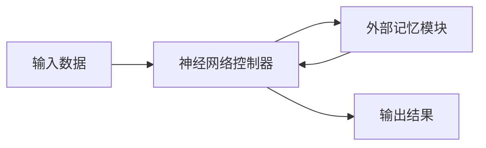

# 基于记忆增强网络的长期战略规划推理能力

> 关键词：记忆增强网络、长期战略规划、推理能力、人工智能、深度学习、认知计算、神经网络

> 摘要：本文聚焦于基于记忆增强网络的长期战略规划推理能力，深入探讨了记忆增强网络的核心概念、算法原理、数学模型等内容。通过详细的Python代码示例和项目实战，展示了如何利用记忆增强网络实现长期战略规划推理。同时，分析了其实际应用场景，推荐了相关的学习资源、开发工具和论文著作。最后，总结了未来发展趋势与挑战，并提供了常见问题解答和参考资料，旨在为相关领域的研究者和开发者提供全面且深入的技术指导。

## 1. 背景介绍 
### 1.1 目的和范围
在当今复杂多变的环境中，长期战略规划对于个人、组织和系统的成功至关重要。传统的人工智能和机器学习方法在处理长期战略规划中的复杂推理任务时面临诸多挑战，例如难以处理长序列信息、缺乏有效的记忆机制等。记忆增强网络作为一种新兴的技术，为解决这些问题提供了新的思路和方法。本文的目的在于全面深入地介绍基于记忆增强网络的长期战略规划推理能力，包括其核心概念、算法原理、数学模型、实际应用等方面，旨在帮助读者理解和掌握这一前沿技术，并能够将其应用于实际的长期战略规划任务中。

### 1.2 预期读者
本文预期读者包括人工智能、机器学习、计算机科学等领域的研究者、开发者、学生，以及对长期战略规划推理技术感兴趣的专业人士。无论您是初学者还是有一定经验的专业人员，都能从本文中获取有价值的信息和技术指导。

### 1.3 文档结构概述
本文将按照以下结构进行组织：首先介绍基于记忆增强网络的长期战略规划推理能力的背景知识，包括目的、预期读者和文档结构概述等；接着详细阐述核心概念与联系，包括记忆增强网络的原理和架构；然后讲解核心算法原理和具体操作步骤，并通过Python源代码进行详细阐述；随后介绍数学模型和公式，并进行详细讲解和举例说明；再通过项目实战展示代码实际案例和详细解释说明；接着分析实际应用场景；之后推荐相关的工具和资源；最后总结未来发展趋势与挑战，提供常见问题与解答以及扩展阅读和参考资料。

### 1.4 术语表
#### 1.4.1 核心术语定义
- **记忆增强网络（Memory Augmented Neural Network, MANN）**：一种结合了神经网络和外部记忆模块的人工智能模型，通过记忆模块来存储和检索信息，以增强网络处理长序列信息和复杂任务的能力。
- **长期战略规划**：在一个较长的时间范围内，对目标、资源、行动等进行全面规划和决策的过程，旨在实现特定的长期目标。
- **推理能力**：从已知信息中推导出新知识或结论的能力，在人工智能领域中，通常指模型根据输入数据进行逻辑推理和预测的能力。

#### 1.4.2 相关概念解释
- **神经网络**：一种模仿人类神经系统的计算模型，由大量的神经元组成，通过对输入数据进行多层非线性变换来学习数据的特征和模式。
- **外部记忆模块**：在记忆增强网络中，用于存储和管理信息的模块，与神经网络进行交互，以提供额外的信息和记忆支持。
- **注意力机制**：一种在神经网络中用于选择和聚焦重要信息的机制，通过计算输入数据的权重，使得网络能够更加关注重要的部分。

#### 1.4.3 缩略词列表
- **MANN**：Memory Augmented Neural Network（记忆增强网络）
- **LSTM**：Long Short-Term Memory（长短期记忆网络）
- **GRU**：Gated Recurrent Unit（门控循环单元）

## 2. 核心概念与联系 

### 记忆增强网络的原理
记忆增强网络的核心思想是将神经网络与外部记忆模块相结合，以解决传统神经网络在处理长序列信息和复杂任务时的局限性。传统的神经网络，如循环神经网络（RNN）及其变体（LSTM、GRU），虽然能够处理序列数据，但它们的记忆能力有限，难以处理长时间跨度的依赖关系。而记忆增强网络通过引入外部记忆模块，使得网络能够存储和检索大量的信息，从而增强了其处理长序列信息和复杂任务的能力。

### 记忆增强网络的架构
记忆增强网络的基本架构包括神经网络控制器和外部记忆模块。神经网络控制器负责处理输入数据，并与外部记忆模块进行交互，以读取和写入信息。外部记忆模块通常是一个可读写的存储器，用于存储历史信息和中间结果。

下面是记忆增强网络架构的文本示意图：

```plaintext
输入数据 --> 神经网络控制器 --> 外部记忆模块
           <--                <--
```

### Mermaid 流程图


## 3. 核心算法原理 & 具体操作步骤 

### 算法原理
记忆增强网络的核心算法主要包括两个部分：读取操作和写入操作。读取操作是指神经网络控制器从外部记忆模块中读取信息，以辅助当前的处理任务；写入操作是指神经网络控制器将处理结果或中间信息写入外部记忆模块，以便后续使用。

下面是一个简单的记忆增强网络的Python代码示例，用于演示读取和写入操作：

```python
import numpy as np

# 定义外部记忆模块
class MemoryModule:
    def __init__(self, memory_size, vector_size):
        self.memory = np.zeros((memory_size, vector_size))

    def read(self, read_key):
        # 简单的读取操作，根据读取键选择记忆单元
        read_index = np.argmax(np.dot(self.memory, read_key))
        return self.memory[read_index]

    def write(self, write_key, write_value):
        # 简单的写入操作，根据写入键更新记忆单元
        write_index = np.argmax(np.dot(self.memory, write_key))
        self.memory[write_index] = write_value

# 定义神经网络控制器
class NeuralNetworkController:
    def __init__(self, input_size, hidden_size, output_size, memory_module):
        self.weights_ih = np.random.randn(hidden_size, input_size)
        self.weights_ho = np.random.randn(output_size, hidden_size)
        self.memory_module = memory_module

    def forward(self, input_data):
        # 前向传播
        hidden = np.dot(self.weights_ih, input_data)
        hidden = np.tanh(hidden)

        # 读取记忆
        read_key = hidden
        read_value = self.memory_module.read(read_key)

        # 合并输入和读取的记忆
        combined_input = np.concatenate((input_data, read_value))

        # 继续前向传播
        output = np.dot(self.weights_ho, combined_input)
        output = np.tanh(output)

        # 写入记忆
        write_key = output
        write_value = combined_input
        self.memory_module.write(write_key, write_value)

        return output

# 初始化记忆模块和神经网络控制器
memory_module = MemoryModule(memory_size=10, vector_size=5)
controller = NeuralNetworkController(input_size=3, hidden_size=4, output_size=2, memory_module=memory_module)

# 输入数据
input_data = np.random.randn(3)

# 前向传播
output = controller.forward(input_data)
print("Output:", output)
```

### 具体操作步骤
1. **初始化**：初始化外部记忆模块和神经网络控制器，包括记忆模块的大小、向量维度、神经网络的权重等。
2. **输入数据**：将输入数据传递给神经网络控制器。
3. **前向传播**：神经网络控制器对输入数据进行处理，生成隐藏层输出。
4. **读取操作**：根据隐藏层输出生成读取键，从外部记忆模块中读取信息。
5. **合并输入**：将输入数据和读取的信息合并，作为新的输入。
6. **继续前向传播**：对合并后的输入进行处理，生成输出结果。
7. **写入操作**：根据输出结果生成写入键，将合并后的输入写入外部记忆模块。
8. **输出结果**：返回最终的输出结果。

## 4. 数学模型和公式 & 详细讲解 & 举例说明 

### 读取操作
读取操作的数学模型可以表示为：

$$
r_t = \sum_{i=1}^{N} w_i^t m_i
$$

其中，$r_t$ 表示第 $t$ 时刻读取的信息，$N$ 表示记忆模块的大小，$w_i^t$ 表示第 $t$ 时刻第 $i$ 个记忆单元的读取权重，$m_i$ 表示第 $i$ 个记忆单元的内容。

读取权重 $w_i^t$ 可以通过注意力机制计算得到，例如：

$$
w_i^t = \frac{\exp(\text{sim}(k_t, m_i))}{\sum_{j=1}^{N} \exp(\text{sim}(k_t, m_j))}
$$

其中，$k_t$ 表示第 $t$ 时刻的读取键，$\text{sim}$ 表示相似度函数，例如点积相似度：

$$
\text{sim}(k_t, m_i) = k_t^T m_i
$$

### 写入操作
写入操作的数学模型可以表示为：

$$
m_i^{t+1} = (1 - e_i^t) m_i^t + a_i^t v_t
$$

其中，$m_i^{t+1}$ 表示第 $t+1$ 时刻第 $i$ 个记忆单元的内容，$e_i^t$ 表示第 $t$ 时刻第 $i$ 个记忆单元的擦除向量，$a_i^t$ 表示第 $t$ 时刻第 $i$ 个记忆单元的添加向量，$v_t$ 表示第 $t$ 时刻的写入值。

擦除向量 $e_i^t$ 和添加向量 $a_i^t$ 可以通过神经网络控制器生成，例如：

$$
e_i^t = \sigma(g_e^t)
$$

$$
a_i^t = \sigma(g_a^t)
$$

其中，$\sigma$ 表示 sigmoid 函数，$g_e^t$ 和 $g_a^t$ 分别表示擦除门和添加门的输出。

### 举例说明
假设我们有一个记忆模块，大小为 $N = 3$，向量维度为 $d = 2$，记忆单元的内容分别为：

$$
m_1 = \begin{bmatrix} 1 \\ 2 \end{bmatrix}, m_2 = \begin{bmatrix} 3 \\ 4 \end{bmatrix}, m_3 = \begin{bmatrix} 5 \\ 6 \end{bmatrix}
$$

读取键为：

$$
k_t = \begin{bmatrix} 2 \\ 3 \end{bmatrix}
$$

首先计算相似度：

$$
\text{sim}(k_t, m_1) = k_t^T m_1 = 2 \times 1 + 3 \times 2 = 8
$$

$$
\text{sim}(k_t, m_2) = k_t^T m_2 = 2 \times 3 + 3 \times 4 = 18
$$

$$
\text{sim}(k_t, m_3) = k_t^T m_3 = 2 \times 5 + 3 \times 6 = 28
$$

然后计算读取权重：

$$
w_1^t = \frac{\exp(8)}{\exp(8) + \exp(18) + \exp(28)} \approx 0.000
$$

$$
w_2^t = \frac{\exp(18)}{\exp(8) + \exp(18) + \exp(28)} \approx 0.002
$$

$$
w_3^t = \frac{\exp(28)}{\exp(8) + \exp(18) + \exp(28)} \approx 0.998
$$

最后计算读取的信息：

$$
r_t = w_1^t m_1 + w_2^t m_2 + w_3^t m_3 \approx 0.000 \times \begin{bmatrix} 1 \\ 2 \end{bmatrix} + 0.002 \times \begin{bmatrix} 3 \\ 4 \end{bmatrix} + 0.998 \times \begin{bmatrix} 5 \\ 6 \end{bmatrix} = \begin{bmatrix} 4.994 \\ 5.992 \end{bmatrix}
$$

## 5. 项目实战：代码实际案例和详细解释说明 

### 5.1  开发环境搭建
在进行项目实战之前，需要搭建相应的开发环境。以下是一些基本的步骤：
1. **安装 Python**：建议安装 Python 3.6 或更高版本，可以从 Python 官方网站（https://www.python.org/downloads/）下载并安装。
2. **安装深度学习框架**：本文使用 PyTorch 作为深度学习框架，可以使用以下命令进行安装：
```sh
pip install torch torchvision
```
3. **安装其他依赖库**：根据项目的具体需求，可能需要安装其他依赖库，例如 numpy、matplotlib 等，可以使用以下命令进行安装：
```sh
pip install numpy matplotlib
```

### 5.2  源代码详细实现和代码解读
下面是一个基于 PyTorch 实现的记忆增强网络的完整代码示例，用于解决一个简单的序列预测任务：

```python
import torch
import torch.nn as nn
import torch.optim as optim
import numpy as np

# 定义外部记忆模块
class MemoryModule(nn.Module):
    def __init__(self, memory_size, vector_size):
        super(MemoryModule, self).__init__()
        self.memory = nn.Parameter(torch.randn(memory_size, vector_size))

    def read(self, read_key):
        # 计算读取权重
        similarities = torch.matmul(read_key, self.memory.t())
        read_weights = torch.softmax(similarities, dim=1)

        # 读取信息
        read_value = torch.matmul(read_weights, self.memory)
        return read_value

    def write(self, write_key, write_value):
        # 计算写入权重
        similarities = torch.matmul(write_key, self.memory.t())
        write_weights = torch.softmax(similarities, dim=1)

        # 写入信息
        erase_vector = torch.sigmoid(torch.matmul(write_weights, self.memory))
        add_vector = torch.tanh(torch.matmul(write_weights, write_value))
        self.memory = (1 - erase_vector) * self.memory + add_vector

# 定义神经网络控制器
class NeuralNetworkController(nn.Module):
    def __init__(self, input_size, hidden_size, output_size, memory_size, vector_size):
        super(NeuralNetworkController, self).__init__()
        self.fc1 = nn.Linear(input_size, hidden_size)
        self.fc2 = nn.Linear(hidden_size + vector_size, output_size)
        self.memory_module = MemoryModule(memory_size, vector_size)

    def forward(self, input_data):
        # 前向传播
        hidden = torch.relu(self.fc1(input_data))

        # 读取记忆
        read_value = self.memory_module.read(hidden)

        # 合并输入和读取的记忆
        combined_input = torch.cat((hidden, read_value), dim=1)

        # 继续前向传播
        output = self.fc2(combined_input)
        return output

# 生成训练数据
def generate_data(num_samples, sequence_length, input_size):
    data = np.random.randn(num_samples, sequence_length, input_size)
    labels = np.sum(data, axis=1)
    return torch.tensor(data, dtype=torch.float32), torch.tensor(labels, dtype=torch.float32)

# 训练模型
def train_model(model, train_data, train_labels, num_epochs, learning_rate):
    criterion = nn.MSELoss()
    optimizer = optim.Adam(model.parameters(), lr=learning_rate)

    for epoch in range(num_epochs):
        optimizer.zero_grad()
        outputs = model(train_data)
        loss = criterion(outputs, train_labels)
        loss.backward()
        optimizer.step()

        if (epoch + 1) % 100 == 0:
            print(f'Epoch [{epoch+1}/{num_epochs}], Loss: {loss.item():.4f}')

# 主函数
if __name__ == '__main__':
    # 超参数设置
    input_size = 3
    hidden_size = 4
    output_size = 3
    memory_size = 10
    vector_size = 5
    num_samples = 1000
    sequence_length = 5
    num_epochs = 1000
    learning_rate = 0.001

    # 生成训练数据
    train_data, train_labels = generate_data(num_samples, sequence_length, input_size)

    # 初始化模型
    model = NeuralNetworkController(input_size, hidden_size, output_size, memory_size, vector_size)

    # 训练模型
    train_model(model, train_data, train_labels, num_epochs, learning_rate)
```

### 5.3  代码解读与分析
1. **外部记忆模块**：`MemoryModule` 类实现了外部记忆模块的读取和写入操作。读取操作通过计算读取键与记忆单元的相似度，得到读取权重，然后根据权重读取信息；写入操作通过计算写入键与记忆单元的相似度，得到写入权重，然后根据权重擦除和添加信息。
2. **神经网络控制器**：`NeuralNetworkController` 类实现了神经网络控制器的前向传播过程。首先对输入数据进行处理，生成隐藏层输出；然后从外部记忆模块中读取信息；接着将隐藏层输出和读取的信息合并，作为新的输入；最后对合并后的输入进行处理，生成输出结果。
3. **训练数据生成**：`generate_data` 函数用于生成训练数据，这里生成的是随机的序列数据，标签为序列数据的总和。
4. **训练模型**：`train_model` 函数用于训练模型，使用均方误差损失函数和 Adam 优化器进行训练。
5. **主函数**：在主函数中，设置超参数，生成训练数据，初始化模型，并调用 `train_model` 函数进行训练。

## 6. 实际应用场景 
基于记忆增强网络的长期战略规划推理能力在许多领域都有广泛的应用，以下是一些常见的应用场景：
1. **金融领域**：在金融市场中，长期战略规划对于投资决策、风险管理等至关重要。记忆增强网络可以用于分析历史市场数据、预测市场趋势、制定投资策略等，帮助投资者做出更明智的决策。
2. **医疗领域**：在医疗领域，长期战略规划对于疾病预防、治疗方案制定、医疗资源分配等具有重要意义。记忆增强网络可以用于分析患者的病历数据、预测疾病的发展趋势、推荐个性化的治疗方案等，提高医疗服务的质量和效率。
3. **交通领域**：在交通领域，长期战略规划对于交通基础设施建设、交通流量管理、智能交通系统等具有重要作用。记忆增强网络可以用于分析交通数据、预测交通流量、优化交通信号控制等，提高交通系统的运行效率和安全性。
4. **工业领域**：在工业领域，长期战略规划对于生产计划制定、供应链管理、质量控制等具有重要意义。记忆增强网络可以用于分析生产数据、预测设备故障、优化生产流程等，提高工业生产的效率和质量。
5. **游戏领域**：在游戏领域，长期战略规划对于游戏策略制定、角色行为决策等具有重要作用。记忆增强网络可以用于分析游戏数据、预测对手的行为、制定最优的游戏策略等，提高游戏的趣味性和挑战性。

## 7. 工具和资源推荐
### 7.1 学习资源推荐
#### 7.1.1 书籍推荐
- 《深度学习》（Deep Learning）：由 Ian Goodfellow、Yoshua Bengio 和 Aaron Courville 编写，是深度学习领域的经典教材，全面介绍了深度学习的基本概念、算法和应用。
- 《神经网络与深度学习》（Neural Networks and Deep Learning）：由 Michael Nielsen 编写，是一本免费的在线书籍，以通俗易懂的方式介绍了神经网络和深度学习的基本原理和实现方法。
- 《Python深度学习》（Deep Learning with Python）：由 Francois Chollet 编写，是一本结合 Python 和 Keras 框架的深度学习实践指南，适合初学者快速入门。

#### 7.1.2 在线课程
- Coursera 上的“深度学习专项课程”（Deep Learning Specialization）：由 Andrew Ng 教授讲授，是一套系统的深度学习课程，包括神经网络基础、卷积神经网络、循环神经网络等内容。
- edX 上的“强化学习基础”（Foundations of Reinforcement Learning）：由 Berkeley 大学的 Pieter Abbeel 教授讲授，介绍了强化学习的基本概念、算法和应用。
- Udemy 上的“深度学习 A-Z™：实践人工神经网络”（Deep Learning A-Z™: Hands-On Artificial Neural Networks）：是一门实践导向的深度学习课程，通过实际案例介绍了深度学习的应用。

#### 7.1.3 技术博客和网站
- Medium 上的 Towards Data Science：是一个数据科学和机器学习领域的技术博客平台，有许多关于深度学习、记忆增强网络等方面的优质文章。
- arXiv.org：是一个预印本服务器，提供了大量的学术论文，包括人工智能、机器学习等领域的最新研究成果。
- OpenAI Blog：是 OpenAI 官方的博客，发布了许多关于人工智能、深度学习等方面的研究成果和技术文章。

### 7.2 开发工具框架推荐
#### 7.2.1 IDE和编辑器
- PyCharm：是一款专业的 Python 集成开发环境，提供了代码编辑、调试、版本控制等功能，适合开发深度学习项目。
- Jupyter Notebook：是一个交互式的笔记本环境，支持 Python、R 等多种编程语言，适合进行数据探索、模型训练和可视化等工作。
- Visual Studio Code：是一款轻量级的代码编辑器，支持多种编程语言和插件，具有丰富的扩展功能，适合快速开发和调试代码。

#### 7.2.2 调试和性能分析工具
- TensorBoard：是 TensorFlow 提供的一个可视化工具，用于监控和分析模型的训练过程、性能指标等。
- PyTorch Profiler：是 PyTorch 提供的一个性能分析工具，用于分析模型的运行时间、内存使用等情况，帮助优化模型性能。
- NVIDIA Nsight Systems：是 NVIDIA 提供的一个性能分析工具，用于分析 GPU 加速的深度学习模型的性能，帮助优化 GPU 资源的使用。

#### 7.2.3 相关框架和库
- PyTorch：是一个开源的深度学习框架，提供了丰富的神经网络层、优化器、损失函数等，支持 GPU 加速，适合快速开发和训练深度学习模型。
- TensorFlow：是一个开源的深度学习框架，由 Google 开发和维护，提供了高效的分布式训练、模型部署等功能，适合大规模的深度学习应用。
- NumPy：是一个 Python 科学计算库，提供了高效的数组操作和数学函数，是深度学习框架的基础库之一。
- Matplotlib：是一个 Python 数据可视化库，提供了丰富的绘图功能，适合用于可视化训练数据、模型性能等。

### 7.3 相关论文著作推荐
#### 7.3.1 经典论文
- "Memory Networks"（2014）：由 Jason Weston、Sumit Chopra 和 Antoine Bordes 发表，首次提出了记忆网络的概念，为记忆增强网络的发展奠定了基础。
- "Neural Turing Machines"（2014）：由 Alex Graves、Greg Wayne 和 Ivo Danihelka 发表，提出了神经图灵机的模型，将外部记忆模块与神经网络相结合，实现了可微分的图灵机。
- "End-To-End Memory Networks"（2015）：由 Sukhbaatar Sainbayar、Jason Weston 和 Rob Fergus 发表，提出了端到端的记忆网络模型，简化了记忆网络的训练过程。

#### 7.3.2 最新研究成果
- 关注 arXiv.org 上的最新论文，以及顶级学术会议（如 NeurIPS、ICML、CVPR 等）上的研究成果，了解记忆增强网络领域的最新进展。

#### 7.3.3 应用案例分析
- 可以参考相关的学术论文、技术博客和行业报告，了解记忆增强网络在不同领域的应用案例和实践经验。

## 8. 总结：未来发展趋势与挑战
### 未来发展趋势
1. **与其他技术的融合**：记忆增强网络将与其他人工智能技术（如强化学习、生成对抗网络等）相结合，形成更加复杂和强大的模型，以解决更具挑战性的任务。
2. **应用领域的拓展**：记忆增强网络将在更多的领域得到应用，如自动驾驶、智能家居、智能医疗等，为这些领域的发展带来新的机遇和挑战。
3. **模型的可解释性和可解释性**：随着记忆增强网络的应用越来越广泛，模型的可解释性和可解释性将成为一个重要的研究方向，以提高模型的可信度和可靠性。
4. **硬件的支持**：随着硬件技术的不断发展，如 GPU、TPU 等的性能不断提升，将为记忆增强网络的训练和推理提供更强大的计算支持，促进其更快的发展。

### 挑战
1. **数据隐私和安全**：记忆增强网络需要处理大量的数据，数据隐私和安全问题将成为一个重要的挑战，需要采取有效的措施来保护数据的安全和隐私。
2. **计算资源的需求**：记忆增强网络的训练和推理需要大量的计算资源，如何优化模型的结构和算法，降低计算资源的需求，将是一个重要的研究方向。
3. **模型的泛化能力**：记忆增强网络在处理复杂任务时，可能会出现过拟合的问题，如何提高模型的泛化能力，使其能够在不同的数据集和任务上取得良好的性能，将是一个挑战。
4. **伦理和法律问题**：随着记忆增强网络的应用越来越广泛，伦理和法律问题将成为一个重要的挑战，需要制定相应的伦理和法律规范，以确保其合理和合法的应用。

## 9. 附录：常见问题与解答
### 1. 记忆增强网络与传统神经网络有什么区别？
记忆增强网络与传统神经网络的主要区别在于引入了外部记忆模块。传统神经网络的记忆能力有限，难以处理长时间跨度的依赖关系；而记忆增强网络通过外部记忆模块可以存储和检索大量的信息，从而增强了其处理长序列信息和复杂任务的能力。

### 2. 如何选择记忆模块的大小和向量维度？
记忆模块的大小和向量维度的选择需要根据具体的任务和数据集进行调整。一般来说，记忆模块的大小越大，网络的记忆能力越强，但计算资源的需求也会相应增加；向量维度的选择需要考虑数据的特征和模型的复杂度。可以通过实验的方法来选择合适的大小和向量维度。

### 3. 记忆增强网络的训练过程中需要注意什么？
在记忆增强网络的训练过程中，需要注意以下几点：
- **初始化**：合理初始化网络的权重和记忆模块的内容，有助于提高训练的稳定性和收敛速度。
- **学习率**：选择合适的学习率，避免学习率过大导致模型不收敛，或学习率过小导致训练速度过慢。
- **正则化**：可以使用正则化方法（如 L1、L2 正则化）来防止模型过拟合。
- **训练数据**：确保训练数据的质量和多样性，有助于提高模型的泛化能力。

### 4. 记忆增强网络可以应用于哪些具体的任务？
记忆增强网络可以应用于许多具体的任务，如自然语言处理（文本生成、机器翻译等）、图像识别（图像分类、目标检测等）、强化学习（智能体决策、路径规划等）、时间序列预测（股票价格预测、天气预测等）等。

## 10. 扩展阅读 & 参考资料
1. Goodfellow, I., Bengio, Y., & Courville, A. (2016). Deep Learning. MIT Press.
2. Nielsen, M. A. (2015). Neural Networks and Deep Learning. Determination Press.
3. Chollet, F. (2017). Deep Learning with Python. Manning Publications.
4. Weston, J., Chopra, S., & Bordes, A. (2014). Memory Networks. arXiv preprint arXiv:1410.3916.
5. Graves, A., Wayne, G., & Danihelka, I. (2014). Neural Turing Machines. arXiv preprint arXiv:1410.5401.
6. Sukhbaatar, S., Weston, J., & Fergus, R. (2015). End-To-End Memory Networks. arXiv preprint arXiv:1503.08895.
7. Coursera. (n.d.). Deep Learning Specialization. Retrieved from https://www.coursera.org/specializations/deep-learning
8. edX. (n.d.). Foundations of Reinforcement Learning. Retrieved from https://www.edx.org/course/foundations-of-reinforcement-learning
9. Udemy. (n.d.). Deep Learning A-Z™: Hands-On Artificial Neural Networks. Retrieved from https://www.udemy.com/course/deeplearning/
10. Medium. (n.d.). Towards Data Science. Retrieved from https://towardsdatascience.com/
11. arXiv.org. (n.d.). arXiv.org. Retrieved from https://arxiv.org/
12. OpenAI Blog. (n.d.). OpenAI Blog. Retrieved from https://openai.com/blog/
13. PyTorch. (n.d.). PyTorch. Retrieved from https://pytorch.org/
14. TensorFlow. (n.d.). TensorFlow. Retrieved from https://www.tensorflow.org/
15. NumPy. (n.d.). NumPy. Retrieved from https://numpy.org/
16. Matplotlib. (n.d.). Matplotlib. Retrieved from https://matplotlib.org/