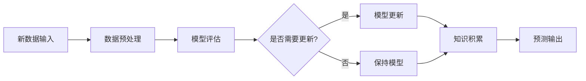

# 增量学习策略:使AI系统具备持续学习能力

> 关键词：增量学习、AI系统、持续学习、机器学习、模型更新、数据效率、知识积累

> 摘要：本文围绕增量学习策略展开，旨在深入探讨如何让AI系统具备持续学习的能力。首先介绍了增量学习的背景知识，包括其目的、适用读者、文档结构和相关术语。接着阐述了增量学习的核心概念与联系，通过文本示意图和Mermaid流程图进行清晰展示。详细讲解了核心算法原理，用Python代码进行示例说明，并给出了相应的数学模型和公式。通过项目实战案例，展示了增量学习在实际中的应用和代码实现过程。同时探讨了增量学习的实际应用场景，推荐了相关的学习资源、开发工具框架和论文著作。最后对增量学习的未来发展趋势与挑战进行总结，并提供常见问题解答和扩展阅读参考资料，为读者全面了解和应用增量学习策略提供有力的支持。

## 1. 背景介绍 
### 1.1 目的和范围
在当今信息爆炸的时代，数据呈现出快速增长和动态变化的特点。传统的机器学习模型通常是在固定的数据集上进行训练，训练完成后模型结构和参数就基本固定，难以适应新的数据和变化的环境。而增量学习策略的目的就是让AI系统能够在不断接收新数据的过程中，持续更新和优化自身的模型，从而保持对新数据的适应性和预测准确性。

本文的范围将涵盖增量学习的基本概念、核心算法原理、数学模型、实际应用案例以及相关的工具和资源推荐等方面，旨在为读者提供一个全面深入的增量学习知识体系。

### 1.2 预期读者
本文预期读者包括对人工智能和机器学习领域感兴趣的初学者、从事相关研究和开发的专业人员、高校学生以及希望了解如何提升AI系统性能和适应性的技术爱好者等。无论是想要深入学习增量学习理论知识，还是希望将增量学习应用到实际项目中的读者，都能从本文中获得有价值的信息。

### 1.3 文档结构概述
本文将按照以下结构进行组织：首先介绍增量学习的背景知识，包括目的、预期读者和文档结构等内容；接着阐述增量学习的核心概念与联系，通过文本示意图和Mermaid流程图进行详细展示；然后讲解核心算法原理，并使用Python代码进行示例说明；给出增量学习的数学模型和公式，并进行详细讲解和举例；通过项目实战案例，展示增量学习在实际中的应用和代码实现过程；探讨增量学习的实际应用场景；推荐相关的学习资源、开发工具框架和论文著作；最后对增量学习的未来发展趋势与挑战进行总结，并提供常见问题解答和扩展阅读参考资料。

### 1.4 术语表
#### 1.4.1 核心术语定义
- **增量学习（Incremental Learning）**：也称为在线学习或持续学习，是指机器学习系统能够在不断接收新数据的过程中，逐步更新和优化自身的模型，而不需要重新训练整个模型。
- **模型更新（Model Update）**：在增量学习中，当接收到新数据时，对已有的模型参数进行调整和优化的过程。
- **数据效率（Data Efficiency）**：衡量增量学习系统在利用有限的数据资源进行学习和模型更新时的效率。
- **知识积累（Knowledge Accumulation）**：增量学习系统在不断学习新数据的过程中，逐步积累和整合知识，从而提升自身的性能和能力。

#### 1.4.2 相关概念解释
- **批处理学习（Batch Learning）**：传统的机器学习方法，在训练模型时一次性使用所有的训练数据。与增量学习不同，批处理学习在训练完成后模型就固定下来，难以适应新数据。
- **遗忘问题（Catastrophic Forgetting）**：在增量学习中，当模型学习新数据时，可能会忘记之前学习到的知识，导致对旧数据的性能下降。这是增量学习中需要解决的一个重要问题。

#### 1.4.3 缩略词列表
- **ML（Machine Learning）**：机器学习
- **AI（Artificial Intelligence）**：人工智能
- **SVM（Support Vector Machine）**：支持向量机
- **NN（Neural Network）**：神经网络

## 2. 核心概念与联系 

### 核心概念原理
增量学习的核心原理是让AI系统能够在不断接收新数据的过程中，逐步更新和优化自身的模型，而不需要重新训练整个模型。其基本思想是利用已有的模型知识和新数据的信息，通过一定的算法来调整模型的参数，使得模型能够适应新数据的分布和特征。

增量学习通常涉及以下几个关键步骤：
1. **数据接收**：系统不断接收新的数据样本。
2. **数据处理**：对新数据进行预处理，如特征提取、归一化等。
3. **模型评估**：使用当前的模型对新数据进行预测和评估，了解模型在新数据上的性能。
4. **模型更新**：根据模型评估的结果，使用新数据对模型的参数进行调整和优化。
5. **知识积累**：在模型更新的过程中，逐步积累和整合新的知识，提升模型的性能和能力。

### 架构的文本示意图
以下是一个简单的增量学习系统架构示意图：

```plaintext
+-------------------+
|  新数据输入       |
+-------------------+
          |
          v
+-------------------+
|  数据预处理       |
+-------------------+
          |
          v
+-------------------+
|  模型评估         |
+-------------------+
          |
          v
+-------------------+
|  模型更新         |
+-------------------+
          |
          v
+-------------------+
|  知识积累         |
+-------------------+
```

### Mermaid流程图


## 3. 核心算法原理 & 具体操作步骤 

### 核心算法原理
这里以简单的基于梯度下降的增量学习算法为例进行讲解。梯度下降是一种常用的优化算法，用于寻找函数的最小值。在增量学习中，我们可以使用梯度下降来更新模型的参数，使得模型在新数据上的损失函数最小化。

假设我们有一个线性回归模型 $y = w^T x + b$，其中 $w$ 是权重向量，$b$ 是偏置项，$x$ 是输入特征向量，$y$ 是预测输出。我们的目标是最小化损失函数 $L(w, b) = \frac{1}{2} \sum_{i=1}^{n} (y_i - \hat{y}_i)^2$，其中 $y_i$ 是真实标签，$\hat{y}_i$ 是预测标签。

在增量学习中，当接收到一个新的数据样本 $(x_{new}, y_{new})$ 时，我们可以使用梯度下降来更新模型的参数：

1. 计算损失函数关于参数 $w$ 和 $b$ 的梯度：
   - $\frac{\partial L}{\partial w} = -(y_{new} - \hat{y}_{new}) x_{new}$
   - $\frac{\partial L}{\partial b} = -(y_{new} - \hat{y}_{new})$

2. 更新参数：
   - $w = w - \eta \frac{\partial L}{\partial w}$
   - $b = b - \eta \frac{\partial L}{\partial b}$

其中 $\eta$ 是学习率，控制参数更新的步长。

### Python源代码实现
```python
import numpy as np

class IncrementalLinearRegression:
    def __init__(self, learning_rate=0.01):
        self.learning_rate = learning_rate
        self.w = None
        self.b = None

    def fit(self, X, y):
        if self.w is None:
            self.w = np.zeros(X.shape[1])
            self.b = 0

        for i in range(X.shape[0]):
            x = X[i]
            y_true = y[i]
            y_pred = np.dot(self.w, x) + self.b

            # 计算梯度
            grad_w = -(y_true - y_pred) * x
            grad_b = -(y_true - y_pred)

            # 更新参数
            self.w = self.w - self.learning_rate * grad_w
            self.b = self.b - self.learning_rate * grad_b

    def predict(self, X):
        return np.dot(X, self.w) + self.b
```

### 具体操作步骤
1. **初始化模型**：创建 `IncrementalLinearRegression` 类的实例，并设置学习率。
2. **接收新数据**：将新的数据样本 $(X, y)$ 传递给 `fit` 方法进行训练。
3. **模型更新**：`fit` 方法会根据新数据更新模型的参数 $w$ 和 $b$。
4. **预测**：使用 `predict` 方法对新的输入数据进行预测。

```python
# 示例数据
X_train = np.array([[1], [2], [3], [4], [5]])
y_train = np.array([2, 4, 6, 8, 10])

# 创建模型
model = IncrementalLinearRegression(learning_rate=0.01)

# 增量学习
for i in range(X_train.shape[0]):
    X_new = X_train[i:i+1]
    y_new = y_train[i:i+1]
    model.fit(X_new, y_new)

# 预测
X_test = np.array([[6]])
y_pred = model.predict(X_test)
print("预测结果:", y_pred)
```

## 4. 数学模型和公式 & 详细讲解 & 举例说明 

### 数学模型和公式
在增量学习中，我们通常使用损失函数来衡量模型的性能，并通过优化损失函数来更新模型的参数。常见的损失函数包括均方误差损失（MSE）、交叉熵损失等。

#### 均方误差损失（MSE）
对于线性回归问题，均方误差损失函数定义为：
$$L(w, b) = \frac{1}{2n} \sum_{i=1}^{n} (y_i - \hat{y}_i)^2$$
其中 $n$ 是样本数量，$y_i$ 是真实标签，$\hat{y}_i$ 是预测标签，$\hat{y}_i = w^T x_i + b$。

#### 梯度计算
为了使用梯度下降来更新模型的参数，我们需要计算损失函数关于参数 $w$ 和 $b$ 的梯度。

- 对 $w$ 求梯度：
$$\frac{\partial L}{\partial w} = \frac{1}{n} \sum_{i=1}^{n} -(y_i - \hat{y}_i) x_i$$

- 对 $b$ 求梯度：
$$\frac{\partial L}{\partial b} = \frac{1}{n} \sum_{i=1}^{n} -(y_i - \hat{y}_i)$$

### 详细讲解
在增量学习中，当接收到一个新的数据样本 $(x_{new}, y_{new})$ 时，我们可以只考虑这个新样本对损失函数的影响，从而简化梯度的计算。

对于新样本 $(x_{new}, y_{new})$，损失函数的梯度为：
- $\frac{\partial L}{\partial w} = -(y_{new} - \hat{y}_{new}) x_{new}$
- $\frac{\partial L}{\partial b} = -(y_{new} - \hat{y}_{new})$

然后使用梯度下降来更新模型的参数：
- $w = w - \eta \frac{\partial L}{\partial w}$
- $b = b - \eta \frac{\partial L}{\partial b}$

其中 $\eta$ 是学习率，控制参数更新的步长。学习率过大可能导致模型无法收敛，学习率过小则会导致收敛速度过慢。

### 举例说明
假设我们有一个简单的线性回归问题，数据集如下：

| $x$ | $y$ |
|---|---|
| 1 | 2 |
| 2 | 4 |
| 3 | 6 |

我们的初始模型参数 $w = 0$，$b = 0$，学习率 $\eta = 0.1$。

1. 当接收到第一个样本 $(x_1 = 1, y_1 = 2)$ 时：
   - 预测值 $\hat{y}_1 = w x_1 + b = 0$
   - 损失函数关于 $w$ 的梯度：$\frac{\partial L}{\partial w} = -(y_1 - \hat{y}_1) x_1 = -(2 - 0) \times 1 = -2$
   - 损失函数关于 $b$ 的梯度：$\frac{\partial L}{\partial b} = -(y_1 - \hat{y}_1) = -(2 - 0) = -2$
   - 更新参数：
     - $w = w - \eta \frac{\partial L}{\partial w} = 0 - 0.1 \times (-2) = 0.2$
     - $b = b - \eta \frac{\partial L}{\partial b} = 0 - 0.1 \times (-2) = 0.2$

2. 当接收到第二个样本 $(x_2 = 2, y_2 = 4)$ 时：
   - 预测值 $\hat{y}_2 = w x_2 + b = 0.2 \times 2 + 0.2 = 0.6$
   - 损失函数关于 $w$ 的梯度：$\frac{\partial L}{\partial w} = -(y_2 - \hat{y}_2) x_2 = -(4 - 0.6) \times 2 = -6.8$
   - 损失函数关于 $b$ 的梯度：$\frac{\partial L}{\partial b} = -(y_2 - \hat{y}_2) = -(4 - 0.6) = -3.4$
   - 更新参数：
     - $w = w - \eta \frac{\partial L}{\partial w} = 0.2 - 0.1 \times (-6.8) = 0.88$
     - $b = b - \eta \frac{\partial L}{\partial b} = 0.2 - 0.1 \times (-3.4) = 0.54$

3. 当接收到第三个样本 $(x_3 = 3, y_3 = 6)$ 时：
   - 预测值 $\hat{y}_3 = w x_3 + b = 0.88 \times 3 + 0.54 = 3.18$
   - 损失函数关于 $w$ 的梯度：$\frac{\partial L}{\partial w} = -(y_3 - \hat{y}_3) x_3 = -(6 - 3.18) \times 3 = -8.46$
   - 损失函数关于 $b$ 的梯度：$\frac{\partial L}{\partial b} = -(y_3 - \hat{y}_3) = -(6 - 3.18) = -2.82$
   - 更新参数：
     - $w = w - \eta \frac{\partial L}{\partial w} = 0.88 - 0.1 \times (-8.46) = 1.726$
     - $b = b - \eta \frac{\partial L}{\partial b} = 0.54 - 0.1 \times (-2.82) = 0.822$

通过不断接收新数据并更新模型参数，模型会逐渐逼近真实的线性关系。

## 5. 项目实战：代码实际案例和详细解释说明 

### 5.1  开发环境搭建
为了实现增量学习的项目实战，我们需要搭建相应的开发环境。以下是具体的步骤：

#### 安装Python
首先，确保你已经安装了Python 3.x版本。你可以从Python官方网站（https://www.python.org/downloads/） 下载并安装适合你操作系统的Python版本。

#### 安装必要的库
我们需要安装一些常用的机器学习和数据处理库，如 `numpy`、`pandas`、`scikit-learn` 等。可以使用以下命令进行安装：
```sh
pip install numpy pandas scikit-learn
```

### 5.2  源代码详细实现和代码解读
以下是一个使用 `scikit-learn` 库实现增量学习的示例代码：

```python
import numpy as np
from sklearn.linear_model import SGDRegressor
from sklearn.datasets import make_regression
from sklearn.model_selection import train_test_split

# 生成示例数据
X, y = make_regression(n_samples=1000, n_features=10, noise=0.1, random_state=42)
X_train, X_test, y_train, y_test = train_test_split(X, y, test_size=0.2, random_state=42)

# 创建增量学习模型
model = SGDRegressor()

# 增量学习过程
batch_size = 100
for i in range(0, len(X_train), batch_size):
    X_batch = X_train[i:i+batch_size]
    y_batch = y_train[i:i+batch_size]
    model.partial_fit(X_batch, y_batch)

# 评估模型
score = model.score(X_test, y_test)
print("模型得分:", score)
```

### 代码解读与分析
1. **数据生成**：使用 `make_regression` 函数生成一个包含1000个样本、10个特征的回归数据集，并将其划分为训练集和测试集。
2. **模型创建**：使用 `SGDRegressor` 类创建一个随机梯度下降回归模型，该模型支持增量学习。
3. **增量学习过程**：将训练集按批次（每个批次100个样本）进行划分，使用 `partial_fit` 方法对模型进行增量训练。`partial_fit` 方法允许模型在接收到新数据时逐步更新参数。
4. **模型评估**：使用测试集对训练好的模型进行评估，计算模型的得分。

通过这种增量学习的方式，模型可以在不断接收新数据的过程中逐步更新和优化自身的参数，从而提高模型的性能和适应性。

## 6. 实际应用场景 
增量学习在许多实际应用场景中都具有重要的价值，以下是一些常见的应用场景：

### 实时数据分析
在金融、医疗、交通等领域，数据通常是实时产生的。增量学习可以让模型在不断接收新数据的过程中，实时更新和优化自身的预测和分析能力。例如，在股票市场中，增量学习可以帮助分析师实时预测股票价格的走势；在医疗领域，增量学习可以用于实时监测患者的健康状况。

### 个性化推荐系统
个性化推荐系统需要根据用户的行为和偏好不断调整推荐策略。增量学习可以让推荐系统在用户产生新的行为数据时，及时更新用户的兴趣模型，从而提供更加个性化的推荐服务。例如，电商平台可以根据用户的购买记录和浏览行为，实时调整商品推荐列表。

### 图像和语音识别
在图像和语音识别领域，数据的分布和特征可能会随着时间的推移而发生变化。增量学习可以让识别模型在不断接收新的图像和语音数据时，更新和优化自身的识别能力，从而提高识别的准确性和鲁棒性。例如，人脸识别系统可以在不断接收新的人脸图像数据时，更新和优化人脸特征模型。

### 物联网设备管理
物联网设备会产生大量的实时数据，增量学习可以用于对这些数据进行实时分析和处理，从而实现对物联网设备的智能管理和控制。例如，智能电网可以根据实时的电力消耗数据，使用增量学习模型预测电力需求，从而优化电力分配和调度。

## 7. 工具和资源推荐
### 7.1 学习资源推荐
#### 7.1.1 书籍推荐
- 《机器学习》（周志华著）：这本书是机器学习领域的经典教材，系统地介绍了机器学习的基本概念、算法和应用。
- 《深度学习》（Ian Goodfellow、Yoshua Bengio和Aaron Courville著）：这本书是深度学习领域的权威著作，详细介绍了深度学习的原理、模型和算法。
- 《Python机器学习》（Sebastian Raschka和Vahid Mirjalili著）：这本书结合Python语言，介绍了机器学习的基本算法和实践应用。

#### 7.1.2 在线课程
- Coursera平台上的“机器学习”课程（Andrew Ng教授主讲）：这是一门非常经典的机器学习课程，适合初学者入门。
- edX平台上的“深度学习”课程（由多位知名学者联合授课）：该课程深入介绍了深度学习的原理和应用。
- 哔哩哔哩（B 站）上有许多关于机器学习和增量学习的教学视频，这些视频通常由国内的优秀讲师制作，讲解生动易懂。

#### 7.1.3 技术博客和网站
- Medium（https://medium.com/）：这是一个技术博客平台，上面有许多关于机器学习和增量学习的优秀文章。
- arXiv（https://arxiv.org/）：这是一个学术预印本平台，上面有许多最新的机器学习和人工智能研究论文。
- 开源中国（https://www.oschina.net/）：这是一个国内的技术社区，上面有许多关于机器学习和增量学习的技术文章和案例分享。

### 7.2 开发工具框架推荐
#### 7.2.1 IDE和编辑器
- PyCharm：这是一款专业的Python集成开发环境（IDE），提供了丰富的代码编辑、调试和项目管理功能。
- Jupyter Notebook：这是一个交互式的编程环境，适合进行数据分析和机器学习实验。
- Visual Studio Code：这是一款轻量级的代码编辑器，支持多种编程语言和插件扩展，非常适合快速开发和调试。

#### 7.2.2 调试和性能分析工具
- PDB：Python自带的调试器，可以帮助开发者定位和解决代码中的问题。
- TensorBoard：这是TensorFlow提供的一个可视化工具，可以用于查看模型的训练过程和性能指标。
- Scikit-learn的 `cross_val_score` 函数：可以用于对模型进行交叉验证和性能评估。

#### 7.2.3 相关框架和库
- Scikit-learn：这是一个常用的机器学习库，提供了丰富的机器学习算法和工具，支持增量学习。
- TensorFlow：这是一个开源的深度学习框架，提供了高效的计算和模型训练功能，支持增量学习。
- PyTorch：这是另一个流行的深度学习框架，具有动态图和易于使用的特点，也支持增量学习。

### 7.3 相关论文著作推荐
#### 7.3.1 经典论文
- “Learning Without Forgetting”（李宏毅等人著）：这篇论文提出了一种解决增量学习中遗忘问题的方法，具有重要的理论和实践价值。
- “Online Learning and Stochastic Approximations”（L. Bottou著）：这篇论文介绍了在线学习和随机近似的基本理论和算法。

#### 7.3.2 最新研究成果
可以通过 arXiv、IEEE Xplore等学术平台搜索最新的增量学习研究论文，了解该领域的最新进展和研究成果。

#### 7.3.3 应用案例分析
许多学术会议和期刊上会发表关于增量学习应用案例的文章，例如ACM SIGKDD、IEEE ICDM等会议上的相关论文，可以从中了解增量学习在不同领域的实际应用情况。

## 8. 总结：未来发展趋势与挑战
### 未来发展趋势
- **与其他技术的融合**：增量学习将与深度学习、强化学习、迁移学习等技术深度融合，形成更加强大和智能的学习系统。例如，将增量学习与强化学习相结合，可以让智能体在不断探索环境的过程中持续学习和优化策略。
- **跨领域应用拓展**：增量学习将在更多的领域得到应用，如自动驾驶、智能家居、工业自动化等。随着物联网和大数据技术的发展，增量学习将在实时数据分析和智能决策方面发挥更加重要的作用。
- **理论和算法的创新**：未来将有更多的研究致力于解决增量学习中的理论和算法问题，如遗忘问题、数据效率问题等。新的理论和算法的提出将进一步提升增量学习的性能和应用范围。

### 挑战
- **遗忘问题**：如前所述，遗忘问题是增量学习中需要解决的一个重要问题。当模型学习新数据时，可能会忘记之前学习到的知识，导致对旧数据的性能下降。目前虽然已经提出了一些解决方法，但还没有一种完美的解决方案。
- **数据效率问题**：在增量学习中，由于数据是逐步到来的，模型需要在有限的数据资源下进行学习和更新。如何提高数据效率，减少对大量数据的依赖，是增量学习面临的一个挑战。
- **计算资源需求**：随着模型的不断更新和数据量的增加，增量学习可能需要大量的计算资源。如何优化计算资源的使用，提高模型的训练和推理效率，是一个需要解决的问题。

## 9. 附录：常见问题与解答
### 1. 增量学习和批处理学习有什么区别？
增量学习是指机器学习系统能够在不断接收新数据的过程中，逐步更新和优化自身的模型，而不需要重新训练整个模型。批处理学习则是在训练模型时一次性使用所有的训练数据，训练完成后模型就固定下来，难以适应新数据。

### 2. 增量学习中如何解决遗忘问题？
目前解决遗忘问题的方法主要有以下几种：
- **基于正则化的方法**：通过在损失函数中添加正则化项，约束模型在学习新数据时对旧知识的遗忘。
- **基于记忆的方法**：将旧数据或模型的关键信息进行存储，在学习新数据时利用这些信息来避免遗忘。
- **多模型集成的方法**：使用多个模型来分别处理不同阶段的数据，然后将这些模型的结果进行集成。

### 3. 增量学习对数据有什么要求？
增量学习对数据的要求主要包括以下几点：
- **数据的连续性**：数据应该是逐步到来的，并且具有一定的时间顺序。
- **数据的一致性**：新数据的特征和分布应该与旧数据具有一定的一致性，否则模型可能难以适应新数据。
- **数据的标注**：如果是监督学习任务，新数据需要有相应的标注信息，以便模型进行学习和更新。

### 4. 如何选择合适的增量学习算法？
选择合适的增量学习算法需要考虑以下几个因素：
- **任务类型**：不同的任务类型（如分类、回归、聚类等）可能需要不同的增量学习算法。
- **数据特点**：数据的规模、分布、维度等特点会影响算法的选择。例如，对于高维数据，可能需要选择具有较好特征选择能力的算法。
- **计算资源**：某些增量学习算法可能需要较多的计算资源，需要根据实际情况选择合适的算法。

## 10. 扩展阅读 & 参考资料
### 扩展阅读
- 《人工智能：一种现代的方法》（Stuart Russell和Peter Norvig著）：这本书是人工智能领域的经典著作，涵盖了人工智能的各个方面，包括机器学习、自然语言处理、计算机视觉等。
- 《强化学习：原理与Python实现》（杉山将著）：这本书介绍了强化学习的基本原理和算法，并结合Python代码进行了详细的实现和讲解。

### 参考资料
- 周志华. 机器学习[M]. 清华大学出版社, 2016.
- Ian Goodfellow, Yoshua Bengio, Aaron Courville. 深度学习[M]. 人民邮电出版社, 2017.
- Sebastian Raschka, Vahid Mirjalili. Python机器学习[M]. 机械工业出版社, 2018.
- 相关学术论文和研究报告，如arXiv、IEEE Xplore等平台上的文献。