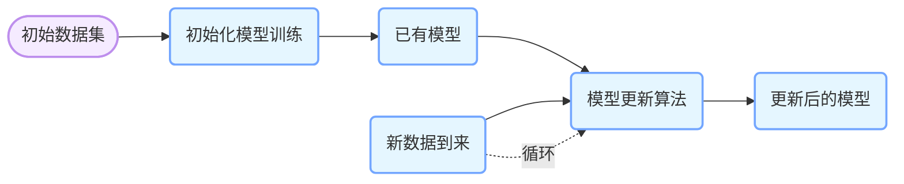

# 增量学习策略:应对AI系统的持续进化

> 关键词：增量学习、AI系统、持续进化、机器学习、数据更新

> 摘要：本文围绕增量学习策略在应对AI系统持续进化方面展开深入探讨。首先介绍了增量学习的背景，包括其目的、适用读者、文档结构和相关术语。接着阐述了增量学习的核心概念、算法原理、数学模型，通过Python代码进行详细说明。结合实际项目案例，展示了增量学习的开发环境搭建、代码实现与解读。同时探讨了增量学习的实际应用场景，推荐了相关的学习资源、开发工具和论文著作。最后总结了增量学习的未来发展趋势与挑战，并对常见问题进行了解答，为读者全面了解和应用增量学习提供了系统的指导。

## 1. 背景介绍 
### 1.1 目的和范围
随着人工智能技术的飞速发展，AI系统需要不断适应新的数据和变化的环境。传统的机器学习方法通常需要在固定的数据集上进行训练，当有新的数据到来时，往往需要重新训练整个模型，这不仅耗费大量的计算资源和时间，而且在某些情况下是不可行的。增量学习策略应运而生，它允许AI系统在已有模型的基础上，利用新的数据进行逐步学习和更新，从而实现系统的持续进化。

本文的目的是深入探讨增量学习策略的原理、算法和实际应用，帮助读者了解如何使用增量学习来应对AI系统的持续进化。我们将涵盖增量学习的核心概念、算法原理、数学模型、实际项目案例、应用场景以及相关的工具和资源。

### 1.2 预期读者
本文适合以下读者群体：
- 人工智能领域的研究人员和开发者，希望深入了解增量学习策略，以改进现有AI系统的性能和适应性。
- 数据科学家和机器学习工程师，需要处理不断变化的数据，并寻求有效的方法来更新模型。
- 对人工智能技术感兴趣的学生和爱好者，希望通过本文了解增量学习的基本原理和应用。

### 1.3 文档结构概述
本文将按照以下结构进行组织：
1. **背景介绍**：介绍增量学习的目的、预期读者和文档结构，以及相关术语。
2. **核心概念与联系**：阐述增量学习的核心概念、原理和架构，并通过文本示意图和Mermaid流程图进行说明。
3. **核心算法原理 & 具体操作步骤**：详细讲解增量学习的核心算法原理，并使用Python源代码进行具体操作步骤的演示。
4. **数学模型和公式 & 详细讲解 & 举例说明**：介绍增量学习的数学模型和公式，并通过具体例子进行详细讲解。
5. **项目实战：代码实际案例和详细解释说明**：通过一个实际项目案例，展示增量学习的开发环境搭建、源代码实现和代码解读。
6. **实际应用场景**：探讨增量学习在不同领域的实际应用场景。
7. **工具和资源推荐**：推荐相关的学习资源、开发工具和论文著作。
8. **总结：未来发展趋势与挑战**：总结增量学习的未来发展趋势和面临的挑战。
9. **附录：常见问题与解答**：解答读者在学习和应用增量学习过程中常见的问题。
10. **扩展阅读 & 参考资料**：提供相关的扩展阅读和参考资料。

### 1.4 术语表
#### 1.4.1 核心术语定义
- **增量学习（Incremental Learning）**：一种机器学习方法，允许模型在已有数据的基础上，逐步学习新的数据，而不需要重新训练整个模型。
- **AI系统（Artificial Intelligence System）**：基于人工智能技术构建的系统，能够模拟人类的智能行为，如学习、推理、决策等。
- **持续进化（Continuous Evolution）**：指AI系统在不断变化的环境中，通过学习新的数据和知识，不断改进和优化自身性能的过程。
- **机器学习（Machine Learning）**：一门多领域交叉学科，涉及概率论、统计学、逼近论、凸分析、算法复杂度理论等多门学科。它专门研究计算机怎样模拟或实现人类的学习行为，以获取新的知识或技能，重新组织已有的知识结构使之不断改善自身的性能。
- **模型更新（Model Update）**：在增量学习中，根据新的数据对已有模型进行调整和优化的过程。

#### 1.4.2 相关概念解释
- **在线学习（Online Learning）**：一种特殊的增量学习方式，模型在每次接收到一个新的数据样本时就进行一次更新。
- **批处理学习（Batch Learning）**：传统的机器学习方法，模型在固定的数据集上进行一次性训练，训练完成后模型不再更新。
- **灾难性遗忘（Catastrophic Forgetting）**：在增量学习中，模型在学习新的数据时，可能会忘记之前学习到的知识，导致对旧数据的性能下降。

#### 1.4.3 缩略词列表
- **AI**：Artificial Intelligence（人工智能）
- **ML**：Machine Learning（机器学习）
- **IL**：Incremental Learning（增量学习）

## 2. 核心概念与联系 

### 核心概念原理
增量学习的核心思想是在已有模型的基础上，利用新的数据对模型进行逐步更新，而不需要重新训练整个模型。这种方法可以有效地减少计算资源和时间的消耗，同时允许模型在不断变化的环境中持续进化。

增量学习的原理可以分为以下几个步骤：
1. **初始化模型**：使用初始数据集对模型进行训练，得到初始模型。
2. **接收新数据**：随着时间的推移，系统接收到新的数据。
3. **模型更新**：根据新的数据对已有模型进行调整和优化，得到更新后的模型。
4. **重复步骤2和3**：不断接收新的数据，并对模型进行更新，使模型能够适应不断变化的环境。

### 架构的文本示意图
```plaintext
+-------------------+
| 初始数据集        |
+-------------------+
        |
        v
+-------------------+
| 初始化模型训练    |
+-------------------+
        |
        v
+-------------------+
| 已有模型          |
+-------------------+
        |
        | 新数据到来
        v
+-------------------+
| 模型更新算法      |
+-------------------+
        |
        v
+-------------------+
| 更新后的模型      |
+-------------------+
```

### Mermaid流程图


## 3. 核心算法原理 & 具体操作步骤 

### 核心算法原理
增量学习有多种算法，这里以简单的在线梯度下降算法为例进行说明。在线梯度下降算法是一种常用的增量学习算法，它在每次接收到一个新的数据样本时，就根据该样本的梯度信息对模型的参数进行更新。

假设我们有一个线性回归模型 $y = \theta^T x$，其中 $\theta$ 是模型的参数向量，$x$ 是输入特征向量，$y$ 是输出值。我们的目标是最小化损失函数 $L(\theta) = \frac{1}{2}(y - \theta^T x)^2$。

在线梯度下降算法的更新规则为：
$\theta = \theta - \eta \nabla L(\theta)$
其中 $\eta$ 是学习率，$\nabla L(\theta)$ 是损失函数 $L(\theta)$ 关于 $\theta$ 的梯度。

对于线性回归模型，$\nabla L(\theta) = -(y - \theta^T x)x$。

### 具体操作步骤
以下是使用Python实现在线梯度下降算法的具体操作步骤：

```python
import numpy as np

# 初始化模型参数
theta = np.zeros(2)  # 假设输入特征维度为2
learning_rate = 0.01

# 定义损失函数的梯度
def gradient(x, y, theta):
    return -(y - np.dot(theta, x)) * x

# 模拟新数据到来
new_data = [(np.array([1, 2]), 3), (np.array([2, 3]), 4), (np.array([3, 4]), 5)]

# 进行增量学习
for x, y in new_data:
    # 计算梯度
    grad = gradient(x, y, theta)
    # 更新模型参数
    theta = theta - learning_rate * grad

print("更新后的模型参数:", theta)
```

在上述代码中，我们首先初始化了模型的参数 $\theta$ 和学习率 $\eta$。然后定义了损失函数的梯度计算函数 `gradient`。接着模拟了新数据的到来，并使用在线梯度下降算法对模型的参数进行更新。最后输出更新后的模型参数。

## 4. 数学模型和公式 & 详细讲解 & 举例说明 

### 数学模型和公式
在增量学习中，我们通常使用损失函数来衡量模型的性能。常见的损失函数包括均方误差（MSE）、交叉熵损失等。

以线性回归为例，假设我们有一个数据集 $\{(x_1, y_1), (x_2, y_2), \cdots, (x_n, y_n)\}$，其中 $x_i$ 是输入特征向量，$y_i$ 是对应的输出值。我们的线性回归模型为 $y = \theta^T x$，其中 $\theta$ 是模型的参数向量。

均方误差损失函数定义为：
$$L(\theta) = \frac{1}{n} \sum_{i=1}^{n} (y_i - \theta^T x_i)^2$$

在增量学习中，我们希望在新的数据到来时，能够根据新的数据对模型的参数进行更新，使得损失函数最小化。

### 详细讲解
在线梯度下降算法是一种常用的增量学习算法，它的核心思想是通过不断地沿着损失函数的负梯度方向更新模型的参数，使得损失函数逐渐减小。

具体来说，对于每个新的数据样本 $(x, y)$，我们计算损失函数关于模型参数 $\theta$ 的梯度 $\nabla L(\theta)$，然后根据以下公式更新模型的参数：
$$\theta = \theta - \eta \nabla L(\theta)$$
其中 $\eta$ 是学习率，它控制了每次更新的步长。学习率过大可能导致模型无法收敛，学习率过小则会导致收敛速度过慢。

### 举例说明
假设我们有一个简单的线性回归问题，输入特征 $x$ 是一维的，输出值 $y$ 也是一维的。我们的初始数据集为 $\{(1, 2), (2, 3)\}$，我们使用最小二乘法来初始化模型的参数。

首先，我们将数据集表示为矩阵形式：
$$X = \begin{bmatrix} 1 & 1 \\ 1 & 2 \end{bmatrix}, y = \begin{bmatrix} 2 \\ 3 \end{bmatrix}$$

根据最小二乘法，模型的参数 $\theta$ 可以通过以下公式计算：
$$\theta = (X^T X)^{-1} X^T y$$

```python
import numpy as np

X = np.array([[1, 1], [1, 2]])
y = np.array([2, 3])

theta = np.linalg.inv(X.T.dot(X)).dot(X.T).dot(y)
print("初始模型参数:", theta)
```

假设新的数据样本为 $(3, 4)$，我们使用在线梯度下降算法对模型的参数进行更新。

```python
learning_rate = 0.01
x_new = np.array([1, 3])
y_new = 4

# 计算梯度
grad = -(y_new - np.dot(theta, x_new)) * x_new
# 更新模型参数
theta = theta - learning_rate * grad

print("更新后的模型参数:", theta)
```

在上述例子中，我们首先使用最小二乘法初始化了模型的参数，然后在新的数据样本到来时，使用在线梯度下降算法对模型的参数进行了更新。

## 5. 项目实战：代码实际案例和详细解释说明 

### 5.1  开发环境搭建
在进行增量学习的项目实战之前，我们需要搭建相应的开发环境。以下是搭建开发环境的步骤：
1. **安装Python**：推荐使用Python 3.7及以上版本，可以从Python官方网站（https://www.python.org/downloads/）下载并安装。
2. **安装必要的库**：我们需要安装一些常用的Python库，如NumPy、Pandas、Scikit-learn等。可以使用以下命令进行安装：
```sh
pip install numpy pandas scikit-learn
```
3. **选择开发工具**：可以选择使用Jupyter Notebook、PyCharm等开发工具。Jupyter Notebook适合进行交互式开发和数据分析，PyCharm适合进行大规模的项目开发。

### 5.2  源代码详细实现和代码解读
我们以一个简单的手写数字识别任务为例，展示增量学习的实际应用。我们将使用Scikit-learn库中的MNIST数据集，该数据集包含了60000个训练样本和10000个测试样本。

```python
from sklearn.datasets import fetch_openml
from sklearn.linear_model import SGDClassifier
from sklearn.model_selection import train_test_split
from sklearn.metrics import accuracy_score

# 加载MNIST数据集
mnist = fetch_openml('mnist_784', version=1)
X, y = mnist["data"], mnist["target"]

# 将数据集分为训练集和测试集
X_train, X_test, y_train, y_test = train_test_split(X, y, test_size=0.2, random_state=42)

# 初始化SGDClassifier模型
model = SGDClassifier(random_state=42)

# 进行增量学习
batch_size = 1000
num_batches = len(X_train) // batch_size

for i in range(num_batches):
    start_idx = i * batch_size
    end_idx = (i + 1) * batch_size
    X_batch = X_train[start_idx:end_idx]
    y_batch = y_train[start_idx:end_idx]
    model.partial_fit(X_batch, y_batch, classes=np.unique(y))

# 在测试集上进行预测
y_pred = model.predict(X_test)

# 计算准确率
accuracy = accuracy_score(y_test, y_pred)
print("模型准确率:", accuracy)
```

### 代码解读与分析
1. **加载数据集**：使用 `fetch_openml` 函数从OpenML平台加载MNIST数据集。
2. **数据集划分**：使用 `train_test_split` 函数将数据集分为训练集和测试集。
3. **初始化模型**：使用 `SGDClassifier` 初始化一个随机梯度下降分类器模型。
4. **增量学习**：将训练集分成多个小批量，每次使用一个小批量的数据对模型进行更新。使用 `partial_fit` 方法进行增量学习。
5. **预测和评估**：在测试集上进行预测，并使用 `accuracy_score` 函数计算模型的准确率。

通过增量学习，我们可以在不重新训练整个模型的情况下，逐步提高模型的性能。

## 6. 实际应用场景 
增量学习在许多领域都有广泛的应用，以下是一些常见的实际应用场景：

### 图像识别
在图像识别领域，新的图像数据不断涌现。使用增量学习可以让图像识别模型在已有模型的基础上，不断学习新的图像特征，提高识别准确率。例如，在安防监控系统中，随着新的监控视频的不断产生，模型可以通过增量学习不断适应新的场景和目标，提高监控的效果。

### 自然语言处理
在自然语言处理领域，语言是不断发展和变化的。新的词汇、语法和语义不断出现，使用增量学习可以让自然语言处理模型及时适应这些变化。例如，在智能客服系统中，随着用户问题的不断变化，模型可以通过增量学习不断提高回答的准确性和效率。

### 金融风险评估
在金融领域，市场环境和客户行为是不断变化的。使用增量学习可以让金融风险评估模型及时更新对风险的评估，提高风险预测的准确性。例如，在信用卡风险评估中，随着客户的消费行为和信用记录的不断变化，模型可以通过增量学习不断调整对客户风险的评估。

### 工业故障诊断
在工业领域，设备的运行状态和故障模式是不断变化的。使用增量学习可以让工业故障诊断模型及时适应这些变化，提高故障诊断的准确性。例如，在电力系统中，随着电网的运行和设备的老化，模型可以通过增量学习不断更新对故障的诊断规则，提高电网的可靠性。

## 7. 工具和资源推荐
### 7.1 学习资源推荐
#### 7.1.1 书籍推荐
- 《机器学习》（周志华著）：这本书是机器学习领域的经典教材，系统地介绍了机器学习的基本概念、算法和应用。
- 《深度学习》（Ian Goodfellow、Yoshua Bengio和Aaron Courville著）：这本书是深度学习领域的权威著作，详细介绍了深度学习的原理、算法和应用。
- 《Python机器学习实战》（Sebastian Raschka著）：这本书通过实际案例介绍了如何使用Python进行机器学习开发，适合初学者入门。

#### 7.1.2 在线课程
- Coursera上的“机器学习”课程（Andrew Ng教授授课）：这是一门非常经典的机器学习课程，涵盖了机器学习的基本概念、算法和应用。
- edX上的“深度学习”课程（由不同的教授授课）：这些课程详细介绍了深度学习的原理、算法和应用。
- 哔哩哔哩上的“机器学习实战”系列视频：这些视频通过实际案例介绍了如何使用Python进行机器学习开发，适合初学者入门。

#### 7.1.3 技术博客和网站
- Medium：这是一个技术博客平台，有许多机器学习和人工智能领域的优秀文章。
- Towards Data Science：这是一个专注于数据科学和机器学习的网站，有许多高质量的技术文章和教程。
- Kaggle：这是一个数据科学竞赛平台，有许多机器学习和人工智能领域的数据集和代码示例。

### 7.2 开发工具框架推荐
#### 7.2.1 IDE和编辑器
- PyCharm：这是一个专业的Python集成开发环境，具有强大的代码编辑、调试和项目管理功能。
- Jupyter Notebook：这是一个交互式的开发环境，适合进行数据分析和机器学习实验。
- Visual Studio Code：这是一个轻量级的代码编辑器，支持多种编程语言和插件，适合快速开发。

#### 7.2.2 调试和性能分析工具
- TensorBoard：这是TensorFlow的可视化工具，可以用于查看模型的训练过程、性能指标等。
- PyTorch Profiler：这是PyTorch的性能分析工具，可以用于分析模型的运行时间、内存使用等。
- cProfile：这是Python的内置性能分析工具，可以用于分析Python代码的运行时间。

#### 7.2.3 相关框架和库
- Scikit-learn：这是一个常用的机器学习库，提供了丰富的机器学习算法和工具。
- TensorFlow：这是一个开源的深度学习框架，广泛应用于图像识别、自然语言处理等领域。
- PyTorch：这是一个开源的深度学习框架，具有动态图和易于使用的特点。

### 7.3 相关论文著作推荐
#### 7.3.1 经典论文
- "A Survey on Incremental Learning"（Sebastian Thrun著）：这篇论文对增量学习进行了系统的综述，介绍了增量学习的基本概念、算法和应用。
- "Online Learning and Stochastic Approximations"（Léon Bottou著）：这篇论文介绍了在线学习和随机逼近的基本原理和算法。
- "Gradient-Based Learning Applied to Document Recognition"（Yann LeCun、Léon Bottou、Yoshua Bengio和Patrick Haffner著）：这篇论文介绍了卷积神经网络在手写数字识别中的应用，是深度学习领域的经典论文之一。

#### 7.3.2 最新研究成果
- 可以通过IEEE Xplore、ACM Digital Library等学术数据库搜索增量学习领域的最新研究成果。
- 参加相关的学术会议，如NeurIPS、ICML、CVPR等，了解增量学习领域的最新研究动态。

#### 7.3.3 应用案例分析
- 可以通过Kaggle、GitHub等平台搜索增量学习的应用案例分析，学习他人的经验和技巧。
- 阅读相关的技术博客和文章，了解增量学习在不同领域的实际应用。

## 8. 总结：未来发展趋势与挑战
### 未来发展趋势
- **与强化学习的结合**：增量学习与强化学习的结合将是未来的一个重要发展趋势。通过增量学习，强化学习代理可以在不断变化的环境中持续学习和优化策略，提高决策的准确性和效率。
- **联邦学习中的应用**：在联邦学习中，增量学习可以用于在本地设备上对模型进行更新，减少数据传输和隐私泄露的风险。同时，通过增量学习可以让联邦学习模型在不断接收新数据的情况下持续进化。
- **跨领域应用**：增量学习将在更多的领域得到应用，如医疗保健、交通、能源等。通过增量学习，这些领域的AI系统可以更好地适应不断变化的环境和需求，提高系统的性能和可靠性。

### 挑战
- **灾难性遗忘问题**：灾难性遗忘是增量学习中面临的一个重要挑战。如何在学习新数据的同时，避免忘记之前学习到的知识，是增量学习领域需要解决的一个关键问题。
- **计算资源和时间消耗**：虽然增量学习可以减少重新训练整个模型的计算资源和时间消耗，但在处理大规模数据和复杂模型时，仍然需要大量的计算资源和时间。如何提高增量学习的效率，是一个需要解决的问题。
- **数据质量和分布变化**：新的数据可能存在质量问题和分布变化，这会影响增量学习的效果。如何处理数据质量和分布变化，是增量学习领域需要解决的一个重要问题。

## 9. 附录：常见问题与解答
### 1. 增量学习和在线学习有什么区别？
在线学习是一种特殊的增量学习方式，它在每次接收到一个新的数据样本时就进行一次更新。而增量学习可以在接收到一批新的数据后再进行更新，不一定是每次只处理一个数据样本。

### 2. 增量学习会导致模型过拟合吗？
增量学习本身并不会直接导致模型过拟合，但如果新的数据存在噪声或与旧数据分布差异较大，可能会导致模型过拟合。为了避免过拟合，可以采用正则化、数据增强等方法。

### 3. 如何选择合适的学习率？
学习率的选择需要根据具体的问题和数据集进行调整。一般来说，可以先尝试不同的学习率，观察模型的训练效果和收敛速度，选择一个能够使模型快速收敛且性能较好的学习率。

### 4. 增量学习可以应用于所有的机器学习算法吗？
不是所有的机器学习算法都适合增量学习。一些算法，如决策树、随机森林等，在增量学习中可能会面临一些挑战。而一些基于梯度下降的算法，如线性回归、逻辑回归、神经网络等，比较适合增量学习。

## 10. 扩展阅读 & 参考资料
- 《增量学习理论与应用》
- "Incremental Learning in Neural Networks: A Comprehensive Review"
- https://en.wikipedia.org/wiki/Incremental_learning
- https://www.jmlr.org/papers/volume20/18-537/18-537.pdf

通过以上的文章，我们对增量学习策略在应对AI系统持续进化方面进行了全面的探讨。从背景介绍到核心概念、算法原理、数学模型，再到实际项目案例和应用场景，以及相关的工具和资源推荐，最后总结了未来发展趋势和挑战，并解答了常见问题。希望本文能够帮助读者更好地理解和应用增量学习策略。