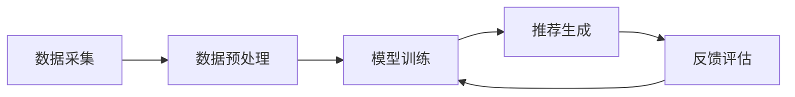

# 增量学习策略在动态推荐系统中的应用研究

> 关键词：增量学习、动态推荐系统、推荐算法、数据更新、模型优化

> 摘要：本文聚焦于增量学习策略在动态推荐系统中的应用。首先介绍了研究的背景、目的、预期读者和文档结构，明确了相关术语。接着阐述了增量学习和动态推荐系统的核心概念及其联系，给出了原理和架构的文本示意图与 Mermaid 流程图。详细讲解了核心算法原理，用 Python 代码进行示例，并通过数学模型和公式进一步剖析。通过项目实战，展示了代码的实际案例和详细解释。探讨了增量学习在不同场景下的实际应用，推荐了相关的学习资源、开发工具框架和论文著作。最后总结了未来发展趋势与挑战，解答了常见问题并提供了扩展阅读和参考资料。旨在为研究和开发动态推荐系统的人员提供全面的技术指导和深入的理论分析。

## 1. 背景介绍 
### 1.1 目的和范围
随着互联网技术的飞速发展，推荐系统在电子商务、社交媒体、新闻资讯等众多领域得到了广泛应用。然而，传统的推荐系统往往基于静态数据进行建模，难以适应数据的动态变化。增量学习策略能够在新数据到来时，以较低的计算成本对模型进行更新，从而使推荐系统能够及时反映用户的最新兴趣和行为。本文的目的在于深入研究增量学习策略在动态推荐系统中的应用，探讨其核心算法、数学模型以及实际应用场景，为开发高效、灵活的动态推荐系统提供理论支持和实践指导。

本文的研究范围涵盖了增量学习的基本原理、常见算法，动态推荐系统的架构和工作流程，以及增量学习在动态推荐系统中的具体应用。通过理论分析和项目实战，全面阐述了增量学习策略在动态推荐系统中的优势和挑战。

### 1.2 预期读者
本文预期读者包括从事推荐系统开发、机器学习研究的专业人员，以及对增量学习和动态推荐系统感兴趣的学生和技术爱好者。对于有一定编程基础和机器学习知识的读者，能够通过本文深入了解增量学习在动态推荐系统中的应用原理和实现方法；对于初学者，本文将提供相关的基础知识和学习资源，帮助他们逐步进入该领域。

### 1.3 文档结构概述
本文共分为十个部分。第一部分为背景介绍，阐述了研究的目的、范围、预期读者和文档结构，并给出了相关术语的定义。第二部分介绍了增量学习和动态推荐系统的核心概念及其联系，包括原理和架构的文本示意图与 Mermaid 流程图。第三部分详细讲解了核心算法原理，并使用 Python 代码进行示例。第四部分通过数学模型和公式对算法进行了深入剖析，并举例说明。第五部分进行项目实战，展示了代码的实际案例和详细解释。第六部分探讨了增量学习在不同场景下的实际应用。第七部分推荐了相关的学习资源、开发工具框架和论文著作。第八部分总结了未来发展趋势与挑战。第九部分解答了常见问题。第十部分提供了扩展阅读和参考资料。

### 1.4 术语表
#### 1.4.1 核心术语定义
- **增量学习（Incremental Learning）**：一种机器学习方法，允许模型在新数据到来时，对已有的模型进行更新，而无需重新训练整个模型。
- **动态推荐系统（Dynamic Recommendation System）**：能够根据用户的实时行为和数据变化，及时调整推荐结果的推荐系统。
- **推荐算法（Recommendation Algorithm）**：用于生成推荐结果的算法，常见的有协同过滤、基于内容的推荐等。
- **数据更新（Data Update）**：指在系统运行过程中，新数据的加入或旧数据的更新。
- **模型优化（Model Optimization）**：通过调整模型的参数，提高模型的性能和准确性。

#### 1.4.2 相关概念解释
- **静态推荐系统（Static Recommendation System）**：基于固定的历史数据进行建模，在模型训练完成后，推荐结果相对固定，难以适应数据的动态变化。
- **在线学习（Online Learning）**：一种特殊的增量学习方法，模型在每次接收到新数据时，立即进行更新。
- **批处理学习（Batch Learning）**：传统的机器学习方法，将所有数据一次性用于模型训练。

#### 1.4.3 缩略词列表
- **CF（Collaborative Filtering）**：协同过滤
- **SVM（Support Vector Machine）**：支持向量机
- **ANN（Artificial Neural Network）**：人工神经网络

## 2. 核心概念与联系 
### 核心概念原理
#### 增量学习原理
增量学习的核心思想是在新数据到来时，尽可能地利用已有的模型和知识，以较低的计算成本对模型进行更新。传统的批处理学习方法需要将所有数据一次性用于模型训练，当数据量增大时，计算成本会显著增加。而增量学习可以将数据分成多个批次，每次只处理一个批次的数据，避免了重新训练整个模型的开销。

增量学习的实现方式有多种，常见的包括基于实例的学习、基于模型的学习和基于参数的学习。基于实例的学习是将新数据直接添加到已有的训练数据集中；基于模型的学习是根据新数据对模型的结构进行调整；基于参数的学习是通过更新模型的参数来适应新数据。

#### 动态推荐系统原理
动态推荐系统的目标是根据用户的实时行为和数据变化，及时调整推荐结果。它通常由数据采集、数据预处理、模型训练、推荐生成和反馈评估等模块组成。数据采集模块负责收集用户的行为数据，如浏览记录、购买记录等；数据预处理模块对采集到的数据进行清洗、转换和特征提取；模型训练模块使用增量学习算法对推荐模型进行更新；推荐生成模块根据更新后的模型生成推荐结果；反馈评估模块对推荐结果进行评估，根据用户的反馈进一步调整模型。

### 架构的文本示意图
```plaintext
动态推荐系统架构
|-- 数据采集层
|   |-- 用户行为日志
|   |-- 物品信息
|-- 数据预处理层
|   |-- 数据清洗
|   |-- 特征提取
|-- 模型训练层
|   |-- 增量学习算法
|   |-- 推荐模型更新
|-- 推荐生成层
|   |-- 推荐算法
|   |-- 推荐结果生成
|-- 反馈评估层
|   |-- 用户反馈收集
|   |-- 模型评估与调整
```

### Mermaid 流程图


## 3. 核心算法原理 & 具体操作步骤 
### 核心算法原理
在动态推荐系统中，常用的增量学习算法包括基于梯度下降的增量学习算法和基于在线学习的算法。下面以基于梯度下降的增量学习算法为例，详细讲解其原理。

梯度下降是一种常用的优化算法，用于寻找函数的最小值。在增量学习中，我们的目标是在新数据到来时，通过更新模型的参数，使模型在新数据上的损失函数最小化。

设模型的参数为 $\theta$，损失函数为 $L(\theta; x, y)$，其中 $x$ 是输入数据，$y$ 是对应的标签。在传统的批处理学习中，我们通过最小化所有数据的损失函数来更新参数：

$$\theta^* = \arg\min_{\theta} \sum_{i=1}^{n} L(\theta; x_i, y_i)$$

在增量学习中，当新数据 $(x_{new}, y_{new})$ 到来时，我们只需要更新参数以最小化新数据上的损失函数：

$$\theta_{new} = \theta - \alpha \nabla L(\theta; x_{new}, y_{new})$$

其中 $\alpha$ 是学习率，$\nabla L(\theta; x_{new}, y_{new})$ 是损失函数在新数据上的梯度。

### 具体操作步骤
1. **初始化模型参数 $\theta$**：可以随机初始化或使用预训练的模型参数。
2. **接收新数据 $(x_{new}, y_{new})$**：从数据采集模块获取新的用户行为数据。
3. **计算损失函数的梯度 $\nabla L(\theta; x_{new}, y_{new})$**：根据损失函数的定义，计算在新数据上的梯度。
4. **更新模型参数 $\theta$**：使用梯度下降公式更新模型参数。
5. **重复步骤 2 - 4**：不断接收新数据，更新模型参数。

### Python 代码示例
```python
import numpy as np

# 定义损失函数（这里以均方误差为例）
def loss_function(theta, x, y):
    y_pred = np.dot(x, theta)
    return np.mean((y_pred - y) ** 2)

# 定义损失函数的梯度
def gradient(theta, x, y):
    y_pred = np.dot(x, theta)
    return 2 * np.dot(x.T, (y_pred - y)) / len(x)

# 初始化模型参数
theta = np.random.randn(2)

# 学习率
alpha = 0.01

# 模拟新数据
x_new = np.array([[1, 2]])
y_new = np.array([3])

# 更新模型参数
for i in range(100):
    grad = gradient(theta, x_new, y_new)
    theta = theta - alpha * grad

print("更新后的模型参数:", theta)
```

## 4. 数学模型和公式 & 详细讲解 & 举例说明 
### 数学模型
在动态推荐系统中，我们可以使用多种数学模型来描述用户和物品之间的关系。常见的模型包括矩阵分解模型、神经网络模型等。下面以矩阵分解模型为例，详细讲解其数学原理。

矩阵分解模型的基本思想是将用户 - 物品评分矩阵 $R$ 分解为两个低秩矩阵 $U$ 和 $V$ 的乘积：

$$R \approx U V^T$$

其中 $U$ 是用户特征矩阵，$V$ 是物品特征矩阵。矩阵分解的目标是找到合适的 $U$ 和 $V$，使得分解后的矩阵与原始矩阵的误差最小。

### 数学公式
为了衡量分解后的矩阵与原始矩阵的误差，我们可以使用均方误差（MSE）作为损失函数：

$$L(U, V) = \sum_{(i, j) \in \Omega} (r_{ij} - u_i^T v_j)^2 + \lambda (\|U\|^2 + \|V\|^2)$$

其中 $\Omega$ 是已知评分的用户 - 物品对集合，$r_{ij}$ 是用户 $i$ 对物品 $j$ 的评分，$u_i$ 是用户 $i$ 的特征向量，$v_j$ 是物品 $j$ 的特征向量，$\lambda$ 是正则化参数，用于防止过拟合。

为了最小化损失函数 $L(U, V)$，我们可以使用梯度下降算法。具体来说，我们需要计算损失函数关于 $U$ 和 $V$ 的梯度：

$$\frac{\partial L}{\partial u_i} = -2 \sum_{j: (i, j) \in \Omega} (r_{ij} - u_i^T v_j) v_j + 2 \lambda u_i$$

$$\frac{\partial L}{\partial v_j} = -2 \sum_{i: (i, j) \in \Omega} (r_{ij} - u_i^T v_j) u_i + 2 \lambda v_j$$

然后使用梯度下降公式更新 $U$ 和 $V$：

$$u_i \leftarrow u_i - \alpha \frac{\partial L}{\partial u_i}$$

$$v_j \leftarrow v_j - \alpha \frac{\partial L}{\partial v_j}$$

其中 $\alpha$ 是学习率。

### 详细讲解
矩阵分解模型的核心思想是将用户和物品的特征表示为低维向量，通过向量的内积来预测用户对物品的评分。在增量学习的场景下，当新的用户或物品加入时，我们只需要更新相应的特征向量，而不需要重新训练整个模型。

正则化参数 $\lambda$ 的作用是防止过拟合。如果 $\lambda$ 过大，模型会过于平滑，可能无法捕捉到数据的细节；如果 $\lambda$ 过小，模型可能会过拟合，在新数据上的表现不佳。

学习率 $\alpha$ 控制了参数更新的步长。如果 $\alpha$ 过大，模型可能会跳过最优解；如果 $\alpha$ 过小，模型的收敛速度会很慢。

### 举例说明
假设我们有一个用户 - 物品评分矩阵 $R$：

$$R = \begin{bmatrix}
5 & 3 & 0 & 1 \\
4 & 0 & 0 & 1 \\
1 & 1 & 0 & 5 \\
1 & 0 & 0 & 4 \\
0 & 1 & 5 & 4
\end{bmatrix}$$

我们将其分解为两个低秩矩阵 $U$ 和 $V$，其中 $U$ 的维度为 $5 \times 2$，$V$ 的维度为 $4 \times 2$。

初始化 $U$ 和 $V$ 为随机矩阵：

$$U = \begin{bmatrix}
0.1 & 0.2 \\
0.3 & 0.4 \\
0.5 & 0.6 \\
0.7 & 0.8 \\
0.9 & 1.0
\end{bmatrix}$$

$$V = \begin{bmatrix}
0.1 & 0.2 \\
0.3 & 0.4 \\
0.5 & 0.6 \\
0.7 & 0.8
\end{bmatrix}$$

然后使用梯度下降算法更新 $U$ 和 $V$，直到损失函数收敛。最后得到的 $U$ 和 $V$ 可以用于预测用户对未评分物品的评分。

## 5. 项目实战：代码实际案例和详细解释说明 
### 5.1  开发环境搭建
#### 操作系统
本项目可以在 Windows、Linux 或 macOS 操作系统上进行开发。建议使用 Linux 或 macOS，因为它们对 Python 开发环境的支持更好。

#### Python 版本
建议使用 Python 3.6 及以上版本。可以从 Python 官方网站（https://www.python.org/downloads/）下载并安装。

#### 依赖库安装
本项目需要使用以下 Python 库：
- `numpy`：用于数值计算。
- `pandas`：用于数据处理。
- `scikit-learn`：用于机器学习算法。

可以使用以下命令安装这些库：
```sh
pip install numpy pandas scikit-learn
```

### 5.2  源代码详细实现和代码解读
```python
import numpy as np
import pandas as pd
from sklearn.model_selection import train_test_split
from sklearn.linear_model import SGDRegressor

# 生成示例数据
data = pd.DataFrame({
    'feature1': np.random.randn(1000),
    'feature2': np.random.randn(1000),
    'target': np.random.randn(1000)
})

# 划分训练集和测试集
X = data[['feature1', 'feature2']]
y = data['target']
X_train, X_test, y_train, y_test = train_test_split(X, y, test_size=0.2, random_state=42)

# 初始化增量学习模型
model = SGDRegressor()

# 分批训练模型
batch_size = 100
num_batches = len(X_train) // batch_size

for i in range(num_batches):
    start = i * batch_size
    end = start + batch_size
    X_batch = X_train.iloc[start:end]
    y_batch = y_train.iloc[start:end]
    model.partial_fit(X_batch, y_batch)

# 在测试集上评估模型
score = model.score(X_test, y_test)
print("模型在测试集上的得分:", score)
```

### 代码解读与分析
1. **数据生成**：使用 `pandas` 生成一个包含两个特征和一个目标变量的示例数据集。
2. **数据划分**：使用 `sklearn` 的 `train_test_split` 函数将数据集划分为训练集和测试集。
3. **模型初始化**：使用 `SGDRegressor` 初始化一个增量学习模型。`SGDRegressor` 是基于随机梯度下降的线性回归模型，支持增量学习。
4. **分批训练**：将训练集分成多个批次，每次使用一个批次的数据调用 `partial_fit` 方法更新模型。
5. **模型评估**：使用测试集评估模型的性能，输出模型在测试集上的得分。

通过这种方式，我们可以在新数据到来时，不断更新模型，而不需要重新训练整个模型。

## 6. 实际应用场景 
### 电子商务推荐系统
在电子商务领域，用户的购买行为和兴趣会随着时间不断变化。增量学习策略可以使推荐系统及时捕捉这些变化，为用户提供更加个性化的商品推荐。例如，当用户浏览了一款新的电子产品后，推荐系统可以立即更新模型，为用户推荐相关的配件和周边产品。

### 新闻资讯推荐系统
新闻资讯的内容是实时更新的，用户的兴趣也会随着热点事件的变化而变化。增量学习策略可以使新闻推荐系统及时推送用户感兴趣的新闻，提高用户的点击率和阅读时长。例如，当某个突发事件发生时，推荐系统可以快速调整推荐结果，将相关的新闻推送给关注该领域的用户。

### 社交媒体推荐系统
在社交媒体平台上，用户的社交关系和兴趣爱好会不断发展。增量学习策略可以使推荐系统根据用户的最新行为，如点赞、评论、关注等，为用户推荐可能感兴趣的好友、话题和内容。例如，当用户关注了一个新的博主后，推荐系统可以为用户推荐该博主关注的其他博主和相关的话题。

## 7. 工具和资源推荐
### 7.1 学习资源推荐
#### 7.1.1 书籍推荐
- 《机器学习》（周志华）：全面介绍了机器学习的基本概念、算法和应用，是机器学习领域的经典教材。
- 《深度学习》（Ian Goodfellow、Yoshua Bengio 和 Aaron Courville）：深入讲解了深度学习的理论和实践，是深度学习领域的权威著作。
- 《推荐系统实践》（项亮）：结合实际案例，详细介绍了推荐系统的设计和实现方法。

#### 7.1.2 在线课程
- Coursera 上的 “Machine Learning” 课程（Andrew Ng 教授）：经典的机器学习入门课程，涵盖了机器学习的基本概念和算法。
- edX 上的 “Deep Learning Specialization” 课程：由深度学习领域的知名学者授课，深入讲解了深度学习的理论和应用。
- 中国大学 MOOC 上的 “机器学习” 课程：国内高校的优质课程，适合初学者学习。

#### 7.1.3 技术博客和网站
- Medium：有许多机器学习和推荐系统领域的优秀博客文章，涵盖了最新的研究成果和实践经验。
- arXiv：提供了大量的学术论文，包括机器学习和推荐系统领域的最新研究。
- Kaggle：一个数据科学竞赛平台，有许多关于推荐系统的竞赛和开源代码。

### 7.2 开发工具框架推荐
#### 7.2.1 IDE和编辑器
- PyCharm：功能强大的 Python 集成开发环境，支持代码调试、代码分析等功能。
- Jupyter Notebook：交互式的开发环境，适合进行数据探索和模型实验。
- Visual Studio Code：轻量级的代码编辑器，支持多种编程语言和插件。

#### 7.2.2 调试和性能分析工具
- `pdb`：Python 内置的调试工具，可以帮助我们定位代码中的问题。
- `cProfile`：Python 内置的性能分析工具，可以分析代码的运行时间和内存使用情况。
- TensorBoard：TensorFlow 提供的可视化工具，可以用于可视化模型的训练过程和性能指标。

#### 7.2.3 相关框架和库
- `scikit-learn`：一个简单易用的机器学习库，提供了多种机器学习算法和工具。
- `TensorFlow`：一个开源的深度学习框架，支持分布式训练和模型部署。
- `PyTorch`：另一个流行的深度学习框架，具有动态图和易于使用的特点。

### 7.3 相关论文著作推荐
#### 7.3.1 经典论文
- “Matrix Factorization Techniques for Recommender Systems”（Yehuda Koren、Robert Bell 和 Chris Volinsky）：介绍了矩阵分解在推荐系统中的应用，是推荐系统领域的经典论文。
- “Incremental Learning from Nonstationary Environments with Limited Memory”（Gilles Oudre、Florent Krzakala 和 Lenka Zdeborová）：研究了在非平稳环境下的增量学习问题。
- “Online Learning and Stochastic Approximations”（Léon Bottou）：深入讲解了在线学习和随机近似的理论和方法。

#### 7.3.2 最新研究成果
- 关注顶级学术会议如 SIGKDD、WWW、RecSys 等的论文，了解增量学习和动态推荐系统领域的最新研究进展。
- 关注知名学术期刊如 Journal of Machine Learning Research、ACM Transactions on Intelligent Systems and Technology 等的相关文章。

#### 7.3.3 应用案例分析
- 研究一些知名公司的推荐系统实践案例，如 Amazon、Netflix、Google 等的推荐算法和技术实现。
- 分析一些开源推荐系统项目的代码和文档，了解其架构和实现细节。

## 8. 总结：未来发展趋势与挑战
### 未来发展趋势
- **多模态数据融合**：未来的动态推荐系统将不仅仅依赖于用户的文本和数值数据，还会融合图像、音频、视频等多模态数据，以提供更加丰富和准确的推荐。
- **强化学习的应用**：强化学习可以使推荐系统在与用户的交互过程中不断优化推荐策略，提高推荐的效果和用户满意度。
- **联邦学习与隐私保护**：随着用户对隐私保护的关注度不断提高，联邦学习将成为动态推荐系统的一个重要发展方向。联邦学习可以在不泄露用户数据的前提下，实现模型的训练和更新。

### 挑战
- **数据质量和多样性**：动态推荐系统需要处理大量的实时数据，数据的质量和多样性会影响模型的性能。如何有效地处理噪声数据和不平衡数据，是一个需要解决的问题。
- **计算资源和效率**：增量学习需要频繁地更新模型，对计算资源的要求较高。如何在有限的计算资源下，提高模型的更新效率，是一个挑战。
- **模型的可解释性**：随着推荐系统的复杂性不断增加，模型的可解释性变得越来越重要。如何让用户理解推荐结果的生成过程，是一个需要研究的问题。

## 9. 附录：常见问题与解答
### 问题 1：增量学习和传统的批处理学习有什么区别？
答：传统的批处理学习需要将所有数据一次性用于模型训练，当数据量增大时，计算成本会显著增加。而增量学习可以将数据分成多个批次，每次只处理一个批次的数据，避免了重新训练整个模型的开销。

### 问题 2：增量学习在动态推荐系统中的优势是什么？
答：增量学习可以使动态推荐系统及时适应数据的变化，提高推荐的准确性和时效性。同时，增量学习可以降低计算成本，提高系统的效率。

### 问题 3：如何选择合适的增量学习算法？
答：选择合适的增量学习算法需要考虑数据的特点、模型的复杂度和计算资源等因素。常见的增量学习算法包括基于梯度下降的算法、基于在线学习的算法和基于集成学习的算法等。可以根据具体情况选择合适的算法。

### 问题 4：增量学习会导致模型过拟合吗？
答：增量学习本身不会导致模型过拟合，但如果新数据的分布与旧数据的分布差异较大，可能会导致模型在新数据上的性能下降。为了避免过拟合，可以采用正则化、模型融合等方法。

## 10. 扩展阅读 & 参考资料
### 扩展阅读
- 《深度学习实战》（Aurélien Géron）：通过实际案例深入讲解深度学习的应用。
- 《Python 机器学习实战》（Sebastian Raschka）：介绍了使用 Python 实现机器学习算法的方法。
- 《数据挖掘：概念与技术》（Jiawei Han、Jian Pei 和 Micheline Kamber）：全面介绍了数据挖掘的基本概念和技术。

### 参考资料
- 相关学术论文和研究报告。
- 开源代码库和项目文档。
- 官方文档和技术博客。