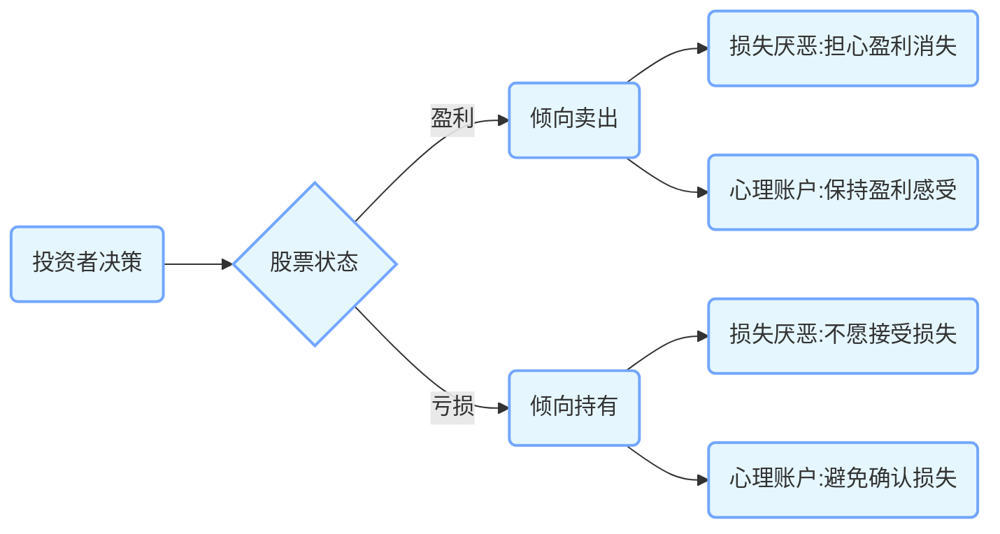

# 处置效应：为什么投资者倾向于卖出盈利股票

> 关键词：处置效应、投资者行为、盈利股票、损失厌恶、心理账户

> 摘要：本文聚焦于金融市场中的处置效应，深入探讨投资者为何倾向于卖出盈利股票这一现象。首先介绍处置效应的背景知识，包括其研究目的、预期读者和文档结构等。接着阐述处置效应的核心概念、相关联系及原理架构，通过数学模型和公式进行理论分析。以Python代码详细讲解核心算法原理和具体操作步骤，并给出项目实战案例。探讨处置效应在实际中的应用场景，推荐相关学习资源、开发工具和论文著作。最后总结未来发展趋势与挑战，解答常见问题并提供参考资料，旨在全面剖析处置效应背后的原因，为投资者和相关研究人员提供深入的见解和参考。

## 1. 背景介绍 
### 1.1 目的和范围
在金融投资领域，投资者的决策行为一直是研究的重点。处置效应作为一种普遍存在的投资者行为偏差，对金融市场的运行和投资者的收益有着重要影响。本文的目的在于深入研究处置效应，即为什么投资者倾向于卖出盈利股票，分析其背后的原因和影响机制。研究范围涵盖了处置效应的理论基础、实证研究、数学模型以及实际应用场景等多个方面，旨在全面揭示这一现象的本质和规律。

### 1.2 预期读者
本文预期读者包括金融市场投资者、金融分析师、学者以及对投资者行为和金融市场感兴趣的人士。对于投资者而言，了解处置效应可以帮助他们认识自身决策中的偏差，优化投资策略；金融分析师可以将处置效应的研究成果应用于市场分析和投资建议中；学者可以从本文中获取关于处置效应的最新研究进展和理论分析；而对该领域感兴趣的人士则可以通过本文初步了解处置效应这一重要的金融现象。

### 1.3 文档结构概述
本文将按照以下结构展开：首先介绍处置效应的背景知识，包括目的、预期读者和文档结构等；接着阐述处置效应的核心概念、相关联系及原理架构；然后通过数学模型和公式进行理论分析，并用Python代码详细讲解核心算法原理和具体操作步骤；之后给出项目实战案例，包括开发环境搭建、源代码实现和代码解读；探讨处置效应在实际中的应用场景；推荐相关学习资源、开发工具和论文著作；最后总结未来发展趋势与挑战，解答常见问题并提供参考资料。

### 1.4 术语表
#### 1.4.1 核心术语定义
- **处置效应**：指投资者在处置股票时，倾向于卖出盈利股票而继续持有亏损股票的现象。
- **损失厌恶**：是一种心理现象，指人们面对同样数量的收益和损失时，认为损失更加令他们难以忍受。
- **心理账户**：是人们在心理上对结果（尤其是经济结果）的编码、分类和估价的过程，它揭示了人们在进行（资金）财富决策时的心理认知过程。

#### 1.4.2 相关概念解释
- **投资者行为偏差**：指投资者在投资决策过程中，由于心理因素等原因而偏离理性决策的现象。处置效应就是一种典型的投资者行为偏差。
- **前景理论**：由丹尼尔·卡尼曼（Daniel Kahneman）和阿莫斯·特沃斯基（Amos Tversky）提出，该理论描述和预测人们在面临风险决策过程中的行为理论，为解释处置效应提供了重要的理论基础。

#### 1.4.3 缩略词列表
- **EMH**：有效市场假说（Efficient Market Hypothesis）
- **PT**：前景理论（Prospect Theory）

## 2. 核心概念与联系 

### 处置效应的概念
处置效应是行为金融学中的一个重要概念，它描述了投资者在股票交易中的一种非理性行为模式。具体来说，当投资者手中的股票处于盈利状态时，他们往往更倾向于卖出该股票；而当股票处于亏损状态时，他们则更愿意继续持有。这种行为模式与传统金融理论中的理性人假设相悖，传统理论认为投资者应该基于股票的未来预期收益来做出决策，而不是当前的盈亏状况。

### 与其他概念的联系
#### 损失厌恶与处置效应
损失厌恶是处置效应产生的重要心理基础。根据前景理论，人们对损失的敏感程度要远远高于对收益的敏感程度。当投资者的股票盈利时，他们会担心盈利消失，从而产生卖出股票锁定收益的冲动；而当股票亏损时，他们因为不愿意接受损失的现实，而选择继续持有股票，希望股价能够反弹。例如，投资者A以100元的价格买入一只股票，当股价上涨到120元时，他可能会因为担心股价下跌而选择卖出；而当股价下跌到80元时，他可能会因为不愿意承认损失而继续持有。

#### 心理账户与处置效应
心理账户也对处置效应有着重要影响。投资者会在心理上为不同的投资设置不同的账户，并且会对每个账户的盈亏分别进行评估。当一个账户中的股票盈利时，投资者会认为该账户处于盈利状态，为了保持这种盈利的心理感受，他们会倾向于卖出盈利股票；而当账户中的股票亏损时，投资者会希望通过继续持有来等待股价反弹，从而避免在该账户中确认损失。例如，投资者B将自己的投资资金分为两个账户，一个账户投资蓝筹股，另一个账户投资成长股。当蓝筹股账户中的股票盈利时，他可能会选择卖出；而当成长股账户中的股票亏损时，他可能会继续持有。

### 核心概念原理和架构的文本示意图
```plaintext
处置效应
├── 损失厌恶
│   ├── 对损失更敏感
│   ├── 担心盈利消失
│   ├── 不愿接受损失现实
├── 心理账户
│   ├── 独立评估盈亏
│   ├── 保持盈利心理感受
│   ├── 避免确认损失
```

### Mermaid流程图


## 3. 核心算法原理 & 具体操作步骤 

### 算法原理
为了模拟处置效应，我们可以构建一个简单的投资者决策模型。该模型基于投资者的损失厌恶和心理账户两个因素，来决定投资者是否卖出股票。具体来说，我们可以根据股票的当前价格与买入价格的差值来判断股票是处于盈利还是亏损状态，然后根据损失厌恶系数和心理账户的影响来决定投资者的决策。

### Python源代码实现
```python
import random

# 定义投资者类
class Investor:
    def __init__(self, loss_aversion_coefficient, mental_account_influence):
        # 损失厌恶系数
        self.loss_aversion_coefficient = loss_aversion_coefficient
        # 心理账户影响系数
        self.mental_account_influence = mental_account_influence

    def make_decision(self, buy_price, current_price):
        # 计算盈亏情况
        profit = current_price - buy_price
        if profit > 0:
            # 盈利情况
            # 模拟损失厌恶的影响，盈利时卖出的概率受损失厌恶系数影响
            sell_probability = 0.5 + self.loss_aversion_coefficient * 0.2
            # 模拟心理账户的影响，盈利时卖出的概率受心理账户影响系数影响
            sell_probability += self.mental_account_influence * 0.1
            # 生成一个随机数，判断是否卖出
            random_number = random.random()
            if random_number < sell_probability:
                return True
            else:
                return False
        else:
            # 亏损情况
            # 模拟损失厌恶的影响，亏损时卖出的概率受损失厌恶系数影响
            sell_probability = 0.3 - self.loss_aversion_coefficient * 0.2
            # 模拟心理账户的影响，亏损时卖出的概率受心理账户影响系数影响
            sell_probability -= self.mental_account_influence * 0.1
            # 生成一个随机数，判断是否卖出
            random_number = random.random()
            if random_number < sell_probability:
                return True
            else:
                return False

# 示例使用
if __name__ == "__main__":
    # 创建一个投资者对象，设置损失厌恶系数和心理账户影响系数
    investor = Investor(loss_aversion_coefficient=0.6, mental_account_influence=0.4)
    # 假设买入价格为100元
    buy_price = 100
    # 随机生成当前价格
    current_price = random.randint(80, 120)
    # 投资者做出决策
    decision = investor.make_decision(buy_price, current_price)
    if decision:
        print(f"当前价格为 {current_price} 元，投资者决定卖出股票。")
    else:
        print(f"当前价格为 {current_price} 元，投资者决定继续持有股票。")
```

### 具体操作步骤
1. **初始化投资者对象**：创建一个`Investor`类的对象，并设置损失厌恶系数和心理账户影响系数。
2. **确定买入价格和当前价格**：设定股票的买入价格和当前价格。
3. **计算盈亏情况**：根据买入价格和当前价格计算股票的盈亏情况。
4. **判断决策**：根据盈亏情况和损失厌恶系数、心理账户影响系数，计算卖出股票的概率，并生成一个随机数进行比较，从而决定投资者是否卖出股票。
5. **输出决策结果**：输出投资者的决策结果。

## 4. 数学模型和公式 & 详细讲解 & 举例说明 

### 数学模型
我们可以用以下数学模型来描述投资者的决策过程。设 $P_b$ 为股票的买入价格，$P_c$ 为股票的当前价格，$\pi = P_c - P_b$ 为股票的盈亏情况。当 $\pi > 0$ 时，股票处于盈利状态；当 $\pi < 0$ 时，股票处于亏损状态。

设 $\lambda$ 为损失厌恶系数，$m$ 为心理账户影响系数。在盈利状态下，投资者卖出股票的概率 $P_{sell}^+$ 可以表示为：
$$P_{sell}^+ = 0.5 + \lambda \times 0.2 + m \times 0.1$$
在亏损状态下，投资者卖出股票的概率 $P_{sell}^-$ 可以表示为：
$$P_{sell}^- = 0.3 - \lambda \times 0.2 - m \times 0.1$$

### 详细讲解
- **盈利状态下的卖出概率**：$0.5$ 是一个基础概率，表示在没有损失厌恶和心理账户影响的情况下，投资者卖出股票的概率。$\lambda \times 0.2$ 表示损失厌恶对卖出概率的影响，损失厌恶系数 $\lambda$ 越大，投资者越担心盈利消失，卖出股票的概率就越高。$m \times 0.1$ 表示心理账户对卖出概率的影响，心理账户影响系数 $m$ 越大，投资者越倾向于保持盈利的心理感受，卖出股票的概率也越高。
- **亏损状态下的卖出概率**：$0.3$ 是一个基础概率，表示在没有损失厌恶和心理账户影响的情况下，投资者在亏损时卖出股票的概率。$-\lambda \times 0.2$ 表示损失厌恶对卖出概率的影响，损失厌恶系数 $\lambda$ 越大，投资者越不愿意接受损失，卖出股票的概率就越低。$-m \times 0.1$ 表示心理账户对卖出概率的影响，心理账户影响系数 $m$ 越大，投资者越希望避免确认损失，卖出股票的概率也越低。

### 举例说明
假设投资者的损失厌恶系数 $\lambda = 0.6$，心理账户影响系数 $m = 0.4$，买入价格 $P_b = 100$ 元。

- **盈利情况**：如果当前价格 $P_c = 120$ 元，则 $\pi = 120 - 100 = 20$ 元，股票处于盈利状态。此时，投资者卖出股票的概率为：
$$P_{sell}^+ = 0.5 + 0.6 \times 0.2 + 0.4 \times 0.1 = 0.5 + 0.12 + 0.04 = 0.66$$
这意味着投资者有 $66\%$ 的概率会卖出股票。

- **亏损情况**：如果当前价格 $P_c = 80$ 元，则 $\pi = 80 - 100 = -20$ 元，股票处于亏损状态。此时，投资者卖出股票的概率为：
$$P_{sell}^- = 0.3 - 0.6 \times 0.2 - 0.4 \times 0.1 = 0.3 - 0.12 - 0.04 = 0.14$$
这意味着投资者只有 $14\%$ 的概率会卖出股票。

## 5. 项目实战：代码实际案例和详细解释说明 

### 5.1  开发环境搭建
- **Python环境**：确保你已经安装了Python 3.x版本。可以从Python官方网站（https://www.python.org/downloads/） 下载并安装。
- **开发工具**：推荐使用PyCharm作为开发工具，它是一款功能强大的Python集成开发环境（IDE），可以从JetBrains官方网站（https://www.jetbrains.com/pycharm/download/） 下载并安装。

### 5.2  源代码详细实现和代码解读
```python
import random

# 定义投资者类
class Investor:
    def __init__(self, loss_aversion_coefficient, mental_account_influence):
        # 损失厌恶系数
        self.loss_aversion_coefficient = loss_aversion_coefficient
        # 心理账户影响系数
        self.mental_account_influence = mental_account_influence

    def make_decision(self, buy_price, current_price):
        # 计算盈亏情况
        profit = current_price - buy_price
        if profit > 0:
            # 盈利情况
            # 模拟损失厌恶的影响，盈利时卖出的概率受损失厌恶系数影响
            sell_probability = 0.5 + self.loss_aversion_coefficient * 0.2
            # 模拟心理账户的影响，盈利时卖出的概率受心理账户影响系数影响
            sell_probability += self.mental_account_influence * 0.1
            # 生成一个随机数，判断是否卖出
            random_number = random.random()
            if random_number < sell_probability:
                return True
            else:
                return False
        else:
            # 亏损情况
            # 模拟损失厌恶的影响，亏损时卖出的概率受损失厌恶系数影响
            sell_probability = 0.3 - self.loss_aversion_coefficient * 0.2
            # 模拟心理账户的影响，亏损时卖出的概率受心理账户影响系数影响
            sell_probability -= self.mental_account_influence * 0.1
            # 生成一个随机数，判断是否卖出
            random_number = random.random()
            if random_number < sell_probability:
                return True
            else:
                return False

# 示例使用
if __name__ == "__main__":
    # 创建一个投资者对象，设置损失厌恶系数和心理账户影响系数
    investor = Investor(loss_aversion_coefficient=0.6, mental_account_influence=0.4)
    # 假设买入价格为100元
    buy_price = 100
    # 随机生成当前价格
    current_price = random.randint(80, 120)
    # 投资者做出决策
    decision = investor.make_decision(buy_price, current_price)
    if decision:
        print(f"当前价格为 {current_price} 元，投资者决定卖出股票。")
    else:
        print(f"当前价格为 {current_price} 元，投资者决定继续持有股票。")
```
#### 代码解读
1. **类的定义**：`Investor`类用于表示投资者，其中`__init__`方法用于初始化投资者的损失厌恶系数和心理账户影响系数。
2. **决策方法**：`make_decision`方法用于根据股票的买入价格和当前价格，以及投资者的损失厌恶系数和心理账户影响系数，决定投资者是否卖出股票。
3. **盈利情况处理**：当股票处于盈利状态时，根据损失厌恶系数和心理账户影响系数计算卖出股票的概率，并生成一个随机数进行比较，从而决定是否卖出股票。
4. **亏损情况处理**：当股票处于亏损状态时，同样根据损失厌恶系数和心理账户影响系数计算卖出股票的概率，并生成一个随机数进行比较，从而决定是否卖出股票。
5. **示例使用**：在`if __name__ == "__main__"`块中，创建一个投资者对象，设置买入价格和当前价格，调用`make_decision`方法进行决策，并输出决策结果。

### 5.3  代码解读与分析
- **代码的优点**：该代码简单易懂，通过模拟损失厌恶和心理账户的影响，较好地实现了投资者的决策过程。同时，使用随机数来模拟决策的不确定性，更加符合实际情况。
- **代码的局限性**：该代码只是一个简单的模拟模型，实际的投资者决策过程要复杂得多。例如，没有考虑市场因素、投资者的风险偏好等因素的影响。此外，损失厌恶系数和心理账户影响系数的取值是固定的，没有考虑不同投资者之间的差异。

## 6. 实际应用场景 
### 投资者教育
了解处置效应可以帮助投资者认识到自己决策中的偏差，从而提高投资决策的理性程度。投资者可以通过学习处置效应的相关知识，意识到自己在卖出盈利股票和持有亏损股票时的心理因素，从而避免因情绪和心理因素而做出错误的决策。例如，投资者可以制定明确的投资计划和止损止盈策略，避免过度卖出盈利股票或过度持有亏损股票。

### 金融机构服务
金融机构可以根据处置效应的研究成果，为投资者提供更加个性化的投资建议和服务。例如，金融机构可以通过分析投资者的交易记录，识别出存在处置效应偏差的投资者，并为他们提供针对性的投资教育和风险提示。此外，金融机构还可以开发一些投资产品和策略，帮助投资者克服处置效应的影响，提高投资收益。

### 市场监管
监管机构可以关注处置效应等投资者行为偏差对市场的影响，制定相应的政策和措施来维护市场的稳定和公平。例如，监管机构可以加强对投资者教育的宣传和推广，提高投资者的风险意识和理性投资能力。同时，监管机构还可以加强对市场操纵和内幕交易等违法行为的打击，减少投资者因信息不对称而产生的决策偏差。

### 学术研究
处置效应是行为金融学领域的一个重要研究课题，对其的研究可以帮助学者更好地理解投资者的行为和心理，完善金融理论。学者可以通过实证研究和实验研究等方法，深入探讨处置效应的产生机制、影响因素和经济后果，为金融市场的发展和监管提供理论支持。

## 7. 工具和资源推荐
### 7.1 学习资源推荐
#### 7.1.1 书籍推荐
- 《思考，快与慢》（丹尼尔·卡尼曼著）：这本书介绍了人类思维的两种模式——快思考和慢思考，以及它们在决策过程中的作用。书中包含了大量关于行为经济学和决策心理学的案例和研究成果，对于理解处置效应等投资者行为偏差有很大的帮助。
- 《行为金融学》（饶育蕾、刘达锋编著）：这是一本系统介绍行为金融学的教材，书中详细阐述了行为金融学的基本理论和方法，包括前景理论、心理账户、处置效应等内容。通过阅读这本书，可以深入了解行为金融学的理论体系和研究方法。
- 《金融心理学》（拉斯·特维德著）：这本书从心理学的角度出发，分析了金融市场中的投资者行为和心理现象。书中包含了大量的实际案例和研究成果，对于理解金融市场中的各种行为偏差和心理因素有很大的帮助。

#### 7.1.2 在线课程
- Coursera上的“Behavioral Finance”课程：该课程由知名学者授课，系统介绍了行为金融学的基本理论和方法，包括处置效应等内容。课程内容丰富，讲解详细，适合对行为金融学感兴趣的学习者。
- 网易云课堂上的“行为金融与投资策略”课程：该课程结合实际案例，介绍了行为金融学在投资决策中的应用，包括如何识别和克服投资者行为偏差。课程内容实用，对于投资者和金融从业者有很大的帮助。

#### 7.1.3 技术博客和网站
- 行为金融网（http://www.bfcn.org.cn/）：该网站是国内行为金融学领域的专业网站，提供了丰富的行为金融学研究成果、学术动态和案例分析等内容。通过浏览该网站，可以及时了解行为金融学的最新研究进展和应用案例。
- 雪球网（https://xueqiu.com/）：雪球网是一个投资者社区，提供了股票、基金等金融产品的信息和分析，以及投资者的交流和分享平台。在雪球网上，可以了解到投资者的实际操作和决策过程，以及他们对市场的看法和分析，对于理解投资者行为有很大的帮助。

### 7.2 开发工具框架推荐
#### 7.2.1 IDE和编辑器
- PyCharm：一款功能强大的Python集成开发环境（IDE），提供了代码编辑、调试、版本控制等功能，适合Python开发。
- Visual Studio Code：一款轻量级的代码编辑器，支持多种编程语言，包括Python。它具有丰富的插件和扩展功能，可以满足不同的开发需求。

#### 7.2.2 调试和性能分析工具
- PDB：Python自带的调试工具，可以帮助开发者在代码中设置断点、单步执行代码、查看变量值等，方便调试程序。
- cProfile：Python的性能分析工具，可以帮助开发者分析程序的性能瓶颈，找出耗时较长的函数和代码段，从而进行优化。

#### 7.2.3 相关框架和库
- NumPy：一个用于科学计算的Python库，提供了高效的数组操作和数学函数，适合进行数值计算和数据分析。
- Pandas：一个用于数据处理和分析的Python库，提供了数据结构和数据操作工具，适合处理和分析金融数据。

### 7.3 相关论文著作推荐
#### 7.3.1 经典论文
- Shefrin, H., & Statman, M. (1985). The disposition to sell winners too early and ride losers too long: Theory and evidence. The Journal of Finance, 40(3), 777-790. 这篇论文是处置效应研究的经典文献，首次提出了处置效应的概念，并通过实证研究验证了处置效应的存在。
- Kahneman, D., & Tversky, A. (1979). Prospect theory: An analysis of decision under risk. Econometrica, 47(2), 263-291. 这篇论文提出了前景理论，为解释处置效应等投资者行为偏差提供了重要的理论基础。

#### 7.3.2 最新研究成果
- Barberis, N., & Xiong, W. (2012). Realization utility. Journal of Financial Economics, 104(2), 251-271. 这篇论文提出了实现效用理论，进一步解释了投资者的处置效应行为。
- Frydman, C., Barberis, N., Camerer, C. F., Bossaerts, P., & Rangel, A. (2014). Rationalizing the disposition effect: A model of belief-dependent preferences. American Economic Review, 104(1), 201-219. 这篇论文从信念依赖偏好的角度，对处置效应进行了新的解释。

#### 7.3.3 应用案例分析
- Feng, L., & Seasholes, M. S. (2005). Do investors trade too much? Evidence from Taiwan. The Review of Financial Studies, 18(2), 605-637. 这篇论文通过对台湾股票市场的实证研究，分析了投资者的交易行为和处置效应的影响。
- Grinblatt, M., & Keloharju, M. (2001). What makes investors trade? Journal of Finance, 56(2), 589-616. 这篇论文通过对芬兰股票市场的实证研究，探讨了投资者交易行为的影响因素，包括处置效应等。

## 8. 总结：未来发展趋势与挑战
### 未来发展趋势
- **跨学科研究的深入**：处置效应的研究涉及到金融学、心理学、经济学等多个学科领域。未来，跨学科研究将进一步深入，学者们将综合运用多个学科的理论和方法，更加全面地揭示处置效应的产生机制和影响因素。
- **大数据和人工智能的应用**：随着大数据和人工智能技术的发展，研究者可以利用海量的金融数据和先进的数据分析方法，对处置效应进行更加深入的研究。例如，通过机器学习算法分析投资者的交易行为模式，预测投资者的决策倾向，从而更好地理解和解释处置效应。
- **投资者教育的加强**：随着投资者对自身决策行为的关注度不断提高，投资者教育将得到进一步加强。金融机构和监管机构将更加重视投资者教育，通过各种渠道向投资者普及处置效应等行为金融学知识，帮助投资者提高投资决策的理性程度。
- **金融产品和策略的创新**：基于处置效应的研究成果，金融机构将开发更多的金融产品和策略，帮助投资者克服处置效应的影响，提高投资收益。例如，开发一些具有止损止盈功能的智能投资产品，或者设计一些基于行为金融学原理的投资策略。

### 挑战
- **理论模型的完善**：目前的处置效应理论模型还存在一定的局限性，无法完全解释投资者的复杂决策行为。未来需要进一步完善理论模型，考虑更多的因素和变量，提高模型的解释力和预测能力。
- **数据质量和隐私问题**：大数据和人工智能技术的应用需要大量的高质量数据。然而，金融数据的质量和隐私问题是一个重要的挑战。如何确保数据的准确性、完整性和安全性，同时保护投资者的隐私，是需要解决的问题。
- **投资者行为的复杂性**：投资者的行为受到多种因素的影响，包括心理因素、社会因素、市场因素等。投资者行为的复杂性增加了研究处置效应的难度，需要更加深入地了解投资者的心理和行为机制。
- **市场环境的变化**：金融市场环境不断变化，新的金融产品和交易方式不断涌现。这些变化可能会对投资者的决策行为产生影响，从而改变处置效应的表现形式和影响程度。如何及时捕捉市场环境的变化，调整研究方法和策略，是未来研究面临的挑战之一。

## 9. 附录：常见问题与解答
### 1. 处置效应一定会导致投资者的损失吗？
处置效应并不一定会导致投资者的损失，但它可能会影响投资者的收益。当投资者过早卖出盈利股票时，可能会错过股票进一步上涨的机会，从而减少了潜在的收益；而当投资者过度持有亏损股票时，可能会导致损失进一步扩大。然而，在某些情况下，投资者卖出盈利股票可能是为了锁定收益，避免市场波动带来的风险；而持有亏损股票也可能是因为对股票的未来表现有信心。因此，处置效应是否会导致投资者的损失，取决于具体的市场情况和投资者的决策。

### 2. 如何克服处置效应的影响？
- **制定投资计划**：在投资前，制定明确的投资计划和止损止盈策略。根据自己的投资目标、风险承受能力和投资期限，确定买入和卖出的条件，避免因情绪和心理因素而做出冲动的决策。
- **加强投资者教育**：学习行为金融学等相关知识，了解处置效应等投资者行为偏差的产生机制和影响，提高自己的投资决策能力和理性程度。
- **定期复盘**：定期对自己的投资组合进行复盘，分析自己的投资决策过程和结果，总结经验教训，发现并纠正自己的决策偏差。
- **寻求专业帮助**：如果自己无法克服处置效应的影响，可以寻求专业金融顾问的帮助。金融顾问可以根据投资者的具体情况，提供个性化的投资建议和服务，帮助投资者制定合理的投资策略。

### 3. 处置效应在不同市场环境下的表现有何不同？
在不同的市场环境下，处置效应的表现可能会有所不同。在牛市中，股票价格普遍上涨，投资者更容易获得盈利，此时处置效应可能表现为投资者更倾向于卖出盈利股票，以锁定收益。而在熊市中，股票价格普遍下跌，投资者更容易遭受亏损，此时处置效应可能表现为投资者更倾向于持有亏损股票，希望股价能够反弹。此外，市场的波动性、流动性等因素也可能会影响处置效应的表现。例如，在市场波动性较大的情况下，投资者可能会更加谨慎，卖出盈利股票的意愿可能会增强；而在市场流动性较差的情况下，投资者可能会更难卖出亏损股票，从而导致持有时间更长。

### 4. 处置效应与投资者的年龄、性别等因素有关吗？
研究表明，处置效应与投资者的年龄、性别等因素可能存在一定的关系。一般来说，年龄较大的投资者可能更容易受到处置效应的影响，因为他们可能更加保守和谨慎，更不愿意接受损失。而女性投资者可能比男性投资者更容易受到处置效应的影响，因为女性可能更加注重风险控制和稳定收益。然而，这些关系并不是绝对的，不同的投资者个体之间存在很大的差异，还受到投资者的教育程度、投资经验、风险偏好等多种因素的影响。

## 10. 扩展阅读 & 参考资料
### 扩展阅读
- Thaler, R. H. (1999). Mental accounting matters. Journal of Behavioral Decision Making, 12(3), 183-206. 这篇论文介绍了心理账户的概念和理论，对于理解处置效应的心理基础有很大的帮助。
- Odean, T. (1998). Are investors reluctant to realize their losses? The Journal of Finance, 53(5), 1775-1798. 这篇论文通过实证研究，进一步验证了投资者的处置效应行为，并分析了其影响因素。

### 参考资料
- 卡尼曼, D., & 特沃斯基, A. (2012). 思考, 快与慢. 中信出版社.
- 饶育蕾, 刘达锋. (2016). 行为金融学. 机械工业出版社.
- 特维德, L. (2012). 金融心理学. 机械工业出版社.
- Shefrin, H., & Statman, M. (1985). The disposition to sell winners too early and ride losers too long: Theory and evidence. The Journal of Finance, 40(3), 777-790.
- Kahneman, D., & Tversky, A. (1979). Prospect theory: An analysis of decision under risk. Econometrica, 47(2), 263-291.
- Barberis, N., & Xiong, W. (2012). Realization utility. Journal of Financial Economics, 104(2), 251-271.
- Frydman, C., Barberis, N., Camerer, C. F., Bossaerts, P., & Rangel, A. (2014). Rationalizing the disposition effect: A model of belief-dependent preferences. American Economic Review, 104(1), 201-219.
- Feng, L., & Seasholes, M. S. (2005). Do investors trade too much? Evidence from Taiwan. The Review of Financial Studies, 18(2), 605-637.
- Grinblatt, M., & Keloharju, M. (2001). What makes investors trade? Journal of Finance, 56(2), 589-616.