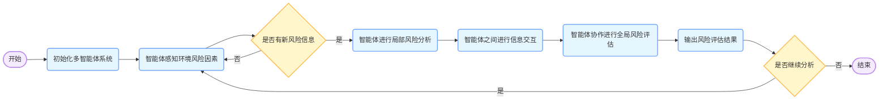

# 多智能体协作进行系统性风险分析

> 关键词：多智能体协作、系统性风险分析、智能体交互、风险评估、分布式计算

> 摘要：本文聚焦于多智能体协作进行系统性风险分析这一前沿领域。系统性风险在众多复杂系统中广泛存在，准确分析和评估这些风险对于保障系统的稳定运行至关重要。多智能体协作作为一种新兴的计算模式，能够充分发挥多个智能体的优势，实现高效、精准的风险分析。文章深入探讨了多智能体协作的核心概念、算法原理、数学模型，并通过实际项目案例展示了其在系统性风险分析中的应用，最后对未来发展趋势与挑战进行了总结，旨在为相关领域的研究和实践提供全面且深入的参考。

## 1. 背景介绍 
### 1.1 目的和范围
系统性风险广泛存在于金融、能源、交通等多个领域，对社会经济的稳定发展构成潜在威胁。传统的风险分析方法往往难以应对复杂系统中多因素、动态变化的风险特征。多智能体协作进行系统性风险分析的目的在于利用多个智能体的自主决策和交互能力，实现对复杂系统风险的全面、准确评估。本文章的范围涵盖了多智能体协作的基本原理、核心算法、数学模型以及实际应用案例，旨在为读者提供一个完整的多智能体协作进行系统性风险分析的知识体系。

### 1.2 预期读者
本文预期读者包括从事计算机科学、控制科学、金融工程、风险管理等领域的研究人员、工程师和学生。对于希望了解多智能体技术在系统性风险分析中应用的专业人士，以及对复杂系统风险评估感兴趣的爱好者，本文都具有一定的参考价值。

### 1.3 文档结构概述
本文将按照以下结构进行组织：首先介绍多智能体协作和系统性风险分析的背景知识和相关术语；接着阐述多智能体协作的核心概念、原理和架构，并给出相应的流程图；然后详细讲解核心算法原理和具体操作步骤，包括Python源代码实现；再介绍数学模型和公式，并进行详细讲解和举例说明；通过实际项目案例展示多智能体协作在系统性风险分析中的应用，包括开发环境搭建、源代码实现和代码解读；探讨多智能体协作进行系统性风险分析的实际应用场景；推荐相关的学习资源、开发工具框架和论文著作；最后总结未来发展趋势与挑战，并提供常见问题解答和扩展阅读参考资料。

### 1.4 术语表
#### 1.4.1 核心术语定义
- **多智能体系统（Multi - Agent System, MAS）**：由多个自主智能体组成的系统，这些智能体通过交互和协作来完成共同的任务。
- **智能体（Agent）**：具有自主性、反应性、社会性和主动性的实体，能够感知环境并采取行动以实现自身目标。
- **系统性风险（Systemic Risk）**：指整个系统面临的、可能导致系统崩溃或严重受损的风险，通常由多个相互关联的因素共同作用引起。
- **风险评估（Risk Assessment）**：对系统中存在的风险进行识别、分析和评价的过程。

#### 1.4.2 相关概念解释
- **分布式计算**：将计算任务分配到多个计算节点上进行处理的计算模式，多智能体系统通常采用分布式计算来实现智能体之间的协作。
- **博弈论**：研究多个参与者在竞争或合作环境中如何做出决策的理论，在多智能体协作中可用于分析智能体之间的交互策略。
- **机器学习**：让计算机通过数据学习模式和规律，以实现预测和决策的技术，在多智能体协作中可用于智能体的行为学习和优化。

#### 1.4.3 缩略词列表
- **MAS**：Multi - Agent System（多智能体系统）
- **AI**：Artificial Intelligence（人工智能）
- **ML**：Machine Learning（机器学习）

## 2. 核心概念与联系 

### 多智能体协作的基本原理
多智能体协作的核心思想是将复杂的任务分解为多个子任务，每个智能体负责处理一个或多个子任务，并通过与其他智能体的交互和协作来完成整个任务。智能体具有自主性，能够根据自身的感知和目标自主地做出决策和行动。同时，智能体之间通过通信机制进行信息交换和协调，以实现协作的一致性和高效性。

### 多智能体系统的架构
多智能体系统通常由多个智能体、通信网络和环境组成。智能体可以分为不同的类型，如决策智能体、执行智能体、监测智能体等，它们各自具有不同的功能和任务。通信网络用于智能体之间的信息传递和交互，环境则是智能体活动的物理或虚拟空间。

### 多智能体协作与系统性风险分析的联系
在系统性风险分析中，多智能体协作可以发挥重要作用。不同的智能体可以负责不同的风险因素的监测和分析，通过协作和信息共享，实现对系统性风险的全面评估。例如，在金融系统中，一些智能体可以监测市场数据，另一些智能体可以分析宏观经济指标，还有一些智能体可以评估信用风险等。这些智能体通过协作和交互，能够更准确地识别和评估系统性金融风险。

### 文本示意图
多智能体系统进行系统性风险分析的架构可以描述为：多个智能体分布在不同的节点上，通过通信网络相互连接。每个智能体都有自己的传感器用于感知环境中的风险因素，同时具有决策模块和执行模块。智能体之间通过消息传递进行信息交换和协作，共同完成系统性风险分析的任务。环境中包含各种风险因素，如市场波动、政策变化等，智能体通过对这些因素的监测和分析来评估系统性风险。

### Mermaid 流程图


## 3. 核心算法原理 & 具体操作步骤 

### 核心算法原理
多智能体协作进行系统性风险分析的核心算法包括智能体的决策算法和协作算法。智能体的决策算法用于根据自身的感知和目标做出决策，常见的决策算法包括基于规则的决策算法、基于机器学习的决策算法等。协作算法用于智能体之间的信息交换和协调，常见的协作算法包括合同网协议、拍卖算法等。

### 基于规则的决策算法
基于规则的决策算法是一种简单而有效的决策方法，它通过定义一系列的规则来指导智能体的决策。规则通常由条件和动作组成，当条件满足时，智能体执行相应的动作。以下是一个简单的基于规则的决策算法的Python实现：

```python
class RuleBasedAgent:
    def __init__(self, rules):
        self.rules = rules

    def make_decision(self, perception):
        for rule in self.rules:
            condition, action = rule
            if self.check_condition(condition, perception):
                return action
        return None

    def check_condition(self, condition, perception):
        # 简单示例：条件为一个字典，键为感知的属性，值为预期的值
        for key, value in condition.items():
            if perception.get(key) != value:
                return False
        return True


# 示例规则
rules = [
    ({'risk_level': 'high'}, 'increase_monitoring'),
    ({'risk_level': 'low'}, 'reduce_monitoring')
]

# 创建智能体
agent = RuleBasedAgent(rules)

# 示例感知
perception = {'risk_level': 'high'}

# 做出决策
decision = agent.make_decision(perception)
print("决策结果:", decision)
```

### 合同网协议协作算法
合同网协议是一种常用的多智能体协作算法，它通过招标、投标和中标三个阶段来实现任务的分配和协作。以下是一个简单的合同网协议协作算法的Python实现：

```python
import random

class Agent:
    def __init__(self, id):
        self.id = id
        self.capabilities = []

    def receive_task(self, task):
        # 简单示例：根据能力判断是否投标
        if task in self.capabilities:
            bid = random.randint(1, 10)
            return bid
        else:
            return None

    def receive_award(self, task):
        print(f"智能体 {self.id} 中标任务 {task}")


class ContractNetProtocol:
    def __init__(self, agents):
        self.agents = agents

    def distribute_task(self, task):
        # 招标阶段
        bids = {}
        for agent in self.agents:
            bid = agent.receive_task(task)
            if bid is not None:
                bids[agent] = bid

        # 中标阶段
        if bids:
            winner = min(bids, key=bids.get)
            winner.receive_award(task)
        else:
            print("没有合适的智能体可以完成任务")


# 创建智能体
agent1 = Agent(1)
agent1.capabilities = ['risk_analysis', 'data_monitoring']
agent2 = Agent(2)
agent2.capabilities = ['data_processing', 'report_generation']

agents = [agent1, agent2]

# 创建合同网协议实例
cnp = ContractNetProtocol(agents)

# 分配任务
task = 'risk_analysis'
cnp.distribute_task(task)
```

### 具体操作步骤
1. **初始化多智能体系统**：创建多个智能体，并初始化它们的属性和能力。
2. **智能体感知环境风险因素**：每个智能体通过传感器或其他方式获取环境中的风险因素信息。
3. **智能体进行局部风险分析**：根据自身的感知和决策算法，每个智能体对局部的风险因素进行分析和评估。
4. **智能体之间进行信息交互**：智能体通过通信网络交换局部风险分析的结果和其他相关信息。
5. **智能体协作进行全局风险评估**：根据交互得到的信息，智能体协作进行全局风险评估，综合考虑多个风险因素。
6. **输出风险评估结果**：将全局风险评估的结果输出，供决策者参考。
7. **判断是否继续分析**：根据实际需求，判断是否需要继续进行风险分析。如果需要，则返回步骤2；否则，结束分析过程。

## 4. 数学模型和公式 & 详细讲解 & 举例说明 

### 风险评估的数学模型
在多智能体协作进行系统性风险分析中，常用的风险评估数学模型包括概率模型、模糊数学模型、神经网络模型等。这里我们以概率模型为例进行详细讲解。

### 概率模型
概率模型通过计算风险事件发生的概率和后果的严重程度来评估风险。设 $R$ 表示风险，$P$ 表示风险事件发生的概率，$C$ 表示风险事件发生后的后果严重程度，则风险 $R$ 可以表示为：

$$R = P \times C$$

### 详细讲解
- **风险事件发生的概率 $P$**：可以通过历史数据统计、专家判断等方法来确定。例如，在金融市场中，可以通过分析过去一段时间内股票价格的波动情况来估计股票价格下跌的概率。
- **风险事件发生后的后果严重程度 $C$**：可以根据风险事件对系统造成的损失来评估。例如，在电力系统中，风险事件发生后可能导致停电，后果严重程度可以用停电的时间、影响的用户数量等指标来衡量。

### 举例说明
假设在一个金融投资组合中，有两种资产 $A$ 和 $B$。资产 $A$ 价格下跌的概率 $P_A = 0.2$，价格下跌后造成的损失为 $C_A = 100$ 万元；资产 $B$ 价格下跌的概率 $P_B = 0.3$，价格下跌后造成的损失为 $C_B = 200$ 万元。

则资产 $A$ 的风险 $R_A$ 为：

$$R_A = P_A \times C_A = 0.2 \times 100 = 20 \text{（万元）}$$

资产 $B$ 的风险 $R_B$ 为：

$$R_B = P_B \times C_B = 0.3 \times 200 = 60 \text{（万元）}$$

整个投资组合的风险可以通过对各个资产的风险进行加权求和得到。假设资产 $A$ 和 $B$ 在投资组合中的权重分别为 $w_A = 0.4$ 和 $w_B = 0.6$，则投资组合的风险 $R_{portfolio}$ 为：

$$R_{portfolio} = w_A \times R_A + w_B \times R_B = 0.4 \times 20 + 0.6 \times 60 = 8 + 36 = 44 \text{（万元）}$$

### 多智能体协作下的风险评估公式
在多智能体协作的情况下，每个智能体可以对局部的风险进行评估，然后通过协作和信息共享来得到全局的风险评估结果。设 $R_i$ 表示第 $i$ 个智能体评估的局部风险，$w_i$ 表示第 $i$ 个智能体的权重，则全局风险 $R_{global}$ 可以表示为：

$$R_{global} = \sum_{i = 1}^{n} w_i \times R_i$$

其中 $n$ 表示智能体的数量。智能体的权重可以根据智能体的可信度、能力等因素来确定。

## 5. 项目实战：代码实际案例和详细解释说明 

### 5.1  开发环境搭建
#### 硬件环境
- 计算机：至少具有 4GB 内存和 2GHz 以上的处理器。
- 网络：稳定的网络连接，用于智能体之间的通信。

#### 软件环境
- 操作系统：Windows、Linux 或 macOS。
- 编程语言：Python 3.x。
- 开发工具：PyCharm 或 Visual Studio Code 等集成开发环境。
- 相关库：`numpy`、`pandas`、`matplotlib` 等用于数据处理和分析，`socket` 或 `pyzmq` 等用于智能体之间的通信。

### 5.2  源代码详细实现和代码解读
以下是一个简单的多智能体协作进行系统性风险分析的项目示例，该示例模拟了一个金融市场的风险分析场景。

```python
import random
import socket
import threading

# 智能体类
class Agent:
    def __init__(self, id, host, port):
        self.id = id
        self.host = host
        self.port = port
        self.risk_data = []
        self.server_socket = socket.socket(socket.AF_INET, socket.SOCK_STREAM)
        self.server_socket.bind((host, port))
        self.server_socket.listen(1)
        threading.Thread(target=self.receive_messages).start()

    def receive_messages(self):
        while True:
            conn, addr = self.server_socket.accept()
            data = conn.recv(1024).decode()
            if data:
                self.process_message(data)
            conn.close()

    def process_message(self, message):
        # 简单示例：将接收到的风险数据添加到本地列表中
        try:
            risk_value = float(message)
            self.risk_data.append(risk_value)
            print(f"智能体 {self.id} 接收到风险数据: {risk_value}")
        except ValueError:
            print(f"智能体 {self.id} 接收到无效消息: {message}")

    def send_message(self, target_host, target_port, message):
        client_socket = socket.socket(socket.AF_INET, socket.SOCK_STREAM)
        try:
            client_socket.connect((target_host, target_port))
            client_socket.sendall(message.encode())
        except Exception as e:
            print(f"智能体 {self.id} 发送消息失败: {e}")
        finally:
            client_socket.close()

    def analyze_local_risk(self):
        if self.risk_data:
            # 简单示例：计算本地风险的平均值
            local_risk = sum(self.risk_data) / len(self.risk_data)
            return local_risk
        else:
            return 0

    def collaborate_global_risk(self, other_agents):
        local_risk = self.analyze_local_risk()
        global_risk = local_risk
        for agent in other_agents:
            agent.send_message(agent.host, agent.port, str(local_risk))
        # 简单示例：假设收到所有其他智能体的消息后，计算全局风险为所有本地风险的平均值
        total_risk = local_risk * len(other_agents)
        for agent in other_agents:
            total_risk += sum(agent.risk_data)
        global_risk = total_risk / (len(other_agents) + 1)
        return global_risk


# 主函数
if __name__ == "__main__":
    # 创建智能体
    agent1 = Agent(1, 'localhost', 8888)
    agent2 = Agent(2, 'localhost', 8889)
    agents = [agent1, agent2]

    # 模拟风险数据
    for _ in range(5):
        risk_value1 = random.uniform(1, 10)
        risk_value2 = random.uniform(1, 10)
        agent1.risk_data.append(risk_value1)
        agent2.risk_data.append(risk_value2)

    # 协作进行全局风险评估
    global_risk = agent1.collaborate_global_risk([agent2])
    print(f"全局风险评估结果: {global_risk}")
```

### 5.3  代码解读与分析
- **智能体类 `Agent`**：
  - `__init__` 方法：初始化智能体的属性，包括 ID、主机地址、端口号等，并启动一个线程用于接收其他智能体的消息。
  - `receive_messages` 方法：不断监听网络连接，接收其他智能体发送的消息，并调用 `process_message` 方法进行处理。
  - `process_message` 方法：将接收到的风险数据添加到本地列表中。
  - `send_message` 方法：向指定的目标智能体发送消息。
  - `analyze_local_risk` 方法：计算本地风险的平均值。
  - `collaborate_global_risk` 方法：与其他智能体协作进行全局风险评估，先发送本地风险数据给其他智能体，然后根据接收到的其他智能体的风险数据计算全局风险。

- **主函数**：
  - 创建两个智能体 `agent1` 和 `agent2`。
  - 模拟风险数据，分别添加到两个智能体的本地风险数据列表中。
  - 调用 `collaborate_global_risk` 方法进行全局风险评估，并输出评估结果。

## 6. 实际应用场景 
### 金融领域
在金融领域，多智能体协作进行系统性风险分析可以用于评估金融市场的稳定性。不同的智能体可以负责监测不同的金融指标，如股票价格、利率、汇率等，通过协作和信息共享，实现对金融市场系统性风险的实时评估。例如，一些智能体可以监测宏观经济数据，另一些智能体可以分析金融机构的财务状况，还有一些智能体可以评估市场参与者的行为。通过多智能体协作，可以更准确地识别和预测金融市场的系统性风险，为监管机构和投资者提供决策支持。

### 能源领域
在能源领域，多智能体协作可以用于评估能源系统的可靠性和安全性。不同的智能体可以负责监测能源生产、传输、分配等各个环节的运行状态，通过协作和信息共享，实现对能源系统系统性风险的全面评估。例如，一些智能体可以监测发电厂的设备运行状况，另一些智能体可以分析电网的负荷情况，还有一些智能体可以评估能源市场的价格波动。通过多智能体协作，可以及时发现能源系统中的潜在风险，采取相应的措施进行防范和应对，保障能源系统的稳定运行。

### 交通领域
在交通领域，多智能体协作可以用于评估交通系统的拥堵和安全风险。不同的智能体可以负责监测不同的交通要素，如道路流量、车辆速度、交通事故等，通过协作和信息共享，实现对交通系统系统性风险的实时评估。例如，一些智能体可以安装在道路上的传感器，实时监测道路流量和车辆速度，另一些智能体可以分析交通事故的发生情况，还有一些智能体可以预测交通拥堵的发展趋势。通过多智能体协作，可以及时采取交通疏导措施，提高交通系统的运行效率和安全性。

### 医疗领域
在医疗领域，多智能体协作可以用于评估医疗系统的风险和效率。不同的智能体可以负责监测不同的医疗环节，如医院的床位利用率、医疗设备的运行状况、患者的病情变化等，通过协作和信息共享，实现对医疗系统系统性风险的全面评估。例如，一些智能体可以监测医院的资源分配情况，另一些智能体可以分析医疗质量指标，还有一些智能体可以预测疾病的流行趋势。通过多智能体协作，可以优化医疗资源的配置，提高医疗服务的质量和效率，降低医疗系统的风险。

## 7. 工具和资源推荐
### 7.1 学习资源推荐
#### 7.1.1 书籍推荐
- 《多智能体系统：原理与编程》：全面介绍了多智能体系统的基本原理、算法和编程实现，是学习多智能体系统的经典教材。
- 《风险管理与金融机构》：详细讲解了金融领域的风险管理理论和方法，对于理解系统性金融风险分析具有重要的参考价值。
- 《人工智能：一种现代的方法》：涵盖了人工智能的各个领域，包括多智能体系统、机器学习等，是人工智能领域的权威著作。

#### 7.1.2 在线课程
- Coursera 上的“Multi - Agent Systems”课程：由知名高校的教授授课，系统地介绍了多智能体系统的理论和应用。
- edX 上的“Risk Management in Financial Institutions”课程：专注于金融机构的风险管理，包括系统性风险分析的方法和技术。
- Udemy 上的“Artificial Intelligence A - Z™: Learn How To Build An AI”课程：提供了人工智能的全面学习内容，包括多智能体系统和机器学习的实践项目。

#### 7.1.3 技术博客和网站
- AI Stack Exchange：一个专门讨论人工智能相关问题的社区，包括多智能体系统和风险分析的技术讨论和经验分享。
- Towards Data Science：提供了大量关于数据科学、机器学习和人工智能的技术文章，其中不乏多智能体协作和系统性风险分析的案例和研究成果。
- arXiv：一个预印本数据库，包含了许多最新的学术研究论文，对于了解多智能体协作和系统性风险分析的前沿研究具有重要的参考价值。

### 7.2 开发工具框架推荐
#### 7.2.1 IDE和编辑器
- PyCharm：一款功能强大的 Python 集成开发环境，提供了代码编辑、调试、版本控制等一系列功能，适合开发多智能体系统的 Python 代码。
- Visual Studio Code：一款轻量级的代码编辑器，支持多种编程语言和插件扩展，具有良好的开发体验和社区支持。

#### 7.2.2 调试和性能分析工具
- pdb：Python 内置的调试器，可以帮助开发者定位代码中的错误和问题。
- cProfile：Python 标准库中的性能分析工具，可以分析代码的运行时间和资源消耗，帮助优化代码性能。

#### 7.2.3 相关框架和库
- Mesa：一个用于构建多智能体系统的 Python 框架，提供了简单易用的 API 和可视化工具，方便开发者快速搭建多智能体模型。
- NetworkX：一个用于图论和网络分析的 Python 库，可以用于模拟智能体之间的通信网络和交互关系。
- Scikit - learn：一个广泛使用的机器学习库，提供了各种机器学习算法和工具，可用于智能体的行为学习和风险分析模型的构建。

### 7.3 相关论文著作推荐
#### 7.3.1 经典论文
- “Multi - Agent Systems: A Modern Approach to Distributed Artificial Intelligence”：介绍了多智能体系统的基本概念、理论和应用，是多智能体系统领域的经典论文。
- “Systemic Risk in Financial Systems”：对金融系统中的系统性风险进行了深入的分析和研究，提出了一些重要的理论和方法。
- “Game - Theoretic Analysis of Multi - Agent Systems”：运用博弈论的方法对多智能体系统中的交互和协作进行了分析，为多智能体协作算法的设计提供了理论基础。

#### 7.3.2 最新研究成果
- 在顶级学术会议如 IJCAI（国际人工智能联合会议）、AAAI（美国人工智能协会会议）、ACM SIGKDD（知识发现与数据挖掘会议）等上发表的关于多智能体协作和系统性风险分析的研究论文，反映了该领域的最新研究动态和技术进展。
- 在知名学术期刊如 Artificial Intelligence、Journal of Artificial Intelligence Research、Risk Analysis 等上发表的相关研究论文，具有较高的学术水平和参考价值。

#### 7.3.3 应用案例分析
- 一些实际应用案例的研究报告和论文，如金融机构运用多智能体系统进行系统性风险分析的案例、能源企业利用多智能体技术评估能源系统风险的案例等。这些案例分析可以帮助读者更好地理解多智能体协作在实际应用中的具体实现和效果。

## 8. 总结：未来发展趋势与挑战
### 未来发展趋势
- **与深度学习的融合**：深度学习在图像识别、自然语言处理等领域取得了巨大的成功，将深度学习技术与多智能体协作相结合，可以提高智能体的感知和决策能力，实现更复杂的系统性风险分析任务。例如，利用深度学习模型对大量的风险数据进行特征提取和分析，为智能体的决策提供更准确的依据。
- **自适应和自组织能力的提升**：未来的多智能体系统将更加注重智能体的自适应和自组织能力。智能体可以根据环境的变化和任务的需求自动调整自己的行为和协作策略，实现更高效的系统性风险分析。例如，当系统中出现新的风险因素时，智能体可以自动学习和适应，调整风险评估的方法和模型。
- **跨领域应用的拓展**：多智能体协作进行系统性风险分析将在更多的领域得到应用，如物联网、智慧城市、生物医学等。不同领域的风险分析需求具有不同的特点，多智能体系统需要根据具体的应用场景进行定制和优化，以实现更精准的风险评估和管理。

### 挑战
- **智能体的协调和通信问题**：在多智能体系统中，智能体之间的协调和通信是实现协作的关键。然而，由于智能体的自主性和异构性，以及网络环境的复杂性，智能体之间的协调和通信可能会出现延迟、冲突等问题，影响系统的性能和效率。
- **数据隐私和安全问题**：在系统性风险分析中，需要处理大量的敏感数据，如金融数据、医疗数据等。多智能体系统在数据收集、传输和处理过程中，需要确保数据的隐私和安全，防止数据泄露和恶意攻击。
- **模型的可解释性问题**：随着深度学习等复杂模型在多智能体系统中的应用，模型的可解释性成为一个重要的挑战。在风险分析中，决策者需要了解模型的决策依据和推理过程，以便做出合理的决策。然而，一些复杂模型的决策过程往往难以解释，这给风险分析和管理带来了一定的困难。

## 9. 附录：常见问题与解答
### 1. 多智能体系统中的智能体是如何通信的？
多智能体系统中的智能体可以通过多种方式进行通信，常见的通信方式包括消息传递、共享内存、网络通信等。消息传递是最常用的通信方式，智能体通过发送和接收消息来交换信息。共享内存方式适用于在同一台计算机上运行的智能体，它们可以通过共享内存区域来交换数据。网络通信方式适用于分布式多智能体系统，智能体通过网络连接进行信息交换。

### 2. 如何确定多智能体系统中智能体的权重？
智能体的权重可以根据多种因素来确定，如智能体的可信度、能力、历史表现等。可信度可以通过智能体的信息准确性和可靠性来评估，能力可以根据智能体的处理任务的能力和效率来评估，历史表现可以根据智能体在过去的任务中的表现来评估。可以通过专家判断、机器学习算法等方法来综合确定智能体的权重。

### 3. 多智能体协作进行系统性风险分析的计算复杂度如何？
多智能体协作进行系统性风险分析的计算复杂度取决于多个因素，如智能体的数量、任务的复杂度、通信的频率等。一般来说，随着智能体数量的增加和任务复杂度的提高，计算复杂度也会相应增加。可以通过优化算法、并行计算等方法来降低计算复杂度，提高系统的性能和效率。

### 4. 多智能体系统在实际应用中如何进行测试和验证？
多智能体系统在实际应用中可以通过模拟实验、实际场景测试等方法进行测试和验证。模拟实验可以在计算机上构建虚拟的多智能体系统和环境，对系统的性能和功能进行测试和评估。实际场景测试可以在真实的环境中部署多智能体系统，收集实际数据，对系统的实际运行效果进行验证和分析。

## 10. 扩展阅读 & 参考资料
### 扩展阅读
- 阅读更多关于博弈论、机器学习、分布式计算等相关领域的书籍和论文，深入理解多智能体协作的理论基础和技术原理。
- 关注相关领域的学术会议和研讨会，了解最新的研究成果和应用案例。
- 参与开源多智能体系统项目的开发和贡献，通过实践提高自己的技术水平。

### 参考资料
- 相关学术期刊和会议论文集，如 Artificial Intelligence、Journal of Artificial Intelligence Research、IJCAI、AAAI 等。
- 相关的书籍和教材，如《多智能体系统：原理与编程》、《风险管理与金融机构》、《人工智能：一种现代的方法》等。
- 在线学习资源和技术博客，如 Coursera、edX、Udemy、AI Stack Exchange、Towards Data Science 等。