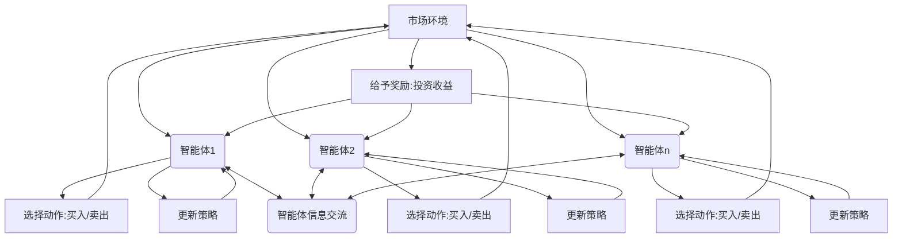

# 多智能体强化学习优化价值投资的买入和卖出时机

> 关键词：多智能体强化学习、价值投资、买入卖出时机、优化策略、金融市场

> 摘要：本文聚焦于多智能体强化学习在价值投资领域的应用，旨在探讨如何利用这一先进技术优化价值投资中的买入和卖出时机。首先介绍了相关背景知识，包括研究目的、预期读者等内容。接着阐述了多智能体强化学习与价值投资的核心概念及联系，详细讲解了核心算法原理和具体操作步骤，并通过数学模型和公式进行了理论支撑。然后通过项目实战展示了代码实现和解读，分析了实际应用场景。还推荐了相关的学习资源、开发工具框架以及论文著作。最后总结了未来发展趋势与挑战，解答了常见问题并提供了扩展阅读和参考资料，为投资者和研究者在该领域的深入探索提供全面的指导。

## 1. 背景介绍 
### 1.1 目的和范围
在价值投资中，准确把握买入和卖出时机是实现投资收益最大化的关键。传统的投资决策方法往往依赖于投资者的经验和主观判断，难以应对复杂多变的金融市场。多智能体强化学习作为一种新兴的人工智能技术，具有强大的学习和决策能力，能够在动态环境中不断优化策略。本研究的目的是探索如何利用多智能体强化学习技术，优化价值投资的买入和卖出时机，提高投资决策的科学性和准确性。

本研究的范围涵盖了多智能体强化学习的基本原理、价值投资的基本概念、多智能体强化学习在价值投资中的应用算法和策略，以及通过实际案例验证该方法的有效性。

### 1.2 预期读者
本文预期读者包括金融投资领域的从业者，如基金经理、股票分析师、投资顾问等，他们可以通过本文了解多智能体强化学习在价值投资中的应用，为实际投资决策提供新的思路和方法。同时，也适合人工智能和机器学习领域的研究者和开发者，他们可以从金融应用的角度深入理解多智能体强化学习的实际应用场景和挑战。此外，对价值投资和人工智能技术感兴趣的广大爱好者也可以从本文中获取相关知识和信息。

### 1.3 文档结构概述
本文将按照以下结构进行组织：首先介绍背景知识，包括研究目的、预期读者和文档结构概述等内容。接着阐述多智能体强化学习与价值投资的核心概念及联系，通过文本示意图和 Mermaid 流程图进行详细说明。然后讲解核心算法原理和具体操作步骤，使用 Python 源代码进行详细阐述。再通过数学模型和公式对相关理论进行支撑，并举例说明。之后通过项目实战展示代码实现和解读，分析实际应用场景。还将推荐相关的学习资源、开发工具框架以及论文著作。最后总结未来发展趋势与挑战，解答常见问题并提供扩展阅读和参考资料。

### 1.4 术语表
#### 1.4.1 核心术语定义
- **多智能体强化学习（Multi - Agent Reinforcement Learning，MARL）**：是一种机器学习方法，多个智能体在环境中通过与环境交互，根据环境反馈的奖励信号来学习最优策略，以实现各自或共同的目标。
- **价值投资（Value Investing）**：一种投资策略，投资者通过分析股票的内在价值，寻找被市场低估的股票进行投资，期望在股票价格回归其内在价值时获得收益。
- **买入时机（Buying Opportunity）**：在价值投资中，指投资者认为股票价格低于其内在价值，适合买入股票的时间点。
- **卖出时机（Selling Opportunity）**：指投资者认为股票价格高于其内在价值，或者达到了预期的收益目标，适合卖出股票的时间点。

#### 1.4.2 相关概念解释
- **智能体（Agent）**：在多智能体强化学习中，智能体是能够感知环境、做出决策并执行动作的实体。每个智能体都有自己的目标和策略。
- **环境（Environment）**：智能体所处的外部世界，智能体通过与环境交互获取状态信息和奖励信号。在价值投资中，环境可以是金融市场，包括股票价格、交易量等信息。
- **策略（Policy）**：智能体在不同状态下选择动作的规则。在多智能体强化学习中，策略的优化是通过不断与环境交互和学习来实现的。
- **奖励（Reward）**：环境对智能体动作的反馈信号，用于指导智能体学习最优策略。在价值投资中，奖励可以是投资收益等指标。

#### 1.4.3 缩略词列表
- **MARL**：Multi - Agent Reinforcement Learning（多智能体强化学习）
- **RL**：Reinforcement Learning（强化学习）

## 2. 核心概念与联系 
### 核心概念原理
#### 多智能体强化学习原理
多智能体强化学习是在传统强化学习的基础上发展而来的。传统强化学习中，单个智能体与环境交互，通过不断尝试不同的动作，根据环境给予的奖励信号来学习最优策略。而在多智能体强化学习中，存在多个智能体，它们之间可能存在合作、竞争或其他复杂的关系。

每个智能体都有自己的状态空间、动作空间和奖励函数。智能体通过感知环境状态，根据自己的策略选择动作，执行动作后环境会发生变化，并给予智能体相应的奖励。智能体的目标是最大化长期累积奖励。

在多智能体环境中，智能体的决策不仅受到环境状态的影响，还受到其他智能体动作的影响。因此，多智能体强化学习需要考虑智能体之间的交互和协调，以实现整体的最优目标。

#### 价值投资原理
价值投资的核心思想是寻找被市场低估的股票。投资者通过对公司的财务状况、行业前景、管理层能力等基本面因素进行分析，估算股票的内在价值。当股票价格低于其内在价值时，投资者认为该股票具有投资价值，选择买入；当股票价格高于其内在价值时，投资者可能选择卖出。

价值投资强调长期投资，注重公司的内在价值增长，而不是短期的市场波动。投资者相信，在长期内，股票价格会回归其内在价值，从而实现投资收益。

### 架构的文本示意图
多智能体强化学习优化价值投资的买入和卖出时机的架构可以描述如下：

多个智能体在金融市场环境中进行交互。每个智能体通过感知市场状态，包括股票价格、交易量、公司财务指标等信息，根据自己的策略选择买入或卖出动作。环境根据智能体的动作更新市场状态，并给予智能体相应的奖励，奖励可以是投资收益。智能体根据奖励信号更新自己的策略，不断学习和优化。多个智能体之间可以进行信息交流和协调，以实现整体的投资目标。

### Mermaid 流程图


## 3. 核心算法原理 & 具体操作步骤 
### 核心算法原理
多智能体强化学习有多种算法，这里以深度 Q 网络（Deep Q - Network，DQN）的扩展——多智能体深度 Q 网络（Multi - Agent Deep Q - Network，MADQN）为例进行讲解。

DQN 是一种将深度学习与强化学习相结合的算法，通过神经网络来近似 Q 函数。Q 函数表示在某个状态下采取某个动作的预期累积奖励。在 MADQN 中，每个智能体都有自己的 Q 网络，用于学习最优策略。

智能体的目标是最大化长期累积奖励，通过不断更新 Q 网络的参数来实现。具体来说，智能体在每个时间步根据当前状态选择动作，执行动作后环境会反馈新的状态和奖励。智能体将这些信息存储在经验回放缓冲区中，然后从缓冲区中随机采样一批数据，计算 Q 网络的损失函数，并使用梯度下降法更新网络参数。

### 具体操作步骤
1. **初始化**：
    - 初始化每个智能体的 Q 网络和目标 Q 网络的参数。
    - 初始化经验回放缓冲区。
    - 设定学习率、折扣因子等超参数。

2. **智能体与环境交互**：
    - 智能体感知当前市场状态。
    - 根据当前状态和 Q 网络选择动作（买入、卖出或持有）。
    - 执行动作，环境更新状态并反馈奖励。

3. **经验存储**：
    - 将当前状态、动作、奖励、下一个状态等信息存储到经验回放缓冲区中。

4. **经验回放**：
    - 从经验回放缓冲区中随机采样一批数据。
    - 计算目标 Q 值：
        - 对于每个样本，根据目标 Q 网络计算下一个状态的最大 Q 值。
        - 根据折扣因子和奖励计算目标 Q 值。
    - 计算 Q 网络的损失函数：
        - 计算当前 Q 网络输出的 Q 值与目标 Q 值之间的均方误差。
    - 使用梯度下降法更新 Q 网络的参数。

5. **目标 Q 网络更新**：
    - 定期将 Q 网络的参数复制到目标 Q 网络中。

6. **重复步骤 2 - 5**：
    - 不断重复上述步骤，直到达到训练终止条件（如达到最大训练步数）。

### Python 源代码详细阐述
```python
import numpy as np
import torch
import torch.nn as nn
import torch.optim as optim
import random
from collections import deque

# 定义 Q 网络
class QNetwork(nn.Module):
    def __init__(self, state_size, action_size):
        super(QNetwork, self).__init__()
        self.fc1 = nn.Linear(state_size, 64)
        self.fc2 = nn.Linear(64, 64)
        self.fc3 = nn.Linear(64, action_size)

    def forward(self, x):
        x = torch.relu(self.fc1(x))
        x = torch.relu(self.fc2(x))
        return self.fc3(x)

# 定义智能体类
class Agent:
    def __init__(self, state_size, action_size, lr=0.001, gamma=0.99, epsilon=1.0, epsilon_decay=0.995, epsilon_min=0.01, batch_size=64, memory_size=10000):
        self.state_size = state_size
        self.action_size = action_size
        self.lr = lr
        self.gamma = gamma
        self.epsilon = epsilon
        self.epsilon_decay = epsilon_decay
        self.epsilon_min = epsilon_min
        self.batch_size = batch_size
        self.memory = deque(maxlen=memory_size)

        self.q_network = QNetwork(state_size, action_size)
        self.target_network = QNetwork(state_size, action_size)
        self.target_network.load_state_dict(self.q_network.state_dict())
        self.optimizer = optim.Adam(self.q_network.parameters(), lr=lr)

    def remember(self, state, action, reward, next_state, done):
        self.memory.append((state, action, reward, next_state, done))

    def act(self, state):
        if np.random.rand() <= self.epsilon:
            return random.randrange(self.action_size)
        state = torch.FloatTensor(state).unsqueeze(0)
        q_values = self.q_network(state)
        action = torch.argmax(q_values).item()
        return action

    def replay(self):
        if len(self.memory) < self.batch_size:
            return
        minibatch = random.sample(self.memory, self.batch_size)
        states, actions, rewards, next_states, dones = zip(*minibatch)

        states = torch.FloatTensor(states)
        actions = torch.LongTensor(actions)
        rewards = torch.FloatTensor(rewards)
        next_states = torch.FloatTensor(next_states)
        dones = torch.FloatTensor(dones)

        q_values = self.q_network(states).gather(1, actions.unsqueeze(1)).squeeze(1)
        next_q_values = self.target_network(next_states).max(1)[0]
        target_q_values = rewards + (1 - dones) * self.gamma * next_q_values

        loss = nn.MSELoss()(q_values, target_q_values)
        self.optimizer.zero_grad()
        loss.backward()
        self.optimizer.step()

        if self.epsilon > self.epsilon_min:
            self.epsilon *= self.epsilon_decay

    def update_target_network(self):
        self.target_network.load_state_dict(self.q_network.state_dict())

# 示例使用
if __name__ == "__main__":
    state_size = 10  # 假设状态维度为 10
    action_size = 3  # 买入、卖出、持有
    num_agents = 2  # 假设有 2 个智能体

    agents = [Agent(state_size, action_size) for _ in range(num_agents)]

    # 模拟训练过程
    for episode in range(1000):
        state = np.random.rand(state_size)
        done = False
        while not done:
            for agent in agents:
                action = agent.act(state)
                # 模拟环境反馈
                next_state = np.random.rand(state_size)
                reward = np.random.rand()
                done = random.random() < 0.1
                agent.remember(state, action, reward, next_state, done)
                agent.replay()
            for agent in agents:
                agent.update_target_network()
            state = next_state
```

## 4. 数学模型和公式 & 详细讲解 & 举例说明 
### 数学模型和公式
#### Q 函数
在强化学习中，Q 函数 $Q(s, a)$ 表示在状态 $s$ 下采取动作 $a$ 的预期累积奖励。在多智能体强化学习中，每个智能体都有自己的 Q 函数。

$Q(s, a) = \mathbb{E}[R_{t+1} + \gamma R_{t+2} + \gamma^2 R_{t+3} + \cdots | S_t = s, A_t = a]$

其中，$R_t$ 表示在时间步 $t$ 获得的奖励，$\gamma$ 是折扣因子，用于权衡当前奖励和未来奖励的重要性。

#### 目标 Q 值计算
在 MADQN 中，目标 Q 值的计算如下：

$y_j = r_j + (1 - d_j) \gamma \max_{a'} Q_{\text{target}}(s_{j+1}, a')$

其中，$r_j$ 是第 $j$ 个样本的奖励，$d_j$ 是第 $j$ 个样本的终止标志（$d_j = 1$ 表示终止，$d_j = 0$ 表示未终止），$s_{j+1}$ 是第 $j$ 个样本的下一个状态，$Q_{\text{target}}$ 是目标 Q 网络。

#### 损失函数
Q 网络的损失函数通常使用均方误差（Mean Squared Error，MSE）：

$L(\theta) = \frac{1}{N} \sum_{j=1}^{N} (Q(s_j, a_j; \theta) - y_j)^2$

其中，$N$ 是样本数量，$\theta$ 是 Q 网络的参数。

### 详细讲解
Q 函数的定义是基于长期累积奖励的期望。智能体的目标是最大化 Q 函数的值，即选择能够获得最大预期累积奖励的动作。

目标 Q 值的计算是为了稳定训练过程。通过使用目标 Q 网络计算下一个状态的最大 Q 值，可以减少训练过程中的波动。

损失函数的作用是衡量当前 Q 网络输出的 Q 值与目标 Q 值之间的误差。通过最小化损失函数，可以更新 Q 网络的参数，使 Q 网络的输出更接近目标 Q 值。

### 举例说明
假设一个简单的投资场景，状态 $s$ 表示股票的价格和交易量，动作 $a$ 有买入、卖出和持有三种选择。奖励 $R$ 是投资收益。

设当前状态 $s_1$，智能体选择动作 $a_1$（买入），执行动作后环境反馈奖励 $r_1 = 10$，下一个状态 $s_2$。假设折扣因子 $\gamma = 0.9$，目标 Q 网络计算 $s_2$ 状态下的最大 Q 值为 $Q_{\text{target}}(s_2, a') = 20$。

则目标 Q 值 $y_1 = r_1 + \gamma \max_{a'} Q_{\text{target}}(s_2, a') = 10 + 0.9 \times 20 = 28$。

假设当前 Q 网络输出的 Q 值 $Q(s_1, a_1; \theta) = 25$，则损失 $L = (25 - 28)^2 = 9$。通过梯度下降法更新 Q 网络的参数，使损失逐渐减小。

## 5. 项目实战：代码实际案例和详细解释说明 
### 5.1  开发环境搭建
#### 操作系统
可以选择 Linux（如 Ubuntu）、Windows 或 macOS 作为开发操作系统。

#### 编程语言和版本
使用 Python 3.7 及以上版本。

#### 依赖库安装
- **PyTorch**：用于深度学习模型的构建和训练。可以使用以下命令安装：
```sh
pip install torch torchvision
```
- **NumPy**：用于数值计算。安装命令：
```sh
pip install numpy
```
- **Matplotlib**：用于数据可视化。安装命令：
```sh
pip install matplotlib
```

### 5.2  源代码详细实现和代码解读
```python
import numpy as np
import torch
import torch.nn as nn
import torch.optim as optim
import random
from collections import deque
import matplotlib.pyplot as plt

# 定义 Q 网络
class QNetwork(nn.Module):
    def __init__(self, state_size, action_size):
        super(QNetwork, self).__init__()
        self.fc1 = nn.Linear(state_size, 64)
        self.fc2 = nn.Linear(64, 64)
        self.fc3 = nn.Linear(64, action_size)

    def forward(self, x):
        x = torch.relu(self.fc1(x))
        x = torch.relu(self.fc2(x))
        return self.fc3(x)

# 定义智能体类
class Agent:
    def __init__(self, state_size, action_size, lr=0.001, gamma=0.99, epsilon=1.0, epsilon_decay=0.995, epsilon_min=0.01, batch_size=64, memory_size=10000):
        self.state_size = state_size
        self.action_size = action_size
        self.lr = lr
        self.gamma = gamma
        self.epsilon = epsilon
        self.epsilon_decay = epsilon_decay
        self.epsilon_min = epsilon_min
        self.batch_size = batch_size
        self.memory = deque(maxlen=memory_size)

        self.q_network = QNetwork(state_size, action_size)
        self.target_network = QNetwork(state_size, action_size)
        self.target_network.load_state_dict(self.q_network.state_dict())
        self.optimizer = optim.Adam(self.q_network.parameters(), lr=lr)

    def remember(self, state, action, reward, next_state, done):
        self.memory.append((state, action, reward, next_state, done))

    def act(self, state):
        if np.random.rand() <= self.epsilon:
            return random.randrange(self.action_size)
        state = torch.FloatTensor(state).unsqueeze(0)
        q_values = self.q_network(state)
        action = torch.argmax(q_values).item()
        return action

    def replay(self):
        if len(self.memory) < self.batch_size:
            return
        minibatch = random.sample(self.memory, self.batch_size)
        states, actions, rewards, next_states, dones = zip(*minibatch)

        states = torch.FloatTensor(states)
        actions = torch.LongTensor(actions)
        rewards = torch.FloatTensor(rewards)
        next_states = torch.FloatTensor(next_states)
        dones = torch.FloatTensor(dones)

        q_values = self.q_network(states).gather(1, actions.unsqueeze(1)).squeeze(1)
        next_q_values = self.target_network(next_states).max(1)[0]
        target_q_values = rewards + (1 - dones) * self.gamma * next_q_values

        loss = nn.MSELoss()(q_values, target_q_values)
        self.optimizer.zero_grad()
        loss.backward()
        self.optimizer.step()

        if self.epsilon > self.epsilon_min:
            self.epsilon *= self.epsilon_decay

    def update_target_network(self):
        self.target_network.load_state_dict(self.q_network.state_dict())

# 模拟金融市场环境
class MarketEnv:
    def __init__(self):
        self.stock_price = 100
        self.time_step = 0
        self.max_time_steps = 100

    def reset(self):
        self.stock_price = 100
        self.time_step = 0
        state = [self.stock_price]
        return np.array(state)

    def step(self, action):
        # 模拟股票价格变化
        self.stock_price += random.uniform(-5, 5)
        self.time_step += 1

        # 计算奖励
        if action == 0:  # 买入
            reward = -self.stock_price
        elif action == 1:  # 卖出
            reward = self.stock_price
        else:  # 持有
            reward = 0

        done = self.time_step >= self.max_time_steps
        next_state = [self.stock_price]
        return np.array(next_state), reward, done

# 训练函数
def train(agents, env, num_episodes=1000):
    total_rewards = []
    for episode in range(num_episodes):
        state = env.reset()
        total_reward = 0
        done = False
        while not done:
            for agent in agents:
                action = agent.act(state)
                next_state, reward, done = env.step(action)
                agent.remember(state, action, reward, next_state, done)
                agent.replay()
                total_reward += reward
            for agent in agents:
                agent.update_target_network()
            state = next_state
        total_rewards.append(total_reward)
        if episode % 100 == 0:
            print(f"Episode {episode}: Total Reward = {total_reward}")
    return total_rewards

# 主函数
if __name__ == "__main__":
    state_size = 1  # 状态维度为 1（股票价格）
    action_size = 3  # 买入、卖出、持有
    num_agents = 2  # 假设有 2 个智能体

    agents = [Agent(state_size, action_size) for _ in range(num_agents)]
    env = MarketEnv()

    total_rewards = train(agents, env)

    # 绘制奖励曲线
    plt.plot(total_rewards)
    plt.xlabel('Episode')
    plt.ylabel('Total Reward')
    plt.title('Training Rewards')
    plt.show()
```

### 5.3  代码解读与分析
#### 代码结构
- **QNetwork 类**：定义了 Q 网络的结构，使用三层全连接神经网络。
- **Agent 类**：实现了智能体的核心功能，包括经验存储、动作选择、经验回放和目标 Q 网络更新。
- **MarketEnv 类**：模拟了金融市场环境，包括股票价格的变化和奖励的计算。
- **train 函数**：实现了训练过程，智能体与环境交互，不断更新策略。
- **主函数**：初始化智能体和环境，调用训练函数进行训练，并绘制奖励曲线。

#### 代码分析
- **智能体的动作选择**：智能体在训练初期使用较大的探索率（$\epsilon$），随机选择动作，以探索环境。随着训练的进行，探索率逐渐减小，智能体更多地根据 Q 网络的输出选择动作。
- **经验回放**：智能体将经验存储在经验回放缓冲区中，然后随机采样一批数据进行训练。这样可以减少数据之间的相关性，提高训练的稳定性。
- **目标 Q 网络更新**：定期将 Q 网络的参数复制到目标 Q 网络中，以稳定训练过程。

#### 训练结果分析
通过绘制奖励曲线，可以观察到智能体的训练效果。随着训练的进行，总奖励应该逐渐增加，说明智能体的策略在不断优化。

## 6. 实际应用场景 
### 股票投资
在股票投资中，多智能体强化学习可以用于优化买入和卖出时机。多个智能体可以分别从不同的角度分析股票的基本面和技术面信息，如财务指标、行业前景、股价走势等。智能体通过与市场环境交互，不断学习和优化策略，以寻找最佳的买入和卖出时机。例如，一个智能体可以专注于公司的财务状况，另一个智能体可以关注市场情绪，它们通过信息交流和协调，共同做出投资决策。

### 基金投资
对于基金投资，多智能体强化学习可以帮助投资者选择合适的基金和调整投资组合。智能体可以分析基金的历史业绩、风险指标、基金经理的能力等信息，根据市场环境的变化动态调整投资组合。例如，当市场行情较好时，智能体可以增加股票型基金的投资比例；当市场行情不稳定时，智能体可以增加债券型基金的投资比例。

### 期货投资
在期货投资中，多智能体强化学习可以用于预测期货价格的走势，优化开仓和平仓时机。智能体可以考虑多种因素，如供求关系、宏观经济数据、政策变化等，通过与期货市场环境交互，学习最优的投资策略。例如，当智能体预测到期货价格将上涨时，选择开仓买入；当预测到价格将下跌时，选择平仓卖出。

### 外汇投资
外汇投资中，多智能体强化学习可以帮助投资者把握汇率波动的时机，进行外汇买卖操作。智能体可以分析各国的经济数据、货币政策、地缘政治等因素，根据市场环境的变化做出投资决策。例如，当智能体预测到某国货币将升值时，选择买入该货币；当预测到货币将贬值时，选择卖出该货币。

## 7. 工具和资源推荐
### 7.1 学习资源推荐
#### 7.1.1 书籍推荐
- 《强化学习：原理与Python实现》：这本书系统地介绍了强化学习的基本原理和算法，并通过Python代码实现了多个案例，适合初学者入门。
- 《多智能体系统：算法、博弈论及应用》：详细讲解了多智能体系统的理论和算法，包括多智能体强化学习的相关内容，对于深入理解多智能体强化学习有很大帮助。
- 《价值投资：从格雷厄姆到巴菲特》：全面介绍了价值投资的理论和实践，是价值投资领域的经典著作。

#### 7.1.2 在线课程
- Coursera 上的“Reinforcement Learning Specialization”：由知名学者授课，系统地介绍了强化学习的理论和应用，包括多智能体强化学习的相关内容。
- edX 上的“Artificial Intelligence for Trading”：结合金融市场的实际应用，介绍了人工智能在交易中的应用，包括强化学习优化投资策略的内容。

#### 7.1.3 技术博客和网站
- OpenAI Blog：OpenAI 发布的关于人工智能和强化学习的最新研究成果和技术文章。
- Medium 上的“Towards Data Science”：有很多关于机器学习和强化学习的优质文章，包括多智能体强化学习的实践案例和技术分析。

### 7.2 开发工具框架推荐
#### 7.2.1 IDE和编辑器
- PyCharm：一款功能强大的 Python 集成开发环境，提供了代码编辑、调试、版本控制等功能，适合开发多智能体强化学习项目。
- Jupyter Notebook：一种交互式的开发环境，适合进行数据探索、模型训练和可视化，方便快速验证算法和展示结果。

#### 7.2.2 调试和性能分析工具
- TensorBoard：用于可视化深度学习模型的训练过程和性能指标，帮助开发者监控模型的训练状态和优化模型。
- cProfile：Python 内置的性能分析工具，可以分析代码的运行时间和函数调用关系，帮助开发者找出性能瓶颈。

#### 7.2.3 相关框架和库
- PyTorch：一个开源的深度学习框架，提供了丰富的神经网络模块和优化算法，方便开发者实现多智能体强化学习算法。
- Stable Baselines3：一个基于 PyTorch 的强化学习库，提供了多种预实现的强化学习算法和工具，简化了强化学习的开发过程。

### 7.3 相关论文著作推荐
#### 7.3.1 经典论文
- “Playing Atari with Deep Reinforcement Learning”：介绍了深度 Q 网络（DQN）算法，是强化学习领域的经典论文，为多智能体强化学习的发展奠定了基础。
- “Multi-Agent Actor-Critic for Mixed Cooperative-Competitive Environments”：提出了多智能体演员 - 评论家（Multi - Agent Actor - Critic，MAAC）算法，用于解决多智能体环境中的合作和竞争问题。

#### 7.3.2 最新研究成果
- 关注顶级学术会议如 NeurIPS（神经信息处理系统大会）、ICML（国际机器学习会议）等，这些会议上会有关于多智能体强化学习的最新研究成果。

#### 7.3.3 应用案例分析
- 可以在 IEEE Transactions on Neural Networks and Learning Systems、Journal of Financial Economics 等期刊上查找多智能体强化学习在金融投资领域的应用案例分析，了解实际应用中的问题和解决方案。

## 8. 总结：未来发展趋势与挑战
### 未来发展趋势
#### 与其他技术的融合
多智能体强化学习将与其他人工智能技术，如深度学习、自然语言处理等深度融合。例如，结合自然语言处理技术，智能体可以分析新闻、社交媒体等文本信息，获取更多的市场情报，从而更好地优化投资决策。

#### 应用领域的拓展
除了金融投资领域，多智能体强化学习还将在物流、交通、能源等领域得到广泛应用。在物流领域，多个智能体可以协同优化货物的运输路径和配送计划；在交通领域，智能体可以控制自动驾驶车辆的行驶策略，提高交通效率。

#### 理论和算法的创新
随着研究的深入，多智能体强化学习的理论和算法将不断创新。例如，开发更高效的学习算法，提高智能体的学习速度和性能；研究智能体之间的协作机制，实现更复杂的多智能体任务。

### 挑战
#### 智能体之间的协调问题
在多智能体环境中，智能体之间的协调是一个关键问题。由于智能体之间可能存在利益冲突和信息不对称，如何实现智能体之间的有效协作，是一个具有挑战性的问题。

#### 环境的不确定性
金融市场等实际环境具有高度的不确定性，智能体需要在不确定的环境中做出决策。如何提高智能体在不确定环境中的适应性和鲁棒性，是多智能体强化学习面临的一个重要挑战。

#### 数据隐私和安全问题
在多智能体强化学习中，智能体需要处理大量的敏感数据，如金融交易数据、用户信息等。如何保护数据的隐私和安全，防止数据泄露和恶意攻击，是一个亟待解决的问题。

## 9. 附录：常见问题与解答
### 问题 1：多智能体强化学习与单智能体强化学习有什么区别？
多智能体强化学习中存在多个智能体，智能体之间可能存在合作、竞争或其他复杂的关系。智能体的决策不仅受到环境状态的影响，还受到其他智能体动作的影响。而单智能体强化学习中只有一个智能体，智能体只需要考虑环境状态来做出决策。

### 问题 2：如何选择多智能体强化学习的算法？
选择多智能体强化学习的算法需要考虑多个因素，如智能体之间的关系（合作、竞争）、环境的复杂度、数据的规模等。如果智能体之间是合作关系，可以选择基于团队奖励的算法，如 MAAC；如果智能体之间是竞争关系，可以选择基于对抗的算法。同时，还需要根据实际情况进行实验和比较，选择最适合的算法。

### 问题 3：多智能体强化学习在价值投资中的应用效果如何？
多智能体强化学习在价值投资中的应用效果受到多种因素的影响，如算法的选择、数据的质量、市场环境的变化等。在一些实验和实际应用中，多智能体强化学习可以提高投资决策的科学性和准确性，获得更好的投资收益。但需要注意的是，金融市场具有高度的不确定性，不能保证一定能获得理想的投资效果。

### 问题 4：如何评估多智能体强化学习模型的性能？
可以使用多种指标来评估多智能体强化学习模型的性能，如累计奖励、胜率、夏普比率等。累计奖励反映了智能体在整个训练过程中获得的总奖励；胜率表示智能体在投资决策中做出正确决策的比例；夏普比率衡量了投资的风险调整后收益。同时，还可以通过可视化和实际应用效果来综合评估模型的性能。

## 10. 扩展阅读 & 参考资料
### 扩展阅读
- 《人工智能：现代方法》：全面介绍了人工智能的基本概念、算法和应用，对于深入理解多智能体强化学习的背景和相关技术有很大帮助。
- 《金融市场学》：系统地介绍了金融市场的基本原理和运行机制，有助于更好地理解多智能体强化学习在金融投资中的应用场景。

### 参考资料
- Sutton, R. S., & Barto, A. G. (2018). Reinforcement Learning: An Introduction. MIT press.
- Lowe, R., Wu, Y., Tamar, A., Harb, J., Abbeel, P., & Mordatch, I. (2017). Multi-Agent Actor-Critic for Mixed Cooperative-Competitive Environments. arXiv preprint arXiv:1706.02275.
- Graham, B., & Dodd, D. (1934). Security Analysis. McGraw-Hill.