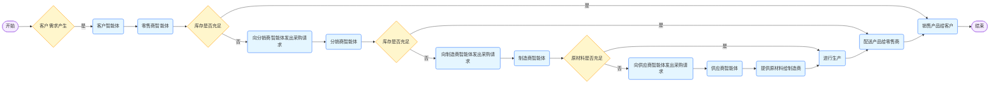

# 多智能体系统分析供应链网络

> 关键词：多智能体系统、供应链网络、系统分析、智能决策、协同优化

> 摘要：本文聚焦于运用多智能体系统对供应链网络进行深入分析。首先介绍了多智能体系统和供应链网络的背景知识，明确研究目的与范围。接着阐述核心概念及联系，详细讲解多智能体系统在供应链网络中的架构原理，并通过 Mermaid 流程图直观呈现。深入剖析核心算法原理，结合 Python 代码展示具体操作步骤。利用数学模型和公式对相关原理进行量化解释，并举例说明。通过项目实战，搭建开发环境，给出源代码实现及详细解读。探讨了多智能体系统分析供应链网络在实际中的应用场景，推荐了学习资源、开发工具框架以及相关论文著作。最后总结未来发展趋势与挑战，解答常见问题，并提供扩展阅读和参考资料，为相关领域的研究和实践提供全面而深入的指导。

## 1. 背景介绍 
### 1.1 目的和范围
在当今全球化的经济环境下，供应链网络变得愈发复杂，涉及众多的参与者和环节，如供应商、制造商、分销商、零售商以及最终客户等。传统的供应链分析方法往往难以处理这种复杂的动态系统，无法实时应对各种不确定性和变化。多智能体系统（Multi - Agent System，MAS）作为一种分布式人工智能技术，能够模拟供应链网络中各个参与者的自主行为和交互，为供应链的分析和优化提供了新的视角和方法。

本文章的目的是深入探讨如何利用多智能体系统对供应链网络进行分析，包括供应链的结构、运作流程、决策机制等方面。通过建立多智能体模型，研究供应链中各个智能体之间的协作、竞争关系，以及它们对整个供应链性能的影响。范围涵盖了多智能体系统的基本原理、相关算法、数学模型，以及在实际供应链网络中的应用案例和开发实践。

### 1.2 预期读者
本文预期读者主要包括以下几类人群：
- **学术研究人员**：对人工智能、供应链管理等领域感兴趣的学者和研究生，希望通过本文了解多智能体系统在供应链网络分析中的最新研究成果和方法。
- **企业管理人员**：负责供应链管理的企业高管、经理等，期望借助多智能体系统优化供应链的运作效率、降低成本、提高服务质量。
- **软件开发人员**：从事人工智能、供应链管理系统开发的程序员和软件工程师，通过学习本文掌握多智能体系统的开发技术和应用实践。

### 1.3 文档结构概述
本文将按照以下结构进行组织：
- 核心概念与联系：介绍多智能体系统和供应链网络的核心概念，以及它们之间的联系，通过文本示意图和 Mermaid 流程图进行直观展示。
- 核心算法原理 & 具体操作步骤：详细讲解多智能体系统在供应链网络分析中常用的算法原理，并给出 Python 源代码实现。
- 数学模型和公式 & 详细讲解 & 举例说明：运用数学模型和公式对多智能体系统分析供应链网络的原理进行量化解释，并通过具体例子进行说明。
- 项目实战：代码实际案例和详细解释说明：搭建开发环境，给出多智能体系统分析供应链网络的源代码实现，并对代码进行详细解读。
- 实际应用场景：探讨多智能体系统在供应链网络中的实际应用场景，如库存管理、生产调度、物流配送等。
- 工具和资源推荐：推荐学习多智能体系统和供应链网络分析的相关资源，包括书籍、在线课程、技术博客、开发工具框架和论文著作等。
- 总结：未来发展趋势与挑战：总结多智能体系统分析供应链网络的发展趋势和面临的挑战。
- 附录：常见问题与解答：解答读者在学习和应用过程中常见的问题。
- 扩展阅读 & 参考资料：提供扩展阅读的建议和参考资料列表。

### 1.4 术语表
#### 1.4.1 核心术语定义
- **多智能体系统（Multi - Agent System，MAS）**：由多个自主的智能体组成的系统，这些智能体能够感知环境、进行决策并采取行动，通过相互协作和交互来实现共同的目标。
- **智能体（Agent）**：具有自主性、反应性、社会性和主动性的实体，能够独立地感知环境、进行推理和决策，并与其他智能体进行交互。
- **供应链网络（Supply Chain Network）**：由供应商、制造商、分销商、零售商和最终客户等多个实体组成的网络，通过物流、信息流和资金流的传递，实现产品或服务从原材料采购到最终消费的全过程。
- **供应链协同（Supply Chain Collaboration）**：供应链中各个参与者之间通过信息共享、合作计划和协调行动，实现供应链整体效益最大化的过程。

#### 1.4.2 相关概念解释
- **自主性**：智能体能够在没有外部干预的情况下，独立地感知环境、进行决策和采取行动。
- **反应性**：智能体能够对环境的变化做出及时的反应，调整自己的行为。
- **社会性**：智能体能够与其他智能体进行交互和协作，共同完成任务。
- **主动性**：智能体能够主动地发起行动，追求自己的目标。

#### 1.4.3 缩略词列表
- **MAS**：Multi - Agent System（多智能体系统）
- **ERP**：Enterprise Resource Planning（企业资源计划）
- **MRP**：Material Requirements Planning（物料需求计划）

## 2. 核心概念与联系 

### 2.1 多智能体系统核心概念
多智能体系统是一种分布式人工智能技术，它将复杂的系统分解为多个自主的智能体。每个智能体都具有一定的知识和能力，能够感知环境中的信息，并根据自身的目标和规则进行决策和行动。智能体之间通过通信机制进行交互，共同完成系统的整体任务。

智能体的基本结构通常包括感知模块、决策模块和行动模块。感知模块用于获取环境中的信息，决策模块根据感知到的信息和自身的知识进行推理和决策，行动模块则根据决策结果采取相应的行动。

### 2.2 供应链网络核心概念
供应链网络是一个复杂的系统，它涉及到多个环节和参与者。从原材料的采购、生产制造、产品分销到最终销售给客户，每个环节都相互关联、相互影响。供应链网络的主要目标是实现产品或服务的高效流动，满足客户的需求，同时降低成本、提高效益。

供应链网络中的参与者包括供应商、制造商、分销商、零售商和最终客户等。他们之间通过物流、信息流和资金流进行连接，形成一个有机的整体。

### 2.3 多智能体系统与供应链网络的联系
多智能体系统可以很好地模拟供应链网络中各个参与者的行为和交互。在供应链网络中，每个参与者都可以看作是一个智能体，具有自主决策和行动的能力。例如，供应商智能体可以根据市场需求和自身的生产能力决定是否提供原材料；制造商智能体可以根据订单情况和原材料供应决定生产计划；分销商智能体可以根据库存和市场需求决定产品的配送策略等。

通过多智能体系统，可以对供应链网络进行建模和仿真，研究各个智能体之间的协作和竞争关系，分析供应链的性能和稳定性，为供应链的优化和决策提供支持。

### 2.4 文本示意图
以下是多智能体系统分析供应链网络的文本示意图：

多智能体系统由多个智能体组成，包括供应商智能体、制造商智能体、分销商智能体、零售商智能体和客户智能体。每个智能体都有自己的感知模块、决策模块和行动模块。

- 供应商智能体：感知原材料需求信息，根据自身生产能力和成本等因素进行决策，决定是否提供原材料以及提供的数量和价格。
- 制造商智能体：感知订单信息和原材料供应信息，根据生产能力和成本等因素进行决策，制定生产计划。
- 分销商智能体：感知库存信息和市场需求信息，根据配送成本和服务水平等因素进行决策，制定配送策略。
- 零售商智能体：感知客户需求信息和库存信息，根据销售策略和利润目标等因素进行决策，决定采购数量和销售价格。
- 客户智能体：感知产品信息和价格信息，根据自身需求和偏好进行决策，决定是否购买产品。

各个智能体之间通过通信机制进行信息交互，共同实现供应链网络的运作。

### 2.5 Mermaid 流程图


该流程图展示了多智能体系统在供应链网络中的基本运作流程。当客户需求产生时，客户智能体向零售商智能体发起请求。零售商智能体检查库存，如果库存充足则直接销售产品给客户；如果库存不足，则向分销商智能体发出采购请求。分销商智能体同样检查库存，根据情况决定是否向制造商智能体采购。制造商智能体在生产前需要检查原材料是否充足，若不足则向供应商智能体采购。整个过程中各个智能体通过交互协作，实现了供应链网络的正常运作。

## 3. 核心算法原理 & 具体操作步骤 

### 3.1 核心算法原理
在多智能体系统分析供应链网络中，常用的算法包括强化学习算法、博弈论算法等。这里以强化学习算法为例进行详细讲解。

强化学习是一种通过智能体与环境进行交互，不断尝试不同的行动并根据环境反馈的奖励信号来学习最优策略的机器学习方法。在供应链网络中，每个智能体可以看作是一个强化学习智能体，通过与其他智能体和环境进行交互，学习如何做出最优决策以最大化自身的利益。

强化学习的基本要素包括智能体、环境、状态、行动和奖励。智能体在每个时间步根据当前的状态选择一个行动，并执行该行动。环境根据智能体的行动转移到下一个状态，并给予智能体一个奖励信号。智能体的目标是通过不断地学习，找到一个最优的策略，使得长期累积奖励最大化。

常用的强化学习算法有 Q - learning 算法和深度 Q 网络（Deep Q - Network，DQN）算法等。这里以 Q - learning 算法为例进行介绍。

Q - learning 算法的核心是 Q 函数，它表示在某个状态下采取某个行动的预期累积奖励。Q 函数的更新公式如下：

$Q(s_t, a_t) \leftarrow Q(s_t, a_t) + \alpha [r_{t+1} + \gamma \max_{a} Q(s_{t+1}, a) - Q(s_t, a_t)]$

其中，$s_t$ 表示当前状态，$a_t$ 表示当前行动，$r_{t+1}$ 表示下一个时间步的奖励，$s_{t+1}$ 表示下一个状态，$\alpha$ 是学习率，$\gamma$ 是折扣因子。

### 3.2 具体操作步骤
以下是使用 Q - learning 算法实现多智能体系统分析供应链网络的具体操作步骤：

#### 步骤 1：定义状态、行动和奖励
- **状态**：每个智能体的状态可以包括库存水平、订单数量、市场需求等信息。例如，零售商智能体的状态可以表示为 $(s_{inventory}, s_{orders}, s_{demand})$，其中 $s_{inventory}$ 表示库存水平，$s_{orders}$ 表示未完成的订单数量，$s_{demand}$ 表示市场需求。
- **行动**：每个智能体的行动可以包括采购、生产、销售、配送等。例如，零售商智能体的行动可以表示为 $(a_{purchase}, a_{sell})$，其中 $a_{purchase}$ 表示采购数量，$a_{sell}$ 表示销售数量。
- **奖励**：奖励可以根据智能体的目标来定义。例如，零售商智能体的奖励可以定义为销售收入减去采购成本和库存成本。

#### 步骤 2：初始化 Q 表
Q 表是一个二维数组，用于存储每个状态 - 行动对的 Q 值。初始化时，Q 表中的所有值都可以设置为 0。

#### 步骤 3：智能体与环境进行交互
在每个时间步，智能体根据当前的状态从 Q 表中选择一个行动，并执行该行动。环境根据智能体的行动转移到下一个状态，并给予智能体一个奖励信号。

#### 步骤 4：更新 Q 表
根据 Q - learning 算法的更新公式，更新当前状态 - 行动对的 Q 值。

#### 步骤 5：重复步骤 3 和步骤 4
不断重复步骤 3 和步骤 4，直到智能体收敛到一个最优策略。

### 3.3 Python 源代码实现
```python
import numpy as np

# 定义状态和行动的数量
num_states = 10
num_actions = 5

# 初始化 Q 表
Q = np.zeros((num_states, num_actions))

# 定义学习率和折扣因子
alpha = 0.1
gamma = 0.9

# 定义智能体与环境交互的函数
def interact(state):
    # 根据 Q 表选择行动
    action = np.argmax(Q[state, :])
    # 模拟环境转移到下一个状态并返回奖励
    next_state = np.random.randint(0, num_states)
    reward = np.random.randint(0, 10)
    return next_state, reward

# 训练智能体
num_episodes = 1000
for episode in range(num_episodes):
    # 初始化状态
    state = np.random.randint(0, num_states)
    for step in range(100):
        # 智能体与环境进行交互
        next_state, reward = interact(state)
        # 更新 Q 表
        Q[state, np.argmax(Q[state, :])] = Q[state, np.argmax(Q[state, :])] + alpha * (
            reward + gamma * np.max(Q[next_state, :]) - Q[state, np.argmax(Q[state, :])])
        state = next_state

# 输出最终的 Q 表
print("Final Q table:")
print(Q)
```

### 3.4 代码解释
- **状态和行动数量定义**：`num_states` 和 `num_actions` 分别定义了状态和行动的数量。
- **Q 表初始化**：使用 `np.zeros` 函数初始化 Q 表，将所有元素初始化为 0。
- **学习率和折扣因子定义**：`alpha` 是学习率，`gamma` 是折扣因子。
- **交互函数定义**：`interact` 函数模拟智能体与环境的交互过程，根据当前状态选择行动，并返回下一个状态和奖励。
- **训练过程**：通过循环多次进行智能体与环境的交互，并根据 Q - learning 算法更新 Q 表。
- **输出结果**：最后输出最终的 Q 表。

## 4. 数学模型和公式 & 详细讲解 & 举例说明 

### 4.1 数学模型
在多智能体系统分析供应链网络中，可以使用多种数学模型来描述系统的行为和性能。这里以库存管理为例，介绍一种基于马尔可夫决策过程（Markov Decision Process，MDP）的数学模型。

马尔可夫决策过程是一个五元组 $(S, A, P, R, \gamma)$，其中：
- $S$ 是状态集合，表示系统的所有可能状态。在库存管理中，状态可以表示为库存水平。
- $A$ 是行动集合，表示智能体可以采取的所有行动。在库存管理中，行动可以表示为采购数量。
- $P$ 是状态转移概率矩阵，表示在某个状态下采取某个行动后转移到下一个状态的概率。
- $R$ 是奖励函数，表示在某个状态下采取某个行动后获得的奖励。
- $\gamma$ 是折扣因子，用于衡量未来奖励的重要性。

### 4.2 数学公式
在马尔可夫决策过程中，智能体的目标是找到一个最优策略 $\pi^*$，使得长期累积奖励最大化。最优策略可以通过求解贝尔曼方程得到。

贝尔曼方程的一般形式如下：

$V^*(s) = \max_{a \in A} \left[ R(s, a) + \gamma \sum_{s' \in S} P(s' | s, a) V^*(s') \right]$

其中，$V^*(s)$ 表示状态 $s$ 的最优值函数，$R(s, a)$ 表示在状态 $s$ 下采取行动 $a$ 的奖励，$P(s' | s, a)$ 表示在状态 $s$ 下采取行动 $a$ 后转移到状态 $s'$ 的概率。

另一种形式的贝尔曼方程是 Q - 贝尔曼方程：

$Q^*(s, a) = R(s, a) + \gamma \sum_{s' \in S} P(s' | s, a) \max_{a' \in A} Q^*(s', a')$

其中，$Q^*(s, a)$ 表示状态 - 行动对 $(s, a)$ 的最优 Q 值。

### 4.3 详细讲解
- **状态转移概率矩阵 $P$**：在库存管理中，状态转移概率矩阵 $P$ 可以根据库存的变化规律和采购策略来确定。例如，如果当前库存水平为 $s$，采取采购行动 $a$，则下一个状态 $s'$ 的概率可以根据需求的分布来计算。
- **奖励函数 $R$**：奖励函数 $R$ 可以根据智能体的目标来定义。在库存管理中，奖励可以表示为销售收入减去采购成本和库存成本。例如，如果销售价格为 $p$，采购成本为 $c$，库存成本为 $h$，则奖励函数可以表示为：

$R(s, a) = p \min(s + a, d) - c a - h (s + a - \min(s + a, d))$

其中，$d$ 表示市场需求。

- **折扣因子 $\gamma$**：折扣因子 $\gamma$ 用于衡量未来奖励的重要性。$\gamma$ 的取值范围是 $[0, 1]$，$\gamma$ 越接近 1，表示未来奖励越重要；$\gamma$ 越接近 0，表示当前奖励越重要。

### 4.4 举例说明
假设一个简单的库存管理问题，库存水平的状态集合 $S = \{0, 1, 2\}$，行动集合 $A = \{0, 1\}$，即可以选择不采购或采购 1 个单位的商品。市场需求 $d$ 服从均匀分布，取值范围为 $[0, 1]$。销售价格 $p = 10$，采购成本 $c = 5$，库存成本 $h = 1$，折扣因子 $\gamma = 0.9$。

#### 步骤 1：确定状态转移概率矩阵 $P$
- 当 $a = 0$ 时：
  - $P(0 | 0, 0) = 1$，$P(1 | 0, 0) = 0$，$P(2 | 0, 0) = 0$
  - $P(0 | 1, 0) = 0.5$，$P(1 | 1, 0) = 0.5$，$P(2 | 1, 0) = 0$
  - $P(0 | 2, 0) = 0.25$，$P(1 | 2, 0) = 0.5$，$P(2 | 2, 0) = 0.25$
- 当 $a = 1$ 时：
  - $P(0 | 0, 1) = 0$，$P(1 | 0, 1) = 0.5$，$P(2 | 0, 1) = 0.5$
  - $P(0 | 1, 1) = 0$，$P(1 | 1, 1) = 0.25$，$P(2 | 1, 1) = 0.75$
  - $P(0 | 2, 1) = 0$，$P(1 | 2, 1) = 0$，$P(2 | 2, 1) = 1$

#### 步骤 2：确定奖励函数 $R$
- 当 $a = 0$ 时：
  - $R(0, 0) = 0$
  - $R(1, 0) = 10 \min(1, d) - 0 - 1 (1 - \min(1, d))$
  - $R(2, 0) = 10 \min(2, d) - 0 - 1 (2 - \min(2, d))$
- 当 $a = 1$ 时：
  - $R(0, 1) = 10 \min(1, d) - 5 - 1 (1 - \min(1, d))$
  - $R(1, 1) = 10 \min(2, d) - 5 - 1 (2 - \min(2, d))$
  - $R(2, 1) = 10 \min(3, d) - 5 - 1 (3 - \min(3, d))$

#### 步骤 3：求解贝尔曼方程
可以使用迭代法求解贝尔曼方程，直到收敛。具体步骤如下：
1. 初始化 $V(s) = 0$ 对于所有 $s \in S$。
2. 重复以下步骤直到收敛：
   - 对于每个状态 $s \in S$，计算：
     - $V'(s) = \max_{a \in A} \left[ R(s, a) + \gamma \sum_{s' \in S} P(s' | s, a) V(s') \right]$
   - 更新 $V(s) = V'(s)$。

通过求解贝尔曼方程，可以得到最优值函数 $V^*(s)$ 和最优策略 $\pi^*(s)$。

## 5. 项目实战：代码实际案例和详细解释说明 

### 5.1  开发环境搭建
#### 5.1.1 安装 Python
首先需要安装 Python 环境，建议使用 Python 3.7 及以上版本。可以从 Python 官方网站（https://www.python.org/downloads/）下载适合自己操作系统的安装包，按照安装向导进行安装。

#### 5.1.2 安装必要的库
在多智能体系统分析供应链网络的项目中，需要使用一些 Python 库，如 `numpy`、`pandas`、`matplotlib` 等。可以使用 `pip` 命令进行安装：

```sh
pip install numpy pandas matplotlib
```

#### 5.1.3 选择开发工具
可以选择使用集成开发环境（IDE），如 PyCharm、Visual Studio Code 等，也可以使用文本编辑器，如 Sublime Text、Notepad++ 等。这里推荐使用 PyCharm，它具有强大的代码编辑、调试和项目管理功能。

### 5.2  源代码详细实现和代码解读
以下是一个简单的多智能体系统分析供应链网络的项目示例，模拟了一个包含供应商、制造商和零售商的供应链网络。

```python
import numpy as np
import pandas as pd
import matplotlib.pyplot as plt

# 定义智能体类
class Agent:
    def __init__(self, name, initial_inventory):
        self.name = name
        self.inventory = initial_inventory
        self.orders = []

    def receive_order(self, order):
        self.orders.append(order)

    def process_orders(self):
        for order in self.orders:
            if self.inventory >= order:
                self.inventory -= order
                print(f"{self.name} fulfilled an order of {order} units. Remaining inventory: {self.inventory}")
            else:
                print(f"{self.name} could not fulfill an order of {order} units. Insufficient inventory.")
        self.orders = []

    def replenish_inventory(self, quantity):
        self.inventory += quantity
        print(f"{self.name} replenished inventory by {quantity} units. New inventory: {self.inventory}")

# 定义供应链网络类
class SupplyChainNetwork:
    def __init__(self, supplier, manufacturer, retailer):
        self.supplier = supplier
        self.manufacturer = manufacturer
        self.retailer = retailer

    def simulate(self, num_steps):
        inventory_history = {
            "supplier": [],
            "manufacturer": [],
            "retailer": []
        }
        for step in range(num_steps):
            # 零售商生成订单
            retailer_order = np.random.randint(1, 10)
            self.retailer.receive_order(retailer_order)
            # 零售商处理订单
            self.retailer.process_orders()
            # 制造商生成订单给供应商
            manufacturer_order = np.random.randint(1, 10)
            self.manufacturer.receive_order(manufacturer_order)
            # 制造商处理订单
            self.manufacturer.process_orders()
            # 供应商补货
            supplier_replenish = np.random.randint(1, 10)
            self.supplier.replenish_inventory(supplier_replenish)
            # 记录库存历史
            inventory_history["supplier"].append(self.supplier.inventory)
            inventory_history["manufacturer"].append(self.manufacturer.inventory)
            inventory_history["retailer"].append(self.retailer.inventory)

        # 绘制库存变化图
        df = pd.DataFrame(inventory_history)
        df.plot()
        plt.xlabel("Time Step")
        plt.ylabel("Inventory Level")
        plt.title("Inventory Level in Supply Chain Network")
        plt.show()

# 创建智能体
supplier = Agent("Supplier", 50)
manufacturer = Agent("Manufacturer", 30)
retailer = Agent("Retailer", 20)

# 创建供应链网络
scn = SupplyChainNetwork(supplier, manufacturer, retailer)

# 模拟供应链网络
scn.simulate(20)
```

### 5.3  代码解读与分析
#### 5.3.1 智能体类 `Agent`
- `__init__` 方法：初始化智能体的名称、初始库存和订单列表。
- `receive_order` 方法：接收订单并将其添加到订单列表中。
- `process_orders` 方法：处理订单，如果库存足够则满足订单，否则输出库存不足的信息。处理完订单后清空订单列表。
- `replenish_inventory` 方法：补货并更新库存水平。

#### 5.3.2 供应链网络类 `SupplyChainNetwork`
- `__init__` 方法：初始化供应链网络，包含供应商、制造商和零售商三个智能体。
- `simulate` 方法：模拟供应链网络的运行，包括零售商生成订单、处理订单，制造商生成订单给供应商、处理订单，供应商补货等操作。同时记录每个时间步的库存水平，并使用 `pandas` 和 `matplotlib` 绘制库存变化图。

#### 5.3.3 主程序
创建供应商、制造商和零售商三个智能体，以及供应链网络对象。调用 `simulate` 方法模拟供应链网络的运行，模拟 20 个时间步。

通过这个项目示例，可以直观地观察到供应链网络中各个智能体的库存变化情况，以及订单处理和补货的过程。

## 6. 实际应用场景 
### 6.1 库存管理
在供应链网络中，库存管理是一个关键问题。多智能体系统可以模拟供应链中各个参与者的库存决策行为，如供应商的补货决策、制造商的生产计划和零售商的采购决策等。通过多智能体系统的分析，可以优化库存水平，降低库存成本，提高库存周转率。

例如，零售商智能体可以根据市场需求预测和库存水平，动态调整采购数量；制造商智能体可以根据零售商的订单和原材料供应情况，合理安排生产计划；供应商智能体可以根据制造商的需求和自身的生产能力，及时补货。

### 6.2 生产调度
生产调度是指合理安排生产资源，以满足订单需求并提高生产效率。多智能体系统可以模拟生产过程中各个环节的智能体行为，如机器智能体、工人智能体、物料智能体等。通过智能体之间的协作和交互，可以实现生产任务的优化分配和调度。

例如，机器智能体可以根据自身的状态和任务优先级，自主选择执行的生产任务；工人智能体可以根据机器的需求和自身的技能，合理安排工作时间；物料智能体可以根据生产进度，及时供应原材料和零部件。

### 6.3 物流配送
物流配送是供应链网络中的重要环节，涉及到货物的运输、仓储和配送等多个方面。多智能体系统可以模拟物流配送过程中各个参与者的行为，如物流公司智能体、仓库智能体、车辆智能体等。通过智能体之间的协作和交互，可以优化物流配送路径，提高配送效率，降低物流成本。

例如，物流公司智能体可以根据订单信息和车辆的状态，合理安排配送任务；仓库智能体可以根据货物的存储情况和配送需求，优化货物的存储和出库策略；车辆智能体可以根据路况和配送任务，选择最优的行驶路线。

### 6.4 供应链协同
供应链协同是指供应链中各个参与者之间通过信息共享、合作计划和协调行动，实现供应链整体效益最大化的过程。多智能体系统可以模拟供应链中各个参与者的协同行为，如供应商和制造商之间的协同生产、制造商和零售商之间的协同销售等。通过智能体之间的通信和协作，可以提高供应链的响应速度和灵活性，增强供应链的竞争力。

例如，供应商智能体和制造商智能体可以通过共享生产计划和需求信息，实现原材料的及时供应和生产的高效进行；制造商智能体和零售商智能体可以通过共享销售数据和库存信息，实现产品的精准供应和销售的最大化。

## 7. 工具和资源推荐
### 7.1 学习资源推荐
#### 7.1.1 书籍推荐
- 《多智能体系统：原理与编程》：本书全面介绍了多智能体系统的基本原理、设计方法和编程技术，是学习多智能体系统的经典教材。
- 《供应链管理：战略、规划与运营》：本书系统阐述了供应链管理的基本概念、战略规划和运营管理方法，对理解供应链网络的运作机制有很大帮助。
- 《强化学习：原理与Python实现》：本书详细介绍了强化学习的基本原理和算法，并通过Python代码实现了多个实际案例，对于学习强化学习在多智能体系统中的应用非常有帮助。

#### 7.1.2 在线课程
- Coursera上的“Multi - Agent Systems”课程：由知名高校的教授授课，系统讲解多智能体系统的理论和实践。
- edX上的“Supply Chain Analytics”课程：介绍供应链分析的方法和技术，包括多智能体系统在供应链中的应用。
- 中国大学MOOC上的“人工智能基础”课程：涵盖了人工智能的基本概念和方法，其中包括多智能体系统的相关内容。

#### 7.1.3 技术博客和网站
- AI Stack Exchange：一个关于人工智能的问答社区，有很多关于多智能体系统的讨论和解答。
- Supply Chain Dive：提供供应链管理领域的最新新闻、趋势和分析，对了解供应链网络的实际应用有很大帮助。
- Towards Data Science：一个专注于数据科学和人工智能的博客平台，有很多关于多智能体系统和供应链分析的技术文章。

### 7.2 开发工具框架推荐
#### 7.2.1 IDE和编辑器
- PyCharm：一款功能强大的Python集成开发环境，提供代码编辑、调试、版本控制等功能，适合开发多智能体系统的Python项目。
- Visual Studio Code：一款轻量级的代码编辑器，支持多种编程语言和插件扩展，可用于开发多智能体系统的代码。
- Jupyter Notebook：一种交互式的编程环境，适合进行数据分析和模型验证，可用于多智能体系统的实验和演示。

#### 7.2.2 调试和性能分析工具
- PDB：Python自带的调试器，可用于调试Python代码，帮助定位和解决多智能体系统开发中的问题。
- cProfile：Python的性能分析工具，可用于分析代码的执行时间和内存使用情况，优化多智能体系统的性能。
- TensorBoard：TensorFlow提供的可视化工具，可用于可视化强化学习算法的训练过程和性能指标。

#### 7.2.3 相关框架和库
- Mesa：一个用于构建基于智能体的模型的Python框架，提供了丰富的智能体和环境类，可用于快速开发多智能体系统。
- PyMAS：一个Python实现的多智能体系统框架，支持智能体的通信、协作和决策，可用于开发复杂的多智能体应用。
- OpenAI Gym：一个用于开发和比较强化学习算法的工具包，提供了多种环境和评估指标，可用于测试和验证多智能体系统中的强化学习算法。

### 7.3 相关论文著作推荐
#### 7.3.1 经典论文
- “Multi - Agent Systems: A Modern Approach to Distributed Artificial Intelligence”：该论文全面介绍了多智能体系统的基本概念、体系结构和应用领域，是多智能体系统领域的经典之作。
- “Supply Chain Coordination Under Channel Rebates with Sales Effort Effects”：该论文研究了供应链中渠道回扣和销售努力对供应链协调的影响，为供应链协同提供了理论基础。
- “Q - learning”：该论文首次提出了Q - learning算法，是强化学习领域的经典论文之一。

#### 7.3.2 最新研究成果
- 近年来，多智能体系统在供应链网络分析中的应用研究取得了很多新的成果。例如，一些研究将深度学习和多智能体系统相结合，提高了供应链网络的预测和决策能力；另一些研究则关注供应链网络中的不确定性和鲁棒性问题，提出了相应的解决方法。可以通过学术数据库，如IEEE Xplore、ACM Digital Library等，查找相关的最新研究论文。

#### 7.3.3 应用案例分析
- 许多企业已经开始应用多智能体系统来优化供应链网络。例如，一些大型制造企业通过多智能体系统实现了生产过程的智能调度和优化；一些电商企业通过多智能体系统实现了物流配送的智能化管理。可以通过企业的官方网站、行业报告和学术论文等渠道，了解这些应用案例的详细情况。

## 8. 总结：未来发展趋势与挑战
### 8.1 未来发展趋势
#### 8.1.1 与新兴技术的融合
多智能体系统将与人工智能的其他领域，如深度学习、区块链等进行更深入的融合。例如，结合深度学习的强大感知和预测能力，多智能体系统可以更好地处理复杂的供应链网络数据，提高决策的准确性和效率。区块链技术可以为多智能体系统提供安全、可信的信息共享和交易环境，增强供应链网络的透明度和可靠性。

#### 8.1.2 智能化和自主化程度的提高
随着技术的不断发展，多智能体系统中的智能体将具有更高的智能化和自主化程度。智能体可以自动学习和适应环境的变化，自主调整决策和行为，实现供应链网络的自适应优化。例如，智能体可以根据实时的市场需求和供应链状态，自动调整采购、生产和配送计划。

#### 8.1.3 应用领域的拓展
多智能体系统在供应链网络分析中的应用将不断拓展到更多的领域。除了传统的制造业和零售业，还将应用于医疗、能源、农业等领域的供应链管理。例如，在医疗供应链中，多智能体系统可以优化药品和医疗器械的采购、配送和库存管理，提高医疗服务的质量和效率。

### 8.2 挑战
#### 8.2.1 系统复杂性和可扩展性
随着供应链网络的规模不断扩大和复杂度不断增加，多智能体系统的设计和实现面临着巨大的挑战。如何有效地管理大量的智能体和复杂的交互关系，保证系统的可扩展性和稳定性，是需要解决的重要问题。

#### 8.2.2 信息共享和安全问题
在多智能体系统中，智能体之间的信息共享是实现协同和优化的关键。然而，信息共享也带来了安全和隐私问题。如何在保证信息安全和隐私的前提下，实现智能体之间的高效信息共享，是一个亟待解决的问题。

#### 8.2.3 算法复杂度和计算资源需求
一些先进的算法，如深度强化学习算法，在多智能体系统中具有很好的应用前景。但是，这些算法的复杂度较高，需要大量的计算资源和时间。如何在有限的计算资源下，提高算法的效率和性能，是需要解决的技术难题。

## 9. 附录：常见问题与解答
### 9.1 多智能体系统与传统的集中式系统有什么区别？
传统的集中式系统通常由一个中央控制器来管理和决策，所有的信息和任务都集中在中央控制器进行处理。而多智能体系统是由多个自主的智能体组成，每个智能体都可以独立地感知环境、进行决策和行动，通过相互协作和交互来实现系统的整体目标。多智能体系统具有更好的灵活性、适应性和可扩展性，能够更好地处理复杂的动态系统。

### 9.2 如何确定多智能体系统中智能体的数量和类型？
智能体的数量和类型需要根据具体的应用场景和问题来确定。一般来说，智能体的数量应该根据供应链网络的规模和复杂度来合理设置，既要保证系统的性能和效率，又要避免过多的智能体导致系统的复杂度增加。智能体的类型应该根据供应链网络中不同参与者的角色和功能来确定，如供应商智能体、制造商智能体、分销商智能体、零售商智能体等。

### 9.3 多智能体系统中的智能体如何进行通信和协作？
智能体之间的通信和协作可以通过多种方式实现，如消息传递、共享内存、黑板系统等。消息传递是最常用的方式，智能体可以通过发送和接收消息来交换信息和协调行动。在设计智能体的通信和协作机制时，需要考虑通信协议、消息格式、同步和异步通信等问题。

### 9.4 如何评估多智能体系统在供应链网络分析中的性能？
可以从多个方面评估多智能体系统在供应链网络分析中的性能，如供应链的成本、效率、服务质量等。具体的评估指标可以包括库存成本、缺货率、订单响应时间、客户满意度等。可以通过模拟实验、实际案例分析等方法，对比不同方案下的性能指标，评估多智能体系统的有效性和优越性。

## 10. 扩展阅读 & 参考资料
### 10.1 扩展阅读
- 《人工智能：一种现代的方法》：本书全面介绍了人工智能的基本概念、方法和技术，包括多智能体系统、机器学习、自然语言处理等领域，适合对人工智能感兴趣的读者深入学习。
- 《复杂系统理论与方法》：本书介绍了复杂系统的基本概念、建模方法和分析技术，对于理解供应链网络这样的复杂系统有很大帮助。
- 《智能供应链：理论、方法与应用》：本书聚焦于智能供应链的理论和实践，介绍了多智能体系统、物联网、大数据等技术在供应链管理中的应用，为供应链的智能化转型提供了指导。

### 10.2 参考资料
- Wooldridge, M. (2009). An introduction to multi - agent systems. John Wiley & Sons.
- Chopra, S., & Meindl, P. (2016). Supply chain management: Strategy, planning, and operation. Pearson.
- Sutton, R. S., & Barto, A. G. (2018). Reinforcement learning: An introduction. MIT press.