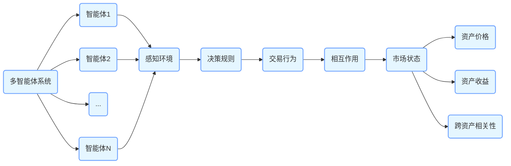

# 多智能体系统分析跨资产相关性

> 关键词：多智能体系统、跨资产相关性、金融市场、数据分析、复杂系统、智能体建模、相关性度量

> 摘要：本文聚焦于多智能体系统在分析跨资产相关性方面的应用。随着金融市场的日益复杂，不同资产之间的相互关系变得愈发难以捉摸。多智能体系统作为一种强大的建模工具，能够模拟金融市场中众多参与者的行为及其相互作用，从而深入探究跨资产相关性的本质和规律。文章首先介绍了相关背景知识，包括研究目的、预期读者、文档结构等。接着阐述了多智能体系统和跨资产相关性的核心概念及其联系，详细讲解了核心算法原理与操作步骤，并给出了数学模型和公式。通过项目实战展示了如何运用多智能体系统分析跨资产相关性，同时探讨了其实际应用场景。最后推荐了相关的工具和资源，总结了未来发展趋势与挑战，还提供了常见问题解答和扩展阅读参考资料，旨在为相关领域的研究和实践提供全面且深入的指导。

## 1. 背景介绍 
### 1.1 目的和范围
在当今全球化的金融市场中，资产种类繁多，包括股票、债券、期货、外汇等。这些资产之间存在着复杂的相互关系，理解跨资产相关性对于投资者进行资产配置、风险管理以及金融机构进行市场监测和监管都具有至关重要的意义。传统的相关性分析方法往往基于线性假设，难以准确捕捉金融市场中复杂的非线性关系和动态变化。多智能体系统为解决这一问题提供了新的视角和方法，它可以模拟市场中不同参与者的行为、决策过程以及它们之间的相互作用，从而更真实地反映金融市场的运行机制，揭示跨资产相关性的内在规律。

本文的范围主要涵盖多智能体系统的基本原理、如何运用多智能体系统分析跨资产相关性、相关的算法和数学模型，以及通过实际案例展示其应用。同时，还将探讨多智能体系统在跨资产相关性分析中的应用场景、相关工具和资源，以及未来的发展趋势和挑战。

### 1.2 预期读者
本文预期读者包括金融领域的研究人员、投资者、金融分析师、风险管理专家，以及计算机科学和复杂系统领域对金融应用感兴趣的研究人员和工程师。对于那些希望深入了解金融市场复杂性和跨资产相关性分析方法的读者，本文将提供有价值的信息和技术指导。

### 1.3 文档结构概述
本文共分为十个部分。第一部分为背景介绍，阐述了研究的目的、范围、预期读者和文档结构概述，并给出了相关术语的定义和解释。第二部分介绍了多智能体系统和跨资产相关性的核心概念及其联系，通过文本示意图和 Mermaid 流程图进行说明。第三部分详细讲解了核心算法原理和具体操作步骤，使用 Python 源代码进行阐述。第四部分给出了数学模型和公式，并进行详细讲解和举例说明。第五部分通过项目实战展示了如何运用多智能体系统分析跨资产相关性，包括开发环境搭建、源代码详细实现和代码解读。第六部分探讨了多智能体系统在跨资产相关性分析中的实际应用场景。第七部分推荐了相关的工具和资源，包括学习资源、开发工具框架和相关论文著作。第八部分总结了未来发展趋势与挑战。第九部分为附录，提供了常见问题与解答。第十部分给出了扩展阅读和参考资料。

### 1.4 术语表
#### 1.4.1 核心术语定义
- **多智能体系统（Multi - Agent System, MAS）**：由多个智能体组成的系统，每个智能体具有一定的自主性、交互性和适应性，能够感知环境并根据自身的目标和规则进行决策和行动，通过智能体之间的相互作用来实现系统的整体功能。
- **跨资产相关性**：不同类型资产（如股票、债券、期货等）在价格、收益等方面的相互关系。这种关系可以是正相关（即资产价格或收益变化趋势相同）、负相关（即资产价格或收益变化趋势相反）或不相关。
- **智能体（Agent）**：在多智能体系统中具有自主行为能力的实体，它可以感知环境信息，根据一定的规则和策略进行决策，并采取相应的行动。
- **资产配置**：投资者根据自身的风险偏好、投资目标和市场情况，将资金分配到不同资产类别的过程。

#### 1.4.2 相关概念解释
- **复杂系统**：由大量相互作用的组成部分构成的系统，其行为和性质不能简单地从各个组成部分的特性中推导出来。金融市场就是一个典型的复杂系统，其中包含众多投资者、金融机构等参与者，它们的行为相互影响，导致市场呈现出复杂的动态变化。
- **非线性关系**：变量之间的关系不是简单的线性比例关系，而是呈现出复杂的函数关系。在金融市场中，资产价格和收益的变化往往受到多种因素的影响，这些因素之间的相互作用可能是非线性的，使得传统的线性分析方法难以准确描述市场的真实情况。

#### 1.4.3 缩略词列表
- MAS：Multi - Agent System（多智能体系统）
- VAR：Value at Risk（风险价值）

## 2. 核心概念与联系 
### 2.1 多智能体系统的原理
多智能体系统是一种基于分布式人工智能的建模方法，其核心思想是将复杂系统分解为多个具有一定智能的个体（智能体），这些智能体通过相互作用来实现系统的整体功能。每个智能体具有以下特点：
- **自主性**：智能体能够独立地感知环境信息，并根据自身的目标和规则进行决策和行动，不需要外部的直接控制。
- **交互性**：智能体可以与其他智能体进行通信和交互，通过信息共享和协作来完成共同的任务或实现各自的目标。
- **适应性**：智能体能够根据环境的变化和自身的经验调整自己的行为和策略，以提高自身的性能和适应能力。

在金融市场中，多智能体系统可以用来模拟不同类型的投资者（如散户、机构投资者等）的行为。每个投资者作为一个智能体，根据自己的投资策略、风险偏好和对市场的预期进行交易决策，这些决策相互作用，最终影响市场的价格和资产的相关性。

### 2.2 跨资产相关性的概念
跨资产相关性是指不同资产之间在价格、收益等方面的相互关系。这种关系可以通过多种方式进行度量，常见的方法包括皮尔逊相关系数、斯皮尔曼相关系数等。正相关的资产通常在市场行情变化时表现出相似的走势，而负相关的资产则表现出相反的走势。理解跨资产相关性对于投资者进行资产配置和风险管理非常重要。例如，通过投资负相关的资产，可以降低投资组合的整体风险。

### 2.3 多智能体系统与跨资产相关性的联系
多智能体系统可以用来模拟金融市场中众多参与者的行为及其相互作用，从而深入探究跨资产相关性的形成机制。在多智能体系统中，不同的智能体代表不同的投资者，它们的交易决策会影响资产的价格和收益，进而影响资产之间的相关性。通过改变智能体的行为规则、风险偏好等参数，可以观察到跨资产相关性的变化，从而更好地理解金融市场的复杂性和动态性。

### 2.4 文本示意图
```plaintext
多智能体系统
|
|-- 智能体1（投资者1）
|   |-- 感知环境信息
|   |-- 决策规则
|   |-- 交易行为
|
|-- 智能体2（投资者2）
|   |-- 感知环境信息
|   |-- 决策规则
|   |-- 交易行为
|
|-- ...
|
|-- 智能体N（投资者N）
|   |-- 感知环境信息
|   |-- 决策规则
|   |-- 交易行为
|
|-- 相互作用
|   |-- 信息共享
|   |-- 交易影响
|
|-- 市场状态
|   |-- 资产价格
|   |-- 资产收益
|   |-- 跨资产相关性
```

### 2.5 Mermaid 流程图


## 3. 核心算法原理 & 具体操作步骤 
### 3.1 核心算法原理
在多智能体系统中分析跨资产相关性的核心算法主要包括智能体的行为建模、市场动态模拟和相关性计算三个部分。

#### 3.1.1 智能体的行为建模
智能体的行为建模是多智能体系统的基础，它描述了智能体如何感知环境信息、进行决策和采取行动。常见的智能体行为模型包括基于规则的模型、基于机器学习的模型等。在基于规则的模型中，智能体根据预先定义的规则进行决策，例如，如果市场价格上涨超过一定阈值，则卖出资产；如果市场价格下跌超过一定阈值，则买入资产。在基于机器学习的模型中，智能体通过学习历史数据来优化自己的决策策略。

#### 3.1.2 市场动态模拟
市场动态模拟是指根据智能体的行为和相互作用来模拟市场的价格和收益变化。在模拟过程中，需要考虑市场的供求关系、信息传播等因素。常见的市场动态模拟方法包括基于订单簿的模拟、基于市场微观结构的模拟等。

#### 3.1.3 相关性计算
相关性计算是指根据模拟得到的资产价格和收益数据，计算不同资产之间的相关性。常见的相关性计算方法包括皮尔逊相关系数、斯皮尔曼相关系数等。

### 3.2 具体操作步骤
#### 3.2.1 定义智能体
首先，需要定义智能体的属性和行为规则。智能体的属性包括初始资金、风险偏好、投资策略等。智能体的行为规则可以根据具体的应用场景进行定义，例如，基于技术分析的交易规则、基于基本面分析的交易规则等。

#### 3.2.2 初始化市场环境
初始化市场环境包括设定初始资产价格、市场流动性等参数。

#### 3.3.3 模拟市场动态
在每个时间步，智能体根据当前的市场环境信息进行决策和交易，市场根据智能体的交易行为更新资产价格和收益。

#### 3.3.4 计算相关性
在模拟结束后，根据模拟得到的资产价格和收益数据，计算不同资产之间的相关性。

### 3.3 Python 源代码实现
```python
import numpy as np
import random

# 定义智能体类
class Agent:
    def __init__(self, initial_funds, risk_preference, investment_strategy):
        self.funds = initial_funds
        self.risk_preference = risk_preference
        self.investment_strategy = investment_strategy
        self.assets = {}

    def make_decision(self, market_prices):
        # 简单的基于价格趋势的决策规则
        if self.investment_strategy == 'trend_following':
            for asset, price in market_prices.items():
                if price > market_prices.get(asset, 0) * 1.1:  # 价格上涨超过10%
                    if self.funds > 0:
                        amount = self.funds * 0.1
                        self.assets[asset] = self.assets.get(asset, 0) + amount / price
                        self.funds -= amount
                elif price < market_prices.get(asset, 0) * 0.9:  # 价格下跌超过10%
                    if asset in self.assets:
                        amount = self.assets[asset] * price * 0.1
                        self.funds += amount
                        self.assets[asset] -= amount / price

# 定义市场类
class Market:
    def __init__(self, initial_prices, liquidity):
        self.prices = initial_prices
        self.liquidity = liquidity
        self.agents = []

    def add_agent(self, agent):
        self.agents.append(agent)

    def simulate_step(self):
        # 模拟市场价格变化
        for asset in self.prices:
            self.prices[asset] *= random.uniform(0.95, 1.05)

        # 智能体决策和交易
        for agent in self.agents:
            agent.make_decision(self.prices)

    def get_asset_returns(self, num_steps):
        returns = {asset: [] for asset in self.prices}
        initial_prices = self.prices.copy()
        for _ in range(num_steps):
            self.simulate_step()
            for asset in self.prices:
                returns[asset].append((self.prices[asset] - initial_prices[asset]) / initial_prices[asset])
        return returns

# 计算相关性
def calculate_correlation(returns):
    asset_names = list(returns.keys())
    data = np.array([returns[asset] for asset in asset_names])
    correlation_matrix = np.corrcoef(data)
    return correlation_matrix

# 主函数
def main():
    initial_prices = {'asset1': 100, 'asset2': 200}
    liquidity = 1000
    market = Market(initial_prices, liquidity)

    agent1 = Agent(1000, 0.5, 'trend_following')
    agent2 = Agent(2000, 0.3, 'trend_following')
    market.add_agent(agent1)
    market.add_agent(agent2)

    num_steps = 100
    returns = market.get_asset_returns(num_steps)
    correlation_matrix = calculate_correlation(returns)
    print("Correlation Matrix:")
    print(correlation_matrix)

if __name__ == "__main__":
    main()
```

### 3.4 代码解释
- **Agent 类**：定义了智能体的属性和行为。智能体具有初始资金、风险偏好和投资策略等属性，`make_decision` 方法根据市场价格和投资策略进行决策和交易。
- **Market 类**：定义了市场的属性和行为。市场具有初始价格、流动性等属性，`simulate_step` 方法模拟市场价格变化和智能体的决策和交易，`get_asset_returns` 方法返回资产的收益率数据。
- **calculate_correlation 函数**：根据资产的收益率数据计算相关性矩阵。
- **main 函数**：初始化市场和智能体，模拟市场动态，计算相关性矩阵并输出结果。

## 4. 数学模型和公式 & 详细讲解 & 举例说明 
### 4.1 皮尔逊相关系数
皮尔逊相关系数是一种常用的线性相关性度量方法，用于衡量两个变量之间的线性关系强度。其计算公式为：

$$
\rho_{X,Y}=\frac{\mathrm{cov}(X,Y)}{\sigma_X\sigma_Y}
$$

其中，$\rho_{X,Y}$ 表示变量 $X$ 和 $Y$ 的皮尔逊相关系数，$\mathrm{cov}(X,Y)$ 表示 $X$ 和 $Y$ 的协方差，$\sigma_X$ 和 $\sigma_Y$ 分别表示 $X$ 和 $Y$ 的标准差。

协方差的计算公式为：

$$
\mathrm{cov}(X,Y)=\frac{1}{n - 1}\sum_{i = 1}^{n}(x_i-\bar{x})(y_i-\bar{y})
$$

其中，$n$ 表示样本数量，$x_i$ 和 $y_i$ 分别表示变量 $X$ 和 $Y$ 的第 $i$ 个样本值，$\bar{x}$ 和 $\bar{y}$ 分别表示变量 $X$ 和 $Y$ 的样本均值。

标准差的计算公式为：

$$
\sigma_X=\sqrt{\frac{1}{n - 1}\sum_{i = 1}^{n}(x_i-\bar{x})^2}
$$

$$
\sigma_Y=\sqrt{\frac{1}{n - 1}\sum_{i = 1}^{n}(y_i-\bar{y})^2}
$$

### 4.2 斯皮尔曼相关系数
斯皮尔曼相关系数是一种非参数的相关性度量方法，用于衡量两个变量之间的单调关系强度。其计算公式为：

$$
r_s = 1-\frac{6\sum_{i = 1}^{n}d_i^2}{n(n^2 - 1)}
$$

其中，$r_s$ 表示斯皮尔曼相关系数，$d_i$ 表示变量 $X$ 和 $Y$ 的第 $i$ 个样本的秩次之差，$n$ 表示样本数量。

### 4.3 详细讲解
- **皮尔逊相关系数**：皮尔逊相关系数的取值范围为 $[-1, 1]$。当 $\rho_{X,Y}=1$ 时，表示 $X$ 和 $Y$ 之间存在完全正线性相关关系；当 $\rho_{X,Y}=-1$ 时，表示 $X$ 和 $Y$ 之间存在完全负线性相关关系；当 $\rho_{X,Y}=0$ 时，表示 $X$ 和 $Y$ 之间不存在线性相关关系。皮尔逊相关系数适用于变量之间存在线性关系的情况。
- **斯皮尔曼相关系数**：斯皮尔曼相关系数的取值范围也为 $[-1, 1]$。与皮尔逊相关系数不同的是，斯皮尔曼相关系数衡量的是变量之间的单调关系，而不是线性关系。因此，它适用于变量之间存在单调关系但不一定是线性关系的情况。

### 4.4 举例说明
假设我们有两个资产 $A$ 和 $B$ 的收益率数据如下：

| 时间 | 资产 A 收益率 | 资产 B 收益率 |
|---|---|---|
| 1 | 0.05 | 0.06 |
| 2 | 0.03 | 0.04 |
| 3 | 0.02 | 0.03 |
| 4 | 0.04 | 0.05 |
| 5 | 0.06 | 0.07 |

#### 4.4.1 计算皮尔逊相关系数
首先，计算资产 $A$ 和 $B$ 的样本均值：

$$
\bar{x}=\frac{0.05 + 0.03 + 0.02 + 0.04 + 0.06}{5}=0.04
$$

$$
\bar{y}=\frac{0.06 + 0.04 + 0.03 + 0.05 + 0.07}{5}=0.05
$$

然后，计算协方差：

$$
\begin{align*}
\mathrm{cov}(X,Y)&=\frac{1}{5 - 1}[(0.05 - 0.04)(0.06 - 0.05)+(0.03 - 0.04)(0.04 - 0.05)+(0.02 - 0.04)(0.03 - 0.05)+(0.04 - 0.04)(0.05 - 0.05)+(0.06 - 0.04)(0.07 - 0.05)]\\
&=\frac{1}{4}[0.0001 + 0.0001 + 0.0004 + 0 + 0.0004]\\
&=0.00025
\end{align*}
$$

接着，计算标准差：

$$
\begin{align*}
\sigma_X&=\sqrt{\frac{1}{5 - 1}[(0.05 - 0.04)^2+(0.03 - 0.04)^2+(0.02 - 0.04)^2+(0.04 - 0.04)^2+(0.06 - 0.04)^2]}\\
&=\sqrt{\frac{1}{4}[0.0001 + 0.0001 + 0.0004 + 0 + 0.0004]}\\
&=0.0158
\end{align*}
$$

$$
\begin{align*}
\sigma_Y&=\sqrt{\frac{1}{5 - 1}[(0.06 - 0.05)^2+(0.04 - 0.05)^2+(0.03 - 0.05)^2+(0.05 - 0.05)^2+(0.07 - 0.05)^2]}\\
&=\sqrt{\frac{1}{4}[0.0001 + 0.0001 + 0.0004 + 0 + 0.0004]}\\
&=0.0158
\end{align*}
$$

最后，计算皮尔逊相关系数：

$$
\rho_{X,Y}=\frac{0.00025}{0.0158\times0.0158}=1
$$

#### 4.4.2 计算斯皮尔曼相关系数
首先，对资产 $A$ 和 $B$ 的收益率数据进行排序，得到秩次：

| 时间 | 资产 A 收益率 | 资产 A 秩次 | 资产 B 收益率 | 资产 B 秩次 | 秩次之差 $d_i$ | $d_i^2$ |
|---|---|---|---|---|---|---|
| 1 | 0.05 | 4 | 0.06 | 4 | 0 | 0 |
| 2 | 0.03 | 2 | 0.04 | 2 | 0 | 0 |
| 3 | 0.02 | 1 | 0.03 | 1 | 0 | 0 |
| 4 | 0.04 | 3 | 0.05 | 3 | 0 | 0 |
| 5 | 0.06 | 5 | 0.07 | 5 | 0 | 0 |

然后，计算斯皮尔曼相关系数：

$$
r_s = 1-\frac{6\times0}{5\times(5^2 - 1)}=1
$$

从计算结果可以看出，资产 $A$ 和 $B$ 之间存在完全正相关关系。

## 5. 项目实战：代码实际案例和详细解释说明 
### 5.1  开发环境搭建
#### 5.1.1 安装 Python
首先，需要安装 Python 环境。可以从 Python 官方网站（https://www.python.org/downloads/） 下载适合自己操作系统的 Python 安装包，并按照安装向导进行安装。

#### 5.1.2 安装必要的库
在本项目中，需要使用 `numpy` 库进行数值计算。可以使用以下命令安装 `numpy` 库：

```sh
pip install numpy
```

### 5.2  源代码详细实现和代码解读
```python
import numpy as np
import random

# 定义智能体类
class Agent:
    def __init__(self, initial_funds, risk_preference, investment_strategy):
        self.funds = initial_funds
        self.risk_preference = risk_preference
        self.investment_strategy = investment_strategy
        self.assets = {}

    def make_decision(self, market_prices):
        # 简单的基于价格趋势的决策规则
        if self.investment_strategy == 'trend_following':
            for asset, price in market_prices.items():
                if price > market_prices.get(asset, 0) * 1.1:  # 价格上涨超过10%
                    if self.funds > 0:
                        amount = self.funds * 0.1
                        self.assets[asset] = self.assets.get(asset, 0) + amount / price
                        self.funds -= amount
                elif price < market_prices.get(asset, 0) * 0.9:  # 价格下跌超过10%
                    if asset in self.assets:
                        amount = self.assets[asset] * price * 0.1
                        self.funds += amount
                        self.assets[asset] -= amount / price

# 定义市场类
class Market:
    def __init__(self, initial_prices, liquidity):
        self.prices = initial_prices
        self.liquidity = liquidity
        self.agents = []

    def add_agent(self, agent):
        self.agents.append(agent)

    def simulate_step(self):
        # 模拟市场价格变化
        for asset in self.prices:
            self.prices[asset] *= random.uniform(0.95, 1.05)

        # 智能体决策和交易
        for agent in self.agents:
            agent.make_decision(self.prices)

    def get_asset_returns(self, num_steps):
        returns = {asset: [] for asset in self.prices}
        initial_prices = self.prices.copy()
        for _ in range(num_steps):
            self.simulate_step()
            for asset in self.prices:
                returns[asset].append((self.prices[asset] - initial_prices[asset]) / initial_prices[asset])
        return returns

# 计算相关性
def calculate_correlation(returns):
    asset_names = list(returns.keys())
    data = np.array([returns[asset] for asset in asset_names])
    correlation_matrix = np.corrcoef(data)
    return correlation_matrix

# 主函数
def main():
    initial_prices = {'asset1': 100, 'asset2': 200}
    liquidity = 1000
    market = Market(initial_prices, liquidity)

    agent1 = Agent(1000, 0.5, 'trend_following')
    agent2 = Agent(2000, 0.3, 'trend_following')
    market.add_agent(agent1)
    market.add_agent(agent2)

    num_steps = 100
    returns = market.get_asset_returns(num_steps)
    correlation_matrix = calculate_correlation(returns)
    print("Correlation Matrix:")
    print(correlation_matrix)

if __name__ == "__main__":
    main()
```

### 5.3  代码解读与分析
#### 5.3.1 智能体类（Agent）
- **`__init__` 方法**：初始化智能体的属性，包括初始资金、风险偏好、投资策略和资产持有情况。
- **`make_decision` 方法**：根据市场价格和投资策略进行决策和交易。在本案例中，采用了简单的趋势跟随策略，即当资产价格上涨超过 10% 时买入，当资产价格下跌超过 10% 时卖出。

#### 5.3.2 市场类（Market）
- **`__init__` 方法**：初始化市场的属性，包括初始价格、流动性和智能体列表。
- **`add_agent` 方法**：向市场中添加智能体。
- **`simulate_step` 方法**：模拟市场价格变化和智能体的决策和交易。市场价格在每个时间步随机变化，智能体根据当前市场价格进行决策和交易。
- **`get_asset_returns` 方法**：返回资产的收益率数据。在模拟过程中，记录每个时间步的资产价格，并计算收益率。

#### 5.3.3 相关性计算函数（`calculate_correlation`）
该函数根据资产的收益率数据计算相关性矩阵。使用 `numpy` 库的 `corrcoef` 函数计算皮尔逊相关系数。

#### 5.3.4 主函数（`main`）
初始化市场和智能体，模拟市场动态，计算相关性矩阵并输出结果。

## 6. 实际应用场景 
### 6.1 资产配置
投资者可以利用多智能体系统分析跨资产相关性，优化资产配置。通过了解不同资产之间的相关性，投资者可以选择相关性较低的资产进行组合，从而降低投资组合的整体风险。例如，在股票市场和债券市场相关性较低的情况下，投资者可以同时投资股票和债券，以实现风险分散。

### 6.2 风险管理
金融机构可以利用多智能体系统分析跨资产相关性，进行风险管理。通过监测不同资产之间的相关性变化，金融机构可以及时发现潜在的风险，并采取相应的措施进行风险控制。例如，当股票市场和期货市场的相关性突然增加时，金融机构可以调整投资组合，减少风险暴露。

### 6.3 市场监测和监管
监管机构可以利用多智能体系统分析跨资产相关性，进行市场监测和监管。通过模拟市场中不同参与者的行为和相互作用，监管机构可以更好地理解市场的运行机制和风险特征，及时发现市场异常波动和系统性风险，采取相应的监管措施，维护金融市场的稳定。

### 6.4 投资策略优化
投资者和金融机构可以利用多智能体系统分析跨资产相关性，优化投资策略。通过模拟不同投资策略在不同市场环境下的表现，投资者和金融机构可以选择最优的投资策略，提高投资收益。例如，在市场波动较大的情况下，投资者可以选择相关性较低的资产进行投资，以降低风险。

## 7. 工具和资源推荐
### 7.1 学习资源推荐
#### 7.1.1 书籍推荐
- 《多智能体系统：原理与编程》：全面介绍了多智能体系统的基本原理、建模方法和编程实现，适合初学者和有一定基础的读者。
- 《金融市场的多智能体建模》：专注于多智能体系统在金融市场中的应用，包括市场模拟、资产定价、风险管理等方面的内容，对于理解多智能体系统在金融领域的应用具有重要参考价值。
- 《Python 数据分析实战》：介绍了 Python 在数据分析领域的应用，包括数据处理、统计分析、可视化等方面的内容，对于学习如何使用 Python 进行跨资产相关性分析具有很大帮助。

#### 7.1.2 在线课程
- Coursera 上的“Multi - Agent Systems”课程：由知名教授授课，系统介绍了多智能体系统的理论和实践，提供了丰富的学习资源和案例分析。
- edX 上的“Financial Markets and Portfolio Management”课程：讲解了金融市场的基本原理、投资组合管理和风险管理等内容，对于理解跨资产相关性在金融市场中的应用具有重要意义。
- 中国大学 MOOC 上的“Python 数据分析与应用”课程：介绍了 Python 在数据分析领域的应用，包括数据处理、统计分析、机器学习等方面的内容，适合初学者学习。

#### 7.1.3 技术博客和网站
- Medium 上的“Multi - Agent Systems”专栏：汇集了多智能体系统领域的最新研究成果和实践经验，提供了丰富的技术文章和案例分析。
- arXiv 网站：提供了大量的学术论文，包括多智能体系统、金融市场等领域的研究成果，对于深入学习相关知识具有重要参考价值。
- 知乎上的“多智能体系统”话题：汇集了多智能体系统领域的专家和爱好者，提供了丰富的讨论和交流资源。

### 7.2 开发工具框架推荐
#### 7.2.1 IDE和编辑器
- PyCharm：一款专业的 Python 集成开发环境，提供了丰富的代码编辑、调试、版本控制等功能，适合开发复杂的 Python 项目。
- Jupyter Notebook：一种交互式的开发环境，适合进行数据分析和可视化。可以方便地编写和运行 Python 代码，同时可以添加文本说明和可视化图表。
- Visual Studio Code：一款轻量级的代码编辑器，支持多种编程语言，提供了丰富的插件和扩展功能，适合快速开发和调试 Python 代码。

#### 7.2.2 调试和性能分析工具
- pdb：Python 自带的调试器，可以帮助开发者调试 Python 代码，查找和解决代码中的问题。
- cProfile：Python 自带的性能分析工具，可以帮助开发者分析 Python 代码的性能瓶颈，优化代码性能。
- Py-Spy：一款轻量级的 Python 性能分析工具，可以实时监测 Python 代码的运行状态和性能指标。

#### 7.2.3 相关框架和库
- Mesa：一个基于 Python 的多智能体建模框架，提供了丰富的智能体建模和模拟工具，适合快速开发多智能体系统。
- NetworkX：一个用于复杂网络分析的 Python 库，可以帮助开发者构建和分析智能体之间的交互网络。
- Pandas：一个用于数据处理和分析的 Python 库，提供了丰富的数据结构和数据分析工具，适合处理和分析跨资产相关性数据。

### 7.3 相关论文著作推荐
#### 7.3.1 经典论文
- "The Complexity of Economic Behavior" by Herbert A. Simon：探讨了经济行为的复杂性，为多智能体系统在金融市场中的应用提供了理论基础。
- "Agent - Based Modeling of Financial Markets" by Leigh Tesfatsion：系统介绍了多智能体系统在金融市场中的建模方法和应用，是该领域的经典论文之一。
- "Correlation and Dependence in Risk Management: Properties and Pitfalls" by Paul Embrechts, Alexander McNeil, and Daniel Straumann：深入探讨了风险管理中相关性和依赖性的概念、性质和应用，对于理解跨资产相关性具有重要意义。

#### 7.3.2 最新研究成果
- 近年来，多智能体系统在金融市场中的应用研究不断取得新的进展。可以通过 arXiv、IEEE Xplore、ACM Digital Library 等学术数据库查找最新的研究成果。

#### 7.3.3 应用案例分析
- "An Agent - Based Model of the Stock Market: Simulating Bubbles and Crashes" by Thomas Lux and Michele Marchesi：通过多智能体系统模拟了股票市场的泡沫和崩溃，为理解金融市场的复杂性和动态性提供了案例分析。
- "Agent - Based Modeling of the Foreign Exchange Market" by Cars Hommes and Florian Wagener：利用多智能体系统模拟了外汇市场的运行机制，分析了汇率波动的原因和影响。

## 8. 总结：未来发展趋势与挑战
### 8.1 未来发展趋势
#### 8.1.1 与人工智能技术的深度融合
随着人工智能技术的不断发展，多智能体系统将与机器学习、深度学习等技术深度融合。智能体可以通过学习历史数据和实时市场信息，不断优化自己的决策策略，提高对市场变化的适应能力。例如，智能体可以使用深度学习模型预测资产价格走势，从而做出更准确的交易决策。

#### 8.1.2 考虑更多的市场因素
未来的多智能体系统将考虑更多的市场因素，如宏观经济指标、政策变化、投资者情绪等。这些因素将影响智能体的决策和市场的动态变化，通过将这些因素纳入模型，可以更真实地模拟金融市场的运行机制，提高跨资产相关性分析的准确性。

#### 8.1.3 跨学科研究的加强
多智能体系统分析跨资产相关性是一个跨学科的研究领域，涉及计算机科学、金融学、经济学等多个学科。未来，跨学科研究将进一步加强，不同学科的专家将共同合作，从不同的角度深入研究金融市场的复杂性和跨资产相关性的本质。

#### 8.1.4 应用领域的拓展
多智能体系统分析跨资产相关性的应用领域将不断拓展，除了金融市场，还将应用于能源市场、房地产市场等其他领域。通过分析不同市场中资产的相关性，可以为投资者提供更全面的投资建议，为市场监管提供更有效的手段。

### 8.2 挑战
#### 8.2.1 模型的复杂性和可解释性
多智能体系统模型通常比较复杂，包含大量的智能体和相互作用关系。这使得模型的构建、训练和调试都面临很大的挑战。同时，由于模型的复杂性，其可解释性也较差，难以理解模型的决策过程和结果。如何在保证模型准确性的前提下，提高模型的可解释性是未来需要解决的重要问题。

#### 8.2.2 数据的质量和可用性
跨资产相关性分析需要大量的高质量数据，包括资产价格、交易量、宏观经济指标等。然而，实际数据往往存在噪声、缺失值等问题，影响分析结果的准确性。此外，一些数据可能受到保密和隐私的限制，难以获取。如何提高数据的质量和可用性是未来需要解决的另一个重要问题。

#### 8.2.3 计算资源的需求
多智能体系统模拟通常需要大量的计算资源，尤其是在模拟大规模市场和长时间序列时。这对计算机硬件和计算能力提出了很高的要求。如何优化模型的算法和结构，降低计算资源的需求，提高模拟效率是未来需要解决的问题之一。

#### 8.2.4 市场的不确定性和复杂性
金融市场具有高度的不确定性和复杂性，受到多种因素的影响，如政治、经济、社会等。这些因素的变化往往是难以预测的，给跨资产相关性分析带来了很大的挑战。如何在不确定的市场环境中准确地分析跨资产相关性，是未来需要研究的重要课题。

## 9. 附录：常见问题与解答
### 9.1 多智能体系统和传统的金融模型有什么区别？
传统的金融模型通常基于一些简化的假设，如市场参与者是理性的、市场是有效的等。这些假设在实际市场中往往不成立，导致传统模型难以准确描述市场的真实情况。多智能体系统则通过模拟市场中众多参与者的行为和相互作用，更真实地反映了市场的复杂性和动态性。多智能体系统可以考虑市场参与者的异质性、学习能力和适应性等因素，从而提供更准确的市场模拟和预测。

### 9.2 如何选择合适的相关性度量方法？
选择合适的相关性度量方法需要考虑数据的特点和分析的目的。如果数据是线性的，且希望衡量变量之间的线性关系强度，可以选择皮尔逊相关系数。如果数据是非线性的，或者希望衡量变量之间的单调关系强度，可以选择斯皮尔曼相关系数。此外，还可以根据具体的应用场景选择其他相关性度量方法，如肯德尔相关系数、偏相关系数等。

### 9.3 多智能体系统分析跨资产相关性的结果可靠吗？
多智能体系统分析跨资产相关性的结果的可靠性取决于模型的准确性和数据的质量。如果模型能够合理地模拟市场中参与者的行为和相互作用，并且使用的是高质量的数据，那么分析结果将具有较高的可靠性。然而，由于金融市场的不确定性和复杂性，多智能体系统的分析结果仍然存在一定的误差和不确定性。因此，在实际应用中，需要结合其他分析方法和经验进行综合判断。

### 9.4 如何提高多智能体系统模型的准确性？
提高多智能体系统模型的准确性可以从以下几个方面入手：
- **合理的智能体建模**：根据实际市场情况，合理定义智能体的属性、行为规则和决策策略，使智能体能够更真实地模拟市场参与者的行为。
- **考虑更多的市场因素**：将更多的市场因素纳入模型，如宏观经济指标、政策变化、投资者情绪等，以提高模型对市场动态变化的捕捉能力。
- **优化模型结构和算法**：通过优化模型的结构和算法，提高模型的计算效率和准确性。
- **使用高质量的数据**：使用高质量的历史数据和实时市场信息进行模型训练和验证，以提高模型的准确性和可靠性。

## 10. 扩展阅读 & 参考资料
### 10.1 扩展阅读
- "Complex Adaptive Systems: An Introduction to Computational Models of Social Life" by John H. Miller and Scott E. Page：介绍了复杂自适应系统的基本概念和建模方法，对于理解多智能体系统和金融市场的复杂性具有重要参考价值。
- "The Black Swan: The Impact of the Highly Improbable" by Nassim Nicholas Taleb：探讨了金融市场中的不确定性和黑天鹅事件，对于理解金融市场的风险和挑战具有重要意义。
- "Quantitative Trading: How to Build Your Own Algorithmic Trading Business" by Ernie Chan：介绍了量化交易的基本原理和方法，对于学习如何利用多智能体系统进行投资策略优化具有一定的参考价值。

### 10.2 参考资料
- 相关学术论文和研究报告：可以通过学术数据库（如 arXiv、IEEE Xplore、ACM Digital Library 等）查找多智能体系统、金融市场、跨资产相关性等领域的学术论文和研究报告。
- 金融数据提供商：如 Bloomberg、Wind、CEIC 等，提供了丰富的金融数据和市场信息，可以用于跨资产相关性分析。
- 开源代码库：如 GitHub 上的相关项目，提供了多智能体系统建模和跨资产相关性分析的开源代码和示例，可以参考和学习。