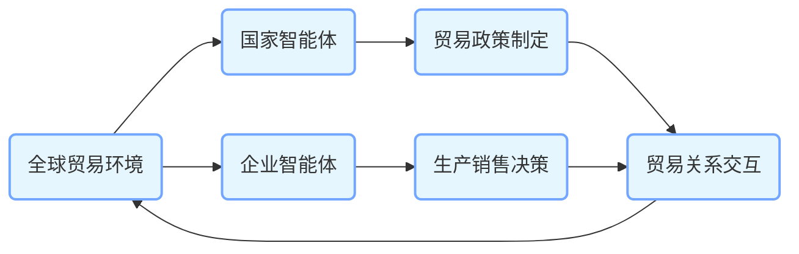

# 多智能体系统在全球贸易流动分析中的应用：把握宏观趋势

> 关键词：多智能体系统、全球贸易流动分析、宏观趋势、复杂系统、智能决策

> 摘要：本文聚焦于多智能体系统在全球贸易流动分析中的应用，旨在探讨如何借助该系统把握全球贸易的宏观趋势。首先介绍多智能体系统及全球贸易流动分析的背景知识，阐述其目的、范围、预期读者等。接着深入剖析多智能体系统的核心概念、算法原理与数学模型。通过项目实战展示如何利用多智能体系统进行全球贸易流动分析的具体代码实现及解读。同时探讨其实际应用场景，推荐相关工具和资源。最后总结多智能体系统在全球贸易分析领域的未来发展趋势与挑战，并提供常见问题解答及扩展阅读参考资料，为相关领域的研究和实践提供全面而深入的指导。

## 1. 背景介绍 
### 1.1 目的和范围
全球贸易流动是一个复杂且动态的系统，涉及众多国家、企业和市场参与者。准确分析全球贸易流动的宏观趋势对于政府制定政策、企业规划战略以及投资者做出决策都具有至关重要的意义。多智能体系统作为一种模拟复杂系统行为的有效工具，能够对全球贸易中各个参与者的行为和交互进行建模和分析，从而为把握全球贸易的宏观趋势提供有力支持。

本文的范围涵盖了多智能体系统的基本概念、算法原理、数学模型，以及其在全球贸易流动分析中的具体应用。通过理论阐述和项目实战，全面展示多智能体系统在该领域的应用方法和效果。

### 1.2 预期读者
本文预期读者包括从事国际贸易研究的学者、政府贸易政策制定者、企业战略规划人员、金融投资者以及对多智能体系统和全球贸易分析感兴趣的技术人员。

### 1.3 文档结构概述
本文首先介绍多智能体系统和全球贸易流动分析的背景知识，包括目的、范围、预期读者和术语表。接着阐述多智能体系统的核心概念及其与全球贸易流动分析的联系，并给出相应的示意图和流程图。然后详细讲解多智能体系统的核心算法原理和具体操作步骤，同时介绍相关的数学模型和公式。通过项目实战展示多智能体系统在全球贸易流动分析中的代码实现和解读。探讨多智能体系统在全球贸易领域的实际应用场景。推荐相关的学习资源、开发工具框架和论文著作。最后总结多智能体系统在全球贸易分析中的未来发展趋势与挑战，提供常见问题解答和扩展阅读参考资料。

### 1.4 术语表
#### 1.4.1 核心术语定义
- **多智能体系统（Multi - Agent System，MAS）**：由多个自主的智能体组成的系统，这些智能体能够感知环境、进行决策并与其他智能体或环境进行交互。
- **全球贸易流动**：指不同国家和地区之间商品、服务和资本的跨国流动。
- **智能体（Agent）**：具有自主性、反应性、社会性和主动性等特性的实体，能够在一定环境中独立完成任务并与其他智能体进行交互。

#### 1.4.2 相关概念解释
- **复杂系统**：由大量相互作用的组件组成的系统，其行为和特性无法简单地从单个组件的特性推导得出。全球贸易流动系统就是一个典型的复杂系统，涉及众多国家、企业和市场参与者的相互作用。
- **模拟（Simulation）**：通过建立模型来模仿真实系统的行为和过程，以便更好地理解和分析系统的特性和规律。多智能体系统常用于对复杂系统进行模拟。

#### 1.4.3 缩略词列表
- **MAS**：Multi - Agent System（多智能体系统）
- **GDP**：Gross Domestic Product（国内生产总值）

## 2. 核心概念与联系 

### 2.1 多智能体系统的核心概念
多智能体系统由多个智能体组成，每个智能体具有一定的自主性和智能。智能体可以是物理实体（如机器人），也可以是软件程序（如智能算法）。智能体能够感知其所处的环境，根据自身的目标和规则进行决策，并与其他智能体或环境进行交互。

智能体的基本特性包括：
- **自主性**：智能体能够独立地进行决策和行动，不受外部直接控制。
- **反应性**：智能体能够对环境中的变化做出及时的反应。
- **社会性**：智能体能够与其他智能体进行通信和协作，以实现共同的目标。
- **主动性**：智能体能够主动地发起行动，以实现自身的目标。

### 2.2 多智能体系统与全球贸易流动分析的联系
全球贸易流动是一个复杂的系统，涉及众多国家、企业和市场参与者。每个参与者都有自己的目标和决策规则，并且它们之间相互影响。多智能体系统可以对这些参与者进行建模，将每个参与者看作一个智能体。通过模拟这些智能体的行为和交互，可以分析全球贸易流动的宏观趋势。

例如，企业智能体可以根据市场需求、成本、利润等因素决定生产和销售策略；国家智能体可以根据自身的经济利益和政策目标制定贸易政策。这些智能体之间的交互（如贸易谈判、签订合同等）会影响全球贸易的流动。

### 2.3 文本示意图
多智能体系统在全球贸易流动分析中的应用可以用以下示意图表示：

全球贸易环境包含多个国家和企业，每个国家和企业都可以看作一个智能体。智能体之间通过贸易关系进行交互，同时受到全球经济环境、政策法规等因素的影响。智能体根据自身的目标和规则进行决策，这些决策又会反过来影响全球贸易环境。

### 2.4 Mermaid 流程图


## 3. 核心算法原理 & 具体操作步骤 

### 3.1 核心算法原理
多智能体系统的核心算法主要包括智能体的决策算法和智能体之间的交互算法。

#### 3.1.1 智能体的决策算法
智能体的决策算法通常基于一定的规则或模型，根据智能体的目标和环境信息进行决策。常见的决策算法包括基于规则的决策算法、基于优化的决策算法和基于机器学习的决策算法。

- **基于规则的决策算法**：智能体根据预先定义的规则进行决策。例如，企业智能体根据市场价格和成本规则决定是否生产某种产品。
- **基于优化的决策算法**：智能体通过优化某个目标函数来进行决策。例如，企业智能体通过最大化利润来决定生产和销售策略。
- **基于机器学习的决策算法**：智能体通过学习历史数据来进行决策。例如，企业智能体通过学习市场需求的历史数据来预测未来的需求，从而决定生产计划。

#### 3.1.2 智能体之间的交互算法
智能体之间的交互算法主要包括通信算法和协作算法。

- **通信算法**：智能体之间通过通信来交换信息。常见的通信方式包括消息传递、共享内存等。
- **协作算法**：智能体之间通过协作来实现共同的目标。例如，企业智能体之间可以通过合作生产、销售等方式来提高效率和利润。

### 3.2 具体操作步骤
以下是使用多智能体系统进行全球贸易流动分析的具体操作步骤：

#### 3.2.1 定义智能体
首先，需要定义全球贸易中的各种智能体，如国家智能体、企业智能体等。每个智能体需要定义其属性（如国家的 GDP、企业的资产等）、目标（如国家的经济增长目标、企业的利润目标等）和规则（如国家的贸易政策规则、企业的生产销售规则等）。

#### 3.2.2 初始化智能体和环境
初始化每个智能体的属性和状态，同时初始化全球贸易环境的相关参数，如市场价格、汇率等。

#### 3.2.3 智能体决策和交互
每个智能体根据自身的目标和规则进行决策，并与其他智能体进行交互。例如，企业智能体根据市场价格和成本决定生产和销售策略，同时与其他企业智能体进行合作或竞争；国家智能体根据自身的经济利益和政策目标制定贸易政策，并与其他国家智能体进行贸易谈判。

#### 3.2.4 更新环境和智能体状态
根据智能体的决策和交互结果，更新全球贸易环境的相关参数和智能体的状态。例如，根据企业的生产和销售情况更新市场价格和库存；根据国家的贸易政策更新贸易流量和汇率。

#### 3.2.5 重复步骤 3 和 4
重复进行智能体的决策和交互，以及环境和智能体状态的更新，直到达到预定的时间步数或满足特定的终止条件。

#### 3.2.6 分析结果
对模拟过程中记录的数据进行分析，以把握全球贸易流动的宏观趋势。例如，分析贸易流量的变化、市场价格的波动、企业的利润变化等。

### 3.3 Python 源代码实现
以下是一个简单的多智能体系统模拟全球贸易流动的 Python 示例代码：

```python
import random

# 定义企业智能体类
class EnterpriseAgent:
    def __init__(self, id, initial_assets, production_cost):
        self.id = id
        self.assets = initial_assets
        self.production_cost = production_cost
        self.production_volume = 0
        self.sales_volume = 0

    def decide_production(self, market_price):
        if market_price > self.production_cost:
            self.production_volume = random.randint(10, 100)
        else:
            self.production_volume = 0

    def sell_products(self, market_demand):
        self.sales_volume = min(self.production_volume, market_demand)
        self.assets += self.sales_volume * market_price
        self.production_volume -= self.sales_volume

# 定义市场环境类
class MarketEnvironment:
    def __init__(self, initial_price, initial_demand):
        self.price = initial_price
        self.demand = initial_demand

    def update_price_and_demand(self, total_production):
        if total_production > self.demand:
            self.price -= 1
        else:
            self.price += 1
        self.demand = random.randint(50, 200)

# 模拟全球贸易流动
def simulate_trade(num_enterprises, initial_assets, production_cost, initial_price, initial_demand, num_steps):
    enterprises = [EnterpriseAgent(i, initial_assets, production_cost) for i in range(num_enterprises)]
    market = MarketEnvironment(initial_price, initial_demand)

    for step in range(num_steps):
        total_production = 0
        # 企业决策生产
        for enterprise in enterprises:
            enterprise.decide_production(market.price)
            total_production += enterprise.production_volume

        # 企业销售产品
        for enterprise in enterprises:
            enterprise.sell_products(market.demand)

        # 更新市场价格和需求
        market.update_price_and_demand(total_production)

        # 输出当前步骤的信息
        print(f"Step {step}: Market Price = {market.price}, Market Demand = {market.demand}")
        for enterprise in enterprises:
            print(f"  Enterprise {enterprise.id}: Assets = {enterprise.assets}, Production = {enterprise.production_volume}, Sales = {enterprise.sales_volume}")

# 运行模拟
simulate_trade(num_enterprises=5, initial_assets=1000, production_cost=10, initial_price=20, initial_demand=100, num_steps=10)
```

### 3.4 代码解释
- **EnterpriseAgent 类**：表示企业智能体，包含企业的基本属性（如资产、生产成本等）和决策方法（如决定生产和销售产品）。
- **MarketEnvironment 类**：表示市场环境，包含市场价格和需求等信息，并提供更新市场价格和需求的方法。
- **simulate_trade 函数**：模拟全球贸易流动的过程，包括企业的决策、销售和市场环境的更新。

通过这个简单的示例代码，可以初步了解多智能体系统在全球贸易流动分析中的应用。

## 4. 数学模型和公式 & 详细讲解 & 举例说明 

### 4.1 智能体决策的数学模型
#### 4.1.1 基于优化的决策模型
假设企业智能体的目标是最大化利润 $\pi$，企业的生产函数为 $Q = f(K, L)$，其中 $Q$ 表示产量，$K$ 表示资本投入，$L$ 表示劳动投入。企业的成本函数为 $C = rK + wL$，其中 $r$ 表示资本的价格，$w$ 表示劳动的价格。市场价格为 $P$。

则企业的利润函数为：
$$\pi = PQ - C = Pf(K, L) - (rK + wL)$$

企业的决策就是在给定市场价格 $P$、资本价格 $r$ 和劳动价格 $w$ 的情况下，选择最优的资本投入 $K$ 和劳动投入 $L$ 来最大化利润 $\pi$。这可以通过求解以下优化问题来实现：
$$\max_{K,L} \pi = Pf(K, L) - (rK + wL)$$
$$s.t. \quad K \geq 0, L \geq 0$$

例如，假设企业的生产函数为 $Q = K^{0.5}L^{0.5}$，市场价格 $P = 10$，资本价格 $r = 2$，劳动价格 $w = 1$。则利润函数为：
$$\pi = 10K^{0.5}L^{0.5} - (2K + L)$$

对 $K$ 和 $L$ 分别求偏导数，并令偏导数等于 0，得到：
$$\frac{\partial \pi}{\partial K} = 5K^{-0.5}L^{0.5} - 2 = 0$$
$$\frac{\partial \pi}{\partial L} = 5K^{0.5}L^{-0.5} - 1 = 0$$

解这个方程组，可以得到最优的资本投入 $K$ 和劳动投入 $L$，从而确定企业的生产决策。

#### 4.1.2 基于机器学习的决策模型
假设企业智能体通过学习历史数据来预测市场需求 $D$。可以使用线性回归模型来进行预测，线性回归模型的一般形式为：
$$D = \beta_0 + \beta_1X_1 + \beta_2X_2 + \cdots + \beta_nX_n + \epsilon$$
其中，$D$ 表示市场需求，$X_1, X_2, \cdots, X_n$ 表示影响市场需求的因素（如 GDP、人口、消费者收入等），$\beta_0, \beta_1, \cdots, \beta_n$ 表示模型的参数，$\epsilon$ 表示误差项。

通过收集历史数据，可以使用最小二乘法来估计模型的参数 $\beta_0, \beta_1, \cdots, \beta_n$。例如，假设市场需求 $D$ 与 GDP $X_1$ 和人口 $X_2$ 有关，收集到的历史数据如下：

| GDP ($X_1$) | 人口 ($X_2$) | 市场需求 ($D$) |
|---|---|---|
| 100 | 10 | 20 |
| 200 | 20 | 40 |
| 300 | 30 | 60 |

使用最小二乘法可以估计出模型的参数 $\beta_0 = 0$，$\beta_1 = 0.2$，$\beta_2 = 0$。则预测市场需求的模型为：
$$D = 0.2X_1$$

### 4.2 智能体交互的数学模型
#### 4.2.1 贸易流量模型
假设国家 $i$ 向国家 $j$ 的贸易流量 $T_{ij}$ 与国家 $i$ 的出口能力 $E_i$、国家 $j$ 的进口需求 $I_j$ 以及两国之间的贸易成本 $C_{ij}$ 有关。可以使用引力模型来描述贸易流量：
$$T_{ij} = \frac{G E_i I_j}{C_{ij}^{\alpha}}$$
其中，$G$ 是引力常数，$\alpha$ 是贸易成本的弹性系数。

例如，假设国家 $A$ 的出口能力 $E_A = 100$，国家 $B$ 的进口需求 $I_B = 80$，两国之间的贸易成本 $C_{AB} = 10$，引力常数 $G = 1$，贸易成本的弹性系数 $\alpha = 1$。则国家 $A$ 向国家 $B$ 的贸易流量为：
$$T_{AB} = \frac{1 \times 100 \times 80}{10^1} = 800$$

#### 4.2.2 博弈论模型
智能体之间的交互也可以使用博弈论模型来描述。例如，两个企业在市场上进行竞争，可以使用囚徒困境模型来分析它们的决策。

假设企业 $A$ 和企业 $B$ 都有两种策略：合作和竞争。如果两个企业都选择合作，它们的收益都为 5；如果一个企业选择合作，另一个企业选择竞争，则选择合作的企业收益为 1，选择竞争的企业收益为 8；如果两个企业都选择竞争，它们的收益都为 3。可以用以下收益矩阵来表示：

|  | 企业 B 合作 | 企业 B 竞争 |
|---|---|---|
| 企业 A 合作 | (5, 5) | (1, 8) |
| 企业 A 竞争 | (8, 1) | (3, 3) |

在这个博弈中，每个企业都需要根据对方的策略来选择自己的最优策略。通过分析这个博弈模型，可以预测企业的决策和市场的竞争态势。

## 5. 项目实战：代码实际案例和详细解释说明 

### 5.1  开发环境搭建
#### 5.1.1 安装 Python
首先，需要安装 Python 开发环境。可以从 Python 官方网站（https://www.python.org/downloads/） 下载适合自己操作系统的 Python 安装包，并按照安装向导进行安装。

#### 5.1.2 安装必要的库
在使用多智能体系统进行全球贸易流动分析时，可能需要使用一些 Python 库，如 `numpy`、`pandas` 等。可以使用以下命令来安装这些库：
```sh
pip install numpy pandas
```

### 5.2  源代码详细实现和代码解读
以下是一个更复杂的多智能体系统模拟全球贸易流动的 Python 代码示例：

```python
import numpy as np
import pandas as pd

# 定义国家智能体类
class CountryAgent:
    def __init__(self, id, gdp, trade_policy):
        self.id = id
        self.gdp = gdp
        self.trade_policy = trade_policy
        self.export_volume = 0
        self.import_volume = 0

    def update_trade_volume(self, trade_matrix):
        self.export_volume = np.sum(trade_matrix[self.id, :])
        self.import_volume = np.sum(trade_matrix[:, self.id])

    def update_gdp(self):
        # 简单假设 GDP 与贸易顺差有关
        trade_surplus = self.export_volume - self.import_volume
        self.gdp += trade_surplus * 0.1

# 定义全球贸易环境类
class GlobalTradeEnvironment:
    def __init__(self, num_countries, initial_gdp, initial_trade_policy):
        self.num_countries = num_countries
        self.countries = [CountryAgent(i, initial_gdp, initial_trade_policy) for i in range(num_countries)]
        self.trade_matrix = np.zeros((num_countries, num_countries))

    def generate_trade(self):
        for i in range(self.num_countries):
            for j in range(self.num_countries):
                if i != j:
                    # 简单假设贸易流量与两国 GDP 有关
                    self.trade_matrix[i, j] = self.countries[i].gdp * self.countries[j].gdp * 0.001

    def update_countries(self):
        for country in self.countries:
            country.update_trade_volume(self.trade_matrix)
            country.update_gdp()

    def get_trade_data(self):
        data = []
        for country in self.countries:
            data.append([country.id, country.gdp, country.export_volume, country.import_volume])
        return pd.DataFrame(data, columns=['Country ID', 'GDP', 'Export Volume', 'Import Volume'])

# 模拟全球贸易流动
def simulate_global_trade(num_countries, initial_gdp, initial_trade_policy, num_steps):
    env = GlobalTradeEnvironment(num_countries, initial_gdp, initial_trade_policy)
    trade_data = []

    for step in range(num_steps):
        env.generate_trade()
        env.update_countries()
        trade_data.append(env.get_trade_data())

    return trade_data

# 运行模拟
trade_data = simulate_global_trade(num_countries=5, initial_gdp=1000, initial_trade_policy='Free Trade', num_steps=10)

# 输出模拟结果
for i, data in enumerate(trade_data):
    print(f"Step {i}:")
    print(data)
```

### 5.3  代码解读与分析
- **CountryAgent 类**：表示国家智能体，包含国家的基本属性（如 GDP、贸易政策等）和更新贸易量和 GDP 的方法。
- **GlobalTradeEnvironment 类**：表示全球贸易环境，包含多个国家智能体和贸易矩阵。提供生成贸易流量、更新国家状态和获取贸易数据的方法。
- **simulate_global_trade 函数**：模拟全球贸易流动的过程，包括生成贸易流量、更新国家状态，并记录每个步骤的贸易数据。

通过这个代码示例，可以更深入地了解多智能体系统在全球贸易流动分析中的应用。可以根据实际需求对代码进行扩展和优化，例如考虑更多的因素（如贸易成本、政策变化等）。

## 6. 实际应用场景 
### 6.1 政府政策制定
政府可以利用多智能体系统模拟全球贸易流动的宏观趋势，分析不同贸易政策对本国经济和全球贸易的影响。例如，政府可以模拟提高关税、实施贸易保护主义政策或签署自由贸易协定等情况下，本国企业的生产和销售情况、贸易流量的变化以及 GDP 的增长情况，从而制定更加科学合理的贸易政策。

### 6.2 企业战略规划
企业可以使用多智能体系统分析全球贸易市场的趋势，预测市场需求和竞争态势，从而制定更加有效的战略规划。例如，企业可以模拟不同国家的贸易政策变化对自身产品出口的影响，决定是否进入新的市场、调整生产计划或与其他企业进行合作。

### 6.3 金融投资决策
金融投资者可以借助多智能体系统分析全球贸易流动的趋势，预测相关行业和企业的发展前景，从而做出更加明智的投资决策。例如，投资者可以模拟全球贸易格局的变化对航运、物流、制造业等行业的影响，选择具有潜力的投资标的。

### 6.4 学术研究
学术研究人员可以使用多智能体系统对全球贸易流动的复杂现象进行深入研究，探索贸易的规律和机制。例如，研究人员可以通过模拟不同国家的经济发展模式、贸易政策和企业行为，分析全球贸易失衡的原因和解决方法。

## 7. 工具和资源推荐
### 7.1 学习资源推荐
#### 7.1.1 书籍推荐
- 《多智能体系统导论》：全面介绍了多智能体系统的基本概念、理论和方法，是学习多智能体系统的经典教材。
- 《国际贸易学》：系统阐述了国际贸易的基本理论、政策和实践，对于理解全球贸易流动的背景和机制非常有帮助。
- 《复杂系统科学与工程》：介绍了复杂系统的基本概念和研究方法，有助于理解多智能体系统在复杂系统中的应用。

#### 7.1.2 在线课程
- Coursera 上的“Multi - Agent Systems”课程：由知名高校的教授授课，系统讲解多智能体系统的理论和实践。
- edX 上的“International Trade”课程：介绍国际贸易的基本理论和政策，以及全球贸易的现状和趋势。

#### 7.1.3 技术博客和网站
- AgentLink 网站：提供多智能体系统领域的最新研究成果、学术会议信息和技术资源。
- 中国知网、万方数据等学术数据库：可以查找关于多智能体系统和全球贸易流动分析的学术论文和研究报告。

### 7.2 开发工具框架推荐
#### 7.2.1 IDE和编辑器
- PyCharm：一款功能强大的 Python 集成开发环境，提供代码编辑、调试、版本控制等功能，非常适合开发多智能体系统的 Python 代码。
- Visual Studio Code：一款轻量级的代码编辑器，支持多种编程语言和插件，可用于快速开发和调试多智能体系统的代码。

#### 7.2.2 调试和性能分析工具
- PDB：Python 自带的调试器，可以帮助开发者调试多智能体系统的代码，查找和解决问题。
- cProfile：Python 的性能分析工具，可以分析代码的运行时间和资源消耗，帮助开发者优化代码性能。

#### 7.2.3 相关框架和库
- Mesa：一个基于 Python 的多智能体建模框架，提供了简单易用的接口和工具，方便开发者快速搭建多智能体系统模型。
- NetworkX：一个用于复杂网络分析的 Python 库，可以用于分析多智能体系统中智能体之间的交互关系。

### 7.3 相关论文著作推荐
#### 7.3.1 经典论文
- “Multi - Agent Systems: A Modern Approach to Distributed Artificial Intelligence”：介绍了多智能体系统的基本概念和研究方法，是多智能体系统领域的经典论文。
- “Gravity Models of Trade: A User's Guide”：详细介绍了引力模型在国际贸易中的应用，对于理解贸易流量的建模方法非常有帮助。

#### 7.3.2 最新研究成果
- 关注顶级学术期刊（如 Journal of Artificial Intelligence Research、Journal of International Economics 等）上发表的关于多智能体系统和全球贸易流动分析的最新研究论文，了解该领域的前沿动态。

#### 7.3.3 应用案例分析
- 查找相关的研究报告和案例分析，了解多智能体系统在全球贸易分析中的实际应用案例和效果，学习他人的经验和方法。

## 8. 总结：未来发展趋势与挑战
### 8.1 未来发展趋势
#### 8.1.1 与大数据和人工智能的融合
随着大数据和人工智能技术的发展，多智能体系统将与这些技术更加紧密地融合。通过收集和分析大量的全球贸易数据，利用人工智能算法训练智能体的决策模型，提高多智能体系统模拟全球贸易流动的准确性和可靠性。

#### 8.1.2 考虑更多的因素和复杂性
未来的多智能体系统将考虑更多的因素和复杂性，如环境因素、社会文化因素、政治因素等。这些因素对全球贸易流动有着重要的影响，将它们纳入多智能体系统的模型中，可以更全面地模拟全球贸易的实际情况。

#### 8.1.3 跨学科研究和应用
多智能体系统在全球贸易流动分析中的应用将涉及到计算机科学、经济学、管理学等多个学科的知识。未来将加强跨学科的研究和合作，推动多智能体系统在全球贸易领域的更深入应用。

### 8.2 挑战
#### 8.2.1 数据获取和处理
全球贸易数据的获取和处理是一个挑战。贸易数据往往分散在不同的数据源中，数据的质量和完整性也存在问题。此外，处理大规模的贸易数据需要高效的算法和计算资源。

#### 8.2.2 模型的准确性和可靠性
多智能体系统的模型需要准确地反映全球贸易的实际情况，但是由于全球贸易的复杂性，很难建立一个完全准确的模型。模型的参数估计和验证也是一个挑战，需要大量的实验和数据支持。

#### 8.2.3 计算资源和效率
模拟全球贸易流动的多智能体系统通常需要大量的计算资源和时间。如何提高系统的计算效率，在有限的时间和资源内得到准确的模拟结果，是一个需要解决的问题。

## 9. 附录：常见问题与解答
### 9.1 多智能体系统与传统的经济模型有什么区别？
传统的经济模型通常基于一些简化的假设，将经济系统看作一个整体进行分析。而多智能体系统则强调个体的自主性和交互性，将经济系统中的各个参与者看作独立的智能体，通过模拟智能体的行为和交互来分析经济系统的整体行为。多智能体系统能够更好地反映经济系统的复杂性和动态性。

### 9.2 如何确定多智能体系统中智能体的规则和参数？
智能体的规则和参数可以根据实际情况和研究目的进行确定。可以通过收集历史数据、进行专家访谈、参考相关文献等方式来获取规则和参数的信息。同时，也可以通过实验和优化的方法来调整规则和参数，以提高模型的准确性和可靠性。

### 9.3 多智能体系统在全球贸易流动分析中的应用有哪些局限性？
多智能体系统在全球贸易流动分析中的应用存在一些局限性。例如，模型的准确性受到数据质量和模型假设的影响；计算资源和时间的限制可能导致无法进行大规模的模拟；智能体的行为和决策可能受到主观因素的影响，难以完全准确地建模。

## 10. 扩展阅读 & 参考资料
### 10.1 扩展阅读
- 《复杂经济学：经济思想的新框架》：介绍了复杂经济学的基本概念和方法，对于理解多智能体系统在经济领域的应用有很大的帮助。
- 《人工智能：一种现代的方法》：全面介绍了人工智能的基本概念、理论和方法，包括多智能体系统的相关内容。

### 10.2 参考资料
- 相关的学术论文、研究报告和书籍：在撰写本文过程中参考了大量的学术论文、研究报告和书籍，具体的参考文献可以根据文中引用的内容进行查找。
- 相关的网站和数据库：如 AgentLink 网站、中国知网、万方数据等，提供了多智能体系统和全球贸易流动分析领域的最新研究成果和技术资源。