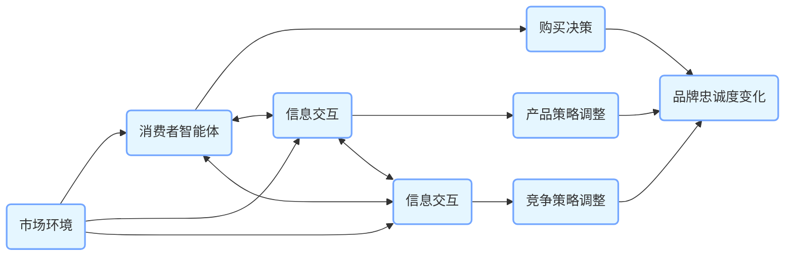

# 多智能体系统在品牌忠诚度动态评估中的应用

> 关键词：多智能体系统、品牌忠诚度、动态评估、人工智能、市场营销

> 摘要：本文深入探讨了多智能体系统在品牌忠诚度动态评估中的应用。首先介绍了研究的背景、目的、预期读者等内容，接着阐述了多智能体系统和品牌忠诚度的核心概念及联系，详细讲解了相关核心算法原理和具体操作步骤，包括使用 Python 源代码进行阐述。同时，给出了数学模型和公式，并通过举例说明。在项目实战部分，展示了开发环境搭建、源代码实现及解读。分析了多智能体系统在品牌忠诚度动态评估中的实际应用场景，推荐了相关的学习资源、开发工具框架和论文著作。最后总结了未来发展趋势与挑战，解答了常见问题并提供了扩展阅读和参考资料，旨在为相关领域的研究和实践提供全面而深入的参考。

## 1. 背景介绍 
### 1.1 目的和范围
在当今竞争激烈的市场环境中，品牌忠诚度是企业成功的关键因素之一。准确评估品牌忠诚度对于企业制定营销策略、提高市场竞争力具有重要意义。传统的品牌忠诚度评估方法往往是静态的，难以实时反映消费者行为和市场环境的动态变化。多智能体系统作为一种分布式人工智能技术，具有自主性、交互性和适应性等特点，能够模拟复杂的市场环境和消费者行为，为品牌忠诚度的动态评估提供了新的思路和方法。

本研究的目的是探讨多智能体系统在品牌忠诚度动态评估中的应用，建立基于多智能体系统的品牌忠诚度动态评估模型，并通过实验验证模型的有效性和可行性。研究范围包括多智能体系统的原理和应用、品牌忠诚度的概念和评估方法、基于多智能体系统的品牌忠诚度动态评估模型的构建和验证等方面。

### 1.2 预期读者
本文的预期读者包括市场营销领域的研究人员、企业营销管理人员、人工智能领域的技术人员以及对品牌忠诚度和多智能体系统感兴趣的读者。对于市场营销领域的研究人员，本文可以为他们提供新的研究思路和方法；对于企业营销管理人员，本文可以帮助他们更好地了解消费者行为和市场动态，制定更加有效的营销策略；对于人工智能领域的技术人员，本文可以为他们提供一个新的应用场景和研究方向；对于对品牌忠诚度和多智能体系统感兴趣的读者，本文可以帮助他们了解相关的理论和技术。

### 1.3 文档结构概述
本文共分为 10 个部分，具体结构如下：
1. 背景介绍：介绍研究的目的、范围、预期读者和文档结构概述。
2. 核心概念与联系：阐述多智能体系统和品牌忠诚度的核心概念及联系，给出核心概念原理和架构的文本示意图和 Mermaid 流程图。
3. 核心算法原理 & 具体操作步骤：详细讲解基于多智能体系统的品牌忠诚度动态评估的核心算法原理，并使用 Python 源代码进行阐述。
4. 数学模型和公式 & 详细讲解 & 举例说明：给出基于多智能体系统的品牌忠诚度动态评估的数学模型和公式，并通过举例说明。
5. 项目实战：代码实际案例和详细解释说明：展示基于多智能体系统的品牌忠诚度动态评估的项目实战，包括开发环境搭建、源代码详细实现和代码解读。
6. 实际应用场景：分析多智能体系统在品牌忠诚度动态评估中的实际应用场景。
7. 工具和资源推荐：推荐相关的学习资源、开发工具框架和论文著作。
8. 总结：未来发展趋势与挑战：总结多智能体系统在品牌忠诚度动态评估中的应用现状，分析未来发展趋势和挑战。
9. 附录：常见问题与解答：解答常见问题。
10. 扩展阅读 & 参考资料：提供扩展阅读和参考资料。

### 1.4 术语表
#### 1.4.1 核心术语定义
- **多智能体系统（Multi - Agent System，MAS）**：由多个自主的智能体组成的系统，这些智能体可以通过交互和协作来完成共同的任务。
- **品牌忠诚度**：消费者对某个品牌的信任、偏好和重复购买的程度。
- **动态评估**：对事物的状态和变化进行实时、连续的评估。

#### 1.4.2 相关概念解释
- **智能体**：具有自主性、交互性和适应性的实体，能够感知环境、做出决策并采取行动。
- **消费者行为**：消费者在购买、使用和评价产品或服务过程中的行为和决策。
- **市场环境**：影响企业营销活动的各种因素的总和，包括消费者、竞争对手、政策法规等。

#### 1.4.3 缩略词列表
- MAS：Multi - Agent System（多智能体系统）
- AI：Artificial Intelligence（人工智能）

## 2. 核心概念与联系 

### 多智能体系统的核心概念
多智能体系统是一种分布式人工智能技术，由多个智能体组成。每个智能体具有一定的自主性和智能性，能够感知环境、做出决策并采取行动。智能体之间可以通过通信和协作来完成共同的任务。

多智能体系统的主要特点包括：
- **自主性**：智能体能够独立地感知环境、做出决策并采取行动，不受其他智能体的直接控制。
- **交互性**：智能体之间可以通过通信和协作来完成共同的任务，实现信息的共享和资源的协调。
- **适应性**：智能体能够根据环境的变化和自身的经验来调整自己的行为和决策，以适应不同的任务和环境。

### 品牌忠诚度的核心概念
品牌忠诚度是指消费者对某个品牌的信任、偏好和重复购买的程度。品牌忠诚度高的消费者往往会更愿意购买该品牌的产品或服务，并且对该品牌的价格敏感度较低。

品牌忠诚度的形成受到多种因素的影响，包括产品质量、品牌形象、服务水平、消费者体验等。企业可以通过提高产品质量、塑造良好的品牌形象、提供优质的服务等方式来提高消费者的品牌忠诚度。

### 多智能体系统与品牌忠诚度动态评估的联系
多智能体系统可以模拟复杂的市场环境和消费者行为，为品牌忠诚度的动态评估提供了有力的工具。在基于多智能体系统的品牌忠诚度动态评估模型中，智能体可以代表消费者、企业、竞争对手等不同的市场主体。消费者智能体可以根据自己的偏好和经验来选择购买的品牌，企业智能体可以通过调整产品质量、价格、促销等策略来影响消费者的购买决策，竞争对手智能体可以通过竞争策略来争夺市场份额。

通过智能体之间的交互和协作，可以实时模拟市场环境的变化和消费者行为的动态演变，从而实现对品牌忠诚度的动态评估。

### 核心概念原理和架构的文本示意图
多智能体系统在品牌忠诚度动态评估中的原理和架构可以描述如下：

市场环境作为一个复杂的系统，包含多个市场主体，如消费者、企业和竞争对手。每个市场主体可以用一个智能体来表示。消费者智能体具有自己的偏好、需求和购买历史，根据这些信息来做出购买决策。企业智能体可以通过调整产品质量、价格、促销等策略来吸引消费者，提高品牌忠诚度。竞争对手智能体则通过竞争策略来争夺市场份额。

智能体之间通过通信和协作来实现信息的共享和资源的协调。消费者智能体可以向企业智能体反馈自己的购买体验和需求，企业智能体可以根据消费者的反馈来调整自己的策略。竞争对手智能体之间也可以进行信息的交流和竞争策略的调整。

整个系统通过不断地模拟市场环境的变化和智能体之间的交互，实现对品牌忠诚度的动态评估。

### Mermaid 流程图


## 3. 核心算法原理 & 具体操作步骤 

### 核心算法原理
基于多智能体系统的品牌忠诚度动态评估的核心算法主要包括消费者智能体的决策算法、企业智能体的策略调整算法和品牌忠诚度的评估算法。

#### 消费者智能体的决策算法
消费者智能体的决策算法主要基于效用理论。消费者在选择购买的品牌时，会根据自己的偏好和需求来评估每个品牌的效用，然后选择效用最大的品牌。

设消费者 $i$ 对品牌 $j$ 的效用函数为 $U_{ij}$，可以表示为：
$U_{ij}=w_1\times Q_j + w_2\times P_j + w_3\times S_j + \cdots$
其中，$Q_j$ 表示品牌 $j$ 的产品质量，$P_j$ 表示品牌 $j$ 的价格，$S_j$ 表示品牌 $j$ 的服务水平，$w_1, w_2, w_3, \cdots$ 表示消费者 $i$ 对不同因素的权重。

消费者 $i$ 会选择效用最大的品牌进行购买，即：
$j^*=\arg\max_{j} U_{ij}$

#### 企业智能体的策略调整算法
企业智能体的策略调整算法主要基于强化学习。企业智能体通过不断地尝试不同的产品策略（如产品质量、价格、促销等），并根据消费者的反馈来调整自己的策略，以提高品牌忠诚度。

企业智能体的策略可以表示为一个策略向量 $\pi = (\pi_1, \pi_2, \cdots)$，其中 $\pi_k$ 表示第 $k$ 种策略的取值。企业智能体的目标是最大化长期累积奖励 $R$，可以表示为：
$R=\sum_{t = 0}^{\infty}\gamma^t r_t$
其中，$r_t$ 表示第 $t$ 时刻的奖励，$\gamma$ 表示折扣因子。

企业智能体可以使用 Q - learning 算法来更新自己的策略，Q - learning 算法的更新公式为：
$Q(s, a)\leftarrow Q(s, a)+\alpha\left[r+\gamma\max_{a'}Q(s', a') - Q(s, a)\right]$
其中，$Q(s, a)$ 表示在状态 $s$ 下采取动作 $a$ 的 Q 值，$\alpha$ 表示学习率，$r$ 表示奖励，$s'$ 表示下一个状态。

#### 品牌忠诚度的评估算法
品牌忠诚度的评估算法可以基于消费者的购买历史和偏好来计算。设消费者 $i$ 在时间段 $T$ 内购买品牌 $j$ 的次数为 $n_{ij}$，购买所有品牌的总次数为 $n_i$，则消费者 $i$ 对品牌 $j$ 的忠诚度 $L_{ij}$ 可以表示为：
$L_{ij}=\frac{n_{ij}}{n_i}$

整个市场对品牌 $j$ 的忠诚度 $L_j$ 可以表示为：
$L_j=\frac{\sum_{i = 1}^{N} w_i\times L_{ij}}{\sum_{i = 1}^{N} w_i}$
其中，$N$ 表示消费者的数量，$w_i$ 表示消费者 $i$ 的权重。

### 具体操作步骤

#### 步骤 1：初始化智能体
- 初始化消费者智能体，包括消费者的偏好、需求和初始购买历史。
- 初始化企业智能体，包括企业的初始产品策略和品牌形象。
- 初始化竞争对手智能体，包括竞争对手的初始竞争策略。

#### 步骤 2：模拟市场环境
- 生成市场环境的初始状态，包括产品质量、价格、促销等信息。

#### 步骤 3：消费者智能体决策
- 消费者智能体根据自己的偏好和需求，评估每个品牌的效用。
- 消费者智能体选择效用最大的品牌进行购买，并更新自己的购买历史。

#### 步骤 4：企业智能体策略调整
- 企业智能体根据消费者的购买反馈，计算奖励。
- 企业智能体使用 Q - learning 算法更新自己的策略。

#### 步骤 5：竞争对手智能体策略调整
- 竞争对手智能体根据市场情况和企业智能体的策略，调整自己的竞争策略。

#### 步骤 6：品牌忠诚度评估
- 根据消费者的购买历史，计算每个消费者对每个品牌的忠诚度。
- 计算整个市场对每个品牌的忠诚度。

#### 步骤 7：更新市场环境
- 根据企业智能体和竞争对手智能体的策略调整，更新市场环境的状态。

#### 步骤 8：重复步骤 3 - 7
- 重复上述步骤，直到达到预定的模拟时间或满足终止条件。

### Python 源代码实现

```python
import numpy as np

# 消费者智能体类
class ConsumerAgent:
    def __init__(self, preferences, weights):
        self.preferences = preferences
        self.weights = weights
        self.purchase_history = []

    def evaluate_utility(self, brands):
        utilities = []
        for brand in brands:
            utility = np.dot(self.weights, [brand['quality'], brand['price'], brand['service']])
            utilities.append(utility)
        return utilities

    def make_decision(self, brands):
        utilities = self.evaluate_utility(brands)
        best_brand_index = np.argmax(utilities)
        self.purchase_history.append(best_brand_index)
        return best_brand_index

# 企业智能体类
class EnterpriseAgent:
    def __init__(self, initial_strategy):
        self.strategy = initial_strategy
        self.Q_table = {}
        self.alpha = 0.1
        self.gamma = 0.9

    def update_strategy(self, state, action, reward, next_state):
        if (state, action) not in self.Q_table:
            self.Q_table[(state, action)] = 0
        if next_state not in self.Q_table:
            max_Q_next = 0
        else:
            max_Q_next = max(self.Q_table[(next_state, a)] for a in range(len(self.strategy)))
        self.Q_table[(state, action)] += self.alpha * (reward + self.gamma * max_Q_next - self.Q_table[(state, action)])
        best_action = np.argmax([self.Q_table.get((state, a), 0) for a in range(len(self.strategy))])
        self.strategy = best_action

# 品牌忠诚度评估函数
def evaluate_brand_loyalty(consumers, brands):
    loyalty_matrix = np.zeros((len(consumers), len(brands)))
    for i, consumer in enumerate(consumers):
        total_purchases = len(consumer.purchase_history)
        for j in range(len(brands)):
            loyalty_matrix[i, j] = consumer.purchase_history.count(j) / total_purchases if total_purchases > 0 else 0
    overall_loyalty = np.mean(loyalty_matrix, axis = 0)
    return overall_loyalty

# 模拟市场环境
def simulate_market(consumers, enterprise_agents, brands, num_steps):
    for step in range(num_steps):
        # 消费者决策
        for consumer in consumers:
            consumer.make_decision(brands)
        # 企业策略调整
        for enterprise_agent in enterprise_agents:
            # 计算奖励（简单示例，实际需要根据具体情况计算）
            reward = np.random.rand()
            state = step
            action = enterprise_agent.strategy
            next_state = step + 1
            enterprise_agent.update_strategy(state, action, reward, next_state)
        # 评估品牌忠诚度
        loyalty = evaluate_brand_loyalty(consumers, brands)
        print(f"Step {step}: Brand Loyalty = {loyalty}")


# 初始化消费者、企业和品牌
preferences = [np.random.rand(3) for _ in range(10)]
weights = [np.random.rand(3) for _ in range(10)]
consumers = [ConsumerAgent(pref, w) for pref, w in zip(preferences, weights)]
initial_strategy = np.random.randint(0, 3)
enterprise_agents = [EnterpriseAgent(initial_strategy)]
brands = [{'quality': np.random.rand(), 'price': np.random.rand(), 'service': np.random.rand()} for _ in range(3)]

# 模拟市场
simulate_market(consumers, enterprise_agents, brands, 10)


```

## 4. 数学模型和公式 & 详细讲解 & 举例说明 

### 数学模型
基于多智能体系统的品牌忠诚度动态评估的数学模型主要包括消费者智能体的决策模型、企业智能体的策略调整模型和品牌忠诚度的评估模型。

#### 消费者智能体的决策模型
消费者智能体的决策模型基于效用理论，消费者在选择购买的品牌时，会选择效用最大的品牌。效用函数可以表示为：
$$U_{ij}=\sum_{k = 1}^{m} w_{ik}\times x_{jk}$$
其中，$U_{ij}$ 表示消费者 $i$ 对品牌 $j$ 的效用，$w_{ik}$ 表示消费者 $i$ 对第 $k$ 个因素的权重，$x_{jk}$ 表示品牌 $j$ 在第 $k$ 个因素上的取值，$m$ 表示因素的数量。

#### 企业智能体的策略调整模型
企业智能体的策略调整模型基于强化学习，企业智能体的目标是最大化长期累积奖励。Q - learning 算法的更新公式为：
$$Q(s, a)\leftarrow Q(s, a)+\alpha\left[r+\gamma\max_{a'}Q(s', a') - Q(s, a)\right]$$
其中，$Q(s, a)$ 表示在状态 $s$ 下采取动作 $a$ 的 Q 值，$\alpha$ 表示学习率，$r$ 表示奖励，$\gamma$ 表示折扣因子，$s'$ 表示下一个状态。

#### 品牌忠诚度的评估模型
品牌忠诚度的评估模型基于消费者的购买历史，消费者 $i$ 对品牌 $j$ 的忠诚度可以表示为：
$$L_{ij}=\frac{n_{ij}}{n_i}$$
其中，$n_{ij}$ 表示消费者 $i$ 在时间段 $T$ 内购买品牌 $j$ 的次数，$n_i$ 表示消费者 $i$ 在时间段 $T$ 内购买所有品牌的总次数。

整个市场对品牌 $j$ 的忠诚度可以表示为：
$$L_j=\frac{\sum_{i = 1}^{N} w_i\times L_{ij}}{\sum_{i = 1}^{N} w_i}$$
其中，$N$ 表示消费者的数量，$w_i$ 表示消费者 $i$ 的权重。

### 详细讲解
#### 消费者智能体的决策模型
消费者在选择购买的品牌时，会综合考虑多个因素，如产品质量、价格、服务水平等。每个消费者对不同因素的重视程度不同，用权重 $w_{ik}$ 表示。品牌在每个因素上的取值用 $x_{jk}$ 表示。消费者会计算每个品牌的效用 $U_{ij}$，并选择效用最大的品牌进行购买。

#### 企业智能体的策略调整模型
企业智能体通过不断地尝试不同的产品策略，并根据消费者的反馈来调整自己的策略。Q - learning 算法是一种常用的强化学习算法，通过更新 Q 值来优化策略。$Q(s, a)$ 表示在状态 $s$ 下采取动作 $a$ 的预期累积奖励。学习率 $\alpha$ 控制每次更新的步长，折扣因子 $\gamma$ 表示未来奖励的重要程度。

#### 品牌忠诚度的评估模型
品牌忠诚度的评估基于消费者的购买历史。消费者对某个品牌的忠诚度可以用购买该品牌的次数占总购买次数的比例来表示。整个市场对某个品牌的忠诚度是所有消费者对该品牌忠诚度的加权平均值。

### 举例说明
假设市场上有两个品牌 $A$ 和 $B$，有两个消费者 $C_1$ 和 $C_2$。消费者 $C_1$ 对产品质量、价格和服务水平的权重分别为 $w_{11}=0.5, w_{12}=0.3, w_{13}=0.2$，消费者 $C_2$ 对产品质量、价格和服务水平的权重分别为 $w_{21}=0.4, w_{22}=0.4, w_{23}=0.2$。

品牌 $A$ 在产品质量、价格和服务水平上的取值分别为 $x_{A1}=0.8, x_{A2}=0.6, x_{A3}=0.7$，品牌 $B$ 在产品质量、价格和服务水平上的取值分别为 $x_{B1}=0.7, x_{B2}=0.5, x_{B3}=0.8$。

#### 消费者决策
消费者 $C_1$ 对品牌 $A$ 的效用为：
$$U_{1A}=0.5\times0.8 + 0.3\times0.6+0.2\times0.7 = 0.72$$
消费者 $C_1$ 对品牌 $B$ 的效用为：
$$U_{1B}=0.5\times0.7 + 0.3\times0.5+0.2\times0.8 = 0.66$$
因为 $U_{1A}>U_{1B}$，所以消费者 $C_1$ 会选择购买品牌 $A$。

消费者 $C_2$ 对品牌 $A$ 的效用为：
$$U_{2A}=0.4\times0.8 + 0.4\times0.6+0.2\times0.7 = 0.66$$
消费者 $C_2$ 对品牌 $B$ 的效用为：
$$U_{2B}=0.4\times0.7 + 0.4\times0.5+0.2\times0.8 = 0.64$$
因为 $U_{2A}>U_{2B}$，所以消费者 $C_2$ 会选择购买品牌 $A$。

#### 品牌忠诚度评估
假设在一段时间内，消费者 $C_1$ 购买品牌 $A$ 的次数为 $n_{1A}=5$，购买品牌 $B$ 的次数为 $n_{1B}=1$，消费者 $C_2$ 购买品牌 $A$ 的次数为 $n_{2A}=4$，购买品牌 $B$ 的次数为 $n_{2B}=2$。

消费者 $C_1$ 对品牌 $A$ 的忠诚度为：
$$L_{1A}=\frac{5}{5 + 1}=\frac{5}{6}\approx0.83$$
消费者 $C_1$ 对品牌 $B$ 的忠诚度为：
$$L_{1B}=\frac{1}{5 + 1}=\frac{1}{6}\approx0.17$$
消费者 $C_2$ 对品牌 $A$ 的忠诚度为：
$$L_{2A}=\frac{4}{4 + 2}=\frac{2}{3}\approx0.67$$
消费者 $C_2$ 对品牌 $B$ 的忠诚度为：
$$L_{2B}=\frac{2}{4 + 2}=\frac{1}{3}\approx0.33$$

假设消费者 $C_1$ 和 $C_2$ 的权重相同，即 $w_1 = w_2 = 1$，则整个市场对品牌 $A$ 的忠诚度为：
$$L_A=\frac{1\times0.83+1\times0.67}{1 + 1}=0.75$$
整个市场对品牌 $B$ 的忠诚度为：
$$L_B=\frac{1\times0.17+1\times0.33}{1 + 1}=0.25$$

## 5. 项目实战：代码实际案例和详细解释说明 

### 5.1  开发环境搭建
#### 操作系统
本项目可以在 Windows、Linux 或 macOS 等主流操作系统上进行开发。建议使用 Linux 或 macOS 系统，因为它们对 Python 开发环境的支持更好。

#### Python 环境
本项目使用 Python 3.x 版本进行开发。可以从 Python 官方网站（https://www.python.org/downloads/） 下载并安装 Python 3.x 版本。

#### 依赖库安装
本项目使用了 `numpy` 库进行数值计算。可以使用以下命令安装 `numpy` 库：
```sh
pip install numpy
```

### 5.2  源代码详细实现和代码解读
以下是基于多智能体系统的品牌忠诚度动态评估的完整源代码：

```python
import numpy as np

# 消费者智能体类
class ConsumerAgent:
    def __init__(self, preferences, weights):
        # 初始化消费者的偏好和权重
        self.preferences = preferences
        self.weights = weights
        # 初始化消费者的购买历史
        self.purchase_history = []

    def evaluate_utility(self, brands):
        utilities = []
        for brand in brands:
            # 计算消费者对每个品牌的效用
            utility = np.dot(self.weights, [brand['quality'], brand['price'], brand['service']])
            utilities.append(utility)
        return utilities

    def make_decision(self, brands):
        # 评估每个品牌的效用
        utilities = self.evaluate_utility(brands)
        # 选择效用最大的品牌的索引
        best_brand_index = np.argmax(utilities)
        # 将购买的品牌索引添加到购买历史中
        self.purchase_history.append(best_brand_index)
        return best_brand_index

# 企业智能体类
class EnterpriseAgent:
    def __init__(self, initial_strategy):
        # 初始化企业的初始策略
        self.strategy = initial_strategy
        # 初始化 Q 表
        self.Q_table = {}
        # 初始化学习率
        self.alpha = 0.1
        # 初始化折扣因子
        self.gamma = 0.9

    def update_strategy(self, state, action, reward, next_state):
        if (state, action) not in self.Q_table:
            # 如果 Q 表中不存在该状态 - 动作对，则初始化为 0
            self.Q_table[(state, action)] = 0
        if next_state not in self.Q_table:
            # 如果下一个状态不在 Q 表中，则最大 Q 值为 0
            max_Q_next = 0
        else:
            # 计算下一个状态的最大 Q 值
            max_Q_next = max(self.Q_table[(next_state, a)] for a in range(len(self.strategy)))
        # 更新 Q 表
        self.Q_table[(state, action)] += self.alpha * (reward + self.gamma * max_Q_next - self.Q_table[(state, action)])
        # 选择 Q 值最大的动作作为新的策略
        best_action = np.argmax([self.Q_table.get((state, a), 0) for a in range(len(self.strategy))])
        self.strategy = best_action

# 品牌忠诚度评估函数
def evaluate_brand_loyalty(consumers, brands):
    # 初始化忠诚度矩阵
    loyalty_matrix = np.zeros((len(consumers), len(brands)))
    for i, consumer in enumerate(consumers):
        total_purchases = len(consumer.purchase_history)
        for j in range(len(brands)):
            # 计算每个消费者对每个品牌的忠诚度
            loyalty_matrix[i, j] = consumer.purchase_history.count(j) / total_purchases if total_purchases > 0 else 0
    # 计算整个市场对每个品牌的忠诚度
    overall_loyalty = np.mean(loyalty_matrix, axis = 0)
    return overall_loyalty

# 模拟市场环境
def simulate_market(consumers, enterprise_agents, brands, num_steps):
    for step in range(num_steps):
        # 消费者决策
        for consumer in consumers:
            consumer.make_decision(brands)
        # 企业策略调整
        for enterprise_agent in enterprise_agents:
            # 计算奖励（简单示例，实际需要根据具体情况计算）
            reward = np.random.rand()
            state = step
            action = enterprise_agent.strategy
            next_state = step + 1
            enterprise_agent.update_strategy(state, action, reward, next_state)
        # 评估品牌忠诚度
        loyalty = evaluate_brand_loyalty(consumers, brands)
        print(f"Step {step}: Brand Loyalty = {loyalty}")


# 初始化消费者、企业和品牌
preferences = [np.random.rand(3) for _ in range(10)]
weights = [np.random.rand(3) for _ in range(10)]
consumers = [ConsumerAgent(pref, w) for pref, w in zip(preferences, weights)]
initial_strategy = np.random.randint(0, 3)
enterprise_agents = [EnterpriseAgent(initial_strategy)]
brands = [{'quality': np.random.rand(), 'price': np.random.rand(), 'service': np.random.rand()} for _ in range(3)]

# 模拟市场
simulate_market(consumers, enterprise_agents, brands, 10)


```

### 5.3  代码解读与分析
#### 消费者智能体类 `ConsumerAgent`
- `__init__` 方法：初始化消费者的偏好、权重和购买历史。
- `evaluate_utility` 方法：计算消费者对每个品牌的效用，使用点积运算。
- `make_decision` 方法：选择效用最大的品牌进行购买，并将购买的品牌索引添加到购买历史中。

#### 企业智能体类 `EnterpriseAgent`
- `__init__` 方法：初始化企业的初始策略、Q 表、学习率和折扣因子。
- `update_strategy` 方法：使用 Q - learning 算法更新 Q 表，并选择 Q 值最大的动作作为新的策略。

#### 品牌忠诚度评估函数 `evaluate_brand_loyalty`
- 计算每个消费者对每个品牌的忠诚度，使用购买次数的比例。
- 计算整个市场对每个品牌的忠诚度，使用平均值。

#### 模拟市场环境函数 `simulate_market`
- 模拟多个时间步的市场环境。
- 在每个时间步中，消费者进行决策，企业调整策略，评估品牌忠诚度。

#### 主程序
- 初始化消费者、企业和品牌。
- 调用 `simulate_market` 函数进行市场模拟。

## 6. 实际应用场景 
### 企业营销策略制定
企业可以使用基于多智能体系统的品牌忠诚度动态评估模型来制定营销策略。通过模拟不同的市场环境和消费者行为，企业可以预测不同营销策略对品牌忠诚度的影响，从而选择最优的营销策略。例如，企业可以通过调整产品质量、价格、促销等策略来提高品牌忠诚度。

### 市场竞争分析
多智能体系统可以模拟竞争对手的行为和策略，帮助企业分析市场竞争态势。企业可以通过观察竞争对手的策略调整和品牌忠诚度的变化，及时调整自己的竞争策略，以保持竞争优势。

### 新产品研发
在新产品研发过程中，企业可以使用多智能体系统来模拟消费者对新产品的需求和反应。通过评估新产品对品牌忠诚度的影响，企业可以优化新产品的设计和定位，提高新产品的市场成功率。

### 客户关系管理
企业可以使用多智能体系统来分析消费者的行为和偏好，实现个性化的客户关系管理。通过了解消费者的需求和忠诚度，企业可以提供更加个性化的产品和服务，提高消费者的满意度和忠诚度。

## 7. 工具和资源推荐
### 7.1 学习资源推荐
#### 7.1.1 书籍推荐
- 《多智能体系统导论》：全面介绍了多智能体系统的基本概念、理论和方法。
- 《市场营销管理》：系统阐述了市场营销的基本理论和方法，包括品牌忠诚度的相关内容。
- 《强化学习：原理与Python实现》：详细介绍了强化学习的原理和算法，并提供了 Python 实现示例。

#### 7.1.2 在线课程
- Coursera 上的“Multi - Agent Systems”课程：由知名教授授课，深入讲解多智能体系统的理论和应用。
- edX 上的“Marketing Analytics”课程：介绍市场营销分析的方法和技术，包括品牌忠诚度评估的相关内容。
- 哔哩哔哩上的“Python 强化学习教程”：提供了丰富的 Python 强化学习代码示例和讲解。

#### 7.1.3 技术博客和网站
- AI Time ：提供了人工智能领域的最新研究成果和技术动态，包括多智能体系统的相关内容。
- 机器之心：专注于人工智能技术的传播和分享，有很多关于市场营销和人工智能结合的文章。
- 博客园：有很多开发者分享的多智能体系统和市场营销相关的技术博客。

### 7.2 开发工具框架推荐
#### 7.2.1 IDE和编辑器
- PyCharm：一款功能强大的 Python 集成开发环境，提供了代码编辑、调试、代码分析等功能。
- Visual Studio Code：一款轻量级的代码编辑器，支持 Python 开发，有丰富的插件可以扩展功能。

#### 7.2.2 调试和性能分析工具
- pdb：Python 自带的调试工具，可以帮助开发者调试代码。
- cProfile：Python 自带的性能分析工具，可以分析代码的性能瓶颈。

#### 7.2.3 相关框架和库
- Mesa：一个用于构建基于智能体的模型的 Python 框架，提供了丰富的智能体建模和模拟功能。
- OpenAI Gym：一个用于开发和比较强化学习算法的工具包，提供了多种环境和算法实现。

### 7.3 相关论文著作推荐
#### 7.3.1 经典论文
- “Multi - Agent Systems: A Modern Approach to Distributed Artificial Intelligence”：多智能体系统领域的经典论文，介绍了多智能体系统的基本概念和理论。
- “Customer Loyalty: Toward an Integrated Conceptual Framework”：品牌忠诚度领域的经典论文，提出了品牌忠诚度的综合概念框架。

#### 7.3.2 最新研究成果
- 在 ACM Transactions on Intelligent Systems and Technology、Journal of Artificial Intelligence Research 等期刊上发表的关于多智能体系统和品牌忠诚度评估的最新研究论文。

#### 7.3.3 应用案例分析
- 一些企业的案例分析报告，介绍了多智能体系统在品牌忠诚度评估和市场营销中的实际应用案例。

## 8. 总结：未来发展趋势与挑战
### 未来发展趋势
#### 与大数据和云计算的结合
随着大数据和云计算技术的发展，多智能体系统可以利用大数据来获取更丰富的市场信息和消费者行为数据，通过云计算来实现大规模的模拟和计算，提高品牌忠诚度动态评估的准确性和效率。

#### 深度学习的应用
深度学习技术可以用于处理复杂的市场数据和消费者行为模式，与多智能体系统相结合，可以进一步提高品牌忠诚度动态评估的精度和智能化水平。

#### 跨领域融合
多智能体系统在品牌忠诚度动态评估中的应用将与其他领域，如心理学、社会学等进行更深入的融合，从多个角度来理解消费者行为和品牌忠诚度的形成机制。

### 挑战
#### 数据质量和隐私问题
多智能体系统在品牌忠诚度动态评估中需要大量的市场数据和消费者行为数据，数据的质量和隐私保护是一个重要的挑战。如何确保数据的准确性、完整性和安全性，是需要解决的问题。

#### 模型复杂度和可解释性
基于多智能体系统的品牌忠诚度动态评估模型往往比较复杂，模型的可解释性是一个挑战。如何让企业和决策者理解模型的决策过程和结果，是需要解决的问题。

#### 计算资源和效率
大规模的多智能体系统模拟需要大量的计算资源和时间，如何提高计算效率，降低计算成本，是需要解决的问题。

## 9. 附录：常见问题与解答
### 问题 1：多智能体系统在品牌忠诚度动态评估中的优势是什么？
多智能体系统可以模拟复杂的市场环境和消费者行为，考虑到消费者的自主性和交互性，能够实时反映市场环境的变化和消费者行为的动态演变，从而实现对品牌忠诚度的动态评估。与传统的静态评估方法相比，多智能体系统具有更高的准确性和灵活性。

### 问题 2：如何确定消费者的偏好和权重？
消费者的偏好和权重可以通过市场调研、问卷调查、数据分析等方法来确定。市场调研可以了解消费者对不同产品属性的重视程度，问卷调查可以直接询问消费者的偏好和权重，数据分析可以通过挖掘消费者的购买历史和行为数据来推断消费者的偏好和权重。

### 问题 3：Q - learning 算法在企业策略调整中的作用是什么？
Q - learning 算法是一种强化学习算法，用于优化企业的策略。企业通过不断地尝试不同的产品策略，并根据消费者的反馈来更新 Q 值，选择 Q 值最大的动作作为新的策略，从而提高品牌忠诚度和企业的收益。

### 问题 4：如何评估基于多智能体系统的品牌忠诚度动态评估模型的有效性？
可以通过以下方法来评估模型的有效性：
- 与实际市场数据进行对比：将模型的预测结果与实际市场数据进行对比，评估模型的准确性。
- 进行敏感性分析：分析模型对不同参数和输入的敏感性，评估模型的稳定性。
- 进行实验验证：通过实际的市场实验来验证模型的有效性。

## 10. 扩展阅读 & 参考资料
### 扩展阅读
- 《人工智能：一种现代的方法》：全面介绍了人工智能的基本概念、理论和方法，包括多智能体系统的相关内容。
- 《消费者行为学》：深入探讨了消费者的行为和决策过程，对理解品牌忠诚度的形成机制有很大帮助。
- 《数据挖掘：概念与技术》：介绍了数据挖掘的基本概念和方法，可用于处理和分析市场数据和消费者行为数据。

### 参考资料
- Wooldridge, M. (2009). An Introduction to Multi - Agent Systems. John Wiley & Sons.
- Kotler, P., & Armstrong, G. (2010). Principles of Marketing. Pearson Prentice Hall.
- Sutton, R. S., & Barto, A. G. (2018). Reinforcement Learning: An Introduction. MIT Press.