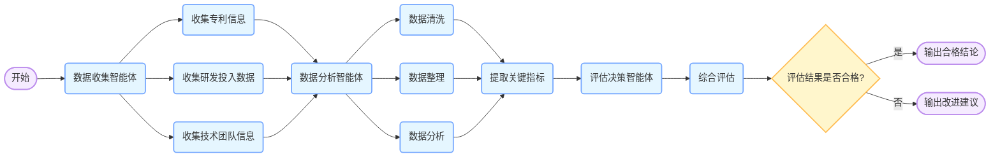

# 多智能体系统在评估公司技术壁垒中的应用

> 关键词：多智能体系统、公司技术壁垒、评估模型、技术创新、竞争优势

> 摘要：本文深入探讨了多智能体系统在评估公司技术壁垒中的应用。首先介绍了研究的背景、目的、预期读者等内容，接着阐述了多智能体系统和公司技术壁垒的核心概念及联系。详细讲解了核心算法原理与具体操作步骤，通过数学模型和公式对评估过程进行了深入分析，并给出了具体的举例说明。在项目实战部分，提供了开发环境搭建、源代码实现与解读。分析了多智能体系统在评估公司技术壁垒中的实际应用场景，推荐了相关的学习资源、开发工具框架以及论文著作。最后总结了未来发展趋势与挑战，解答了常见问题并列出了参考资料，旨在为相关领域的研究和实践提供全面且深入的参考。

## 1. 背景介绍 
### 1.1 目的和范围
在当今竞争激烈的商业环境中，公司的技术壁垒是其保持竞争优势的关键因素之一。准确评估公司的技术壁垒有助于投资者做出明智的投资决策，帮助公司管理层了解自身的技术实力和市场地位，也为行业分析和政策制定提供重要依据。本研究的目的在于探讨如何利用多智能体系统这一先进的技术手段来评估公司的技术壁垒。研究范围涵盖了多智能体系统的基本原理、算法实现，以及如何将其应用于公司技术壁垒的评估过程，包括相关的数据处理、模型构建和结果分析等方面。

### 1.2 预期读者
本文预期读者包括对多智能体系统和公司技术评估感兴趣的研究人员、学者，从事投资决策的专业人士，公司的管理层和技术人员，以及相关领域的政策制定者。对于研究人员和学者，本文可提供新的研究思路和方法；对于投资人士，有助于其更准确地评估投资目标的技术价值；公司管理层和技术人员可从中了解自身技术实力的评估方法，以便制定合理的技术发展战略；政策制定者则可依据相关结论制定更有效的产业政策。

### 1.3 文档结构概述
本文共分为十个部分。第一部分为背景介绍，阐述了研究的目的、范围、预期读者和文档结构概述，并给出了相关的术语表。第二部分介绍多智能体系统和公司技术壁垒的核心概念与联系，包括原理和架构的文本示意图及 Mermaid 流程图。第三部分讲解核心算法原理和具体操作步骤，通过 Python 源代码详细阐述。第四部分给出数学模型和公式，并进行详细讲解和举例说明。第五部分是项目实战，包括开发环境搭建、源代码详细实现和代码解读。第六部分分析实际应用场景。第七部分推荐相关的工具和资源，包括学习资源、开发工具框架和论文著作。第八部分总结未来发展趋势与挑战。第九部分为附录，解答常见问题。第十部分列出扩展阅读和参考资料。

### 1.4 术语表
#### 1.4.1 核心术语定义
- **多智能体系统（Multi - Agent System，MAS）**：由多个自主的智能体组成的系统，这些智能体能够感知环境、进行决策并采取行动，通过相互协作和交互来完成共同的任务或实现特定的目标。
- **公司技术壁垒**：指公司在技术领域所具备的独特优势和障碍，使得其他竞争对手难以模仿或超越，包括技术专利、技术诀窍、技术团队的专业能力等方面。
- **智能体（Agent）**：在多智能体系统中，具有自主性、反应性、社会性和主动性等特征的实体，能够根据自身的知识和目标进行决策和行动。

#### 1.4.2 相关概念解释
- **自主性**：智能体能够在没有外部直接干预的情况下独立地进行决策和行动。
- **反应性**：智能体能够感知周围环境的变化，并及时做出相应的反应。
- **社会性**：智能体能够与其他智能体进行交互和协作，以实现共同的目标。
- **主动性**：智能体能够主动地发起行动，以追求自身的目标。

#### 1.4.3 缩略词列表
- **MAS**：Multi - Agent System（多智能体系统）
- **AI**：Artificial Intelligence（人工智能）
- **ML**：Machine Learning（机器学习）

## 2. 核心概念与联系 

### 2.1 多智能体系统原理
多智能体系统的基本原理基于分布式人工智能的思想，将复杂的任务分解为多个子任务，由不同的智能体来承担。每个智能体都有自己的知识、目标和能力，通过与其他智能体的交互和协作来完成整个任务。智能体之间的交互方式包括通信、协调和合作等。通信是指智能体之间交换信息的过程；协调是指智能体之间调整各自的行为，以避免冲突和提高效率；合作是指智能体共同努力，以实现共同的目标。

### 2.2 公司技术壁垒的构成
公司技术壁垒主要由以下几个方面构成：
- **技术专利**：公司拥有的受法律保护的技术发明，其他公司未经授权不得使用，这是一种重要的技术壁垒形式。
- **技术诀窍**：公司在长期的生产和研发过程中积累的独特的技术经验和方法，这些诀窍通常是公司的核心竞争力之一。
- **技术团队的专业能力**：公司技术团队的专业知识、技能和创新能力是形成技术壁垒的关键因素，高素质的技术团队能够不断推动公司的技术进步。
- **技术研发投入**：持续的技术研发投入能够保证公司不断推出新的技术和产品，维持和提升技术壁垒。

### 2.3 多智能体系统与公司技术壁垒评估的联系
多智能体系统可以应用于公司技术壁垒的评估过程中。通过构建不同类型的智能体，如数据收集智能体、数据分析智能体、评估决策智能体等，来完成技术壁垒评估的各个环节。数据收集智能体负责收集与公司技术壁垒相关的数据，如专利信息、研发投入数据等；数据分析智能体对收集到的数据进行分析和处理，提取有价值的信息；评估决策智能体根据分析结果进行综合评估，得出公司技术壁垒的评估结论。

### 2.4 核心概念原理和架构的文本示意图
多智能体系统在评估公司技术壁垒中的架构可以描述为：多个智能体分布在不同的层次和模块中。最底层是数据收集层，由数据收集智能体负责从各种数据源（如专利数据库、公司财务报表等）收集相关数据。中间层是数据分析层，数据分析智能体对收集到的数据进行清洗、整理和分析，提取关键指标。最上层是评估决策层，评估决策智能体根据分析结果和预设的评估模型进行综合评估，输出公司技术壁垒的评估结果。

### 2.5 Mermaid 流程图


## 3. 核心算法原理 & 具体操作步骤 

### 3.1 核心算法原理
在多智能体系统评估公司技术壁垒的过程中，主要涉及到数据挖掘算法、机器学习算法和决策算法等。数据挖掘算法用于从海量的数据中提取有价值的信息，如关联规则挖掘、聚类分析等。机器学习算法用于对数据进行建模和预测，如回归分析、分类算法等。决策算法用于根据分析结果进行综合评估和决策，如层次分析法、模糊综合评价法等。

### 3.2 具体操作步骤

#### 3.2.1 数据收集
使用数据收集智能体从各种数据源收集与公司技术壁垒相关的数据，包括：
- **专利数据库**：收集公司的专利数量、专利类型、专利引用次数等信息。
- **公司财务报表**：收集公司的研发投入金额、研发投入占比等信息。
- **人力资源数据库**：收集技术团队的人员数量、人员学历、人员职称等信息。

#### 3.2.2 数据预处理
使用数据分析智能体对收集到的数据进行预处理，包括：
- **数据清洗**：去除数据中的噪声、重复数据和缺失值。
- **数据归一化**：将不同类型的数据进行归一化处理，使其具有相同的尺度。
- **特征提取**：从预处理后的数据中提取关键特征，作为评估的输入。

#### 3.2.3 模型训练
使用机器学习算法对提取的特征进行模型训练，例如：
- **回归分析**：建立研发投入与技术创新成果之间的回归模型，预测技术创新的趋势。
- **分类算法**：将公司分为不同的技术壁垒等级，如高、中、低等级。

#### 3.2.4 综合评估
使用评估决策智能体根据模型训练结果和预设的评估模型进行综合评估，例如：
- **层次分析法**：确定各个评估指标的权重，计算公司技术壁垒的综合得分。
- **模糊综合评价法**：考虑评估指标的模糊性，对公司技术壁垒进行综合评价。

### 3.3 Python 源代码详细阐述

```python
import pandas as pd
from sklearn.preprocessing import MinMaxScaler
from sklearn.linear_model import LinearRegression
from sklearn.model_selection import train_test_split
from sklearn.metrics import mean_squared_error
import numpy as np

# 数据收集（模拟）
def collect_data():
    # 模拟专利信息
    patent_data = {
        'company_id': [1, 2, 3],
        'patent_count': [10, 20, 15],
        'patent_citations': [50, 80, 60]
    }
    patent_df = pd.DataFrame(patent_data)

    # 模拟研发投入信息
    rnd_data = {
        'company_id': [1, 2, 3],
        'rnd_investment': [100000, 200000, 150000]
    }
    rnd_df = pd.DataFrame(rnd_data)

    # 合并数据
    merged_df = pd.merge(patent_df, rnd_df, on='company_id')
    return merged_df

# 数据预处理
def preprocess_data(data):
    # 数据清洗（去除缺失值）
    data = data.dropna()

    # 数据归一化
    scaler = MinMaxScaler()
    features = data[['patent_count', 'patent_citations', 'rnd_investment']]
    normalized_features = scaler.fit_transform(features)

    return normalized_features

# 模型训练（线性回归）
def train_model(features, target):
    X_train, X_test, y_train, y_test = train_test_split(features, target, test_size=0.2, random_state=42)
    model = LinearRegression()
    model.fit(X_train, y_train)
    y_pred = model.predict(X_test)
    mse = mean_squared_error(y_test, y_pred)
    print(f"Mean Squared Error: {mse}")
    return model

# 综合评估（简单示例）
def comprehensive_evaluation(model, features):
    scores = model.predict(features)
    # 简单划分等级
    levels = []
    for score in scores:
        if score > 0.8:
            levels.append('高')
        elif score > 0.5:
            levels.append('中')
        else:
            levels.append('低')
    return levels

# 主函数
def main():
    data = collect_data()
    features = preprocess_data(data)
    # 假设目标变量是技术创新成果（模拟）
    target = np.random.rand(len(features))
    model = train_model(features, target)
    levels = comprehensive_evaluation(model, features)
    print("公司技术壁垒等级：", levels)

if __name__ == "__main__":
    main()
```

## 4. 数学模型和公式 & 详细讲解 & 举例说明 

### 4.1 线性回归模型
线性回归是一种常用的机器学习算法，用于建立自变量和因变量之间的线性关系。其数学模型可以表示为：

$$y = \beta_0 + \beta_1x_1 + \beta_2x_2 + \cdots + \beta_nx_n + \epsilon$$

其中，$y$ 是因变量，$x_1, x_2, \cdots, x_n$ 是自变量，$\beta_0, \beta_1, \cdots, \beta_n$ 是回归系数，$\epsilon$ 是误差项。

### 4.2 详细讲解
在多智能体系统评估公司技术壁垒的过程中，线性回归模型可以用于建立研发投入、专利数量等自变量与技术创新成果等因变量之间的关系。通过最小化误差项的平方和来估计回归系数，即：

$$\min_{\beta_0, \beta_1, \cdots, \beta_n} \sum_{i=1}^{m} (y_i - (\beta_0 + \beta_1x_{i1} + \beta_2x_{i2} + \cdots + \beta_nx_{in}))^2$$

其中，$m$ 是样本数量，$y_i$ 是第 $i$ 个样本的因变量值，$x_{i1}, x_{i2}, \cdots, x_{in}$ 是第 $i$ 个样本的自变量值。

### 4.3 举例说明
假设我们有以下数据：

| 公司编号 | 专利数量 ($x_1$) | 研发投入 ($x_2$) | 技术创新成果 ($y$) |
|---|---|---|---|
| 1 | 10 | 100000 | 0.6 |
| 2 | 20 | 200000 | 0.8 |
| 3 | 15 | 150000 | 0.7 |

我们可以使用线性回归模型来建立 $x_1$、$x_2$ 与 $y$ 之间的关系。通过求解上述最小化问题，得到回归系数 $\beta_0$、$\beta_1$ 和 $\beta_2$。假设求解结果为 $\beta_0 = 0.1$，$\beta_1 = 0.01$，$\beta_2 = 0.000001$，则线性回归方程为：

$$y = 0.1 + 0.01x_1 + 0.000001x_2$$

对于一个新的公司，其专利数量为 18，研发投入为 180000，我们可以使用该方程预测其技术创新成果：

$$y = 0.1 + 0.01 \times 18 + 0.000001 \times 180000 = 0.76$$

### 4.4 层次分析法
层次分析法（Analytic Hierarchy Process，AHP）是一种用于确定评估指标权重的方法。其基本步骤包括：
1. **建立层次结构模型**：将评估问题分解为目标层、准则层和方案层。
2. **构造判断矩阵**：对同一层次的元素进行两两比较，确定相对重要性。
3. **计算权重向量**：求解判断矩阵的特征向量，得到各元素的权重。
4. **一致性检验**：检验判断矩阵的一致性，确保权重的合理性。

#### 4.4.1 数学公式
判断矩阵 $A = (a_{ij})_{n \times n}$ 满足 $a_{ij} > 0$，$a_{ji} = \frac{1}{a_{ij}}$，$a_{ii} = 1$。权重向量 $W = (w_1, w_2, \cdots, w_n)^T$ 满足：

$$AW = \lambda_{max}W$$

其中，$\lambda_{max}$ 是判断矩阵 $A$ 的最大特征值。

一致性指标 $CI$ 定义为：

$$CI = \frac{\lambda_{max} - n}{n - 1}$$

随机一致性指标 $RI$ 是一个与矩阵阶数 $n$ 有关的常数。一致性比率 $CR$ 定义为：

$$CR = \frac{CI}{RI}$$

当 $CR < 0.1$ 时，认为判断矩阵具有满意的一致性。

#### 4.4.2 举例说明
假设我们要评估公司技术壁垒的三个指标：专利数量、研发投入、技术团队实力。构造判断矩阵如下：

$$A = \begin{bmatrix}
1 & 3 & 2 \\
\frac{1}{3} & 1 & \frac{1}{2} \\
\frac{1}{2} & 2 & 1
\end{bmatrix}$$

计算最大特征值 $\lambda_{max} = 3.0385$，$CI = \frac{3.0385 - 3}{3 - 1} = 0.01925$。对于 $n = 3$，$RI = 0.58$，$CR = \frac{0.01925}{0.58} \approx 0.0332 < 0.1$，判断矩阵具有满意的一致性。求解特征向量得到权重向量 $W = (0.5396, 0.1634, 0.2970)^T$，即专利数量、研发投入、技术团队实力的权重分别为 0.5396、0.1634、0.2970。

## 5. 项目实战：代码实际案例和详细解释说明 

### 5.1  开发环境搭建
#### 5.1.1 操作系统
可以选择 Windows、Linux 或 macOS 操作系统。本案例以 Windows 10 为例。

#### 5.1.2 Python 环境
安装 Python 3.7 或以上版本。可以从 Python 官方网站（https://www.python.org/downloads/）下载安装包进行安装。安装过程中注意勾选“Add Python to PATH”选项，以便在命令行中可以直接使用 Python 命令。

#### 5.1.3 安装依赖库
使用以下命令安装所需的依赖库：

```sh
pip install pandas scikit-learn numpy
```

### 5.2  源代码详细实现和代码解读

```python
import pandas as pd
from sklearn.preprocessing import MinMaxScaler
from sklearn.linear_model import LinearRegression
from sklearn.model_selection import train_test_split
from sklearn.metrics import mean_squared_error
import numpy as np

# 数据收集（模拟）
def collect_data():
    # 模拟专利信息
    patent_data = {
        'company_id': [1, 2, 3],
        'patent_count': [10, 20, 15],
        'patent_citations': [50, 80, 60]
    }
    patent_df = pd.DataFrame(patent_data)

    # 模拟研发投入信息
    rnd_data = {
        'company_id': [1, 2, 3],
        'rnd_investment': [100000, 200000, 150000]
    }
    rnd_df = pd.DataFrame(rnd_data)

    # 合并数据
    merged_df = pd.merge(patent_df, rnd_df, on='company_id')
    return merged_df

# 数据预处理
def preprocess_data(data):
    # 数据清洗（去除缺失值）
    data = data.dropna()

    # 数据归一化
    scaler = MinMaxScaler()
    features = data[['patent_count', 'patent_citations', 'rnd_investment']]
    normalized_features = scaler.fit_transform(features)

    return normalized_features

# 模型训练（线性回归）
def train_model(features, target):
    X_train, X_test, y_train, y_test = train_test_split(features, target, test_size=0.2, random_state=42)
    model = LinearRegression()
    model.fit(X_train, y_train)
    y_pred = model.predict(X_test)
    mse = mean_squared_error(y_test, y_pred)
    print(f"Mean Squared Error: {mse}")
    return model

# 综合评估（简单示例）
def comprehensive_evaluation(model, features):
    scores = model.predict(features)
    # 简单划分等级
    levels = []
    for score in scores:
        if score > 0.8:
            levels.append('高')
        elif score > 0.5:
            levels.append('中')
        else:
            levels.append('低')
    return levels

# 主函数
def main():
    data = collect_data()
    features = preprocess_data(data)
    # 假设目标变量是技术创新成果（模拟）
    target = np.random.rand(len(features))
    model = train_model(features, target)
    levels = comprehensive_evaluation(model, features)
    print("公司技术壁垒等级：", levels)

if __name__ == "__main__":
    main()
```

#### 5.2.1 代码解读
- **数据收集**：`collect_data` 函数模拟了数据收集的过程，生成了专利信息和研发投入信息的 DataFrame，并将它们合并为一个 DataFrame 返回。
- **数据预处理**：`preprocess_data` 函数对收集到的数据进行预处理，包括去除缺失值和数据归一化。使用 `MinMaxScaler` 对特征进行归一化处理，将特征值缩放到 0 到 1 之间。
- **模型训练**：`train_model` 函数使用线性回归模型对数据进行训练。将数据分为训练集和测试集，使用训练集训练模型，使用测试集评估模型的性能，计算均方误差（MSE）。
- **综合评估**：`comprehensive_evaluation` 函数根据模型的预测结果，将公司的技术壁垒分为高、中、低三个等级。
- **主函数**：`main` 函数调用上述函数，完成数据收集、预处理、模型训练和综合评估的整个流程，并输出公司技术壁垒的等级。

### 5.3  代码解读与分析
#### 5.3.1 优点
- **简单易懂**：代码结构清晰，使用了常见的 Python 库和机器学习算法，易于理解和实现。
- **模块化设计**：将不同的功能封装在不同的函数中，提高了代码的可维护性和可扩展性。
- **数据预处理**：对数据进行了清洗和归一化处理，有助于提高模型的性能。

#### 5.3.2 缺点
- **数据模拟**：代码中使用了模拟数据，实际应用中需要从真实的数据源中收集数据。
- **模型简单**：使用了简单的线性回归模型，可能无法准确地反映公司技术壁垒的复杂关系。可以考虑使用更复杂的机器学习算法，如神经网络、随机森林等。
- **评估方法简单**：综合评估部分只是简单地根据预测结果划分等级，缺乏更科学的评估方法。可以结合层次分析法、模糊综合评价法等方法进行综合评估。

## 6. 实际应用场景 
### 6.1 投资决策
在投资领域，投资者可以使用多智能体系统评估公司的技术壁垒，以确定是否对该公司进行投资。通过评估公司的技术专利、研发投入、技术团队实力等方面，投资者可以更准确地了解公司的技术实力和市场竞争力，从而做出更明智的投资决策。例如，对于一家拥有大量高质量专利和强大技术团队的公司，其技术壁垒较高，投资风险相对较低，可能更值得投资。

### 6.2 公司战略规划
公司管理层可以利用多智能体系统评估自身的技术壁垒，了解公司在行业中的技术地位。根据评估结果，公司可以制定合理的技术发展战略，加大研发投入，加强技术团队建设，以提升公司的技术壁垒。例如，如果评估结果显示公司在某些关键技术领域的专利数量较少，公司可以加大在这些领域的研发投入，申请更多的专利，提高技术壁垒。

### 6.3 行业分析
行业分析师可以使用多智能体系统对整个行业的公司技术壁垒进行评估和分析，了解行业的技术发展趋势和竞争格局。通过比较不同公司的技术壁垒，分析师可以发现行业中的领先企业和潜在的竞争对手，为行业的发展提供参考。例如，在分析某个新兴技术行业时，分析师可以通过评估公司的技术壁垒，预测哪些公司将在未来的竞争中占据优势。

### 6.4 政策制定
政府部门可以根据多智能体系统对公司技术壁垒的评估结果，制定相关的产业政策。对于技术壁垒较高的公司，政府可以给予更多的政策支持，鼓励其继续创新和发展；对于技术壁垒较低的公司，政府可以引导其加强技术研发，提高技术水平。例如，政府可以出台税收优惠政策，鼓励公司加大研发投入，提高技术壁垒。

## 7. 工具和资源推荐
### 7.1 学习资源推荐
#### 7.1.1 书籍推荐
- 《多智能体系统：原理与应用》：全面介绍了多智能体系统的基本原理、算法和应用，是学习多智能体系统的经典教材。
- 《机器学习》：由周志华教授编写，系统地介绍了机器学习的基本概念、算法和应用，对于理解多智能体系统中的机器学习算法有很大帮助。
- 《人工智能：一种现代的方法》：涵盖了人工智能的各个领域，包括多智能体系统、机器学习、自然语言处理等，是人工智能领域的权威著作。

#### 7.1.2 在线课程
- Coursera 上的“Artificial Intelligence”课程：由斯坦福大学的 Sebastian Thrun 教授讲授，介绍了人工智能的基本概念和算法，包括多智能体系统。
- edX 上的“Machine Learning”课程：由吴恩达教授讲授，深入讲解了机器学习的各种算法和应用。
- 中国大学 MOOC 上的“多智能体系统”课程：由国内知名高校的教师讲授，结合实际案例介绍了多智能体系统的原理和应用。

#### 7.1.3 技术博客和网站
- Medium 上的 AI 相关博客：有很多关于多智能体系统、机器学习等领域的最新研究成果和实践经验分享。
- arXiv 网站：提供了大量的学术论文，包括多智能体系统、人工智能等领域的前沿研究。
- 开源中国：有很多关于人工智能和多智能体系统的技术文章和项目分享。

### 7.2 开发工具框架推荐
#### 7.2.1 IDE和编辑器
- PyCharm：是一款专业的 Python 集成开发环境，提供了丰富的代码编辑、调试和项目管理功能，适合开发多智能体系统相关的 Python 代码。
- Visual Studio Code：是一款轻量级的代码编辑器，支持多种编程语言，有丰富的插件扩展功能，可以方便地进行 Python 开发。
- Jupyter Notebook：是一个交互式的开发环境，适合进行数据探索、模型训练和可视化等工作，对于多智能体系统的实验和研究非常有用。

#### 7.2.2 调试和性能分析工具
- PDB：Python 内置的调试器，可以帮助开发者定位代码中的错误。
- cProfile：Python 标准库中的性能分析工具，可以分析代码的运行时间和函数调用次数，帮助优化代码性能。
- Py-Spy：是一个跨平台的 Python 性能分析工具，可以实时监测 Python 程序的性能。

#### 7.2.3 相关框架和库
- Mesa：是一个用于构建基于智能体的模型的 Python 框架，提供了丰富的智能体和环境类，方便开发者快速搭建多智能体系统。
- NetworkX：是一个用于创建、操作和研究复杂网络的 Python 库，可以用于模拟智能体之间的交互和网络结构。
- Scikit-learn：是一个常用的机器学习库，提供了各种机器学习算法和工具，方便进行数据处理、模型训练和评估。

### 7.3 相关论文著作推荐
#### 7.3.1 经典论文
- “Multi - Agent Systems: A Modern Approach to Distributed Artificial Intelligence”：该论文全面介绍了多智能体系统的基本概念、理论和应用，是多智能体系统领域的经典之作。
- “A Mathematical Theory of Communication”：香农的这篇论文奠定了信息论的基础，对于理解多智能体系统中的信息传递和通信有重要意义。
- “The Nature of Code”：介绍了自然计算和人工智能的基本概念和算法，对于多智能体系统的建模和设计有一定的启发作用。

#### 7.3.2 最新研究成果
- 关注 AAAI（Association for the Advancement of Artificial Intelligence）、IJCAI（International Joint Conference on Artificial Intelligence）等人工智能领域的顶级学术会议，这些会议上会有很多关于多智能体系统的最新研究成果。
- 阅读《Journal of Artificial Intelligence Research》、《Artificial Intelligence》等学术期刊上的相关论文，了解多智能体系统的前沿研究动态。

#### 7.3.3 应用案例分析
- 分析一些实际的多智能体系统应用案例，如智能交通系统、供应链管理系统等，了解多智能体系统在不同领域的应用方法和效果。
- 研究一些知名公司在多智能体系统方面的应用实践，如谷歌的自动驾驶汽车、亚马逊的物流配送系统等，学习其先进的技术和管理经验。

## 8. 总结：未来发展趋势与挑战
### 8.1 未来发展趋势
#### 8.1.1 与其他技术的融合
多智能体系统将与物联网、大数据、区块链等技术深度融合。例如，在物联网环境中，多个智能设备可以作为智能体进行交互和协作，实现更智能的家居控制、工业自动化等应用。大数据技术可以为多智能体系统提供更丰富的数据支持，帮助智能体做出更准确的决策。区块链技术可以保证多智能体系统中信息的安全性和可信度。

#### 8.1.2 强化学习的应用
强化学习将在多智能体系统中得到更广泛的应用。智能体可以通过与环境的交互和试错，不断学习和优化自己的行为策略，以实现更好的性能和目标。例如，在机器人控制、游戏等领域，强化学习可以帮助智能体快速适应环境变化，提高决策能力。

#### 8.1.3 面向复杂系统的应用
多智能体系统将更多地应用于复杂系统的建模和管理，如社会经济系统、生态系统等。通过模拟智能体之间的交互和行为，可以更好地理解复杂系统的运行机制和演化规律，为政策制定和决策提供支持。

### 8.2 挑战
#### 8.2.1 智能体的协作与协调
在多智能体系统中，如何实现智能体之间的有效协作和协调是一个关键挑战。智能体可能具有不同的目标、知识和能力，需要设计合理的协作机制和算法，以避免冲突和提高整体性能。

#### 8.2.2 数据隐私和安全
随着多智能体系统的广泛应用，数据隐私和安全问题日益突出。智能体在交互过程中需要交换大量的数据，如何保证这些数据的隐私性和安全性是一个亟待解决的问题。需要采用先进的加密技术和安全机制，保护数据不被泄露和篡改。

#### 8.2.3 可解释性和可信度
多智能体系统的决策过程往往比较复杂，缺乏可解释性和可信度。在一些关键应用领域，如医疗、金融等，需要智能体的决策过程能够被解释和理解，以保证决策的可靠性和安全性。因此，如何提高多智能体系统的可解释性和可信度是一个重要的研究方向。

## 9. 附录：常见问题与解答
### 9.1 多智能体系统和传统的人工智能系统有什么区别？
传统的人工智能系统通常是集中式的，由一个中央控制器来进行决策和控制。而多智能体系统是分布式的，由多个自主的智能体组成，这些智能体通过相互协作和交互来完成任务。多智能体系统具有更强的灵活性、适应性和可扩展性，能够更好地处理复杂的问题。

### 9.2 如何选择合适的评估指标来评估公司的技术壁垒？
选择评估指标时，需要考虑公司的行业特点、技术发展阶段和战略目标等因素。一般来说，可以从技术专利、研发投入、技术团队实力、技术创新成果等方面选择评估指标。同时，还可以结合专家意见和行业标准，确定各个评估指标的权重。

### 9.3 多智能体系统在评估公司技术壁垒时的准确性如何保证？
为了保证多智能体系统在评估公司技术壁垒时的准确性，可以采取以下措施：
- **数据质量**：确保收集到的数据准确、完整、可靠。可以通过多种数据源进行数据收集，并进行数据清洗和验证。
- **模型选择**：选择合适的评估模型和算法，根据数据特点和评估需求进行模型训练和优化。
- **验证和校准**：使用历史数据或实际案例对评估模型进行验证和校准，不断调整模型参数，提高评估的准确性。

### 9.4 多智能体系统的开发难度大吗？
多智能体系统的开发难度相对较大，需要掌握多智能体系统的基本原理、算法和相关的编程技术。同时，还需要考虑智能体之间的交互和协作机制，以及系统的可扩展性和性能优化等问题。但是，随着相关技术的不断发展和工具的不断完善，开发难度也在逐渐降低。可以通过学习相关的知识和实践经验，逐步掌握多智能体系统的开发技术。

## 10. 扩展阅读 & 参考资料
### 10.1 扩展阅读
- 《智能系统中的模糊逻辑、神经网络和机器学习》：介绍了模糊逻辑、神经网络和机器学习等智能技术的基本原理和应用，对于理解多智能体系统中的智能算法有帮助。
- 《复杂系统建模与仿真》：讲解了复杂系统的建模和仿真方法，对于多智能体系统在复杂系统中的应用有一定的参考价值。
- 《分布式人工智能》：深入探讨了分布式人工智能的理论和方法，包括多智能体系统的通信、协调和合作等方面。

### 10.2 参考资料
- 相关的学术论文和研究报告，可以从学术数据库（如 IEEE Xplore、ACM Digital Library 等）中获取。
- 行业报告和统计数据，可以从行业协会、市场研究机构等获取。
- 开源项目和代码库，可以从 GitHub 等开源平台上查找相关的多智能体系统和公司技术评估的项目。