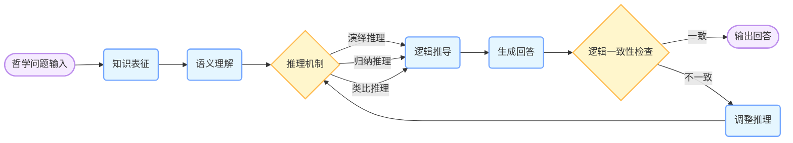

# 大模型在哲学思辨推理中的逻辑一致性分析

> 关键词：大模型、哲学思辨推理、逻辑一致性、人工智能、知识表征、推理机制、语义理解

> 摘要：本文聚焦于大模型在哲学思辨推理中的逻辑一致性问题。随着人工智能技术的飞速发展，大模型在自然语言处理等领域取得了显著成就，然而其在处理哲学思辨这类复杂推理任务时的逻辑表现仍有待深入研究。文章首先介绍了研究的背景、目的和范围，阐述了相关核心概念及其联系。接着详细分析了大模型的核心算法原理和具体操作步骤，结合数学模型和公式进行理论阐释。通过项目实战展示了大模型在哲学思辨推理中的实际应用，并深入解读代码。探讨了大模型在哲学领域的实际应用场景，推荐了相关的学习资源、开发工具和论文著作。最后总结了大模型在哲学思辨推理中逻辑一致性的未来发展趋势与挑战，为进一步的研究提供参考。

## 1. 背景介绍 
### 1.1 目的和范围
随着大语言模型如GPT - 3、GPT - 4、文心一言等的出现，人工智能在自然语言处理方面取得了巨大的进步。这些大模型能够生成连贯的文本、回答问题、进行对话等。然而，哲学思辨推理是一个高度复杂且抽象的领域，涉及到概念的精确理解、逻辑的严密推导以及价值观的深度思考。本研究的目的在于深入分析大模型在哲学思辨推理过程中的逻辑一致性，评估其在处理哲学问题时是否能够遵循逻辑规则，推导出合理的结论。研究范围涵盖了大模型在不同哲学领域（如形而上学、认识论、伦理学等）的应用，以及其在处理不同类型哲学问题（如概念分析、论证评估、思想实验等）时的逻辑表现。

### 1.2 预期读者
本文预期读者包括人工智能领域的研究人员、哲学家、对人工智能与哲学交叉领域感兴趣的学者、学生以及相关技术从业者。对于人工智能研究人员，本文将提供关于大模型在复杂推理任务中逻辑表现的深入分析，有助于他们改进模型的设计和训练。对于哲学家来说，了解大模型在哲学思辨推理中的能力和局限性，能够为哲学研究方法的创新提供新的视角。学生和相关技术从业者可以通过本文了解大模型在哲学领域的应用现状和发展趋势，拓宽知识视野。

### 1.3 文档结构概述
本文共分为十个部分。第一部分为背景介绍，阐述了研究的目的、范围、预期读者和文档结构概述，并对相关术语进行解释。第二部分介绍大模型和哲学思辨推理的核心概念，以及它们之间的联系，同时给出文本示意图和Mermaid流程图。第三部分详细讲解大模型的核心算法原理和具体操作步骤，通过Python源代码进行说明。第四部分介绍大模型在哲学思辨推理中涉及的数学模型和公式，并进行详细讲解和举例说明。第五部分通过项目实战，展示大模型在哲学思辨推理中的代码实现和详细解释。第六部分探讨大模型在哲学领域的实际应用场景。第七部分推荐相关的学习资源、开发工具和论文著作。第八部分总结大模型在哲学思辨推理中逻辑一致性的未来发展趋势与挑战。第九部分为附录，解答常见问题。第十部分提供扩展阅读和参考资料。

### 1.4 术语表
#### 1.4.1 核心术语定义
- **大模型**：指基于深度学习的大规模神经网络模型，通常具有数十亿甚至数万亿的参数，能够处理自然语言处理、图像识别等复杂任务。
- **哲学思辨推理**：指在哲学研究中，通过对概念、命题的分析和论证，运用逻辑规则进行推理，以获得对哲学问题的深入理解和解答。
- **逻辑一致性**：指在推理过程中，各个命题之间遵循逻辑规则，不产生矛盾，能够形成一个连贯的逻辑体系。

#### 1.4.2 相关概念解释
- **知识表征**：指将知识以计算机能够处理的形式进行表示，如符号表示、向量表示等。在大模型中，知识表征是实现推理的基础。
- **推理机制**：指大模型在处理问题时，根据输入的信息和已有的知识，运用一定的规则进行推理，得出结论的过程。
- **语义理解**：指大模型对自然语言文本的含义进行理解，包括词汇、句子和篇章的语义分析。

#### 1.4.3 缩略词列表
- **NLP**：Natural Language Processing，自然语言处理
- **DNN**：Deep Neural Network，深度神经网络
- **Transformer**：一种基于注意力机制的深度学习模型架构

## 2. 核心概念与联系 

### 核心概念原理
#### 大模型
大模型通常基于深度学习技术，以Transformer架构为基础。Transformer架构通过自注意力机制（Self - Attention）能够捕捉输入序列中不同位置之间的依赖关系，从而更好地处理长序列数据。大模型的训练过程通常采用无监督学习或有监督学习的方法，利用大规模的文本数据进行训练，以学习语言的模式和规律。在训练过程中，模型通过不断调整参数，最小化预测结果与真实结果之间的误差，从而提高模型的性能。

#### 哲学思辨推理
哲学思辨推理是一种基于逻辑和理性的思考方式。它包括对哲学概念的分析、对哲学命题的论证、对思想实验的探讨等。哲学思辨推理的过程通常遵循一定的逻辑规则，如演绎推理、归纳推理、类比推理等。在哲学研究中，通过思辨推理可以深入探讨哲学问题的本质，提出新的观点和理论。

### 架构的文本示意图
大模型与哲学思辨推理的联系可以用以下文本示意图表示：

大模型接收哲学问题作为输入，通过知识表征将问题转化为模型能够处理的形式。在模型内部，利用推理机制进行推理，推理过程中需要对输入的语义进行理解。模型根据已学习的知识和逻辑规则，生成对哲学问题的回答。回答的质量取决于大模型的逻辑一致性，即回答是否符合哲学思辨推理的逻辑规则。

### Mermaid流程图


## 3. 核心算法原理 & 具体操作步骤 

### 核心算法原理
大模型的核心算法通常基于Transformer架构，下面我们详细介绍Transformer的原理。

Transformer由编码器（Encoder）和解码器（Decoder）组成。编码器的作用是对输入的序列进行特征提取，解码器则根据编码器的输出生成目标序列。

#### 自注意力机制
自注意力机制是Transformer的核心。它允许模型在处理输入序列时，关注序列中不同位置的信息。给定输入序列 $X = [x_1, x_2, \cdots, x_n]$，自注意力机制的计算步骤如下：

1. 计算查询（Query）、键（Key）和值（Value）矩阵：
    - $Q = XW_Q$
    - $K = XW_K$
    - $V = XW_V$
    其中，$W_Q$、$W_K$ 和 $W_V$ 是可学习的权重矩阵。

2. 计算注意力分数：
    - $scores = \text{softmax}(\frac{QK^T}{\sqrt{d_k}})$
    其中，$d_k$ 是查询和键的维度。

3. 计算注意力输出：
    - $output = scoresV$

#### 多头注意力机制
为了让模型能够捕捉不同方面的信息，Transformer采用了多头注意力机制。多头注意力机制将自注意力机制并行执行多次，然后将结果拼接起来。

### 具体操作步骤
以下是使用Python和PyTorch实现一个简单的自注意力机制的代码示例：

```python
import torch
import torch.nn as nn

class SelfAttention(nn.Module):
    def __init__(self, input_dim, d_k):
        super(SelfAttention, self).__init__()
        self.input_dim = input_dim
        self.d_k = d_k
        self.W_q = nn.Linear(input_dim, d_k)
        self.W_k = nn.Linear(input_dim, d_k)
        self.W_v = nn.Linear(input_dim, d_k)
        self.softmax = nn.Softmax(dim=-1)

    def forward(self, X):
        Q = self.W_q(X)
        K = self.W_k(X)
        V = self.W_v(X)
        scores = torch.matmul(Q, K.transpose(-2, -1)) / (self.d_k ** 0.5)
        attention_weights = self.softmax(scores)
        output = torch.matmul(attention_weights, V)
        return output

# 示例使用
input_dim = 10
d_k = 5
X = torch.randn(3, 4, input_dim)  # 输入序列，batch_size = 3, sequence_length = 4, input_dim = 10
self_attention = SelfAttention(input_dim, d_k)
output = self_attention(X)
print(output.shape)
```

在这个代码示例中，我们定义了一个 `SelfAttention` 类，它继承自 `nn.Module`。在 `__init__` 方法中，我们初始化了查询、键和值的权重矩阵。在 `forward` 方法中，我们实现了自注意力机制的计算步骤。最后，我们创建了一个输入序列 `X`，并使用 `SelfAttention` 类进行计算，打印出输出的形状。

## 4. 数学模型和公式 & 详细讲解 & 举例说明 

### 自注意力机制的数学模型和公式
自注意力机制的核心公式如下：

#### 计算查询、键和值矩阵
$Q = XW_Q$
$K = XW_K$
$V = XW_V$

其中，$X \in \mathbb{R}^{n \times d}$ 是输入序列，$n$ 是序列的长度，$d$ 是输入的维度。$W_Q \in \mathbb{R}^{d \times d_k}$、$W_K \in \mathbb{R}^{d \times d_k}$ 和 $W_V \in \mathbb{R}^{d \times d_v}$ 是可学习的权重矩阵，$d_k$ 和 $d_v$ 分别是查询、键和值的维度。

#### 计算注意力分数
$scores = \text{softmax}(\frac{QK^T}{\sqrt{d_k}})$

$\text{softmax}$ 函数的定义为：
$\text{softmax}(x_i) = \frac{e^{x_i}}{\sum_{j=1}^{n} e^{x_j}}$

其中，$x_i$ 是输入向量的第 $i$ 个元素，$n$ 是向量的长度。

#### 计算注意力输出
$output = scoresV$

### 详细讲解
- **查询、键和值矩阵的计算**：通过将输入序列 $X$ 与权重矩阵 $W_Q$、$W_K$ 和 $W_V$ 相乘，得到查询、键和值矩阵。这些矩阵用于计算注意力分数。
- **注意力分数的计算**：将查询矩阵 $Q$ 与键矩阵 $K$ 的转置相乘，得到注意力分数。除以 $\sqrt{d_k}$ 是为了防止点积结果过大，导致梯度消失或爆炸。然后使用 $\text{softmax}$ 函数将注意力分数转换为概率分布。
- **注意力输出的计算**：将注意力分数矩阵与值矩阵 $V$ 相乘，得到注意力输出。注意力输出是输入序列的加权和，权重由注意力分数决定。

### 举例说明
假设输入序列 $X$ 是一个 $3 \times 4$ 的矩阵：
$$
X = 
\begin{bmatrix}
1 & 2 & 3 & 4 \\
5 & 6 & 7 & 8 \\
9 & 10 & 11 & 12
\end{bmatrix}
$$

$d_k = 2$，$W_Q$、$W_K$ 和 $W_V$ 分别是 $4 \times 2$ 的矩阵：
$$
W_Q = 
\begin{bmatrix}
0.1 & 0.2 \\
0.3 & 0.4 \\
0.5 & 0.6 \\
0.7 & 0.8
\end{bmatrix}
$$
$$
W_K = 
\begin{bmatrix}
0.9 & 1.0 \\
1.1 & 1.2 \\
1.3 & 1.4 \\
1.5 & 1.6
\end{bmatrix}
$$
$$
W_V = 
\begin{bmatrix}
1.7 & 1.8 \\
1.9 & 2.0 \\
2.1 & 2.2 \\
2.3 & 2.4
\end{bmatrix}
$$

首先计算查询矩阵 $Q$：
$$
Q = XW_Q = 
\begin{bmatrix}
1 & 2 & 3 & 4 \\
5 & 6 & 7 & 8 \\
9 & 10 & 11 & 12
\end{bmatrix}
\begin{bmatrix}
0.1 & 0.2 \\
0.3 & 0.4 \\
0.5 & 0.6 \\
0.7 & 0.8
\end{bmatrix}
= 
\begin{bmatrix}
5.0 & 6.0 \\
13.0 & 16.0 \\
21.0 & 26.0
\end{bmatrix}
$$

同理计算键矩阵 $K$ 和值矩阵 $V$。然后计算注意力分数：
$$
scores = \text{softmax}(\frac{QK^T}{\sqrt{d_k}})
$$

最后计算注意力输出：
$$
output = scoresV
$$

## 5. 项目实战：代码实际案例和详细解释说明 

### 5.1  开发环境搭建
#### 安装Python
首先确保你已经安装了Python 3.7或更高版本。你可以从Python官方网站（https://www.python.org/downloads/） 下载并安装Python。

#### 安装PyTorch
PyTorch是一个广泛使用的深度学习框架，我们将使用它来实现大模型。可以根据你的操作系统和CUDA版本选择合适的安装命令，例如：

```bash
pip install torch torchvision torchaudio
```

#### 安装其他依赖库
还需要安装一些其他的依赖库，如 `transformers` 库，用于加载预训练的大模型：

```bash
pip install transformers
```

### 5.2  源代码详细实现和代码解读
以下是一个使用Hugging Face的 `transformers` 库加载预训练的GPT - 2模型，并进行哲学思辨推理的代码示例：

```python
from transformers import GPT2LMHeadModel, GPT2Tokenizer

# 加载预训练的GPT - 2模型和分词器
tokenizer = GPT2Tokenizer.from_pretrained('gpt2')
model = GPT2LMHeadModel.from_pretrained('gpt2')

# 定义哲学问题
philosophical_question = "什么是幸福？"

# 对问题进行分词
input_ids = tokenizer.encode(philosophical_question, return_tensors='pt')

# 生成回答
output = model.generate(input_ids, max_length=100, num_return_sequences=1)

# 解码回答
answer = tokenizer.decode(output[0], skip_special_tokens=True)

print("问题：", philosophical_question)
print("回答：", answer)
```

### 代码解读与分析
- **加载预训练的模型和分词器**：使用 `GPT2Tokenizer.from_pretrained('gpt2')` 和 `GPT2LMHeadModel.from_pretrained('gpt2')` 分别加载GPT - 2的分词器和模型。
- **定义哲学问题**：定义一个哲学问题，如 “什么是幸福？”。
- **分词**：使用分词器对问题进行分词，将文本转换为模型能够处理的输入ID序列。
- **生成回答**：使用 `model.generate` 方法生成回答。`max_length` 参数指定生成的最大长度，`num_return_sequences` 参数指定生成的回答数量。
- **解码回答**：使用分词器将生成的ID序列解码为文本。

### 逻辑一致性分析
在这个代码示例中，我们可以看到大模型根据输入的哲学问题生成了一个回答。然而，大模型生成的回答的逻辑一致性需要进一步分析。大模型是基于大规模的文本数据进行训练的，它生成的回答可能受到训练数据的影响。在哲学思辨推理中，逻辑一致性要求回答符合哲学的逻辑规则和概念体系。因此，我们需要对大模型生成的回答进行人工评估，检查其是否存在逻辑矛盾、概念混淆等问题。

## 6. 实际应用场景 
### 哲学教育
大模型可以作为一种辅助工具，用于哲学教育。在课堂上，教师可以使用大模型提出哲学问题，让学生分析大模型生成的回答的逻辑一致性，从而培养学生的哲学思辨能力。例如，教师可以提出 “自由意志是否存在？” 这样的问题，让学生对大模型生成的回答进行讨论和批判。

### 哲学研究
大模型可以为哲学研究提供新的思路和方法。研究人员可以利用大模型对哲学文献进行分析，挖掘其中的逻辑关系和概念体系。例如，研究人员可以使用大模型对康德的哲学著作进行分析，梳理其中的论证结构和逻辑脉络。

### 智能哲学咨询
大模型可以作为一种智能哲学咨询工具，为人们提供哲学问题的解答。例如，当人们遇到生活中的哲学困惑时，可以向大模型咨询，大模型可以生成相关的回答。然而，在实际应用中，需要注意大模型回答的逻辑一致性和可靠性，避免给用户带来误导。

## 7. 工具和资源推荐
### 7.1 学习资源推荐
#### 7.1.1 书籍推荐
- 《深度学习》（Deep Learning），作者：Ian Goodfellow、Yoshua Bengio和Aaron Courville。这本书是深度学习领域的经典教材，详细介绍了深度学习的基本原理和算法。
- 《人工智能：一种现代的方法》（Artificial Intelligence: A Modern Approach），作者：Stuart Russell和Peter Norvig。这本书全面介绍了人工智能的各个领域，包括自然语言处理、机器学习等。
- 《哲学研究》（Philosophical Investigations），作者：路德维希·维特根斯坦（Ludwig Wittgenstein）。这本书是哲学领域的经典著作，对语言、意义和哲学方法进行了深入探讨。

#### 7.1.2 在线课程
- Coursera上的 “深度学习专项课程”（Deep Learning Specialization），由Andrew Ng教授授课。该课程系统地介绍了深度学习的理论和实践。
- edX上的 “人工智能基础”（Fundamentals of Artificial Intelligence），由麻省理工学院（MIT）的教授授课。该课程涵盖了人工智能的基本概念和算法。
- 中国大学MOOC上的 “哲学导论” 课程，由国内知名高校的哲学教授授课。该课程介绍了哲学的基本问题和研究方法。

#### 7.1.3 技术博客和网站
- Hugging Face的官方博客（https://huggingface.co/blog）：提供了关于自然语言处理和大模型的最新研究成果和技术应用。
- arXiv（https://arxiv.org/）：一个预印本论文库，包含了大量的人工智能和哲学领域的研究论文。
- 斯坦福哲学百科全书（https://plato.stanford.edu/）：一个权威的哲学知识库，提供了关于哲学各个领域的详细介绍和研究文献。

### 7.2 开发工具框架推荐
#### 7.2.1 IDE和编辑器
- PyCharm：一个专门为Python开发设计的集成开发环境（IDE），具有代码编辑、调试、版本控制等功能。
- Visual Studio Code：一个轻量级的代码编辑器，支持多种编程语言和插件扩展，适合快速开发和调试。

#### 7.2.2 调试和性能分析工具
- TensorBoard：一个用于可视化深度学习模型训练过程和性能指标的工具，可以帮助开发者监控模型的训练进度和调试模型。
- PyTorch Profiler：一个用于分析PyTorch模型性能的工具，可以帮助开发者找出模型中的性能瓶颈。

#### 7.2.3 相关框架和库
- Hugging Face的 `transformers` 库：一个用于自然语言处理的开源库，提供了大量的预训练模型和工具，方便开发者进行大模型的开发和应用。
- AllenNLP：一个用于自然语言处理的深度学习框架，提供了一系列的工具和模型，支持多种自然语言处理任务。

### 7.3 相关论文著作推荐
#### 7.3.1 经典论文
- “Attention Is All You Need”，作者：Ashish Vaswani等人。这篇论文提出了Transformer架构，为大模型的发展奠定了基础。
- “Language Models are Unsupervised Multitask Learners”，作者：Alec Radford等人。这篇论文介绍了GPT - 2模型，展示了大模型在自然语言处理任务中的强大能力。

#### 7.3.2 最新研究成果
- 关注NeurIPS、ICML、ACL等顶级学术会议的论文，了解大模型在自然语言处理和哲学交叉领域的最新研究成果。
- 查阅《Journal of Artificial Intelligence Research》《Artificial Intelligence》等学术期刊的相关论文。

#### 7.3.3 应用案例分析
- 一些研究机构和企业会发布大模型在哲学领域的应用案例，可以通过他们的官方网站或博客进行查阅。例如，OpenAI的官方博客可能会介绍GPT系列模型在哲学咨询等方面的应用案例。

## 8. 总结：未来发展趋势与挑战
### 未来发展趋势
#### 模型能力的提升
随着技术的不断进步，大模型的参数规模将不断增大，模型的能力将得到进一步提升。大模型将能够更好地理解哲学概念和逻辑关系，在哲学思辨推理中表现出更高的逻辑一致性。

#### 跨学科融合
大模型在哲学思辨推理中的应用将促进人工智能与哲学的跨学科融合。哲学家可以借助大模型的计算能力和数据处理能力，开展更深入的哲学研究；人工智能研究人员可以从哲学中汲取智慧，改进大模型的设计和训练方法。

#### 个性化服务
未来的大模型将能够根据用户的个性化需求，提供更精准的哲学思辨推理服务。例如，根据用户的知识背景、兴趣爱好等，生成符合用户需求的哲学回答和建议。

### 挑战
#### 逻辑一致性评估
目前，对于大模型在哲学思辨推理中的逻辑一致性评估还缺乏统一的标准和方法。如何准确地评估大模型生成的回答的逻辑一致性，是一个亟待解决的问题。

#### 知识表征和推理机制的改进
大模型的知识表征和推理机制还存在一定的局限性，难以准确地捕捉哲学概念的内涵和外延，以及哲学推理的逻辑规则。需要进一步改进大模型的知识表征和推理机制，提高其在哲学思辨推理中的能力。

#### 伦理和价值观问题
大模型在哲学思辨推理中的应用涉及到伦理和价值观问题。例如，大模型生成的回答可能受到训练数据中的价值观偏见的影响，如何确保大模型在哲学思辨推理中遵循正确的伦理和价值观，是一个重要的挑战。

## 9. 附录：常见问题与解答
### 大模型在哲学思辨推理中的逻辑一致性是否可靠？
大模型在哲学思辨推理中的逻辑一致性存在一定的局限性。大模型是基于大规模的文本数据进行训练的，其生成的回答可能受到训练数据的影响，存在逻辑矛盾、概念混淆等问题。因此，需要对大模型生成的回答进行人工评估和验证，不能完全依赖大模型的回答。

### 如何提高大模型在哲学思辨推理中的逻辑一致性？
可以从以下几个方面提高大模型在哲学思辨推理中的逻辑一致性：
- 改进模型的训练数据，确保数据的质量和多样性，减少数据中的偏见和错误。
- 优化模型的架构和算法，提高模型的语义理解和推理能力。
- 引入哲学领域的专家知识，对模型进行指导和微调。

### 大模型能否替代哲学家进行哲学思辨推理？
大模型不能替代哲学家进行哲学思辨推理。哲学思辨推理不仅需要逻辑推理能力，还需要对哲学概念的深刻理解、对价值观的思考和判断等。大模型虽然可以提供一些思路和建议，但缺乏人类的主观意识和创造力，无法像哲学家一样进行深入的哲学思考和探索。

## 10. 扩展阅读 & 参考资料
### 扩展阅读
- 《人工智能哲学》（Philosophy of Artificial Intelligence），作者：Margaret A. Boden。这本书探讨了人工智能与哲学的关系，包括人工智能的伦理、意识等问题。
- 《思考，快与慢》（Thinking, Fast and Slow），作者：丹尼尔·卡尼曼（Daniel Kahneman）。这本书介绍了人类的思维方式和决策机制，对理解大模型的推理过程有一定的启示。

### 参考资料
- Hugging Face官方文档（https://huggingface.co/docs/transformers/index）
- PyTorch官方文档（https://pytorch.org/docs/stable/index.html）
- 相关学术论文和研究报告