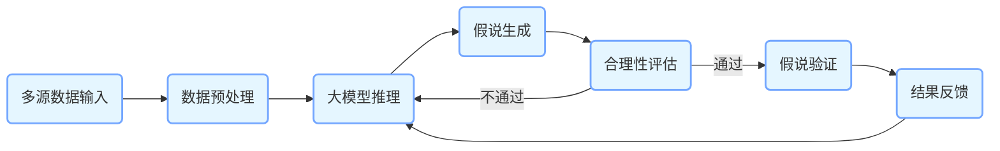

# 大模型在科学假说生成与验证中的推理能力

> 关键词：大模型、科学假说、生成与验证、推理能力、人工智能

> 摘要：本文深入探讨了大模型在科学假说生成与验证过程中的推理能力。随着人工智能技术的飞速发展，大模型展现出了强大的语言理解和生成能力，这使其在科学研究领域的应用前景广阔。文章首先介绍了相关背景，包括研究的目的范围、预期读者等；接着阐述了核心概念与联系，通过文本示意图和 Mermaid 流程图进行说明；详细讲解了核心算法原理及具体操作步骤，并结合 Python 源代码进行阐述；给出了相关数学模型和公式，并举例说明；通过项目实战展示了代码实现和详细解读；分析了实际应用场景；推荐了相关工具和资源；最后总结了未来发展趋势与挑战，还包含常见问题解答和扩展阅读参考资料，旨在全面剖析大模型在科学假说生成与验证中的推理能力及其重要意义。

## 1. 背景介绍 
### 1.1 目的和范围
科学研究的核心在于不断提出新的假说并进行验证，推动人类对自然和社会的认知进步。传统的科学假说生成与验证主要依赖于科学家的专业知识、经验和创造力，这一过程往往耗时费力，且受到人类认知局限的影响。近年来，大模型的出现为科学研究带来了新的机遇。大模型具有强大的语言处理和推理能力，能够对海量的科学文献和数据进行分析和理解，从而辅助科学家生成更具创新性的假说，并在验证过程中提供有价值的参考。

本研究的目的在于深入探讨大模型在科学假说生成与验证中的推理能力，分析其优势和局限性，探索如何更好地利用大模型提升科学研究的效率和质量。研究范围涵盖了自然科学、社会科学等多个领域，重点关注大模型在不同领域中应用的方法和效果。

### 1.2 预期读者
本文的预期读者包括科研工作者、人工智能领域的从业者、科学哲学研究者以及对科学研究和人工智能交叉领域感兴趣的爱好者。科研工作者可以通过本文了解如何利用大模型改进自己的研究方法，提高科学假说的生成和验证效率；人工智能领域的从业者可以从中获取大模型在科学研究中的应用场景和技术挑战，为进一步的技术创新提供思路；科学哲学研究者可以从哲学层面思考大模型对科学研究方法和认识论的影响；而普通爱好者则可以通过本文了解大模型在科学研究中的前沿应用，拓宽自己的知识面。

### 1.3 文档结构概述
本文共分为十个部分。第一部分为背景介绍，阐述了研究的目的、范围、预期读者和文档结构概述，并给出了相关术语表。第二部分介绍了核心概念与联系，包括大模型、科学假说、推理能力等核心概念的原理和架构，并通过文本示意图和 Mermaid 流程图进行说明。第三部分详细讲解了核心算法原理及具体操作步骤，结合 Python 源代码进行阐述。第四部分给出了相关数学模型和公式，并举例说明。第五部分通过项目实战展示了代码实现和详细解读。第六部分分析了大模型在科学假说生成与验证中的实际应用场景。第七部分推荐了相关的学习资源、开发工具框架和论文著作。第八部分总结了未来发展趋势与挑战。第九部分为附录，包含常见问题解答。第十部分提供了扩展阅读和参考资料。

### 1.4 术语表
#### 1.4.1 核心术语定义
- **大模型**：指具有大量参数和强大计算能力的人工智能模型，通常基于深度学习技术构建，如 GPT 系列、BERT 等。这些模型通过在大规模数据集上进行训练，能够学习到丰富的语言知识和模式，具有较强的语言理解和生成能力。
- **科学假说**：是科学研究中对自然现象或社会现象的一种推测性解释，是科学理论形成的前期阶段。科学假说需要通过进一步的实验、观察和验证来确定其正确性。
- **推理能力**：指大模型根据输入的信息，运用逻辑规则和知识进行分析、判断和推导，得出合理结论的能力。在科学假说生成与验证中，推理能力表现为大模型能够从科学文献和数据中提取有用信息，提出合理的假说，并对假说进行初步的验证和评估。

#### 1.4.2 相关概念解释
- **深度学习**：是一种基于人工神经网络的机器学习方法，通过构建多层神经网络来学习数据的特征和模式。深度学习在图像识别、自然语言处理等领域取得了显著的成果，是大模型的核心技术之一。
- **自然语言处理**：是人工智能的一个重要领域，主要研究如何让计算机理解和处理人类语言。自然语言处理技术包括文本分类、情感分析、机器翻译、问答系统等，大模型在自然语言处理中具有广泛的应用。
- **科学研究方法**：是指科学家在进行科学研究时所采用的一系列方法和步骤，包括观察、实验、假设、验证、理论构建等。科学研究方法是科学进步的重要保障，大模型在科学研究中的应用需要与传统的科学研究方法相结合。

#### 1.4.3 缩略词列表
- **GPT**：Generative Pretrained Transformer，生成式预训练变换器，是一种基于Transformer架构的大语言模型。
- **BERT**：Bidirectional Encoder Representations from Transformers，基于Transformer的双向编码器表示，是一种预训练语言模型。
- **NLP**：Natural Language Processing，自然语言处理。

## 2. 核心概念与联系 
### 核心概念原理
#### 大模型原理
大模型通常基于深度学习中的Transformer架构。Transformer架构由编码器和解码器组成，其中注意力机制是其核心。注意力机制允许模型在处理输入序列时，能够动态地关注序列中的不同部分，从而更好地捕捉序列中的长距离依赖关系。

以GPT系列模型为例，它是基于Transformer解码器的自回归语言模型。在预训练阶段，模型在大规模文本数据上进行无监督学习，学习语言的统计规律和模式。在微调阶段，模型可以根据具体的任务进行有监督学习，如文本生成、问答系统等。

#### 科学假说原理
科学假说的形成是一个复杂的过程，通常基于对现有科学知识和观察到的现象的分析。科学家通过归纳、演绎等逻辑方法，从已知的事实中推导出可能的解释。科学假说需要满足一定的条件，如具有可检验性、与现有科学理论相容等。

#### 推理能力原理
推理能力基于逻辑规则和知识。大模型通过学习大量的文本数据，隐式地掌握了一定的逻辑规则和知识。在进行推理时，模型根据输入的信息，结合所学的知识和逻辑规则，进行分析和推导。推理方式包括演绎推理、归纳推理和类比推理等。

### 架构的文本示意图
大模型在科学假说生成与验证中的应用架构可以描述如下：

首先，大模型接收来自科学文献数据库、实验数据等多源的数据输入。然后，大模型对这些数据进行预处理，包括文本清洗、特征提取等操作。接着，大模型利用其推理能力，从预处理后的数据中提取有用信息，生成科学假说。生成的假说会经过初步的合理性评估，评估过程中会参考现有科学理论和领域知识。最后，对于通过初步评估的假说，会进入验证阶段，验证过程可能涉及实验设计、数据分析等，验证结果会反馈给大模型，用于进一步优化和改进。

### Mermaid 流程图


这个流程图展示了大模型在科学假说生成与验证中的整个流程。从多源数据输入开始，经过数据预处理、大模型推理生成假说，然后进行合理性评估。如果假说通过评估，则进入验证阶段，验证结果反馈回来用于进一步优化；如果不通过评估，则返回大模型推理阶段重新生成假说。

## 3. 核心算法原理 & 具体操作步骤 
### 核心算法原理
大模型在科学假说生成与验证中的推理主要基于其语言理解和生成能力。以GPT模型为例，其核心算法是基于Transformer解码器的自回归语言模型。

Transformer解码器的核心是多头注意力机制。多头注意力机制允许模型在不同的表示子空间中并行地计算注意力，从而捕捉输入序列中不同位置之间的依赖关系。具体来说，多头注意力机制通过将输入的查询（Query）、键（Key）和值（Value）分别投影到多个低维子空间中，然后在每个子空间中计算注意力分数，最后将这些分数加权求和得到输出。

在生成假说时，大模型根据输入的科学文献和数据，通过自回归的方式依次生成文本。模型在每一步都会根据之前生成的文本和输入信息，预测下一个最可能的词。这个过程会不断重复，直到生成完整的假说文本。

### 具体操作步骤及 Python 源代码
以下是一个简单的示例，展示如何使用 Hugging Face 的 Transformers 库调用预训练的 GPT 模型进行文本生成，模拟科学假说生成的过程。

```python
from transformers import GPT2LMHeadModel, GPT2Tokenizer

# 加载预训练的 GPT-2 模型和分词器
tokenizer = GPT2Tokenizer.from_pretrained("gpt2")
model = GPT2LMHeadModel.from_pretrained("gpt2")

# 输入的科学文献或相关信息
input_text = "在某些化学实验中，发现反应物的浓度与反应速率之间存在一种特殊的关系。"

# 对输入文本进行分词
input_ids = tokenizer.encode(input_text, return_tensors='pt')

# 生成假说文本
output = model.generate(input_ids, max_length=100, num_beams=5, no_repeat_ngram_size=2, early_stopping=True)

# 将生成的文本解码
generated_text = tokenizer.decode(output[0], skip_special_tokens=True)

print("生成的科学假说：", generated_text)
```

### 代码解释
1. **加载模型和分词器**：使用 `GPT2Tokenizer.from_pretrained("gpt2")` 加载 GPT-2 的分词器，使用 `GPT2LMHeadModel.from_pretrained("gpt2")` 加载预训练的 GPT-2 模型。
2. **输入文本处理**：将输入的科学文献或相关信息 `input_text` 进行分词，得到输入的词 ID 序列 `input_ids`。
3. **文本生成**：使用 `model.generate()` 方法生成假说文本。`max_length` 参数指定生成文本的最大长度，`num_beams` 参数指定束搜索的束宽，`no_repeat_ngram_size` 参数用于避免生成重复的 n-gram，`early_stopping` 参数用于在生成结束时提前停止。
4. **解码输出**：将生成的词 ID 序列解码为文本，使用 `tokenizer.decode()` 方法。

## 4. 数学模型和公式 & 详细讲解 & 举例说明 
### 数学模型和公式
#### 多头注意力机制公式
多头注意力机制的数学表达式如下：

多头注意力（Multi-Head Attention）定义为：

$$
\text{MultiHead}(Q, K, V) = \text{Concat}(\text{head}_1, \ldots, \text{head}_h)W^O
$$

其中，每个头（head）的计算方式为：

$$
\text{head}_i = \text{Attention}(QW_i^Q, KW_i^K, VW_i^V)
$$

注意力（Attention）的计算方式为：

$$
\text{Attention}(Q, K, V) = \text{softmax}\left(\frac{QK^T}{\sqrt{d_k}}\right)V
$$

这里，$Q$ 是查询矩阵，$K$ 是键矩阵，$V$ 是值矩阵，$d_k$ 是键的维度，$W_i^Q$、$W_i^K$、$W_i^V$ 和 $W^O$ 是可学习的参数矩阵。

#### 自回归语言模型概率公式
在自回归语言模型中，生成下一个词 $w_t$ 的概率可以表示为：

$$
P(w_t | w_1, \ldots, w_{t - 1}) = \text{softmax}(z_t)
$$

其中，$z_t$ 是模型在时间步 $t$ 的输出，$\text{softmax}$ 函数将 $z_t$ 转换为概率分布。

### 详细讲解
#### 多头注意力机制讲解
多头注意力机制通过将输入的查询、键和值分别投影到多个低维子空间中，使得模型能够在不同的表示子空间中捕捉输入序列中不同位置之间的依赖关系。通过并行计算多个头的注意力分数，然后将这些分数加权求和，模型可以学习到更丰富的语义信息。

#### 自回归语言模型概率公式讲解
自回归语言模型通过依次预测下一个词的概率来生成文本。在每一步，模型根据之前生成的词和输入信息，计算下一个词的概率分布。然后，根据这个概率分布选择最可能的词作为输出。这个过程不断重复，直到生成完整的文本。

### 举例说明
假设我们有一个输入序列 $x = [x_1, x_2, x_3]$，查询矩阵 $Q$、键矩阵 $K$ 和值矩阵 $V$ 是通过对输入序列进行线性变换得到的。在多头注意力机制中，我们将 $Q$、$K$ 和 $V$ 分别投影到多个低维子空间中，例如 $h = 2$ 个头。

对于第一个头，我们计算 $Q_1 = QW_1^Q$，$K_1 = KW_1^K$，$V_1 = VW_1^V$，然后计算注意力分数：

$$
\text{Attention}(Q_1, K_1, V_1) = \text{softmax}\left(\frac{Q_1K_1^T}{\sqrt{d_k}}\right)V_1
$$

同样地，对于第二个头，我们计算 $Q_2 = QW_2^Q$，$K_2 = KW_2^K$，$V_2 = VW_2^V$，并计算注意力分数。

最后，我们将两个头的输出拼接起来，并通过线性变换 $W^O$ 得到多头注意力的输出。

在自回归语言模型中，假设我们已经生成了词序列 $w_1, w_2$，现在要预测下一个词 $w_3$。模型会根据 $w_1$ 和 $w_2$ 计算 $z_3$，然后通过 $\text{softmax}$ 函数得到 $w_3$ 的概率分布，例如：

$$
P(w_3 | w_1, w_2) = \text{softmax}(z_3) = [0.1, 0.2, 0.3, 0.4, \ldots]
$$

我们可以选择概率最大的词作为 $w_3$ 的输出。

## 5. 项目实战：代码实际案例和详细解释说明 
### 5.1  开发环境搭建
#### 安装 Python
首先，确保你已经安装了 Python 3.6 或更高版本。你可以从 Python 官方网站（https://www.python.org/downloads/） 下载并安装 Python。

#### 创建虚拟环境
为了避免不同项目之间的依赖冲突，建议使用虚拟环境。可以使用 `venv` 或 `conda` 来创建虚拟环境。

使用 `venv` 创建虚拟环境的命令如下：

```bash
python -m venv myenv
```

激活虚拟环境：

- 在 Windows 上：
```bash
myenv\Scripts\activate
```
- 在 Linux 或 macOS 上：
```bash
source myenv/bin/activate
```

#### 安装依赖库
在虚拟环境中，安装所需的依赖库，包括 `transformers`、`torch` 等。

```bash
pip install transformers torch
```

### 5.2  源代码详细实现和代码解读
以下是一个更完整的项目实战代码，用于生成科学假说并进行简单的合理性评估。

```python
from transformers import GPT2LMHeadModel, GPT2Tokenizer
import re

# 加载预训练的 GPT-2 模型和分词器
tokenizer = GPT2Tokenizer.from_pretrained("gpt2")
model = GPT2LMHeadModel.from_pretrained("gpt2")

# 输入的科学文献或相关信息
input_text = "在某些物理实验中，发现物体的运动轨迹与预期不符。"

# 对输入文本进行分词
input_ids = tokenizer.encode(input_text, return_tensors='pt')

# 生成假说文本
output = model.generate(input_ids, max_length=200, num_beams=5, no_repeat_ngram_size=2, early_stopping=True)

# 将生成的文本解码
generated_text = tokenizer.decode(output[0], skip_special_tokens=True)

print("生成的科学假说：", generated_text)

# 简单的合理性评估：检查假说中是否包含基本的科学术语
def is_hypothesis_reasonable(hypothesis):
    # 定义一些基本的科学术语
    scientific_terms = ["物理", "运动", "轨迹", "力", "能量"]
    for term in scientific_terms:
        if re.search(term, hypothesis):
            return True
    return False

# 进行合理性评估
if is_hypothesis_reasonable(generated_text):
    print("假说通过初步合理性评估。")
else:
    print("假说未通过初步合理性评估。")
```

### 5.3  代码解读与分析
#### 代码整体功能
这段代码的主要功能是利用预训练的 GPT-2 模型生成科学假说，并对生成的假说进行简单的合理性评估。

#### 代码详细解读
1. **模型和分词器加载**：使用 `GPT2Tokenizer.from_pretrained("gpt2")` 和 `GPT2LMHeadModel.from_pretrained("gpt2")` 加载 GPT-2 的分词器和模型。
2. **输入文本处理**：将输入的科学文献或相关信息 `input_text` 进行分词，得到输入的词 ID 序列 `input_ids`。
3. **文本生成**：使用 `model.generate()` 方法生成假说文本，设置了生成文本的最大长度、束宽等参数。
4. **解码输出**：将生成的词 ID 序列解码为文本，使用 `tokenizer.decode()` 方法。
5. **合理性评估**：定义了一个 `is_hypothesis_reasonable()` 函数，用于检查假说中是否包含基本的科学术语。如果包含，则认为假说通过初步合理性评估；否则，认为假说未通过评估。

#### 代码分析
这种简单的合理性评估方法只是一个初步的示例，实际应用中可能需要更复杂的评估机制，例如结合领域知识图谱、科学理论等进行评估。此外，生成的假说可能存在语义不准确、逻辑不严谨等问题，需要进一步的人工修正和验证。

## 6. 实际应用场景 
### 自然科学领域
#### 物理学
在物理学中，大模型可以帮助物理学家从大量的实验数据和理论文献中生成新的假说。例如，在研究高能物理实验中，大模型可以分析粒子碰撞的数据，提出关于新粒子存在或相互作用机制的假说。通过对现有理论和实验数据的学习，大模型可以发现数据中的潜在规律和异常现象，从而为物理学家提供新的研究方向。

#### 化学
在化学领域，大模型可以辅助化学家设计新的化学反应和合成路线。通过对大量化学文献和实验数据的分析，大模型可以预测新的化合物结构和性质，提出可能的化学反应机制假说。这有助于化学家减少实验的盲目性，提高研发效率。

#### 生物学
在生物学中，大模型可以帮助生物学家理解基因调控网络、蛋白质结构和功能等复杂问题。例如，大模型可以分析基因测序数据，提出关于基因表达调控的假说，为基因治疗和药物研发提供理论支持。

### 社会科学领域
#### 经济学
在经济学中，大模型可以分析宏观经济数据和市场动态，提出关于经济增长、通货膨胀、就业等问题的假说。通过对历史数据和经济理论的学习，大模型可以预测经济趋势，为政策制定者提供决策参考。

#### 社会学
在社会学中，大模型可以分析社会现象和人类行为数据，提出关于社会结构、社会变迁、群体行为等问题的假说。例如，大模型可以分析社交媒体数据，研究公众舆论和社会情绪的变化，为社会治理和政策制定提供依据。

#### 心理学
在心理学中，大模型可以分析心理实验数据和临床案例，提出关于人类认知、情感、行为等问题的假说。例如，大模型可以分析患者的心理测试数据，预测患者的心理状态和治疗效果，为心理治疗提供个性化的方案。

## 7. 工具和资源推荐
### 7.1 学习资源推荐
#### 7.1.1 书籍推荐
- 《深度学习》（Deep Learning）：由 Ian Goodfellow、Yoshua Bengio 和 Aaron Courville 合著，是深度学习领域的经典教材，全面介绍了深度学习的基本原理、算法和应用。
- 《自然语言处理入门》（Natural Language Processing with Python）：由 Steven Bird、Ewan Klein 和 Edward Loper 合著，介绍了使用 Python 进行自然语言处理的基本方法和技术。
- 《人工智能：一种现代的方法》（Artificial Intelligence: A Modern Approach）：由 Stuart Russell 和 Peter Norvig 合著，是人工智能领域的权威教材，涵盖了人工智能的各个方面，包括搜索算法、知识表示、机器学习等。

#### 7.1.2 在线课程
- Coursera 上的“深度学习专项课程”（Deep Learning Specialization）：由 Andrew Ng 教授授课，包括五门课程，系统地介绍了深度学习的理论和实践。
- edX 上的“自然语言处理”（Natural Language Processing）：由哥伦比亚大学的教授授课，介绍了自然语言处理的基本概念、算法和应用。
- 哔哩哔哩上的“李宏毅机器学习”：由台湾大学的李宏毅教授授课，以通俗易懂的方式介绍了机器学习的基本原理和算法。

#### 7.1.3 技术博客和网站
- Hugging Face Blog（https://huggingface.co/blog）：提供了关于大模型和自然语言处理的最新技术和研究成果。
- arXiv（https://arxiv.org/）：是一个预印本数据库，包含了大量的科学研究论文，其中很多关于人工智能和机器学习的论文可以在这里找到。
- Medium 上的人工智能和机器学习相关博客：有很多优秀的技术博主分享他们的研究成果和实践经验。

### 7.2 开发工具框架推荐
#### 7.2.1 IDE和编辑器
- PyCharm：是一款专业的 Python 集成开发环境，具有代码自动补全、调试、版本控制等功能，适合开发大型 Python 项目。
- Visual Studio Code：是一款轻量级的代码编辑器，支持多种编程语言，具有丰富的插件生态系统，可以方便地进行 Python 开发。
- Jupyter Notebook：是一个交互式的开发环境，适合进行数据分析、模型训练和实验验证等工作。

#### 7.2.2 调试和性能分析工具
- PyTorch Profiler：是 PyTorch 提供的性能分析工具，可以帮助开发者分析模型的训练和推理性能，找出性能瓶颈。
- TensorBoard：是 TensorFlow 提供的可视化工具，也可以用于 PyTorch 项目，用于可视化模型的训练过程、性能指标等。
- cProfile：是 Python 内置的性能分析工具，可以帮助开发者分析 Python 代码的性能，找出耗时的函数和代码块。

#### 7.2.3 相关框架和库
- Transformers：是 Hugging Face 开发的一个开源库，提供了多种预训练的大语言模型，如 GPT、BERT 等，方便开发者进行自然语言处理任务的开发。
- PyTorch：是一个开源的深度学习框架，具有动态图机制，适合快速开发和实验。
- scikit-learn：是一个开源的机器学习库，提供了多种机器学习算法和工具，如分类、回归、聚类等，适合进行数据预处理和模型评估。

### 7.3 相关论文著作推荐
#### 7.3.1 经典论文
- “Attention Is All You Need”：介绍了 Transformer 架构，是大模型领域的经典论文，为后续的大语言模型发展奠定了基础。
- “BERT: Pre-training of Deep Bidirectional Transformers for Language Understanding”：介绍了 BERT 模型，提出了预训练 - 微调的语言模型训练范式。
- “Generative Pretrained Transformer 3 (GPT-3): Language Models are Few-Shot Learners”：介绍了 GPT-3 模型，展示了大语言模型在少样本学习方面的强大能力。

#### 7.3.2 最新研究成果
可以关注 arXiv 上的最新论文，以及顶级学术会议如 NeurIPS、ICML、ACL 等上的研究成果。这些研究成果反映了大模型和自然语言处理领域的最新进展。

#### 7.3.3 应用案例分析
可以参考一些实际应用案例的研究论文，了解大模型在不同领域的应用方法和效果。例如，一些关于大模型在医疗、金融、教育等领域的应用案例分析论文。

## 8. 总结：未来发展趋势与挑战
### 未来发展趋势
#### 模型能力提升
未来的大模型将不断提升其推理能力和语言理解能力。通过增加模型的参数数量、改进训练算法和优化模型架构，大模型将能够更好地理解科学文献和数据，生成更准确、更有创新性的科学假说。

#### 跨领域融合
大模型将与更多的领域进行深度融合，如生物学与物理学、经济学与社会学等。通过跨领域的数据和知识融合，大模型可以发现不同领域之间的潜在联系，提出更具综合性的科学假说，推动跨学科研究的发展。

#### 人机协作增强
未来的科学研究将更加注重人机协作。大模型将作为科学家的智能助手，辅助科学家进行科学假说的生成和验证。科学家可以利用大模型的推理能力和数据分析能力，提高研究效率，同时发挥自己的专业知识和创造力，对大模型生成的假说进行修正和完善。

### 挑战
#### 数据质量和多样性
大模型的性能高度依赖于训练数据的质量和多样性。在科学研究领域，数据往往具有专业性强、数据量小、标注困难等特点。如何获取高质量、多样化的科学数据，并进行有效的预处理和标注，是大模型在科学研究中应用的一个挑战。

#### 推理的可解释性
大模型的推理过程往往是黑盒的，难以解释其生成假说的依据和逻辑。在科学研究中，可解释性是非常重要的，因为科学家需要理解假说的形成过程，才能对其进行验证和改进。如何提高大模型推理的可解释性，是当前研究的一个热点问题。

#### 伦理和法律问题
大模型在科学研究中的应用也带来了一些伦理和法律问题。例如，大模型生成的假说可能会侵犯他人的知识产权，或者导致一些不可预测的后果。如何制定相应的伦理和法律规范，确保大模型在科学研究中的合理应用，是需要解决的问题。

## 9. 附录：常见问题与解答
### 大模型生成的科学假说一定正确吗？
大模型生成的科学假说不一定正确。大模型只是根据输入的信息和学习到的知识进行推理和生成，其生成的假说需要经过进一步的验证和评估。大模型的推理能力受到训练数据、模型架构和算法等因素的限制，可能会存在语义不准确、逻辑不严谨等问题。因此，大模型生成的假说需要科学家进行人工修正和验证。

### 如何提高大模型在科学假说生成与验证中的推理能力？
可以从以下几个方面提高大模型在科学假说生成与验证中的推理能力：
1. **增加训练数据**：使用更多、更优质的科学文献和数据进行训练，让大模型学习到更丰富的知识和模式。
2. **改进模型架构**：采用更先进的模型架构，如改进的 Transformer 架构，提高模型的学习能力和推理能力。
3. **融合领域知识**：将领域知识图谱、科学理论等融入大模型中，让大模型在推理过程中能够更好地利用领域知识。
4. **进行模型微调**：在特定的科学领域数据集上对大模型进行微调，使其更适应科学假说生成与验证的任务。

### 大模型在科学研究中的应用会取代科学家吗？
大模型在科学研究中的应用不会取代科学家。虽然大模型具有强大的推理能力和数据分析能力，但科学研究不仅仅是数据处理和推理，还需要科学家的专业知识、创造力和判断力。大模型可以作为科学家的智能助手，辅助科学家进行科学假说的生成和验证，但最终的决策和判断仍然需要科学家来做出。此外，科学研究中的伦理、社会和人文等问题也需要科学家的参与和思考。

## 10. 扩展阅读 & 参考资料
### 扩展阅读
- 《科学研究的艺术》（The Art of Scientific Investigation）：由 W. I. B. Beveridge 著，介绍了科学研究的方法和艺术，对于理解科学假说的生成和验证过程有很大的帮助。
- 《人工智能时代的科学革命》：探讨了人工智能对科学研究的影响和变革，以及未来科学研究的发展趋势。

### 参考资料
1. Goodfellow, I., Bengio, Y., & Courville, A. (2016). Deep Learning. MIT Press.
2. Bird, S., Klein, E., & Loper, E. (2009). Natural Language Processing with Python. O'Reilly Media.
3. Russell, S. J., & Norvig, P. (2016). Artificial Intelligence: A Modern Approach. Pearson.
4. Vaswani, A., Shazeer, N., Parmar, N., Uszkoreit, J., Jones, L., Gomez, A. N., ... & Polosukhin, I. (2017). Attention is all you need. In Advances in neural information processing systems (pp. 5998-6008).
5. Devlin, J., Chang, M. W., Lee, K., & Toutanova, K. (2018). Bert: Pre-training of deep bidirectional transformers for language understanding. arXiv preprint arXiv:1810.04805.
6. Brown, T. B., Mann, B., Ryder, N., Subbiah, M., Kaplan, J. D., Dhariwal, P., ... & Amodei, D. (2020). Language models are few-shot learners. arXiv preprint arXiv:2005.14165.