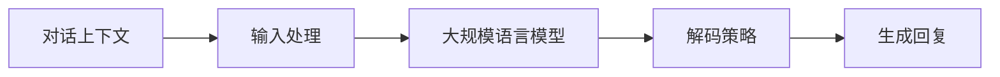

# 大规模语言模型在自动对话生成中的应用研究

> 关键词：大规模语言模型、自动对话生成、Transformer架构、注意力机制、应用场景

> 摘要：本文深入探讨了大规模语言模型在自动对话生成中的应用。首先介绍了相关背景知识，包括研究目的、预期读者、文档结构和术语表。接着阐述了核心概念与联系，如大规模语言模型和自动对话生成的原理及架构。详细讲解了核心算法原理，用Python代码进行了说明，并给出了数学模型和公式。通过项目实战展示了如何在实际中运用大规模语言模型进行自动对话生成，包括开发环境搭建、源代码实现和代码解读。分析了其实际应用场景，推荐了相关的学习资源、开发工具框架和论文著作。最后总结了未来发展趋势与挑战，并提供了常见问题解答和扩展阅读参考资料。

## 1. 背景介绍 
### 1.1 目的和范围
自动对话生成是自然语言处理领域的一个重要研究方向，旨在让计算机能够像人类一样进行自然流畅的对话。大规模语言模型的出现为自动对话生成带来了新的机遇和挑战。本研究的目的在于深入探讨大规模语言模型在自动对话生成中的应用，分析其原理、算法、实际应用场景等方面的内容。研究范围涵盖了大规模语言模型的核心概念、算法原理、数学模型，以及在不同场景下的自动对话生成应用，并通过实际案例进行验证。

### 1.2 预期读者
本文预期读者包括自然语言处理领域的研究人员、工程师、学生，以及对人工智能和自动对话系统感兴趣的技术爱好者。研究人员可以从本文中获取关于大规模语言模型在自动对话生成方面的最新研究动态和技术趋势；工程师可以借鉴文中的算法和代码实现，应用到实际的项目开发中；学生可以通过本文系统地学习大规模语言模型和自动对话生成的相关知识；技术爱好者可以了解这一领域的基本概念和应用场景。

### 1.3 文档结构概述
本文将按照以下结构进行组织：首先介绍背景知识，包括研究目的、预期读者和文档结构概述等；接着阐述大规模语言模型和自动对话生成的核心概念与联系；详细讲解核心算法原理，并给出Python代码示例；介绍相关的数学模型和公式，并举例说明；通过项目实战展示如何使用大规模语言模型进行自动对话生成；分析其实际应用场景；推荐相关的学习资源、开发工具框架和论文著作；最后总结未来发展趋势与挑战，提供常见问题解答和扩展阅读参考资料。

### 1.4 术语表
#### 1.4.1 核心术语定义
- **大规模语言模型**：指具有大量参数和强大语言理解与生成能力的预训练语言模型，如GPT - 3、BERT等。这些模型通常在大规模的文本数据上进行无监督学习，以学习语言的统计规律和语义信息。
- **自动对话生成**：是自然语言处理的一个任务，旨在让计算机系统根据输入的对话上下文自动生成合适的回复，实现自然流畅的人机对话。
- **Transformer架构**：是一种基于注意力机制的深度学习架构，广泛应用于大规模语言模型中，能够有效处理序列数据，捕捉长距离依赖关系。
- **注意力机制**：是一种在深度学习中用于自动关注输入序列中重要部分的机制，通过计算不同位置的权重，使模型能够更聚焦于关键信息。

#### 1.4.2 相关概念解释
- **预训练**：在大规模无标注文本数据上进行的无监督学习过程，使模型学习到通用的语言知识和模式。预训练后的模型可以在特定任务上进行微调，以适应不同的应用场景。
- **微调**：在预训练模型的基础上，使用特定任务的标注数据对模型进行进一步训练，调整模型的参数，使其更好地完成该任务。
- **对话上下文**：指在对话过程中，当前时刻之前的所有对话内容。自动对话生成系统需要根据对话上下文来生成合适的回复。

#### 1.4.3 缩略词列表
- **GPT**：Generative Pretrained Transformer，生成式预训练Transformer
- **BERT**：Bidirectional Encoder Representations from Transformers，基于Transformer的双向编码器表示
- **NLP**：Natural Language Processing，自然语言处理

## 2. 核心概念与联系 
### 大规模语言模型原理
大规模语言模型通常基于Transformer架构，Transformer架构由编码器和解码器组成。编码器负责对输入的文本进行特征提取和表示，解码器则根据编码器的输出和之前生成的部分序列，逐步生成下一个词。

Transformer架构的核心是注意力机制，注意力机制允许模型在处理每个位置的输入时，动态地关注输入序列中的其他位置。具体来说，对于输入序列中的每个位置，注意力机制计算该位置与其他位置之间的相关性，然后根据相关性分配权重，最后将加权后的输入表示进行求和，得到该位置的上下文表示。

其文本示意图如下：
```plaintext
输入文本 -> 嵌入层 -> 多头注意力层 -> 前馈神经网络 -> 输出表示
```

Mermaid流程图如下：


### 自动对话生成原理
自动对话生成的目标是根据对话上下文生成合适的回复。在基于大规模语言模型的自动对话生成系统中，通常将对话上下文作为输入，输入到大规模语言模型中，模型根据其学习到的语言知识和模式，预测下一个可能的词，直到生成完整的回复。

自动对话生成系统的架构可以分为以下几个部分：
1. **输入处理**：将对话上下文进行预处理，如分词、转换为词向量等。
2. **模型推理**：将预处理后的输入送入大规模语言模型，进行推理计算，得到下一个词的概率分布。
3. **解码策略**：根据下一个词的概率分布，选择合适的词作为回复的一部分。常见的解码策略包括贪心搜索、束搜索等。

其文本示意图如下：
```plaintext
对话上下文 -> 输入处理 -> 大规模语言模型 -> 解码策略 -> 生成回复
```

Mermaid流程图如下：


### 大规模语言模型与自动对话生成的联系
大规模语言模型为自动对话生成提供了强大的语言理解和生成能力。通过在大规模文本数据上进行预训练，大规模语言模型学习到了丰富的语言知识和模式，能够更好地理解对话上下文，并生成自然流畅的回复。

自动对话生成则是大规模语言模型的一个重要应用场景。通过在自动对话生成任务上进行微调，大规模语言模型可以进一步适应对话生成的需求，提高对话生成的质量和效果。

## 3. 核心算法原理 & 具体操作步骤 
### 注意力机制原理
注意力机制的核心思想是计算输入序列中每个位置与其他位置之间的相关性，然后根据相关性分配权重，最后将加权后的输入表示进行求和，得到该位置的上下文表示。

具体来说，对于输入序列 $\mathbf{X} = [\mathbf{x}_1, \mathbf{x}_2, \cdots, \mathbf{x}_n]$，其中 $\mathbf{x}_i \in \mathbb{R}^d$ 表示第 $i$ 个位置的输入向量，注意力机制的计算步骤如下：
1. 计算查询（Query）、键（Key）和值（Value）矩阵：
    - $\mathbf{Q} = \mathbf{X} \mathbf{W}_Q$
    - $\mathbf{K} = \mathbf{X} \mathbf{W}_K$
    - $\mathbf{V} = \mathbf{X} \mathbf{W}_V$
    其中，$\mathbf{W}_Q \in \mathbb{R}^{d \times d_k}$，$\mathbf{W}_K \in \mathbb{R}^{d \times d_k}$，$\mathbf{W}_V \in \mathbb{R}^{d \times d_v}$ 是可学习的权重矩阵。
2. 计算注意力分数：
    - $\mathbf{Attention} = \text{softmax}\left(\frac{\mathbf{Q} \mathbf{K}^T}{\sqrt{d_k}}\right) \mathbf{V}$

下面是使用Python和PyTorch实现的注意力机制代码示例：
```python
import torch
import torch.nn as nn

class Attention(nn.Module):
    def __init__(self, input_dim, d_k, d_v):
        super(Attention, self).__init__()
        self.W_Q = nn.Linear(input_dim, d_k)
        self.W_K = nn.Linear(input_dim, d_k)
        self.W_V = nn.Linear(input_dim, d_v)

    def forward(self, X):
        Q = self.W_Q(X)
        K = self.W_K(X)
        V = self.W_V(X)
        attention_scores = torch.matmul(Q, K.transpose(-2, -1)) / torch.sqrt(torch.tensor(Q.size(-1)).float())
        attention_weights = torch.softmax(attention_scores, dim=-1)
        output = torch.matmul(attention_weights, V)
        return output

# 示例使用
input_dim = 128
d_k = 64
d_v = 64
input_seq = torch.randn(10, 5, input_dim)  # 输入序列：(batch_size, seq_len, input_dim)
attention_layer = Attention(input_dim, d_k, d_v)
output = attention_layer(input_seq)
print(output.shape)
```

### 多头注意力机制原理
多头注意力机制是在注意力机制的基础上，将输入分成多个头，每个头独立地计算注意力，然后将所有头的输出拼接起来，再通过一个线性层进行变换。

多头注意力机制的计算公式如下：
- $\text{MultiHead}(\mathbf{Q}, \mathbf{K}, \mathbf{V}) = \text{Concat}(\text{head}_1, \cdots, \text{head}_h) \mathbf{W}_O$
- $\text{head}_i = \text{Attention}(\mathbf{Q} \mathbf{W}_i^Q, \mathbf{K} \mathbf{W}_i^K, \mathbf{V} \mathbf{W}_i^V)$

其中，$h$ 是头的数量，$\mathbf{W}_i^Q \in \mathbb{R}^{d \times d_k}$，$\mathbf{W}_i^K \in \mathbb{R}^{d \times d_k}$，$\mathbf{W}_i^V \in \mathbb{R}^{d \times d_v}$，$\mathbf{W}_O \in \mathbb{R}^{h d_v \times d}$ 是可学习的权重矩阵。

下面是使用Python和PyTorch实现的多头注意力机制代码示例：
```python
import torch
import torch.nn as nn

class MultiHeadAttention(nn.Module):
    def __init__(self, input_dim, num_heads, d_k, d_v):
        super(MultiHeadAttention, self).__init__()
        self.num_heads = num_heads
        self.d_k = d_k
        self.d_v = d_v
        self.W_Q = nn.Linear(input_dim, num_heads * d_k)
        self.W_K = nn.Linear(input_dim, num_heads * d_k)
        self.W_V = nn.Linear(input_dim, num_heads * d_v)
        self.W_O = nn.Linear(num_heads * d_v, input_dim)

    def forward(self, X):
        batch_size, seq_len, input_dim = X.size()
        Q = self.W_Q(X).view(batch_size, seq_len, self.num_heads, self.d_k).transpose(1, 2)
        K = self.W_K(X).view(batch_size, seq_len, self.num_heads, self.d_k).transpose(1, 2)
        V = self.W_V(X).view(batch_size, seq_len, self.num_heads, self.d_v).transpose(1, 2)
        attention_scores = torch.matmul(Q, K.transpose(-2, -1)) / torch.sqrt(torch.tensor(self.d_k).float())
        attention_weights = torch.softmax(attention_scores, dim=-1)
        output = torch.matmul(attention_weights, V)
        output = output.transpose(1, 2).contiguous().view(batch_size, seq_len, self.num_heads * self.d_v)
        output = self.W_O(output)
        return output

# 示例使用
input_dim = 128
num_heads = 8
d_k = 16
d_v = 16
input_seq = torch.randn(10, 5, input_dim)  # 输入序列：(batch_size, seq_len, input_dim)
multihead_attention_layer = MultiHeadAttention(input_dim, num_heads, d_k, d_v)
output = multihead_attention_layer(input_seq)
print(output.shape)
```

### 自动对话生成的具体操作步骤
1. **数据预处理**：收集对话数据，并进行清洗、分词等预处理操作。将对话数据转换为适合大规模语言模型输入的格式，如词向量序列。
2. **模型选择与加载**：选择合适的大规模语言模型，如GPT - 2、BERT等，并加载预训练模型。
3. **微调模型**：使用预处理后的对话数据对预训练模型进行微调，调整模型的参数，使其适应自动对话生成任务。
4. **对话生成**：在微调后的模型上进行对话生成。将对话上下文输入到模型中，使用解码策略（如贪心搜索、束搜索等）生成回复。

下面是一个使用Hugging Face的Transformers库进行自动对话生成的简单示例：
```python
from transformers import AutoTokenizer, AutoModelForCausalLM

# 加载预训练模型和分词器
tokenizer = AutoTokenizer.from_pretrained("gpt2")
model = AutoModelForCausalLM.from_pretrained("gpt2")

# 输入对话上下文
context = "你今天过得怎么样？"
input_ids = tokenizer.encode(context, return_tensors='pt')

# 生成回复
output = model.generate(input_ids, max_length=50, num_beams=5, no_repeat_ngram_size=2, early_stopping=True)
reply = tokenizer.decode(output[0], skip_special_tokens=True)
print("回复:", reply)
```

## 4. 数学模型和公式 & 详细讲解 & 举例说明 
### 注意力机制的数学模型
注意力机制的核心公式为：
$$\text{Attention}(\mathbf{Q}, \mathbf{K}, \mathbf{V}) = \text{softmax}\left(\frac{\mathbf{Q} \mathbf{K}^T}{\sqrt{d_k}}\right) \mathbf{V}$$

其中，$\mathbf{Q} \in \mathbb{R}^{n \times d_k}$ 是查询矩阵，$\mathbf{K} \in \mathbb{R}^{m \times d_k}$ 是键矩阵，$\mathbf{V} \in \mathbb{R}^{m \times d_v}$ 是值矩阵，$n$ 和 $m$ 分别是查询序列和键/值序列的长度，$d_k$ 是查询和键的维度，$d_v$ 是值的维度。

详细讲解：
- $\mathbf{Q} \mathbf{K}^T$：计算查询矩阵和键矩阵的点积，得到注意力分数矩阵。点积的结果表示查询向量与每个键向量之间的相关性。
- $\frac{\mathbf{Q} \mathbf{K}^T}{\sqrt{d_k}}$：对注意力分数进行缩放，除以 $\sqrt{d_k}$ 是为了防止点积结果过大，导致softmax函数的梯度消失。
- $\text{softmax}\left(\frac{\mathbf{Q} \mathbf{K}^T}{\sqrt{d_k}}\right)$：对缩放后的注意力分数进行softmax操作，将分数转换为概率分布，表示每个键向量在生成当前查询向量的上下文表示时的权重。
- $\text{softmax}\left(\frac{\mathbf{Q} \mathbf{K}^T}{\sqrt{d_k}}\right) \mathbf{V}$：将注意力权重与值矩阵相乘，得到加权后的上下文表示。

举例说明：
假设我们有一个输入序列 $\mathbf{X} = [\mathbf{x}_1, \mathbf{x}_2, \mathbf{x}_3]$，其中 $\mathbf{x}_i \in \mathbb{R}^4$，$d_k = d_v = 2$。经过线性变换得到 $\mathbf{Q} = \begin{bmatrix} 1 & 2 \\ 3 & 4 \\ 5 & 6 \end{bmatrix}$，$\mathbf{K} = \begin{bmatrix} 0 & 1 \\ 2 & 3 \\ 4 & 5 \end{bmatrix}$，$\mathbf{V} = \begin{bmatrix} 10 & 11 \\ 12 & 13 \\ 14 & 15 \end{bmatrix}$。

首先计算注意力分数矩阵：
$$\mathbf{Q} \mathbf{K}^T = \begin{bmatrix} 1 & 2 \\ 3 & 4 \\ 5 & 6 \end{bmatrix} \begin{bmatrix} 0 & 2 & 4 \\ 1 & 3 & 5 \end{bmatrix} = \begin{bmatrix} 2 & 8 & 14 \\ 4 & 18 & 32 \\ 6 & 28 & 50 \end{bmatrix}$$

然后进行缩放：
$$\frac{\mathbf{Q} \mathbf{K}^T}{\sqrt{d_k}} = \frac{1}{\sqrt{2}} \begin{bmatrix} 2 & 8 & 14 \\ 4 & 18 & 32 \\ 6 & 28 & 50 \end{bmatrix}$$

接着进行softmax操作：
$$\text{softmax}\left(\frac{\mathbf{Q} \mathbf{K}^T}{\sqrt{d_k}}\right) = \begin{bmatrix} 0.01 & 0.24 & 0.75 \\ 0.00 & 0.13 & 0.87 \\ 0.00 & 0.06 & 0.94 \end{bmatrix}$$

最后计算注意力输出：
$$\text{Attention}(\mathbf{Q}, \mathbf{K}, \mathbf{V}) = \begin{bmatrix} 0.01 & 0.24 & 0.75 \\ 0.00 & 0.13 & 0.87 \\ 0.00 & 0.06 & 0.94 \end{bmatrix} \begin{bmatrix} 10 & 11 \\ 12 & 13 \\ 14 & 15 \end{bmatrix} = \begin{bmatrix} 13.78 & 14.78 \\ 13.84 & 14.84 \\ 13.92 & 14.92 \end{bmatrix}$$

### 多头注意力机制的数学模型
多头注意力机制的公式为：
$$\text{MultiHead}(\mathbf{Q}, \mathbf{K}, \mathbf{V}) = \text{Concat}(\text{head}_1, \cdots, \text{head}_h) \mathbf{W}_O$$
$$\text{head}_i = \text{Attention}(\mathbf{Q} \mathbf{W}_i^Q, \mathbf{K} \mathbf{W}_i^K, \mathbf{V} \mathbf{W}_i^V)$$

其中，$h$ 是头的数量，$\mathbf{W}_i^Q \in \mathbb{R}^{d \times d_k}$，$\mathbf{W}_i^K \in \mathbb{R}^{d \times d_k}$，$\mathbf{W}_i^V \in \mathbb{R}^{d \times d_v}$，$\mathbf{W}_O \in \mathbb{R}^{h d_v \times d}$ 是可学习的权重矩阵。

详细讲解：
- 每个头独立地计算注意力，通过不同的线性变换矩阵 $\mathbf{W}_i^Q$，$\mathbf{W}_i^K$，$\mathbf{W}_i^V$ 对查询、键和值进行变换，然后计算注意力。
- 将所有头的输出拼接起来，得到一个维度为 $h d_v$ 的向量。
- 通过线性变换矩阵 $\mathbf{W}_O$ 对拼接后的向量进行变换，得到最终的多头注意力输出。

举例说明：
假设 $h = 2$，$d = 4$，$d_k = d_v = 2$。输入的 $\mathbf{Q}$，$\mathbf{K}$，$\mathbf{V}$ 维度均为 $n \times 4$。

对于第一个头，$\mathbf{W}_1^Q \in \mathbb{R}^{4 \times 2}$，$\mathbf{W}_1^K \in \mathbb{R}^{4 \times 2}$，$\mathbf{W}_1^V \in \mathbb{R}^{4 \times 2}$，计算 $\text{head}_1 = \text{Attention}(\mathbf{Q} \mathbf{W}_1^Q, \mathbf{K} \mathbf{W}_1^K, \mathbf{V} \mathbf{W}_1^V)$。

对于第二个头，$\mathbf{W}_2^Q \in \mathbb{R}^{4 \times 2}$，$\mathbf{W}_2^K \in \mathbb{R}^{4 \times 2}$，$\mathbf{W}_2^V \in \mathbb{R}^{4 \times 2}$，计算 $\text{head}_2 = \text{Attention}(\mathbf{Q} \mathbf{W}_2^Q, \mathbf{K} \mathbf{W}_2^K, \mathbf{V} \mathbf{W}_2^V)$。

将 $\text{head}_1$ 和 $\text{head}_2$ 拼接起来，得到一个 $n \times 4$ 的向量，然后通过 $\mathbf{W}_O \in \mathbb{R}^{4 \times 4}$ 进行线性变换，得到最终的多头注意力输出。

### 语言模型的损失函数
在大规模语言模型的训练中，通常使用交叉熵损失函数。对于一个给定的输入序列 $\mathbf{x} = [x_1, x_2, \cdots, x_n]$ 和对应的目标序列 $\mathbf{y} = [y_1, y_2, \cdots, y_n]$，语言模型的损失函数定义为：
$$L = -\frac{1}{n} \sum_{i=1}^{n} \log p(y_i | x_1, \cdots, x_i)$$

其中，$p(y_i | x_1, \cdots, x_i)$ 是模型预测第 $i$ 个词 $y_i$ 的概率。

详细讲解：
- 交叉熵损失函数衡量了模型预测的概率分布与真实标签之间的差异。
- 对于每个位置 $i$，计算模型预测 $y_i$ 的对数概率，然后对所有位置的对数概率求和并取平均。
- 通过最小化损失函数，模型可以学习到更好的语言表示和生成能力。

举例说明：
假设模型的输出是一个词汇表大小为 $V$ 的概率分布，对于一个长度为 $n = 3$ 的输入序列，目标序列为 $\mathbf{y} = [3, 5, 7]$。模型在每个位置的预测概率分别为 $p_1$，$p_2$，$p_3$。

则损失函数为：
$$L = -\frac{1}{3} (\log p_1[3] + \log p_2[5] + \log p_3[7])$$

其中，$p_i[j]$ 表示模型在第 $i$ 个位置预测第 $j$ 个词的概率。

## 5. 项目实战：代码实际案例和详细解释说明 
### 5.1  开发环境搭建
#### 安装Python和pip
首先，确保你已经安装了Python（建议使用Python 3.7及以上版本）和pip。你可以从Python官方网站（https://www.python.org/downloads/）下载并安装Python，安装完成后，pip会自动安装。

#### 创建虚拟环境
为了避免不同项目之间的依赖冲突，建议使用虚拟环境。可以使用`venv`模块创建虚拟环境：
```bash
python -m venv myenv
```

激活虚拟环境：
- 在Windows上：
```bash
myenv\Scripts\activate
```
- 在Linux/Mac上：
```bash
source myenv/bin/activate
```

#### 安装必要的库
在虚拟环境中，安装Hugging Face的Transformers库和其他必要的库：
```bash
pip install transformers torch
```

### 5.2  源代码详细实现和代码解读
下面是一个使用Hugging Face的Transformers库进行自动对话生成的完整代码示例：
```python
from transformers import AutoTokenizer, AutoModelForCausalLM

# 加载预训练模型和分词器
tokenizer = AutoTokenizer.from_pretrained("gpt2")
model = AutoModelForCausalLM.from_pretrained("gpt2")

# 定义对话函数
def generate_reply(context):
    # 将对话上下文编码为输入ID
    input_ids = tokenizer.encode(context, return_tensors='pt')
    # 生成回复
    output = model.generate(input_ids, max_length=50, num_beams=5, no_repeat_ngram_size=2, early_stopping=True)
    # 将生成的ID解码为文本
    reply = tokenizer.decode(output[0], skip_special_tokens=True)
    # 去除上下文，只保留回复部分
    reply = reply[len(context):].strip()
    return reply

# 主循环，进行对话
while True:
    # 获取用户输入
    user_input = input("你: ")
    if user_input.lower() == '退出':
        break
    # 生成回复
    reply = generate_reply(user_input)
    print("机器人: ", reply)
```

### 5.3  代码解读与分析
#### 加载预训练模型和分词器
```python
tokenizer = AutoTokenizer.from_pretrained("gpt2")
model = AutoModelForCausalLM.from_pretrained("gpt2")
```
- `AutoTokenizer.from_pretrained("gpt2")`：从Hugging Face的模型库中加载GPT - 2的分词器。分词器的作用是将文本转换为模型可以接受的输入ID。
- `AutoModelForCausalLM.from_pretrained("gpt2")`：从Hugging Face的模型库中加载GPT - 2的生成式预训练模型。

#### 定义对话函数
```python
def generate_reply(context):
    input_ids = tokenizer.encode(context, return_tensors='pt')
    output = model.generate(input_ids, max_length=50, num_beams=5, no_repeat_ngram_size=2, early_stopping=True)
    reply = tokenizer.decode(output[0], skip_special_tokens=True)
    reply = reply[len(context):].strip()
    return reply
```
- `tokenizer.encode(context, return_tensors='pt')`：将对话上下文`context`编码为PyTorch张量形式的输入ID。
- `model.generate(input_ids, max_length=50, num_beams=5, no_repeat_ngram_size=2, early_stopping=True)`：使用模型生成回复。`max_length`指定生成回复的最大长度，`num_beams`是束搜索的束宽，`no_repeat_ngram_size`用于避免生成重复的n - gram，`early_stopping`表示当生成的序列满足一定条件时提前停止。
- `tokenizer.decode(output[0], skip_special_tokens=True)`：将生成的ID解码为文本，并去除特殊标记。
- `reply[len(context):].strip()`：去除上下文中的文本，只保留生成的回复部分。

#### 主循环，进行对话
```python
while True:
    user_input = input("你: ")
    if user_input.lower() == '退出':
        break
    reply = generate_reply(user_input)
    print("机器人: ", reply)
```
- 进入一个无限循环，不断获取用户输入。
- 如果用户输入为“退出”，则退出循环。
- 调用`generate_reply`函数生成回复，并打印出来。

## 6. 实际应用场景 
### 智能客服
在智能客服场景中，大规模语言模型可以根据用户的问题自动生成准确、自然的回复。例如，电商平台的客服系统可以使用大规模语言模型，快速响应用户关于商品信息、订单状态、售后政策等方面的问题，提高客服效率和用户满意度。

### 智能聊天机器人
智能聊天机器人可以使用大规模语言模型实现自然流畅的对话。这些聊天机器人可以应用于社交娱乐、教育培训等领域。例如，在社交娱乐场景中，聊天机器人可以陪用户聊天、玩游戏；在教育培训场景中，聊天机器人可以作为智能辅导老师，解答学生的问题。

### 虚拟助手
虚拟助手如Siri、小爱同学等可以借助大规模语言模型提升对话能力。虚拟助手可以理解用户的语音指令，进行任务调度、信息查询等操作，并以自然语言的方式与用户进行交互。例如，用户可以通过语音询问天气、设置提醒、查询新闻等，虚拟助手可以根据用户的需求生成合适的回复。

### 智能写作辅助
在写作过程中，大规模语言模型可以作为智能写作辅助工具。例如，帮助用户生成文章大纲、补充内容、润色语句等。对于新闻写作、文案创作等领域，智能写作辅助工具可以提高写作效率和质量。

### 语言翻译
大规模语言模型也可以应用于语言翻译领域。通过在大规模的双语语料上进行训练，模型可以学习到不同语言之间的语义和语法对应关系，实现准确、自然的翻译。例如，在跨文化交流、国际贸易等场景中，语言翻译工具可以帮助人们打破语言障碍。

## 7. 工具和资源推荐
### 7.1 学习资源推荐
#### 7.1.1 书籍推荐
- 《自然语言处理入门》：这本书适合初学者，系统地介绍了自然语言处理的基本概念、算法和应用，包括分词、词性标注、命名实体识别、文本分类等内容。
- 《深度学习》：由Ian Goodfellow、Yoshua Bengio和Aaron Courville合著，是深度学习领域的经典教材，详细介绍了深度学习的基本原理、模型架构和训练方法，对于理解大规模语言模型的底层原理有很大帮助。
- 《Python自然语言处理实战：核心技术与算法》：结合Python代码，介绍了自然语言处理的各种技术和算法，包括文本预处理、特征提取、机器学习模型、深度学习模型等，适合有一定编程基础的读者。

#### 7.1.2 在线课程
- Coursera上的“Natural Language Processing Specialization”：由斯坦福大学的教授授课，系统地介绍了自然语言处理的各个方面，包括词向量、循环神经网络、Transformer架构、机器翻译等内容。
- edX上的“Introduction to Artificial Intelligence”：该课程涵盖了人工智能的基本概念、算法和应用，其中包括自然语言处理的相关内容，适合初学者入门。
- 吴恩达的“DeepLearning.AI TensorFlow Developer Professional Certificate”：介绍了TensorFlow深度学习框架的使用，以及如何使用TensorFlow构建自然语言处理模型，对于学习大规模语言模型的实现有很大帮助。

#### 7.1.3 技术博客和网站
- Hugging Face Blog（https://huggingface.co/blog）：Hugging Face是自然语言处理领域的知名公司，其博客上发布了许多关于大规模语言模型、自然语言处理技术和应用的最新文章和研究成果。
- Towards Data Science（https://towardsdatascience.com/）：是一个数据科学和机器学习领域的技术博客平台，上面有很多关于自然语言处理、大规模语言模型的技术文章和实践经验分享。
- ArXiv（https://arxiv.org/）：是一个预印本论文平台，上面可以找到自然语言处理领域的最新研究论文，包括大规模语言模型的最新进展和应用。

### 7.2 开发工具框架推荐
#### 7.2.1 IDE和编辑器
- PyCharm：是一款专业的Python集成开发环境，提供了代码编辑、调试、版本控制等功能，适合大规模Python项目的开发。
- Jupyter Notebook：是一个交互式的开发环境，支持Python、R等多种编程语言。可以在浏览器中编写代码、运行代码块、展示可视化结果，非常适合数据分析和机器学习项目的开发。
- Visual Studio Code：是一款轻量级的代码编辑器，支持多种编程语言和插件扩展。可以通过安装Python插件来进行Python代码的开发，具有代码高亮、智能提示、调试等功能。

#### 7.2.2 调试和性能分析工具
- Py-Spy：是一个用于Python代码性能分析的工具，可以实时监测Python程序的CPU使用情况、函数调用栈等信息，帮助开发者找出性能瓶颈。
- TensorBoard：是TensorFlow的可视化工具，可以用于可视化模型的训练过程、损失函数曲线、模型结构等信息，帮助开发者更好地理解和优化模型。
- PDB：是Python的内置调试器，可以在代码中设置断点，逐步执行代码，查看变量的值和程序的执行流程，帮助开发者调试代码。

#### 7.2.3 相关框架和库
- Hugging Face Transformers：是一个用于自然语言处理的开源库，提供了多种预训练模型（如GPT - 2、BERT、XLNet等）和工具，方便开发者进行模型的加载、微调、推理等操作。
- PyTorch：是一个开源的深度学习框架，具有动态计算图、易于使用等特点，广泛应用于自然语言处理、计算机视觉等领域。
- TensorFlow：是一个由Google开发的开源深度学习框架，具有强大的分布式训练能力和丰富的工具集，适合大规模深度学习项目的开发。

### 7.3 相关论文著作推荐
#### 7.3.1 经典论文
- “Attention Is All You Need”：提出了Transformer架构，是大规模语言模型的基础，该架构基于注意力机制，能够有效处理序列数据，捕捉长距离依赖关系。
- “BERT: Pre-training of Deep Bidirectional Transformers for Language Understanding”：介绍了BERT模型，该模型通过双向编码器表示进行预训练，在多个自然语言处理任务上取得了显著的效果。
- “Generative Pretrained Transformer 3 (GPT - 3): Language Models are Few - Shot Learners”：介绍了GPT - 3模型，该模型具有强大的语言生成能力，能够在少样本学习的情况下完成各种自然语言处理任务。

#### 7.3.2 最新研究成果
- 关注ArXiv等预印本平台上关于大规模语言模型和自动对话生成的最新研究论文，了解该领域的最新技术和方法。
- 参加自然语言处理领域的顶级学术会议，如ACL（Annual Meeting of the Association for Computational Linguistics）、EMNLP（Conference on Empirical Methods in Natural Language Processing）等，获取最新的研究成果和趋势。

#### 7.3.3 应用案例分析
- 分析各大科技公司在智能客服、智能聊天机器人等领域的应用案例，了解大规模语言模型在实际应用中的技术方案和实现细节。
- 参考相关的行业报告和白皮书，了解大规模语言模型在不同行业的应用现状和发展趋势。

## 8. 总结：未来发展趋势与挑战
### 未来发展趋势
#### 模型规模持续增大
随着计算资源的不断提升和技术的不断进步，大规模语言模型的规模将继续增大。更大的模型通常具有更强的语言理解和生成能力，能够在更多的自然语言处理任务上取得更好的效果。

#### 多模态融合
未来的大规模语言模型将不仅仅局限于文本数据，还将融合图像、音频、视频等多模态数据。通过多模态融合，模型可以更好地理解和处理复杂的信息，实现更加自然和智能的交互。

#### 个性化定制
为了满足不同用户的需求，大规模语言模型将向个性化定制方向发展。模型可以根据用户的偏好、历史记录等信息进行个性化训练和优化，提供更加符合用户需求的服务。

#### 跨领域应用拓展
大规模语言模型将在更多的领域得到应用，如医疗、金融、法律等。通过在特定领域的语料上进行微调，模型可以更好地理解和处理该领域的专业知识，为行业提供更加精准和高效的服务。

### 挑战
#### 计算资源需求巨大
大规模语言模型的训练和推理需要大量的计算资源，包括GPU、TPU等。这不仅增加了成本，也限制了模型的普及和应用。如何降低计算资源的需求，提高模型的训练和推理效率，是一个亟待解决的问题。

#### 数据隐私和安全问题
大规模语言模型的训练需要大量的文本数据，这些数据可能包含用户的隐私信息。如何保护数据的隐私和安全，防止数据泄露和滥用，是一个重要的挑战。

#### 模型可解释性差
大规模语言模型通常是基于深度学习的黑盒模型，其决策过程和内部机制难以解释。这在一些对可解释性要求较高的领域，如医疗、金融等，可能会限制模型的应用。如何提高模型的可解释性，是一个需要研究的问题。

#### 伦理和社会问题
大规模语言模型的应用可能会带来一些伦理和社会问题，如虚假信息传播、偏见和歧视等。如何引导模型的正确使用，避免这些问题的出现，是一个需要关注的问题。

## 9. 附录：常见问题与解答
### 大规模语言模型训练需要多长时间？
大规模语言模型的训练时间取决于多个因素，如模型的规模、训练数据的大小、计算资源的配置等。一般来说，训练一个大规模语言模型可能需要数天到数月的时间。例如，GPT - 3模型的训练使用了大量的计算资源，训练时间长达数月。

### 如何选择适合的大规模语言模型？
选择适合的大规模语言模型需要考虑多个因素，如任务的类型、数据的特点、计算资源的限制等。如果是文本生成任务，可以选择GPT系列的模型；如果是文本分类、问答等任务，可以选择BERT系列的模型。同时，还需要考虑模型的规模和计算资源的匹配程度，避免因模型过大而导致计算资源不足。

### 大规模语言模型在小数据集上的表现如何？
大规模语言模型在小数据集上的表现可能不如在大数据集上的表现。因为大规模语言模型通常是在大规模的文本数据上进行预训练的，其学习到的知识和模式是基于大数据的。在小数据集上，模型可能会出现过拟合的问题。为了提高模型在小数据集上的表现，可以采用微调、数据增强等方法。

### 如何评估自动对话生成系统的性能？
评估自动对话生成系统的性能可以从多个方面进行，如回复的相关性、流畅性、多样性等。常用的评估指标包括BLEU（Bilingual Evaluation Understudy）、ROUGE（Recall - Oriented Understudy for Gisting Evaluation）等。此外，还可以通过人工评估的方式，让用户对系统的回复进行打分和评价。

## 10. 扩展阅读 & 参考资料
### 扩展阅读
- 《Neural Network Methods in Natural Language Processing》：深入介绍了神经网络在自然语言处理中的应用，包括循环神经网络、卷积神经网络、Transformer架构等。
- 《Speech and Language Processing》：是自然语言处理领域的经典教材，系统地介绍了自然语言处理的各个方面，包括语音识别、机器翻译、信息检索等。
- 《The Hundred - Page Machine Learning Book》：用简洁的语言介绍了机器学习的基本概念、算法和应用，适合快速入门和了解机器学习的全貌。

### 参考资料
- Hugging Face官方文档（https://huggingface.co/docs/transformers/index）：提供了Hugging Face Transformers库的详细文档和使用示例。
- PyTorch官方文档（https://pytorch.org/docs/stable/index.html）：提供了PyTorch深度学习框架的详细文档和教程。
- TensorFlow官方文档（https://www.tensorflow.org/api_docs）：提供了TensorFlow深度学习框架的详细文档和使用指南。