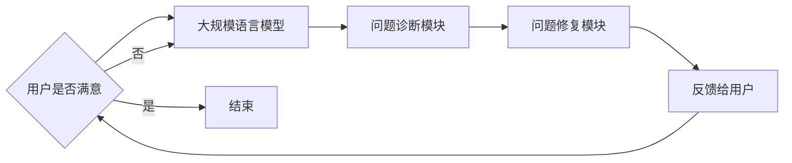

# 大规模语言模型在自动编程问题诊断与修复中的交互式应用

> 关键词：大规模语言模型、自动编程、问题诊断、问题修复、交互式应用

> 摘要：本文聚焦于大规模语言模型在自动编程问题诊断与修复中的交互式应用。首先介绍了相关背景，包括研究目的、预期读者等内容。接着阐述了核心概念与联系，深入讲解大规模语言模型、自动编程、问题诊断与修复以及交互式应用之间的关系和原理。详细剖析了核心算法原理和具体操作步骤，并结合Python代码进行阐述。探讨了相关数学模型和公式，通过具体例子进行说明。给出项目实战案例，包括开发环境搭建、源代码实现与解读。分析了实际应用场景，推荐了学习资源、开发工具框架和相关论文著作。最后总结了未来发展趋势与挑战，还包含常见问题解答和扩展阅读参考资料，旨在全面深入地探讨大规模语言模型在该领域的应用。

## 1. 背景介绍 
### 1.1 目的和范围
在当今软件开发的快速发展过程中，编程过程中出现的问题日益复杂多样，开发人员需要花费大量的时间和精力来进行问题的诊断和修复。大规模语言模型的出现为解决这一问题提供了新的思路和方法。本研究的目的在于探索如何利用大规模语言模型实现自动编程问题的诊断与修复，并通过交互式的方式提高问题解决的效率和准确性。

本研究的范围涵盖了大规模语言模型的基本原理、与自动编程问题诊断和修复相关的算法和技术，以及如何实现交互式应用。同时，通过实际项目案例来验证相关技术的可行性和有效性。

### 1.2 预期读者
本文的预期读者包括软件开发人员、人工智能研究人员、计算机科学专业的学生以及对自动编程和大规模语言模型感兴趣的技术爱好者。对于软件开发人员，本文可以提供解决编程问题的新方法和工具；对于人工智能研究人员，可以作为研究大规模语言模型应用的参考；对于学生，可以帮助他们了解相关领域的前沿技术；对于技术爱好者，可以拓宽他们的技术视野。

### 1.3 文档结构概述
本文将按照以下结构进行阐述：首先介绍背景信息，包括研究目的、预期读者等。接着深入探讨核心概念与联系，包括大规模语言模型、自动编程、问题诊断与修复以及交互式应用的原理和相互关系。然后详细讲解核心算法原理和具体操作步骤，并给出Python代码示例。随后介绍相关的数学模型和公式，并举例说明。通过项目实战案例展示代码的实际实现和详细解释。分析实际应用场景，推荐学习资源、开发工具框架和相关论文著作。最后总结未来发展趋势与挑战，提供常见问题解答和扩展阅读参考资料。

### 1.4 术语表
#### 1.4.1 核心术语定义
- **大规模语言模型**：基于深度学习技术，通过在大规模文本数据上进行训练得到的语言模型，能够学习到语言的模式和规律，具有强大的语言理解和生成能力。
- **自动编程**：利用计算机技术自动生成代码的过程，旨在减少人工编写代码的工作量，提高编程效率。
- **问题诊断**：在编程过程中，对出现的错误或异常进行分析和定位的过程，以确定问题的根源。
- **问题修复**：根据问题诊断的结果，对代码进行修改和调整，以解决编程过程中出现的问题。
- **交互式应用**：用户与系统之间进行实时交互的应用方式，用户可以通过输入信息获取系统的反馈，系统也可以根据用户的输入进行相应的处理和响应。

#### 1.4.2 相关概念解释
- **自然语言处理（NLP）**：研究计算机与人类语言之间交互的领域，大规模语言模型是自然语言处理中的重要技术之一。
- **机器学习**：让计算机通过数据和算法自动学习和改进性能的技术，大规模语言模型通常基于机器学习算法进行训练。
- **深度学习**：机器学习的一个分支，通过构建深度神经网络来学习数据的特征和模式，大规模语言模型大多采用深度学习技术。

#### 1.4.3 缩略词列表
- **NLP**：自然语言处理（Natural Language Processing）
- **ML**：机器学习（Machine Learning）
- **DL**：深度学习（Deep Learning）

## 2. 核心概念与联系 

### 核心概念原理

#### 大规模语言模型
大规模语言模型基于深度学习架构，如Transformer。Transformer由编码器和解码器组成，编码器将输入的文本转换为一系列的特征表示，解码器根据这些特征表示生成输出文本。大规模语言模型通过在海量的文本数据上进行训练，学习到语言的语法、语义和上下文信息。例如，GPT系列模型通过自监督学习的方式，在大规模的互联网文本数据上进行训练，能够生成高质量的文本。

#### 自动编程
自动编程的核心思想是利用计算机算法和技术自动生成代码。它可以基于模板、规则或机器学习模型来实现。基于模板的自动编程是根据预先定义的代码模板，填充相关的参数来生成代码；基于规则的自动编程是根据一系列的编程规则和逻辑来生成代码；基于机器学习模型的自动编程则是通过训练模型来学习代码的模式和规律，从而生成符合要求的代码。

#### 问题诊断与修复
问题诊断是通过分析代码的执行结果、日志信息、错误提示等，定位代码中存在的问题。常见的问题诊断方法包括静态代码分析和动态代码分析。静态代码分析是在代码不运行的情况下，对代码的语法、结构和逻辑进行分析；动态代码分析是在代码运行过程中，收集代码的执行信息，如变量的值、函数的调用栈等，来分析问题。问题修复则是根据问题诊断的结果，对代码进行修改和调整，以解决问题。

#### 交互式应用
交互式应用允许用户与系统进行实时交互。在自动编程问题诊断与修复中，用户可以输入问题描述、代码片段等信息，系统根据用户的输入进行问题诊断和修复，并将结果反馈给用户。用户可以根据系统的反馈进一步提供信息或提出新的问题，形成一个交互的过程。

### 架构的文本示意图
```plaintext
用户输入（问题描述、代码片段等） -> 大规模语言模型（理解用户输入、分析问题） -> 问题诊断模块（定位问题） -> 问题修复模块（生成修复方案） -> 反馈给用户（修复后的代码、问题解释等）
```

### Mermaid流程图


## 3. 核心算法原理 & 具体操作步骤 

### 核心算法原理

#### 大规模语言模型的使用
大规模语言模型可以用于理解用户输入的自然语言问题描述和代码片段。通过将用户输入作为模型的输入，模型可以生成相关的语义表示。例如，使用预训练的GPT模型，将用户输入的问题描述作为输入，模型可以输出对应的文本向量表示，这个向量表示包含了问题的语义信息。

#### 问题诊断算法
问题诊断算法可以基于规则或机器学习方法。基于规则的问题诊断是根据预先定义的规则来判断代码中是否存在问题。例如，检查代码中是否存在语法错误、变量未定义等问题。基于机器学习的问题诊断是通过训练模型来学习问题的模式和特征。例如，使用分类算法对代码进行分类，判断代码是否存在问题以及问题的类型。

#### 问题修复算法
问题修复算法可以基于模板或生成式方法。基于模板的问题修复是根据问题的类型，从预先定义的代码模板中选择合适的模板，填充相关的参数来生成修复后的代码。生成式问题修复是利用大规模语言模型生成修复后的代码。例如，将问题描述和原始代码作为输入，让大规模语言模型生成修复后的代码。

### 具体操作步骤

#### 步骤1：用户输入
用户输入问题描述和相关的代码片段。问题描述可以是自然语言文本，代码片段可以是出现问题的代码部分。

#### 步骤2：大规模语言模型处理
将用户输入的问题描述和代码片段输入到大规模语言模型中，模型对输入进行处理，生成语义表示。

#### 步骤3：问题诊断
根据大规模语言模型生成的语义表示，使用问题诊断算法对代码进行分析，定位问题的位置和类型。

#### 步骤4：问题修复
根据问题诊断的结果，使用问题修复算法生成修复后的代码。

#### 步骤5：反馈给用户
将修复后的代码和问题解释反馈给用户，用户可以根据反馈信息进行进一步的操作。

### Python源代码示例

```python
import openai

# 设置OpenAI API密钥
openai.api_key = "your_api_key"

def get_user_input():
    """获取用户输入"""
    problem_description = input("请输入问题描述：")
    code_snippet = input("请输入相关代码片段：")
    return problem_description, code_snippet

def use_large_language_model(problem_description, code_snippet):
    """使用大规模语言模型处理用户输入"""
    prompt = f"问题描述：{problem_description}\n代码片段：{code_snippet}\n请分析问题并给出修复建议"
    response = openai.Completion.create(
        engine="text-davinci-003",
        prompt=prompt,
        max_tokens=1000,
        temperature=0.7
    )
    return response.choices[0].text

def main():
    problem_description, code_snippet = get_user_input()
    result = use_large_language_model(problem_description, code_snippet)
    print("问题分析和修复建议：")
    print(result)

if __name__ == "__main__":
    main()
```

## 4. 数学模型和公式 & 详细讲解 & 举例说明 

### 大规模语言模型的数学模型

大规模语言模型通常基于神经网络，如Transformer。Transformer的核心是自注意力机制（Self-Attention）。自注意力机制的数学公式如下：

$$Attention(Q, K, V) = softmax(\frac{QK^T}{\sqrt{d_k}})V$$

其中，$Q$ 是查询矩阵，$K$ 是键矩阵，$V$ 是值矩阵，$d_k$ 是键向量的维度。

详细讲解：自注意力机制的作用是计算输入序列中每个位置与其他位置的相关性。$QK^T$ 计算了查询向量与键向量的相似度，除以 $\sqrt{d_k}$ 是为了防止内积结果过大。$softmax$ 函数将相似度转换为概率分布，最后乘以值矩阵 $V$ 得到加权和，作为输出。

举例说明：假设有一个输入序列 $[x_1, x_2, x_3]$，首先将其转换为查询矩阵 $Q$、键矩阵 $K$ 和值矩阵 $V$。然后计算 $QK^T$，得到一个相似度矩阵。对相似度矩阵进行 $softmax$ 操作，得到每个位置与其他位置的注意力权重。最后将注意力权重乘以值矩阵 $V$，得到输出。

### 问题诊断的数学模型

基于机器学习的问题诊断可以使用分类算法，如逻辑回归。逻辑回归的数学模型如下：

$$P(y = 1|x) = \frac{1}{1 + e^{-(w^Tx + b)}}$$

其中，$x$ 是输入特征向量，$w$ 是权重向量，$b$ 是偏置，$P(y = 1|x)$ 是样本属于正类的概率。

详细讲解：逻辑回归通过线性组合输入特征向量 $x$ 和权重向量 $w$，再加上偏置 $b$，得到一个线性得分。然后通过 $sigmoid$ 函数将线性得分转换为概率值。

举例说明：假设有一个代码片段，提取其特征（如代码行数、变量数量等）作为输入特征向量 $x$。训练逻辑回归模型得到权重向量 $w$ 和偏置 $b$。对于新的代码片段，计算 $P(y = 1|x)$，如果概率值大于某个阈值，则判断该代码片段存在问题。

### 问题修复的数学模型

基于生成式方法的问题修复可以使用序列到序列（Seq2Seq）模型。Seq2Seq 模型由编码器和解码器组成。编码器将输入序列转换为一个固定长度的向量表示，解码器根据这个向量表示生成输出序列。

编码器的数学模型可以表示为：

$$h_t = f(x_t, h_{t - 1})$$

其中，$x_t$ 是输入序列的第 $t$ 个元素，$h_t$ 是编码器在第 $t$ 个时间步的隐藏状态，$f$ 是编码器的神经网络函数。

解码器的数学模型可以表示为：

$$y_t = g(s_t, c)$$

其中，$y_t$ 是解码器在第 $t$ 个时间步的输出，$s_t$ 是解码器在第 $t$ 个时间步的隐藏状态，$c$ 是编码器输出的向量表示，$g$ 是解码器的神经网络函数。

详细讲解：编码器将输入序列逐步转换为隐藏状态，最终得到一个固定长度的向量表示。解码器根据这个向量表示和自身的隐藏状态生成输出序列。

举例说明：假设有一个问题描述和原始代码作为输入序列，编码器将其转换为一个向量表示。解码器根据这个向量表示生成修复后的代码作为输出序列。

## 5. 项目实战：代码实际案例和详细解释说明 

### 5.1  开发环境搭建

#### 安装Python
首先需要安装Python环境，建议使用Python 3.7及以上版本。可以从Python官方网站（https://www.python.org/downloads/）下载并安装。

#### 安装相关库
使用pip安装所需的库，包括OpenAI库、numpy等。
```bash
pip install openai numpy
```

#### 注册OpenAI API
需要注册OpenAI账号，并获取API密钥。将API密钥设置为环境变量或在代码中直接使用。

### 5.2  源代码详细实现和代码解读

```python
import openai
import numpy as np

# 设置OpenAI API密钥
openai.api_key = "your_api_key"

def get_user_input():
    """获取用户输入"""
    problem_description = input("请输入问题描述：")
    code_snippet = input("请输入相关代码片段：")
    return problem_description, code_snippet

def use_large_language_model(problem_description, code_snippet):
    """使用大规模语言模型处理用户输入"""
    prompt = f"问题描述：{problem_description}\n代码片段：{code_snippet}\n请分析问题并给出修复建议"
    response = openai.Completion.create(
        engine="text-davinci-003",
        prompt=prompt,
        max_tokens=1000,
        temperature=0.7
    )
    return response.choices[0].text

def main():
    problem_description, code_snippet = get_user_input()
    result = use_large_language_model(problem_description, code_snippet)
    print("问题分析和修复建议：")
    print(result)

if __name__ == "__main__":
    main()
```

代码解读：
- `get_user_input` 函数：通过 `input` 函数获取用户输入的问题描述和代码片段，并返回这两个值。
- `use_large_language_model` 函数：将用户输入的问题描述和代码片段组合成一个提示信息，使用OpenAI的 `text-davinci-003` 模型进行处理。设置 `max_tokens` 为1000，表示最多生成1000个词的输出。`temperature` 为0.7，控制生成文本的随机性。
- `main` 函数：调用 `get_user_input` 函数获取用户输入，然后调用 `use_large_language_model` 函数处理用户输入，最后将处理结果打印输出。

### 5.3  代码解读与分析

#### 优点
- 简单易用：代码结构简单，通过调用OpenAI的API可以快速实现利用大规模语言模型进行问题诊断和修复的功能。
- 灵活性：可以根据用户的输入动态调整提示信息，适应不同的问题场景。

#### 缺点
- 成本问题：使用OpenAI的API需要付费，对于大规模的使用可能会有较高的成本。
- 准确性：大规模语言模型的输出结果可能存在一定的误差，需要用户进行进一步的验证和调整。

## 6. 实际应用场景 

### 软件开发团队
在软件开发团队中，开发人员在编写代码的过程中可能会遇到各种问题。大规模语言模型在自动编程问题诊断与修复中的交互式应用可以帮助开发人员快速定位和解决问题，提高开发效率。例如，当开发人员遇到一个复杂的算法问题时，可以输入问题描述和相关代码，系统可以快速分析问题并给出修复建议。

### 编程教育
在编程教育中，学生在学习编程的过程中可能会遇到各种错误和问题。使用大规模语言模型的交互式应用可以帮助学生更好地理解问题的本质和解决方法。例如，学生在编写Python代码时遇到语法错误，通过输入代码片段和问题描述，系统可以分析错误原因并给出修复后的代码，帮助学生学习和提高编程能力。

### 开源项目贡献
在开源项目中，贡献者可能来自不同的背景和水平。大规模语言模型的交互式应用可以帮助贡献者快速解决代码中的问题，提高代码的质量和可维护性。例如，当贡献者提交的代码存在问题时，项目维护者可以使用该应用分析问题并给出修复建议，促进开源项目的发展。

## 7. 工具和资源推荐
### 7.1 学习资源推荐
#### 7.1.1 书籍推荐
- 《深度学习》（Deep Learning）：由Ian Goodfellow、Yoshua Bengio和Aaron Courville编写，是深度学习领域的经典教材，详细介绍了深度学习的基本原理和算法。
- 《Python自然语言处理》（Natural Language Processing with Python）：由Steven Bird、Ewan Klein和Edward Loper编写，介绍了使用Python进行自然语言处理的方法和技术。
- 《人工智能：一种现代的方法》（Artificial Intelligence: A Modern Approach）：由Stuart Russell和Peter Norvig编写，全面介绍了人工智能的各个领域和方法。

#### 7.1.2 在线课程
- Coursera上的“深度学习专项课程”（Deep Learning Specialization）：由Andrew Ng教授授课，包括深度学习的基础、卷积神经网络、循环神经网络等内容。
- edX上的“自然语言处理”（Natural Language Processing）：由哥伦比亚大学教授授课，介绍了自然语言处理的基本概念和技术。
- Udemy上的“Python编程从入门到精通”（Python Programming from Beginner to Advanced）：适合初学者学习Python编程。

#### 7.1.3 技术博客和网站
- Medium：有很多关于人工智能、深度学习和自然语言处理的技术博客文章。
- Towards Data Science：专注于数据科学和机器学习领域的技术文章。
- OpenAI官方博客：可以了解OpenAI的最新研究成果和技术进展。

### 7.2 开发工具框架推荐
#### 7.2.1 IDE和编辑器
- PyCharm：一款专业的Python集成开发环境，提供了代码编辑、调试、版本控制等功能。
- Visual Studio Code：一款轻量级的代码编辑器，支持多种编程语言，有丰富的插件可以扩展功能。
- Jupyter Notebook：适合进行数据探索和交互式编程，方便展示代码和结果。

#### 7.2.2 调试和性能分析工具
- PDB：Python自带的调试器，可以帮助开发人员定位和解决代码中的问题。
- cProfile：Python的性能分析工具，可以分析代码的执行时间和资源消耗。
- TensorBoard：用于可视化深度学习模型的训练过程和性能指标。

#### 7.2.3 相关框架和库
- PyTorch：一个开源的深度学习框架，提供了丰富的神经网络模块和工具。
- TensorFlow：另一个广泛使用的深度学习框架，支持分布式训练和模型部署。
- Hugging Face Transformers：提供了预训练的大规模语言模型和相关工具，方便进行自然语言处理任务。

### 7.3 相关论文著作推荐
#### 7.3.1 经典论文
- “Attention Is All You Need”：介绍了Transformer架构，是大规模语言模型的基础。
- “BERT: Pre-training of Deep Bidirectional Transformers for Language Understanding”：提出了BERT模型，在自然语言处理领域取得了很大的成功。
- “Generative Adversarial Nets”：提出了生成对抗网络（GAN），在图像生成和文本生成等领域有广泛的应用。

#### 7.3.2 最新研究成果
- 关注顶级学术会议，如NeurIPS、ICML、ACL等，这些会议上会有关于大规模语言模型和自动编程的最新研究成果。
- 关注相关学术期刊，如Journal of Artificial Intelligence Research、Artificial Intelligence等。

#### 7.3.3 应用案例分析
- 可以在ACM Digital Library、IEEE Xplore等数据库中查找关于大规模语言模型在自动编程问题诊断与修复中的应用案例分析论文。

## 8. 总结：未来发展趋势与挑战

### 未来发展趋势

#### 更强大的语言模型
随着计算资源的不断提升和算法的不断改进，未来的大规模语言模型将具有更强大的语言理解和生成能力。这将使得自动编程问题诊断与修复更加准确和高效。

#### 多模态融合
未来的系统可能会融合多种模态的信息，如代码、文本、图像等。例如，通过分析代码的可视化表示来辅助问题诊断和修复。

#### 个性化服务
根据用户的编程习惯、经验水平等提供个性化的问题诊断和修复服务。例如，对于初学者提供更详细的解释和指导，对于有经验的开发人员提供更高效的解决方案。

### 挑战

#### 数据隐私和安全
大规模语言模型的训练需要大量的数据，这些数据可能包含敏感信息。如何保证数据的隐私和安全是一个重要的挑战。

#### 模型可解释性
大规模语言模型通常是黑盒模型，其决策过程难以解释。在自动编程问题诊断与修复中，需要能够解释模型的决策过程，以便用户信任和验证修复结果。

#### 性能和效率
随着代码规模的不断增大和问题复杂度的不断提高，如何保证系统的性能和效率是一个挑战。需要优化算法和模型结构，提高系统的响应速度和处理能力。

## 9. 附录：常见问题与解答

### 问题1：大规模语言模型生成的修复代码一定正确吗？
答：不一定。大规模语言模型的输出结果可能存在一定的误差，需要用户进行进一步的验证和调整。模型的准确性受到训练数据、模型结构等多种因素的影响。

### 问题2：使用OpenAI的API有什么限制？
答：OpenAI的API有一定的使用限制，如请求频率限制、令牌数量限制等。具体的限制可以参考OpenAI的官方文档。

### 问题3：如何提高大规模语言模型在自动编程问题诊断与修复中的性能？
答：可以通过以下方法提高性能：使用更多高质量的训练数据、优化模型结构、调整超参数、结合其他技术（如规则引擎）等。

### 问题4：大规模语言模型在处理不同编程语言的问题时效果一样吗？
答：不同的大规模语言模型对不同编程语言的处理效果可能不同。一些模型在训练时使用了多种编程语言的数据，对多种编程语言的处理效果较好；而一些模型可能更侧重于特定的编程语言。

## 10. 扩展阅读 & 参考资料

### 扩展阅读
- 《人工智能时代的编程教育变革》
- 《深度学习在软件开发中的应用前景》
- 《自然语言处理技术的最新进展》

### 参考资料
- OpenAI官方文档：https://platform.openai.com/docs/
- Hugging Face官方文档：https://huggingface.co/docs/
- PyTorch官方文档：https://pytorch.org/docs/stable/
- TensorFlow官方文档：https://www.tensorflow.org/api_docs