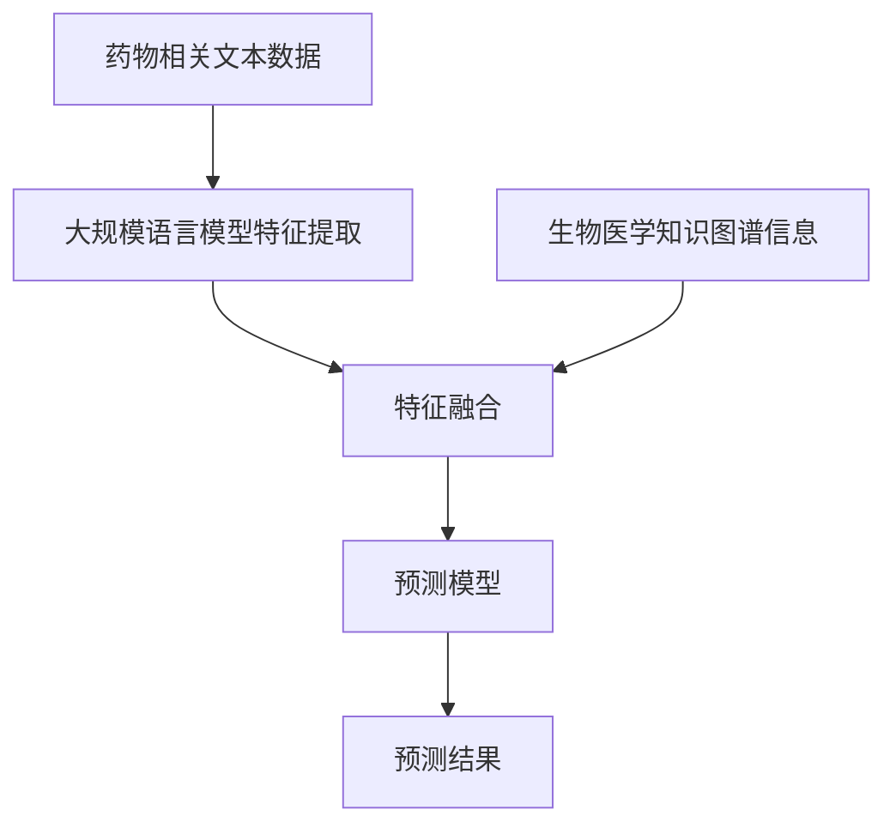

# 大规模语言模型在药物相互作用预测中的应用

> 关键词：大规模语言模型、药物相互作用预测、人工智能、生物医学、深度学习

> 摘要：本文深入探讨了大规模语言模型在药物相互作用预测领域的应用。首先介绍了相关背景，包括研究目的、预期读者、文档结构和术语表等。接着阐述了核心概念与联系，通过文本示意图和 Mermaid 流程图展示其原理和架构。详细讲解了核心算法原理和具体操作步骤，结合 Python 源代码进行阐述。同时给出了数学模型和公式，并举例说明。通过项目实战展示了代码实际案例和详细解释。分析了大规模语言模型在药物相互作用预测中的实际应用场景，推荐了相关的学习资源、开发工具框架和论文著作。最后总结了未来发展趋势与挑战，提供了常见问题与解答以及扩展阅读和参考资料，旨在全面呈现大规模语言模型在药物相互作用预测中的重要作用和应用前景。

## 1. 背景介绍 
### 1.1 目的和范围
药物相互作用是指两种或两种以上药物同时或先后序贯应用时，药物之间的相互影响和干扰。准确预测药物相互作用对于临床用药安全、新药研发等具有至关重要的意义。传统的药物相互作用预测方法存在诸多局限性，如效率低、准确性有限等。大规模语言模型的出现为药物相互作用预测带来了新的机遇。本文章的目的在于深入探讨大规模语言模型在药物相互作用预测中的应用原理、方法和实际效果，范围涵盖从基础概念到实际应用案例，以及相关工具和资源的推荐。

### 1.2 预期读者
本文预期读者包括生物医学领域的研究人员、人工智能和机器学习领域的专业人士、药物研发人员、临床医生以及对药物相互作用预测和大规模语言模型应用感兴趣的学生和爱好者。

### 1.3 文档结构概述
本文首先介绍相关背景知识，包括目的、读者、结构和术语表。然后阐述核心概念与联系，展示其原理和架构。接着详细讲解核心算法原理和具体操作步骤，结合数学模型和公式进行说明。通过项目实战给出代码实际案例和详细解释。分析实际应用场景，推荐相关工具和资源。最后总结未来发展趋势与挑战，提供常见问题与解答和扩展阅读及参考资料。

### 1.4 术语表
#### 1.4.1 核心术语定义
- **大规模语言模型**：是指基于大量文本数据训练的语言模型，具有强大的语言理解和生成能力，如 GPT 系列、BERT 等。
- **药物相互作用**：两种或两种以上药物同时或先后序贯应用时，药物之间的相互影响和干扰，可能导致疗效改变、不良反应增加等。
- **药物相互作用预测**：通过各种方法和技术，对药物之间可能存在的相互作用进行预测和评估。

#### 1.4.2 相关概念解释
- **生物医学数据**：包括药物化学结构数据、基因数据、蛋白质数据、临床数据等与生物医学领域相关的数据。
- **深度学习**：是机器学习的一个分支领域，通过构建多层神经网络模型，自动从大量数据中学习特征和模式。

#### 1.4.3 缩略词列表
- **LLM**：Large Language Model，大规模语言模型
- **AI**：Artificial Intelligence，人工智能
- **ML**：Machine Learning，机器学习
- **NLP**：Natural Language Processing，自然语言处理

## 2. 核心概念与联系 

### 核心概念原理
大规模语言模型在药物相互作用预测中的应用基于其强大的语言理解和生成能力。首先，将药物相关信息，如药物名称、化学结构、作用机制等转化为文本数据。大规模语言模型通过对这些文本数据的学习和理解，能够捕捉到药物之间潜在的相互关系。其原理在于大规模语言模型在预训练过程中学习到了丰富的语言知识和语义信息，这些信息可以用于挖掘药物相互作用的规律。

### 架构的文本示意图
```plaintext
输入层：药物相关文本数据（药物名称、化学结构、作用机制等）
|
特征提取层：大规模语言模型对输入文本进行特征提取，得到药物的语义特征表示
|
特征融合层：将不同来源的药物特征进行融合，如结合生物医学知识图谱的信息
|
预测层：基于融合后的特征，使用分类或回归模型进行药物相互作用预测
|
输出层：预测结果（是否存在相互作用、相互作用的类型和强度等）
```

### Mermaid 流程图


## 3. 核心算法原理 & 具体操作步骤 

### 核心算法原理
大规模语言模型在药物相互作用预测中常用的算法包括基于预训练语言模型的微调、知识图谱融合等。以基于预训练语言模型的微调为例，其原理是在大规模通用语料上预训练的语言模型基础上，使用药物相互作用相关的数据集对模型进行微调，使其能够更好地适应药物相互作用预测任务。

### 具体操作步骤

#### 数据准备
收集药物相关的文本数据，包括药物说明书、临床研究报告、生物医学文献等。对数据进行清洗和预处理，如去除噪声、统一格式等。

#### 模型选择
选择合适的大规模语言模型，如 BERT、GPT 等。这些模型具有不同的特点和优势，可以根据具体任务和数据情况进行选择。

#### 微调模型
使用药物相互作用相关的数据集对选择的预训练语言模型进行微调。在微调过程中，需要定义合适的损失函数和优化器，以最小化预测结果与真实标签之间的误差。

#### 预测
使用微调后的模型对新的药物组合进行预测，得到药物相互作用的预测结果。

### Python 源代码实现

```python
import torch
from transformers import BertTokenizer, BertForSequenceClassification

# 数据准备
train_texts = ["Drug A and Drug B may interact", "Drug C has no interaction with Drug D"]
train_labels = [1, 0]  # 1 表示存在相互作用，0 表示不存在相互作用

# 模型选择
tokenizer = BertTokenizer.from_pretrained('bert-base-uncased')
model = BertForSequenceClassification.from_pretrained('bert-base-uncased', num_labels=2)

# 数据预处理
train_encodings = tokenizer(train_texts, truncation=True, padding=True)
train_dataset = torch.utils.data.TensorDataset(
    torch.tensor(train_encodings['input_ids']),
    torch.tensor(train_encodings['attention_mask']),
    torch.tensor(train_labels)
)

# 定义训练参数
train_loader = torch.utils.data.DataLoader(train_dataset, batch_size=2, shuffle=True)
optimizer = torch.optim.Adam(model.parameters(), lr=1e-5)

# 微调模型
device = torch.device('cuda') if torch.cuda.is_available() else torch.device('cpu')
model.to(device)
model.train()
for epoch in range(3):
    for batch in train_loader:
        batch = tuple(t.to(device) for t in batch)
        input_ids, attention_mask, labels = batch
        optimizer.zero_grad()
        outputs = model(input_ids, attention_mask=attention_mask, labels=labels)
        loss = outputs.loss
        loss.backward()
        optimizer.step()

# 预测
test_text = ["Drug E and Drug F might interact"]
test_encoding = tokenizer(test_text, truncation=True, padding=True)
test_input_ids = torch.tensor(test_encoding['input_ids']).to(device)
test_attention_mask = torch.tensor(test_encoding['attention_mask']).to(device)
model.eval()
with torch.no_grad():
    outputs = model(test_input_ids, attention_mask=test_attention_mask)
    logits = outputs.logits
    predictions = torch.argmax(logits, dim=1)
    print("预测结果:", predictions.item())
```

## 4. 数学模型和公式 & 详细讲解 & 举例说明 

### 数学模型和公式
在基于预训练语言模型的微调中，常用的损失函数是交叉熵损失函数。对于二分类问题，交叉熵损失函数的公式为：

$$L = -\frac{1}{N}\sum_{i=1}^{N}[y_i\log(p_i)+(1 - y_i)\log(1 - p_i)]$$

其中，$N$ 是样本数量，$y_i$ 是第 $i$ 个样本的真实标签（0 或 1），$p_i$ 是模型预测第 $i$ 个样本为正类的概率。

### 详细讲解
交叉熵损失函数的作用是衡量模型预测结果与真实标签之间的差异。当真实标签 $y_i = 1$ 时，损失函数主要关注 $p_i$ 的值，$p_i$ 越接近 1，损失越小；当真实标签 $y_i = 0$ 时，损失函数主要关注 $1 - p_i$ 的值，$1 - p_i$ 越接近 1（即 $p_i$ 越接近 0），损失越小。在训练过程中，通过最小化交叉熵损失函数，模型可以不断调整参数，使得预测结果更接近真实标签。

### 举例说明
假设有一个二分类问题，真实标签 $y = [1, 0]$，模型预测的概率 $p = [0.8, 0.2]$。根据交叉熵损失函数公式计算损失：

对于第一个样本，$y_1 = 1$，$p_1 = 0.8$，则 $y_1\log(p_1)=1\times\log(0.8)\approx - 0.223$，$(1 - y_1)\log(1 - p_1)=0\times\log(0.2)=0$。

对于第二个样本，$y_2 = 0$，$p_2 = 0.2$，则 $y_2\log(p_2)=0\times\log(0.2)=0$，$(1 - y_2)\log(1 - p_2)=1\times\log(0.8)\approx - 0.223$。

$N = 2$，则损失 $L = -\frac{1}{2}(-0.223 - 0.223)=0.223$。

## 5. 项目实战：代码实际案例和详细解释说明 

### 5.1  开发环境搭建
- **操作系统**：推荐使用 Linux 或 macOS，也可以使用 Windows。
- **Python 版本**：建议使用 Python 3.7 及以上版本。
- **依赖库安装**：使用 pip 安装所需的库，如 `transformers`、`torch` 等。
```bash
pip install transformers torch
```

### 5.2  源代码详细实现和代码解读

```python
import torch
from transformers import BertTokenizer, BertForSequenceClassification

# 数据准备
train_texts = ["Drug A and Drug B may interact", "Drug C has no interaction with Drug D"]
train_labels = [1, 0]  # 1 表示存在相互作用，0 表示不存在相互作用

# 代码解读：导入所需的库，定义训练文本和对应的标签
# torch 是深度学习框架，用于张量计算和自动求导
# BertTokenizer 用于对文本进行分词和编码
# BertForSequenceClassification 是基于 BERT 的文本分类模型

# 模型选择
tokenizer = BertTokenizer.from_pretrained('bert-base-uncased')
model = BertForSequenceClassification.from_pretrained('bert-base-uncased', num_labels=2)

# 代码解读：选择预训练的 BERT 模型和对应的分词器
# 'bert-base-uncased' 是预训练的 BERT 基础模型，不区分大小写
# num_labels=2 表示这是一个二分类任务

# 数据预处理
train_encodings = tokenizer(train_texts, truncation=True, padding=True)
train_dataset = torch.utils.data.TensorDataset(
    torch.tensor(train_encodings['input_ids']),
    torch.tensor(train_encodings['attention_mask']),
    torch.tensor(train_labels)
)

# 代码解读：使用分词器对训练文本进行编码，得到输入 ID 和注意力掩码
# truncation=True 表示对过长的文本进行截断
# padding=True 表示对较短的文本进行填充
# 将编码后的文本和标签转换为 PyTorch 数据集

# 定义训练参数
train_loader = torch.utils.data.DataLoader(train_dataset, batch_size=2, shuffle=True)
optimizer = torch.optim.Adam(model.parameters(), lr=1e-5)

# 代码解读：使用 DataLoader 对数据集进行批量加载，batch_size=2 表示每次加载 2 个样本
# shuffle=True 表示在每个 epoch 开始时打乱数据顺序
# Adam 是一种常用的优化器，lr=1e-5 是学习率

# 微调模型
device = torch.device('cuda') if torch.cuda.is_available() else torch.device('cpu')
model.to(device)
model.train()
for epoch in range(3):
    for batch in train_loader:
        batch = tuple(t.to(device) for t in batch)
        input_ids, attention_mask, labels = batch
        optimizer.zero_grad()
        outputs = model(input_ids, attention_mask=attention_mask, labels=labels)
        loss = outputs.loss
        loss.backward()
        optimizer.step()

# 代码解读：将模型移动到 GPU 或 CPU 上进行训练
# model.train() 表示将模型设置为训练模式
# 进行 3 个 epoch 的训练，每个 epoch 遍历所有样本
# 在每个 batch 中，将数据移动到设备上，前向传播计算损失，反向传播更新模型参数

# 预测
test_text = ["Drug E and Drug F might interact"]
test_encoding = tokenizer(test_text, truncation=True, padding=True)
test_input_ids = torch.tensor(test_encoding['input_ids']).to(device)
test_attention_mask = torch.tensor(test_encoding['attention_mask']).to(device)
model.eval()
with torch.no_grad():
    outputs = model(test_input_ids, attention_mask=test_attention_mask)
    logits = outputs.logits
    predictions = torch.argmax(logits, dim=1)
    print("预测结果:", predictions.item())

# 代码解读：定义测试文本，进行编码并转换为张量
# model.eval() 表示将模型设置为评估模式
# 使用 torch.no_grad() 关闭梯度计算，提高预测效率
# 前向传播得到 logits，通过 argmax 函数得到预测结果
```

### 5.3  代码解读与分析
通过上述代码，我们实现了一个基于 BERT 模型的药物相互作用预测系统。在数据准备阶段，将药物相互作用的文本和标签进行整理。模型选择阶段，使用预训练的 BERT 模型和分词器。数据预处理阶段，对文本进行编码和转换为数据集。在训练阶段，使用 Adam 优化器对模型进行微调，最小化交叉熵损失函数。在预测阶段，将模型设置为评估模式，对新的药物组合进行预测。

## 6. 实际应用场景 
### 临床用药决策支持
在临床治疗中，医生需要同时使用多种药物治疗患者的疾病。大规模语言模型可以帮助医生预测药物之间的相互作用，避免潜在的不良反应，提高用药安全性和有效性。例如，在治疗心血管疾病时，患者可能同时使用降压药、降脂药等多种药物，通过预测药物相互作用，医生可以调整用药方案。

### 新药研发
在新药研发过程中，需要评估新药与现有药物之间的相互作用。大规模语言模型可以快速筛选出可能存在相互作用的药物组合，为新药研发提供参考。例如，在研发抗癌新药时，需要考虑新药与化疗药物、靶向药物等的相互作用。

### 药物警戒
药物警戒是监测药物不良反应和相互作用的重要工作。大规模语言模型可以分析大量的临床数据、药品说明书、文献等信息，及时发现潜在的药物相互作用信号，为药物警戒提供支持。

### 个性化医疗
不同患者的基因、生理状态等因素可能影响药物相互作用。大规模语言模型可以结合患者的个体信息，实现个性化的药物相互作用预测，为患者提供更精准的用药建议。

## 7. 工具和资源推荐
### 7.1 学习资源推荐
#### 7.1.1 书籍推荐
- 《深度学习》（Deep Learning）：由 Ian Goodfellow、Yoshua Bengio 和 Aaron Courville 所著，是深度学习领域的经典教材，涵盖了深度学习的基本原理、算法和应用。
- 《自然语言处理入门》：介绍了自然语言处理的基本概念、方法和技术，对于理解大规模语言模型有很大帮助。
- 《生物信息学概论》：了解生物医学数据和相关知识，为将大规模语言模型应用于药物相互作用预测提供基础。

#### 7.1.2 在线课程
- Coursera 上的“深度学习专项课程”（Deep Learning Specialization）：由 Andrew Ng 教授授课，系统介绍了深度学习的各个方面。
- edX 上的“自然语言处理基础”（Foundations of Natural Language Processing）：深入讲解自然语言处理的核心技术和应用。
- 中国大学 MOOC 上的“生物信息学”课程：帮助学习者掌握生物信息学的基本原理和方法。

#### 7.1.3 技术博客和网站
- Hugging Face 博客：提供大规模语言模型的最新进展、技术文章和应用案例。
- arXiv.org：一个预印本服务器，包含了大量的人工智能、生物医学等领域的研究论文。
- BioRxiv：专注于生物医学领域的预印本平台，可获取最新的生物医学研究成果。

### 7.2 开发工具框架推荐
#### 7.2.1 IDE和编辑器
- PyCharm：一款专业的 Python 集成开发环境，提供代码编辑、调试、版本控制等功能。
- Visual Studio Code：轻量级的代码编辑器，支持多种编程语言和插件扩展，适合快速开发和调试。

#### 7.2.2 调试和性能分析工具
- TensorBoard：用于可视化深度学习模型的训练过程和性能指标，帮助开发者分析模型的训练效果。
- PyTorch Profiler：可以对 PyTorch 模型的性能进行分析，找出性能瓶颈。

#### 7.2.3 相关框架和库
- Transformers：Hugging Face 开发的用于自然语言处理的库，提供了多种预训练语言模型和工具。
- Scikit-learn：一个简单易用的机器学习库，提供了各种机器学习算法和工具，可用于数据预处理、模型评估等。
- RDKit：一个用于化学信息学的开源库，可用于处理药物化学结构数据。

### 7.3 相关论文著作推荐
#### 7.3.1 经典论文
- “BERT: Pre-training of Deep Bidirectional Transformers for Language Understanding”：介绍了 BERT 模型的原理和训练方法，是大规模语言模型领域的经典论文。
- “Attention Is All You Need”：提出了 Transformer 架构，为大规模语言模型的发展奠定了基础。

#### 7.3.2 最新研究成果
- 关注 arXiv.org 和 BioRxiv 上关于大规模语言模型在药物相互作用预测方面的最新研究论文，了解该领域的前沿进展。

#### 7.3.3 应用案例分析
- 查阅相关的学术期刊和会议论文，了解大规模语言模型在临床用药决策、新药研发等实际应用场景中的案例分析和效果评估。

## 8. 总结：未来发展趋势与挑战
### 未来发展趋势
- **多模态融合**：将大规模语言模型与图像、基因数据等多模态信息融合，提高药物相互作用预测的准确性和全面性。例如，结合药物的化学结构图像和相关文本信息进行更深入的分析。
- **强化学习的应用**：引入强化学习算法，使模型能够在动态环境中不断学习和优化药物相互作用预测策略，提高预测的适应性和灵活性。
- **跨领域合作**：加强生物医学、计算机科学、数学等多领域的合作，整合不同领域的知识和技术，推动大规模语言模型在药物相互作用预测中的发展。

### 挑战
- **数据质量和标注问题**：生物医学数据往往存在噪声、不完整等问题，且药物相互作用数据的标注成本高、难度大，影响模型的训练效果和准确性。
- **模型可解释性**：大规模语言模型通常是黑盒模型，其决策过程难以解释，在临床应用中可能会引起医生和患者的不信任。
- **计算资源需求**：训练和运行大规模语言模型需要大量的计算资源，限制了其在实际应用中的推广和普及。

## 9. 附录：常见问题与解答
### 问题 1：大规模语言模型在药物相互作用预测中的准确性如何？
答：大规模语言模型的准确性受到多种因素的影响，如数据质量、模型选择、训练方法等。目前的研究表明，通过合理的数据处理和模型优化，大规模语言模型可以取得较好的预测效果，但仍存在一定的提升空间。

### 问题 2：如何选择合适的大规模语言模型？
答：选择合适的大规模语言模型需要考虑任务需求、数据特点和计算资源等因素。例如，如果数据量较小，可以选择相对轻量级的模型；如果任务对语言理解能力要求较高，可以选择预训练效果较好的模型。

### 问题 3：大规模语言模型在药物相互作用预测中的应用是否会替代医生的决策？
答：不会。大规模语言模型在药物相互作用预测中可以提供参考和辅助决策，但医生的专业知识和临床经验仍然是不可或缺的。模型的预测结果需要医生结合患者的具体情况进行综合判断。

## 10. 扩展阅读 & 参考资料
### 扩展阅读
- 关注相关的学术会议和研讨会，如 NeurIPS（神经信息处理系统大会）、ACL（计算语言学协会年会）、ISMB（智能系统分子生物学会议）等，了解最新的研究成果和发展趋势。
- 阅读相关的行业报告和白皮书，了解大规模语言模型在生物医学领域的应用现状和前景。

### 参考资料
- Goodfellow, I., Bengio, Y., & Courville, A. (2016). Deep Learning. MIT Press.
- Devlin, J., Chang, M. W., Lee, K., & Toutanova, K. (2018). BERT: Pre-training of Deep Bidirectional Transformers for Language Understanding. arXiv preprint arXiv:1810.04805.
- Vaswani, A., Shazeer, N., Parmar, N., Uszkoreit, J., Jones, L., Gomez, A. N., ... & Polosukhin, I. (2017). Attention Is All You Need. Advances in neural information processing systems, 5998-6008.