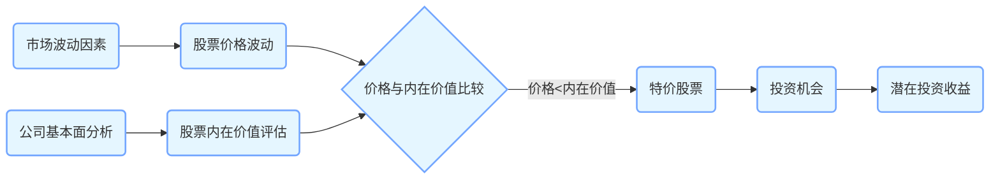

# 如何利用市场波动寻找特价股票机会

> 关键词：市场波动、特价股票、股票估值、投资策略、风险控制、财务分析、技术分析

> 摘要：本文围绕如何利用市场波动寻找特价股票机会展开深入探讨。首先介绍了相关的背景知识，包括目的范围、预期读者等。接着阐述了核心概念，如市场波动的原理以及特价股票的判定标准。通过详细讲解核心算法原理和具体操作步骤，运用 Python 代码示例展示了如何筛选股票。深入探讨了数学模型和公式，以帮助投资者更好地理解和评估股票价值。通过项目实战，从开发环境搭建到源代码实现和解读，展示了实际操作过程。还分析了实际应用场景，推荐了相关的工具和资源。最后总结了未来发展趋势与挑战，提供常见问题解答和扩展阅读参考资料，旨在为投资者提供全面、系统的利用市场波动寻找特价股票机会的方法和思路。

## 1. 背景介绍 
### 1.1 目的和范围
在股票投资领域，市场波动是常态。市场的起伏变化既带来了风险，也蕴含着众多投资机会。本文章的目的在于深入探讨如何巧妙地利用市场波动来发现特价股票，为投资者提供一套科学、系统且具有可操作性的投资方法和策略。我们将研究范围聚焦于股票市场，涵盖了不同行业、不同规模的上市公司股票，旨在通过对市场波动规律的分析和对股票价值的评估，帮助投资者准确识别那些价格被低估的特价股票，从而获取潜在的投资收益。

### 1.2 预期读者
本文预期读者主要包括对股票投资有一定兴趣且希望深入学习如何利用市场波动进行投资的个人投资者。无论是初涉股市的新手，渴望了解股票投资的基本原理和方法，还是有一定投资经验的投资者，希望进一步优化自己的投资策略，提高投资收益，都能从本文中获得有价值的信息和启发。同时，金融专业的学生和研究人员也可以将本文作为参考资料，深入研究股票市场的投资策略和市场行为。

### 1.3 文档结构概述
本文将按照以下结构展开：首先介绍相关背景知识，包括目的范围、预期读者等内容，让读者对文章的整体方向有清晰的了解。接着深入阐述核心概念，明确市场波动、特价股票等关键概念的内涵和联系，并通过文本示意图和 Mermaid 流程图进行直观展示。然后详细讲解核心算法原理和具体操作步骤，结合 Python 代码示例，使读者能够掌握筛选特价股票的具体方法。随后介绍数学模型和公式，帮助读者从理论层面深入理解股票价值评估的原理。通过项目实战，展示如何在实际操作中运用所学知识，包括开发环境搭建、源代码实现和解读。分析实际应用场景，让读者了解这些方法在不同市场环境下的应用。推荐相关的工具和资源，为读者提供学习和实践的便利。最后总结未来发展趋势与挑战，解答常见问题，并提供扩展阅读参考资料。

### 1.4 术语表
#### 1.4.1 核心术语定义
- **市场波动**：指股票市场中股票价格在一定时期内的上下变动情况。这种波动受到多种因素的影响，如宏观经济数据、公司业绩、政策法规、市场情绪等。市场波动是股票市场的基本特征之一，其幅度和频率反映了市场的活跃程度和不确定性。
- **特价股票**：是指其市场价格低于其内在价值的股票。内在价值是基于公司的基本面因素，如财务状况、盈利能力、行业前景等，通过一定的估值方法计算得出的股票的合理价值。当市场价格低于内在价值时，股票被认为具有投资价值，是潜在的特价股票。
- **股票估值**：是对股票内在价值进行评估的过程。通过运用各种估值模型和方法，结合公司的财务数据、行业信息等因素，计算出股票的合理价值，为投资者判断股票价格是否合理提供依据。

#### 1.4.2 相关概念解释
- **基本面分析**：是一种通过研究公司的基本情况来评估股票价值的方法。主要关注公司的财务报表、经营管理、行业竞争地位等方面的信息，以判断公司的盈利能力、成长潜力和财务健康状况，从而确定股票的内在价值。
- **技术分析**：是通过研究股票价格和交易量的历史数据，运用各种技术指标和图表形态来预测股票价格未来走势的方法。技术分析认为市场行为包容消化一切信息，价格以趋势方式演变，历史会重演。
- **风险控制**：是指在投资过程中，通过采取一系列措施来降低投资风险的行为。包括合理的资产配置、设置止损点、分散投资等方法，以保护投资者的本金安全，确保投资组合的稳定性。

#### 1.4.3 缩略词列表
- **PE**：市盈率（Price Earnings Ratio），是指股票价格与每股收益的比率，反映了市场对公司盈利的预期和估值水平。
- **PB**：市净率（Price to Book Ratio），是指股票价格与每股净资产的比率，用于衡量股票价格相对于公司净资产的倍数，反映了股票的估值水平。
- **ROE**：净资产收益率（Return on Equity），是指公司净利润与净资产的比率，反映了公司运用自有资本的效率和盈利能力。

## 2. 核心概念与联系 

### 核心概念原理
- **市场波动原理**：市场波动是由多种因素共同作用的结果。宏观经济因素如 GDP 增长率、通货膨胀率、利率水平等会影响整个市场的走势。当经济增长强劲时，企业盈利预期增加，投资者对股票的需求上升，推动股票价格上涨；反之，经济衰退时，股票价格往往下跌。公司自身因素如业绩好坏、重大事件（如并购、重组、新产品推出等）也会导致股价波动。行业竞争格局的变化、政策法规的调整等也会对相关行业的股票价格产生影响。此外，市场情绪也是影响市场波动的重要因素，投资者的乐观或悲观情绪会导致股票价格的过度上涨或下跌。
- **特价股票判定标准**：判定一只股票是否为特价股票需要综合考虑多个因素。首先，从估值角度来看，较低的市盈率、市净率等指标往往表明股票可能被低估。例如，如果一家公司的市盈率明显低于同行业平均水平，且公司的盈利能力和成长前景良好，那么该股票可能是特价股票。其次，公司的财务状况也是重要的判断依据，如资产负债表健康、现金流充足、盈利能力稳定等。此外，还需要考虑行业前景和公司的竞争优势，如果公司所处行业具有良好的发展前景，且公司在行业中具有较强的竞争地位，那么即使当前股价较低，也可能是具有投资价值的特价股票。

### 文本示意图
市场波动与特价股票的关系可以用以下示意图表示：

市场波动受到多种因素影响，包括宏观经济因素、公司因素、行业因素和市场情绪等。这些因素导致股票价格上下波动。在价格波动过程中，通过对公司基本面的分析和估值，判断股票价格是否低于其内在价值。如果低于内在价值，则该股票可能是特价股票，投资者可以寻找机会买入。随着市场的发展和公司价值的体现，股票价格可能会回归其内在价值，投资者从而获得投资收益。

### Mermaid 流程图


## 3. 核心算法原理 & 具体操作步骤 

### 核心算法原理
我们可以通过构建一个简单的股票筛选算法来寻找特价股票。该算法的核心思想是综合考虑股票的估值指标和财务指标，筛选出那些估值较低且财务状况良好的股票。具体步骤如下：
1. **数据收集**：收集股票的相关数据，包括市盈率、市净率、净资产收益率、净利润增长率等。
2. **指标计算**：根据收集到的数据，计算每个股票的综合得分。综合得分的计算可以采用加权平均的方法，不同指标赋予不同的权重。例如，市盈率和市净率可以赋予较高的权重，因为它们直接反映了股票的估值水平；净资产收益率和净利润增长率可以赋予一定的权重，反映公司的盈利能力和成长潜力。
3. **筛选股票**：根据综合得分，筛选出得分较高的股票。这些股票通常具有较低的估值和较好的财务状况，可能是特价股票。

### Python 源代码实现
```python
import pandas as pd

# 定义股票数据
stocks = {
    '股票代码': ['000001', '000002', '000003', '000004', '000005'],
    '市盈率': [10, 15, 20, 8, 12],
    '市净率': [1.5, 2, 2.5, 1, 1.8],
    '净资产收益率': [0.15, 0.12, 0.1, 0.2, 0.13],
    '净利润增长率': [0.2, 0.15, 0.1, 0.25, 0.18]
}

# 将数据转换为 DataFrame
df = pd.DataFrame(stocks)

# 定义指标权重
weights = {
    '市盈率': 0.3,
    '市净率': 0.3,
    '净资产收益率': 0.2,
    '净利润增长率': 0.2
}

# 计算综合得分
df['综合得分'] = (df['市盈率'].rank(ascending=True) * weights['市盈率'] +
                    df['市净率'].rank(ascending=True) * weights['市净率'] +
                    df['净资产收益率'].rank(ascending=False) * weights['净资产收益率'] +
                    df['净利润增长率'].rank(ascending=False) * weights['净利润增长率'])

# 筛选得分较高的股票
top_stocks = df[df['综合得分'] >= df['综合得分'].quantile(0.8)]

print(top_stocks)
```

### 具体操作步骤
1. **数据收集**：可以通过金融数据网站（如东方财富网、同花顺等）或专业的金融数据接口（如 Wind、Tushare 等）收集股票的相关数据。将收集到的数据整理成表格形式，方便后续处理。
2. **数据处理**：使用 Python 的 Pandas 库将收集到的数据转换为 DataFrame 格式，方便进行数据处理和分析。
3. **指标计算**：根据定义的指标权重，计算每个股票的综合得分。可以使用 Pandas 的 rank() 函数对每个指标进行排名，然后根据权重进行加权平均。
4. **股票筛选**：根据综合得分，筛选出得分较高的股票。可以设置一个阈值，如选择得分在前 20% 的股票作为潜在的特价股票。

## 4. 数学模型和公式 & 详细讲解 & 举例说明 

### 数学模型
我们可以使用以下数学模型来计算股票的综合得分：

$$S = w_{PE} \times R_{PE} + w_{PB} \times R_{PB} + w_{ROE} \times R_{ROE} + w_{G} \times R_{G}$$

其中：
- $S$ 表示股票的综合得分；
- $w_{PE}$、$w_{PB}$、$w_{ROE}$、$w_{G}$ 分别表示市盈率、市净率、净资产收益率、净利润增长率的权重；
- $R_{PE}$、$R_{PB}$、$R_{ROE}$、$R_{G}$ 分别表示市盈率、市净率、净资产收益率、净利润增长率的排名得分。

### 详细讲解
- **权重设置**：权重的设置反映了不同指标在评估股票价值时的重要程度。一般来说，市盈率和市净率直接反映了股票的估值水平，因此可以赋予较高的权重；净资产收益率和净利润增长率反映了公司的盈利能力和成长潜力，可以赋予一定的权重。权重的具体数值可以根据投资者的投资偏好和市场情况进行调整。
- **排名得分计算**：排名得分是根据每个指标的数值进行排名得到的。对于市盈率和市净率，数值越低排名越靠前，排名得分越高；对于净资产收益率和净利润增长率，数值越高排名越靠前，排名得分越高。

### 举例说明
假设我们有三只股票 A、B、C，它们的相关数据如下：

| 股票 | 市盈率 | 市净率 | 净资产收益率 | 净利润增长率 |
| ---- | ---- | ---- | ---- | ---- |
| A | 10 | 1.5 | 0.15 | 0.2 |
| B | 15 | 2 | 0.12 | 0.15 |
| C | 20 | 2.5 | 0.1 | 0.1 |

我们设置权重为：$w_{PE} = 0.3$，$w_{PB} = 0.3$，$w_{ROE} = 0.2$，$w_{G} = 0.2$。

首先计算每个指标的排名得分：
- 市盈率排名：A（1）、B（2）、C（3），排名得分分别为 3、2、1。
- 市净率排名：A（1）、B（2）、C（3），排名得分分别为 3、2、1。
- 净资产收益率排名：A（1）、B（2）、C（3），排名得分分别为 3、2、1。
- 净利润增长率排名：A（1）、B（2）、C（3），排名得分分别为 3、2、1。

然后计算综合得分：
- 股票 A 的综合得分：$S_A = 0.3 \times 3 + 0.3 \times 3 + 0.2 \times 3 + 0.2 \times 3 = 3$
- 股票 B 的综合得分：$S_B = 0.3 \times 2 + 0.3 \times 2 + 0.2 \times 2 + 0.2 \times 2 = 2$
- 股票 C 的综合得分：$S_C = 0.3 \times 1 + 0.3 \times 1 + 0.2 \times 1 + 0.2 \times 1 = 1$

根据综合得分，股票 A 的得分最高，可能是最具投资价值的特价股票。

## 5. 项目实战：代码实际案例和详细解释说明 

### 5.1  开发环境搭建
1. **安装 Python**：可以从 Python 官方网站（https://www.python.org/downloads/）下载并安装最新版本的 Python。建议安装 Python 3.7 及以上版本。
2. **安装必要的库**：使用以下命令安装必要的库：
```sh
pip install pandas
```
Pandas 是一个强大的数据处理和分析库，用于处理股票数据。

### 5.2  源代码详细实现和代码解读
```python
import pandas as pd

# 定义股票数据
stocks = {
    '股票代码': ['000001', '000002', '000003', '000004', '000005'],
    '市盈率': [10, 15, 20, 8, 12],
    '市净率': [1.5, 2, 2.5, 1, 1.8],
    '净资产收益率': [0.15, 0.12, 0.1, 0.2, 0.13],
    '净利润增长率': [0.2, 0.15, 0.1, 0.25, 0.18]
}

# 将数据转换为 DataFrame
df = pd.DataFrame(stocks)

# 定义指标权重
weights = {
    '市盈率': 0.3,
    '市净率': 0.3,
    '净资产收益率': 0.2,
    '净利润增长率': 0.2
}

# 计算综合得分
df['综合得分'] = (df['市盈率'].rank(ascending=True) * weights['市盈率'] +
                    df['市净率'].rank(ascending=True) * weights['市净率'] +
                    df['净资产收益率'].rank(ascending=False) * weights['净资产收益率'] +
                    df['净利润增长率'].rank(ascending=False) * weights['净利润增长率'])

# 筛选得分较高的股票
top_stocks = df[df['综合得分'] >= df['综合得分'].quantile(0.8)]

print(top_stocks)
```

### 代码解读与分析
1. **数据定义**：使用字典 `stocks` 定义了股票的相关数据，包括股票代码、市盈率、市净率、净资产收益率和净利润增长率。
2. **DataFrame 转换**：使用 `pd.DataFrame()` 函数将字典数据转换为 Pandas 的 DataFrame 格式，方便进行数据处理和分析。
3. **指标权重定义**：使用字典 `weights` 定义了每个指标的权重，用于计算综合得分。
4. **综合得分计算**：使用 `rank()` 函数对每个指标进行排名，然后根据权重进行加权平均，计算出每个股票的综合得分。
5. **股票筛选**：使用 `quantile()` 函数计算综合得分的 80% 分位数，筛选出得分高于该分位数的股票作为潜在的特价股票。
6. **结果输出**：使用 `print()` 函数输出筛选出的特价股票。

## 6. 实际应用场景 
### 牛市行情中的应用
在牛市行情中，市场整体上涨，但不同股票的涨幅可能存在差异。有些股票可能由于暂时的原因（如短期业绩波动、行业负面消息等）涨幅较小，导致其估值相对较低。投资者可以利用市场波动，通过上述方法筛选出这些特价股票，在市场继续上涨的过程中，这些股票可能有较大的补涨空间，从而为投资者带来较高的收益。

### 熊市行情中的应用
在熊市行情中，市场整体下跌，但也有一些股票的基本面较好，只是受到市场整体氛围的影响而股价下跌。投资者可以通过分析公司的财务状况和估值水平，寻找那些被错杀的特价股票。当市场行情反转时，这些股票可能率先反弹，为投资者带来超额收益。

### 震荡行情中的应用
在震荡行情中，市场价格波动频繁，股票价格可能在一定范围内上下波动。投资者可以利用市场的波动，在股票价格处于低位时买入特价股票，在价格上涨到一定程度时卖出，实现波段操作，获取差价收益。

## 7. 工具和资源推荐
### 7.1 学习资源推荐
#### 7.1.1 书籍推荐
- 《聪明的投资者》（The Intelligent Investor）：作者本杰明·格雷厄姆（Benjamin Graham），被誉为投资界的圣经。本书系统地阐述了价值投资的理念和方法，对于理解股票估值和寻找特价股票具有重要的指导意义。
- 《证券分析》（Security Analysis）：同样是本杰明·格雷厄姆的经典著作，深入探讨了证券分析的基本原理和方法，包括财务报表分析、估值模型等内容，是投资者必备的参考书。
- 《巴菲特致股东的信》（Letters to Shareholders of Berkshire Hathaway）：作者沃伦·巴菲特（Warren Buffett），通过巴菲特历年写给股东的信，读者可以了解到他的投资理念、选股策略和对市场的看法，对于学习如何寻找优质股票具有很大的启发。

#### 7.1.2 在线课程
- Coursera 平台上的“投资学原理”课程：由知名高校的教授授课，系统地介绍了投资学的基本原理和方法，包括股票投资、债券投资、资产配置等内容，适合初学者学习。
- 网易云课堂上的“股票投资实战技巧”课程：由资深投资专家授课，结合实际案例，讲解了如何利用市场波动进行股票投资，包括选股方法、买卖时机把握等内容，具有很强的实用性。

#### 7.1.3 技术博客和网站
- 雪球网（https://xueqiu.com/）：是一个知名的投资交流社区，汇聚了众多投资爱好者和专业人士。用户可以在雪球网上查看股票的实时行情、研究报告、投资策略等内容，还可以与其他投资者交流经验和看法。
- 东方财富网（https://www.eastmoney.com/）：提供全面的金融信息和数据服务，包括股票行情、财经新闻、研究报告等内容。投资者可以通过东方财富网了解市场动态和公司信息，为投资决策提供参考。

### 7.2 开发工具框架推荐
#### 7.2.1 IDE和编辑器
- PyCharm：是一款专业的 Python 集成开发环境（IDE），具有代码编辑、调试、版本控制等功能，适合开发复杂的 Python 程序。
- Visual Studio Code：是一款轻量级的代码编辑器，支持多种编程语言，具有丰富的插件和扩展功能，适合快速开发和调试 Python 代码。

#### 7.2.2 调试和性能分析工具
- PDB：是 Python 自带的调试工具，可以帮助开发者在代码中设置断点、单步执行、查看变量值等，方便调试代码。
- cProfile：是 Python 的性能分析工具，可以帮助开发者分析代码的性能瓶颈，找出执行时间较长的代码段，进行优化。

#### 7.2.3 相关框架和库
- Pandas：是一个强大的数据处理和分析库，提供了丰富的数据结构和函数，方便进行数据清洗、处理和分析。
- NumPy：是 Python 的科学计算库，提供了高效的数组操作和数学函数，用于处理大规模的数值数据。
- Matplotlib：是 Python 的绘图库，用于绘制各种类型的图表，如折线图、柱状图、散点图等，方便可视化数据。

### 7.3 相关论文著作推荐
#### 7.3.1 经典论文
- Fama, E. F., & French, K. R. (1992). The cross - section of expected stock returns. The Journal of Finance, 47(2), 427 - 465. 该论文提出了著名的 Fama - French 三因子模型，用于解释股票收益率的差异，对于理解股票定价和投资策略具有重要的理论意义。
- Sharpe, W. F. (1964). Capital asset prices: A theory of market equilibrium under conditions of risk. The Journal of Finance, 19(3), 425 - 442. 该论文提出了资本资产定价模型（CAPM），为资产定价和投资组合理论奠定了基础。

#### 7.3.2 最新研究成果
可以通过学术数据库（如知网、万方、Web of Science 等）搜索关于股票市场波动、股票估值和投资策略的最新研究论文，了解行业的最新发展动态和研究趋势。

#### 7.3.3 应用案例分析
一些金融研究机构和咨询公司会发布关于股票投资的应用案例分析报告，通过分析实际的投资案例，介绍投资策略的应用和效果。投资者可以通过这些报告学习如何在实际操作中运用各种投资策略，提高投资收益。

## 8. 总结：未来发展趋势与挑战
### 未来发展趋势
- **智能化投资**：随着人工智能和机器学习技术的不断发展，智能化投资将成为未来的发展趋势。通过利用大数据和人工智能算法，可以更准确地分析市场波动和股票价值，实现自动化的投资决策。
- **全球化投资**：随着全球经济一体化的发展，投资者将越来越多地参与全球股票市场的投资。不同国家和地区的股票市场具有不同的特点和机会，全球化投资可以帮助投资者分散风险，获取更高的收益。
- **绿色投资和社会责任投资**：随着社会对环境保护和社会责任的关注度不断提高，绿色投资和社会责任投资将成为未来的投资热点。投资者将更加注重公司的环境、社会和治理（ESG）表现，选择具有良好社会形象和可持续发展能力的公司进行投资。

### 挑战
- **市场不确定性增加**：随着全球政治经济形势的变化和科技的快速发展，股票市场的不确定性将不断增加。各种突发事件（如疫情、战争、政策调整等）可能导致市场剧烈波动，给投资者带来更大的风险。
- **数据质量和安全问题**：在智能化投资过程中，数据的质量和安全至关重要。不准确或不完整的数据可能导致投资决策失误，而数据泄露和安全问题可能给投资者带来损失。
- **技术更新换代快**：人工智能和机器学习技术发展迅速，投资者需要不断学习和更新知识，以适应技术的变化。同时，新技术的应用也可能带来新的风险和挑战，需要投资者谨慎对待。

## 9. 附录：常见问题与解答
### 问题 1：如何确定指标的权重？
指标的权重可以根据投资者的投资偏好和市场情况进行调整。一般来说，市盈率和市净率直接反映了股票的估值水平，可以赋予较高的权重；净资产收益率和净利润增长率反映了公司的盈利能力和成长潜力，可以赋予一定的权重。投资者可以通过回测不同的权重组合，找到最适合自己的权重设置。

### 问题 2：如何处理缺失数据？
如果在数据收集过程中存在缺失数据，可以采用以下方法进行处理：
- **删除缺失数据**：如果缺失数据的比例较小，可以直接删除包含缺失数据的样本。
- **填充缺失数据**：可以使用均值、中位数、众数等统计量填充缺失数据，也可以使用插值法或机器学习算法进行填充。

### 问题 3：如何判断市场波动是短期波动还是长期趋势？
判断市场波动是短期波动还是长期趋势需要综合考虑多个因素，包括宏观经济数据、政策法规、行业发展趋势等。一般来说，短期波动通常是由市场情绪、突发事件等因素引起的，持续时间较短；而长期趋势则是由宏观经济基本面、行业发展趋势等因素决定的，持续时间较长。投资者可以通过分析相关数据和信息，结合技术分析和基本面分析方法，来判断市场波动的性质。

## 10. 扩展阅读 & 参考资料
### 扩展阅读
- 《金融炼金术》（The Alchemy of Finance）：作者乔治·索罗斯（George Soros），介绍了他的反身性理论和投资哲学，对于理解市场的复杂性和不确定性具有重要的启示。
- 《非理性繁荣》（Irrational Exuberance）：作者罗伯特·席勒（Robert J. Shiller），探讨了金融市场中的非理性行为和泡沫现象，对于投资者避免盲目跟风和过度投资具有重要的参考价值。

### 参考资料
- 东方财富网（https://www.eastmoney.com/）：提供了丰富的股票市场数据和财经新闻。
- 雪球网（https://xueqiu.com/）：是一个投资交流社区，有很多投资者分享的投资经验和研究报告。
- 相关金融学术期刊和论文数据库，如《金融研究》、Web of Science 等，提供了最新的金融研究成果和学术论文。