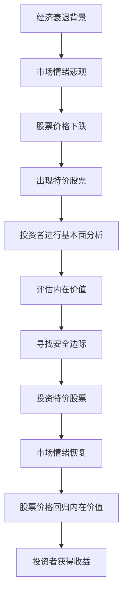

# 如何利用特价股票投资应对经济衰退风险

> 关键词：特价股票、经济衰退、投资策略、风险应对、股票估值、财务分析、市场趋势

> 摘要：本文旨在深入探讨如何利用特价股票投资来应对经济衰退风险。通过对特价股票的概念、核心原理的剖析，详细阐述相关算法和数学模型，结合实际项目案例进行代码实现与解读，分析其在不同场景下的应用，同时推荐学习资源、开发工具及相关论文著作。帮助投资者了解特价股票投资的策略和方法，在经济衰退的背景下做出更明智的投资决策，降低风险并获取潜在收益。

## 1. 背景介绍 
### 1.1 目的和范围
在经济衰退期间，市场往往充满不确定性和风险，投资者的资产面临缩水的压力。特价股票投资作为一种策略，旨在寻找被市场低估的股票，通过合理的投资布局，在经济衰退时不仅能抵御风险，还可能获得可观的收益。本文的范围涵盖了特价股票的定义、核心原理、投资算法、数学模型，以及实际应用案例等多个方面，全面介绍如何利用特价股票投资来应对经济衰退风险。

### 1.2 预期读者
本文预期读者包括有一定投资基础的个人投资者、金融从业者、投资机构研究人员等。对于那些希望在经济衰退环境下优化投资组合、降低风险的人士具有较高的参考价值。

### 1.3 文档结构概述
本文首先介绍相关背景信息，包括目的、读者和文档结构。接着阐述特价股票的核心概念与联系，通过示意图和流程图帮助读者理解。然后详细讲解核心算法原理及具体操作步骤，结合 Python 源代码进行说明。再介绍数学模型和公式，并举例说明。通过项目实战展示代码实际案例及详细解释。分析实际应用场景，推荐相关工具和资源。最后总结未来发展趋势与挑战，提供常见问题解答和扩展阅读参考资料。

### 1.4 术语表
#### 1.4.1 核心术语定义
- **特价股票**：指市场价格低于其内在价值的股票。内在价值是基于公司的基本面，如财务状况、盈利能力、行业地位等因素综合评估得出的股票真实价值。
- **经济衰退**：指经济活动普遍放缓、国民收入减少、失业率上升的时期，通常伴随着股市下跌、企业盈利下降等现象。
- **股票估值**：通过一定的方法和模型，评估股票的内在价值，以判断股票是否被低估或高估。
- **财务分析**：对企业的财务报表进行分析，了解企业的财务状况、经营成果和现金流量，为投资决策提供依据。

#### 1.4.2 相关概念解释
- **安全边际**：指股票的内在价值与市场价格之间的差额。安全边际越大，投资风险越低。
- **市盈率（PE）**：指股票价格与每股收益的比率，反映了市场对公司盈利的预期。较低的市盈率可能表示股票被低估。
- **市净率（PB）**：指股票价格与每股净资产的比率，反映了股票的账面价值与市场价格的关系。较低的市净率可能意味着股票具有投资价值。

#### 1.4.3 缩略词列表
- **PE**：Price - Earnings Ratio（市盈率）
- **PB**：Price - Book Ratio（市净率）
- **EPS**：Earnings Per Share（每股收益）

## 2. 核心概念与联系 

### 核心概念原理
特价股票投资的核心原理基于价值投资理论。价值投资认为，股票的市场价格会围绕其内在价值波动。在经济衰退期间，市场情绪往往过度悲观，导致许多股票的市场价格大幅下跌，低于其内在价值，从而出现特价股票。投资者通过深入研究公司的基本面，评估其内在价值，寻找具有安全边际的特价股票进行投资。当市场情绪恢复，股票价格回归其内在价值时，投资者就能获得收益。

### 架构的文本示意图
```plaintext
经济衰退背景
|
|-- 市场情绪悲观
|   |
|   |-- 股票价格下跌
|       |
|       |-- 出现特价股票
|           |
|           |-- 投资者进行基本面分析
|               |
|               |-- 评估内在价值
|                   |
|                   |-- 寻找安全边际
|                       |
|                       |-- 投资特价股票
|                           |
|                           |-- 市场情绪恢复
|                               |
|                               |-- 股票价格回归内在价值
|                                   |
|                                   |-- 投资者获得收益
```

### Mermaid 流程图


## 3. 核心算法原理 & 具体操作步骤 

### 核心算法原理
在寻找特价股票时，我们可以使用一些财务指标和算法来评估股票的价值。其中，常用的指标包括市盈率（PE）、市净率（PB）、股息率等。以下是一个简单的算法原理，通过计算这些指标并与同行业平均水平进行比较，来筛选出可能的特价股票。

### 具体操作步骤
1. **数据收集**：收集股票的基本信息，包括股票代码、名称、行业分类等，以及财务数据，如每股收益（EPS）、每股净资产（BVPS）、股息等。
2. **计算指标**：根据收集到的数据，计算市盈率（PE = 股票价格 / EPS）、市净率（PB = 股票价格 / BVPS）、股息率（股息率 = 股息 / 股票价格）等指标。
3. **同行业比较**：获取同行业的平均市盈率、市净率和股息率等数据，将计算得到的指标与同行业平均水平进行比较。
4. **筛选特价股票**：选择市盈率、市净率低于同行业平均水平，且股息率高于同行业平均水平的股票作为潜在的特价股票。

### Python 源代码实现
```python
import pandas as pd

# 模拟股票数据
data = {
    '股票代码': ['000001', '000002', '000003'],
    '股票名称': ['公司 A', '公司 B', '公司 C'],
    '行业分类': ['金融', '金融', '金融'],
    '股票价格': [10, 15, 20],
    '每股收益': [1, 1.5, 2],
    '每股净资产': [5, 8, 10],
    '股息': [0.5, 0.8, 1]
}

df = pd.DataFrame(data)

# 计算指标
df['市盈率'] = df['股票价格'] / df['每股收益']
df['市净率'] = df['股票价格'] / df['每股净资产']
df['股息率'] = df['股息'] / df['股票价格']

# 假设同行业平均市盈率为 12，市净率为 2，股息率为 0.04
industry_avg_pe = 12
industry_avg_pb = 2
industry_avg_dividend_yield = 0.04

# 筛选特价股票
special_stocks = df[(df['市盈率'] < industry_avg_pe) & (df['市净率'] < industry_avg_pb) & (df['股息率'] > industry_avg_dividend_yield)]

print(special_stocks)
```
### 代码解释
1. **数据模拟**：使用 `pandas` 库创建一个包含股票基本信息和财务数据的 DataFrame。
2. **指标计算**：根据公式计算市盈率、市净率和股息率，并将结果添加到 DataFrame 中。
3. **同行业比较**：假设同行业的平均市盈率、市净率和股息率，通过条件筛选出符合特价股票条件的股票。
4. **结果输出**：打印出筛选出的特价股票信息。

## 4. 数学模型和公式 & 详细讲解 & 举例说明 

### 数学模型和公式
- **市盈率（PE）**：
$$PE = \frac{P}{EPS}$$
其中，$P$ 表示股票价格，$EPS$ 表示每股收益。

- **市净率（PB）**：
$$PB = \frac{P}{BVPS}$$
其中，$P$ 表示股票价格，$BVPS$ 表示每股净资产。

- **股息率（Dividend Yield）**：
$$Dividend\ Yield = \frac{D}{P}$$
其中，$D$ 表示股息，$P$ 表示股票价格。

### 详细讲解
- **市盈率（PE）**：市盈率反映了市场对公司盈利的预期。较低的市盈率可能表示市场对公司的预期较低，或者公司的盈利被低估。一般来说，市盈率低于同行业平均水平的股票可能具有投资价值。
- **市净率（PB）**：市净率反映了股票的账面价值与市场价格的关系。较低的市净率可能表示股票的市场价格低于其账面价值，具有一定的安全边际。
- **股息率（Dividend Yield）**：股息率反映了公司向股东分配利润的能力。较高的股息率表示公司能够为股东提供较高的现金回报，在经济衰退期间，稳定的股息收入可以增加投资的安全性。

### 举例说明
假设股票 A 的价格为 20 元，每股收益为 2 元，每股净资产为 10 元，股息为 1 元。则：
- 市盈率（PE）：$PE = \frac{20}{2} = 10$
- 市净率（PB）：$PB = \frac{20}{10} = 2$
- 股息率（Dividend Yield）：$Dividend\ Yield = \frac{1}{20} = 0.05 = 5\%$

如果同行业平均市盈率为 12，市净率为 2.5，股息率为 4%，则股票 A 的市盈率低于同行业平均水平，市净率略低于同行业平均水平，股息率高于同行业平均水平，可能是一只特价股票。

## 5. 项目实战：代码实际案例和详细解释说明 

### 5.1  开发环境搭建
- **Python 环境**：建议使用 Python 3.7 及以上版本。可以从 Python 官方网站（https://www.python.org/downloads/）下载并安装。
- **开发工具**：推荐使用 PyCharm 或 Jupyter Notebook 作为开发工具。
- **依赖库安装**：使用 `pip` 安装所需的库，如 `pandas`、`numpy` 等。
```sh
pip install pandas numpy
```

### 5.2  源代码详细实现和代码解读
以下是一个更完整的项目实战代码，用于从网络获取股票数据并筛选特价股票。

```python
import pandas as pd
import requests
from bs4 import BeautifulSoup

# 定义获取股票数据的函数
def get_stock_data():
    url = 'https://example.com/stock_data'  # 替换为实际的股票数据网站
    response = requests.get(url)
    soup = BeautifulSoup(response.text, 'html.parser')
    # 解析网页数据，获取股票信息
    data = []
    rows = soup.find_all('tr')
    for row in rows[1:]:
        cols = row.find_all('td')
        stock_code = cols[0].text.strip()
        stock_name = cols[1].text.strip()
        industry = cols[2].text.strip()
        price = float(cols[3].text.strip())
        eps = float(cols[4].text.strip())
        bvps = float(cols[5].text.strip())
        dividend = float(cols[6].text.strip())
        data.append([stock_code, stock_name, industry, price, eps, bvps, dividend])
    
    df = pd.DataFrame(data, columns=['股票代码', '股票名称', '行业分类', '股票价格', '每股收益', '每股净资产', '股息'])
    return df

# 定义筛选特价股票的函数
def filter_special_stocks(df):
    # 计算指标
    df['市盈率'] = df['股票价格'] / df['每股收益']
    df['市净率'] = df['股票价格'] / df['每股净资产']
    df['股息率'] = df['股息'] / df['股票价格']
    
    # 分组计算同行业平均指标
    industry_avg = df.groupby('行业分类')[['市盈率', '市净率', '股息率']].mean()
    
    special_stocks = []
    for industry in df['行业分类'].unique():
        industry_df = df[df['行业分类'] == industry]
        industry_avg_pe = industry_avg.loc[industry, '市盈率']
        industry_avg_pb = industry_avg.loc[industry, '市净率']
        industry_avg_dividend_yield = industry_avg.loc[industry, '股息率']
        
        special_stocks_industry = industry_df[(industry_df['市盈率'] < industry_avg_pe) & (industry_df['市净率'] < industry_avg_pb) & (industry_df['股息率'] > industry_avg_dividend_yield)]
        special_stocks.append(special_stocks_industry)
    
    special_stocks_df = pd.concat(special_stocks)
    return special_stocks_df

# 主程序
if __name__ == '__main__':
    stock_data = get_stock_data()
    special_stocks = filter_special_stocks(stock_data)
    print(special_stocks)
```

### 代码解读与分析
1. **获取股票数据**：`get_stock_data` 函数通过 `requests` 库发送 HTTP 请求获取股票数据网页的内容，使用 `BeautifulSoup` 库解析网页，提取股票的基本信息和财务数据，并将其存储在 DataFrame 中。
2. **筛选特价股票**：`filter_special_stocks` 函数首先计算每只股票的市盈率、市净率和股息率，然后分组计算同行业的平均指标。最后，根据同行业平均指标筛选出符合条件的特价股票。
3. **主程序**：调用 `get_stock_data` 函数获取股票数据，再调用 `filter_special_stocks` 函数筛选特价股票，并打印结果。

## 6. 实际应用场景 
### 个人投资者
对于个人投资者来说，在经济衰退期间，利用特价股票投资可以优化投资组合，降低风险。个人投资者可以通过分析财务指标，寻找被低估的股票，长期持有，等待市场回升时获得收益。例如，在 2008 年金融危机期间，一些具有稳定现金流和良好基本面的公司股票价格大幅下跌，个人投资者如果能够识别出这些特价股票并进行投资，在随后的市场复苏中获得了可观的回报。

### 投资机构
投资机构可以利用特价股票投资策略进行资产配置。通过大规模的数据分析和研究，筛选出具有投资价值的特价股票，构建投资组合。在经济衰退期间，这些特价股票可以作为防御性资产，降低投资组合的波动性。同时，当市场反弹时，投资机构可以获得超额收益。例如，一些对冲基金在经济衰退期间会加大对特价股票的投资比例，以获取更高的收益。

### 养老金和保险基金
养老金和保险基金等长期投资者需要保证资产的安全性和稳定性。在经济衰退期间，投资特价股票可以在一定程度上抵御通货膨胀和市场波动的风险。这些机构可以选择具有稳定股息和良好基本面的特价股票，长期持有，以获取稳定的收益和资产增值。

## 7. 工具和资源推荐
### 7.1 学习资源推荐
#### 7.1.1 书籍推荐
- 《聪明的投资者》（The Intelligent Investor）：本杰明·格雷厄姆（Benjamin Graham）著，价值投资的经典之作，详细阐述了价值投资的理念和方法。
- 《证券分析》（Security Analysis）：本杰明·格雷厄姆和大卫·多德（David Dodd）著，被誉为投资界的“圣经”，对股票估值、财务分析等方面进行了深入探讨。
- 《巴菲特致股东的信》（Letters to Shareholders）：沃伦·巴菲特（Warren Buffett）著，通过巴菲特的信件，了解他的投资哲学和决策过程。

#### 7.1.2 在线课程
- Coursera 上的“投资学原理”（Principles of Investing）：由知名大学教授授课，系统介绍投资的基本原理和方法。
- Udemy 上的“价值投资实战课程”（Value Investing Practical Course）：通过实际案例讲解价值投资的策略和技巧。

#### 7.1.3 技术博客和网站
- Seeking Alpha（https://seekingalpha.com/）：提供股票分析、投资策略等内容，汇聚了众多投资者和分析师的观点。
- Morningstar（https://www.morningstar.com/）：提供基金、股票等投资产品的评级和分析，以及市场研究报告。

### 7.2 开发工具框架推荐
#### 7.2.1 IDE和编辑器
- PyCharm：功能强大的 Python 集成开发环境，提供代码编辑、调试、版本控制等功能。
- Jupyter Notebook：交互式的开发环境，适合进行数据分析和代码演示。

#### 7.2.2 调试和性能分析工具
- `pdb`：Python 自带的调试工具，用于调试 Python 代码。
- `cProfile`：Python 性能分析工具，用于分析代码的性能瓶颈。

#### 7.2.3 相关框架和库
- `pandas`：用于数据处理和分析的 Python 库，提供了丰富的数据结构和函数。
- `numpy`：用于科学计算的 Python 库，提供了高效的数组操作和数学函数。
- `requests`：用于发送 HTTP 请求的 Python 库，方便获取网络数据。
- `BeautifulSoup`：用于解析 HTML 和 XML 文档的 Python 库，方便提取网页数据。

### 7.3 相关论文著作推荐
#### 7.3.1 经典论文
- “The Arbitrage Pricing Theory of Capital Asset Pricing”（Stephen A. Ross）：提出了套利定价理论，为资产定价提供了新的思路。
- “Efficient Capital Markets: A Review of Theory and Empirical Work”（Eugene F. Fama）：对有效市场假说进行了系统的阐述和实证研究。

#### 7.3.2 最新研究成果
- 关注《Journal of Finance》、《Review of Financial Studies》等金融领域顶级期刊，获取最新的研究成果。

#### 7.3.3 应用案例分析
- 阅读金融机构的研究报告和案例分析，了解特价股票投资在实际中的应用和效果。

## 8. 总结：未来发展趋势与挑战
### 未来发展趋势
- **数字化和智能化**：随着科技的发展，投资分析将越来越依赖于大数据、人工智能等技术。投资者可以利用机器学习算法对海量的股票数据进行分析，更准确地筛选出特价股票。
- **全球化投资**：经济全球化的趋势使得投资者可以更方便地投资全球市场。在经济衰退期间，不同国家和地区的市场表现可能存在差异，投资者可以通过全球化投资分散风险，寻找更多的特价股票投资机会。
- **社会责任投资**：越来越多的投资者开始关注企业的社会责任和可持续发展。在寻找特价股票时，投资者可能会更加注重企业的环境、社会和治理（ESG）因素，将其作为评估股票价值的重要指标。

### 挑战
- **信息获取和分析难度**：在信息爆炸的时代，获取准确、及时的股票信息变得越来越困难。同时，对海量信息的分析和处理也需要投资者具备更高的专业能力和技术水平。
- **市场不确定性**：经济衰退期间，市场的不确定性增加，股票价格的波动更加剧烈。即使是被认为是特价股票的投资，也可能面临价格进一步下跌的风险。
- **监管政策变化**：金融市场的监管政策不断变化，可能会对特价股票投资产生影响。投资者需要及时了解和适应监管政策的变化，确保投资的合法性和合规性。

## 9. 附录：常见问题与解答
### 问题 1：如何确定股票的内在价值？
答：确定股票的内在价值需要综合考虑多个因素，如公司的财务状况、盈利能力、行业前景等。常用的方法包括现金流折现法、股息折现法、相对估值法等。这些方法都有其局限性，投资者需要根据具体情况选择合适的方法，并结合自己的判断进行评估。

### 问题 2：特价股票一定能获得收益吗？
答：不一定。虽然特价股票的市场价格低于其内在价值，但市场价格的回归需要时间，而且在这个过程中可能会受到各种因素的影响，如宏观经济环境、行业竞争、公司经营等。因此，投资特价股票仍然存在风险，投资者需要做好风险管理。

### 问题 3：如何判断经济衰退的到来？
答：经济衰退通常可以通过一些宏观经济指标来判断，如 GDP 增长率、失业率、通货膨胀率等。当 GDP 连续两个季度出现负增长，失业率上升，通货膨胀率下降等情况时，可能预示着经济衰退的到来。此外，还可以关注一些领先指标，如采购经理人指数（PMI）、消费者信心指数等，提前感知经济变化的趋势。

### 问题 4：在经济衰退期间，应该如何调整投资组合？
答：在经济衰退期间，投资者可以适当增加防御性资产的比例，如债券、现金等，降低股票等高风险资产的比例。同时，可以选择一些具有稳定现金流和良好基本面的特价股票进行投资，以降低风险并获取潜在收益。此外，还可以通过分散投资来降低单一资产的风险。

## 10. 扩展阅读 & 参考资料
### 扩展阅读
- 《漫步华尔街》（A Random Walk Down Wall Street）：伯顿·马尔基尔（Burton G. Malkiel）著，介绍了随机漫步理论和投资策略。
- 《金融炼金术》（The Alchemy of Finance）：乔治·索罗斯（George Soros）著，阐述了索罗斯的反身性理论和投资实践。

### 参考资料
- 相关金融网站和数据库，如雅虎财经（https://finance.yahoo.com/）、东方财富网（https://www.eastmoney.com/）等。
- 金融机构的研究报告和行业分析报告。
- 学术期刊和论文数据库，如知网、万方等。