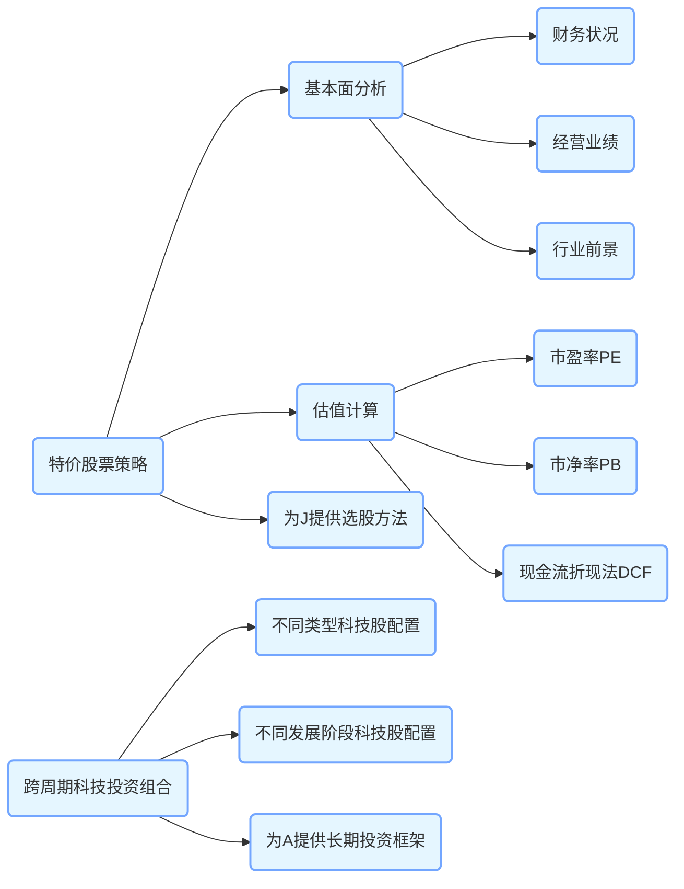

# 如何利用特价股票策略构建跨周期科技投资组合

> 关键词：特价股票策略、跨周期、科技投资组合、投资分析、风险管理

> 摘要：本文旨在深入探讨如何运用特价股票策略来构建跨周期的科技投资组合。通过对特价股票策略的原理、核心算法、数学模型的分析，结合实际案例展示具体的构建步骤。同时，介绍该投资组合在不同场景下的应用，推荐相关的学习资源、开发工具和研究论文，最后总结其未来发展趋势与挑战，为投资者在科技领域的跨周期投资提供全面且深入的指导。

## 1. 背景介绍 
### 1.1 目的和范围
在当今快速发展的科技时代，科技企业的发展变化迅速，股票价格波动较大。投资者面临着如何在科技领域进行长期、稳定投资的挑战。本文章的目的在于详细阐述利用特价股票策略构建跨周期科技投资组合的方法，帮助投资者在科技股市场中把握机会，降低风险，实现资产的稳健增长。范围涵盖了特价股票策略的理论基础、构建投资组合的具体步骤、实际应用案例以及相关资源推荐等方面。

### 1.2 预期读者
本文预期读者包括对科技股投资感兴趣的个人投资者、专业投资机构的研究人员和投资经理、金融领域的学生和学者等。无论是初涉投资领域的新手，还是具有一定经验的专业人士，都能从本文中获取有价值的信息和思路。

### 1.3 文档结构概述
本文将首先介绍相关的背景知识和核心概念，包括特价股票策略和跨周期科技投资组合的定义和联系。接着详细阐述核心算法原理和具体操作步骤，并用数学模型和公式进行深入讲解。通过实际的项目实战案例，展示如何运用这些方法构建投资组合。之后探讨该投资组合的实际应用场景，推荐相关的学习工具和资源。最后总结未来发展趋势与挑战，并提供常见问题的解答和扩展阅读参考资料。

### 1.4 术语表
#### 1.4.1 核心术语定义
- **特价股票策略**：指通过对股票的基本面、估值等因素进行分析，寻找价格被低估的股票进行投资的策略。这些股票通常具有较高的性价比，可能在未来有较大的上涨空间。
- **跨周期科技投资组合**：是一种针对科技行业的投资组合，它跨越不同的经济周期，旨在通过合理配置科技股资产，降低单一周期波动对投资收益的影响，实现长期稳定的投资回报。
- **科技股**：主要指从事信息技术、生物技术、新能源技术、新材料技术等高科技领域研发、生产和销售的企业的股票。

#### 1.4.2 相关概念解释
- **基本面分析**：通过研究公司的财务状况、经营业绩、行业前景等基本因素，评估公司的内在价值，从而判断股票的投资价值。
- **估值**：对股票的价值进行评估，常见的估值方法包括市盈率（PE）、市净率（PB）、现金流折现法（DCF）等。
- **投资组合**：由多种资产（如股票、债券、基金等）组成的集合，通过合理配置资产，可以分散风险，实现投资目标。

#### 1.4.3 缩略词列表
- **PE**：市盈率（Price-to-Earnings Ratio），指股票价格与每股收益的比率，用于衡量股票的估值水平。
- **PB**：市净率（Price-to-Book Ratio），指股票价格与每股净资产的比率，反映了股票的市场价值与账面价值的关系。
- **DCF**：现金流折现法（Discounted Cash Flow），是一种通过预测公司未来的现金流，并将其折现到当前的价值评估方法。

## 2. 核心概念与联系 
### 2.1 特价股票策略原理
特价股票策略的核心思想是基于价值投资理念，认为市场有时会对股票的价格产生错误的定价，导致某些股票的价格低于其内在价值。投资者通过深入的基本面分析和估值计算，找出这些被低估的股票，在价格较低时买入，等待市场发现其真实价值，从而获得投资收益。

例如，一家科技公司具有强大的研发能力、良好的市场前景和稳定的现金流，但由于短期市场情绪或行业波动等原因，其股票价格出现了大幅下跌。此时，运用特价股票策略的投资者会认为该股票被低估，具有投资价值，从而选择买入。

### 2.2 跨周期科技投资组合的意义
科技行业的发展具有明显的周期性，不同阶段的发展速度和市场表现差异较大。跨周期科技投资组合的目的是通过合理配置不同类型、不同发展阶段的科技股，降低单一周期波动对投资组合的影响，实现长期稳定的收益。

例如，在科技行业的上升周期，一些新兴的科技企业可能会快速成长，其股票价格也会大幅上涨；而在行业的调整周期，一些成熟的科技巨头可能具有更强的抗风险能力，能够保持相对稳定的业绩。通过将不同类型的科技股纳入投资组合，可以在不同的周期中都能获得较好的收益。

### 2.3 两者的联系
特价股票策略为跨周期科技投资组合提供了选股的方法和思路。通过运用特价股票策略，可以在科技行业中筛选出被低估的股票，将其纳入投资组合，提高投资组合的性价比和潜在收益。而跨周期科技投资组合则为特价股票策略的实施提供了一个长期的投资框架，使投资者能够在不同的经济周期中持续运用该策略，降低短期市场波动的影响，实现长期投资目标。

### 2.4 核心概念架构示意图


## 3. 核心算法原理 & 具体操作步骤 
### 3.1 核心算法原理
特价股票策略的核心算法主要涉及基本面分析和估值计算。以下是一个基于Python的简单示例，用于计算股票的市盈率和市净率，并根据这些指标筛选特价股票。

```python
import pandas as pd

# 定义一个函数来计算市盈率和市净率
def calculate_ratios(stock_data):
    """
    计算股票的市盈率和市净率
    :param stock_data: 包含股票价格、每股收益和每股净资产的DataFrame
    :return: 包含市盈率和市净率的DataFrame
    """
    stock_data['PE'] = stock_data['Price'] / stock_data['EPS']
    stock_data['PB'] = stock_data['Price'] / stock_data['Book_Value']
    return stock_data

# 定义一个函数来筛选特价股票
def select_bargain_stocks(stock_data, pe_threshold, pb_threshold):
    """
    根据市盈率和市净率阈值筛选特价股票
    :param stock_data: 包含市盈率和市净率的DataFrame
    :param pe_threshold: 市盈率阈值
    :param pb_threshold: 市净率阈值
    :return: 满足条件的特价股票DataFrame
    """
    bargain_stocks = stock_data[(stock_data['PE'] < pe_threshold) & (stock_data['PB'] < pb_threshold)]
    return bargain_stocks

# 示例数据
data = {
    'Stock_Name': ['TechCo1', 'TechCo2', 'TechCo3', 'TechCo4'],
    'Price': [50, 80, 30, 60],
    'EPS': [2, 4, 1, 3],
    'Book_Value': [10, 20, 5, 15]
}
stock_data = pd.DataFrame(data)

# 计算市盈率和市净率
stock_data = calculate_ratios(stock_data)

# 设定市盈率和市净率阈值
pe_threshold = 20
pb_threshold = 3

# 筛选特价股票
bargain_stocks = select_bargain_stocks(stock_data, pe_threshold, pb_threshold)

print("特价股票列表：")
print(bargain_stocks)
```

### 3.2 具体操作步骤
1. **数据收集**：收集科技股的相关数据，包括股票价格、每股收益、每股净资产、财务报表等。可以通过金融数据提供商（如Wind、Bloomberg等）、证券交易所网站或公司年报等渠道获取数据。
2. **基本面分析**：对收集到的数据进行基本面分析，评估公司的财务状况、经营业绩、行业前景等。可以从以下几个方面进行分析：
    - **财务比率分析**：计算公司的盈利能力、偿债能力、营运能力等财务比率，如毛利率、净利率、资产负债率、存货周转率等。
    - **经营业绩分析**：关注公司的营收增长、利润增长、市场份额变化等经营指标。
    - **行业前景分析**：研究科技行业的发展趋势、政策环境、竞争格局等，评估公司在行业中的地位和发展潜力。
3. **估值计算**：运用合适的估值方法，计算股票的内在价值。常见的估值方法包括市盈率法、市净率法、现金流折现法等。
4. **筛选特价股票**：根据估值结果，筛选出价格被低估的股票。可以设定市盈率、市净率等指标的阈值，将低于阈值的股票视为特价股票。
5. **构建投资组合**：将筛选出的特价股票纳入投资组合，并根据投资者的风险偏好和投资目标，合理配置各股票的权重。可以采用等权重配置、风险平价配置等方法进行资产配置。
6. **定期调整**：定期对投资组合进行评估和调整，根据市场变化和公司基本面的变化，及时调整投资组合的构成和权重。

## 4. 数学模型和公式 & 详细讲解 & 举例说明 
### 4.1 市盈率（PE）模型
市盈率是最常用的股票估值指标之一，其计算公式为：
$$PE = \frac{P}{EPS}$$
其中，$P$ 表示股票价格，$EPS$ 表示每股收益。

市盈率反映了投资者为获取公司每股收益所愿意支付的价格。一般来说，市盈率较低的股票可能被低估，具有投资价值；而市盈率较高的股票可能被高估，存在投资风险。

例如，某科技公司的股票价格为50元，每股收益为2元，则其市盈率为：
$$PE = \frac{50}{2} = 25$$

### 4.2 市净率（PB）模型
市净率是另一个常用的股票估值指标，其计算公式为：
$$PB = \frac{P}{BVPS}$$
其中，$P$ 表示股票价格，$BVPS$ 表示每股净资产。

市净率反映了股票的市场价值与账面价值的关系。一般来说，市净率较低的股票可能被低估，具有投资价值；而市净率较高的股票可能被高估，存在投资风险。

例如，某科技公司的股票价格为30元，每股净资产为5元，则其市净率为：
$$PB = \frac{30}{5} = 6$$

### 4.3 现金流折现法（DCF）模型
现金流折现法是一种较为复杂但更为准确的股票估值方法，其基本原理是将公司未来的现金流折现到当前，得到公司的内在价值。其计算公式为：
$$V = \sum_{t=1}^{n} \frac{FCF_t}{(1 + r)^t} + \frac{TV}{(1 + r)^n}$$
其中，$V$ 表示公司的内在价值，$FCF_t$ 表示第 $t$ 期的自由现金流，$r$ 表示折现率，$TV$ 表示终值，$n$ 表示预测期数。

自由现金流是指公司在满足所有必要的资本支出后剩余的现金流量，反映了公司实际可用于分配给股东或进行再投资的现金。折现率是投资者要求的最低回报率，通常根据市场利率、公司风险等因素确定。终值是指预测期结束后公司的价值，通常采用永续增长模型进行计算。

例如，假设某科技公司未来3年的自由现金流分别为100万元、120万元和150万元，折现率为10%，预测期结束后公司的终值为1000万元，则该公司的内在价值为：
$$V = \frac{100}{(1 + 0.1)^1} + \frac{120}{(1 + 0.1)^2} + \frac{150}{(1 + 0.1)^3} + \frac{1000}{(1 + 0.1)^3}$$
$$V = \frac{100}{1.1} + \frac{120}{1.21} + \frac{150}{1.331} + \frac{1000}{1.331}$$
$$V \approx 90.91 + 99.17 + 112.69 + 751.31$$
$$V \approx 1054.08 \text{（万元）}$$

## 5. 项目实战：代码实际案例和详细解释说明 
### 5.1  开发环境搭建
在进行跨周期科技投资组合的构建实战之前，需要搭建相应的开发环境。以下是具体的步骤：
1. **安装Python**：可以从Python官方网站（https://www.python.org/downloads/）下载并安装Python 3.x版本。
2. **安装必要的库**：使用pip命令安装以下必要的Python库：
    - **pandas**：用于数据处理和分析。
    - **numpy**：用于数值计算。
    - **matplotlib**：用于数据可视化。
    - **yfinance**：用于获取股票数据。

```bash
pip install pandas numpy matplotlib yfinance
```

### 5.2  源代码详细实现和代码解读
以下是一个完整的Python代码示例，用于构建跨周期科技投资组合：

```python
import yfinance as yf
import pandas as pd
import numpy as np
import matplotlib.pyplot as plt

# 定义科技股列表
tech_stocks = ['AAPL', 'MSFT', 'GOOG', 'AMZN', 'NVDA']

# 获取股票数据
start_date = '2010-01-01'
end_date = '2023-12-31'
stock_data = yf.download(tech_stocks, start=start_date, end=end_date)['AdjClose']

# 计算股票的收益率
returns = stock_data.pct_change().dropna()

# 计算协方差矩阵
cov_matrix = returns.cov()

# 定义投资组合的数量
num_portfolios = 10000

# 初始化空列表来存储投资组合的信息
portfolio_returns = []
portfolio_volatilities = []
portfolio_weights = []

# 生成随机的投资组合权重
for _ in range(num_portfolios):
    weights = np.random.random(len(tech_stocks))
    weights /= np.sum(weights)
    
    # 计算投资组合的预期收益率
    portfolio_return = np.sum(returns.mean() * weights) * 252
    portfolio_returns.append(portfolio_return)
    
    # 计算投资组合的波动率
    portfolio_volatility = np.sqrt(np.dot(weights.T, np.dot(cov_matrix, weights))) * np.sqrt(252)
    portfolio_volatilities.append(portfolio_volatility)
    
    # 存储投资组合的权重
    portfolio_weights.append(weights)

# 将投资组合的信息转换为DataFrame
portfolios = pd.DataFrame({
    'Return': portfolio_returns,
    'Volatility': portfolio_volatilities,
    'Weights': portfolio_weights
})

# 找到最优投资组合（夏普比率最大的组合）
risk_free_rate = 0.02
portfolios['Sharpe_Ratio'] = (portfolios['Return'] - risk_free_rate) / portfolios['Volatility']
optimal_portfolio = portfolios.loc[portfolios['Sharpe_Ratio'].idxmax()]

# 打印最优投资组合的信息
print("最优投资组合信息：")
print(f"预期收益率：{optimal_portfolio['Return'] * 100:.2f}%")
print(f"波动率：{optimal_portfolio['Volatility'] * 100:.2f}%")
print(f"夏普比率：{optimal_portfolio['Sharpe_Ratio']:.2f}")
print("各股票权重：")
for i, stock in enumerate(tech_stocks):
    print(f"{stock}: {optimal_portfolio['Weights'][i] * 100:.2f}%")

# 绘制有效前沿
plt.figure(figsize=(10, 6))
plt.scatter(portfolios['Volatility'], portfolios['Return'], c=portfolios['Sharpe_Ratio'], cmap='viridis')
plt.colorbar(label='Sharpe Ratio')
plt.scatter(optimal_portfolio['Volatility'], optimal_portfolio['Return'], marker='*', color='r', s=500, label='Optimal Portfolio')
plt.title('Efficient Frontier of Tech Stock Portfolio')
plt.xlabel('Volatility (Annualized)')
plt.ylabel('Expected Return (Annualized)')
plt.legend()
plt.show()
```

### 5.3  代码解读与分析
1. **数据获取**：使用`yfinance`库获取指定科技股在指定时间段内的调整后收盘价数据。
2. **收益率计算**：计算股票的每日收益率，并去除缺失值。
3. **协方差矩阵计算**：计算股票收益率的协方差矩阵，用于衡量股票之间的相关性。
4. **随机投资组合生成**：生成10000个随机的投资组合权重，并计算每个投资组合的预期收益率和波动率。
5. **最优投资组合选择**：根据夏普比率（风险调整后的收益率）选择最优投资组合。夏普比率越高，说明投资组合在承担相同风险的情况下能够获得更高的收益。
6. **结果可视化**：使用`matplotlib`库绘制有效前沿图，展示不同投资组合的风险和收益关系，并标记出最优投资组合。

## 6. 实际应用场景 
### 6.1 个人投资者
对于个人投资者来说，利用特价股票策略构建跨周期科技投资组合可以帮助他们在科技股市场中实现长期的资产增值。个人投资者可以根据自己的风险承受能力和投资目标，选择适合自己的科技股纳入投资组合。例如，年轻的投资者可能更倾向于投资一些具有高增长潜力的新兴科技企业，而风险偏好较低的投资者则可以选择一些成熟的科技巨头。通过定期调整投资组合，个人投资者可以降低市场波动的影响，实现资产的稳健增长。

### 6.2 专业投资机构
专业投资机构（如基金公司、证券公司等）可以利用特价股票策略构建跨周期科技投资组合，为客户提供多样化的投资产品。投资机构可以通过深入的研究和分析，筛选出具有投资价值的科技股，并根据不同客户的需求和风险偏好，定制个性化的投资组合。同时，投资机构还可以利用量化分析和风险管理工具，对投资组合进行实时监控和调整，确保投资组合的风险控制在合理范围内。

### 6.3 长期战略投资
对于一些长期战略投资者（如养老金、社保基金等）来说，跨周期科技投资组合可以作为一种长期的资产配置策略。这些投资者通常具有较长的投资期限和较低的风险偏好，他们更关注投资组合的长期稳定性和保值增值能力。通过投资科技行业中具有核心竞争力和长期发展潜力的企业，长期战略投资者可以分享科技行业发展带来的红利，实现资产的长期增值。

## 7. 工具和资源推荐
### 7.1 学习资源推荐
#### 7.1.1 书籍推荐
- 《聪明的投资者》（The Intelligent Investor）：作者本杰明·格雷厄姆（Benjamin Graham），被誉为价值投资的经典之作，详细阐述了价值投资的理念和方法，对特价股票策略的学习具有重要的指导意义。
- 《证券分析》（Security Analysis）：同样是本杰明·格雷厄姆的著作，是投资领域的权威教材，深入讲解了基本面分析和估值的方法和技巧。
- 《漫步华尔街》（A Random Walk Down Wall Street）：作者伯顿·马尔基尔（Burton Malkiel），介绍了各种投资理论和方法，包括有效市场假说、资产配置等，帮助读者建立全面的投资知识体系。

#### 7.1.2 在线课程
- Coursera平台上的“投资学原理”（Principles of Investing）课程：由知名高校的教授授课，系统地介绍了投资学的基本原理和方法，包括股票投资、债券投资、资产配置等内容。
- Udemy平台上的“量化投资实战”（Quantitative Investing in Practice）课程：通过实际案例和代码实现，讲解量化投资的方法和技术，帮助学习者掌握利用Python进行投资分析和策略开发的技能。

#### 7.1.3 技术博客和网站
- 雪球网（https://xueqiu.com/）：是国内知名的投资社区，提供股票行情、资讯、研报、讨论等服务，投资者可以在上面交流投资经验和心得，获取最新的市场信息。
- 价值大师网（https://www.gurufocus.com/）：专注于价值投资领域，提供公司基本面分析、估值计算、投资组合管理等工具和服务，帮助投资者进行价值投资决策。

### 7.2 开发工具框架推荐
#### 7.2.1 IDE和编辑器
- PyCharm：是一款专业的Python集成开发环境（IDE），具有强大的代码编辑、调试、代码分析等功能，适合专业的Python开发者使用。
- Jupyter Notebook：是一个基于Web的交互式计算环境，支持Python、R等多种编程语言，适合数据探索、模型开发和可视化展示等任务。

#### 7.2.2 调试和性能分析工具
- pdb：是Python自带的调试工具，可以帮助开发者在代码中设置断点、单步执行、查看变量值等，方便调试代码。
- cProfile：是Python的性能分析工具，可以统计代码中各个函数的执行时间和调用次数，帮助开发者找出代码中的性能瓶颈。

#### 7.2.3 相关框架和库
- pandas：是Python中用于数据处理和分析的重要库，提供了高效的数据结构和数据操作方法，方便进行数据清洗、转换、分析等任务。
- numpy：是Python中用于数值计算的基础库，提供了高效的多维数组对象和各种数学函数，支持向量化计算，提高代码的执行效率。
- scikit-learn：是Python中常用的机器学习库，提供了各种机器学习算法和工具，如分类、回归、聚类、降维等，可用于投资策略的开发和优化。

### 7.3 相关论文著作推荐
#### 7.3.1 经典论文
- Fama, E. F., & French, K. R. (1992). The cross-section of expected stock returns. The Journal of Finance, 47(2), 427-465. 该论文提出了著名的Fama-French三因子模型，用于解释股票收益率的差异，对投资组合理论和资产定价理论的发展具有重要影响。
- Markowitz, H. M. (1952). Portfolio selection. The Journal of Finance, 7(1), 77-91. 该论文是现代投资组合理论的奠基之作，提出了均值-方差模型，为投资组合的优化和风险管理提供了理论基础。

#### 7.3.2 最新研究成果
- 可以关注《金融研究》《经济研究》《Journal of Financial Economics》等国内外知名金融学术期刊，获取最新的投资领域研究成果。

#### 7.3.3 应用案例分析
- 可以参考各大金融机构的研究报告和投资案例，了解他们在科技股投资和投资组合构建方面的实践经验和方法。例如，高盛、摩根大通等国际知名金融机构的研究报告，以及国内一些基金公司的定期报告和投资策略分析。

## 8. 总结：未来发展趋势与挑战
### 8.1 未来发展趋势
- **科技行业持续创新**：随着科技的不断进步，科技行业将继续保持快速发展的态势。人工智能、大数据、云计算、区块链等新兴技术将不断涌现，为科技企业带来新的发展机遇。投资者可以关注这些新兴技术领域的企业，寻找具有高增长潜力的投资机会。
- **跨周期投资理念的普及**：随着投资者对市场波动和风险的认识不断加深，跨周期投资理念将越来越受到重视。投资者将更加注重投资组合的长期稳定性和抗风险能力，通过合理配置资产，降低单一周期波动对投资收益的影响。
- **量化投资和智能投顾的发展**：量化投资和智能投顾技术将在科技投资领域得到更广泛的应用。通过运用大数据、人工智能等技术，投资者可以更准确地分析市场数据，制定投资策略，实现智能化的投资决策。

### 8.2 挑战
- **科技行业的不确定性**：科技行业的发展变化迅速，技术更新换代快，市场竞争激烈。投资者很难准确预测科技企业的未来发展前景和业绩表现，增加了投资决策的难度。
- **市场波动风险**：科技股市场的波动较大，受到宏观经济环境、政策变化、行业竞争等多种因素的影响。投资者需要具备较强的风险承受能力和风险管理能力，以应对市场波动带来的风险。
- **数据质量和分析能力要求高**：利用特价股票策略构建跨周期科技投资组合需要大量的市场数据和公司基本面数据，并且需要具备较强的数据分析能力。投资者需要不断提升自己的数据收集、处理和分析能力，以提高投资决策的准确性。

## 9. 附录：常见问题与解答
### 9.1 如何确定特价股票的估值阈值？
估值阈值的确定需要综合考虑多种因素，包括行业平均水平、公司的基本面情况、市场环境等。一般来说，可以参考同行业其他公司的市盈率、市净率等估值指标，结合公司的盈利能力、成长潜力等因素，确定一个合理的估值阈值。同时，还需要根据市场的变化和公司基本面的变化，及时调整估值阈值。

### 9.2 跨周期科技投资组合需要多久调整一次？
跨周期科技投资组合的调整频率没有固定的标准，需要根据市场情况和公司基本面的变化来决定。一般来说，可以定期（如每季度或每年）对投资组合进行评估和调整，检查投资组合的构成和权重是否仍然符合投资目标和风险偏好。如果市场出现重大变化或公司基本面发生显著变化，也需要及时调整投资组合。

### 9.3 如何控制跨周期科技投资组合的风险？
可以通过以下几种方式控制跨周期科技投资组合的风险：
- **分散投资**：将资金分散投资于不同类型、不同发展阶段的科技股，降低单一股票或行业的风险。
- **合理配置资产**：根据投资者的风险偏好和投资目标，合理配置股票、债券、现金等资产，降低投资组合的整体风险。
- **风险管理工具**：运用止损、止盈等风险管理工具，控制投资组合的损失和收益。
- **定期调整**：定期对投资组合进行评估和调整，根据市场变化和公司基本面的变化，及时调整投资组合的构成和权重。

## 10. 扩展阅读 & 参考资料
- 格雷厄姆, 多德. 证券分析[M]. 巴曙松, 陈剑, 等译. 中国人民大学出版社, 2013.
- 马尔基尔. 漫步华尔街[M]. 张伟, 译. 机械工业出版社, 2012.
- Fama, E. F., & French, K. R. (1992). The cross-section of expected stock returns. The Journal of Finance, 47(2), 427-465.
- Markowitz, H. M. (1952). Portfolio selection. The Journal of Finance, 7(1), 77-91.
- 雪球网（https://xueqiu.com/）
- 价值大师网（https://www.gurufocus.com/）
- Coursera平台（https://www.coursera.org/）
- Udemy平台（https://www.udemy.com/）